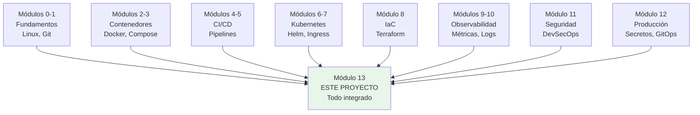

# Módulo 13: Proyecto integrador — pipeline CI/CD completo


## Aprende construyendo

### Tema 1: El pipeline completo — de commit a producción verificada

#### Paso 1 · Objetivo y preparación
Al finalizar vas a trazar, de principio a fin, el pipeline CI/CD completo de RutaFlow: desde un `git push` hasta la verificación post-despliegue con rollback automático si las métricas se degradan. Prerrequisitos: módulos 1-12 completos.

#### Paso 2 · Contexto y caso real
A lo largo del track construiste cada etapa de este pipeline por separado (tests en CI, escaneo de seguridad, Helm, Prometheus, rollback) — nadie confirmó todavía que esas etapas realmente se conectan entre sí como un flujo único y coherente.

#### Paso 3 · Teoría, modelo mental y analogía
Un pipeline CI/CD maduro encadena etapas donde cada una es un gate real: si una falla, la siguiente no se ejecuta — una línea de ensamblaje donde ningún vehículo avanza sin pasar el control de calidad de la estación anterior.

#### Paso 4 · Demostración guiada desde cero

Crea `.github/workflows/complete-pipeline.yml` en tu repositorio y ejecuta el pipeline completo con `git push`:

```text
git push → CI: tests → CI: escaneo Trivy → [¿crítica? → STOP]
                              │ (pasa)
                              ▼
                  build + push a registry (tag = hash del commit)
                              │
                              ▼
              helm upgrade (RollingUpdate, liveness/readinessProbe)
                              │
                              ▼
          verificación: métricas Prometheus vs línea base previa
                              │
              ┌───────────────┴───────────────┐
        normal: fin exitoso          anómalo: rollback automático
```
Resultado esperado: un commit con una vulnerabilidad crítica introducida deliberadamente detiene el pipeline en la etapa de escaneo, antes de llegar a construir o publicar ninguna imagen; un commit limpio atraviesa las seis etapas y termina con el nuevo `Deployment` corriendo y verificado contra sus métricas reales.

#### Paso 5 · Práctica guiada
Pista: configurá el job de escaneo de Trivy para que imprima el reporte de vulnerabilidades pero sin `exit-code: 1` — ese es el fallo deliberado: el pipeline completo "pasa" en verde aunque Trivy haya encontrado una vulnerabilidad crítica real, porque el job de escaneo nunca falla realmente, solo informa; el gate existe en el papel, pero no bloquea nada en la práctica.

#### Paso 6 · Práctica independiente
Corregí el Paso 5 configurando `exit-code: 1` en Trivy para severidad crítica, y agregá `needs: [scan]` explícito en el job de build/push, confirmando que ahora una vulnerabilidad crítica real detiene el pipeline antes de publicar la imagen.

#### Paso 7 · Cierre y evidencia
Entregá el pipeline completo trazado del Paso 4, el gate que no bloqueaba realmente del Paso 5, y la corrección verificada del Paso 6; explicá la diferencia entre un gate que "informa" y un gate que efectivamente detiene el flujo. Siguiente paso: estudia cómo cada módulo del track se conecta en este mismo flujo. Errores comunes: un escaneo de seguridad que solo informa sin bloquear, un despliegue sin verificación post-despliegue real, y un rollback documentado pero nunca ejecutado de verdad. Fuentes oficiales: https://12factor.net/ y https://sre.google/sre-book/.
**¿Por qué es importante?** Ver el pipeline completo operar de principio a fin, con cada gate realmente funcionando, es la validación final de que el conocimiento del track se combina en un sistema coherente, no solo en técnicas aisladas.
**Evidencia de aprendizaje:** entrega pipeline completo trazado, gate sin bloqueo real detectado y corrección verificada con una vulnerabilidad crítica real.
**Conceptos clave:** flujo end-to-end, etapas encadenadas, gates bloqueantes, verificación post-despliegue.

Este proyecto integrador construye, en un único flujo continuo, el pipeline que representa la síntesis de todo el track: un desarrollador hace `git push` de un commit (Módulo 1); esto dispara automáticamente un pipeline de CI (Módulo 4) que ejecuta tests automatizados y, como gate bloqueante, un escaneo de vulnerabilidades con Trivy sobre la imagen construida (Módulo 11); si el escaneo encuentra una vulnerabilidad crítica sin resolver, el pipeline se detiene ahí mismo y no avanza, exactamente como se practicó en el laboratorio del Módulo 11. Si el escaneo pasa, la imagen se etiqueta y se publica en un registry (Módulo 2), y el pipeline continúa hacia la etapa de despliegue.

La etapa de despliegue usa Helm (Módulo 7) para aplicar el chart actualizado con la nueva versión de la imagen contra un clúster de Kubernetes, aprovechando el `Deployment` con estrategia de `RollingUpdate` (Módulo 6) para una transición sin caída de servicio, con los `livenessProbe` y `readinessProbe` configurados (Módulo 7) asegurando que Kubernetes solo enruta tráfico hacia los Pods nuevos una vez que están efectivamente listos para recibirlo. El `HorizontalPodAutoscaler` (Módulo 7) queda activo para ajustar automáticamente la cantidad de réplicas según la carga real observada.

Inmediatamente después del despliegue, la etapa de verificación consulta las métricas expuestas a Prometheus (Módulo 9) —tasa de peticiones, tasa de error, latencia p95— comparando su comportamiento inmediatamente después del despliegue contra la línea base previa; si la tasa de error se eleva de forma anómala tras el despliegue, esto debería disparar automáticamente (o alertar para disparar manualmente) el procedimiento de rollback (Módulo 5), revirtiendo la implementación de Kubernetes al `ReplicaSet` anterior de forma prácticamente instantánea.

Todo este flujo, de principio a fin, es exactamente lo que un pipeline de CI/CD maduro en una organización real ejecuta de forma rutinaria decenas o cientos de veces al día, y cada etapa individual de este flujo es, precisamente, uno de los módulos que ya dominaste de forma aislada en este track; este proyecto integrador es la oportunidad de verlos operar juntos, como un sistema coherente, en vez de como piezas independientes estudiadas por separado.

**Analogía:** un pipeline CI/CD completo es como una línea de ensamblaje de una fábrica de automóviles moderna, donde cada estación de la línea (soldadura, pintura, control de calidad, ensamblaje final, prueba de manejo) corresponde a una etapa específica del pipeline, y ningún vehículo avanza a la siguiente estación hasta que pasa satisfactoriamente el control de calidad de la estación anterior —igual que ningún despliegue avanza hasta pasar el gate de escaneo de seguridad.

**¿Por qué es importante?** Ver el pipeline completo operar de principio a fin, con cada gate y cada verificación realmente funcionando, es la validación final de que el conocimiento adquirido módulo a módulo en este track se combina en un sistema coherente y realmente operativo, no solo en una colección de técnicas aisladas.

**Diagrama:**

```
git push ──▶ CI: tests ──▶ CI: escaneo Trivy ──▶ [¿crítica? ──▶ STOP]
                                    │ (pasa)
                                    ▼
                        build + push a registry
                                    │
                                    ▼
                    Helm upgrade (Deployment RollingUpdate,
                    liveness/readinessProbe, HPA activo)
                                    │
                                    ▼
                verificación: métricas Prometheus/Grafana
                                    │
                    ┌───────────────┴───────────────┐
              normal: fin exitoso          anómalo: rollback (Helm/kubectl)
```

### Tema 2: Uniendo cada módulo del track en un solo flujo

#### Paso 1 · Objetivo y preparación
Al finalizar vas a diseñar explícitamente las conexiones entre etapas del pipeline de RutaFlow: qué resultado de una etapa determina si la siguiente se ejecuta, y cómo se traza un incidente hacia atrás hasta su commit de origen. Prerrequisitos: Tema 1 de este módulo.

#### Paso 2 · Contexto y caso real
Tener cada módulo (CI, escaneo, Helm, observabilidad) funcionando por separado no es lo mismo que tenerlos conectados — nadie confirmó todavía que, ante un incidente real en producción, el equipo pueda reconstruir exactamente qué commit lo causó y qué escaneo pasó o falló en el camino.

#### Paso 3 · Teoría, modelo mental y analogía
La integración horizontal implica que la salida de una etapa se convierte en la entrada de la siguiente, y que cada etapa deja evidencia trazable (tag con hash del commit, logs con correlation ID) que permite reconstruir la cadena completa ante un incidente.

#### Paso 4 · Demostración guiada desde cero

Crea `src/logging/correlation.ts` en tu aplicación Node para propagar el correlation ID, y ejecuta `helm` y `kubectl` para verificar trazabilidad:

```text
Commit (hash) → Imagen etiquetada con ese hash (nunca solo "latest")
      │                              │
      └── trazable hacia atrás ──────┘
                    │
         logs con correlation ID en CADA etapa
                    │
      ante un incidente: ¿qué commit → qué imagen →
      pasó qué escaneo → lo desplegó qué pipeline → cuándo?
```
Resultado esperado: dado un incidente real en producción, el equipo de RutaFlow puede recorrer hacia atrás la cadena completa (imagen corriendo → tag → commit → resultado del escaneo → pipeline que lo desplegó) consultando únicamente el tag de la imagen y los logs con correlation ID, sin ninguna laguna de información.

#### Paso 5 · Práctica guiada
Pista: etiquetá la imagen de producción con `rutaflow:latest` en vez de con el hash del commit, "para no complicar el pipeline" — ese es el fallo deliberado: un incidente en producción un viernes a la noche no permite saber qué commit específico está corriendo realmente, porque `latest` se sobrescribió varias veces desde el último despliegue intencional, y reconstruir la cadena de trazabilidad se vuelve imposible.

#### Paso 6 · Práctica independiente
Corregí el Paso 5 devolviendo el etiquetado al hash del commit (manteniendo `latest` solo como etiqueta adicional de conveniencia), y agregá un correlation ID propagado desde el pipeline de CI hasta los logs de la aplicación desplegada, confirmando que ahora se puede trazar un log específico hasta el pipeline exacto que lo generó.

#### Paso 7 · Cierre y evidencia
Entregá el diseño de conexiones entre etapas del Paso 4, la pérdida de trazabilidad por usar solo `latest` del Paso 5, y la corrección con hash + correlation ID del Paso 6; explicá por qué la mayoría del valor real de un pipeline maduro está en las conexiones entre etapas, no en cada etapa aislada. Siguiente paso: cerrá el track con el checklist final y la reflexión. Errores comunes: etiquetar imágenes de producción únicamente con `latest`, no propagar un correlation ID entre etapas del pipeline y la aplicación desplegada, y dejar implícitas decisiones de orden sin documentarlas. Fuentes oficiales: https://12factor.net/ y https://sre.google/sre-book/.
**¿Por qué es importante?** La mayoría del valor real de un pipeline CI/CD maduro está en las conexiones entre etapas (gates, verificaciones, rollback automático), no en cada etapa aislada.
**Evidencia de aprendizaje:** entrega diseño de conexiones entre etapas, pérdida de trazabilidad detectada y corrección con hash + correlation ID.
**Conceptos clave:** integración horizontal, dependencias entre etapas, trazabilidad end-to-end.

Construir el proyecto integrador no es simplemente ejecutar cada módulo del track por separado en secuencia, sino diseñar deliberadamente las conexiones entre ellos: la salida de una etapa se convierte en la entrada de la siguiente, y el estado de una etapa determina si la siguiente se ejecuta en absoluto. Por ejemplo, el resultado del escaneo Trivy del Módulo 11 (¿aprobado o rechazado?) determina directamente si la etapa de build/push del Módulo 2 se ejecuta; el resultado de la verificación post-despliegue del Módulo 9 (¿métricas normales o anómalas?) determina si se ejecuta el rollback del Módulo 5.

Esta integración horizontal también implica trazabilidad: dado un incidente en producción, debe ser posible recorrer hacia atrás la cadena completa —¿qué versión de la imagen está corriendo?, ¿de qué commit se construyó?, ¿pasó el escaneo de seguridad y con qué resultado exacto?, ¿qué pipeline lo desplegó y cuándo?— sin lagunas de información entre etapas. Etiquetar las imágenes con el hash del commit (no solo con `latest`, un antipatrón mencionado en el Módulo 2), y registrar logs correlacionables con un `correlation ID` (Módulo 10) en cada etapa, son las dos prácticas concretas que hacen posible esta trazabilidad completa de punta a punta.

Diseñar el proyecto integrador también obliga a resolver decisiones de orden que en los módulos individuales quedaban implícitas: ¿el escaneo de seguridad ocurre antes o después del build de la imagen final? (Después, típicamente, escaneando la imagen ya construida, aunque algunas organizaciones también escanean dependencias antes del build). ¿La verificación post-despliegue espera un tiempo fijo o monitorea continuamente durante una ventana? (Una ventana de monitoreo continuo, típicamente varios minutos, detecta mejor problemas que tardan en manifestarse que una verificación puntual inmediata).

Completar honestamente este ejercicio de integración —no solo enumerar qué módulos se conectan, sino realmente trazar cómo fluye la información y las decisiones entre ellos— es lo que distingue a alguien que "conoce Docker, Kubernetes, Terraform y Prometheus por separado" de alguien que "sabe operar un sistema DevOps completo", que es precisamente el objetivo de este track y de este proyecto final.

**Analogía:** conocer cada módulo por separado es como conocer cada instrumento de una orquesta individualmente; integrarlos en un pipeline completo es como dirigir la orquesta entera tocando junta, donde el valor real no está en cada instrumento aislado sino en cómo se coordinan entre sí en el tiempo correcto.

**¿Por qué es importante?** La mayoría del valor real de un pipeline CI/CD maduro está precisamente en las conexiones entre etapas (gates, verificaciones, rollback automático), no en cada etapa aislada; un pipeline que ejecuta las mismas etapas pero sin gates reales que realmente bloqueen, o sin verificación real que dispare rollback real, ofrece mucha menos protección real que uno donde esas conexiones están genuinamente implementadas y probadas.

**Diagrama:**

```
Commit (hash) ──▶ Imagen etiquetada con ese hash (no "latest")
      │                              │
      └── trazable hacia atrás ──────┘
                    │
         logs con correlation ID
         en CADA etapa del pipeline
                    │
      permite reconstruir, ante un incidente:
      ¿qué commit → qué imagen → pasó qué escaneo →
      lo desplegó qué pipeline → cuándo?
```

### Tema 3: Cierre del track — checklist final y reflexión

#### Paso 1 · Objetivo y preparación
Al finalizar vas a auto-evaluar tu dominio de los catorce módulos del track respondiendo, sin consultar notas, un checklist de preguntas concretas sobre decisiones reales de DevOps en RutaFlow. Prerrequisitos: Temas 1-2 de este módulo.

#### Paso 2 · Contexto y caso real
Completar el proyecto integrador no garantiza por sí solo que cada concepto estudiado módulo a módulo quedó consolidado — nadie verificó todavía si podés explicar, sin ayuda, por qué se tomó cada decisión específica del pipeline que acabás de construir.

#### Paso 3 · Teoría, modelo mental y analogía
Aplicar la misma disciplina de checklist usada en producción (Módulo 12) al propio aprendizaje es una forma de verificar honestamente el dominio real, distinto de simplemente haber "visto" cada tema una vez.

#### Paso 4 · Demostración guiada desde cero

Crea `docs/cierre-track-checklist.md` en tu proyecto y documenta tus respuestas, ejecutando `kubectl` para verificar cada decisión:

```text
Checklist de auto-evaluación (sin consultar notas):
1. ¿Diferencia entre Deployment y StatefulSet, y cuándo usar cada uno?
2. ¿Por qué GitOps reduce la superficie de exposición de credenciales
   frente al CD tradicional?
3. ¿Cómo diseñarías, desde cero, un despliegue canary con un umbral
   de rollback automático razonable?
```
Resultado esperado: respondés las tres preguntas con una justificación concreta anclada en una decisión real del pipeline de RutaFlow que construiste, confirmando que el conocimiento quedó conectado a una aplicación práctica, no memorizado de forma aislada.

#### Paso 5 · Práctica guiada
Pista: respondé la pregunta sobre GitOps con una definición genérica copiada ("GitOps es usar Git como fuente de verdad") sin conectarla con ninguna decisión específica del pipeline de RutaFlow — ese es el fallo deliberado: esa respuesta "suena" correcta pero no demuestra que entendiste por qué esa propiedad reduce exposición de credenciales en tu propio pipeline, y no te prepara para defender esa decisión frente a alguien que pregunte "¿por qué no simplemente CD tradicional acá?".

#### Paso 6 · Práctica independiente
Corregí el Paso 5 reescribiendo la respuesta conectándola con una decisión real de tu propio pipeline (el operador de GitOps dentro del clúster nunca necesita credenciales de despliegue externas, a diferencia de un runner de CD tradicional que sí las necesita), y repetí el ejercicio para las otras dos preguntas.

#### Paso 7 · Cierre y evidencia
Entregá el checklist respondido del Paso 4, la respuesta genérica sin anclaje real detectada en el Paso 5, y las tres respuestas reescritas con conexión al pipeline propio del Paso 6; explicá por qué una respuesta "de libro" sin conexión a una decisión real no demuestra dominio genuino. Siguiente paso: aplicá este mismo pipeline completo a un proyecto personal real para consolidarlo de forma duradera. Errores comunes: dar por completado el track sin poder explicar las decisiones propias sin notas, confundir haber "visto" un tema con haberlo dominado, y no conectar este track con el track Cloud que lo complementa directamente. Fuente oficial: https://sre.google/sre-book/.
**¿Por qué es importante?** La reflexión final de consolidación convierte catorce módulos de conocimiento técnico específico en un modelo mental coherente y duradero de cómo opera un sistema DevOps real.
**Evidencia de aprendizaje:** entrega checklist respondido, respuesta genérica sin anclaje detectada y las tres respuestas reescritas con conexión al pipeline propio.
**Conceptos clave:** consolidación, checklist de dominio del track, próximos pasos de aprendizaje.

Al completar este proyecto integrador, vale la pena hacer una pausa deliberada de consolidación, revisando explícitamente los catorce módulos de este track como un cuerpo de conocimiento coherente en vez de una lista de temas independientes: desde los fundamentos de Linux y Git (Módulos 0-1), pasando por Docker y su orquestación local (Módulos 2-3), CI y CD (Módulos 4-5), Kubernetes y su ecosistema (Módulos 6-7), infraestructura como código (Módulo 8), observabilidad y logging (Módulos 9-10), seguridad DevSecOps (Módulo 11), la transición a producción real (Módulo 12), hasta este proyecto integrador final (Módulo 13) que los conecta todos.

Una forma útil de verificar honestamente ese dominio es aplicar la misma disciplina de checklist del Módulo 12 al propio aprendizaje: ¿puedes explicar, sin consultar notas, la diferencia entre un `Deployment` y un `StatefulSet`? ¿Puedes razonar por qué GitOps reduce la superficie de exposición de credenciales frente al CD tradicional? ¿Puedes diseñar, desde cero, una estrategia de despliegue canary con un umbral de rollback automático razonable? Si alguna de estas preguntas genera duda, revisar el módulo correspondiente antes de considerar el track completamente consolidado es una inversión de tiempo bien empleada.

Este track conecta directamente con el track Cloud (donde practicaste directamente contra servicios de AWS/Azure/GCP emulados), y las prácticas de este track —CI/CD, contenedores, Kubernetes, IaC, observabilidad, seguridad— son exactamente las que un equipo de ingeniería real aplica sobre la infraestructura cloud que ese otro track enseña a construir; dominar ambos tracks en conjunto es sustancialmente más valioso que dominar cada uno de forma aislada, porque reflejan cómo trabajan juntos en la práctica real de la industria.

Como paso siguiente natural después de este track, profundizar en cualquiera de sus módulos de forma individual —por ejemplo, explorando Service Mesh en mayor detalle, o profundizando en Chaos Engineering como práctica avanzada de resiliencia— es un camino razonable, así como aplicar directamente este pipeline completo a un proyecto personal real, que es, en última instancia, la mejor forma de consolidar de forma duradera todo lo aprendido en este track.

**Analogía:** completar este proyecto integrador es como terminar de construir el motor completo de un automóvil después de haber estudiado cada pieza por separado (pistones, válvulas, sistema de encendido); ver el motor completo arrancar y funcionar coherentemente es la prueba final de que cada pieza individual fue realmente comprendida, no solo memorizada de forma aislada.

**¿Por qué es importante?** La reflexión final de consolidación no es un paso opcional decorativo: es lo que convierte catorce módulos de conocimiento técnico específico en un modelo mental coherente y duradero de cómo opera un sistema DevOps real de principio a fin, que es, en definitiva, el objetivo genuino de todo el track.

**Diagrama:**



* Código: `docs/cierre-track-checklist.md`

---

## Laboratorio práctico

**Objetivo del laboratorio:** implementar (o documentar con diseño detallado y evidencia de cada etapa) un pipeline CI/CD completo end-to-end, aplicando en conjunto los Módulos 1 a 12 de este track.

**Requisitos previos:** una aplicación de ejemplo con Dockerfile (Módulo 2), un repositorio Git (Módulo 1), acceso a un runner de CI (GitHub Actions es suficiente, Módulo 4), y, idealmente, acceso a un clúster de Kubernetes (Minikube/Kind es suficiente, Módulos 6-7); si no dispones de clúster real, documenta el diseño completo del manifiesto/chart de Helm sin ejecutarlo.

| Paso | Acción | Comando/Configuración | Explicación |
|---|---|---|---|
| 1 | Definir el pipeline de CI con gate de seguridad | Workflow YAML con jobs: `test` → `build` → `scan` (Trivy, `exit-code: 1` en críticas) → `push` | Aplica los Módulos 4 y 11: el escaneo debe poder bloquear el pipeline realmente |
| 2 | Etiquetar la imagen con el hash del commit | `docker build -t registry/app:${{ github.sha }} .` | Aplica el Tema 2: trazabilidad, nunca solo `latest` |
| 3 | Desplegar con Helm a Kubernetes | `helm upgrade --install app ./chart --set image.tag=${{ github.sha }}` | Aplica el Módulo 7: chart parametrizado con el tag exacto de esta versión |
| 4 | Configurar verificación post-despliegue | Consulta PromQL de tasa de error tras el despliegue, comparada contra la línea base de los 10 minutos previos | Aplica el Módulo 9 |
| 5 | Simular un despliegue fallido y ejecutar rollback | Desplegar una versión con un bug deliberado (por ejemplo, que responda 500 en una ruta); ejecutar `helm rollback app` | Aplica el Módulo 5: prueba REAL de que el rollback funciona, no solo documentado |
| 6 | Escribir el runbook de incidentes | Documento breve: síntoma → diagnóstico → escalación → rollback manual si el automático falla | Cierra la checklist del Módulo 12 |

**Verificación:** el proyecto se considera completo si el gate de seguridad del paso 1 efectivamente detiene el pipeline ante una vulnerabilidad crítica simulada (puedes usar una imagen base antigua deliberadamente para provocarla), y si el rollback del paso 5 fue ejecutado y verificado realmente, no solo descrito en teoría.

**Errores comunes y soluciones**

- **El escaneo de seguridad se ejecuta pero no bloquea nada realmente ante una vulnerabilidad crítica.** Verifica que el `exit-code` de Trivy esté configurado para fallar el job (no solo imprimir un reporte informativo), y que el job de escaneo sea una dependencia explícita (`needs:`) del job de push.
- **El rollback nunca se prueba realmente, solo se documenta.** Ejecuta deliberadamente el escenario de fallo del paso 5; un procedimiento de rollback no probado tiene un riesgo real de no funcionar exactamente cuando más se necesita.
- **Las imágenes se etiquetan con `latest`, perdiendo trazabilidad.** Etiqueta siempre con el hash del commit (o un número de versión semántico), reservando `latest` únicamente como una etiqueta adicional de conveniencia, nunca como la única referencia usada para el despliegue.

---
