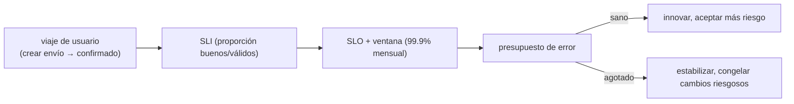
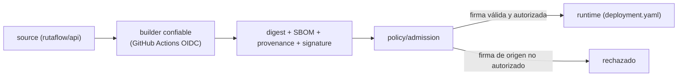
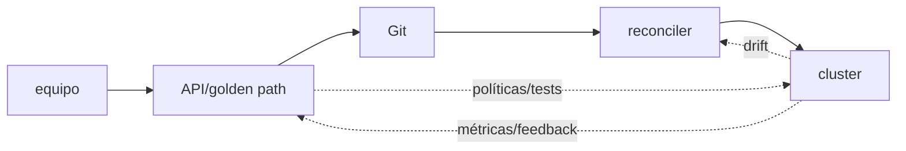

# Módulo 14: SRE y plataforma — confiabilidad, incidentes y supply chain

Automatizar despliegues es el comienzo, no el final. Un sistema profesional define qué significa estar sano, limita el riesgo de cambio, conserva procedencia de artefactos y aprende de incidentes. Este módulo conecta DevOps, SRE, seguridad de cadena de suministro y platform engineering mediante evidencia operativa.


## Aprende construyendo

### Tema 1: Confiabilidad es una expectativa cuantificada

#### Paso 1 · Objetivo y preparación
Al finalizar vas a definir un SLI/SLO para el viaje "crear un envío y verlo confirmado" en la API de RutaFlow, y a calcular cuánto presupuesto de error queda disponible en la ventana actual. Prerrequisitos: Módulo 9 completo.

#### Paso 2 · Contexto y caso real
El equipo de RutaFlow discute si la API "está estable" basándose en impresiones subjetivas de cada persona — nadie definió todavía una medida objetiva y compartida de qué significa "estable" para el viaje crítico de crear un envío.

#### Paso 3 · Teoría, modelo mental y analogía
Un SLI es una proporción medible de eventos buenos sobre válidos; un SLO fija el objetivo durante una ventana; el presupuesto de error es el margen restante antes de incumplir ese objetivo — combustible para cambiar con velocidad controlada, no permiso para ignorar fallos.

#### Paso 4 · Demostración guiada desde cero

Ejecuta `docker` para levantar Prometheus y ejecuta `npm` para instrumentar tu aplicación Node. La consulta PromQL calcula tu SLI:

```promql
sum(rate(http_requests_total{route="/envios",code=~"2.."}[5m]))
/
sum(rate(http_requests_total{route="/envios"}[5m]))
```
Resultado esperado: esta consulta devuelve la proporción real de peticiones exitosas a `/envios` en los últimos 5 minutos; comparada contra un SLO de 99.9% mensual, permite calcular cuánto del presupuesto de error ya se consumió en lo que va del mes.

#### Paso 5 · Práctica guiada
Pista: definí el SLO de disponibilidad para `/envios` como "100% — nunca debería fallar" — ese es el fallo deliberado: con ese objetivo, cualquier error consume presupuesto y dispara alertas constantes, y un objetivo de 100% suele ser económicamente imposible además de frenar cualquier cambio que introduzca el más mínimo riesgo, incluso mejoras reales al producto.

#### Paso 6 · Práctica independiente
Corregí el Paso 5 definiendo un SLO realista (99.9% mensual) basado en el comportamiento histórico real de `/envios`, y calculá explícitamente cuántos minutos de presupuesto de error representa ese 0.1% en un mes de 30 días.

#### Paso 7 · Cierre y evidencia
Entregá el SLI/SLO definido en el Paso 4, el SLO de 100% económicamente inviable del Paso 5, y el cálculo de presupuesto en minutos del Paso 6; explicá por qué un SLO de 100% no es "más seguro" sino contraproducente en la práctica. Siguiente paso: estudia cómo una alerta debe conducir a una acción. Errores comunes: definir SLOs sin basarse en el comportamiento histórico real del servicio, confundir SLO con SLA, y no definir explícitamente qué eventos cuentan como "válidos" antes de medir. Fuentes oficiales: https://sre.google/sre-book/service-level-objectives/ y https://prometheus.io/docs/practices/instrumentation/.
**¿Por qué es importante?** Un SLI/SLO alinea ingeniería y producto con una regla observable, en vez de discutir si el servicio "parece estable".
**Evidencia de aprendizaje:** entrega consulta SLI, SLO de 100% inviable detectado y presupuesto de error calculado en minutos.
**Conceptos clave:** user journey, SLI, SLO, SLA, error budget, availability, latency, correctness, window, burn rate y toil.

Empieza por una experiencia: “crear una tarea y verla confirmada”. Un SLI es una proporción medible de eventos buenos sobre válidos; un SLO fija el objetivo durante una ventana. Un SLA es compromiso contractual y no debe confundirse con el objetivo interno. 100% suele ser económicamente imposible e incluso frena cambios que mejorarían el producto.

```promql
sum(rate(http_requests_total{route="/tasks",code=~"2.."}[5m]))
/
sum(rate(http_requests_total{route="/tasks"}[5m]))
```

Define eventos válidos y exclusiones antes de mirar el resultado. Para 99.9% mensual, el 0.1% restante es presupuesto de error. Si se consume rápido, reduce cambios riesgosos y prioriza confiabilidad; si permanece saludable, existe espacio para evolucionar. Usa burn rate en ventanas corta y larga para detectar consumo rápido sin alertar por cada error aislado.

**Analogía:** el presupuesto de error es combustible para cambiar con velocidad controlada, no permiso para ignorar fallos.

**¿Por qué es importante?** porque alinea ingeniería y producto con una regla observable en vez de discutir si “parece estable”.

**Casos de uso reales:** API disponible pero incorrecta, dependencia excluida artificialmente, SLO imposible, freeze de cambios y latencia que afecta conversión.

**Diagrama:**



En el proyecto integrador RutaFlow, este SLI se calcularía contra el mismo
`examples/rutaflow/devops/deployment.yaml` que expone `/envios` vía `rutaflow-delivery-api` —
sus `readinessProbe`/`livenessProbe` no conviene confundirlos con el SLO de negocio: una Pod
puede estar "lista" (probe verde) y el viaje completo igual estar fuera del SLO si la
dependencia de DynamoDB (Módulo Cloud 4) responde lenta.

### Tema 2: Una alerta debe conducir a una acción

#### Paso 1 · Objetivo y preparación
Al finalizar vas a configurar una alerta de "fast burn" sobre el presupuesto de error de `/envios`, con labels y annotations correctamente separados, y un runbook vinculado. Prerrequisitos: Tema 1 de este módulo.

#### Paso 2 · Contexto y caso real
El equipo de RutaFlow tiene una alerta que se dispara varias veces por semana sin que nadie sepa qué acción tomar al recibirla — termina silenciada por fatiga, exactamente el problema que una alerta bien diseñada debería evitar.

#### Paso 3 · Teoría, modelo mental y analogía
Una página debe despertar a una persona solo si exige acción inmediata; los labels participan en enrutamiento y agrupación, las annotations transportan contexto humano. La analogía es una alarma de incendio útil que indica zona y procedimiento, no una sirena constante que termina ignorada.

#### Paso 4 · Demostración guiada desde cero

Configura tu Prometheus con el YAML de alertas y ejecuta `kubectl` para aplicar el AlertManager:

```yaml
- alert: FastErrorBudgetBurnEnvios
  expr: job:slo_errors_per_request:ratio_rate5m{route="/envios"} > (14.4 * 0.001)
  for: 2m
  labels: { severity: page, service: rutaflow-api }
  annotations:
    summary: "La API de envíos consume rápidamente su presupuesto de error"
    runbook: "https://runbooks.rutaflow.app/envios-api/high-burn"
```
Resultado esperado: esta alerta se dispara únicamente cuando la tasa de consumo de presupuesto es lo bastante rápida como para agotarlo en horas, señalando urgencia genuina; quien la recibe abre directamente el runbook vinculado en `annotations.runbook` y sabe qué verificar primero.

#### Paso 5 · Práctica guiada
Pista: agregá el `request_id` de la última petición fallida como un label adicional "para tener más contexto" — ese es el fallo deliberado: como cada petición tiene un `request_id` distinto, Prometheus trata cada valor único como una serie temporal completamente nueva, multiplicando sin límite la cardinalidad de series activas.

#### Paso 6 · Práctica independiente
Corregí el Paso 5 moviendo el `request_id` a `annotations` (donde sí pertenece el contexto de alta cardinalidad), dejando en `labels` únicamente valores pequeños y estables como `severity` y `service`.

#### Paso 7 · Cierre y evidencia
Entregá la alerta con labels/annotations correctos del Paso 4, la cardinalidad descontrolada provocada en el Paso 5, y la corrección del Paso 6; explicá por qué un identificador de alta cardinalidad en un label multiplica series, mientras que en una annotation no tiene ese costo. Siguiente paso: estudia por qué construir una imagen no demuestra de dónde proviene. Errores comunes: colocar identificadores de alta cardinalidad en labels en vez de annotations, alertas sin runbook vinculado, y alertar por causa interna en vez de por síntoma observado por el usuario. Fuentes oficiales: https://prometheus.io/docs/practices/naming/ y https://sre.google/workbook/alerting-on-slos/.
**¿Por qué es importante?** Detectar sin responder solo transforma fallos técnicos en fatiga humana; una alerta bien diseñada lleva directamente a una acción concreta.
**Evidencia de aprendizaje:** entrega alerta con labels/annotations correctos, cardinalidad descontrolada detectada y corrección verificada.
**Conceptos clave:** symptom, cause, page, ticket, runbook, incident commander, severity, timeline, mitigation, recovery, game day y blameless postmortem.

Alerta por síntomas de usuario y consumo de presupuesto; usa métricas causales para diagnóstico. Una página despierta a una persona solo si exige acción inmediata. Cada alerta tiene propietario, severidad, enlace a dashboard y runbook con verificación y contención segura.

En esta regla, `labels` y `annotations` son metadatos con responsabilidades diferentes. Los **labels** tienen valores pequeños y estables que participan en agrupación, enrutamiento y silencios (`severity`, `team`, `service`); cambiar un label puede crear una serie distinta y alterar a quién se notifica. Las **annotations** transportan contexto humano que no identifica la alerta, como resumen, descripción y enlace al runbook. No coloques identificadores de petición, mensajes completos de error ni valores de alta cardinalidad en labels: multiplican series y elevan memoria, almacenamiento y coste de consulta.

Para leer el flujo: Prometheus evalúa `expr`; si permanece verdadera durante `for`, crea la alerta con sus labels y annotations; Alertmanager agrupa y enruta principalmente por labels; la persona abre el runbook indicado en annotations. Este modelo permite verificar cada frontera por separado en vez de tratar el YAML como configuración “mágica”.

```yaml
- alert: FastErrorBudgetBurn
  expr: job:slo_errors_per_request:ratio_rate5m > (14.4 * 0.001)
  for: 2m
  labels: { severity: page }
  annotations:
    summary: "La API consume rápidamente su presupuesto de error"
    runbook: "https://runbooks.example/tasks-api/high-burn"
```

Durante incidente separa coordinación, operaciones y comunicación. Mitiga primero, investiga después. Conserva timeline factual. El postmortem evita culpa individual y busca condiciones del sistema: controles faltantes, acoplamiento, documentación o carga. Las acciones tienen dueño y fecha. Un game day introduce un fallo acotado para verificar detección, autoridad, rollback y comunicación.

**Analogía:** una alarma de incendio útil indica zona y procedimiento; una sirena constante termina ignorada.

**¿Por qué es importante?** porque detectar sin responder solo transforma fallos técnicos en fatiga humana.

**Casos de uso reales:** alerta ruidosa sin runbook, rollback sin permisos, dependencia caída, certificado vencido y postmortem con acciones olvidadas.

**Diagrama:**

```text
detectar -> declarar -> roles -> contener -> recuperar
                                      -> timeline -> aprender -> acciones
```

### Tema 3: Construir una imagen no demuestra de dónde proviene

#### Paso 1 · Objetivo y preparación
Al finalizar vas a generar el SBOM de la imagen de RutaFlow y a firmarla con `cosign`, verificando que solo se acepte una imagen firmada por el pipeline de CI real. Prerrequisitos: Tema 2 de este módulo.

#### Paso 2 · Contexto y caso real
Cualquiera con acceso al registry de RutaFlow podría, en teoría, subir una imagen con el mismo nombre pero construida fuera del pipeline oficial — sin procedencia verificable, el clúster no puede distinguir esa imagen de una legítima.

#### Paso 3 · Teoría, modelo mental y analogía
Un SBOM inventaría componentes, una firma vincula identidad con digest; ninguno por sí solo prueba ausencia de vulnerabilidad, pero juntos permiten rechazar lo que no proviene del builder confiable. La analogía: el SBOM es la lista de ingredientes; la firma sella el paquete; la procedencia registra la cocina.

#### Paso 4 · Demostración guiada desde cero

Ejecuta `syft` para generar SBOM y `cosign` para verificar firmas de tu imagen:

```bash
syft packages registry.rutaflow.app/api@sha256:ABC -o cyclonedx-json > sbom.json
cosign verify \
  --certificate-identity-regexp='github.com/rutaflow/api/' \
  --certificate-oidc-issuer='https://token.actions.githubusercontent.com' \
  registry.rutaflow.app/api@sha256:ABC
```
Resultado esperado: `cosign verify` confirma que la imagen con ese digest exacto fue firmada específicamente por el workflow de GitHub Actions del repositorio `rutaflow/api`, mediante una identidad OIDC emitida por GitHub — no por cualquier firma válida de cualquier origen.

#### Paso 5 · Práctica guiada
Pista: quitá `--certificate-identity-regexp` de la verificación, dejando solo que la firma sea criptográficamente válida sin importar de qué repositorio — ese es el fallo deliberado: una imagen firmada legítimamente por el pipeline de OTRO proyecto distinto (con una identidad OIDC real pero no autorizada para RutaFlow) pasaría la verificación igual.

#### Paso 6 · Práctica independiente
Corregí el Paso 5 restaurando `--certificate-identity-regexp` apuntando específicamente al repositorio `rutaflow/api`, y agregá una política de admisión en el clúster que rechace cualquier imagen sin esa firma verificada.

#### Paso 7 · Cierre y evidencia
Entregá la verificación de SBOM + firma del Paso 4, la aceptación de un origen no autorizado del Paso 5, y la política de admisión del Paso 6; explicá por qué una firma criptográficamente válida no es lo mismo que una firma del origen específicamente autorizado. Siguiente paso: estudia por qué una plataforma interna es un producto con límites. Errores comunes: verificar solo que una firma es válida sin restringir de qué identidad debe provenir, reconstruir "la misma versión" para producción en vez de promover el mismo digest exacto, y conceder excepciones de vulnerabilidad sin fecha de vencimiento. Fuentes oficiales: https://docs.sigstore.dev/cosign/verifying/verify/ y https://slsa.dev/.
**¿Por qué es importante?** El pipeline y sus dependencias son parte del producto desplegado; sin procedencia verificable, construir una imagen no demuestra de dónde proviene realmente.
**Evidencia de aprendizaje:** entrega SBOM y firma verificados, aceptación de origen no autorizado detectada y política de admisión confirmada.
**Conceptos clave:** dependency graph, SBOM, provenance, digest, signature, attestation, trusted builder, least privilege, OIDC, admission policy, SLSA y reproducibility.

Fija dependencias y acciones por versión/digest, reduce permisos y usa credenciales efímeras mediante identidad federada. Un SBOM inventaría componentes; no afirma que sean seguros. Un escáner compara hallazgos conocidos; tampoco prueba ausencia de vulnerabilidad. La procedencia describe quién y cómo construyó. Una firma vincula identidad con digest; solo es útil si el consumidor verifica política y protege la identidad firmante.

```bash
syft packages registry.example/tasks@sha256:ABC -o cyclonedx-json > sbom.json
cosign verify \
  --certificate-identity-regexp='github.com/example/tasks/' \
  --certificate-oidc-issuer='https://token.actions.githubusercontent.com' \
  registry.example/tasks@sha256:ABC
```

En el comando de `cosign verify`, `--certificate-identity-regexp` es la bandera que fija qué identidad (repositorio de origen) debe haber firmado la imagen; `--certificate-oidc-issuer` es la bandera que fija qué proveedor OIDC debe haber emitido esa identidad (aquí, GitHub Actions) — juntas evitan aceptar una firma válida pero de un origen no autorizado.

Promueve exactamente el mismo digest entre ambientes. Nunca reconstruyas “la misma versión” para producción. Conserva attestations y bloquea en admisión imágenes sin procedencia permitida. Las excepciones de vulnerabilidad requieren alcance, justificación, compensación y vencimiento.

**Analogía:** el SBOM es la lista de ingredientes; la firma sella el paquete; la procedencia registra la cocina. Ninguno sustituye inspección y política.

**¿Por qué es importante?** porque el pipeline y sus dependencias son parte del producto desplegado.

**Casos de uso reales:** action comprometida, tag mutable, paquete transitivo vulnerable, imagen reconstruida y firma válida de identidad no autorizada.

**Diagrama:**



Antes de confiar en la firma, confirmá que el clúster de RutaFlow realmente exige verificación
en admisión, no solo que `cosign verify` funcione en tu terminal:

```bash
kubectl get validatingwebhookconfiguration cosign-policy -o yaml
```

Resultado esperado: el webhook existe y referencia la misma política de identidad OIDC del
Paso 4 — sin este paso, `cosign verify` manual es solo una comprobación de desarrollador, no una
garantía del clúster. En el proyecto integrador RutaFlow, esta política protegería exactamente
`rutaflow-delivery-api` en `examples/rutaflow/devops/deployment.yaml`.

### Tema 4: Una plataforma interna es un producto con límites

#### Paso 1 · Objetivo y preparación
Al finalizar vas a escribir una política Rego que rechace en el clúster de RutaFlow cualquier Pod que corra como root, y a medir el tiempo hasta el primer deploy exitoso de un desarrollador nuevo usando el golden path. Prerrequisitos: Tema 3 de este módulo.

#### Paso 2 · Contexto y caso real
Un desarrollador nuevo en el equipo de RutaFlow tardó tres días en lograr su primer despliegue exitoso, copiando YAML de otros servicios por ensayo y error — nadie midió ese tiempo como una métrica real de la plataforma interna hasta que se volvió un problema visible.

#### Paso 3 · Teoría, modelo mental y analogía
Policy as code aplica límites antes y durante el despliegue como software verificable; un golden path provee plantilla, pipeline y soporte para el caso común, permitiendo escape consciente cuando el dominio lo requiere. La analogía: una carretera bien señalizada con barreras, no una que obligue a todos los vehículos a ser iguales.

#### Paso 4 · Demostración guiada desde cero
```rego
package kubernetes.admission

deny[msg] {
  input.kind.kind == "Pod"
  c := input.spec.containers[_]
  not c.securityContext.runAsNonRoot
  msg := sprintf("%s debe ejecutar como non-root", [c.name])
}
```
Resultado esperado: un Pod de RutaFlow que no declara `runAsNonRoot: true` en su `securityContext` es rechazado en el momento de la admisión, con un mensaje específico que indica exactamente qué contenedor y qué regla violó.

#### Paso 5 · Práctica guiada
Pista: medí la "adopción de la plataforma" contando únicamente cuántos equipos usan el golden path, sin medir el tiempo real hasta el primer deploy exitoso ni los tickets de soporte generados — ese es el fallo deliberado: esa métrica puede mostrar "alta adopción" mientras los equipos abren decenas de tickets porque el golden path es confuso, ocultando un problema real detrás de un número que solo mide uso forzado.

#### Paso 6 · Práctica independiente
Corregí el Paso 5 agregando métricas de producto reales a la plataforma (tiempo hasta primer deploy, tickets de soporte por equipo, encuesta de satisfacción), y medí el tiempo real del próximo desarrollador nuevo que use el golden path desde cero.

#### Paso 7 · Cierre y evidencia
Entregá la política Rego del Paso 4, la métrica de adopción incompleta del Paso 5, y las métricas de producto corregidas del Paso 6; explicá por qué "centralizar sin escuchar" crea otro cuello de botella en vez de resolver el problema original. Siguiente paso: cerrá el módulo integrando SLO, alertas, supply chain y platform engineering en la operación completa de RutaFlow. Errores comunes: medir adopción de una plataforma interna sin medir satisfacción ni tiempo real de onboarding, escribir políticas sin mensajes de error reparables, y centralizar la plataforma sin ningún canal de feedback de los equipos que la usan. Fuentes oficiales: https://www.openpolicyagent.org/docs/latest/ y https://internaldeveloperplatform.org/.
**¿Por qué es importante?** Estandarizar solo YAML no reduce la carga cognitiva ni crea una experiencia operable; una plataforma interna es un producto que se mide con las mismas métricas que cualquier producto real.
**Evidencia de aprendizaje:** entrega política Rego funcionando, métrica de adopción incompleta detectada y métricas de producto corregidas.
**Conceptos clave:** GitOps, reconciliation, drift, pull model, policy as code, golden path, self-service, platform API, tenancy, guardrail, developer experience y product metrics.

GitOps declara estado versionado y un reconciler converge el entorno. El repositorio no debe guardar secretos en claro; usa referencias o cifrado con gestión de claves. Separa promoción de configuración, controla quién aprueba y evita cambios manuales permanentes. Drift debe reconciliarse o documentarse, no normalizarse.

Policy as code aplica límites antes y durante despliegue: imágenes firmadas, recursos, namespaces, red y privilegios. Prueba políticas como software y ofrece mensajes reparables. Un golden path proporciona plantilla, pipeline, telemetría, documentación y soporte para el caso común, permitiendo escape consciente cuando el dominio lo requiere.

```rego
package kubernetes.admission

deny[msg] {
  input.kind.kind == "Pod"
  c := input.spec.containers[_]
  not c.securityContext.runAsNonRoot
  msg := sprintf("%s debe ejecutar como non-root", [c.name])
}
```

Mide la plataforma como producto: tiempo hasta primer deploy, éxito de pipelines, adopción, tickets, satisfacción y carga cognitiva. Centralizar sin escuchar crea otro cuello de botella. Define ownership, compatibilidad y deprecación de la API de plataforma.

**Analogía:** un golden path es una carretera bien señalizada con barreras; no obliga a todos los vehículos a ser iguales, pero hace seguro el viaje común.

**¿Por qué es importante?** porque estandarizar solo YAML no reduce la carga cognitiva ni crea una experiencia operable.

**Casos de uso reales:** drift manual, secreto en Git, política incomprensible, plantilla abandonada y plataforma que aumenta tickets.

**Diagrama:**



Aplicá y probá esta política contra el mismo manifiesto del proyecto integrador RutaFlow:

```bash
opa eval -d policy.rego -i examples/rutaflow/devops/deployment.yaml \
  'data.kubernetes.admission.deny'
kubectl apply --dry-run=server -f examples/rutaflow/devops/deployment.yaml
```

Resultado esperado: `opa eval` devuelve un arreglo vacío porque
`rutaflow-delivery-api` ya declara `runAsNonRoot: true` en su `securityContext` — si alguien
quitara esa línea, la política lo rechazaría antes de llegar al clúster, no después. No
conviene medir adopción del golden path solo por cuántos equipos lo usan: ese número no
distingue adopción real de uso forzado sin alternativa.

## Revisión oficial de plataforma — julio de 2026

### Kubernetes 1.36, OpenTelemetry 1.59 y herramientas con ciclo propio

La revisión usa **Kubernetes 1.36** y **OpenTelemetry 1.59** como referencias, pero clusters gestionados, `kubectl`, APIs y add-ons no avanzan necesariamente juntos. Revisa deprecaciones y APIs removidas antes de subir una versión menor. OpenTelemetry define señales, SDK, OTLP y convenciones; no es el backend. **Terraform** y sus providers tienen ciclos separados: fija restricciones, lockfile y prueba el plan con cada actualización.

**Aplicación al proyecto:** escanea manifiestos por APIs obsoletas, prueba skew soportado de kubectl, valida Collector/configuración y semantic conventions, y ejecuta plan más pruebas de política antes de actualizar provider o core.


## Laboratorio práctico

1. Define dos viajes críticos, SLIs, SLOs, ventana y presupuesto. Construye dashboard y burn-rate alert.
2. Escribe runbook y ejecuta un game day: rompe una dependencia, declara, contiene, recupera y redacta postmortem.
3. Genera SBOM y procedencia, firma por digest con identidad OIDC y verifica antes del despliegue.
4. Configura reconciliación GitOps local y una política que rechace imagen sin digest o contenedor privilegiado.
5. Publica un golden path mínimo con plantilla, documentación, escape y métricas de adopción.

La entrega incluye repositorio reproducible, consultas, alertas, timeline, evidencias criptográficas, pruebas de política y decisión arquitectónica.

<!-- OFFICIAL-TOPIC-ATLAS:START -->
## Atlas completo de temas oficiales

Derivado de la [documentación oficial](https://kubernetes.io/docs/concepts/), sus referencias, migraciones y guías de operación. Inventariar no equivale a dominar: cada selección se demuestra con código, prueba, medición y explicación. **Cobertura: 60 temas.**

| Área | Temas que deben poder explicarse y aplicarse | Evidencia práctica |
|---|---|---|
| Sistemas | `Linux` · `processes` · `signals` · `permissions` · `systemd` · `networks` · `DNS` · `TLS` · `storage` · `troubleshooting` · `scripting` | plataforma |
| Contenedores | `OCI` · `image layers` · `BuildKit` · `rootless` · `Compose` · `registries` · `scanning` · `SBOM` · `signatures` · `runtime security` | plataforma |
| CI/CD | `pipelines` · `quality gates` · `immutable artifacts` · `environments` · `promotion` · `progressive delivery` · `rollback` · `GitOps` | plataforma |
| Kubernetes | `architecture` · `Pods` · `workloads` · `Services` · `Gateway API` · `storage` · `secrets` · `RBAC` · `policies` · `scheduling` · `autoscaling` · `operators` | plataforma |
| IaC | `Terraform language` · `modules` · `remote state y locking` · `providers` · `import` · `testing` · `policy as code` · `drift` · `secrets` | plataforma |
| Operación | `OpenTelemetry` · `logs metrics traces` · `SLI y SLO` · `burn-rate alerts` · `incidents` · `capacity` · `chaos` · `restore` · `FinOps` · `platform engineering` | plataforma |

### Método de estudio y proyecto de ampliación

Para cada tema responde qué problema resuelve, cuál es su modelo mental, cómo falla, cómo se verifica y cuándo no conviene. Elige uno por área e intégralos en un proyecto propio de ampliación. Entrega diagrama, ADR, pruebas de éxito y fallo, una medición, una amenaza y el enlace oficial con versión y fecha. Una API preview se aísla en laboratorio y nunca se presenta como base estable.
<!-- OFFICIAL-TOPIC-ATLAS:END -->

