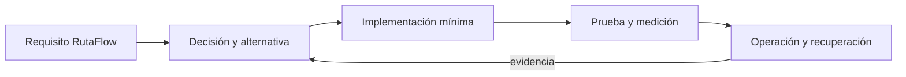

# Módulo 15: DevOps Master: GitOps, Service Mesh y DevSecOps

## Sílabo

**Objetivo general:** dominar las capacidades avanzadas señaladas en la auditoría del track mediante una ampliación ejecutable de RutaFlow, decisiones justificadas, pruebas, seguridad y evidencia operacional.

**Resultados observables:** explicar cada tecnología sin depender de marcas; implementar un incremento pequeño; comparar alternativas; provocar un fallo; medir el resultado; y escribir un runbook de recuperación.

**Evaluación:** 20 % fundamento, 35 % implementación, 25 % pruebas y fallos, 10 % seguridad, 10 % documentación y comunicación.

## Comienza desde cero: prepara este capítulo

Este recorrido parte de una carpeta vacía. Al finalizar tendrás **Un incremento pequeño, probado y reproducible del capítulo.** No avances ejecutando comandos que no comprendes: primero identifica la entrada, la transformación y la evidencia que comprobará el resultado.

### 1. Comprueba las herramientas

Los comandos funcionan en macOS, Linux y WSL. En PowerShell usa el equivalente indicado por la herramienta.

```bash
git --version
docker --version
bash --version
```

Si un comando no existe, detente e instala esa herramienta desde su sitio oficial. Cierra y abre la terminal después de modificar `PATH`. Las versiones deben ser compatibles entre sí antes de crear archivos.

### 2. Crea o recupera el proyecto del track

```bash
mkdir -p academia-labs/devops/{app,infra,scripts,evidence}
cd academia-labs/devops
git init
```

Trabaja dentro de `academia-labs/devops`. Si ya existe, no lo vuelvas a generar: entra en la carpeta, confirma `git status` y continúa sobre una rama propia.

### 3. Ubica cada tema antes de escribir

```text
academia-labs/devops/
├─ infra/
│  └─ module-15/
├─ tests/
├─ docs/decisions/
├─ evidence/module-15/
└─ README.md
```

| Tema | Archivo o decisión | Evidencia mínima |
|---|---|---|
| 1. Docker y Compose avanzados | `infra/module-15/topic-1-docker-y-compose-avanzados.yaml` | prueba + salida observable |
| 2. Kubernetes extensible y Helm avanzado | `infra/module-15/topic-2-kubernetes-extensible-y-helm-avanzado.yaml` | prueba + salida observable |
| 3. Service Mesh con Istio o Linkerd | `infra/module-15/topic-3-service-mesh-con-istio-o-linkerd.yaml` | prueba + salida observable |
| 4. GitOps con Argo CD y Flux | `infra/module-15/topic-4-gitops-con-argo-cd-y-flux.yaml` | prueba + salida observable |
| 5. Ansible, inventarios, roles y Vault | `infra/module-15/topic-5-ansible-inventarios-roles-y-vault.yaml` | prueba + salida observable |
| 6. DevSecOps y métricas DORA | `infra/module-15/topic-6-devsecops-y-metricas-dora.yaml` | prueba + salida observable |
| 7. Introducción a DevOps | `docs/decisions/module-15-topic-7.md` | contexto + alternativas + decisión + consecuencias |
| 8. Virtualización y Contenedores | `docs/decisions/module-15-topic-8.md` | contexto + alternativas + decisión + consecuencias |
| 9. Git y GitHub | `docs/decisions/module-15-topic-9.md` | contexto + alternativas + decisión + consecuencias |
| 10. Jenkins | `docs/decisions/module-15-topic-10.md` | contexto + alternativas + decisión + consecuencias |
| 11. ELK Stack | `docs/decisions/module-15-topic-11.md` | contexto + alternativas + decisión + consecuencias |
| 12. DORA Metrics | `docs/decisions/module-15-topic-12.md` | contexto + alternativas + decisión + consecuencias |
| 13. eBPF y observabilidad de kernel | `docs/decisions/module-15-topic-13.md` | contexto + alternativas + decisión + consecuencias |
| 14. Ingeniería de releases | `docs/decisions/module-15-topic-14.md` | contexto + alternativas + decisión + consecuencias |
| 15. Recuperación ante desastres | `docs/decisions/module-15-topic-15.md` | contexto + alternativas + decisión + consecuencias |
| 16. Seguridad orientada al desarrollo | `docs/decisions/module-15-topic-16.md` | contexto + alternativas + decisión + consecuencias |
| 17. Gestión de configuración | `docs/decisions/module-15-topic-17.md` | contexto + alternativas + decisión + consecuencias |
| 18. Tubería de despliegue | `docs/decisions/module-15-topic-18.md` | contexto + alternativas + decisión + consecuencias |
| 19. Parámetros de configuración | `docs/decisions/module-15-topic-19.md` | contexto + alternativas + decisión + consecuencias |
| 20. Herramientas DevOps | `docs/decisions/module-15-topic-20.md` | contexto + alternativas + decisión + consecuencias |
| 21. Virtualización y redes | `docs/decisions/module-15-topic-21.md` | contexto + alternativas + decisión + consecuencias |
| 22. Medición y seguridad | `docs/decisions/module-15-topic-22.md` | contexto + alternativas + decisión + consecuencias |
| 23. Gestión de contenedores | `docs/decisions/module-15-topic-23.md` | contexto + alternativas + decisión + consecuencias |
| 24. Comunicación y colaboración | `docs/decisions/module-15-topic-24.md` | contexto + alternativas + decisión + consecuencias |
| 25. Necesidades organizativas | `docs/decisions/module-15-topic-25.md` | contexto + alternativas + decisión + consecuencias |
| 26. Pruebas de software | `docs/decisions/module-15-topic-26.md` | contexto + alternativas + decisión + consecuencias |

Un ejemplo técnico vive en el archivo indicado y debe tener una prueba. Un tema conceptual vive en `docs/decisions/`: compara opciones usando restricciones medibles; no escribas código decorativo solo para llenar espacio.

### 4. Ejecuta una línea base

Desde `academia-labs/devops`:

```bash
docker compose config
```

**Resultado esperado:** el comando reconoce el proyecto y termina sin errores antes de introducir el cambio del capítulo. Después del incremento, la evidencia debe demostrar: **Un incremento pequeño, probado y reproducible del capítulo.**

Si falla la línea base, no continúes. Localiza el primer mensaje que indique archivo, línea o dependencia; formula una causa y compruébala con un cambio pequeño.

### 5. Provoca un fallo y recupérate

Rompe una referencia, variable o healthcheck y localiza la causa con la validación o los logs. Guarda en `evidence/module-15/` el comando, la salida relevante, tu hipótesis y la corrección. Revierte únicamente el cambio deliberado; no borres todo el proyecto para ocultar la causa.

### 6. Conecta el capítulo con RutaFlow

Aplica el aprendizaje de **DevOps Master: GitOps, Service Mesh y DevSecOps** a un incremento vertical de RutaFlow. Define qué componente produce el dato, qué contrato lo transporta, quién lo consume y cómo observarás un fallo. La entrega final incluye archivo o decisión, prueba, salida, error corregido y una limitación que todavía validarías en producción.

---

## Contenido teórico

### Tema 1: Docker y Compose avanzados

**Conceptos clave:** propósito, modelo de ejecución, configuración, seguridad, coste, pruebas y operación.

Docker y Compose avanzados se estudia como una decisión de ingeniería y no como una colección de comandos. Primero identifica el problema que resuelve y los límites de la plataforma; luego construye el incremento mínimo dentro de RutaFlow. Registra entradas, salidas, dependencias y condiciones de fallo. Compara al menos una alternativa y conserva la medición que justifica la elección. Si la tecnología es experimental, se aísla del camino estable y se documenta la estrategia de retirada.

En producción debes considerar configuración por ambiente, identidad de máquina y persona, secretos, compatibilidad, telemetría y recuperación. Una demostración exitosa no prueba comportamiento bajo concurrencia, reintentos, pérdida de red o datos inválidos. Por eso el laboratorio introduce un fallo deliberado y exige una prueba de regresión. El resultado debe poder repetirse desde terminal y CI sin pasos secretos del editor.

**Analogía:** es como incorporar una nueva estación a una red logística: no basta con construirla; hay que definir rutas, capacidad, controles, contingencias y cómo sabremos que funciona.

**¿Por qué es importante?** Porque Docker y Compose avanzados aparece cuando el sistema crece y las decisiones dejan de ser locales. Comprender su coste evita adoptar una herramienta por popularidad o descartarla por una primera experiencia incompleta.

**Casos de uso reales:** operación normal, configuración inválida, dependencia lenta, solicitud duplicada, cambio incompatible y recuperación posterior a un despliegue fallido.

**Diagrama:**


### Tema 2: Kubernetes extensible y Helm avanzado

**Conceptos clave:** propósito, modelo de ejecución, configuración, seguridad, coste, pruebas y operación.

Kubernetes extensible y Helm avanzado se estudia como una decisión de ingeniería y no como una colección de comandos. Primero identifica el problema que resuelve y los límites de la plataforma; luego construye el incremento mínimo dentro de RutaFlow. Registra entradas, salidas, dependencias y condiciones de fallo. Compara al menos una alternativa y conserva la medición que justifica la elección. Si la tecnología es experimental, se aísla del camino estable y se documenta la estrategia de retirada.

En producción debes considerar configuración por ambiente, identidad de máquina y persona, secretos, compatibilidad, telemetría y recuperación. Una demostración exitosa no prueba comportamiento bajo concurrencia, reintentos, pérdida de red o datos inválidos. Por eso el laboratorio introduce un fallo deliberado y exige una prueba de regresión. El resultado debe poder repetirse desde terminal y CI sin pasos secretos del editor.

**Analogía:** es como incorporar una nueva estación a una red logística: no basta con construirla; hay que definir rutas, capacidad, controles, contingencias y cómo sabremos que funciona.

**¿Por qué es importante?** Porque Kubernetes extensible y Helm avanzado aparece cuando el sistema crece y las decisiones dejan de ser locales. Comprender su coste evita adoptar una herramienta por popularidad o descartarla por una primera experiencia incompleta.

**Casos de uso reales:** operación normal, configuración inválida, dependencia lenta, solicitud duplicada, cambio incompatible y recuperación posterior a un despliegue fallido.

**Diagrama:**


### Tema 3: Service Mesh con Istio o Linkerd

**Conceptos clave:** propósito, modelo de ejecución, configuración, seguridad, coste, pruebas y operación.

Service Mesh con Istio o Linkerd se estudia como una decisión de ingeniería y no como una colección de comandos. Primero identifica el problema que resuelve y los límites de la plataforma; luego construye el incremento mínimo dentro de RutaFlow. Registra entradas, salidas, dependencias y condiciones de fallo. Compara al menos una alternativa y conserva la medición que justifica la elección. Si la tecnología es experimental, se aísla del camino estable y se documenta la estrategia de retirada.

En producción debes considerar configuración por ambiente, identidad de máquina y persona, secretos, compatibilidad, telemetría y recuperación. Una demostración exitosa no prueba comportamiento bajo concurrencia, reintentos, pérdida de red o datos inválidos. Por eso el laboratorio introduce un fallo deliberado y exige una prueba de regresión. El resultado debe poder repetirse desde terminal y CI sin pasos secretos del editor.

**Analogía:** es como incorporar una nueva estación a una red logística: no basta con construirla; hay que definir rutas, capacidad, controles, contingencias y cómo sabremos que funciona.

**¿Por qué es importante?** Porque Service Mesh con Istio o Linkerd aparece cuando el sistema crece y las decisiones dejan de ser locales. Comprender su coste evita adoptar una herramienta por popularidad o descartarla por una primera experiencia incompleta.

**Casos de uso reales:** operación normal, configuración inválida, dependencia lenta, solicitud duplicada, cambio incompatible y recuperación posterior a un despliegue fallido.

**Diagrama:**


### Tema 4: GitOps con Argo CD y Flux

**Conceptos clave:** propósito, modelo de ejecución, configuración, seguridad, coste, pruebas y operación.

GitOps con Argo CD y Flux se estudia como una decisión de ingeniería y no como una colección de comandos. Primero identifica el problema que resuelve y los límites de la plataforma; luego construye el incremento mínimo dentro de RutaFlow. Registra entradas, salidas, dependencias y condiciones de fallo. Compara al menos una alternativa y conserva la medición que justifica la elección. Si la tecnología es experimental, se aísla del camino estable y se documenta la estrategia de retirada.

En producción debes considerar configuración por ambiente, identidad de máquina y persona, secretos, compatibilidad, telemetría y recuperación. Una demostración exitosa no prueba comportamiento bajo concurrencia, reintentos, pérdida de red o datos inválidos. Por eso el laboratorio introduce un fallo deliberado y exige una prueba de regresión. El resultado debe poder repetirse desde terminal y CI sin pasos secretos del editor.

**Analogía:** es como incorporar una nueva estación a una red logística: no basta con construirla; hay que definir rutas, capacidad, controles, contingencias y cómo sabremos que funciona.

**¿Por qué es importante?** Porque GitOps con Argo CD y Flux aparece cuando el sistema crece y las decisiones dejan de ser locales. Comprender su coste evita adoptar una herramienta por popularidad o descartarla por una primera experiencia incompleta.

**Casos de uso reales:** operación normal, configuración inválida, dependencia lenta, solicitud duplicada, cambio incompatible y recuperación posterior a un despliegue fallido.

**Diagrama:**


### Tema 5: Ansible, inventarios, roles y Vault

**Conceptos clave:** propósito, modelo de ejecución, configuración, seguridad, coste, pruebas y operación.

Ansible, inventarios, roles y Vault se estudia como una decisión de ingeniería y no como una colección de comandos. Primero identifica el problema que resuelve y los límites de la plataforma; luego construye el incremento mínimo dentro de RutaFlow. Registra entradas, salidas, dependencias y condiciones de fallo. Compara al menos una alternativa y conserva la medición que justifica la elección. Si la tecnología es experimental, se aísla del camino estable y se documenta la estrategia de retirada.

En producción debes considerar configuración por ambiente, identidad de máquina y persona, secretos, compatibilidad, telemetría y recuperación. Una demostración exitosa no prueba comportamiento bajo concurrencia, reintentos, pérdida de red o datos inválidos. Por eso el laboratorio introduce un fallo deliberado y exige una prueba de regresión. El resultado debe poder repetirse desde terminal y CI sin pasos secretos del editor.

**Analogía:** es como incorporar una nueva estación a una red logística: no basta con construirla; hay que definir rutas, capacidad, controles, contingencias y cómo sabremos que funciona.

**¿Por qué es importante?** Porque Ansible, inventarios, roles y Vault aparece cuando el sistema crece y las decisiones dejan de ser locales. Comprender su coste evita adoptar una herramienta por popularidad o descartarla por una primera experiencia incompleta.

**Casos de uso reales:** operación normal, configuración inválida, dependencia lenta, solicitud duplicada, cambio incompatible y recuperación posterior a un despliegue fallido.

**Diagrama:**


### Tema 6: DevSecOps y métricas DORA

**Conceptos clave:** propósito, modelo de ejecución, configuración, seguridad, coste, pruebas y operación.

DevSecOps y métricas DORA se estudia como una decisión de ingeniería y no como una colección de comandos. Primero identifica el problema que resuelve y los límites de la plataforma; luego construye el incremento mínimo dentro de RutaFlow. Registra entradas, salidas, dependencias y condiciones de fallo. Compara al menos una alternativa y conserva la medición que justifica la elección. Si la tecnología es experimental, se aísla del camino estable y se documenta la estrategia de retirada.

En producción debes considerar configuración por ambiente, identidad de máquina y persona, secretos, compatibilidad, telemetría y recuperación. Una demostración exitosa no prueba comportamiento bajo concurrencia, reintentos, pérdida de red o datos inválidos. Por eso el laboratorio introduce un fallo deliberado y exige una prueba de regresión. El resultado debe poder repetirse desde terminal y CI sin pasos secretos del editor.

**Analogía:** es como incorporar una nueva estación a una red logística: no basta con construirla; hay que definir rutas, capacidad, controles, contingencias y cómo sabremos que funciona.

**¿Por qué es importante?** Porque DevSecOps y métricas DORA aparece cuando el sistema crece y las decisiones dejan de ser locales. Comprender su coste evita adoptar una herramienta por popularidad o descartarla por una primera experiencia incompleta.

**Casos de uso reales:** operación normal, configuración inválida, dependencia lenta, solicitud duplicada, cambio incompatible y recuperación posterior a un despliegue fallido.

**Diagrama:**


## Trazabilidad de la auditoría original

- **Service Mesh**: cubierto mediante fundamento, laboratorio y evidencia del capítulo.
- **GitOps**: cubierto mediante fundamento, laboratorio y evidencia del capítulo.
- **Ansible**: cubierto mediante fundamento, laboratorio y evidencia del capítulo.
- **DevSecOps**: cubierto mediante fundamento, laboratorio y evidencia del capítulo.
- **Métricas DORA**: cubierto mediante fundamento, laboratorio y evidencia del capítulo.
- **Docker Avanzado**: cubierto mediante fundamento, laboratorio y evidencia del capítulo.
- **Docker Compose Avanzado**: cubierto mediante fundamento, laboratorio y evidencia del capítulo.
- **Kubernetes Avanzado**: cubierto mediante fundamento, laboratorio y evidencia del capítulo.
- **Helm Avanzado**: cubierto mediante fundamento, laboratorio y evidencia del capítulo.

## Criterio transversal de calidad del código

Usa nombres del dominio, errores tipados y límites claros. Escribe una prueba que exprese el comportamiento antes de corregir el defecto. SOLID se aplica cuando reduce el coste real de sustituir infraestructura o política; no abstraer antes de observar repetición con el mismo significado. Revisa nombres, cohesión, dependencias, errores, prueba, mínimo privilegio y capacidad de diagnóstico.

## Laboratorio práctico

Selecciona una vertical de RutaFlow —cotización, asignación, tracking, evidencia o liquidación— y crea una rama desde un estado verificable. Para cada tema agrega una capacidad pequeña, no una aplicación paralela. Mantén un diario con hipótesis, comando, resultado, métrica y decisión.

1. Define requisito, amenaza y atributo de calidad medible.
2. Construye la versión mínima con configuración reproducible.
3. Prueba camino feliz, entrada inválida y fallo de dependencia.
4. Ejecuta análisis de seguridad y registra datos sensibles tratados.
5. Mide latencia, coste, tamaño, accesibilidad o recuperación según corresponda.
6. Automatiza la comprobación en CI y documenta rollback.

La definición de terminado requiere código ejecutable, prueba automatizada, diagrama, ADR, enlace oficial con versión, medición antes/después y un procedimiento de limpieza. No se aceptan capturas sin comandos ni resultados imposibles de repetir.

## Ejercicios de evaluación

### Ejercicio 1: comparación profesional

Compara dos alternativas mediante cinco criterios: complejidad, seguridad, coste, portabilidad y operación. Elige una y escribe qué evidencia futura haría cambiar la decisión.

### Ejercicio 2: fallo deliberado

Interrumpe una dependencia o introduce configuración inválida. Conserva la prueba que reproduce el defecto, mejora el mensaje de error y verifica recuperación sin pérdida ni duplicación.

### Ejercicio 3: transferencia a RutaFlow

Integra tres temas del capítulo en una sola vertical. Dibuja las fronteras, identifica el dato sensible y demuestra observabilidad de extremo a extremo mediante correlation ID.

### Ejercicio 4: enseñar para demostrar dominio

Explica el tema más difícil en lenguaje cotidiano, presenta un ejemplo mínimo y responde cuándo no debería utilizarse. La explicación debe diferenciar hecho, estimación y opinión.

## Rúbrica del proyecto

| Criterio | Inicial | Competente | Master verificable |
|---|---|---|---|
| Fundamento | Enumera APIs | Explica propósito | Compara límites y alternativas |
| Implementación | Demo manual | Flujo reproducible | Integración cohesionada y recuperable |
| Calidad | Camino feliz | Pruebas y errores | Fallos, compatibilidad y regresión |
| Seguridad | Secretos locales | Mínimo privilegio | Threat model y evidencia negativa |
| Operación | Sin métricas | Telemetría básica | SLO, coste y runbook ensayado |

## Bibliografía y fundamento académico

- Documentación primaria enlazada en el capítulo de actualizaciones oficiales del track.
- ACM/IEEE CS2023 y SWEBOK V4 para fundamentos, diseño, pruebas, seguridad y operación.
- NIST Secure Software Development Framework y OWASP ASVS/MASVS.
- Martin Kleppmann, *Designing Data-Intensive Applications*.
- Google, *Site Reliability Engineering* y *SRE Workbook*.
- Documentación de accesibilidad W3C/WCAG cuando exista interfaz humana.

<!-- DEFINITIVE-COMPLEMENTS:START -->
## Complementos de la lista definitiva

Las siguientes capacidades no aparecían literalmente en el índice previo. Se incorporan con el mismo criterio del capítulo: fundamento, aplicación en RutaFlow, fallo deliberado y evidencia reproducible.

### Tema complementario: Introducción a DevOps

**Conceptos clave:** Historia, principios, cultura, ciclo de vida.

Este tema se incorpora de forma explícita porque no aparecía con el mismo nombre en el currículo visible. Estúdialo identificando propósito, entradas, salida observable, límites, amenaza y coste de operación. Construye un ejemplo mínimo conectado con RutaFlow y compara una alternativa antes de añadir una dependencia.

**Analogía:** es una pieza del sistema logístico que solo aporta valor cuando se conecta con un proceso, una responsabilidad y una señal verificable.

**¿Por qué es importante?** Porque reconocer `Introducción a DevOps` no demuestra dominio; debes aplicarlo, provocar un fallo y explicar cuándo no conviene utilizarlo.

**Casos de uso reales:** camino feliz, configuración inválida, dato tardío, acceso no autorizado y recuperación tras una dependencia indisponible.

**Práctica breve:** implementa una capacidad pequeña, escribe una prueba de éxito y otra de fallo, registra una métrica y documenta la decisión en un ADR.
### Tema complementario: Virtualización y Contenedores

**Conceptos clave:** Hypervisors, VM vs contenedores, Docker basics.

Este tema se incorpora de forma explícita porque no aparecía con el mismo nombre en el currículo visible. Estúdialo identificando propósito, entradas, salida observable, límites, amenaza y coste de operación. Construye un ejemplo mínimo conectado con RutaFlow y compara una alternativa antes de añadir una dependencia.

**Analogía:** es una pieza del sistema logístico que solo aporta valor cuando se conecta con un proceso, una responsabilidad y una señal verificable.

**¿Por qué es importante?** Porque reconocer `Virtualización y Contenedores` no demuestra dominio; debes aplicarlo, provocar un fallo y explicar cuándo no conviene utilizarlo.

**Casos de uso reales:** camino feliz, configuración inválida, dato tardío, acceso no autorizado y recuperación tras una dependencia indisponible.

**Práctica breve:** implementa una capacidad pequeña, escribe una prueba de éxito y otra de fallo, registra una métrica y documenta la decisión en un ADR.
### Tema complementario: Git y GitHub

**Conceptos clave:** add, commit, push, pull, branch, merge, rebase, PRs.

Este tema se incorpora de forma explícita porque no aparecía con el mismo nombre en el currículo visible. Estúdialo identificando propósito, entradas, salida observable, límites, amenaza y coste de operación. Construye un ejemplo mínimo conectado con RutaFlow y compara una alternativa antes de añadir una dependencia.

**Analogía:** es una pieza del sistema logístico que solo aporta valor cuando se conecta con un proceso, una responsabilidad y una señal verificable.

**¿Por qué es importante?** Porque reconocer `Git y GitHub` no demuestra dominio; debes aplicarlo, provocar un fallo y explicar cuándo no conviene utilizarlo.

**Casos de uso reales:** camino feliz, configuración inválida, dato tardío, acceso no autorizado y recuperación tras una dependencia indisponible.

**Práctica breve:** implementa una capacidad pequeña, escribe una prueba de éxito y otra de fallo, registra una métrica y documenta la decisión en un ADR.
### Tema complementario: Jenkins

**Conceptos clave:** Declarative Pipeline, Jenkinsfile, stages, plugins.

Este tema se incorpora de forma explícita porque no aparecía con el mismo nombre en el currículo visible. Estúdialo identificando propósito, entradas, salida observable, límites, amenaza y coste de operación. Construye un ejemplo mínimo conectado con RutaFlow y compara una alternativa antes de añadir una dependencia.

**Analogía:** es una pieza del sistema logístico que solo aporta valor cuando se conecta con un proceso, una responsabilidad y una señal verificable.

**¿Por qué es importante?** Porque reconocer `Jenkins` no demuestra dominio; debes aplicarlo, provocar un fallo y explicar cuándo no conviene utilizarlo.

**Casos de uso reales:** camino feliz, configuración inválida, dato tardío, acceso no autorizado y recuperación tras una dependencia indisponible.

**Práctica breve:** implementa una capacidad pequeña, escribe una prueba de éxito y otra de fallo, registra una métrica y documenta la decisión en un ADR.
### Tema complementario: ELK Stack

**Conceptos clave:** Elasticsearch, Logstash, Kibana.

Este tema se incorpora de forma explícita porque no aparecía con el mismo nombre en el currículo visible. Estúdialo identificando propósito, entradas, salida observable, límites, amenaza y coste de operación. Construye un ejemplo mínimo conectado con RutaFlow y compara una alternativa antes de añadir una dependencia.

**Analogía:** es una pieza del sistema logístico que solo aporta valor cuando se conecta con un proceso, una responsabilidad y una señal verificable.

**¿Por qué es importante?** Porque reconocer `ELK Stack` no demuestra dominio; debes aplicarlo, provocar un fallo y explicar cuándo no conviene utilizarlo.

**Casos de uso reales:** camino feliz, configuración inválida, dato tardío, acceso no autorizado y recuperación tras una dependencia indisponible.

**Práctica breve:** implementa una capacidad pequeña, escribe una prueba de éxito y otra de fallo, registra una métrica y documenta la decisión en un ADR.
### Tema complementario: DORA Metrics

**Conceptos clave:** Lead Time, Deployment Frequency, MTTR, Change Failure Rate.

Este tema se incorpora de forma explícita porque no aparecía con el mismo nombre en el currículo visible. Estúdialo identificando propósito, entradas, salida observable, límites, amenaza y coste de operación. Construye un ejemplo mínimo conectado con RutaFlow y compara una alternativa antes de añadir una dependencia.

**Analogía:** es una pieza del sistema logístico que solo aporta valor cuando se conecta con un proceso, una responsabilidad y una señal verificable.

**¿Por qué es importante?** Porque reconocer `DORA Metrics` no demuestra dominio; debes aplicarlo, provocar un fallo y explicar cuándo no conviene utilizarlo.

**Casos de uso reales:** camino feliz, configuración inválida, dato tardío, acceso no autorizado y recuperación tras una dependencia indisponible.

**Práctica breve:** implementa una capacidad pequeña, escribe una prueba de éxito y otra de fallo, registra una métrica y documenta la decisión en un ADR.
### Tema complementario: eBPF y observabilidad de kernel

**Conceptos clave:** telemetría de red y runtime con límites de seguridad.

Este tema se incorpora de forma explícita porque no aparecía con el mismo nombre en el currículo visible. Estúdialo identificando propósito, entradas, salida observable, límites, amenaza y coste de operación. Construye un ejemplo mínimo conectado con RutaFlow y compara una alternativa antes de añadir una dependencia.

**Analogía:** es una pieza del sistema logístico que solo aporta valor cuando se conecta con un proceso, una responsabilidad y una señal verificable.

**¿Por qué es importante?** Porque reconocer `eBPF y observabilidad de kernel` no demuestra dominio; debes aplicarlo, provocar un fallo y explicar cuándo no conviene utilizarlo.

**Casos de uso reales:** camino feliz, configuración inválida, dato tardío, acceso no autorizado y recuperación tras una dependencia indisponible.

**Práctica breve:** implementa una capacidad pequeña, escribe una prueba de éxito y otra de fallo, registra una métrica y documenta la decisión en un ADR.
### Tema complementario: Ingeniería de releases

**Conceptos clave:** feature flags, canary, blue-green y rollback automatizado.

Este tema se incorpora de forma explícita porque no aparecía con el mismo nombre en el currículo visible. Estúdialo identificando propósito, entradas, salida observable, límites, amenaza y coste de operación. Construye un ejemplo mínimo conectado con RutaFlow y compara una alternativa antes de añadir una dependencia.

**Analogía:** es una pieza del sistema logístico que solo aporta valor cuando se conecta con un proceso, una responsabilidad y una señal verificable.

**¿Por qué es importante?** Porque reconocer `Ingeniería de releases` no demuestra dominio; debes aplicarlo, provocar un fallo y explicar cuándo no conviene utilizarlo.

**Casos de uso reales:** camino feliz, configuración inválida, dato tardío, acceso no autorizado y recuperación tras una dependencia indisponible.

**Práctica breve:** implementa una capacidad pequeña, escribe una prueba de éxito y otra de fallo, registra una métrica y documenta la decisión en un ADR.

<!-- DEFINITIVE-COMPLEMENTS:END -->

<!-- SUPPLEMENTAL-COMPLEMENTS:START -->
## Ampliación académica suplementaria

Esta sección incorpora los elementos de la nueva auditoría que no aparecían literalmente en el currículo. Cada uno se conecta con fundamento, práctica y evidencia.

### Tema suplementario: Recuperación ante desastres

**Conceptos clave:** Estrategias, RTO/RPO.

La fuente académica señalada es **CMU MSE**. Este tema se estudia identificando el problema, sus prerrequisitos, un modelo mínimo, un experimento y las limitaciones de la evidencia. En RutaFlow se conecta con una decisión concreta de producto, datos, plataforma u operación, evitando agregar tecnología sin necesidad verificable.

**Analogía:** es una asignatura dentro de un programa universitario: aporta una perspectiva específica y necesita conectarse con las demás para formar criterio profesional.

**¿Por qué es importante?** Porque Recuperación ante desastres amplía el mapa mental y permite comprender decisiones que una guía centrada únicamente en frameworks no explica.

**Casos de uso reales:** diseño inicial, restricción de recursos, entrada inválida, fallo parcial, impacto humano y revisión posterior mediante métricas.

**Práctica breve:** construye un ejemplo pequeño, formula una hipótesis, mide el resultado, registra una amenaza o sesgo y explica qué conocimiento adicional necesitarías para usarlo en producción.
### Tema suplementario: Seguridad orientada al desarrollo

**Conceptos clave:** DevSecOps, SAST, DAST.

La fuente académica señalada es **CMU MSE**. Este tema se estudia identificando el problema, sus prerrequisitos, un modelo mínimo, un experimento y las limitaciones de la evidencia. En RutaFlow se conecta con una decisión concreta de producto, datos, plataforma u operación, evitando agregar tecnología sin necesidad verificable.

**Analogía:** es una asignatura dentro de un programa universitario: aporta una perspectiva específica y necesita conectarse con las demás para formar criterio profesional.

**¿Por qué es importante?** Porque Seguridad orientada al desarrollo amplía el mapa mental y permite comprender decisiones que una guía centrada únicamente en frameworks no explica.

**Casos de uso reales:** diseño inicial, restricción de recursos, entrada inválida, fallo parcial, impacto humano y revisión posterior mediante métricas.

**Práctica breve:** construye un ejemplo pequeño, formula una hipótesis, mide el resultado, registra una amenaza o sesgo y explica qué conocimiento adicional necesitarías para usarlo en producción.
### Tema suplementario: Gestión de configuración

**Conceptos clave:** Ansible, Chef, Puppet.

La fuente académica señalada es **CMU 17-636**. Este tema se estudia identificando el problema, sus prerrequisitos, un modelo mínimo, un experimento y las limitaciones de la evidencia. En RutaFlow se conecta con una decisión concreta de producto, datos, plataforma u operación, evitando agregar tecnología sin necesidad verificable.

**Analogía:** es una asignatura dentro de un programa universitario: aporta una perspectiva específica y necesita conectarse con las demás para formar criterio profesional.

**¿Por qué es importante?** Porque Gestión de configuración amplía el mapa mental y permite comprender decisiones que una guía centrada únicamente en frameworks no explica.

**Casos de uso reales:** diseño inicial, restricción de recursos, entrada inválida, fallo parcial, impacto humano y revisión posterior mediante métricas.

**Práctica breve:** construye un ejemplo pequeño, formula una hipótesis, mide el resultado, registra una amenaza o sesgo y explica qué conocimiento adicional necesitarías para usarlo en producción.
### Tema suplementario: Tubería de despliegue

**Conceptos clave:** Pipelines CI/CD, automatización.

La fuente académica señalada es **CMU MSE**. Este tema se estudia identificando el problema, sus prerrequisitos, un modelo mínimo, un experimento y las limitaciones de la evidencia. En RutaFlow se conecta con una decisión concreta de producto, datos, plataforma u operación, evitando agregar tecnología sin necesidad verificable.

**Analogía:** es una asignatura dentro de un programa universitario: aporta una perspectiva específica y necesita conectarse con las demás para formar criterio profesional.

**¿Por qué es importante?** Porque Tubería de despliegue amplía el mapa mental y permite comprender decisiones que una guía centrada únicamente en frameworks no explica.

**Casos de uso reales:** diseño inicial, restricción de recursos, entrada inválida, fallo parcial, impacto humano y revisión posterior mediante métricas.

**Práctica breve:** construye un ejemplo pequeño, formula una hipótesis, mide el resultado, registra una amenaza o sesgo y explica qué conocimiento adicional necesitarías para usarlo en producción.
### Tema suplementario: Parámetros de configuración

**Conceptos clave:** Gestión de configuraciones en entornos.

La fuente académica señalada es **CMU MSE**. Este tema se estudia identificando el problema, sus prerrequisitos, un modelo mínimo, un experimento y las limitaciones de la evidencia. En RutaFlow se conecta con una decisión concreta de producto, datos, plataforma u operación, evitando agregar tecnología sin necesidad verificable.

**Analogía:** es una asignatura dentro de un programa universitario: aporta una perspectiva específica y necesita conectarse con las demás para formar criterio profesional.

**¿Por qué es importante?** Porque Parámetros de configuración amplía el mapa mental y permite comprender decisiones que una guía centrada únicamente en frameworks no explica.

**Casos de uso reales:** diseño inicial, restricción de recursos, entrada inválida, fallo parcial, impacto humano y revisión posterior mediante métricas.

**Práctica breve:** construye un ejemplo pequeño, formula una hipótesis, mide el resultado, registra una amenaza o sesgo y explica qué conocimiento adicional necesitarías para usarlo en producción.
### Tema suplementario: Herramientas DevOps

**Conceptos clave:** Clasificación y uso de herramientas.

La fuente académica señalada es **CMU MSE**. Este tema se estudia identificando el problema, sus prerrequisitos, un modelo mínimo, un experimento y las limitaciones de la evidencia. En RutaFlow se conecta con una decisión concreta de producto, datos, plataforma u operación, evitando agregar tecnología sin necesidad verificable.

**Analogía:** es una asignatura dentro de un programa universitario: aporta una perspectiva específica y necesita conectarse con las demás para formar criterio profesional.

**¿Por qué es importante?** Porque Herramientas DevOps amplía el mapa mental y permite comprender decisiones que una guía centrada únicamente en frameworks no explica.

**Casos de uso reales:** diseño inicial, restricción de recursos, entrada inválida, fallo parcial, impacto humano y revisión posterior mediante métricas.

**Práctica breve:** construye un ejemplo pequeño, formula una hipótesis, mide el resultado, registra una amenaza o sesgo y explica qué conocimiento adicional necesitarías para usarlo en producción.
### Tema suplementario: Virtualización y redes

**Conceptos clave:** Virtualización, redes en la nube.

La fuente académica señalada es **CMU 17-636**. Este tema se estudia identificando el problema, sus prerrequisitos, un modelo mínimo, un experimento y las limitaciones de la evidencia. En RutaFlow se conecta con una decisión concreta de producto, datos, plataforma u operación, evitando agregar tecnología sin necesidad verificable.

**Analogía:** es una asignatura dentro de un programa universitario: aporta una perspectiva específica y necesita conectarse con las demás para formar criterio profesional.

**¿Por qué es importante?** Porque Virtualización y redes amplía el mapa mental y permite comprender decisiones que una guía centrada únicamente en frameworks no explica.

**Casos de uso reales:** diseño inicial, restricción de recursos, entrada inválida, fallo parcial, impacto humano y revisión posterior mediante métricas.

**Práctica breve:** construye un ejemplo pequeño, formula una hipótesis, mide el resultado, registra una amenaza o sesgo y explica qué conocimiento adicional necesitarías para usarlo en producción.
### Tema suplementario: Medición y seguridad

**Conceptos clave:** Métricas, seguridad en infraestructura.

La fuente académica señalada es **CMU 17-636**. Este tema se estudia identificando el problema, sus prerrequisitos, un modelo mínimo, un experimento y las limitaciones de la evidencia. En RutaFlow se conecta con una decisión concreta de producto, datos, plataforma u operación, evitando agregar tecnología sin necesidad verificable.

**Analogía:** es una asignatura dentro de un programa universitario: aporta una perspectiva específica y necesita conectarse con las demás para formar criterio profesional.

**¿Por qué es importante?** Porque Medición y seguridad amplía el mapa mental y permite comprender decisiones que una guía centrada únicamente en frameworks no explica.

**Casos de uso reales:** diseño inicial, restricción de recursos, entrada inválida, fallo parcial, impacto humano y revisión posterior mediante métricas.

**Práctica breve:** construye un ejemplo pequeño, formula una hipótesis, mide el resultado, registra una amenaza o sesgo y explica qué conocimiento adicional necesitarías para usarlo en producción.
### Tema suplementario: Gestión de contenedores

**Conceptos clave:** Docker, Kubernetes.

La fuente académica señalada es **CMU MSE**. Este tema se estudia identificando el problema, sus prerrequisitos, un modelo mínimo, un experimento y las limitaciones de la evidencia. En RutaFlow se conecta con una decisión concreta de producto, datos, plataforma u operación, evitando agregar tecnología sin necesidad verificable.

**Analogía:** es una asignatura dentro de un programa universitario: aporta una perspectiva específica y necesita conectarse con las demás para formar criterio profesional.

**¿Por qué es importante?** Porque Gestión de contenedores amplía el mapa mental y permite comprender decisiones que una guía centrada únicamente en frameworks no explica.

**Casos de uso reales:** diseño inicial, restricción de recursos, entrada inválida, fallo parcial, impacto humano y revisión posterior mediante métricas.

**Práctica breve:** construye un ejemplo pequeño, formula una hipótesis, mide el resultado, registra una amenaza o sesgo y explica qué conocimiento adicional necesitarías para usarlo en producción.
### Tema suplementario: Comunicación y colaboración

**Conceptos clave:** Cultura DevOps, colaboración.

La fuente académica señalada es **CMU SEI**. Este tema se estudia identificando el problema, sus prerrequisitos, un modelo mínimo, un experimento y las limitaciones de la evidencia. En RutaFlow se conecta con una decisión concreta de producto, datos, plataforma u operación, evitando agregar tecnología sin necesidad verificable.

**Analogía:** es una asignatura dentro de un programa universitario: aporta una perspectiva específica y necesita conectarse con las demás para formar criterio profesional.

**¿Por qué es importante?** Porque Comunicación y colaboración amplía el mapa mental y permite comprender decisiones que una guía centrada únicamente en frameworks no explica.

**Casos de uso reales:** diseño inicial, restricción de recursos, entrada inválida, fallo parcial, impacto humano y revisión posterior mediante métricas.

**Práctica breve:** construye un ejemplo pequeño, formula una hipótesis, mide el resultado, registra una amenaza o sesgo y explica qué conocimiento adicional necesitarías para usarlo en producción.
### Tema suplementario: Necesidades organizativas

**Conceptos clave:** DevOps en la organización.

La fuente académica señalada es **CMU SEI**. Este tema se estudia identificando el problema, sus prerrequisitos, un modelo mínimo, un experimento y las limitaciones de la evidencia. En RutaFlow se conecta con una decisión concreta de producto, datos, plataforma u operación, evitando agregar tecnología sin necesidad verificable.

**Analogía:** es una asignatura dentro de un programa universitario: aporta una perspectiva específica y necesita conectarse con las demás para formar criterio profesional.

**¿Por qué es importante?** Porque Necesidades organizativas amplía el mapa mental y permite comprender decisiones que una guía centrada únicamente en frameworks no explica.

**Casos de uso reales:** diseño inicial, restricción de recursos, entrada inválida, fallo parcial, impacto humano y revisión posterior mediante métricas.

**Práctica breve:** construye un ejemplo pequeño, formula una hipótesis, mide el resultado, registra una amenaza o sesgo y explica qué conocimiento adicional necesitarías para usarlo en producción.
### Tema suplementario: Pruebas de software

**Conceptos clave:** Pruebas unitarias, integración.

La fuente académica señalada es **CMU 18-654SV**. Este tema se estudia identificando el problema, sus prerrequisitos, un modelo mínimo, un experimento y las limitaciones de la evidencia. En RutaFlow se conecta con una decisión concreta de producto, datos, plataforma u operación, evitando agregar tecnología sin necesidad verificable.

**Analogía:** es una asignatura dentro de un programa universitario: aporta una perspectiva específica y necesita conectarse con las demás para formar criterio profesional.

**¿Por qué es importante?** Porque Pruebas de software amplía el mapa mental y permite comprender decisiones que una guía centrada únicamente en frameworks no explica.

**Casos de uso reales:** diseño inicial, restricción de recursos, entrada inválida, fallo parcial, impacto humano y revisión posterior mediante métricas.

**Práctica breve:** construye un ejemplo pequeño, formula una hipótesis, mide el resultado, registra una amenaza o sesgo y explica qué conocimiento adicional necesitarías para usarlo en producción.

<!-- SUPPLEMENTAL-COMPLEMENTS:END -->

<!-- REQUESTED-PRACTICAL-EXAMPLES:START -->
## Ejemplos guiados de los temas solicitados

Estos ejemplos acompañan la ampliación académica. No son código para copiar sin contexto: ejecuta, modifica, provoca un fallo y conserva la evidencia.

### Ejemplo guiado: Recuperación ante desastres

**Qué demuestra:** convierte el concepto en una evidencia pequeña, explícita y verificable dentro de RutaFlow. El ejemplo separa la decisión del framework para poder probarla y cambiarla.

```yaml
capability: "Recuperación ante desastres"
service: rutaflow-delivery
verification:
  success: "deployment_health == 1"
  failure: "rollback_completed == 1"
  evidence: [logs, metrics, trace_id]
```

**Práctica:** reemplaza el resultado exitoso por un fallo realista, agrega una aserción automatizada y registra qué señal permitiría diagnosticarlo en producción.
### Ejemplo guiado: DevSecOps (SAST, DAST, SCA)

**Qué demuestra:** convierte el concepto en una evidencia pequeña, explícita y verificable dentro de RutaFlow. El ejemplo separa la decisión del framework para poder probarla y cambiarla.

```yaml
capability: "DevSecOps (SAST, DAST, SCA)"
service: rutaflow-delivery
verification:
  success: "deployment_health == 1"
  failure: "rollback_completed == 1"
  evidence: [logs, metrics, trace_id]
```

**Práctica:** reemplaza el resultado exitoso por un fallo realista, agrega una aserción automatizada y registra qué señal permitiría diagnosticarlo en producción.
### Ejemplo guiado: Gestión de configuración (Ansible avanzado)

**Qué demuestra:** convierte el concepto en una evidencia pequeña, explícita y verificable dentro de RutaFlow. El ejemplo separa la decisión del framework para poder probarla y cambiarla.

```yaml
capability: "Gestión de configuración (Ansible avanzado)"
service: rutaflow-delivery
verification:
  success: "deployment_health == 1"
  failure: "rollback_completed == 1"
  evidence: [logs, metrics, trace_id]
```

**Práctica:** reemplaza el resultado exitoso por un fallo realista, agrega una aserción automatizada y registra qué señal permitiría diagnosticarlo en producción.
### Ejemplo guiado: Estrategias de despliegue continuo (canary, blue-green)

**Qué demuestra:** convierte el concepto en una evidencia pequeña, explícita y verificable dentro de RutaFlow. El ejemplo separa la decisión del framework para poder probarla y cambiarla.

```yaml
capability: "Estrategias de despliegue continuo (canary, blue-green)"
service: rutaflow-delivery
verification:
  success: "deployment_health == 1"
  failure: "rollback_completed == 1"
  evidence: [logs, metrics, trace_id]
```

**Práctica:** reemplaza el resultado exitoso por un fallo realista, agrega una aserción automatizada y registra qué señal permitiría diagnosticarlo en producción.
### Ejemplo guiado: Tubería de despliegue avanzada

**Qué demuestra:** convierte el concepto en una evidencia pequeña, explícita y verificable dentro de RutaFlow. El ejemplo separa la decisión del framework para poder probarla y cambiarla.

```yaml
capability: "Tubería de despliegue avanzada"
service: rutaflow-delivery
verification:
  success: "deployment_health == 1"
  failure: "rollback_completed == 1"
  evidence: [logs, metrics, trace_id]
```

**Práctica:** reemplaza el resultado exitoso por un fallo realista, agrega una aserción automatizada y registra qué señal permitiría diagnosticarlo en producción.
### Ejemplo guiado: Gestión de configuraciones en entornos

**Qué demuestra:** convierte el concepto en una evidencia pequeña, explícita y verificable dentro de RutaFlow. El ejemplo separa la decisión del framework para poder probarla y cambiarla.

```yaml
capability: "Gestión de configuraciones en entornos"
service: rutaflow-delivery
verification:
  success: "deployment_health == 1"
  failure: "rollback_completed == 1"
  evidence: [logs, metrics, trace_id]
```

**Práctica:** reemplaza el resultado exitoso por un fallo realista, agrega una aserción automatizada y registra qué señal permitiría diagnosticarlo en producción.
### Ejemplo guiado: Clasificación de herramientas DevOps

**Qué demuestra:** convierte el concepto en una evidencia pequeña, explícita y verificable dentro de RutaFlow. El ejemplo separa la decisión del framework para poder probarla y cambiarla.

```yaml
capability: "Clasificación de herramientas DevOps"
service: rutaflow-delivery
verification:
  success: "deployment_health == 1"
  failure: "rollback_completed == 1"
  evidence: [logs, metrics, trace_id]
```

**Práctica:** reemplaza el resultado exitoso por un fallo realista, agrega una aserción automatizada y registra qué señal permitiría diagnosticarlo en producción.
### Ejemplo guiado: Virtualización y redes en la nube

**Qué demuestra:** convierte el concepto en una evidencia pequeña, explícita y verificable dentro de RutaFlow. El ejemplo separa la decisión del framework para poder probarla y cambiarla.

```yaml
capability: "Virtualización y redes en la nube"
service: rutaflow-delivery
verification:
  success: "deployment_health == 1"
  failure: "rollback_completed == 1"
  evidence: [logs, metrics, trace_id]
```

**Práctica:** reemplaza el resultado exitoso por un fallo realista, agrega una aserción automatizada y registra qué señal permitiría diagnosticarlo en producción.
### Ejemplo guiado: Medición y seguridad en infraestructura

**Qué demuestra:** convierte el concepto en una evidencia pequeña, explícita y verificable dentro de RutaFlow. El ejemplo separa la decisión del framework para poder probarla y cambiarla.

```yaml
capability: "Medición y seguridad en infraestructura"
service: rutaflow-delivery
verification:
  success: "deployment_health == 1"
  failure: "rollback_completed == 1"
  evidence: [logs, metrics, trace_id]
```

**Práctica:** reemplaza el resultado exitoso por un fallo realista, agrega una aserción automatizada y registra qué señal permitiría diagnosticarlo en producción.
### Ejemplo guiado: Pruebas de software (unitarias, integración)

**Qué demuestra:** convierte el concepto en una evidencia pequeña, explícita y verificable dentro de RutaFlow. El ejemplo separa la decisión del framework para poder probarla y cambiarla.

```yaml
capability: "Pruebas de software (unitarias, integración)"
service: rutaflow-delivery
verification:
  success: "deployment_health == 1"
  failure: "rollback_completed == 1"
  evidence: [logs, metrics, trace_id]
```

**Práctica:** reemplaza el resultado exitoso por un fallo realista, agrega una aserción automatizada y registra qué señal permitiría diagnosticarlo en producción.
### Ejemplo guiado: Post-despliegue (monitoreo)

**Qué demuestra:** convierte el concepto en una evidencia pequeña, explícita y verificable dentro de RutaFlow. El ejemplo separa la decisión del framework para poder probarla y cambiarla.

```yaml
capability: "Post-despliegue (monitoreo)"
service: rutaflow-delivery
verification:
  success: "deployment_health == 1"
  failure: "rollback_completed == 1"
  evidence: [logs, metrics, trace_id]
```

**Práctica:** reemplaza el resultado exitoso por un fallo realista, agrega una aserción automatizada y registra qué señal permitiría diagnosticarlo en producción.
### Ejemplo guiado: Métricas DORA

**Qué demuestra:** convierte el concepto en una evidencia pequeña, explícita y verificable dentro de RutaFlow. El ejemplo separa la decisión del framework para poder probarla y cambiarla.

```yaml
capability: "Métricas DORA"
service: rutaflow-delivery
verification:
  success: "deployment_health == 1"
  failure: "rollback_completed == 1"
  evidence: [logs, metrics, trace_id]
```

**Práctica:** reemplaza el resultado exitoso por un fallo realista, agrega una aserción automatizada y registra qué señal permitiría diagnosticarlo en producción.

<!-- REQUESTED-PRACTICAL-EXAMPLES:END -->

## Resumen del módulo

Este capítulo vuelve visibles las capacidades solicitadas y las convierte en trabajo evaluable. Completarlo significa poder explicar, implementar, romper, medir y operar una solución; reconocer el nombre de una herramienta no demuestra nivel Master. La evidencia final conecta el track con RutaFlow y conserva decisiones, pruebas y recuperación para que otra persona pueda revisarlas.
