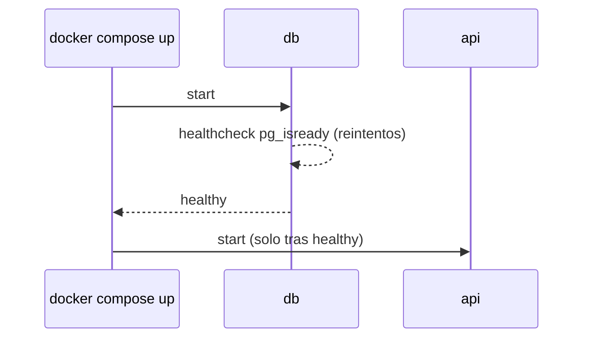
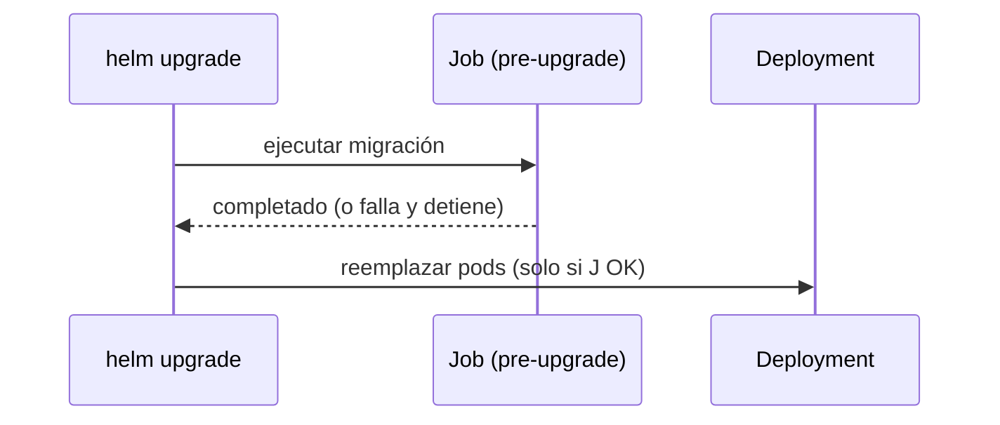
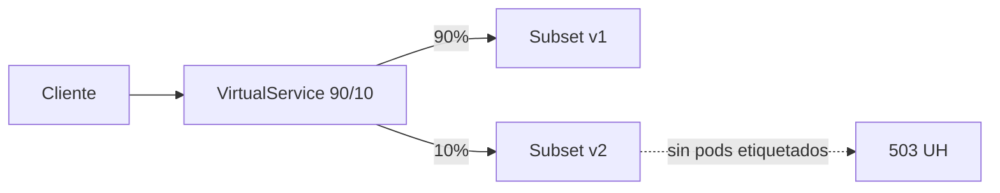
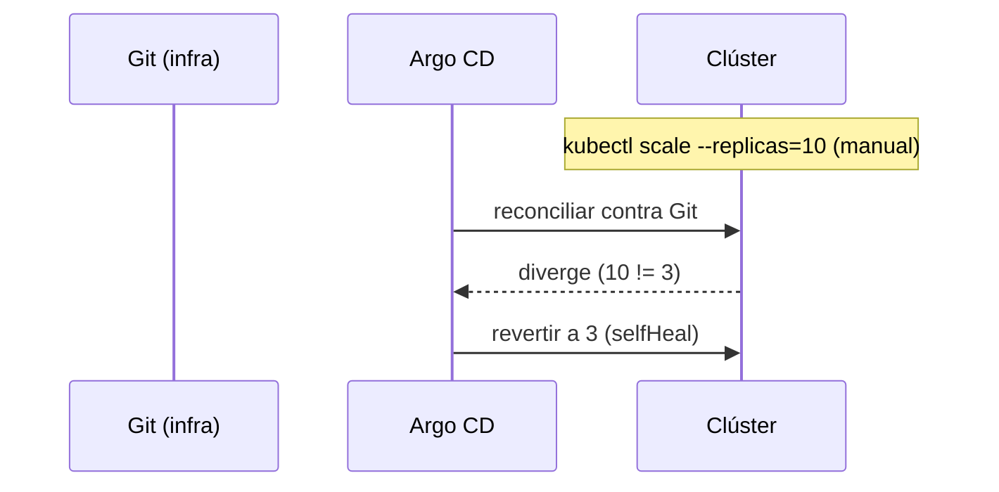
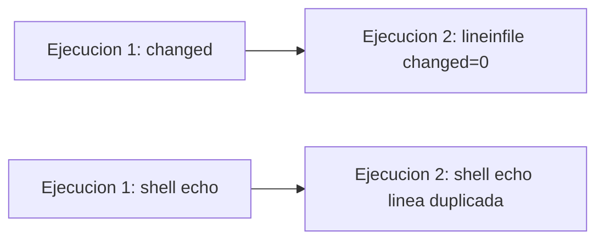
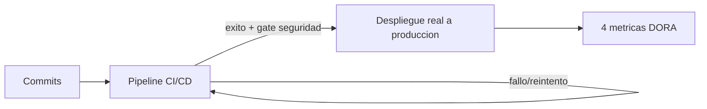

# Módulo 15: DevOps Master: GitOps, Service Mesh y DevSecOps


## Aprende construyendo

### Tema 1: Docker y Compose avanzados

#### Paso 1 · Objetivo y preparación
Al finalizar vas a declarar un `healthcheck` y un `depends_on: condition: service_healthy` para que el servicio de RutaFlow no arranque contra una base de datos que aún no acepta conexiones. Prerrequisitos: Docker Compose v2 instalado (`docker compose version`).

#### Paso 2 · Contexto y caso real
El pipeline local de RutaFlow arranca con `docker compose up`, y la API falla las primeras peticiones porque Postgres todavía está inicializando — `depends_on` por defecto solo espera a que el contenedor "exista", no a que el servicio esté listo para aceptar conexiones.

#### Paso 3 · Teoría, modelo mental y analogía
`depends_on` sin condición ordena el arranque de contenedores, pero no garantiza disponibilidad del servicio interno; un `healthcheck` define una prueba repetible de "listo", y `condition: service_healthy` hace que Compose espere ese estado antes de arrancar el dependiente. La analogía es esperar a que el semáforo esté en verde, no solo a que el poste exista.

#### Paso 4 · Demostración guiada desde cero
```yaml
services:
  db:
    image: postgres:16
    healthcheck:
      test: ["CMD-SHELL", "pg_isready -U rutaflow"]
      interval: 5s
      timeout: 3s
      retries: 5
  api:
    build: .
    depends_on:
      db:
        condition: service_healthy
```
Resultado esperado: `docker compose up` arranca `db`, espera hasta 5 reintentos de 5s a que `pg_isready` confirme disponibilidad, y solo entonces crea el contenedor `api`, eliminando el error de conexión rechazada en el primer arranque.

#### Paso 5 · Práctica guiada
Pista: quitá el bloque `healthcheck` de `db` dejando solo `depends_on: [db]` sin condición. Ese es el fallo deliberado: Compose arranca `api` apenas el contenedor de `db` existe, sin esperar a que Postgres termine su inicialización interna, y la primera petición de `api` falla con "connection refused".

#### Paso 6 · Práctica independiente
Corregí el Paso 5 restaurando el `healthcheck` y `condition: service_healthy`, y agregá un caso límite: un `healthcheck` con `retries: 1` que falla antes de que Postgres esté listo en una máquina lenta, demostrando por qué los reintentos deben calibrarse contra el tiempo real de arranque.

#### Paso 7 · Cierre y evidencia
Entregá el compose con healthcheck del Paso 4, el error de conexión rechazada del Paso 5, y el ajuste de reintentos del Paso 6; explicá la diferencia entre "el contenedor existe" y "el servicio está listo". Siguiente paso: aplica el mismo principio de disponibilidad verificada a Kubernetes con probes. Errores comunes: confiar en `depends_on` sin condición para servicios con arranque lento, healthchecks que prueban el proceso en vez del servicio real, y timeouts de healthcheck más cortos que el arranque real del servicio. Fuentes oficiales: https://docs.docker.com/compose/compose-file/05-services/#healthcheck y https://docs.docker.com/compose/compose-file/05-services/#depends_on.
**¿Por qué es importante?** Un arranque local que "funciona la mayoría de las veces" por orden de contenedores esconde una condición de carrera que reaparece en CI o en un despliegue real bajo más carga.
**Evidencia de aprendizaje:** entrega compose con healthcheck, fallo de conexión rechazada reproducido y reintentos calibrados correctamente.
**Conceptos clave:** healthcheck, depends_on, service_healthy, BuildKit, multi-stage build, cache mount, profile y readiness.

**Diagrama:**


```mermaid
sequenceDiagram
  participant C as docker compose up
  participant D as db
  participant A as api
  C->>D: start
  D-->>D: healthcheck pg_isready (reintentos)
  D-->>C: healthy
  C->>A: start (solo tras healthy)
```
### Tema 2: Kubernetes extensible y Helm avanzado

#### Paso 1 · Objetivo y preparación
Al finalizar vas a declarar un Helm hook `pre-upgrade` que corra las migraciones de RutaFlow antes de que el nuevo Deployment reciba tráfico. Prerrequisitos: Tema 1 de este módulo; Helm 3 instalado (`helm version`).

#### Paso 2 · Contexto y caso real
Un `helm upgrade` de RutaFlow despliega la nueva versión de la API al mismo tiempo que corre un Job de migración de base de datos — en una carrera de tiempos, los pods nuevos a veces reciben tráfico antes de que la migración haya terminado, rompiendo queries contra columnas que todavía no existen.

#### Paso 3 · Teoría, modelo mental y analogía
Los hooks de Helm (`pre-upgrade`, `post-upgrade`) ejecutan recursos en una fase separada del ciclo de release, y `helm.sh/hook-weight` ordena múltiples hooks dentro de la misma fase; sin un hook que bloquee, Helm continúa el upgrade del Deployment sin esperar a que el Job termine. La analogía es repavimentar una calle mientras los autos siguen circulando, en vez de cerrarla hasta terminar.

#### Paso 4 · Demostración guiada desde cero
```yaml
apiVersion: batch/v1
kind: Job
metadata:
  name: rutaflow-migrate
  annotations:
    "helm.sh/hook": pre-upgrade
    "helm.sh/hook-weight": "0"
    "helm.sh/hook-delete-policy": before-hook-creation
spec:
  template:
    spec:
      containers:
        - name: migrate
          image: rutaflow/api:{{ .Values.image.tag }}
          command: ["npm", "run", "migrate"]
      restartPolicy: Never
```
Resultado esperado: Helm ejecuta este Job en la fase `pre-upgrade` y espera a que complete exitosamente antes de continuar con el upgrade del Deployment; si el Job falla, el `helm upgrade` se detiene y no reemplaza los pods de la API.

#### Paso 5 · Práctica guiada
Pista: quitá la annotation `"helm.sh/hook": pre-upgrade` del Job, dejándolo como un recurso normal del chart. Ese es el fallo deliberado: Helm aplica el Job y el Deployment en el mismo paso de reconciliación, sin garantía de orden ni de que la migración termine antes de que el Deployment reemplace los pods viejos.

#### Paso 6 · Práctica independiente
Corregí el Paso 5 restaurando la annotation `pre-upgrade`, y agregá un segundo hook `post-upgrade` con `hook-weight: "1"` que verifique con un `curl` al endpoint `/health` que la nueva versión responde antes de considerar el release exitoso.

#### Paso 7 · Cierre y evidencia
Entregá el hook `pre-upgrade` del Paso 4, la carrera de tiempos del Paso 5, y la verificación `post-upgrade` del Paso 6; explicá por qué un recurso "normal" del chart no tiene garantía de orden frente a un hook explícito. Siguiente paso: estudia cómo un service mesh añade control de tráfico entre versiones. Errores comunes: Jobs de migración sin `hook-delete-policy` que acumulan ejecuciones viejas, hooks sin `hook-weight` cuando el orden entre varios hooks importa, y no verificar el resultado del hook antes de continuar. Fuentes oficiales: https://helm.sh/docs/topics/charts_hooks/ y https://helm.sh/docs/topics/chart_template_guide/.
**¿Por qué es importante?** Un chart de Helm sin hooks ordenados puede pasar todas las pruebas manuales y aun así causar una ventana real de errores en cada despliegue a producción.
**Evidencia de aprendizaje:** entrega hook pre-upgrade funcionando, carrera de tiempos reproducida y verificación post-upgrade agregada.
**Conceptos clave:** Helm hook, hook-weight, hook-delete-policy, Job, release, CRD, values override y upgrade.

**Diagrama:**


```mermaid
sequenceDiagram
  participant H as helm upgrade
  participant J as Job (pre-upgrade)
  participant D as Deployment
  H->>J: ejecutar migración
  J-->>H: completado (o falla y detiene)
  H->>D: reemplazar pods (solo si J OK)
```
### Tema 3: Service Mesh con Istio o Linkerd

#### Paso 1 · Objetivo y preparación
Al finalizar vas a declarar un `VirtualService` y un `DestinationRule` de Istio para dividir el tráfico de la API de RutaFlow 90/10 entre la versión estable y un canary. Prerrequisitos: Tema 2 de este módulo; clúster con Istio instalado (`istioctl version`).

#### Paso 2 · Contexto y caso real
El equipo de RutaFlow quiere probar una nueva versión de la API con solo el 10% del tráfico real antes de un rollout completo, sin duplicar infraestructura ni modificar el código de los clientes.

#### Paso 3 · Teoría, modelo mental y analogía
Un service mesh inyecta un sidecar que intercepta todo el tráfico del pod; un `DestinationRule` define subconjuntos (subsets) de un servicio por etiqueta, y un `VirtualService` distribuye pesos de tráfico entre esos subsets, en la capa de red, sin tocar el código de la aplicación. La analogía es dirigir un porcentaje de camiones a un carril de prueba en una ruta, sin que el conductor note la diferencia.

#### Paso 4 · Demostración guiada desde cero
```yaml
apiVersion: networking.istio.io/v1beta1
kind: DestinationRule
metadata: { name: rutaflow-api }
spec:
  host: rutaflow-api
  subsets:
    - name: v1
      labels: { version: v1 }
    - name: v2
      labels: { version: v2 }
---
apiVersion: networking.istio.io/v1beta1
kind: VirtualService
metadata: { name: rutaflow-api }
spec:
  hosts: [rutaflow-api]
  http:
    - route:
        - destination: { host: rutaflow-api, subset: v1 }
          weight: 90
        - destination: { host: rutaflow-api, subset: v2 }
          weight: 10
```
Resultado esperado: `istioctl proxy-config endpoints` sobre un pod cliente muestra que aproximadamente el 10% de las peticiones nuevas llegan a pods con la etiqueta `version: v2`, sin ningún cambio en el código de quien consume la API.

#### Paso 5 · Práctica guiada
Pista: desplegá los pods del canary con la etiqueta `track: canary` en vez de `version: v2`. Ese es el fallo deliberado: el subset `v2` no encuentra ningún pod que cumpla `labels: { version: v2 }`, y el 10% del tráfico ruteado a ese subset responde "503 UH, no healthy upstream" para usuarios reales.

#### Paso 6 · Práctica independiente
Corregí el Paso 5 ajustando la etiqueta del Deployment del canary a `version: v2` exactamente como la espera el `DestinationRule`, y verificá con `istioctl proxy-config endpoints <pod> --cluster "outbound|80|v2|rutaflow-api.default.svc.cluster.local"` que el subset ahora tiene endpoints reales antes de aumentar el peso del canary.

#### Paso 7 · Cierre y evidencia
Entregá el split 90/10 del Paso 4, los 503 del subset vacío del Paso 5, y la verificación de endpoints del Paso 6; explicá por qué un subset sin pods que cumplan su selector no "reparte menos tráfico" sino que falla ese porcentaje por completo. Siguiente paso: estudia cómo GitOps aplica estos mismos manifiestos de forma declarativa y auditable. Errores comunes: subsets cuyo selector de etiquetas no coincide con los pods reales, mTLS en modo STRICT que bloquea un servicio sin sidecar inyectado, y aumentar el peso del canary sin verificar antes que tiene endpoints sanos. Fuentes oficiales: https://istio.io/latest/docs/tasks/traffic-management/traffic-shifting/ y https://istio.io/latest/docs/concepts/traffic-management/.
**¿Por qué es importante?** Un split de tráfico mal configurado no se nota en pruebas del 100%, pero convierte un canary de bajo riesgo en una fracción real de usuarios recibiendo errores.
**Evidencia de aprendizaje:** entrega VirtualService/DestinationRule funcionando, 503 por subset vacío reproducido y verificación de endpoints confirmada.
**Conceptos clave:** sidecar, mTLS, VirtualService, DestinationRule, subset, traffic shifting, canary, circuit breaking, retry y observability.

**Diagrama:**


```mermaid
flowchart LR
  U[Cliente] --> VS[VirtualService 90/10]
  VS -->|90%| V1[Subset v1]
  VS -->|10%| V2[Subset v2]
  V2 -.->|sin pods etiquetados| E[503 UH]
```
### Tema 4: GitOps con Argo CD y Flux

#### Paso 1 · Objetivo y preparación
Al finalizar vas a declarar una Application de Argo CD con `syncPolicy.automated.selfHeal` para que el estado de RutaFlow en el clúster nunca diverja silenciosamente del repositorio Git. Prerrequisitos: Tema 3 de este módulo; Argo CD instalado (`argocd version`).

#### Paso 2 · Contexto y caso real
Durante un pico de tráfico, una persona de guardia de RutaFlow escala manualmente el Deployment de la API con `kubectl scale --replicas=10` para mitigar el incidente — minutos después, sin que nadie lo note, vuelve a 3 réplicas.

#### Paso 3 · Teoría, modelo mental y analogía
GitOps trata el repositorio como la única fuente de verdad; un operador en modo "pull" reconcilia continuamente el clúster contra ese estado declarado, y con `selfHeal: true` revierte automáticamente cualquier cambio manual que no coincida. La analogía es un termostato que vuelve a la temperatura programada apenas alguien toca la perilla a mano.

#### Paso 4 · Demostración guiada desde cero
```yaml
apiVersion: argoproj.io/v1alpha1
kind: Application
metadata: { name: rutaflow-api }
spec:
  source: { repoURL: 'https://github.com/rutaflow/infra', path: api, targetRevision: main }
  destination: { server: 'https://kubernetes.default.svc', namespace: rutaflow }
  syncPolicy:
    automated: { prune: true, selfHeal: true }
```
Resultado esperado: Argo CD reconcilia el clúster contra `infra` cada pocos minutos; cualquier recurso que diverja del manifiesto en Git (incluido un `kubectl edit` manual) es revertido automáticamente al estado declarado, y la UI de Argo CD muestra el recurso como "OutOfSync" justo antes de corregirlo.

#### Paso 5 · Práctica guiada
Pista: durante el pico de tráfico simulado, corré `kubectl scale deployment rutaflow-api --replicas=10` directamente contra el clúster sin tocar Git. Ese es el fallo deliberado: `selfHeal: true` revierte las réplicas a 3 en el siguiente ciclo de reconciliación, deshaciendo silenciosamente la mitigación de guardia justo cuando el tráfico seguía alto.

#### Paso 6 · Práctica independiente
Corregí el Paso 5 de la forma correcta para GitOps: actualizá `replicas: 10` directamente en el manifiesto del repositorio `infra` y fusioná ese cambio (incluso como un merge de emergencia), para que Argo CD reconcilie hacia el nuevo valor en vez de revertirlo; documentá el cambio de emergencia en el mismo commit.

#### Paso 7 · Cierre y evidencia
Entregá la Application con self-heal del Paso 4, la mitigación revertida silenciosamente del Paso 5, y el cambio correcto vía Git del Paso 6; explicá por qué un `kubectl edit` manual en un clúster gestionado por GitOps es una mitigación temporal engañosa, no una solución. Siguiente paso: estudia cómo Ansible gestiona configuración fuera del clúster con la misma disciplina declarativa. Errores comunes: mitigar incidentes con cambios manuales en clústeres con self-heal activo, no tener un procedimiento documentado de "cambio de emergencia vía Git", y dejar `automated.prune` activo sin revisar qué recursos elimina. Fuentes oficiales: https://argo-cd.readthedocs.io/en/stable/user-guide/auto_sync/ y https://opengitops.dev/.
**¿Por qué es importante?** La ventaja de GitOps (nunca diverger silenciosamente) se convierte en una trampa operativa si el equipo de guardia no sabe que cualquier cambio fuera de Git será revertido.
**Evidencia de aprendizaje:** entrega Application con self-heal funcionando, reversión silenciosa reproducida y cambio de emergencia vía Git documentado.
**Conceptos clave:** declarative state, reconciliation loop, drift, selfHeal, prune, pull model, Application, sync wave, rollback y auditability.

**Diagrama:**


```mermaid
sequenceDiagram
  participant G as Git (infra)
  participant A as Argo CD
  participant K as Clúster
  Note over K: kubectl scale --replicas=10 (manual)
  A->>K: reconciliar contra Git
  K-->>A: diverge (10 != 3)
  A->>K: revertir a 3 (selfHeal)
```
### Tema 5: Ansible, inventarios, roles y Vault

#### Paso 1 · Objetivo y preparación
Al finalizar vas a cifrar la API key de RutaFlow con `ansible-vault` y a escribirla en el servidor usando una tarea idempotente que no duplique su valor al ejecutarse varias veces. Prerrequisitos: Tema 4 de este módulo; Ansible instalado (`ansible --version`).

#### Paso 2 · Contexto y caso real
El playbook de aprovisionamiento de RutaFlow se corre cada vez que se agrega un servidor nuevo al inventario, pero también se vuelve a correr sobre servidores existentes para aplicar cambios menores — si una tarea no es idempotente, cada re-ejecución puede ir acumulando efectos no deseados.

#### Paso 3 · Teoría, modelo mental y analogía
La idempotencia garantiza que aplicar un playbook N veces produce el mismo estado que aplicarlo una vez; módulos como `lineinfile` verifican el estado actual antes de modificar, mientras que comandos de shell genéricos (`echo >>`) solo ejecutan una acción sin verificar nada. La analogía es la diferencia entre "asegurate de que la puerta esté cerrada" y "cerrá la puerta" repetido sin mirar si ya estaba cerrada.

#### Paso 4 · Demostración guiada desde cero
```bash
ansible-vault encrypt_string 'sk-rutaflow-prod-xxx' --name 'api_key'
```
```yaml
- name: Configurar API key de RutaFlow
  lineinfile:
    path: /etc/environment
    regexp: '^RUTAFLOW_API_KEY='
    line: "RUTAFLOW_API_KEY={{ api_key }}"
    state: present
```
Resultado esperado: `ansible-vault encrypt_string` produce un valor cifrado que se guarda en el repositorio sin exponer el secreto en texto plano; la tarea `lineinfile` con `regexp` verifica si la línea ya existe y la reemplaza en vez de duplicarla, dando el mismo resultado si el playbook corre 1 o 10 veces.

#### Paso 5 · Práctica guiada
Pista: reemplazá la tarea `lineinfile` por `shell: echo "RUTAFLOW_API_KEY={{ api_key }}" >> /etc/environment` "porque es más simple". Ese es el fallo deliberado: correr el playbook una segunda vez agrega una SEGUNDA línea `RUTAFLOW_API_KEY=...` al archivo, y según qué programa la lea primero, el servidor puede terminar usando una key vieja o duplicada sin que nadie lo note.

#### Paso 6 · Práctica independiente
Corregí el Paso 5 restaurando la tarea `lineinfile` con `regexp` y `state: present`, y verificá la idempotencia corriendo el playbook dos veces seguidas (`ansible-playbook site.yml` x2) confirmando que la segunda ejecución reporta `changed=0` para esa tarea.

#### Paso 7 · Cierre y evidencia
Entregá el secreto cifrado y la tarea idempotente del Paso 4, la duplicación de línea del Paso 5, y la verificación de `changed=0` del Paso 6; explicá por qué `shell`/`command` nunca son idempotentes por sí mismos, a diferencia de los módulos declarativos de Ansible. Siguiente paso: cerrá el módulo conectando estas prácticas con las métricas DORA que miden el impacto real de todo el pipeline. Errores comunes: guardar secretos sin `ansible-vault`, usar `shell`/`command` para tareas que ya tienen un módulo idempotente equivalente, y no verificar `changed=0` en una segunda ejecución antes de confiar en un playbook. Fuentes oficiales: https://docs.ansible.com/ansible/latest/vault_guide/index.html y https://docs.ansible.com/ansible/latest/collections/ansible/builtin/lineinfile_module.html.
**¿Por qué es importante?** Un playbook no idempotente se comporta distinto la primera y la décima vez que corre, lo que vuelve impredecible cualquier servidor que reciba más de un cambio a lo largo del tiempo.
**Evidencia de aprendizaje:** entrega secreto cifrado con vault, duplicación de línea reproducida y `changed=0` verificado en segunda ejecución.
**Conceptos clave:** inventory, role, Vault, idempotency, módulo vs shell, handler, fact, playbook, tag y changed.

**Diagrama:**


```mermaid
flowchart LR
  P1[Ejecucion 1: changed] --> P2[Ejecucion 2: lineinfile changed=0]
  P1b[Ejecucion 1: shell echo] --> P2b[Ejecucion 2: shell echo linea duplicada]
```
### Tema 6: DevSecOps y métricas DORA

#### Paso 1 · Objetivo y preparación
Al finalizar vas a calcular las cuatro métricas DORA (frecuencia de despliegue, lead time, tasa de fallo de cambios y MTTR) a partir de los datos reales del pipeline de RutaFlow. Prerrequisitos: Tema 5 de este módulo; acceso a los logs de CI/CD y al historial de incidentes de RutaFlow.

#### Paso 2 · Contexto y caso real
El equipo de RutaFlow quiere saber si su proceso de DevSecOps realmente mejoró en el último trimestre, más allá de la sensación subjetiva de "ahora desplegamos más rápido".

#### Paso 3 · Teoría, modelo mental y analogía
Las métricas DORA miden el desempeño real de entrega de software con cuatro números: con qué frecuencia se despliega a producción, cuánto tarda un commit en llegar a producción, qué porcentaje de despliegues causa un incidente, y cuánto se tarda en recuperarse. La analogía es un chequeo médico: no mide cómo te sentís, mide signos vitales concretos y comparables en el tiempo.

#### Paso 4 · Demostración guiada desde cero
```bash
# Frecuencia de despliegue: despliegues EXITOSOS a producción por día
git log --since="30 days ago" --grep="deploy: production" --oneline | wc -l

# Lead time: desde el commit hasta el despliegue exitoso
echo "$(( $(date -d "$DEPLOY_TIME" +%s) - $(date -d "$COMMIT_TIME" +%s) )) segundos"
```
Resultado esperado: la frecuencia de despliegue cuenta únicamente los despliegues que llegaron a producción y pasaron el smoke test posterior, no cada ejecución del pipeline; el lead time mide desde el commit original hasta ese despliegue exitoso, no desde el inicio del pipeline.

#### Paso 5 · Práctica guiada
Pista: calculá la "frecuencia de despliegue" contando el total de ejecuciones de CI por día, incluyendo las que fallaron en el paso de tests o en el gate de seguridad. Ese es el fallo deliberado: un pipeline inestable que falla y se reintenta 5 veces por cada despliegue real exitoso muestra una "frecuencia" artificialmente alta, haciendo parecer que el equipo despliega mucho más seguido de lo que realmente entrega valor a producción.

#### Paso 6 · Práctica independiente
Corregí el Paso 5 filtrando únicamente los despliegues que llegaron a producción y pasaron la verificación posterior (el mismo gate de Trivy y el smoke test del Módulo 13), y recalculá la frecuencia real; comparala con el número inflado del Paso 5 para dimensionar la distorsión.

#### Paso 7 · Cierre y evidencia
Entregá el cálculo correcto de las 4 métricas DORA del Paso 4, la frecuencia inflada del Paso 5, y la frecuencia real corregida del Paso 6; explicá por qué contar ejecuciones de pipeline en vez de despliegues exitosos a producción invalida la métrica como señal de mejora real. Siguiente paso: usá estas cuatro métricas para decidir en qué parte del pipeline de RutaFlow invertir el próximo esfuerzo de mejora. Errores comunes: medir actividad del pipeline en vez de entregas reales a producción, calcular MTTR solo desde la detección y no desde el inicio real del incidente, y no definir qué cuenta como "cambio que falla" de forma consistente entre equipos. Fuentes oficiales: https://dora.dev/guides/dora-metrics-four-keys/ y https://cloud.google.com/blog/products/devops-sre/the-2019-accelerate-state-of-devops-report.
**¿Por qué es importante?** Las métricas DORA solo sirven como señal real de mejora si miden entrega efectiva a producción; contar actividad del pipeline en su lugar produce un número que sube sin que el equipo entregue más valor.
**Evidencia de aprendizaje:** entrega las 4 métricas DORA calculadas, frecuencia inflada detectada y frecuencia real corregida con la comparación documentada.
**Conceptos clave:** deployment frequency, lead time for changes, change failure rate, MTTR, Four Keys, DevSecOps, shift left, security gate, elite performer y Accelerate.

**Diagrama:**


```mermaid
flowchart LR
  A[Commits] --> B[Pipeline CI/CD]
  B -->|exito + gate seguridad| C[Despliegue real a produccion]
  B -->|fallo/reintento| B
  C --> D[4 metricas DORA]
```


## Trazabilidad de la auditoría original

- **Service Mesh**: cubierto mediante fundamento, laboratorio y evidencia del capítulo.
- **GitOps**: cubierto mediante fundamento, laboratorio y evidencia del capítulo.
- **Ansible**: cubierto mediante fundamento, laboratorio y evidencia del capítulo.
- **DevSecOps**: cubierto mediante fundamento, laboratorio y evidencia del capítulo.
- **Métricas DORA**: cubierto mediante fundamento, laboratorio y evidencia del capítulo.
- **Docker Avanzado**: cubierto mediante fundamento, laboratorio y evidencia del capítulo.
- **Docker Compose Avanzado**: cubierto mediante fundamento, laboratorio y evidencia del capítulo.
- **Kubernetes Avanzado**: cubierto mediante fundamento, laboratorio y evidencia del capítulo.
- **Helm Avanzado**: cubierto mediante fundamento, laboratorio y evidencia del capítulo.
