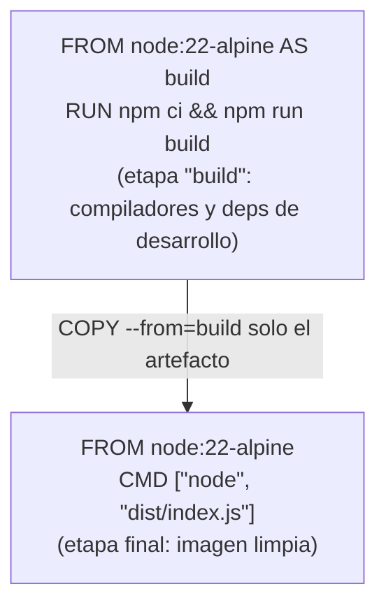
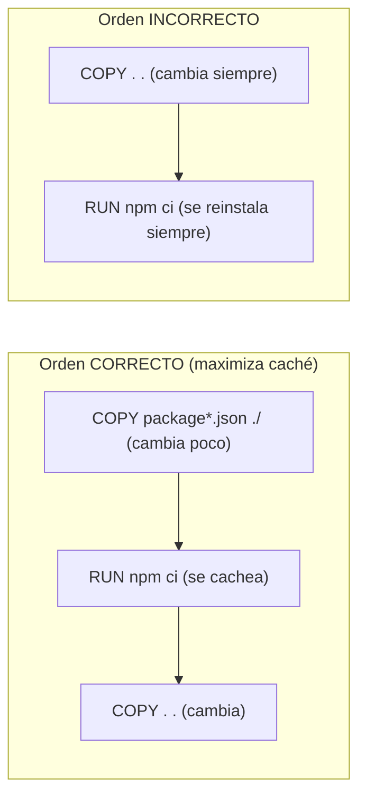
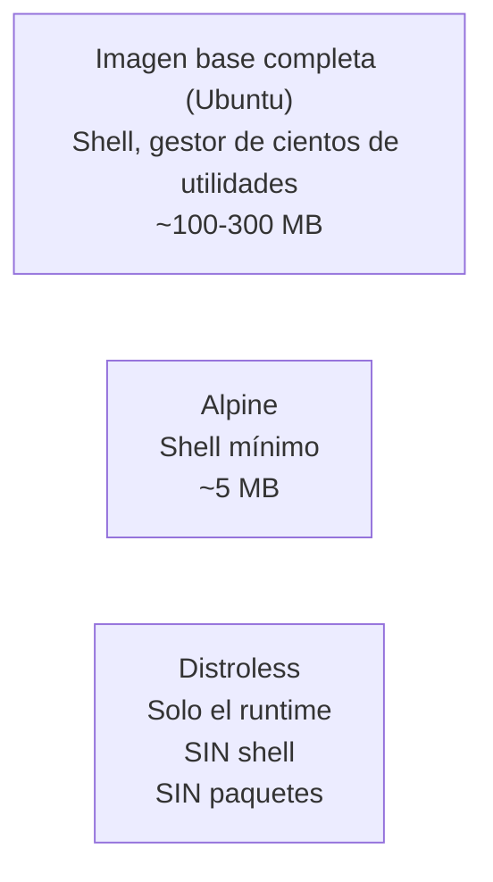
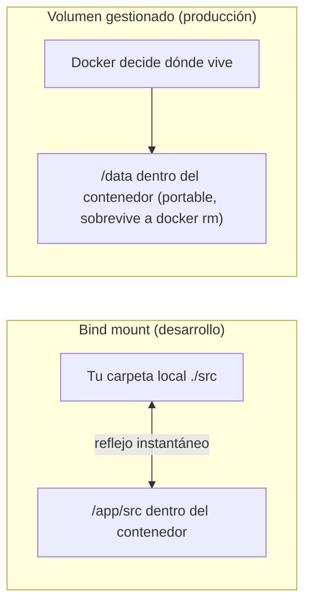
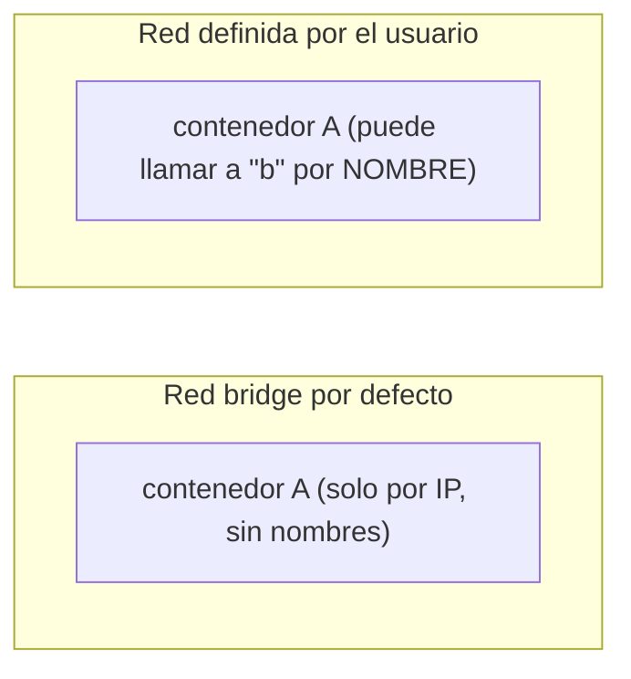
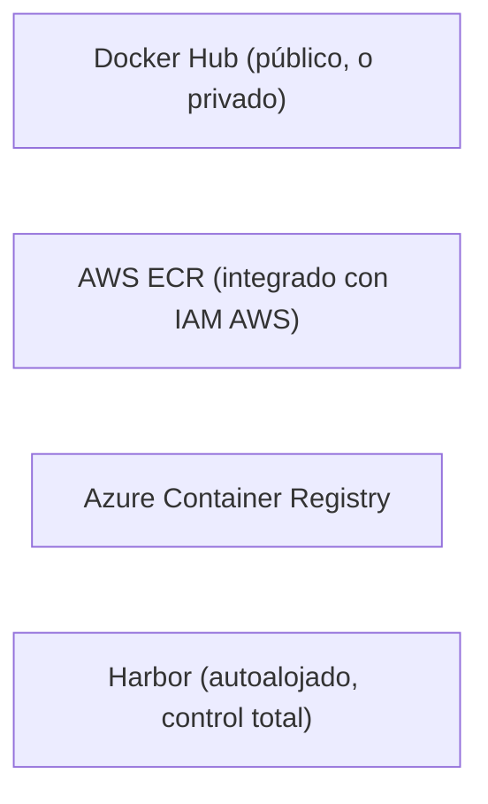

# Módulo 2: Docker — imágenes y buenas prácticas


## Aprende construyendo

### Tema 1: Dockerfile multi-stage

#### Paso 1 · Objetivo y preparación

Al finalizar podrás escribir un Dockerfile multi-stage que separa la compilación de la ejecución, reduciendo drásticamente el tamaño y la superficie de ataque de la imagen final.

**Conocimiento previo:** Docker básico (Módulo 0 del track Cloud) y Docker instalado localmente.

#### Paso 2 · Contexto y caso real

**¿Por qué es importante?** Este es un caso real de cualquier pipeline de CI/CD: el tamaño de una imagen Docker afecta directamente cuánto tarda en descargarse en cada despliegue, cuánto espacio consume en registries, y cuántas vulnerabilidades potenciales arrastra.

#### Paso 3 · Teoría con analogía

**Conceptos clave:** etapa de build, etapa final, `COPY --from`, artefactos intermedios descartados.

Un Dockerfile de una sola etapa mezcla, en la misma imagen final, todo lo necesario para construir la aplicación (compiladores, dependencias de desarrollo) con todo lo necesario únicamente para ejecutarla. Un Dockerfile multi-stage separa el proceso en etapas nombradas con `AS <nombre>`: una etapa de build instala todo y compila; una segunda etapa, la final, parte de una imagen limpia y usa `COPY --from=build` para copiar únicamente los artefactos ya construidos.

El resultado es que la imagen final contiene solo lo estrictamente necesario para ejecutar la aplicación. Docker descarta automáticamente el contenido de las etapas intermedias de la imagen final. La diferencia de tamaño entre una imagen de una sola etapa y su equivalente multi-stage puede ser de varias veces (a menudo reduciendo cientos de megabytes a decenas).

**Analogía:** un Dockerfile de una sola etapa es como enviar a un cliente, junto con el mueble terminado, todas las herramientas y la madera sobrante usadas para fabricarlo. Un Dockerfile multi-stage es como fabricar el mueble en el taller y enviar únicamente el mueble terminado.

**Diagrama:**



#### Paso 4 · Demostración guiada desde cero

Desde una carpeta vacía crea `academia-devops/src/modulo2/multistage` con una API mínima:

```bash
mkdir -p academia-devops/src/modulo2/multistage
cd academia-devops/src/modulo2/multistage
cat > package.json <<'EOF'
{"name":"api-demo","version":"1.0.0","scripts":{"build":"echo 'compilado' > dist-marker.txt"},"main":"index.js"}
EOF
mkdir dist && echo "console.log('API corriendo')" > index.js
cat > Dockerfile.sinoptimizar <<'EOF'
FROM node:22
WORKDIR /app
COPY . .
RUN npm ci --omit=dev || true
CMD ["node", "index.js"]
EOF
```

**Explicación línea por línea:** `Dockerfile.sinoptimizar` copia todo el proyecto en una imagen `node:22` completa (cientos de MB), sin separar build de runtime — el punto de partida deliberadamente no optimizado para comparar.

Construye ambas versiones y compara tamaños:

```bash
docker build -f Dockerfile.sinoptimizar -t api-demo:sin-optimizar .
cat > Dockerfile <<'EOF'
FROM node:22-alpine AS build
WORKDIR /app
COPY package*.json ./
RUN npm ci
COPY . .
RUN npm run build

FROM node:22-alpine
WORKDIR /app
COPY --from=build /app/dist-marker.txt ./
COPY --from=build /app/index.js ./
CMD ["node", "index.js"]
EOF
docker build -t api-demo:multistage .
docker images | grep api-demo
```

**Resultado esperado:** `api-demo:sin-optimizar` pesa varios cientos de MB; `api-demo:multistage` pesa decenas de MB, confirmando la reducción del patrón multi-stage.

**Fallo deliberado:** cambia `COPY --from=build /app/dist-marker.txt ./` por `COPY --from=otra-etapa /app/dist-marker.txt ./` (un nombre de etapa que no existe). El build falla con un error de etapa no encontrada — diagnostica que el nombre después de `--from=` debe coincidir exactamente con el declarado en `AS <nombre>`.

#### Paso 5 · Práctica guiada

Agrega una tercera etapa `AS test` que ejecute una verificación (`RUN node -e "require('./index.js')"`) antes de la etapa final, y confirma que un error ahí detiene todo el build. **Pista:** el orden de las etapas en el archivo no importa tanto como qué etapa referencia cada `COPY --from`.

#### Paso 6 · Práctica independiente

Mide con `docker history api-demo:multistage` cuántas capas tiene la imagen final y cuál es la más pesada; explica si esa capa podría reducirse más.

#### Paso 7 · Cierre y evidencia

Ya separas compilación de ejecución para producir imágenes mínimas. El siguiente tema profundiza en cómo el orden de las instrucciones afecta el caché de build. **Evidencia:** entrega la comparación de tamaños entre `sin-optimizar` y `multistage`, y el resultado del fallo con el nombre de etapa incorrecto. Fuente oficial: [Docker — Multi-stage builds](https://docs.docker.com/build/building/multi-stage/).

**Errores comunes:** referenciar un nombre de etapa que no coincide con `AS <nombre>`; olvidar copiar un artefacto necesario desde la etapa de build, dejando la imagen final incompleta.

**Cuándo no usarlo:** para un script único sin proceso de compilación (por ejemplo, un script Python sin dependencias nativas), multi-stage aporta poco frente a una sola etapa bien elegida; el beneficio real aparece cuando hay una diferencia real entre herramientas de build y runtime.

### Tema 2: Capas e invalidación de caché

#### Paso 1 · Objetivo y preparación

Al finalizar podrás ordenar las instrucciones de un Dockerfile para maximizar la reutilización de caché entre builds sucesivos.

**Conocimiento previo:** Tema 1 de este módulo.

#### Paso 2 · Contexto y caso real

**¿Por qué es importante?** Este es un caso real de cualquier pipeline de CI que construye una imagen en cada commit: la diferencia entre un Dockerfile bien ordenado y uno mal ordenado puede significar segundos frente a varios minutos de build.

#### Paso 3 · Teoría con analogía

**Conceptos clave:** capa por instrucción, caché de build, orden de instrucciones, invalidación en cascada.

Cada instrucción de un Dockerfile genera una capa, y Docker cachea cada una para acelerar reconstrucciones. Docker invalida la caché de una capa (y de todas las siguientes, en cascada) tan pronto detecta que el contenido de esa instrucción cambió. Por eso copiar primero `package.json` y ejecutar `npm ci` antes de copiar el resto del código evita reinstalar dependencias en cada cambio de código si `package.json` no cambió.

La regla general: coloca primero las instrucciones que cambian con menor frecuencia, y deja para el final las que cambian con mayor frecuencia.

**Analogía:** reordenar un Dockerfile para maximizar el caché es como preparar con anticipación los ingredientes de una salsa que rara vez cambia, dejando para el último momento solo el ensamblaje con los ingredientes frescos que sí cambian cada vez.

**Diagrama:**



#### Paso 4 · Demostración guiada desde cero

Desde una carpeta vacía crea `academia-devops/src/modulo2/cache-test` con el mismo Dockerfile multi-stage del Tema 1, y mide el efecto del orden con dos builds sucesivos:

```bash
mkdir -p academia-devops/src/modulo2/cache-test && cd academia-devops/src/modulo2/cache-test
cat > package.json <<'EOF'
{"name":"api-demo","version":"1.0.0","scripts":{"build":"echo compilado > dist-marker.txt"}}
EOF
echo "console.log('v1')" > index.js
cat > Dockerfile <<'EOF'
FROM node:22-alpine AS build
WORKDIR /app
COPY package*.json ./
RUN npm ci
COPY . .
RUN npm run build
FROM node:22-alpine
WORKDIR /app
COPY --from=build /app/dist-marker.txt ./
CMD ["cat", "dist-marker.txt"]
EOF
docker build -t api-demo:cache-test .
echo "console.log('cambio de código, sin tocar package.json')" >> index.js
docker build -t api-demo:cache-test . 2>&1 | grep -E "CACHED|npm ci"
```

**Explicación línea por línea:** el segundo build solo modifica `index.js`, no `package.json`; con el Dockerfile ya ordenado correctamente (Tema 1), la capa `RUN npm ci` debe reportarse como `CACHED`.

**Resultado esperado:** la línea de `RUN npm ci` en la segunda ejecución aparece marcada como `CACHED`, confirmando que Docker reutilizó esa capa sin reinstalar dependencias.

**Fallo deliberado:** invierte el orden del Dockerfile (`COPY . .` antes de `COPY package*.json ./` y `RUN npm ci`) y repite el experimento completo. Ahora `npm ci` se ejecuta de nuevo en cada build, incluso sin cambiar dependencias — diagnostica comparando la salida de build (ya no aparece `CACHED` en esa capa) contra el orden correcto.

#### Paso 5 · Práctica guiada

Agrega un `.dockerignore` con `node_modules` y `*.log`, y explica por qué reduce aún más la invalidación de caché al evitar que Docker "vea" cambios irrelevantes en el contexto de build. **Pista:** revisa qué archivos se envían realmente al daemon de Docker con `docker build` sin `.dockerignore`.

#### Paso 6 · Práctica independiente

Mide con `time docker build ...` la diferencia real de tiempo entre un build con caché completo (sin cambios) y uno que reinstala dependencias desde cero (`docker build --no-cache`).

#### Paso 7 · Cierre y evidencia

Ya ordenas un Dockerfile para maximizar el caché reutilizable. El siguiente tema reduce aún más el tamaño eligiendo la imagen base correcta. **Evidencia:** entrega la salida de build mostrando `CACHED` en el orden correcto y su ausencia en el orden invertido. Fuente oficial: [Docker — Build cache](https://docs.docker.com/build/cache/).

**Errores comunes:** copiar todo el código fuente antes de instalar dependencias; olvidar un `.dockerignore`, dejando que archivos irrelevantes (como `node_modules` local) invaliden capas innecesariamente.

**Cuándo no usarlo:** en un Dockerfile con una sola instrucción de instalación y sin dependencias pesadas, optimizar el orden de capas aporta poco; el límite de esta técnica es que solo ayuda cuando existe una diferencia real de frecuencia de cambio entre instrucciones.

### Tema 3: Imágenes base distroless/alpine

#### Paso 1 · Objetivo y preparación

Al finalizar podrás elegir entre una imagen base completa, Alpine o distroless según si priorizas comodidad de depuración o mínima superficie de ataque.

**Conocimiento previo:** Temas 1 y 2 de este módulo.

#### Paso 2 · Contexto y caso real

**¿Por qué es importante?** Este es un caso real de seguridad de contenedores: minimizar la imagen base reduce simultáneamente el tamaño de la imagen y la superficie de ataque, sin requerir cambios significativos en el código de la aplicación.

#### Paso 3 · Teoría con analogía

**Conceptos clave:** imagen base completa, Alpine Linux, distroless, superficie de ataque.

Una imagen base completa incluye un sistema operativo completo con shell y utilidades, simplificando la depuración pero ampliando la superficie de ataque. Alpine Linux es minimalista (unos pocos MB) y usa musl en vez de glibc, lo que en casos poco frecuentes causa incompatibilidades con binarios precompilados. Distroless contiene únicamente el runtime necesario, sin shell ni gestor de paquetes: si un atacante compromete la aplicación, ni siquiera tiene una terminal disponible dentro del contenedor.

**Analogía:** una imagen completa es como alquilar una casa completamente amueblada con herramientas que nunca usas. Alpine es una casa pequeña y eficiente con solo lo esencial. Distroless es una habitación de hotel minimalista: exactamente lo necesario, nada más.

**Diagrama:**



#### Paso 4 · Demostración guiada desde cero

Desde una carpeta vacía crea `academia-devops/src/modulo2/imagenes-base` y compara tres imágenes con el mismo comando:

```bash
mkdir -p academia-devops/src/modulo2/imagenes-base
cd academia-devops/src/modulo2/imagenes-base
echo 'console.log("hola")' > app.js
for base in "node:22" "node:22-alpine" "gcr.io/distroless/nodejs22-debian12"; do
  echo "--- $base ---"
  docker run --rm -v "$(pwd)":/app -w /app "$base" node app.js 2>&1 || echo "(sin shell disponible para depurar interactivamente)"
done
docker images node:22 node:22-alpine --format "{{.Repository}}:{{.Tag}} {{.Size}}"
```

**Explicación línea por línea:** ejecutar `node app.js` en las tres imágenes confirma que las tres pueden correr la aplicación; la diferencia real aparece al intentar depurar interactivamente cada una.

**Resultado esperado:** las tres imprimen `hola`; la comparación de tamaños muestra `node:22` con cientos de MB y `node:22-alpine` con decenas de MB.

**Fallo deliberado:** intenta entrar interactivamente a un contenedor basado en la imagen distroless: `docker run --rm -it gcr.io/distroless/nodejs22-debian12 sh`. Falla porque no existe `sh` — diagnostica que esta es precisamente la propiedad de seguridad de distroless (sin shell que un atacante pueda usar), al costo de no poder depurar así.

#### Paso 5 · Práctica guiada

Verifica con `docker run --rm node:22-alpine cat /etc/os-release` qué distribución reporta Alpine, y compara con `docker run --rm node:22 cat /etc/os-release`. **Pista:** el campo `ID` del archivo indica la distribución base real.

#### Paso 6 · Práctica independiente

Investiga (sin necesariamente ejecutarlo) qué herramienta usarías para escanear vulnerabilidades conocidas en cada una de las tres imágenes (por ejemplo, `docker scout` o Trivy) y explica qué reducción de hallazgos esperarías entre `node:22` y la versión distroless.

#### Paso 7 · Cierre y evidencia

Ya eliges la imagen base según el balance correcto entre depuración y seguridad. El siguiente tema decide dónde persisten los datos de un contenedor. **Evidencia:** entrega la comparación de tamaños de las tres imágenes y el fallo al intentar un shell en distroless. Fuente oficial: [Google — distroless](https://github.com/GoogleContainerTools/distroless).

**Errores comunes:** usar una imagen completa en producción "por comodidad" sin evaluar el impacto de seguridad; asumir que Alpine es un reemplazo directo sin considerar la diferencia musl/glibc en dependencias nativas.

**Cuándo no usarlo:** en un entorno de desarrollo donde necesitas depurar interactivamente con frecuencia, distroless no conviene: su ausencia de shell dificulta justamente esa tarea; ahí una imagen completa o Alpine es preferible.

### Tema 4: Volúmenes vs bind mounts

#### Paso 1 · Objetivo y preparación

Al finalizar podrás elegir entre un volumen gestionado por Docker y un bind mount según si necesitas persistencia portable o reflejo instantáneo de código local.

**Conocimiento previo:** Temas 1 a 3 de este módulo.

#### Paso 2 · Contexto y caso real

**¿Por qué es importante?** Este es un caso real de desarrollo diario: un bind mount que vincula tu código local acelera enormemente el ciclo de desarrollo iterativo, mientras que un volumen gestionado es la opción recomendada para persistir datos en producción.

#### Paso 3 · Teoría con analogía

**Conceptos clave:** volumen gestionado por Docker, bind mount, persistencia, desarrollo con recarga en vivo.

Un volumen es un mecanismo de almacenamiento persistente gestionado por Docker, que sobrevive a la eliminación del contenedor. Un bind mount monta un directorio explícito de la máquina anfitriona directamente dentro del contenedor; cualquier cambio se refleja en ambas direcciones. En desarrollo, un bind mount de tu código local evita reconstruir la imagen en cada cambio; en producción, un volumen gestionado no depende de una ruta frágil del servidor anfitrión.

**Analogía:** un volumen gestionado es como guardar documentos en una caja fuerte de un banco: el banco gestiona dónde y cómo. Un bind mount es como una ventana directa entre tu oficina y una habitación específica de tu casa: cambios visibles instantáneamente, pero dependientes de que esa habitación exista exactamente ahí.

**Diagrama:**



#### Paso 4 · Demostración guiada desde cero

Desde una carpeta vacía crea `academia-devops/src/modulo2/volumenes` y compara ambos mecanismos:

```bash
mkdir -p academia-devops/src/modulo2/volumenes
cd academia-devops/src/modulo2/volumenes
echo "console.log('version 1')" > app.js
docker run --rm -v "$(pwd)":/app -w /app node:22-alpine node app.js
echo "console.log('version 2, editado localmente')" > app.js
docker run --rm -v "$(pwd)":/app -w /app node:22-alpine node app.js
```

**Explicación línea por línea:** el bind mount (`-v "$(pwd)":/app`) refleja instantáneamente el cambio local en `app.js` dentro del contenedor, sin reconstruir ninguna imagen entre ambas ejecuciones.

Ahora prueba un volumen gestionado con persistencia real:

```bash
docker volume create datos-prueba
docker run --rm -v datos-prueba:/data alpine sh -c "echo 'dato persistente' > /data/registro.txt"
docker run --rm -v datos-prueba:/data alpine cat /data/registro.txt
```

**Resultado esperado:** la segunda ejecución de `node app.js` imprime "version 2, editado localmente" sin ningún build; el volumen gestionado muestra "dato persistente" en un contenedor completamente nuevo, confirmando que sobrevivió a la eliminación del primero (`--rm`).

**Fallo deliberado:** elimina el volumen con `docker volume rm datos-prueba` y repite el segundo `docker run` que lee `/data/registro.txt`. Verás un archivo vacío o un directorio recién creado, sin el dato anterior — diagnostica que el volumen fue efectivamente destruido, y que la persistencia depende de que el volumen mismo no se elimine.

#### Paso 5 · Práctica guiada

Verifica dónde vive físicamente el volumen con `docker volume inspect datos-prueba` y localiza el campo `Mountpoint`. **Pista:** normalmente no necesitas tocar esa ruta directamente; Docker la gestiona por ti.

#### Paso 6 · Práctica independiente

Crea dos contenedores distintos que compartan el mismo volumen simultáneamente (uno escribe, otro lee poco después) y confirma que ambos ven el mismo contenido, demostrando que un volumen puede compartirse entre contenedores.

#### Paso 7 · Cierre y evidencia

Ya eliges bind mount para iterar rápido en desarrollo y volumen gestionado para persistir datos de forma portable. El siguiente tema conecta contenedores entre sí por nombre usando redes definidas por el usuario. **Evidencia:** entrega el resultado mostrando el bind mount reflejando el cambio local, y explica por qué el volumen sobrevivió a la eliminación del contenedor. Fuente oficial: [Docker — Volumes](https://docs.docker.com/storage/volumes/).

**Errores comunes:** usar bind mounts en producción acoplando el contenedor a una ruta frágil del servidor; olvidar que eliminar un volumen (`docker volume rm`) es destructivo y no se puede deshacer.

**Cuándo no usarlo:** un bind mount no conviene en producción para datos de aplicación que deben sobrevivir independientemente del servidor físico; ahí un volumen gestionado (o almacenamiento externo) es la opción correcta.

### Tema 5: Redes en Docker

#### Paso 1 · Objetivo y preparación

Al finalizar podrás crear una red Docker definida por el usuario y conectar contenedores entre sí usando resolución de nombres, en vez de direcciones IP frágiles.

**Conocimiento previo:** Temas 1 a 4 de este módulo.

#### Paso 2 · Contexto y caso real

**¿Por qué es importante?** Este es un caso real de cualquier `docker-compose.yml` con varios servicios: entender el descubrimiento de nombres es la base para entender por qué tu aplicación puede conectarse a otro servicio usando su nombre en vez de una IP.

#### Paso 3 · Teoría con analogía

**Conceptos clave:** red bridge por defecto, red definida por el usuario, descubrimiento por nombre de servicio, aislamiento de red.

Por defecto, Docker crea contenedores en una red bridge que no da resolución de nombres automática entre ellos: solo pueden comunicarse por IP interna, que puede cambiar entre reinicios. Una red definida por el usuario (`docker network create`) resuelve esto: Docker provee resolución de nombres automática dentro de ella. Docker Compose crea automáticamente una red así para cada proyecto.

Las redes también aíslan: contenedores en redes distintas no se comunican entre sí a menos que se conecten explícitamente a una compartida.

**Analogía:** la red bridge por defecto es como un edificio sin directorio de nombres en la entrada: necesitas el número exacto de apartamento. Una red definida por el usuario es ese mismo edificio con un directorio de nombres: pides por el nombre y te dirigen automáticamente.

**Diagrama:**



#### Paso 4 · Demostración guiada desde cero

Desde una carpeta vacía crea `academia-devops/src/modulo2/redes` y demuestra la diferencia:

```bash
mkdir -p academia-devops/src/modulo2/redes && cd academia-devops/src/modulo2/redes
docker network create demo-red
docker run -d --name servicio-a --network demo-red alpine sleep 300
docker run --rm --network demo-red alpine ping -c 2 servicio-a
```

**Explicación línea por línea:** `docker network create demo-red` crea una red definida por el usuario; el segundo contenedor hace `ping` a `servicio-a` usando su nombre, sin conocer ninguna IP.

**Resultado esperado:** el `ping` recibe respuesta exitosa de `servicio-a`, confirmando que Docker resolvió el nombre automáticamente dentro de la red definida por el usuario.

**Fallo deliberado:** ejecuta el mismo `ping -c 2 servicio-a` desde un contenedor que NO está conectado a `demo-red` (usa la red `bridge` por defecto: `docker run --rm alpine ping -c 2 servicio-a`). Falla con "bad address" — diagnostica que fuera de la red definida por el usuario no hay resolución de nombres para ese contenedor.

#### Paso 5 · Práctica guiada

Limpia con `docker rm -f servicio-a && docker network rm demo-red`, y repite el demo creando la red con `docker compose` en vez de manualmente (un `compose.yaml` mínimo con dos servicios). **Pista:** Compose nombra la red automáticamente como `<carpeta>_default`; verifícalo con `docker network ls`.

#### Paso 6 · Práctica independiente

Crea una segunda red aislada (`red-aislada`) y confirma que un contenedor en `demo-red` no puede hacer `ping` a uno en `red-aislada`, demostrando el aislamiento entre redes distintas.

#### Paso 7 · Cierre y evidencia

Ya conectas contenedores por nombre usando redes definidas por el usuario, y sabes cuándo Docker aísla tráfico entre redes distintas. El siguiente tema elige dónde publicar las imágenes que resultan de estos contenedores. **Evidencia:** entrega el `ping` exitoso dentro de la red y el fallo fuera de ella, con su explicación. Fuente oficial: [Docker — Networking](https://docs.docker.com/network/).

**Errores comunes:** asumir que cualquier contenedor puede resolver el nombre de otro sin estar en la misma red definida por el usuario; olvidar limpiar redes de prueba (`docker network rm`), acumulando redes huérfanas.

**Cuándo no usarlo:** para un contenedor completamente aislado que no necesita comunicarse con ningún otro, crear una red definida por el usuario es innecesario; la red bridge por defecto (o `--network none`) es suficiente y más simple.

### Tema 6: Registries — Docker Hub, AWS ECR, Azure Container Registry, Harbor

#### Paso 1 · Objetivo y preparación

Al finalizar podrás elegir entre Docker Hub, un registry gestionado por proveedor cloud y un registry autoalojado (Harbor) según tus requisitos de integración e independencia.

**Conocimiento previo:** Temas 1 a 5 de este módulo.

#### Paso 2 · Contexto y caso real

**¿Por qué es importante?** Este es un caso real: elegir dónde viven las imágenes de tu aplicación afecta la velocidad de despliegue, la gestión de permisos de acceso, y el cumplimiento de requisitos normativos de tu organización.

#### Paso 3 · Teoría con analogía

**Conceptos clave:** registry público vs privado, registry gestionado por proveedor cloud, Harbor autoalojado.

Un registry almacena y distribuye imágenes Docker. Docker Hub es el registry público más usado, adecuado para imágenes de código abierto. Para imágenes propietarias, se prefiere un registry privado. AWS ECR y Azure Container Registry son registries gestionados, integrados nativamente con IAM/Azure AD del proveedor, evitando gestionar credenciales separadas. Harbor es un registry de código abierto autoalojable, útil para requisitos de cumplimiento o aislamiento de red, a cambio de asumir su operación.

**Analogía:** Docker Hub es una biblioteca pública. Un registry privado gestionado es el archivo interno de una empresa, gestionado por un servicio externo que ya conoce quién tiene autorización. Harbor autoalojado es construir y mantener tu propio archivo privado, con control total pero responsabilidad completa de mantenimiento.

**Diagrama:**



#### Paso 4 · Demostración guiada desde cero

Desde una carpeta vacía crea `academia-devops/src/modulo2/registry` y publica una imagen en un registry local desechable (simulando un registry privado sin depender de credenciales reales):

```bash
mkdir -p academia-devops/src/modulo2/registry && cd academia-devops/src/modulo2/registry
docker run -d -p 5000:5000 --name registro-local registry:2
echo "console.log('imagen de prueba')" > app.js
printf 'FROM node:22-alpine\nCOPY app.js .\nCMD ["node","app.js"]\n' > Dockerfile
docker build -t localhost:5000/app-demo:v1 .
docker push localhost:5000/app-demo:v1
```

**Explicación línea por línea:** `registry:2` levanta un registry Docker privado mínimo en tu propia máquina, en el puerto 5000; etiquetar la imagen con el prefijo `localhost:5000/` le indica a Docker hacia qué registry hacer `push`.

Verifica que la imagen quedó publicada y descárgala como si fuera otro entorno:

```bash
curl -s http://localhost:5000/v2/app-demo/tags/list
docker rmi localhost:5000/app-demo:v1
docker pull localhost:5000/app-demo:v1
```

**Resultado esperado:** `curl` muestra `{"name":"app-demo","tags":["v1"]}`, y tras borrar la imagen local (`docker rmi`), el `docker pull` posterior la recupera exitosamente desde el registry local, exactamente como lo haría desde ECR, ACR o Harbor en un entorno real.

**Fallo deliberado:** intenta `docker push` una imagen SIN el prefijo `localhost:5000/` (por ejemplo, solo `app-demo:v1`) hacia el mismo registry. Docker intenta enviarla a Docker Hub en su lugar y falla por falta de autenticación — diagnostica que el registry de destino se determina por el prefijo del nombre de la imagen, no por ningún parámetro adicional del comando `push`.

#### Paso 5 · Práctica guiada

Publica una segunda versión (`v2`) con un cambio mínimo en `app.js`, y confirma con `curl http://localhost:5000/v2/app-demo/tags/list` que ambas etiquetas (`v1` y `v2`) coexisten en el registry. **Pista:** un registry no sobrescribe versiones anteriores a menos que reutilices exactamente la misma etiqueta.

#### Paso 6 · Práctica independiente

Detén y elimina el registry local (`docker rm -f registro-local`) y explica, en un comentario, qué diferencia práctica habría si en vez de un registry local desechable usaras AWS ECR: qué credenciales adicionales necesitarías y qué comando de autenticación ejecutarías antes del `push`.

#### Paso 7 · Cierre y evidencia

Ya publicas y recuperas imágenes desde un registry propio, y entiendes qué cambia al usar un registry gestionado por un proveedor cloud. Esto cierra el módulo de Docker; el siguiente módulo automatiza estos mismos pasos dentro de un pipeline de CI. **Evidencia:** entrega la salida de `curl` confirmando la imagen publicada y explica el fallo al hacer `push` sin el prefijo de registry correcto. Fuente oficial: [Docker — Deploy a registry server](https://docs.docker.com/registry/deploying/).

**Errores comunes:** olvidar el prefijo de registry al etiquetar una imagen antes de `push`; reutilizar la etiqueta `latest` en producción, perdiendo trazabilidad de qué versión exacta está desplegada.

**Cuándo no usarlo:** un registry autoalojado como Harbor no conviene si tu equipo no tiene capacidad operativa para mantenerlo actualizado y respaldado; ahí un registry gestionado por tu proveedor cloud es el límite práctico razonable.

---


## Laboratorio práctico

**Objetivo del laboratorio:** construir la imagen de una API propia en una sola etapa, medir su tamaño, reescribirla como multi-stage con una imagen base optimizada, y comparar ambos resultados.

**Requisitos previos:** Docker instalado, una aplicación simple propia con un `package.json` y un punto de entrada ejecutable.

| Paso | Acción | Comando | Explicación | Salida esperada |
|---|---|---|---|---|
| 1 | Escribir un Dockerfile de una sola etapa | Crea un `Dockerfile` que parta de `node:22`, copie todo el código e instale dependencias | Punto de partida sin optimizar | El archivo se guarda correctamente |
| 2 | Construir y medir su tamaño | `docker build -t mi-api:v1 . && docker images mi-api:v1` | Registra el tamaño de referencia | Una imagen de varios cientos de MB |
| 3 | Reescribir como multi-stage con Alpine | Etapa `build` + etapa final `node:22-alpine` con `COPY --from=build` | Aplica los Temas 1 y 3 combinados | El archivo se guarda con la nueva estructura |
| 4 | Reconstruir y comparar tamaño | `docker build -t mi-api:v2 . && docker images` | Compara ambas versiones | v2 notablemente más pequeña que v1 |
| 5 | Reordenar instrucciones para maximizar caché | `package*.json` + instalación antes de `COPY . .` | Aplica el Tema 2 | La capa de dependencias se reporta `CACHED` |
| 6 | Probar un volumen gestionado | `docker volume create datos-prueba && docker run -v datos-prueba:/data mi-api:v2` | Verifica persistencia | El contenido sobrevive a `docker rm` |

**Verificación:** el laboratorio se considera exitoso si la imagen multi-stage (v2) es significativamente más pequeña que v1, y si reconstruir tras modificar solo código (sin tocar `package.json`) muestra la capa de dependencias como `CACHED`.

**Errores comunes y soluciones**

- **La capa de `npm ci` nunca aparece como `CACHED`.** Revisa que no copias código fuente completo antes de instalar dependencias.
- **`COPY --from=build` falla con ruta no encontrada.** Verifica que el nombre de la etapa coincide exactamente.
- **La aplicación falla en Alpine aunque funcionaba en la imagen completa.** Revisa dependencias nativas que dependan de glibc en vez de musl.
- **Los datos de un bind mount no se reflejan como esperas.** Verifica que la ruta del host es absoluta (`$(pwd)`) y coincide con dónde la aplicación busca esos archivos.

---
