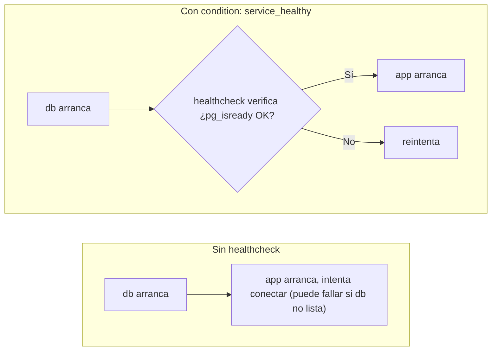
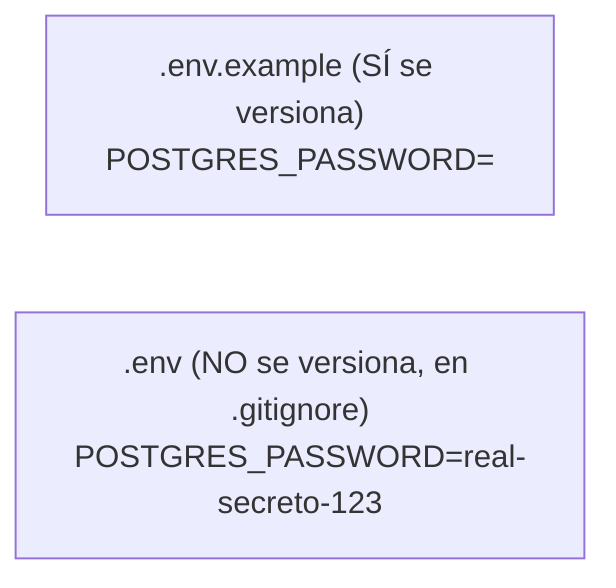
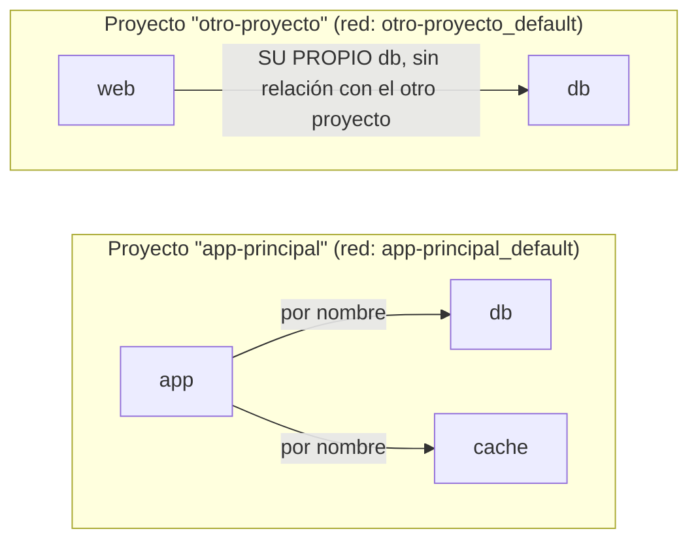
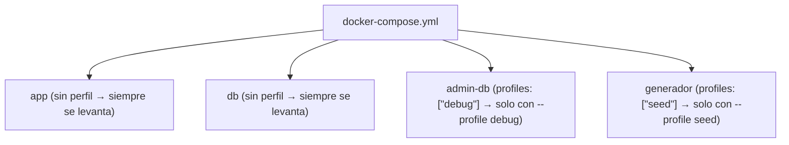

# Módulo 3: Docker Compose y orquestación local


## Aprende construyendo

### Tema 1: Servicios, dependencias y healthchecks

#### Paso 1 · Objetivo y preparación

Al finalizar podrás configurar un healthcheck y `depends_on: condition: service_healthy` para que un servicio espere disponibilidad real, no solo el arranque del proceso de otro.

**Conocimiento previo:** Docker y Docker Compose básicos (Módulos 0-2 de este track).

#### Paso 2 · Contexto y caso real

**¿Por qué es importante?** Este es un caso real de cualquier stack con base de datos: los errores de arranque intermitentes causados por dependencias mal coordinadas son una fuente común y frustrante de fallos "aleatorios" en desarrollo y CI.

#### Paso 3 · Teoría con analogía

**Conceptos clave:** servicio, `depends_on`, healthcheck, `condition: service_healthy`, disponibilidad real vs arranque del proceso.

Un healthcheck es una instrucción que Docker ejecuta periódicamente dentro de un contenedor para determinar si el servicio está realmente listo para recibir tráfico, más allá de haber arrancado el proceso. `depends_on` sin condición adicional solo garantiza el orden de arranque, no que el servicio ya esté listo. `depends_on` combinado con `condition: service_healthy` resuelve esto: Compose espera activamente a que el healthcheck reporte saludable antes de arrancar el siguiente servicio. Este mismo patrón reaparece en Kubernetes como "readiness probes".

**Analogía:** `depends_on` sin healthcheck es como avisar a un camarero que "la cocina ya está abierta" en el momento en que el cocinero entra, sin verificar si terminó de encender los fogones. Un healthcheck es esperar a que el cocinero confirme "ya estoy listo" antes de dejar que tomen pedidos.

**Diagrama:**



#### Paso 4 · Demostración guiada desde cero

Desde una carpeta vacía crea `academia-devops/src/modulo3/healthcheck`:

```bash
mkdir -p academia-devops/src/modulo3/healthcheck && cd academia-devops/src/modulo3/healthcheck
cat > compose.yaml <<'EOF'
services:
  db:
    image: postgres:16-alpine
    environment:
      POSTGRES_PASSWORD: demo
    healthcheck:
      test: ["CMD-SHELL", "pg_isready -U postgres"]
      interval: 2s
      retries: 10
  app:
    image: alpine
    depends_on:
      db:
        condition: service_healthy
    command: sh -c "echo 'app arrancó DESPUES de que db reportara healthy'; sleep 5"
EOF
```

**Explicación línea por línea:** `condition: service_healthy` hace que Compose no arranque `app` hasta que el healthcheck de `db` (`pg_isready`) reporte éxito, no simplemente hasta que el contenedor de `db` exista.

Levanta el stack y observa el orden real de arranque:

```bash
docker compose up -d
docker compose logs app
docker compose ps
```

**Resultado esperado:** los logs de `app` muestran el mensaje solo después de que `docker compose ps` reporta `db` como `healthy`; nunca antes.

**Fallo deliberado:** quita el bloque `healthcheck` completo de `db` y deja solo `depends_on: [db]` (sin `condition`) en `app`. Repite `docker compose up -d`. En una máquina lenta o bajo carga, `app` puede arrancar e intentar conectar a `db` antes de que esté realmente lista — diagnostica revisando `docker compose logs app` en busca de errores de conexión intermitentes al inicio.

#### Paso 5 · Práctica guiada

Agrega un segundo servicio `cache` (imagen `redis:7-alpine`) con su propio healthcheck (`redis-cli ping`) y haz que `app` dependa también de `cache` con `condition: service_healthy`. **Pista:** un servicio puede tener múltiples dependencias en `depends_on`, cada una con su propia condición.

#### Paso 6 · Práctica independiente

Reduce `retries` a `1` en el healthcheck de `db` y observa qué pasa si la base de datos tarda más de lo esperado en arrancar; explica por qué Compose marcaría el servicio como `unhealthy` en vez de seguir esperando indefinidamente.

#### Paso 7 · Cierre y evidencia

Ya coordinas el arranque real de servicios dependientes, no solo su orden. El siguiente tema externaliza configuración sensible fuera del archivo Compose versionado. **Evidencia:** entrega los logs de `app` mostrando que arrancó después de `db healthy`, y el resultado del fallo deliberado sin `condition`. Fuente oficial: [Docker Compose — healthcheck](https://docs.docker.com/reference/compose-file/services/#healthcheck).

**Errores comunes:** confundir `depends_on` simple con una garantía de disponibilidad real; configurar un healthcheck que solo verifica que el proceso existe, no que el servicio funciona.

**Cuándo no usarlo:** para servicios sin estado que no tienen un momento real de "no listo" (por ejemplo, un contenedor que solo imprime un log y termina), un healthcheck añade complejidad sin beneficio; el límite es que solo aporta valor cuando existe una ventana real entre "arrancado" y "listo".

### Tema 2: Variables de entorno y .env

#### Paso 1 · Objetivo y preparación

Al finalizar podrás externalizar configuración sensible en `.env`, versionando solo una plantilla `.env.example`, sin exponer secretos reales en el repositorio.

**Conocimiento previo:** Tema 1 de este módulo.

#### Paso 2 · Contexto y caso real

**¿Por qué es importante?** Este es un caso real de seguridad: filtrar secretos accidentalmente a un repositorio de código —típicamente por versionar un `.env` real— es uno de los incidentes más comunes y fácilmente evitables en proyectos de software.

#### Paso 3 · Teoría con analogía

**Conceptos clave:** archivo `.env`, interpolación de variables, configuración externalizada, secretos fuera del código versionado.

Un archivo `.env` contiene pares clave-valor que Compose carga automáticamente e interpola en `docker-compose.yml` con `${NOMBRE_VARIABLE}`. La práctica estándar: versionar `.env.example` con claves pero valores vacíos, y excluir `.env` real vía `.gitignore`. La interpolación admite valores por defecto (`${VARIABLE:-valor}`), similar a la sintaxis de bash del Módulo 0. Esta externalización es adecuada para desarrollo local, pero no sustituye mecanismos más robustos en producción (Vault, SOPS, Secrets Manager).

**Analogía:** un archivo `.env` es como una hoja de configuración personal que cada persona guarda en su propio cajón, mientras que `.env.example` es una plantilla en blanco compartida que muestra qué campos rellenar sin revelar valores reales.

**Diagrama:**



#### Paso 4 · Demostración guiada desde cero

Desde una carpeta vacía crea `academia-devops/src/modulo3/env-demo`:

```bash
mkdir -p academia-devops/src/modulo3/env-demo && cd academia-devops/src/modulo3/env-demo
echo "POSTGRES_PASSWORD=" > .env.example
echo "POSTGRES_PASSWORD=desarrollo123" > .env
echo ".env" > .gitignore
cat > compose.yaml <<'EOF'
services:
  db:
    image: postgres:16-alpine
    environment:
      POSTGRES_PASSWORD: ${POSTGRES_PASSWORD:-sin-configurar}
EOF
```

**Explicación línea por línea:** `.gitignore` con `.env` evita que el archivo con el valor real se versione; `${POSTGRES_PASSWORD:-sin-configurar}` usa un valor por defecto explícito si la variable no está definida en absoluto.

Verifica que Compose interpola el valor correcto:

```bash
docker compose config | grep POSTGRES_PASSWORD
mv .env .env.bak
docker compose config | grep POSTGRES_PASSWORD
mv .env.bak .env
```

**Resultado esperado:** con `.env` presente, `docker compose config` muestra `POSTGRES_PASSWORD: desarrollo123`; tras renombrarlo temporalmente, muestra `POSTGRES_PASSWORD: sin-configurar` (el valor por defecto), sin que Compose falle.

**Fallo deliberado:** quita el valor por defecto del `compose.yaml` (deja solo `${POSTGRES_PASSWORD}`) y repite sin `.env` presente. `docker compose config` muestra la variable vacía sin avisar — diagnostica que sin un valor por defecto explícito ni una variable obligatoria declarada, Compose no siempre falla ruidosamente ante configuración faltante.

#### Paso 5 · Práctica guiada

Agrega una segunda variable `APP_PORT` con valor por defecto `3000` en el `compose.yaml`, y verifica con `docker compose config` que cambia si la defines explícitamente en `.env`. **Pista:** usa la misma sintaxis `${APP_PORT:-3000}`.

#### Paso 6 · Práctica independiente

Intenta (deliberadamente, para comprobarlo) hacer `git add .env` en este proyecto de prueba y confirma que `.gitignore` lo bloquea; explica en un comentario qué comando usarías si necesitaras forzar su versionado por error, y por qué nunca deberías hacerlo con secretos reales.

#### Paso 7 · Cierre y evidencia

Ya separas configuración versionable de secretos reales, con valores por defecto explícitos. El siguiente tema explica cómo los servicios de un mismo proyecto Compose se descubren entre sí por nombre. **Evidencia:** entrega la salida de `docker compose config` con y sin `.env` presente, mostrando el valor real y el valor por defecto respectivamente. Fuente oficial: [Docker Compose — variables de entorno](https://docs.docker.com/compose/environment-variables/set-environment-variables/).

**Errores comunes:** versionar accidentalmente el `.env` real en vez de `.env.example`; asumir que Compose siempre falla si una variable no está definida, cuando en realidad puede quedar vacía silenciosamente sin un valor por defecto o una declaración obligatoria.

**Cuándo no usarlo:** en producción, un `.env` en disco no sustituye un gestor de secretos real; el límite de este mecanismo es desarrollo local, no el almacenamiento de credenciales de producción.

### Tema 3: Redes y descubrimiento por nombre de servicio

#### Paso 1 · Objetivo y preparación

Al finalizar podrás explicar por qué un servicio de Compose alcanza a otro por su nombre, y por qué dos proyectos Compose distintos están aislados entre sí por defecto.

**Conocimiento previo:** Temas 1 y 2 de este módulo; Tema 5 del Módulo 2 (redes Docker).

#### Paso 2 · Contexto y caso real

**¿Por qué es importante?** Este es un caso real de confusión común: intentar que dos `docker-compose.yml` independientes se comuniquen entre sí por nombre de servicio sin configuración de red explícita adicional no funciona, y entender por qué evita perder tiempo depurando algo que es comportamiento esperado.

#### Paso 3 · Teoría con analogía

**Conceptos clave:** red implícita de Compose, nombre de servicio como hostname, aislamiento entre proyectos.

Docker Compose crea automáticamente una red definida por el usuario específica para cada proyecto, y conecta a ella todos los servicios del `docker-compose.yml`. Dentro de esa red, cada servicio resuelve a cualquier otro por su nombre de servicio como hostname. Esta red es específica de cada proyecto: dos proyectos Compose distintos corriendo simultáneamente viven en redes separadas y aisladas por defecto, evitando colisiones de nombres entre proyectos distintos.

**Analogía:** cada proyecto Compose es un edificio de oficinas independiente con su propio directorio telefónico interno. Un edificio distinto tiene su propio directorio separado; aunque ambos podrían tener un departamento llamado "recepción", no hay confusión porque cada directorio es privado de su edificio.

**Diagrama:**



#### Paso 4 · Demostración guiada desde cero

Desde una carpeta vacía crea DOS proyectos Compose independientes con un servicio `db` en cada uno, para demostrar el aislamiento:

```bash
mkdir -p academia-devops/src/modulo3/proyecto-a academia-devops/src/modulo3/proyecto-b
cat > academia-devops/src/modulo3/proyecto-a/compose.yaml <<'EOF'
services:
  db:
    image: alpine
    command: sleep 300
  cliente:
    image: alpine
    depends_on: [db]
    command: sh -c "ping -c 2 db"
EOF
cp academia-devops/src/modulo3/proyecto-a/compose.yaml academia-devops/src/modulo3/proyecto-b/compose.yaml
cd academia-devops/src/modulo3/proyecto-a && docker compose up -d db
cd ../proyecto-b && docker compose up -d db
cd ../proyecto-a && docker compose run --rm cliente
```

**Explicación línea por línea:** ambos proyectos definen un servicio llamado `db` de forma completamente independiente; `docker compose run --rm cliente` ejecuta el `ping` dentro de la red del proyecto `proyecto-a` exclusivamente.

**Resultado esperado:** el `ping` desde `proyecto-a` alcanza exitosamente a SU `db`, sin ningún conflicto ni ambigüedad con el `db` homónimo de `proyecto-b`.

**Fallo deliberado:** intenta desde un contenedor de `proyecto-a` hacer `ping` al nombre de red completo del `db` de `proyecto-b` (`docker compose -p proyecto-a run --rm cliente ping -c 2 proyecto-b-db-1`). Falla por resolución de nombre — diagnostica que cada proyecto vive en su propia red aislada y no hay resolución cruzada sin configuración explícita de red compartida.

#### Paso 5 · Práctica guiada

Detén ambos proyectos (`docker compose down` en cada carpeta) y verifica con `docker network ls` que existían dos redes separadas con nombres distintos antes de eliminarlas. **Pista:** el nombre de la red suele derivarse del nombre de la carpeta del proyecto.

#### Paso 6 · Práctica independiente

Investiga (y documenta sin necesariamente ejecutarlo) cómo conectarías explícitamente ambos proyectos si necesitaras que se comunicaran, usando una red externa compartida declarada con `networks: external: true` en ambos `compose.yaml`.

#### Paso 7 · Cierre y evidencia

Ya explicas por qué el descubrimiento por nombre funciona dentro de un proyecto y no entre proyectos distintos. El siguiente tema activa servicios opcionales solo cuando se necesitan. **Evidencia:** entrega el `ping` exitoso dentro del mismo proyecto y el fallo de resolución entre proyectos distintos, con su explicación. Fuente oficial: [Docker Compose — Networking](https://docs.docker.com/compose/how-tos/networking/).

**Errores comunes:** asumir que dos proyectos Compose corriendo a la vez comparten red automáticamente; nombrar servicios de forma ambigua asumiendo que el aislamiento por proyecto los protege de cualquier confusión humana también.

**Cuándo no usarlo:** si dos servicios necesitan comunicarse constantemente y viven en proyectos Compose distintos, mantenerlos separados con redes externas compartidas añade fricción innecesaria; ahí conviene definirlos en el mismo `compose.yaml`.

### Tema 4: Perfiles para distintos entornos

#### Paso 1 · Objetivo y preparación

Al finalizar podrás usar `profiles` para que servicios opcionales (herramientas de administración, generadores de datos) solo se levanten cuando se activan explícitamente.

**Conocimiento previo:** Temas 1 a 3 de este módulo.

#### Paso 2 · Contexto y caso real

**¿Por qué es importante?** Este es un caso real de cualquier equipo: los perfiles evitan duplicar archivos Compose para distintos escenarios de uso, y evitan que cada desarrollador tenga que comentar/descomentar servicios opcionales manualmente.

#### Paso 3 · Teoría con analogía

**Conceptos clave:** `profiles`, activación selectiva de servicios, herramientas opcionales de desarrollo.

Un perfil etiqueta un servicio para que solo se levante cuando ese perfil se activa explícitamente (`docker compose --profile <nombre> up`), en vez de levantarse siempre. Un servicio puede no pertenecer a ningún perfil (siempre se levanta), pertenecer a uno específico, o a varios simultáneamente.

**Analogía:** los perfiles son como las opciones adicionales de un electrodoméstico multifuncional: el modo básico siempre está disponible, pero funciones adicionales solo se activan si explícitamente seleccionas esa opción.

**Diagrama:**



#### Paso 4 · Demostración guiada desde cero

Desde una carpeta vacía crea `academia-devops/src/modulo3/perfiles`:

```bash
mkdir -p academia-devops/src/modulo3/perfiles && cd academia-devops/src/modulo3/perfiles
cat > compose.yaml <<'EOF'
services:
  app:
    image: alpine
    command: sleep 300
  admin-db:
    image: alpine
    command: sleep 300
    profiles: ["debug"]
EOF
docker compose up -d
docker compose ps --services
```

**Explicación línea por línea:** `admin-db` tiene `profiles: ["debug"]`, por lo que `docker compose up -d` sin argumentos adicionales no debe incluirlo.

Ahora activa el perfil explícitamente:

```bash
docker compose --profile debug up -d
docker compose ps --services
```

**Resultado esperado:** el primer `docker compose ps --services` lista solo `app`; después de activar `--profile debug`, la lista incluye también `admin-db`.

**Fallo deliberado:** ejecuta `docker compose up -d` (sin `--profile`) esperando ver `admin-db`, sin haberlo activado nunca. No aparece — diagnostica revisando la indentación de `profiles:` en el YAML (debe estar al mismo nivel que `image`/`command` dentro del servicio, no a nivel del archivo completo).

#### Paso 5 · Práctica guiada

Agrega un tercer servicio `generador` con `profiles: ["seed"]`, y confirma que `docker compose --profile seed up -d` levanta `app` y `generador`, pero no `admin-db`. **Pista:** cada perfil se activa de forma independiente; puedes combinar varios con `--profile debug --profile seed`.

#### Paso 6 · Práctica independiente

Cambia `admin-db` para que pertenezca a dos perfiles simultáneamente (`profiles: ["debug", "seed"]`) y confirma que se levanta al activar cualquiera de los dos perfiles por separado.

#### Paso 7 · Cierre y evidencia

Ya activas selectivamente servicios opcionales desde un único archivo compartido por todo el equipo. Esto cierra el módulo de Docker Compose; el siguiente módulo construye el pipeline de integración continua que usará estos mismos servicios. **Evidencia:** entrega la salida de `docker compose ps --services` sin perfil y con `--profile debug` activado, y explica la diferencia observada. Fuente oficial: [Docker Compose — profiles](https://docs.docker.com/compose/how-tos/profiles/).

**Errores comunes:** indentar `profiles` incorrectamente, aplicándolo sin querer al archivo completo en vez de a un servicio específico; olvidar documentar qué perfiles existen, dejando que el equipo no sepa que una herramienta opcional está disponible.

**Cuándo no usarlo:** si un servicio es necesario para que la aplicación funcione en cualquier escenario, no debe llevar `profiles`; el límite de esta técnica es exclusivamente para lo verdaderamente opcional, no para dependencias core del sistema.

---


## Laboratorio práctico

**Objetivo del laboratorio:** construir un `docker-compose.yml` con una aplicación, una base de datos PostgreSQL y una caché Redis, coordinados con healthchecks, configuración externalizada en `.env`, y un perfil opcional de depuración.

**Requisitos previos:** Docker y Docker Compose instalados, conocimientos de los Módulos 0-2 de este track.

| Paso | Acción | Comando/Configuración | Explicación | Salida esperada |
|---|---|---|---|---|
| 1 | Crear `.env.example` y `.env` | `.env.example` con `POSTGRES_PASSWORD=` vacío; `.env` con valor real | Separa plantilla versionable de valor privado | Ambos existen; `.env` en `.gitignore` |
| 2 | Definir `db` con healthcheck | Imagen `postgres:16`, `POSTGRES_PASSWORD: ${POSTGRES_PASSWORD}`, healthcheck con `pg_isready` | Aplica el Tema 1 | El archivo se guarda sin errores YAML |
| 3 | Definir `cache` | Imagen `redis:7` | Servicio simple sin dependencias | El archivo incluye `cache` |
| 4 | Definir `app` con dependencia saludable | `depends_on: db: condition: service_healthy`, conexión usando `db` como hostname | Aplica los Temas 1 y 3 | El archivo Compose queda completo |
| 5 | Añadir `pgadmin` con perfil | `profiles: ["debug"]` | Aplica el Tema 4 | Existe en el archivo pero no se levanta por defecto |
| 6 | Levantar el stack básico | `docker compose up -d` | Solo `app`, `db`, `cache` | `docker compose ps` sin `pgadmin` |
| 7 | Verificar que `app` esperó a `db` | `docker compose logs app` | Confirma ausencia de errores de conexión al inicio | Sin errores de conexión prematura |
| 8 | Levantar también el perfil de depuración | `docker compose --profile debug up -d` | Ahora sí se levanta `pgadmin` | `docker compose ps` incluye `pgadmin` |
| 9 | Verificar descubrimiento de nombres | `docker compose exec app sh`, luego conectar a `db` por nombre | Confirma resolución de nombre dentro de la red de Compose | Conexión exitosa usando el nombre, no una IP |

**Verificación:** el laboratorio se considera exitoso si `docker compose up -d` sin perfil levanta exactamente tres servicios, si los logs de `app` no muestran errores de conexión prematura, y si activar `debug` añade el cuarto servicio sin modificar el archivo.

**Errores comunes y soluciones**

- **`app` sigue fallando al conectar a pesar del healthcheck.** Verifica que refleja disponibilidad funcional real, con `interval`/`retries` suficientes.
- **Las variables de `.env` no se interpolan.** Confirma que `.env` está en la misma carpeta desde la que ejecutas `docker compose`.
- **El perfil `debug` se levanta siempre.** Revisa la indentación de `profiles` dentro del servicio, no a nivel del archivo.
- **`docker compose exec app sh` falla sin shell disponible.** Si tu imagen es distroless (Módulo 2, Tema 3), usa Alpine para este paso de depuración.

---
