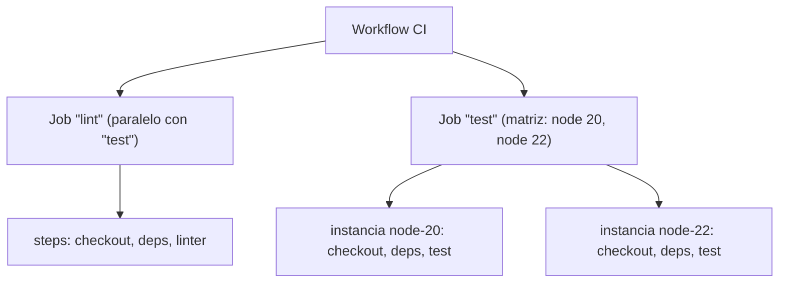

# Módulo 4: CI — pipelines automatizados


## Aprende construyendo

### Tema 1: Jobs, steps y matrices de build

#### Paso 1 · Objetivo y preparación

Al finalizar podrás escribir un workflow de GitHub Actions con un job matricial que ejecuta las mismas pruebas contra varias versiones de runtime en paralelo.

**Conocimiento previo:** Git (Módulo 1) y Docker (Módulo 2) de este track; un repositorio con un `package.json` simple.

#### Paso 2 · Contexto y caso real

**¿Por qué es importante?** Este es un caso real de cualquier equipo activo: diseñar bien jobs, steps y matrices determina si CI se siente como una herramienta rápida que da confianza inmediata, o como un obstáculo lento que el equipo empieza a evitar.

#### Paso 3 · Teoría con analogía

**Conceptos clave:** job, step, ejecución paralela, `strategy.matrix`, runner.

Un pipeline de CI se organiza en jobs, cada uno en su propio runner, compuesto de steps secuenciales. Distintos jobs corren en paralelo por defecto, a menos que se declare una dependencia explícita entre ellos. Una matriz de build (`strategy.matrix`) ejecuta el mismo job múltiples veces, una por cada combinación de valores especificados (por ejemplo, `node-version: [20, 22]`), sin duplicar la definición del job.

**Analogía:** los jobs son como distintos equipos de inspección trabajando en paralelo sobre un mismo producto. Una matriz de build es pedirle al mismo equipo que repita la misma prueba sobre varias versiones del producto, automáticamente y en paralelo.

**Diagrama:**



#### Paso 4 · Demostración guiada desde cero

Desde una carpeta vacía crea `academia-devops/src/modulo4/ci-matriz` con el workflow y valida su sintaxis:

```bash
mkdir -p academia-devops/src/modulo4/ci-matriz/.github/workflows
cd academia-devops/src/modulo4/ci-matriz
cat > .github/workflows/ci.yml <<'EOF'
name: CI
on: [pull_request]
jobs:
  test:
    runs-on: ubuntu-latest
    strategy:
      matrix:
        node-version: [20, 22]
    steps:
      - uses: actions/checkout@v4
      - uses: actions/setup-node@v4
        with:
          node-version: ${{ matrix.node-version }}
      - run: npm test
EOF
echo '{"scripts":{"test":"node -e \"console.log(process.version)\""}}' > package.json
```

**Explicación línea por línea:** `strategy.matrix.node-version` genera dos instancias del job `test`, una por cada versión listada; `${{ matrix.node-version }}` interpola el valor de esa instancia específica dentro de cada step.

Valida la sintaxis YAML y simula localmente las dos instancias de la matriz con Docker (sin depender de GitHub real):

```bash
docker run --rm -v "$(pwd)":/w -w /w python:3.12-alpine python3 -c "import yaml; yaml.safe_load(open('.github/workflows/ci.yml')); print('YAML valido')"
for version in 20 22; do
  echo "--- instancia matriz node-version=$version ---"
  docker run --rm -v "$(pwd)":/app -w /app "node:$version-alpine" npm test
done
```

**Resultado esperado:** `YAML valido` confirma que el workflow no tiene errores de sintaxis; cada instancia de la "matriz" simulada imprime su propia versión de Node (`v20.x.x` y `v22.x.x`), demostrando en local el mismo paralelismo que GitHub Actions ejecutaría remotamente.

**Fallo deliberado:** rompe la indentación de `strategy` (quítale dos espacios, dejándola al mismo nivel que `jobs` en vez de dentro de `test`) y repite la validación con `python3 -c "import yaml; yaml.safe_load(...)"`. El YAML puede seguir siendo sintácticamente válido pero GitHub Actions lo rechazaría como estructura de workflow inválida — diagnostica revisando que cada clave estructural (`strategy`, `steps`) esté anidada exactamente bajo el job correspondiente.

#### Paso 5 · Práctica guiada

Agrega una segunda dimensión a la matriz (`os: [ubuntu-latest]`, luego amplía a más de un valor si tu proyecto lo requiere) y cuenta cuántas instancias totales generaría el producto cartesiano resultante. **Pista:** el número total de instancias es el producto del tamaño de cada dimensión de la matriz.

#### Paso 6 · Práctica independiente

Agrega un segundo job `lint` sin matriz, y declara que `test` no depende de `lint` (corren en paralelo); documenta en un comentario qué cambiarías si quisieras que `test` solo corriera después de que `lint` pasara.

#### Paso 7 · Cierre y evidencia

Ya diseñas jobs paralelos y matrices sin duplicar definiciones. El siguiente tema evita reinstalar dependencias en cada ejecución con caché. **Evidencia:** entrega la salida de las dos instancias simuladas de la matriz mostrando cada versión de Node, y explica el resultado del YAML mal indentado. Fuente oficial: [GitHub Actions — matrix](https://docs.github.com/actions/using-jobs/using-a-matrix-for-your-jobs).

**Errores comunes:** indentar `strategy.matrix` fuera del job al que pertenece; asumir que todos los jobs de un workflow corren secuencialmente por defecto, cuando en realidad corren en paralelo salvo dependencia explícita.

**Cuándo no usarlo:** para un proyecto que solo soporta oficialmente una única versión de runtime, una matriz añade tiempo de ejecución sin beneficio real; el límite es que solo aporta valor cuando de verdad necesitas verificar compatibilidad entre varias combinaciones.

### Tema 2: Caché de dependencias en CI

#### Paso 1 · Objetivo y preparación

Al finalizar podrás configurar caché de dependencias basada en el lockfile para evitar reinstalaciones innecesarias en cada ejecución del pipeline.

**Conocimiento previo:** Tema 1 de este módulo; Módulo 2 (invalidación de caché de capas Docker).

#### Paso 2 · Contexto y caso real

**¿Por qué es importante?** Este es un caso real de cualquier equipo con pipelines frecuentes: incluso un ahorro de un minuto por ejecución gracias al caché se traduce en un ahorro acumulado sustancial para todo el equipo.

#### Paso 3 · Teoría con analogía

**Conceptos clave:** caché de `node_modules`, clave de caché basada en el lockfile, invalidación de caché.

El caché de dependencias guarda el resultado de una instalación entre ejecuciones, asociado a una clave derivada del contenido del lockfile (`package-lock.json`). Mientras el lockfile no cambie, la plataforma restaura la caché en vez de reinstalar. En cuanto cambia, la clave cambia y se fuerza una instalación completa nueva. Este es el mismo mecanismo de invalidación de capas que estudiaste con Docker.

**Analogía:** el caché de dependencias es como no tener que volver a comprar y desempacar herramientas de un taller cada vez que empiezas un trabajo, siempre que la lista de herramientas (el lockfile) no haya cambiado.

**Diagrama:**

```
┌── Ejecución 1 (lockfile hash-A) ──┐   ┌── Ejecución 2 (mismo hash-A) ──┐
│ npm ci (instalación completa)        │   │ restaura caché con clave "hash-A"  │
│ guarda caché con clave "hash-A"       │   │ salta la instalación (rápido)        │
└─────────────────────┘   └───────────────────────┘
Ejecución 3 (lockfile hash-B, cambió) ──▶ clave no existe ──▶ npm ci de nuevo
```

#### Paso 4 · Demostración guiada desde cero

Desde una carpeta vacía crea `academia-devops/src/modulo4/cache-ci` y simula el ciclo de caché con un volumen Docker (equivalente local al `cache: 'npm'` de `setup-node`):

```bash
mkdir -p academia-devops/src/modulo4/cache-ci && cd academia-devops/src/modulo4/cache-ci
echo '{"name":"demo","dependencies":{"left-pad":"1.3.0"}}' > package.json
docker volume create npm-cache-demo
HASH1=$(sha256sum package.json | cut -d" " -f1)
echo "clave de cache derivada del lockfile: $HASH1"
time docker run --rm -v "$(pwd)":/app -v npm-cache-demo:/root/.npm -w /app node:22-alpine npm install --prefer-offline
```

**Explicación línea por línea:** `sha256sum package.json` deriva una clave estable a partir del contenido exacto del archivo, el mismo principio que usa `setup-node` internamente; el volumen `npm-cache-demo` persiste el caché de npm entre ejecuciones del contenedor. `--prefer-offline` es la bandera que le dice a `npm` que use los paquetes ya cacheados sin verificar contra el registro remoto si el caché parece válido, acelerando instalaciones repetidas.

Repite la instalación sin cambiar nada, y mide si es más rápida:

```bash
time docker run --rm -v "$(pwd)":/app -v npm-cache-demo:/root/.npm -w /app node:22-alpine npm install --prefer-offline
```

**Resultado esperado:** la segunda ejecución reporta un tiempo (`real`) notablemente menor que la primera, porque `npm` reutiliza los paquetes ya descargados en el volumen `npm-cache-demo` en vez de descargarlos de la red nuevamente.

**Fallo deliberado:** cambia la versión de `left-pad` en `package.json` (por ejemplo a `1.3.1`) y repite. El hash (`sha256sum package.json`) cambia, y aunque el volumen de caché sigue existiendo, npm debe resolver y potencialmente descargar la nueva versión — diagnostica que la clave de caché cambiada refleja correctamente que las dependencias declaradas ya no son idénticas a las cacheadas.

#### Paso 5 · Práctica guiada

Calcula el hash de `package.json` antes y después de un cambio cosmético que no afecte dependencias (por ejemplo, reordenar campos) y confirma si el hash cambia igual. **Pista:** `sha256sum` es sensible a cualquier byte distinto, incluso espacios; por eso `setup-node` usa específicamente el lockfile, no el `package.json` completo.

#### Paso 6 · Práctica independiente

Simula una "invalidación de caché en cascada" eliminando el volumen (`docker volume rm npm-cache-demo`) y mide de nuevo el tiempo de instalación; compara los tres tiempos (sin caché, con caché válido, con caché eliminado) y documenta la diferencia.

#### Paso 7 · Cierre y evidencia

Ya evitas reinstalaciones innecesarias basando el caché en el contenido real del lockfile. El siguiente tema conserva reportes generados durante una ejecución más allá de sus logs. **Evidencia:** entrega los tres tiempos medidos (sin caché, con caché, tras invalidación) y explica la diferencia observada. Fuente oficial: [GitHub Actions — setup-node caching](https://github.com/actions/setup-node#caching-global-packages-data).

**Errores comunes:** cachear directamente `node_modules` sin lockfile como clave, arriesgando reutilizar dependencias desactualizadas; no versionar el lockfile, dejando sin base estable la clave de caché.

**Cuándo no usarlo:** en un proyecto con muy pocas dependencias donde la instalación tarda segundos, el caché añade complejidad de configuración sin beneficio proporcional; el límite es cuándo el tiempo ahorrado supera el coste de mantener la configuración de caché.

### Tema 3: Artifacts y reportes de cobertura

#### Paso 1 · Objetivo y preparación

Al finalizar podrás publicar un reporte de cobertura como artifact descargable de una ejecución de CI, y pasar resultados entre jobs que no comparten sistema de archivos.

**Conocimiento previo:** Temas 1 y 2 de este módulo.

#### Paso 2 · Contexto y caso real

**¿Por qué es importante?** Este es un caso real de revisión de código: un revisor puede consultar directamente el reporte de cobertura de una ejecución concreta para confirmar que el código nuevo está cubierto por pruebas, sin depender únicamente de la palabra del autor.

#### Paso 3 · Teoría con analogía

**Conceptos clave:** artifact, reporte de cobertura, retención de artifacts, trazabilidad de una ejecución.

Un artifact es cualquier archivo generado durante una ejecución que se sube y queda disponible para descarga desde esa ejecución específica. Los artifacts tienen un periodo de retención configurable tras el cual se eliminan automáticamente; no sustituyen almacenamiento permanente (para eso existe un registry de contenedores, Módulo 2). También son el mecanismo típico para pasar resultados entre jobs que corren en runners aislados sin sistema de archivos compartido.

**Analogía:** un artifact es como el expediente de evidencia archivado tras una inspección, disponible para consulta después, en vez de que el inspector solo diga verbalmente "todo está bien".

**Diagrama:**

```
┌── Job "test" ────────────────┐       ┌── Job "deploy" (posterior) ──┐
│ ejecuta tests con --coverage      │  ───▶ │ descarga el artifact              │
│ sube "coverage/" como artifact      │       │ "binario-compilado" del job "build" │
└────────────────────────┘       └─────────────────────────┘
```

#### Paso 4 · Demostración guiada desde cero

Desde una carpeta vacía crea `academia-devops/src/modulo4/artifacts` y simula la generación y el paso de un artifact entre dos "jobs" (dos contenedores que no comparten sistema de archivos, salvo un volumen explícito que representa el mecanismo de artifacts):

```bash
mkdir -p academia-devops/src/modulo4/artifacts && cd academia-devops/src/modulo4/artifacts
docker volume create artifacts-demo
docker run --rm -v artifacts-demo:/artifacts alpine sh -c \
  "mkdir -p /artifacts/coverage && echo 'lineas cubiertas: 87%' > /artifacts/coverage/resumen.txt && echo 'job build: artifact generado'"
docker run --rm -v artifacts-demo:/artifacts alpine sh -c \
  "echo 'job deploy: leyendo artifact del job anterior'; cat /artifacts/coverage/resumen.txt"
```

**Explicación línea por línea:** el volumen `artifacts-demo` simula el mecanismo de artifacts de CI: el primer contenedor ("job build") escribe un resultado que el segundo contenedor ("job deploy", que no comparte sistema de archivos por defecto) puede leer explícitamente a través de ese volumen compartido.

**Resultado esperado:** el segundo contenedor imprime `lineas cubiertas: 87%`, confirmando que pudo leer el resultado generado por el primer contenedor sin haber compartido su sistema de archivos original.

**Fallo deliberado:** ejecuta el segundo contenedor SIN montar el volumen `artifacts-demo` (`docker run --rm alpine cat /artifacts/coverage/resumen.txt`). Falla con "No such file or directory" — diagnostica que sin el mecanismo explícito de artifact (aquí, el volumen), dos jobs/contenedores aislados no comparten absolutamente nada por defecto.

#### Paso 5 · Práctica guiada

Agrega un segundo artifact simulado (un "binario" ficticio: `echo 'contenido binario' > /artifacts/app-compilada.bin`) generado por el primer contenedor, y confirma que el segundo también puede leerlo. **Pista:** ambos artifacts viven en el mismo volumen compartido, simulando el almacenamiento común de una ejecución de workflow.

#### Paso 6 · Práctica independiente

Simula la expiración de retención eliminando el volumen (`docker volume rm artifacts-demo`) después de "descargar" (copiar a tu carpeta local con `docker cp` si tuvieras un contenedor persistente, o simplemente documentando el resultado) y explica por qué un artifact expirado no debe ser la única copia de algo importante como una release oficial.

#### Paso 7 · Cierre y evidencia

Ya conservas y pasas resultados entre pasos aislados de un pipeline con artifacts. El siguiente tema versiona el pipeline mismo como código junto al proyecto. **Evidencia:** entrega la salida del segundo contenedor leyendo el artifact exitosamente, y el fallo al intentar leerlo sin el volumen montado. Fuente oficial: [GitHub Actions — artifacts](https://docs.github.com/actions/how-tos/write-workflows/choose-what-workflows-do/store-and-share-data).

**Errores comunes:** asumir que todos los jobs de un pipeline comparten sistema de archivos automáticamente; tratar un artifact con retención temporal como si fuera almacenamiento permanente para releases oficiales.

**Cuándo no usarlo:** para pasar datos triviales entre steps del MISMO job (que sí comparten sistema de archivos dentro de ese runner), un artifact es innecesario; su propósito es específicamente compartir entre jobs distintos o conservar resultados más allá de la ejecución.

### Tema 4: Pipelines como código (GitHub Actions/GitLab CI)

#### Paso 1 · Objetivo y preparación

Al finalizar podrás explicar por qué versionar el pipeline de CI/CD como código junto al proyecto da trazabilidad y reversibilidad que una configuración manual externa no da.

**Conocimiento previo:** Temas 1 a 3 de este módulo; Módulo 1 (Git avanzado).

#### Paso 2 · Contexto y caso real

**¿Por qué es importante?** Este es un caso real: si necesitas reproducir exactamente cómo se construía y probaba una versión del proyecto hace seis meses, el archivo de definición del pipeline de esa época está disponible en el historial de Git, no sobrescrito silenciosamente en una configuración externa.

#### Paso 3 · Teoría con analogía

**Conceptos clave:** pipeline declarativo en YAML, versionado del propio pipeline, disparadores (`on`).

Un pipeline como código vive en un archivo versionado junto al resto del proyecto, en vez de configurarse manualmente en una interfaz separada. Cualquier cambio al proceso de CI/CD pasa por el mismo flujo de revisión que cualquier otro cambio de código. Un disparador (`on`) especifica bajo qué evento se ejecuta el workflow: en cada `pull_request`, en cada push, en un horario cron (la misma sintaxis del Módulo 0), o manualmente.

**Analogía:** un pipeline como código es como tener la receta completa de un plato archivada y versionada junto con el resto de la documentación del restaurante, en vez de vivir solo en la memoria de un cocinero.

**Diagrama:**

```
┌── .github/workflows/ci.yml (versionado junto al código) ──┐
│ cambios pasan por pull request, revisión, historial de Git   │
│ on: [pull_request]  ──▶ dispara el workflow en cada PR         │
│ on: schedule (cron) ──▶ dispara en horario programado           │
└─────────────────────────────────────────────┘
```

#### Paso 4 · Demostración guiada desde cero

Desde una carpeta vacía crea `academia-devops/src/modulo4/pipeline-como-codigo` y demuestra la reproducibilidad histórica versionando dos versiones del pipeline:

```bash
mkdir -p academia-devops/src/modulo4/pipeline-como-codigo/.github/workflows
cd academia-devops/src/modulo4/pipeline-como-codigo
docker run --rm -v "$(pwd)":/repo -w /repo alpine/git sh -c '
  git init -q && git config user.email demo@academia.dev && git config user.name demo
  echo "name: CI
on: [push]
jobs:
  test:
    runs-on: ubuntu-latest
    steps:
      - run: echo solo un paso" > .github/workflows/ci.yml
  git add . && git commit -qm "pipeline v1: solo un paso"
  echo "name: CI
on: [push, pull_request]
jobs:
  test:
    runs-on: ubuntu-latest
    steps:
      - run: echo paso 1
      - run: echo paso 2 nuevo" > .github/workflows/ci.yml
  git add . && git commit -qm "pipeline v2: agrega pull_request y un paso nuevo"
  git log --oneline
  git show HEAD~1:.github/workflows/ci.yml'
```

**Explicación línea por línea:** `git show HEAD~1:.github/workflows/ci.yml` recupera exactamente cómo era el pipeline en el commit anterior, demostrando que su historial completo queda disponible en Git, igual que cualquier otro archivo del proyecto.

**Resultado esperado:** `git log --oneline` muestra dos commits; `git show HEAD~1:...` imprime el contenido exacto de la versión anterior del pipeline (`on: [push]`, un solo step), disponible aunque la versión actual ya sea distinta.

**Fallo deliberado:** intenta `git show HEAD~5:.github/workflows/ci.yml` (un commit que no existe, solo hay dos). Falla con un error de referencia inválida — diagnostica que el historial solo existe hasta donde realmente hay commits, y que reproducir una versión requiere que efectivamente haya sido versionada en ese momento.

#### Paso 5 · Práctica guiada

Agrega una tercera versión del pipeline con un disparador `schedule` (cron diario) además de `push`, y confirma con `git log --oneline` que ahora hay tres commits versionando la evolución completa. **Pista:** la sintaxis cron de `on: schedule` usa el mismo formato de cinco campos del Módulo 0.

#### Paso 6 · Práctica independiente

Usa `git diff HEAD~1 HEAD -- .github/workflows/ci.yml` para ver exactamente qué cambió entre las dos últimas versiones del pipeline, y explica en un comentario por qué esta visibilidad no existiría si el pipeline se configurara manualmente en una interfaz web no versionada.

#### Paso 7 · Cierre y evidencia

Ya versionas el pipeline con la misma disciplina que el código de la aplicación, con historial auditable y reversible. Esto cierra el módulo de CI; el siguiente módulo extiende este pipeline hacia el despliegue continuo. **Evidencia:** entrega como resultado el contenido recuperado de la versión anterior del pipeline vía `git show`, y explica el fallo al intentar acceder a un commit inexistente. Fuente oficial: [GitHub Actions — Understanding GitHub Actions](https://docs.github.com/actions/learn-github-actions/understanding-github-actions).

**Errores comunes:** configurar el pipeline manualmente en una interfaz web sin versionarlo, perdiendo trazabilidad; olvidar que cambios al pipeline mismo también deberían pasar por revisión de pull request, no aplicarse directamente a la rama principal.

**Cuándo no usarlo:** para una automatización completamente personal y de un solo uso que nunca necesitará auditarse ni revertirse, versionarla con el mismo rigor que un pipeline de equipo es una formalidad innecesaria; el límite es el valor real de la trazabilidad para el contexto específico.

---


## Laboratorio práctico

**Objetivo del laboratorio:** crear un workflow de GitHub Actions que ejecute lint y tests en cada pull request, con caché de dependencias, una matriz de dos versiones de runtime, y publicación de un reporte de cobertura como artifact.

**Requisitos previos:** un repositorio en GitHub con un proyecto Node.js simple, con scripts de `lint` y `test` configurados en su `package.json`.

| Paso | Acción | Configuración | Explicación | Resultado esperado |
|---|---|---|---|---|
| 1 | Crear el archivo del workflow | `.github/workflows/ci.yml` con `name: CI` y `on: [pull_request]` | Define cuándo se dispara el pipeline | El archivo existe en la ruta correcta |
| 2 | Definir el job con matriz | Job `test` con `strategy: matrix: node-version: [20, 22]` | Ejecutará el job dos veces | La definición incluye la matriz correctamente |
| 3 | Añadir steps de checkout y setup con caché | `actions/checkout@v4`, `actions/setup-node@v4` con `cache: 'npm'` | Descarga código y configura runtime con caché | Ambos steps sin errores de sintaxis |
| 4 | Añadir instalación, lint y test | `npm ci`, `npm run lint`, `npm test -- --coverage` | Instala y ejecuta validaciones | Los tres steps en orden secuencial |
| 5 | Añadir publicación del artifact | `actions/upload-artifact@v4` con `path: coverage/` | Sube el reporte de cobertura | El artifact queda definido |
| 6 | Abrir un pull request de prueba | Crea rama, cambio menor, abre PR | Dispara el workflow | GitHub muestra el workflow ejecutándose |
| 7 | Verificar la matriz en paralelo | Observa la ejecución | Dos instancias del job `test` | Ambas aparecen ejecutándose independientemente |
| 8 | Descargar el artifact de cobertura | Desde la ejecución completada | Confirma disponibilidad del reporte | El archivo descargado contiene el reporte |
| 9 | Provocar un fallo intencional | Rompe un test y push | Verifica detección de fallos | El workflow reporta estado fallido |

**Verificación:** el laboratorio se considera exitoso si el workflow se ejecuta al abrir el PR, la matriz ejecuta dos instancias paralelas, el artifact queda disponible, y romper un test hace que el pipeline reporte fallo visible.

**Errores comunes y soluciones**

- **El workflow no se dispara.** Verifica la ruta exacta `.github/workflows/` y que el YAML no tiene errores de sintaxis.
- **`cache: 'npm'` no acelera ejecuciones.** Confirma que tienes un `package-lock.json` versionado.
- **El artifact de cobertura aparece vacío.** Verifica que el test genera el reporte en la ruta especificada antes del step de subida.
- **La matriz ejecuta secuencialmente.** Normalmente indica un límite de runners concurrentes de tu plan, no un error de configuración.

---
