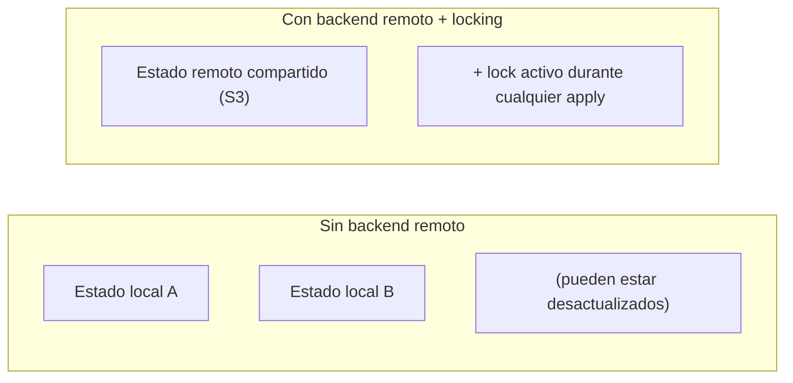
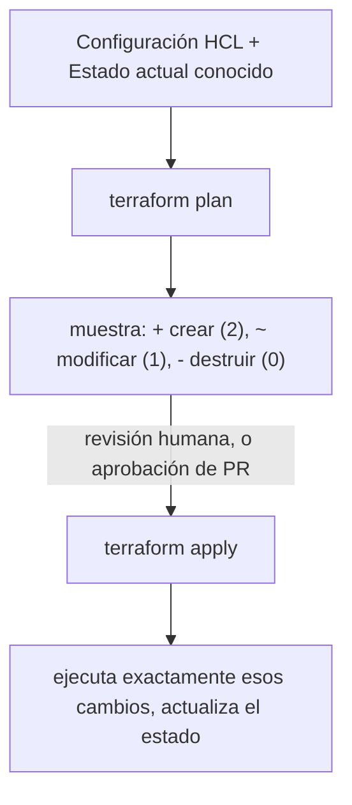

# Módulo 8: Infraestructura como código con Terraform


## Aprende construyendo

### Tema 1: Providers, resources y data sources

#### Paso 1 · Objetivo y preparación

Al finalizar podrás declarar un provider, un resource y un data source en HCL, entendiendo la diferencia entre gestionar infraestructura y solo consultarla.

**Conocimiento previo:** conceptos de infraestructura del track Cloud; Terraform instalado.

#### Paso 2 · Contexto y caso real

**¿Por qué es importante?** Este es un caso real: usar un `resource` para algo que ya existe y no debería gestionar esta configuración puede llevar a Terraform a intentar modificarlo o eliminarlo si la declaración se retira; un `data source` evita ese riesgo siendo puramente de solo lectura.

#### Paso 3 · Teoría con analogía

**Conceptos clave:** provider, resource, data source, HCL (HashiCorp Configuration Language).

Un provider es un plugin que sabe comunicarse con una plataforma específica, traduciendo HCL a llamadas de API reales. Un resource declara una pieza de infraestructura que Terraform debe crear, actualizar o eliminar. Un data source consulta información ya existente sin gestionar su ciclo de vida. HCL es declarativo: describes el estado final deseado, y Terraform calcula qué acciones concretas son necesarias.

**Analogía:** un provider es el traductor especializado para hablar con un proveedor específico. Un resource es una orden de compra ("necesito que exista un bucket con este nombre"). Un data source es consultar un catálogo existente sin pedir que se cree nada nuevo.

**Diagrama:**

```mermaid
flowchart TD
    A["provider \"aws\" { region = \"us-east-1\" }"] -->|significa| A2["plugin para hablar con AWS"]
    B["resource \"aws_s3_bucket\" \"datos\" { ... }"] -->|significa| B2["\"debe existir este bucket\""]
    C["data \"aws_ami\" \"ubuntu\" { most_recent = true }"] -->|significa| C2["\"consulta, no crees\""]
```

#### Paso 4 · Demostración guiada desde cero

Desde una carpeta vacía crea `academia-devops/src/modulo8/providers-resources` con el provider local (sin depender de credenciales de nube reales, usando el provider `local` de Terraform):

```bash
mkdir -p academia-devops/src/modulo8/providers-resources
cd academia-devops/src/modulo8/providers-resources
cat > main.tf <<'EOF'
terraform {
  required_providers {
    local = { source = "hashicorp/local", version = "~> 2.4" }
  }
}
provider "local" {}

resource "local_file" "config" {
  filename = "${path.module}/config-generado.txt"
  content  = "entorno=demo\nversion=1.0"
}

data "local_file" "leido" {
  filename = local_file.config.filename
}
EOF
terraform init
```

**Explicación línea por línea:** `resource "local_file" "config"` declara un archivo que Terraform debe crear y gestionar; `data "local_file" "leido"` lee ese mismo archivo (después de que el `resource` lo cree) sin gestionar su ciclo de vida, ilustrando la diferencia entre ambos conceptos con un provider simple que no requiere ninguna cuenta cloud.

Aplica la configuración y confirma que el `resource` creó el archivo:

```bash
terraform apply -auto-approve
cat config-generado.txt
terraform output -json 2>/dev/null || true
```

**Resultado esperado:** `terraform apply` reporta `1 added` (el `local_file.config`); `cat config-generado.txt` muestra el contenido exacto declarado en `content`, confirmando que el resource efectivamente gestionó la creación del archivo real en disco.

**Fallo deliberado:** borra manualmente `config-generado.txt` con `rm config-generado.txt` (fuera de Terraform, simulando un cambio externo no gestionado) y ejecuta `terraform plan`. Terraform detecta que el recurso ya no existe y planea recrearlo — diagnostica revisando la salida de `plan`, que muestra `+ create` de nuevo para un recurso que "ya estaba aplicado", exactamente la señal de que algo cambió la infraestructura real por fuera de Terraform.

#### Paso 5 · Práctica guiada

Agrega un segundo `resource "local_file"` para un archivo de log inicial vacío, y confirma con `terraform plan` que solo ese recurso nuevo aparece como `+ create`, sin afectar el ya existente. **Pista:** Terraform solo actúa sobre la diferencia entre el estado actual y la configuración declarada, no sobre todo de nuevo.

#### Paso 6 · Práctica independiente

Cambia el `content` del `local_file.config` y ejecuta `terraform plan`; confirma que el resultado es `~ update in-place` (modificación), no `-/+ destroy and re-create`, y explica por qué el contenido de un archivo local se puede actualizar sin recrearlo.

#### Paso 7 · Cierre y evidencia

Ya distingues cuándo declarar un `resource` gestionado y cuándo solo consultar con un `data` source. El siguiente tema protege el registro de qué gestiona realmente tu configuración. **Evidencia:** entrega la salida de `terraform apply` confirmando la creación, y el resultado del `plan` tras el borrado manual detectando la discrepancia. Fuente oficial: [Terraform — Resources](https://developer.hashicorp.com/terraform/language/resources).

**Errores comunes:** declarar como `resource` algo que en realidad ya existe y es gestionado por otro medio, arriesgando que Terraform intente eliminarlo; confundir el nombre local del recurso (el segundo identificador) con el nombre real en la plataforma de destino.

**Cuándo no usarlo:** para información que cambia constantemente por fuera de tu control y que solo necesitas leer una vez (como el ID de la última AMI publicada), declarar eso como `resource` sería incorrecto; un `data` source es el límite correcto ahí.

### Tema 2: State remoto y locking

#### Paso 1 · Objetivo y preparación

Al finalizar podrás explicar por qué un backend remoto con locking es no negociable para trabajo en equipo con Terraform, y qué riesgo corre el estado sin él.

**Conocimiento previo:** Tema 1 de este módulo.

#### Paso 2 · Contexto y caso real

**¿Por qué es importante?** Este es un caso real de trabajo en equipo: sin un backend remoto compartido, cada persona tiene su propia copia local del estado, con riesgo real de que dos personas apliquen cambios conflictivos sin que ninguna sepa del trabajo de la otra.

#### Paso 3 · Teoría con analogía

**Conceptos clave:** archivo de estado (`terraform.tfstate`), backend remoto, locking, desincronización del estado.

Terraform mantiene un archivo de estado que registra qué recursos gestiona y con qué configuración. Editarlo manualmente es una de las operaciones más peligrosas y desaconsejadas: puede desincronizar el estado registrado de la realidad. Un backend remoto almacena ese archivo en un lugar compartido (un bucket S3, por ejemplo). El locking bloquea el estado durante un `apply` en curso, evitando que dos aplicaciones concurrentes lo corrompan.

**Analogía:** el archivo de estado es el inventario maestro de un almacén. Editarlo manualmente sin que corresponda a la realidad física es como escribir a mano que hay 50 unidades cuando hay 30. Un backend remoto mantiene ese inventario centralizado y accesible por todo el equipo. El locking impide que dos personas lo modifiquen exactamente al mismo tiempo.

**Diagrama:**



#### Paso 4 · Demostración guiada desde cero

Desde una carpeta vacía crea `academia-devops/src/modulo8/state-local` y demuestra qué pasa con dos copias del estado simulando dos personas:

```bash
mkdir -p academia-devops/src/modulo8/state-local && cd academia-devops/src/modulo8/state-local
cat > main.tf <<'EOF'
terraform {
  required_providers { local = { source = "hashicorp/local", version = "~> 2.4" } }
}
resource "local_file" "compartido" {
  filename = "${path.module}/recurso-compartido.txt"
  content  = "version-1"
}
EOF
terraform init && terraform apply -auto-approve
cp terraform.tfstate estado-copia-persona-b.tfstate
```

**Explicación línea por línea:** `cp terraform.tfstate estado-copia-persona-b.tfstate` simula que "Persona B" descargó una copia del estado en un momento dado, antes de que "Persona A" aplique cualquier cambio adicional.

Simula que "Persona A" aplica un cambio, y observa la discrepancia con la copia de "Persona B":

```bash
sed -i 's/version-1/version-2-de-A/' main.tf
terraform apply -auto-approve
diff <(cat terraform.tfstate) <(cat estado-copia-persona-b.tfstate) | head -5
```

**Resultado esperado:** el `diff` muestra diferencias reales entre el estado actual (con `version-2-de-A`) y la copia desactualizada de "Persona B", confirmando que sin un backend compartido, cada copia local diverge tan pronto como cualquiera de las dos partes aplica un cambio.

**Fallo deliberado:** intenta que "Persona B" aplique un cambio usando su copia desactualizada del estado (`terraform apply -state=estado-copia-persona-b.tfstate -auto-approve` con una modificación adicional en `main.tf`). Terraform, operando sobre el estado desactualizado, puede planear acciones incorrectas (como recrear el recurso que "Persona A" ya había actualizado) — diagnostica comparando el resultado contra lo que realmente existe en disco.

#### Paso 5 · Práctica guiada

Ejecuta `terraform state list` para ver qué recursos registra el estado actual, y `terraform state show local_file.compartido` para ver el detalle completo de ese recurso específico dentro del estado. **Pista:** estos comandos son de solo lectura, seguros de ejecutar para inspeccionar el estado sin riesgo de modificarlo.

#### Paso 6 · Práctica independiente

Investiga y documenta (sin necesariamente configurarlo) qué recurso adicional de AWS (por ejemplo, una tabla DynamoDB) se usa tradicionalmente junto a un backend S3 específicamente para implementar el locking, y qué pasaría si ese mecanismo de locking no estuviera disponible durante un `apply` concurrente.

#### Paso 7 · Cierre y evidencia

Ya entiendes por qué el estado compartido con locking es indispensable para trabajo en equipo real. El siguiente tema evita repetir la misma infraestructura entre proyectos con módulos reutilizables. **Evidencia:** entrega el `diff` mostrando la divergencia entre estados, y explica el riesgo de aplicar sobre un estado desactualizado. Fuente oficial: [Terraform — Backends](https://developer.hashicorp.com/terraform/language/backend).

**Errores comunes:** editar manualmente el archivo `.tfstate` en vez de usar comandos `terraform state` dedicados; trabajar en equipo sin backend remoto, confiando en coordinación manual para evitar aplicar sobre estados desactualizados.

**Cuándo no usarlo:** para un experimento personal de aprendizaje sin ningún otro colaborador, un backend remoto con locking es una formalidad innecesaria; el estado local es suficiente hasta que de verdad hay más de una persona operando la misma configuración.

### Tema 3: Módulos reutilizables

#### Paso 1 · Objetivo y preparación

Al finalizar podrás extraer infraestructura repetida en un módulo con variables de entrada y outputs, reutilizándola con distintos parámetros sin duplicar código.

**Conocimiento previo:** Temas 1 y 2 de este módulo.

#### Paso 2 · Contexto y caso real

**¿Por qué es importante?** Este es un caso real: los módulos evitan la duplicación de configuración entre proyectos y entornos, centralizando buenas prácticas en un único lugar mantenido y probado.

#### Paso 3 · Teoría con analogía

**Conceptos clave:** módulo, variables de entrada, outputs, composición de infraestructura.

Un módulo encapsula un conjunto de recursos relacionados como unidad reutilizable con variables de entrada y outputs, análogo a una función. `module "vpc" { source = "./modulos/vpc"; cidr = "10.0.0.0/16" }` invoca un módulo pasándole `cidr`, sin que el código invocador conozca los detalles internos. Los módulos pueden vivir localmente o publicarse en registros compartidos.

**Analogía:** un módulo es un plano arquitectónico estandarizado de una habitación de hotel: cada hotel nuevo reutiliza el mismo plano probado, ajustando solo parámetros específicos (tamaño, color), sin rediseñar tuberías y electricidad desde cero.

**Diagrama:**

```mermaid
flowchart TD
    M["modulos/archivo/"] --> F1["main.tf (resource local_file)"]
    M --> F2["variables.tf (nombre, contenido)"]
    M --> F3["outputs.tf (ruta_generada)"]
    M --> PA["Proyecto A: module \"archivo\" { source = \"../modulos/archivo\", nombre = \"config-a\" }"]
    M --> PB["Proyecto B: module \"archivo\" { source = \"../modulos/archivo\", nombre = \"config-b\" }"]
```

#### Paso 4 · Demostración guiada desde cero

Desde una carpeta vacía crea `academia-devops/src/modulo8/modulos-demo` con un módulo reutilizable y dos invocaciones distintas:

```bash
mkdir -p academia-devops/src/modulo8/modulos-demo/modulos/archivo-config
cd academia-devops/src/modulo8/modulos-demo
cat > modulos/archivo-config/variables.tf <<'EOF'
variable "nombre" { type = string }
variable "contenido" { type = string }
EOF
cat > modulos/archivo-config/main.tf <<'EOF'
resource "local_file" "este" {
  filename = "${path.root}/${var.nombre}.txt"
  content  = var.contenido
}
EOF
cat > modulos/archivo-config/outputs.tf <<'EOF'
output "ruta_generada" { value = local_file.este.filename }
EOF
cat > main.tf <<'EOF'
terraform {
  required_providers { local = { source = "hashicorp/local", version = "~> 2.4" } }
}
module "config_desarrollo" {
  source    = "./modulos/archivo-config"
  nombre    = "config-desarrollo"
  contenido = "entorno=desarrollo"
}
module "config_produccion" {
  source    = "./modulos/archivo-config"
  nombre    = "config-produccion"
  contenido = "entorno=produccion"
}
EOF
terraform init && terraform apply -auto-approve
```

**Explicación línea por línea:** el mismo módulo `archivo-config` se invoca dos veces con valores distintos de `nombre`/`contenido`, generando dos archivos independientes desde una única definición de infraestructura reutilizable.

Confirma que ambas invocaciones generaron archivos independientes con sus propios outputs:

```bash
cat config-desarrollo.txt
cat config-produccion.txt
terraform output
```

**Resultado esperado:** `config-desarrollo.txt` contiene "entorno=desarrollo" y `config-produccion.txt` contiene "entorno=produccion", ambos generados por el mismo código del módulo; `terraform output` no muestra nada porque los outputs están definidos dentro de los módulos, no en la raíz (se verían con `module.config_desarrollo.ruta_generada` si se declararan también como output raíz).

**Fallo deliberado:** invoca un tercer módulo con el mismo `nombre = "config-desarrollo"` que el primero (duplicando el nombre de archivo). Terraform no detecta ningún conflicto a nivel de Terraform (son instancias de módulo distintas), pero ambas escriben al mismo archivo físico — diagnostica revisando el contenido final del archivo, que refleja solo la última escritura aplicada, un riesgo real de colisión de nombres que el propio módulo no previene automáticamente.

#### Paso 5 · Práctica guiada

Agrega un output raíz en `main.tf` (`output "ruta_dev" { value = module.config_desarrollo.ruta_generada }`) y confirma con `terraform output` que ahora sí es visible desde la raíz. **Pista:** los outputs de un módulo solo son visibles fuera de él si se re-exponen explícitamente con un output raíz.

#### Paso 6 · Práctica independiente

Agrega una tercera variable opcional al módulo (`variable "prefijo" { type = string; default = "" }`) con un valor por defecto, y confirma que las invocaciones existentes siguen funcionando sin especificarla, mientras una nueva invocación puede sobrescribirla explícitamente.

#### Paso 7 · Cierre y evidencia

Ya reutilizas la misma infraestructura parametrizada sin duplicar definiciones entre entornos o proyectos. El siguiente tema revisa el impacto de un cambio antes de aplicarlo. **Evidencia:** entrega el contenido de ambos archivos generados por el mismo módulo con parámetros distintos, y explica el riesgo de colisión de nombres del fallo deliberado. Fuente oficial: [Terraform — Modules](https://developer.hashicorp.com/terraform/language/modules).

**Errores comunes:** diseñar un módulo con una interfaz demasiado rígida que limita la reutilización a un único caso; permitir que dos invocaciones del mismo módulo generen nombres de recursos físicos colisionantes sin ninguna validación.

**Cuándo no usarlo:** para un recurso único que nunca se repetirá en ningún otro contexto del proyecto, envolverlo en un módulo añade una capa de indirección sin beneficio real; el límite es cuándo existe reutilización genuina entre al menos dos invocaciones distintas.

### Tema 4: terraform plan vs apply

#### Paso 1 · Objetivo y preparación

Al finalizar podrás revisar exactamente qué cambiaría antes de aplicar cualquier cambio de infraestructura, distinguiendo creación, modificación y destrucción en el plan.

**Conocimiento previo:** Temas 1 a 3 de este módulo.

#### Paso 2 · Contexto y caso real

**¿Por qué es importante?** Este es un caso real de seguridad operativa: la separación explícita entre calcular el impacto (`plan`) y ejecutarlo (`apply`) es una de las razones principales por las que Terraform se considera seguro para infraestructura crítica.

#### Paso 3 · Teoría con analogía

**Conceptos clave:** `terraform plan`, `terraform apply`, diff de cambios, revisión antes de aplicar.

`terraform plan` calcula y muestra, sin aplicar nada todavía, qué recursos se crearían, modificarían o destruirían. `terraform apply` ejecuta esos cambios, típicamente mostrando el mismo plan como confirmación final. En pipelines de CI/CD, es práctica común ejecutar `plan` en cada pull request, publicando el resultado como comentario visible para revisión, reservando `apply` para después de la fusión.

**Analogía:** `terraform plan` es pedir un presupuesto detallado antes de autorizar cualquier obra real. `terraform apply` es dar la autorización final para que la obra comience, ejecutando exactamente lo presupuestado.

**Diagrama:**



#### Paso 4 · Demostración guiada desde cero

Desde una carpeta vacía crea `academia-devops/src/modulo8/plan-apply` y observa las tres categorías de cambio en un mismo plan:

```bash
mkdir -p academia-devops/src/modulo8/plan-apply && cd academia-devops/src/modulo8/plan-apply
cat > main.tf <<'EOF'
terraform {
  required_providers { local = { source = "hashicorp/local", version = "~> 2.4" } }
}
resource "local_file" "a" { filename = "${path.module}/a.txt"; content = "version-1" }
resource "local_file" "b" { filename = "${path.module}/b.txt"; content = "se-eliminara" }
EOF
terraform init && terraform apply -auto-approve
```

**Explicación línea por línea:** se crean dos recursos (`a`, `b`) en el estado inicial, para tener algo real que modificar y destruir en el siguiente paso del plan.

Modifica uno, elimina otro de la configuración, y agrega uno nuevo, todo en la misma revisión:

```bash
cat > main.tf <<'EOF'
terraform {
  required_providers { local = { source = "hashicorp/local", version = "~> 2.4" } }
}
resource "local_file" "a" { filename = "${path.module}/a.txt"; content = "version-2-modificado" }
resource "local_file" "c" { filename = "${path.module}/c.txt"; content = "nuevo" }
EOF
terraform plan
```

**Resultado esperado:** `terraform plan` muestra tres acciones distintas: `~ update in-place` para `local_file.a` (contenido modificado), `- destroy` para `local_file.b` (removido de la configuración), y `+ create` para `local_file.c` (nuevo), todo calculado sin haber tocado aún ningún archivo real.

**Fallo deliberado:** ejecuta `terraform apply -auto-approve` inmediatamente después de ver el plan, sin revisarlo con cuidado, y confirma que `b.txt` efectivamente se eliminó del disco. Si esa eliminación no era intencional, ya es demasiado tarde — diagnostica revisando siempre la sección `- destroy` de cualquier plan antes de aprobar un `apply`, precisamente el hábito que este flujo de dos pasos está diseñado para forzar.

#### Paso 5 · Práctica guiada

Ejecuta `terraform plan -out=cambios.tfplan` para guardar el plan calculado en un archivo, y luego `terraform apply cambios.tfplan` para aplicar exactamente ese plan guardado, sin recalcularlo. **Pista:** guardar el plan es útil quando el `apply` real (por ejemplo, en un pipeline de CI/CD) debe ejecutarse más tarde que el `plan` revisado.

#### Paso 6 · Práctica independiente

Modifica `b.txt` sea recreado en vez de recreado sea cambiando la definición de `local_file.a` de forma que fuerce una recreación completa en vez de una modificación in situ (cambia `filename` en vez de `content`), y confirma que el plan ahora muestra `-/+ destroy and re-create` en vez de `~ update in-place`.

#### Paso 7 · Cierre y evidencia

Ya revisas el impacto exacto de cualquier cambio antes de comprometerte a aplicarlo. El siguiente tema reutiliza la misma configuración para múltiples entornos con estados separados. **Evidencia:** entrega la salida completa del `plan` mostrando las tres categorías de cambio simultáneas, y explica el resultado de la eliminación tras un `apply` sin revisión cuidadosa. Fuente oficial: [Terraform — Plan](https://developer.hashicorp.com/terraform/cli/commands/plan).

**Errores comunes:** aplicar automáticamente sin revisar la sección `- destroy` del plan; asumir que cambiar cualquier atributo siempre resulta en una modificación in situ, cuando algunos atributos fuerzan recreación completa.

**Cuándo no usarlo:** en un entorno de aprendizaje puramente personal y desechable, revisar cada plan con el mismo rigor que en producción puede ser excesivo; el rigor de revisión debe ser proporcional al riesgo real de la infraestructura afectada.

### Tema 5: Workspaces para múltiples entornos

#### Paso 1 · Objetivo y preparación

Al finalizar podrás mantener estados completamente separados para el mismo código de infraestructura, uno por entorno, usando workspaces de Terraform.

**Conocimiento previo:** Temas 1 a 4 de este módulo.

#### Paso 2 · Contexto y caso real

**¿Por qué es importante?** Este es un caso real: los workspaces evitan duplicar código de configuración para entornos que comparten esencialmente la misma estructura, manteniendo el estado de cada uno completamente aislado.

#### Paso 3 · Teoría con analogía

**Conceptos clave:** workspace, estado separado por entorno, mismo código con distintos parámetros.

Un workspace permite mantener múltiples estados independientes para la misma configuración de código, típicamente uno por entorno. `terraform workspace new staging` crea un workspace con estado vacío propio; `terraform workspace select prod` cambia el activo. Los workspaces comparten el mismo backend y la misma configuración base; lo que varía es el estado y, típicamente, valores de variables ajustados según el workspace activo.

**Analogía:** los workspaces son como usar el mismo plano de una casa para construir varias casas idénticas en estructura pero en terrenos distintos, cada una con su propia dirección y registro de propiedad independiente.

**Diagrama:**

```mermaid
flowchart TD
    H["Mismo código HCL"] --> W1["workspace \"desarrollo\" (estado propio)"]
    H --> W2["workspace \"staging\" (estado propio)"]
    H --> W3["workspace \"produccion\" (estado propio)"]
```

#### Paso 4 · Demostración guiada desde cero

Desde una carpeta vacía crea `academia-devops/src/modulo8/workspaces` con una variable que ajusta el contenido según el workspace activo:

```bash
mkdir -p academia-devops/src/modulo8/workspaces && cd academia-devops/src/modulo8/workspaces
cat > main.tf <<'EOF'
terraform {
  required_providers { local = { source = "hashicorp/local", version = "~> 2.4" } }
}
resource "local_file" "entorno" {
  filename = "${path.module}/entorno-${terraform.workspace}.txt"
  content  = "estoy corriendo en el workspace: ${terraform.workspace}"
}
EOF
terraform init
terraform workspace list
terraform apply -auto-approve
cat entorno-default.txt
```

**Explicación línea por línea:** `terraform.workspace` es una variable interna que Terraform expone automáticamente con el nombre del workspace actualmente activo, usada aquí tanto en el nombre del archivo como en su contenido.

Crea un segundo workspace y confirma que su estado es completamente independiente del primero:

```bash
terraform workspace new staging
terraform apply -auto-approve
cat entorno-staging.txt
terraform workspace list
terraform workspace select default
terraform state list
terraform workspace select staging
terraform state list
```

**Resultado esperado:** `entorno-default.txt` y `entorno-staging.txt` coexisten con contenidos distintos, cada uno mencionando su propio workspace; `terraform state list` en `default` muestra solo el recurso de ese workspace, y lo mismo en `staging`, confirmando que cada uno mantiene su propio estado completamente separado, a pesar de compartir el mismo archivo `main.tf`.

**Fallo deliberado:** desde el workspace `staging`, ejecuta `terraform destroy -auto-approve` pensando que solo afecta al entorno de pruebas actual. Confirma con `terraform workspace select default && terraform state list` que el recurso de `default` sigue intacto — pero si por error hubieras estado parado en `default` sin darte cuenta al ejecutar el `destroy`, habrías eliminado el entorno equivocado. Diagnostica el riesgo confirmando siempre `terraform workspace show` antes de cualquier `destroy`.

#### Paso 5 · Práctica guiada

Agrega una variable `replicas` con un valor distinto por workspace usando una expresión condicional (`var.replicas = terraform.workspace == "staging" ? 2 : 1`) y confirma con `terraform plan` en cada workspace que el valor calculado difiere. **Pista:** puedes usar `terraform.workspace` directamente dentro de expresiones condicionales en cualquier parte de tu configuración.

#### Paso 6 · Práctica independiente

Ejecuta `terraform workspace delete staging` después de destruir su infraestructura (`terraform destroy -auto-approve` estando en ese workspace) y confirma que el workspace `default` permanece completamente intacto durante todo el proceso.

#### Paso 7 · Cierre y evidencia

Ya mantienes entornos paralelos con el mismo código sin arriesgar mezclar sus estados. Esto cierra la parte de Terraform de este módulo; el siguiente tema introduce una herramienta complementaria para configurar software dentro de máquinas ya existentes. **Evidencia:** entrega el contenido de ambos archivos de entorno confirmando estados separados, y el resultado de `terraform state list` en cada workspace mostrando aislamiento completo. Fuente oficial: [Terraform — Workspaces](https://developer.hashicorp.com/terraform/language/state/workspaces).

**Errores comunes:** ejecutar un `destroy` sin confirmar antes en qué workspace estás parado; usar workspaces para entornos con arquitecturas fundamentalmente distintas, cuando directorios de configuración separados serían más apropiados.

**Cuándo no usarlo:** si producción necesita una arquitectura de red significativamente más compleja que desarrollo (no solo "el mismo tipo de recurso pero más grande"), workspaces no es el límite adecuado; ahí directorios de configuración completamente separados por entorno son preferibles.

### Tema 6: Ansible — playbooks, roles, inventory y módulos

#### Paso 1 · Objetivo y preparación

Al finalizar podrás escribir un playbook de Ansible que configura software dentro de una máquina ya aprovisionada, entendiendo la diferencia con el rol de Terraform.

**Conocimiento previo:** Temas 1 a 5 de este módulo; SSH por clave (Módulo 0).

#### Paso 2 · Contexto y caso real

**¿Por qué es importante?** Este es un caso real de flujo de trabajo complementario: Terraform aprovisiona la infraestructura base (crea las máquinas), y Ansible se ejecuta después para configurar el software dentro de esas máquinas ya creadas.

#### Paso 3 · Teoría con analogía

**Conceptos clave:** playbook, role, inventory, módulo de Ansible, enfoque imperativo/procedural sobre infraestructura existente.

Ansible configura software en máquinas ya existentes conectándose por SSH, sin agente permanente. Un playbook es un YAML con una secuencia de tareas; cada tarea invoca un módulo de Ansible, diseñado para ser idempotente (ejecutar el mismo playbook varias veces no produce cambios adicionales si el estado ya se alcanzó), el mismo principio de idempotencia de los scripts bash del Módulo 0. Un role empaqueta tareas, variables y plantillas reutilizables. Un inventory lista las máquinas objetivo, organizadas en grupos.

**Analogía:** si Terraform construye el edificio desde los cimientos, Ansible es el equipo que entra después a amueblar y configurar cada oficina específica dentro de ese edificio ya construido.

**Diagrama:**

```
┌── Terraform (aprovisiona) ──────┐   ┌── Ansible (configura después) ──────┐
│ crea la máquina virtual, la red     │──▶│ instala paquetes, copia configuración, │
│ y el disco                            │   │ aplica hardening, etc.                    │
└─────────────────────────┘   └─────────────────────────┘
```

#### Paso 4 · Demostración guiada desde cero

Desde una carpeta vacía crea `academia-devops/src/modulo8/ansible-demo` y ejecuta un playbook contra un contenedor local que simula una máquina ya aprovisionada (en vez de una VM real, usando el conector `docker` de Ansible para no depender de infraestructura cloud):

```bash
mkdir -p academia-devops/src/modulo8/ansible-demo && cd academia-devops/src/modulo8/ansible-demo
docker run -d --name maquina-objetivo alpine sleep 3600
cat > inventory.ini <<'EOF'
[web]
maquina-objetivo ansible_connection=docker
EOF
cat > playbook.yml <<'EOF'
- hosts: web
  tasks:
    - name: instalar curl
      community.general.apk:
        name: curl
        state: present
        update_cache: true
    - name: crear archivo de configuracion
      ansible.builtin.copy:
        content: "entorno=demo\n"
        dest: /etc/mi-app.conf
EOF
ansible-playbook -i inventory.ini playbook.yml
```

**Explicación línea por línea:** `ansible_connection=docker` le indica a Ansible que se conecte al contenedor directamente en vez de por SSH, útil para practicar sin una VM real; cada tarea del playbook invoca un módulo específico (`apk` para paquetes Alpine, `copy` para archivos) declarando el estado deseado, no los comandos exactos para lograrlo.

Ejecuta el mismo playbook una segunda vez y confirma la idempotencia:

```bash
ansible-playbook -i inventory.ini playbook.yml
```

**Resultado esperado:** en la primera ejecución, ambas tareas reportan `changed`; en la segunda ejecución, sin haber modificado nada externamente, ambas tareas reportan `ok` (sin cambios), confirmando que el playbook es idempotente: repetirlo no produce efectos adicionales porque el estado deseado ya se había alcanzado.

**Fallo deliberado:** modifica manualmente `/etc/mi-app.conf` dentro del contenedor (`docker exec maquina-objetivo sh -c "echo 'modificado a mano' > /etc/mi-app.conf"`) y vuelve a correr el playbook. La tarea `copy` detecta la discrepancia y reporta `changed`, restaurando el contenido declarado — diagnostica que Ansible, al igual que Terraform, reconcilia el estado real hacia el estado deseado declarado, sobrescribiendo cualquier cambio manual no gestionado.

#### Paso 5 · Práctica guiada

Agrupa las dos tareas del playbook en un role (`roles/base/tasks/main.yml`) e invócalo desde el playbook con `roles: [base]` en vez de listar las tareas directamente. **Pista:** la estructura de directorios de un role sigue una convención fija que Ansible reconoce automáticamente (`roles/<nombre>/tasks/main.yml`).

#### Paso 6 · Práctica independiente

Agrega una segunda máquina al inventory (`docker run -d --name maquina-objetivo-2 alpine sleep 3600`, agregada al grupo `web`) y confirma que el mismo playbook se aplica a ambas máquinas del grupo en una sola ejecución.

#### Paso 7 · Cierre y evidencia

Ya configuras software dentro de máquinas ya existentes de forma idempotente, complementando lo que Terraform aprovisionó. El siguiente tema explora una alternativa a HCL usando lenguajes de programación reales. **Evidencia:** entrega la salida de las dos ejecuciones del playbook (primera con `changed`, segunda con `ok`), y el resultado de la reconciliación tras la modificación manual. Fuente oficial: [Ansible — Playbooks](https://docs.ansible.com/ansible/latest/playbook_guide/index.html).

**Errores comunes:** escribir tareas que ejecutan comandos shell arbitrarios (`ansible.builtin.shell`) en vez de módulos idempotentes específicos, perdiendo la garantía de idempotencia; confundir el rol de Ansible (configurar) con el de Terraform (aprovisionar), intentando crear máquinas virtuales completas con un playbook.

**Cuándo no usarlo:** para aprovisionar la infraestructura misma (crear una máquina virtual, una red), Ansible no es la herramienta correcta aunque técnicamente pueda invocar APIs de nube; ese es exactamente el rol de Terraform (Temas 1-5).

### Tema 7: Pulumi como alternativa a HCL

#### Paso 1 · Objetivo y preparación

Al finalizar podrás explicar el compromiso entre usar HCL (Terraform) y un lenguaje de programación real (Pulumi) para infraestructura como código.

**Conocimiento previo:** Temas 1 a 6 de este módulo; JavaScript/TypeScript básico (track JavaScript).

#### Paso 2 · Contexto y caso real

**¿Por qué es importante?** Este es un caso real de decisión de equipo: conocer que existen alternativas a HCL, con sus propios compromisos, prepara para una decisión informada si un equipo real ya usa Pulumi o evalúa esta elección para un proyecto nuevo.

#### Paso 3 · Teoría con analogía

**Conceptos clave:** infraestructura como código con lenguajes de programación reales, tipado estático, reutilización de herramientas del ecosistema del lenguaje.

Pulumi ofrece el mismo concepto de infraestructura declarativa que Terraform, pero usando lenguajes de propósito general (TypeScript, Python, Go) en vez de HCL. Esto permite bucles, condicionales, funciones reutilizables y tipado estático del propio lenguaje, detectando errores en tiempo de compilación. El compromiso es una dependencia adicional del runtime del lenguaje elegido, y el riesgo de abstracciones excesivamente elaboradas si se abusa de las capacidades de un lenguaje completo.

**Analogía:** HCL es un formulario estandarizado con campos específicos y limitados, fácil de aprender por su alcance acotado. Pulumi es escribir esa misma descripción con el idioma completo que ya dominas, con toda su expresividad, a costa de permitir también descripciones innecesariamente complejas.

**Diagrama:**

```
┌── Terraform (HCL) ──────────┐     ┌── Pulumi (TypeScript, Python, Go) ──┐
│ resource "aws_s3_bucket" "datos" {│     │ new aws.s3.Bucket("datos", {           │
│  bucket = "mi-app-datos"           │     │   bucket: "mi-app-datos"                 │
│ }                                     │     │ }); (tipado estático, bucles reales)      │
└─────────────────────────┘     └─────────────────────────────┘
```

#### Paso 4 · Demostración guiada desde cero

Desde una carpeta vacía crea `academia-devops/src/modulo8/pulumi-vs-hcl` y compara ambos enfoques resolviendo el mismo problema: generar 3 archivos de configuración con un bucle.

```bash
mkdir -p academia-devops/src/modulo8/pulumi-vs-hcl && cd academia-devops/src/modulo8/pulumi-vs-hcl
mkdir hcl && cat > hcl/main.tf <<'EOF'
terraform {
  required_providers { local = { source = "hashicorp/local", version = "~> 2.4" } }
}
variable "entornos" { type = list(string); default = ["dev", "staging", "prod"] }
resource "local_file" "config" {
  for_each = toset(var.entornos)
  filename = "${path.module}/${each.key}.txt"
  content  = "entorno=${each.key}"
}
EOF
mkdir pulumi-style && cat > pulumi-style/generar.js <<'EOF'
// Equivalente conceptual en un lenguaje real (simulando lo que Pulumi haría con TypeScript)
const fs = require('node:fs');
const entornos = ["dev", "staging", "prod"]; // bucle real del lenguaje, no una construcción HCL específica
for (const entorno of entornos) {
  fs.writeFileSync(`${__dirname}/${entorno}.txt`, `entorno=${entorno}`);
  console.log(`generado: ${entorno}.txt`); // explica cada iteración mientras ocurre
}
EOF
(cd hcl && terraform init && terraform apply -auto-approve)
node pulumi-style/generar.js
```

**Explicación línea por línea:** el lado HCL usa `for_each` (una construcción específica del lenguaje de configuración) para iterar sobre la lista; el lado "Pulumi-style" usa un `for...of` real de JavaScript, la misma lógica de iteración pero con la sintaxis completa de un lenguaje de programación general.

**Resultado esperado:** ambos enfoques generan los mismos tres archivos (`dev.txt`, `staging.txt`, `prod.txt`) con contenido equivalente; `ls hcl/*.txt pulumi-style/*.txt` confirma que ambos directorios tienen los tres archivos, demostrando que el resultado final es el mismo aunque el mecanismo de expresión sea distinto.

**Fallo deliberado:** en el archivo `generar.js`, introduce un error de tipo deliberado (usa `entornos.lenght` en vez de `entornos.length` en algún punto, si lo usaras) o, más simple, referencia una variable no declarada. Node.js falla en tiempo de ejecución con un error claro — diagnostica que, a diferencia de un lenguaje con tipado estático real (TypeScript compilado), este error de JavaScript puro no se habría detectado hasta la ejecución, exactamente la ventaja que Pulumi con TypeScript ofrece sobre HCL y sobre JavaScript sin tipos.

#### Paso 5 · Práctica guiada

Cuenta cuántas líneas de código tomó cada enfoque (`wc -l hcl/main.tf pulumi-style/generar.js`) para resolver exactamente el mismo problema, y documenta si la diferencia de longitud te parece significativa para una decisión real de herramienta. **Pista:** la extensión de código no es el único criterio relevante; considera también legibilidad y familiaridad del equipo.

#### Paso 6 · Práctica independiente

Investiga (documentando, sin necesariamente instalarlo) los comandos reales de `pulumi new`, `pulumi up` y `pulumi destroy`, y compáralos explícitamente contra `terraform init`, `terraform apply` y `terraform destroy`, confirmando que el ciclo de vida conceptual es equivalente entre ambas herramientas.

#### Paso 7 · Cierre y evidencia

Ya conoces el compromiso explícito entre HCL declarativo y un lenguaje de programación real para infraestructura como código. Esto cierra el módulo de infraestructura como código; el siguiente módulo cubre observabilidad con Prometheus y Grafana. **Evidencia:** entrega el conteo de líneas de ambos enfoques y confirma que generan el mismo resultado final, explicando el error detectado solo en tiempo de ejecución en el enfoque sin tipado estático. Fuente oficial: [Pulumi — How Pulumi Works](https://www.pulumi.com/docs/iac/concepts/how-pulumi-works/).

**Errores comunes:** elegir Pulumi únicamente por preferencia de lenguaje sin considerar el ecosistema más maduro y los módulos públicos más abundantes de Terraform; construir abstracciones de infraestructura excesivamente elaboradas en Pulumi solo porque el lenguaje lo permite, sacrificando legibilidad.

**Cuándo no usarlo:** para un equipo sin experiencia previa en ningún lenguaje de programación de propósito general soportado por Pulumi, pero con familiaridad amplia en configuración declarativa simple, HCL/Terraform sigue siendo el límite de menor fricción de adopción.

---


## Laboratorio práctico

**Objetivo del laboratorio:** provisionar un recurso simple con Terraform, revisar el plan antes de aplicar, modularizar la definición, y configurar un backend remoto (o documentar cómo se haría si no tienes acceso a uno real para este laboratorio).

**Requisitos previos:** Terraform instalado, acceso a un proveedor cloud o el provider `local` para practicar sin credenciales.

| Paso | Acción | Comando/Configuración | Explicación | Resultado esperado |
|---|---|---|---|---|
| 1 | Escribir la configuración inicial | `provider` y `resource` simple en `main.tf` | Define la infraestructura deseada mínima | El archivo se guarda sin errores de sintaxis HCL |
| 2 | Inicializar Terraform | `terraform init` | Descarga el provider necesario | Confirma que el provider se descargó |
| 3 | Revisar el plan antes de aplicar | `terraform plan` | Muestra qué se crearía, sin aplicar | La salida muestra `+ crear` |
| 4 | Aplicar el cambio | `terraform apply` | Ejecuta la creación real | El recurso se crea, Terraform confirma éxito |
| 5 | Modificar y observar el diff | Cambia un atributo, `terraform plan` de nuevo | Verifica detección del cambio específico | Muestra `~ modificar` con el atributo cambiado |
| 6 | Extraer en un módulo | Mueve la definición a `modulos/mi-recurso/` | Aplica el patrón del Tema 3 | `terraform plan` sin cambios inesperados tras modularizar |
| 7 | Documentar un backend remoto | Bloque `terraform { backend "s3" { ... } }` | Aplica el razonamiento del Tema 2 | Un bloque correctamente documentado |

**Verificación:** el laboratorio se considera exitoso si el plan del paso 5 muestra solo una modificación (no destrucción y recreación) y si tras modularizar en el paso 6 no hay cambios inesperados sobre la infraestructura ya existente.

**Errores comunes y soluciones**

- **`terraform init` falla al descargar el provider.** Verifica conexión a internet y el nombre/versión del provider.
- **El plan muestra destrucción y recreación cuando esperabas solo modificación.** Algunos atributos fuerzan recreación completa; revisa la documentación del provider para ese atributo.
- **Tras modularizar, el recurso existente se destruye y recrea dentro del módulo.** Usa `terraform state mv` para mover la entrada del estado a su nueva dirección, en vez de dejar que se recree.
- **El plan de un compañero muestra cambios que tú no hiciste.** El estado no está compartido correctamente; confirma que el backend remoto está bien configurado.

---
