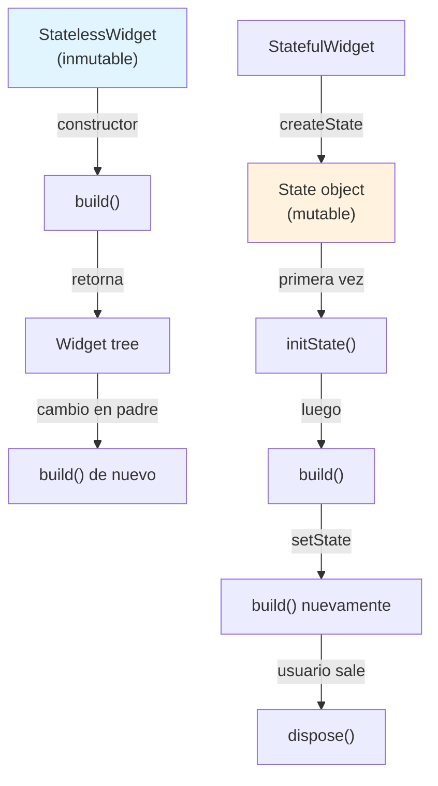
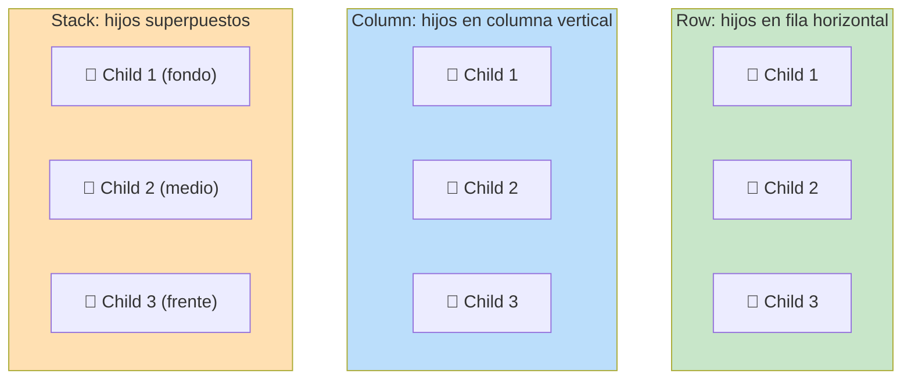
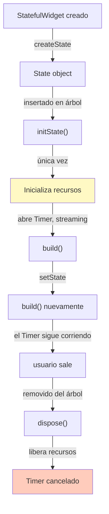
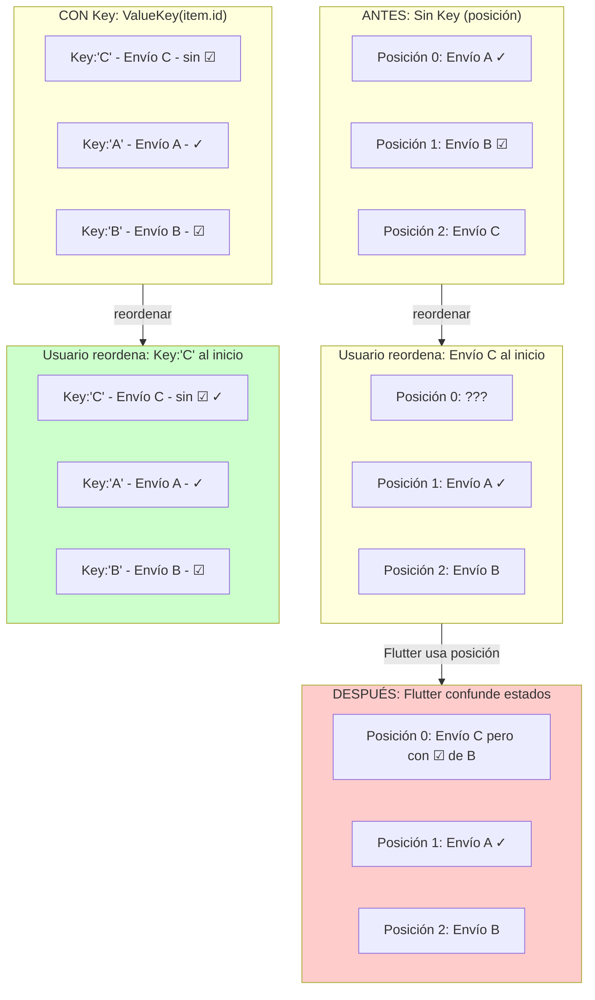

# Módulo 1: Widgets: stateless vs stateful


## Aprende construyendo

### Tema 1: StatelessWidget vs StatefulWidget

#### Paso 1 · Objetivo y preparación
Al finalizar vas a extraer `TarjetaEnvio` (guía y estado de un envío) como `StatelessWidget`, y a construir `ContadorIntentos` como `StatefulWidget` con un contador local. Prerrequisitos: Módulo 0 completo.

#### Paso 2 · Contexto y caso real
La lista de envíos de RutaFlow muestra decenas de tarjetas idénticas en estructura — cada una solo necesita los datos del envío que recibe, sin ningún estado propio que mantener entre reconstrucciones.

#### Paso 3 · Teoría, modelo mental y analogía
Un `StatelessWidget` describe su UI únicamente en función de los datos recibidos por constructor; un `StatefulWidget` separa la definición del widget de un `State` asociado que persiste entre reconstrucciones.

**Diagrama: Ciclo de vida StatelessWidget vs StatefulWidget**



#### Paso 4 · Demostración guiada desde cero
```dart
class TarjetaEnvio extends StatelessWidget {
  final String guia;
  final String estado;
  const TarjetaEnvio({required this.guia, required this.estado, super.key});
  Widget build(BuildContext context) => ListTile(title: Text(guia), subtitle: Text(estado));
}

class ContadorIntentos extends StatefulWidget {
  State<ContadorIntentos> createState() => _ContadorIntentosState();
}
class _ContadorIntentosState extends State<ContadorIntentos> {
  int intentos = 0;
  Widget build(BuildContext context) => ElevatedButton(
    onPressed: () => setState(() => intentos++),
    child: Text("Intentos: $intentos"),
  );
}
```
Resultado esperado: `TarjetaEnvio` nunca necesita reconstruirse por sí misma (no tiene ningún `setState`); `ContadorIntentos` incrementa visualmente su contador cada vez que se toca el botón, porque `setState()` dispara la reconstrucción de `_ContadorIntentosState`.

#### Paso 5 · Práctica guiada
Pista: agregá `int vecesConstruido = 0; vecesConstruido++;` directamente dentro del método `build` de `TarjetaEnvio`, esperando que cuente cuántas veces se reconstruyó — ese es el fallo deliberado: como `TarjetaEnvio` no tiene ningún `State` asociado, esa variable se reinicializa a 0 en cada reconstrucción, nunca acumula nada entre reconstrucciones.

#### Paso 6 · Práctica independiente
Corregí el Paso 5 explicando por qué un `StatelessWidget` no puede acumular ese contador, y convertí ese caso específico en un `StatefulWidget` con un campo `int vecesConstruido = 0;` dentro de su `State`, confirmando que ahora sí persiste y se incrementa correctamente.

#### Paso 7 · Cierre y evidencia
Entregá `TarjetaEnvio` y `ContadorIntentos` del Paso 4, el contador que nunca acumula del Paso 5, y la conversión a StatefulWidget del Paso 6; explicá por qué una variable local dentro de `build()` nunca puede servir como memoria persistente, sin importar en qué tipo de widget se declare. Siguiente paso: estudia Row, Column, Stack y el ciclo de vida de un StatefulWidget. Errores comunes: intentar mantener estado mutable con una variable local de `build()`, convertir un widget a `StatefulWidget` cuando nunca necesita estado propio, y mutar un campo fuera de `setState()` esperando que la UI se actualice igual. Fuentes oficiales: https://docs.flutter.dev/ui/widgets y https://api.flutter.dev/flutter/widgets/StatefulWidget-class.html.
**¿Por qué es importante?** La distinción entre StatelessWidget y StatefulWidget determina si un widget puede mantener estado mutable propio persistente entre reconstrucciones; una variable local de `build()` nunca cumple ese rol.
**Evidencia de aprendizaje:** entrega TarjetaEnvio y ContadorIntentos, el contador que no acumula detectado y la conversión correcta a StatefulWidget.
**Conceptos clave:** widget sin estado propio frente a widget con estado mutable y ciclo de vida.

```dart
class TarjetaTarea extends StatelessWidget {
  final String titulo;
  const TarjetaTarea({required this.titulo, super.key});
  Widget build(BuildContext context) => Text(titulo);
}

class Contador extends StatefulWidget {
  State<Contador> createState() => _ContadorState();
}

class _ContadorState extends State<Contador> {
  int valor = 0;
  Widget build(BuildContext context) => ElevatedButton(
    onPressed: () => setState(() => valor++), // dispara la reconstrucción de este widget
    child: Text("$valor"),
  );
}
```

Un `StatelessWidget` describe su UI únicamente en función de los datos que recibe por constructor (`titulo` en `TarjetaTarea`), sin ningún estado mutable propio: si sus datos de entrada nunca cambian, ese widget nunca necesita reconstruirse por sí mismo, aunque sí puede reconstruirse si su padre lo hace con datos nuevos; un `StatefulWidget` separa la definición del widget (`Contador`, inmutable) de un objeto `State` asociado (`_ContadorState`) que sí mantiene estado mutable (`valor`) y persiste a través de reconstrucciones sucesivas del widget que lo contiene.

`setState()` es la señal explícita que le comunica a Flutter "el estado de este `State` cambió, por favor reconstruye este widget (y sus hijos) con los nuevos valores": Flutter compara eficientemente el nuevo árbol de widgets resultante contra el árbol anterior (un proceso llamado "reconciliación", conceptualmente análogo a la reconciliación del DOM virtual en React, Módulo 1 del track de React) y aplica al árbol de renderizado real únicamente los cambios efectivamente necesarios, no una reconstrucción completa desde cero de toda la interfaz visual subyacente.

**Analogía:** un `StatelessWidget` es como una fotografía impresa que muestra exactamente lo que se le entregó para imprimir, sin poder cambiar por sí misma; un `StatefulWidget` con su `State` asociado es como una pantalla digital que puede actualizar su contenido internamente en respuesta a nueva información, mientras mantiene su identidad como el mismo dispositivo físico a través de esas actualizaciones sucesivas.

**¿Por qué es importante?** La distinción entre `StatelessWidget` y `StatefulWidget` determina si un widget puede mantener estado mutable propio persistente entre reconstrucciones; `setState()` es el mecanismo explícito que dispara la reconstrucción eficiente del árbol de widgets tras un cambio de estado.

**Código del ejemplo:**

```dart
class Contador extends StatefulWidget {
  State<Contador> createState() => _ContadorState();
}
class _ContadorState extends State<Contador> {
  int valor = 0;
  // setState() dispara la reconstrucción; `valor` persiste entre reconstrucciones
}
```

### Tema 2: Layout con Row, Column y Stack, y ciclo de vida

#### Paso 1 · Objetivo y preparación
Al finalizar vas a componer `TarjetaEnvio` con `Row`/`Stack` para mostrar un ícono de "urgente" superpuesto, y a usar `initState`/`dispose` para gestionar un timer que refresca el tiempo relativo de la lista. Prerrequisitos: Tema 1 de este módulo.

#### Paso 2 · Contexto y caso real
`TarjetaEnvio` necesita mostrar la guía y el estado en una fila, con un ícono de "urgente" superpuesto en la esquina si corresponde; además, la pantalla de lista necesita refrescar el tiempo relativo ("hace 2 min") cada minuto mientras está visible.

#### Paso 3 · Teoría, modelo mental y analogía
`Row`, `Column` y `Stack` apilan hijos horizontalmente, verticalmente, y superpuestos; `initState()` inicializa recursos una sola vez, `dispose()` los libera al remover el `State` del árbol.

**Diagrama: Row, Column y Stack visualizados**



**Diagrama: Ciclo de vida con initState/dispose**



#### Paso 4 · Demostración guiada desde cero
```dart
Stack(children: [
  Row(children: [Text(guia), Spacer(), Text(estado)]),
  if (urgente) Positioned(top: 0, right: 0, child: Icon(Icons.priority_high)),
])

class _ListaEnviosState extends State<ListaEnvios> {
  Timer? _timer;
  @override
  void initState() {
    super.initState();
    _timer = Timer.periodic(Duration(minutes: 1), (_) => setState(() {}));
  }
  @override
  void dispose() {
    _timer?.cancel();
    super.dispose();
  }
}
```
Resultado esperado: el ícono de "urgente" aparece superpuesto en la esquina solo cuando corresponde, sin desplazar el `Row`; el `Timer` refresca la pantalla cada minuto mientras `ListaEnvios` está montada, y se cancela automáticamente al salir de esa pantalla.

#### Paso 5 · Práctica guiada
Pista: quitá `_timer?.cancel()` de `dispose()` — ese es el fallo deliberado: navegá fuera de `ListaEnvios` y volvé a entrar varias veces; cada entrada crea un nuevo `Timer` que nunca se cancela, acumulando varios timers corriendo simultáneamente, cada uno intentando llamar `setState()` sobre un `State` ya destruido.

#### Paso 6 · Práctica independiente
Corregí el Paso 5 restaurando `_timer?.cancel()` en `dispose()`, y agregá una verificación `if (!mounted) return;` antes de cualquier `setState()` que pueda dispararse después de que el widget ya se haya desmontado.

#### Paso 7 · Cierre y evidencia
Entregá el layout con Stack del Paso 4, los timers acumulados sin cancelar del Paso 5, y la verificación de `mounted` del Paso 6; explicá por qué todo recurso iniciado en `initState()` debe liberarse explícitamente en `dispose()`, sin excepciones. Siguiente paso: estudia Keys para listas reordenables. Errores comunes: iniciar un recurso en `initState()` sin liberarlo en `dispose()`, llamar `setState()` después de que el widget se desmontó, y anidar `Column` dentro de `Column` sin límites de altura. Fuentes oficiales: https://api.flutter.dev/flutter/widgets/State-class.html y https://docs.flutter.dev/ui/widgets/layout.
**¿Por qué es importante?** Los hooks del ciclo de vida son el mecanismo correcto para gestionar recursos sin fugas de memoria; omitir `dispose()` acumula recursos que siguen corriendo después de que la pantalla ya no existe.
**Evidencia de aprendizaje:** entrega layout con Stack, timers sin cancelar detectados y verificación de mounted agregada.
**Conceptos clave:** contenedores de layout combinables, hooks del ciclo de vida de un StatefulWidget.

```dart
Column(children: [
  Row(children: [Text("Izquierda"), Spacer(), Text("Derecha")]),
  Stack(children: [Image.asset("fondo.png"), Text("Superpuesto")]),
])
```

`Row`, `Column` y `Stack` son los tres contenedores de layout fundamentales de Flutter: apilan hijos horizontalmente, verticalmente, y superpuestos entre sí respectivamente, exactamente el mismo conjunto mínimo de primitivas de layout estudiado en Jetpack Compose (`Row`/`Column`/`Box`, Módulo 2 del track de Android) y en SwiftUI (`HStack`/`VStack`/`ZStack`, Módulo 1 del track de iOS), reflejando una convergencia consistente entre los frameworks de UI declarativa móvil más importantes hacia el mismo conjunto de primitivas combinables.

`initState()` se ejecuta una única vez cuando el `State` se inserta por primera vez en el árbol, apropiado para inicializar recursos (suscripciones, controladores de animación); `dispose()` se ejecuta cuando el `State` se remueve permanentemente del árbol, apropiado para liberar esos mismos recursos, evitando fugas de memoria; `didUpdateWidget()` se ejecuta cuando el widget se reconstruye con una nueva configuración (nuevos parámetros del constructor) pero el mismo objeto `State` persiste, permitiendo reaccionar a cambios de configuración sin perder el estado interno acumulado hasta ese momento. `Expanded` y `Flexible` distribuyen espacio disponible proporcionalmente entre hijos de un `Row`/`Column`; `SizedBox` fija dimensiones exactas; `AspectRatio` mantiene una proporción específica entre ancho y alto.

**Analogía:** `Row`, `Column` y `Stack` son como los tres tipos básicos de disposición de mobiliario en una habitación (en fila, apilado, superpuesto), combinables para construir cualquier distribución compleja; `initState()`/`dispose()` son como el protocolo de apertura y cierre de un local comercial (encender/apagar sistemas al inicio y fin de operación), mientras `didUpdateWidget()` es como ajustar la configuración interna del local ante un cambio de horario sin cerrar y reabrir el negocio por completo.

**¿Por qué es importante?** `Row`/`Column`/`Stack` son las primitivas combinables de cualquier layout Flutter, compartidas conceptualmente con Compose y SwiftUI; los hooks del ciclo de vida (`initState`, `dispose`, `didUpdateWidget`) son el mecanismo correcto para gestionar recursos y reaccionar a cambios de configuración sin fugas de memoria.

**Código del ejemplo:**

```dart
Column(children: [
  Row(children: [Text("Izquierda"), Spacer(), Text("Derecha")]),
  Stack(children: [Image.asset("fondo.png"), Text("Superpuesto")]),
])
```

### Tema 3: Keys

#### Paso 1 · Objetivo y preparación
Al finalizar vas a corregir un bug de identidad en `ListaEnvios` reordenable, donde el estado de un checkbox "revisado" por fila se confunde al reordenar, usando `ValueKey` basada en el id del envío. Prerrequisitos: Tema 2 de este módulo.

#### Paso 2 · Contexto y caso real
El operador puede arrastrar envíos urgentes al principio de la lista; cada `TarjetaEnvio` tiene un checkbox interno "revisado" — sin una Key estable, reordenar la lista puede dejar ese checkbox marcado en la fila equivocada.

#### Paso 3 · Teoría, modelo mental y analogía
Sin una Key estable, Flutter identifica widgets por posición durante la reconciliación; una `ValueKey(item.id)` da una señal de identidad independiente de la posición.

**Diagrama: Problema de identidad sin Key vs con Key**



#### Paso 4 · Demostración guiada desde cero
```dart
ListView(children: envios.map((e) => TarjetaEnvio(key: ValueKey(e.id), guia: e.guia, estado: e.estado)).toList())
```
Resultado esperado: al arrastrar un envío urgente al principio de la lista, el checkbox "revisado" de cada `TarjetaEnvio` sigue asociado al envío correcto (identificado por `e.id`), sin importar su nueva posición.

#### Paso 5 · Práctica guiada
Pista: cambiá `key: ValueKey(e.id)` por `key: ValueKey(indice)` usando el índice del `.map()` — ese es el fallo deliberado: marcá como "revisado" el primer envío de la lista, reordená arrastrando un envío urgente al principio, y el checkbox "revisado" aparece ahora en la fila que ocupa esa misma posición, no en el envío original que realmente marcaste.

#### Paso 6 · Práctica independiente
Corregí el Paso 5 devolviendo `key: ValueKey(e.id)`, y agregá una prueba de widget que reordene la lista programáticamente y confirme que el estado "revisado" sigue al envío correcto por su id, no por su posición.

#### Paso 7 · Cierre y evidencia
Entregá la lista con Key estable del Paso 4, el bug de identidad provocado en el Paso 5, y la prueba de widget del Paso 6; explicá por qué el índice "funciona" en una lista que nunca se reordena, pero falla en cuanto eso deja de ser cierto. Siguiente paso: cerrá el módulo documentando rebuild vs re-render en tus propias palabras. Errores comunes: usar el índice como Key en listas reordenables, usar `UniqueKey()` innecesariamente, y omitir la Key por completo en listas con estado interno por fila. Fuentes oficiales: https://api.flutter.dev/flutter/foundation/Key-class.html y https://docs.flutter.dev/ui/widgets.
**¿Por qué es importante?** Una Key estable es necesaria cuando se reordena una lista de widgets con estado interno propio, evitando que Flutter confunda qué estado pertenece a qué elemento tras el reordenamiento.
**Evidencia de aprendizaje:** entrega lista con Key estable, bug de identidad detectado y prueba de widget con reordenamiento.
**Conceptos clave:** identidad estable de un widget a través de reconstrucciones, especialmente al reordenar.

```dart
ListView(children: items.map((item) => TarjetaTarea(key: ValueKey(item.id), titulo: item.titulo)).toList())
```

Sin una `Key` estable, Flutter identifica widgets del mismo tipo dentro de una lista principalmente por su posición en esa lista durante la reconciliación; si la lista se reordena (por ejemplo, el usuario arrastra un elemento a una nueva posición) y esos widgets mantienen estado interno propio (como el estado marcado/desmarcado de un checkbox dentro de cada elemento), Flutter puede confundir qué estado interno pertenece a qué elemento visual tras el reordenamiento, dado que sin una `Key` la única señal de identidad disponible es la posición, no el contenido lógico del elemento. Proveer una `ValueKey(item.id)` (basada en un identificador único y estable del dato subyacente) le da a Flutter una señal de identidad explícita e independiente de la posición, permitiendo reconciliar correctamente cada widget con su estado interno correspondiente sin importar en qué posición se encuentre tras un reordenamiento.

`ValueKey`, `ObjectKey`, `UniqueKey` y `GlobalKey` son las variantes especializadas: `ValueKey` compara por igualdad de un valor (típico para IDs primitivos), `ObjectKey` compara por identidad de un objeto completo, `UniqueKey` genera una identidad siempre distinta (forzando que Flutter nunca reconcilie ese widget con uno anterior), y `GlobalKey` permite acceder al estado de un widget específico desde cualquier lugar del árbol, útil para casos avanzados como validación de formularios distribuidos en múltiples widgets.

**Analogía:** una `Key` es como un número de identificación personal que acompaña a alguien independientemente del orden en que se forme una fila: sin ese identificador, un sistema que solo rastrea "la tercera persona de la fila" confundiría la identidad de las personas si la fila se reordena, mientras que con el identificador estable, el sistema reconoce correctamente a cada persona sin importar su posición actual.

**¿Por qué es importante?** Una `Key` estable es necesaria específicamente cuando se reordena una lista de widgets con estado interno propio, evitando que Flutter confunda qué estado pertenece a qué elemento tras el reordenamiento; sin reordenamiento ni estado interno relevante, una `Key` explícita suele ser innecesaria.

**Código del ejemplo:**

```dart
items.map((item) => TarjetaTarea(key: ValueKey(item.id), titulo: item.titulo)).toList()
// La Key vincula el widget a la IDENTIDAD del dato, no a su posición en la lista
```

---

## Demo en DevTools

**Objetivo:** Observar en tiempo real cómo StatelessWidget y StatefulWidget se reconstruyen diferentemente.

**Setup:**
```bash
cd examples/flutter_rutaflow
flutter run -d chrome  # o -d emulator-5554, -d iPad, etc
```

**En Flutter DevTools (se abre automáticamente):**
1. Abre la pestaña **Performance**
2. Presiona "Record" y toca el botón del contador varias veces
3. Detén la grabación y observa:
   - Frame timing (cada setState genera un frame)
   - Rebuild count por widget en la sección "Rebuild"

4. Abre la pestaña **Inspector**:
   - Busca `_DeliveryListTileState` en el árbol
   - Expande y ve que cada widget tiene su propio estado
   - Verifica que `isExpanded` persiste entre reconstrucciones

**Resultado esperado:**
- Contador incrementa visualmente después de cada tap
- En DevTools ves el rebuild solo del widget con estado (no toda la lista)
- Si reordenas sin Key, verás que el estado se confunde entre filas

---

## Laboratorio práctico

**Objetivo del laboratorio:** construir una pantalla compuesta por widgets propios reutilizables, con estado local mínimo.

**Requisitos previos:** Módulo 0 completado.

| Paso | Acción | Código | Explicación |
|---|---|---|---|
| 1 | Crear un `StatelessWidget` sin estado interno | Ver Tema 1 | Recibe datos por constructor |
| 2 | Crear un `StatefulWidget` con un contador local | Ver Tema 1 | Observa `setState()` |
| 3 | Combinar `Row`, `Column` y `Stack` | Ver Tema 2 | Layout completo |
| 4 | Reordenar una lista con estado sin `Key`, luego corregir | Ver Tema 3 | Observa el bug, corrígelo con `ValueKey` |
| 5 | Documentar rebuild vs re-render | Ver Tema 1 | En tus propias palabras |

**Verificación:** el laboratorio se considera exitoso si la lista con checkboxes mantiene correctamente el estado de cada elemento tras reordenarse, gracias a una `Key` apropiada, y si el `StatefulWidget` reconstruye correctamente su UI al invocar `setState()`.

**Errores comunes y soluciones**

- **Mantener lógica compleja o estado innecesario en un `StatelessWidget`.** Si necesita estado mutable propio, conviértelo en `StatefulWidget`.
- **Omitir una `Key` en una lista reordenable con widgets de estado interno.** Provoca confusión de estado entre elementos tras reordenar; usa `ValueKey` con un identificador estable.
- **Realizar inicialización costosa directamente en `build()` en vez de `initState()`.** `build()` puede ejecutarse múltiples veces; usa `initState()` para inicialización única.

---
