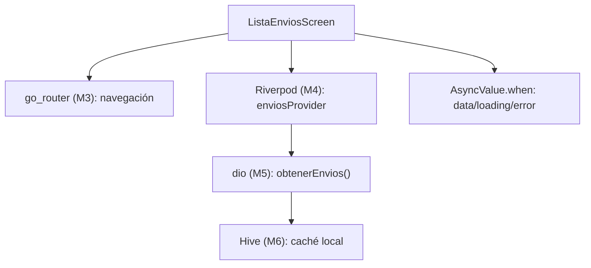
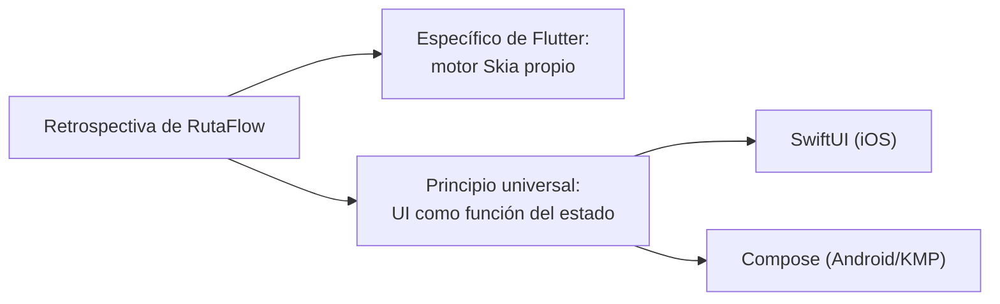

# Módulo 12: Proyecto integrador: app Flutter completa


## Aprende construyendo

### Tema 1: Arquitectura por features y Clean Architecture

#### Paso 1 · Objetivo y preparación
Al finalizar vas a organizar el proyecto integrador de RutaFlow en `lib/features/envios/` y `lib/features/auth/`, con capas Domain/Data/Presentation dentro de cada feature. Prerrequisitos: módulos 0-11 completos.

#### Paso 2 · Contexto y caso real
A lo largo del track construiste piezas sueltas de RutaFlow (widgets, providers, repositorios) en módulos distintos — nadie confirmó todavía que organizarlas en un único proyecto real no termina mezclando responsabilidades por tipo de archivo en vez de por dominio.

#### Paso 3 · Teoría, modelo mental y analogía
Organizar por feature agrupa todo el código relacionado con una funcionalidad en un único lugar cohesivo; dentro de cada feature, Domain/Data/Presentation establecen un flujo de dependencia unidireccional donde Domain nunca depende de Data ni Presentation.

#### Paso 4 · Demostración guiada desde cero
```text
lib/
  features/
    envios/
      data/          ← repositorio (dio + Hive, módulos 5-6)
      domain/         ← modelos y lógica pura
      presentation/    ← widgets + providers Riverpod (módulo 4)
    auth/
  core/
    router.dart        ← go_router (módulo 3)
    theme.dart
```
Resultado esperado: recorriendo el código fuente carpeta por carpeta, ningún archivo en `domain/` importa nada de `data/` ni `presentation/`; `data/` implementa las interfaces definidas en `domain/`, y `presentation/` consume `domain/` sin conocer detalles de `dio` o Hive directamente.

#### Paso 5 · Práctica guiada
Pista: agregá una llamada directa a `Dio()` dentro de un widget en `presentation/`, sin pasar por el repositorio de `data/` — ese es el fallo deliberado: ese widget específico ahora depende directamente de una librería de infraestructura, rompiendo el flujo unidireccional que el resto del proyecto respeta, y testearlo sin red real se vuelve mucho más difícil.

#### Paso 6 · Práctica independiente
Corregí el Paso 5 devolviendo esa llamada al repositorio correspondiente en `data/`, y recorré el resto del proyecto buscando otras violaciones similares de capas.

#### Paso 7 · Cierre y evidencia
Entregá la estructura por feature del Paso 4, la violación de capas provocada en el Paso 5, y la revisión del Paso 6; explicá por qué integrar todo el track en un único proyecto expone violaciones de capas que un módulo aislado nunca mostraría. Siguiente paso: estudia cómo unir todos los módulos del track en el flujo completo. Errores comunes: organizar el proyecto por tipo de archivo en vez de por feature, permitir que `domain/` dependa de `data/` o `presentation/`, y que un widget acceda directamente a una librería de infraestructura sin pasar por el repositorio. Fuentes oficiales: https://docs.flutter.dev/app-architecture/guide y https://docs.flutter.dev/app-architecture/case-study.
**¿Por qué es importante?** Organizar por feature agrupa código relacionado por propósito de negocio; Clean Architecture con capas Domain/Data/Presentation mantiene la lógica de negocio central aislada y testeable.
**Evidencia de aprendizaje:** entrega estructura por feature, violación de capas detectada y revisión completa confirmada.
**Conceptos clave:** organización por dominio de negocio, no por tipo técnico de archivo.

```
lib/
  features/
    tareas/
      data/          ← repositorio (dio + Hive, módulos 5-6)
      domain/         ← modelos
      presentation/    ← widgets + providers Riverpod (módulo 4)
    auth/
  core/
    router.dart        ← go_router (módulo 3)
    theme.dart
```

Organizar el proyecto por feature (`lib/features/tareas/`, `lib/features/auth/`) en vez de por tipo de archivo (una carpeta única `widgets/` con todos los widgets de la app mezclados, otra `models/` con todos los modelos mezclados) agrupa todo el código relacionado con una funcionalidad específica en un único lugar cohesivo, facilitando enormemente que un desarrollador entienda o modifique una feature completa sin necesidad de saltar entre carpetas dispersas por todo el proyecto que agrupan archivos por su naturaleza técnica en vez de por su propósito de negocio.

Dentro de cada feature, las capas de Clean Architecture (`domain/` con modelos y lógica de negocio pura sin dependencias externas, `data/` con la implementación concreta de repositorios que sí dependen de `dio` y Hive, `presentation/` con los widgets y providers que consumen esas capas inferiores) establecen un flujo de dependencia estricto y unidireccional: la capa `presentation` depende de `domain`, y `data` implementa las interfaces definidas en `domain`, pero `domain` nunca depende de `data` ni de `presentation` directamente, permitiendo que la lógica de negocio central permanezca completamente aislada y testeable sin ninguna dependencia de frameworks externos o detalles de infraestructura específicos.

**Analogía:** organizar por features es como organizar un edificio de oficinas por departamento funcional completo (cada departamento con su propia recepción, archivo y sala de reuniones) en vez de agrupar todas las recepciones de todos los departamentos en un piso, todos los archivos en otro piso distinto: la primera organización mantiene junto todo lo relacionado con un mismo propósito de negocio, facilitando encontrar y modificar cualquier cosa relacionada con ese departamento específico sin recorrer todo el edificio.

**¿Por qué es importante?** Organizar por feature agrupa código relacionado por propósito de negocio en vez de por tipo técnico de archivo, facilitando el mantenimiento; Clean Architecture con capas Domain/Data/Presentation mantiene la lógica de negocio central aislada de detalles de infraestructura, altamente testeable.

**Diagrama:**

```
lib/features/tareas/
  domain/         ← modelos y lógica pura, SIN dependencias externas
  data/           ← implementa interfaces de domain, SÍ depende de dio/Hive
  presentation/   ← widgets + providers, depende de domain
```

### Tema 2: Uniendo los módulos del track

#### Paso 1 · Objetivo y preparación
Al finalizar vas a conectar `envioRepositoryProvider` (Riverpod), el estado explícito de `AsyncValue`, y la persistencia offline-first en una sola pantalla `ListaEnviosScreen` completa. Prerrequisitos: Tema 1 de este módulo.

#### Paso 2 · Contexto y caso real
Nadie confirmó todavía que la navegación con go_router (Módulo 3), la gestión de estado con Riverpod (Módulo 4), el networking con dio (Módulo 5), y la persistencia offline con Hive (Módulo 6) efectivamente funcionan juntos como un sistema coherente.

#### Paso 3 · Teoría, modelo mental y analogía
`AsyncValue.when(data:, loading:, error:)` maneja exhaustivamente los tres estados posibles de una operación asíncrona directamente en la UI.

#### Paso 4 · Demostración guiada desde cero
```dart
final enviosProvider = FutureProvider<List<Envio>>((ref) async {
  final repo = ref.watch(envioRepositoryProvider);
  return repo.obtenerEnvios(); // lee de caché local, sincroniza en background
});

class ListaEnviosScreen extends ConsumerWidget {
  Widget build(BuildContext context, WidgetRef ref) {
    final enviosAsync = ref.watch(enviosProvider);
    return enviosAsync.when(
      data: (envios) => ListView(children: envios.map((e) => TarjetaEnvio(envio: e)).toList()),
      loading: () => CircularProgressIndicator(),
      error: (e, _) => Text('Error: $e'),
    );
  }
}
```
Resultado esperado: `ListaEnviosScreen` muestra el spinner mientras carga, la lista real cuando los datos llegan, o un mensaje de error si falla — los tres casos posibles manejados explícitamente, sin ningún estado ambiguo.

#### Paso 5 · Práctica guiada
Pista: reemplazá `.when(...)` por `.maybeWhen(data: ..., orElse: () => Text('Cargando...'))` sin un caso `error` propio — ese es el fallo deliberado: ahora un error real de red muestra el mismo mensaje genérico "Cargando..." que el estado de carga normal, porque `orElse` oculta la diferencia entre ambos casos que `.when` exhaustivo habría forzado a distinguir.

#### Paso 6 · Práctica independiente
Corregí el Paso 5 devolviendo `.when(...)` con un caso `error` explícito con un mensaje específico de RutaFlow, y agregá un botón de "reintentar" que invalide `enviosProvider` dentro de ese caso de error.

#### Paso 7 · Cierre y evidencia
Entregá la pantalla integrando los tres módulos del Paso 4, la diferencia entre `.when` exhaustivo y `.maybeWhen` genérico del Paso 5, y el botón de reintentar del Paso 6; explicá por qué integrar varios módulos del track en una sola pantalla expone si realmente encajan como un sistema coherente. Siguiente paso: cerrá el track reflexionando sobre el costo y beneficio de Flutter como ecosistema propio. Errores comunes: usar `.maybeWhen` con un `orElse` genérico que oculta diferencias reales entre estados, no ofrecer ninguna acción de recuperación en el estado de error, y mezclar lógica de negocio directamente dentro del `build()`. Fuentes oficiales: https://riverpod.dev/docs/case_studies/pull_to_refresh y https://docs.flutter.dev/app-architecture/design-patterns.
**¿Por qué es importante?** Integrar cada módulo del track en un proyecto real demuestra que los conceptos estudiados por separado se combinan naturalmente en un sistema coherente.
**Evidencia de aprendizaje:** entrega pantalla integrando los tres módulos, diferencia entre when exhaustivo y maybeWhen genérico explicada, y botón de reintentar confirmado.
**Conceptos clave:** cada concepto estudiado por separado encaja como parte de un sistema mayor.

```dart
final tareasProvider = FutureProvider<List<Tarea>>((ref) async {
  final repo = ref.watch(tareaRepositoryProvider);
  return repo.obtenerTareas(); // lee de caché local, sincroniza en background
});

class ListaTareasScreen extends ConsumerWidget {
  Widget build(BuildContext context, WidgetRef ref) {
    final tareasAsync = ref.watch(tareasProvider);
    return tareasAsync.when(
      data: (tareas) => ListView(children: tareas.map((t) => TarjetaTarea(tarea: t)).toList()),
      loading: () => CircularProgressIndicator(),
      error: (e, _) => Text('Error: $e'),
    );
  }
}
```

Este proyecto integra directamente cada módulo estudiado a lo largo del track en un único sistema coherente: navegación declarativa con go_router y rutas protegidas (Módulo 3), gestión de estado completa con Riverpod o Bloc sin `setState` disperso (Módulo 4), networking con `dio` y estados explícitos modelados con sealed classes (Módulo 5), persistencia offline-first con Hive o `sqflite` (Módulo 6), y widget tests de las pantallas más críticas (Módulo 9); el método `.when(data:, loading:, error:)` de `AsyncValue` en Riverpod es la forma idiomática de manejar exhaustivamente los tres estados posibles de una operación asíncrona directamente en la UI, reflejando el mismo principio de estados explícitos modelados como un conjunto cerrado ya estudiado en el Módulo 5.

La internacionalización con `intl` y `flutter_localizations` (mencionada en el contenido de este módulo integrador) permite que la app soporte múltiples idiomas de forma estructurada, generando código a partir de archivos de traducción declarativos, un aspecto adicional de pulido profesional que completa una app lista para un público potencialmente internacional, más allá de la funcionalidad central ya integrada del resto del track.

**Analogía:** el proyecto integrador es como el ensamblaje final de un producto donde cada componente estudiado por separado en su propio módulo (navegación, estado, networking, persistencia, testing) se integra en un sistema funcional completo, demostrando que cada pieza individual efectivamente encaja con las demás tal como se diseñó.

**¿Por qué es importante?** Integrar cada módulo del track en un proyecto real demuestra que los conceptos estudiados por separado (navegación, estado, networking, persistencia, testing) se combinan naturalmente en un sistema coherente, reflejando cómo se construyen apps Flutter profesionales reales.

**Código del ejemplo:**

```dart
tareasAsync.when(
  data: (tareas) => ListView(...),
  loading: () => CircularProgressIndicator(),
  error: (e, _) => Text('Error: $e'),
)
```

**Diagrama: integración de módulos en una pantalla**



En el proyecto integrador RutaFlow, `ListaEnviosScreen` vive en `lib/features/deliveries/presentation/delivery_list_screen.dart` y `envioRepositoryProvider` en `lib/features/deliveries/domain/delivery_providers.dart`.

### Tema 3: Cierre del track

#### Paso 1 · Objetivo y preparación
Al finalizar vas a escribir una retrospectiva comparando una decisión de RutaFlow en Flutter (que renderiza con su propio motor Skia, no componentes nativos envueltos) contra la misma decisión en otro track de la Academia. Prerrequisitos: Temas 1-2 de este módulo.

#### Paso 2 · Contexto y caso real
Completaste el track entero construyendo RutaFlow en Flutter — nadie te pidió todavía que articules qué de esa experiencia es específico de que Flutter dibuje sus propios widgets con Skia, y qué es un principio universal de UI declarativa.

#### Paso 3 · Teoría, modelo mental y analogía
Flutter logra apariencia y rendimiento consistentes en ambas plataformas renderizando con su propio motor gráfico, en vez de envolver componentes nativos, a costa de requerir aprender un ecosistema de widgets propio.

#### Paso 4 · Demostración guiada desde cero
```text
Decisión: TarjetaEnvio se ve y se comporta idéntica en Android e iOS,
porque Flutter la dibuja con Skia, no con componentes nativos de cada
plataforma.

Específico de Flutter: el motor Skia propio, que elimina diferencias
sutiles de comportamiento entre implementaciones nativas distintas.

Principio universal: declarar la UI como función del estado actual
(igual en SwiftUI y Compose), solo que Flutter además controla el
renderizado final, mientras SwiftUI/Compose delegan en el sistema nativo.
```
Resultado esperado: tu retrospectiva separa explícitamente qué parte depende del motor de renderizado propio de Flutter de qué parte es un principio de UI declarativa que reconocerías en cualquiera de los tres.

#### Paso 5 · Práctica guiada
Pista: escribí la retrospectiva afirmando que "Flutter es mejor porque su UI se ve siempre igual" sin mencionar el costo real de esa decisión — ese es el fallo deliberado: es una afirmación incompleta que ignora que ese mismo motor propio es exactamente la razón por la que Flutter no se integra automáticamente con cada actualización visual nueva de los widgets nativos, a diferencia de SwiftUI/Compose, que sí heredan esos cambios directamente del sistema.

#### Paso 6 · Práctica independiente
Corregí el Paso 5 reescribiendo la afirmación para incluir ese costo explícitamente, presentando la decisión de Flutter como un trade-off real, no una ventaja incondicional.

#### Paso 7 · Cierre y evidencia
Entregá la retrospectiva del Paso 4, la afirmación incompleta corregida del Paso 5-6, y una lista de al menos tres decisiones más de RutaFlow en Flutter que repetirías igual en otra plataforma aunque el motor de renderizado cambie. Siguiente paso: aplicá esta misma retrospectiva al terminar el proyecto integrador de otro track. Errores comunes: presentar una decisión de plataforma como ventaja incondicional sin mencionar su costo real, confundir una ventaja de consistencia visual con una ventaja fundamental de capacidad, y cerrar el track sin conectar explícitamente los módulos entre sí. Fuentes oficiales: https://docs.flutter.dev/resources/architectural-overview y https://docs.flutter.dev/platform-integration.
**¿Por qué es importante?** Flutter logra apariencia y rendimiento consistentes gracias a su motor gráfico propio, a costa de requerir un ecosistema de widgets propio y no heredar automáticamente actualizaciones visuales nativas.
**Evidencia de aprendizaje:** entrega retrospectiva, afirmación incompleta corregida y lista de principios transferibles.
**Conceptos clave:** una sola base de código, apariencia y rendimiento consistentes, el costo de un ecosistema propio.

Flutter cumple su promesa central de forma bastante directa: una sola base de código Dart, con widgets propios que Flutter renderiza directamente con su propio motor gráfico (Skia, el mismo motor mencionado en Compose Multiplatform, Módulo 7 del track de Kotlin Multiplatform), en vez de simplemente envolver componentes nativos de cada plataforma (a diferencia de otros frameworks multiplataforma históricos que traducían hacia widgets nativos subyacentes), corriendo con apariencia y rendimiento consistentes en Android e iOS sin las diferencias sutiles de comportamiento que podrían surgir de depender de implementaciones nativas distintas por plataforma.

El costo de esta consistencia es aprender un ecosistema de widgets completamente propio de Flutter, distinto tanto de las tecnologías web (HTML/CSS/JavaScript) como de cada plataforma nativa (UIKit/SwiftUI en iOS, Views/Compose en Android): un desarrollador que ya domina Compose o SwiftUI reconocerá los mismos principios conceptuales de UI declarativa (estado como fuente de verdad, composición de widgets, reconstrucción en respuesta a cambios), pero necesitará aprender la sintaxis y las convenciones específicas del ecosistema de widgets propio de Flutter para aplicarlos efectivamente.

**Analogía:** Flutter es como un sistema de construcción modular propio que garantiza resultados idénticos sin importar en qué terreno geográfico se construya (renderizado propio consistente), a diferencia de adaptar los materiales de construcción disponibles localmente en cada región (envolver componentes nativos), a cambio de que los constructores deban aprender ese sistema modular específico en vez de reutilizar directamente sus conocimientos previos de construcción tradicional de cada región.

**¿Por qué es importante?** Flutter logra apariencia y rendimiento consistentes en ambas plataformas gracias a renderizar con su propio motor gráfico en vez de envolver componentes nativos, a costa de requerir aprender un ecosistema de widgets propio distinto de la web y de cada plataforma nativa.

**Diagrama:**

```
Flutter = una base de código Dart
        + motor gráfico propio (Skia)
        + widgets propios (NO wrappers de componentes nativos)
        = apariencia y rendimiento consistentes en Android e iOS
```

**Diagrama: específico de Flutter vs principio universal**



En el proyecto integrador RutaFlow, esta retrospectiva se escribe comparando `lib/features/deliveries/presentation/delivery_list_screen.dart` (Flutter) contra el equivalente en `examples/rutaflow/ios/ContentView.swift` (SwiftUI) u otro track completado.

---

## Laboratorio práctico

**Objetivo del laboratorio:** construir una app Flutter con datos reales, persistencia offline y tests, corriendo en Android e iOS.

**Requisitos previos:** Módulos 0-11 completados.

| Paso | Acción | Código | Explicación |
|---|---|---|---|
| 1 | Organizar el proyecto por features | Ver Tema 1 | `lib/features/tareas/`, `lib/features/auth/` |
| 2 | Implementar gestión de estado completa | Ver Tema 2 | Riverpod o Bloc, sin `setState` disperso |
| 3 | Implementar persistencia offline-first | Ver Módulo 6 | Sincronizada con una API real |
| 4 | Escribir widget tests de las 2 pantallas más críticas | Ver Módulo 9 | Verificación de comportamiento clave |
| 5 | Generar los builds de release | Ver Módulo 11 | Android e iOS |

**Verificación:** el proyecto se considera exitoso si la app funciona correctamente sin conexión (mostrando el último caché sincronizado), si toda la gestión de estado pasa por Riverpod o Bloc sin `setState` disperso fuera de casos puramente locales, y si los widget tests de las pantallas críticas pasan consistentemente.

**Errores comunes y soluciones**

- **Organizar el proyecto por tipo de archivo en vez de por feature en una app de tamaño real.** Dificulta el mantenimiento; organiza por feature con Clean Architecture interna.
- **Dejar `setState` disperso en features que ya deberían usar Riverpod/Bloc de forma consistente.** Migra toda la gestión de estado compartido al enfoque elegido.
- **Omitir tests de las pantallas más críticas confiando solo en pruebas manuales.** Los widget tests dan confianza repetible antes de cada release.

---
