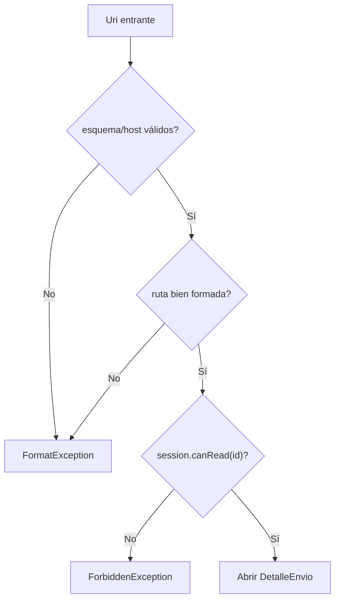
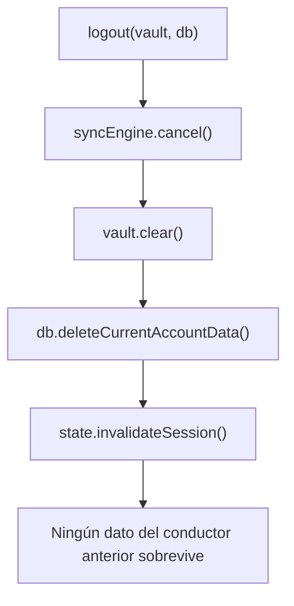
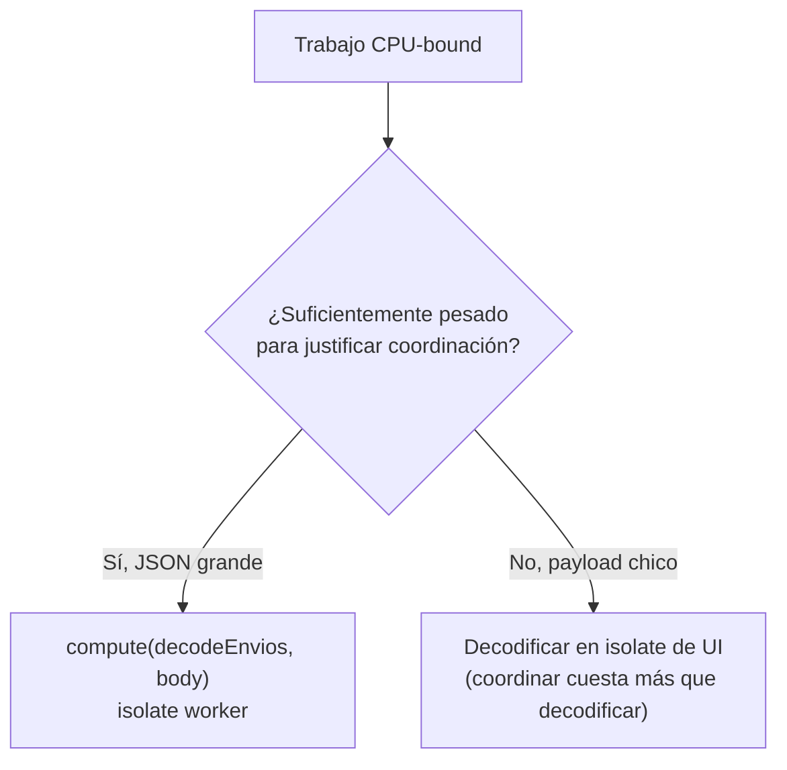
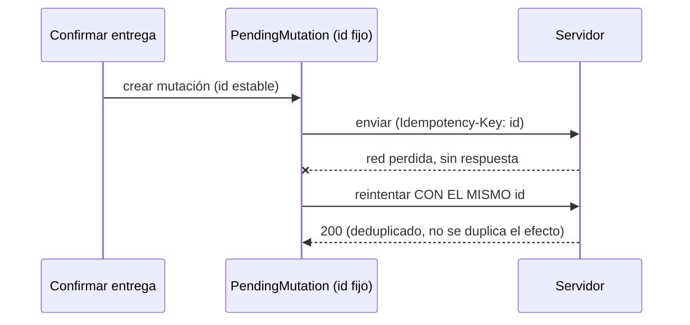

# Módulo 13: Flutter en producción — seguridad, isolates y operación

Compartir código no comparte automáticamente garantías. Flutter entrega una interfaz común sobre sistemas con permisos, almacenamiento y ciclos de vida diferentes. Este módulo endurece el proyecto integrador: examina fronteras nativas, elimina bloqueos del isolate de UI, modela sincronización y prepara releases que puedan observarse y contenerse.


## Aprende construyendo

### Tema 1: Una API Dart puede terminar en una frontera nativa

#### Paso 1 · Objetivo y preparación
Al finalizar vas a validar un deep link entrante de RutaFlow (`https://rutaflow.app/envios/<id>`) verificando esquema, host, ruta y autorización, antes de confiar en que puede abrir el envío correspondiente. Prerrequisitos: Módulo 7 completo.

#### Paso 2 · Contexto y caso real
Cualquier app puede construir y enviar un link con la forma `https://rutaflow.app/envios/RF-4471`; que el sistema haya verificado que RutaFlow es la app asociada a ese dominio no significa que el conductor actual tenga permiso de leer ESE envío puntual.

#### Paso 3 · Teoría, modelo mental y analogía
Todo link o mensaje de channel es entrada no confiable; validar esquema, host, ruta y tipos es el primer paso, pero autenticar y autorizar el recurso es un paso distinto e igualmente necesario.

#### Paso 4 · Demostración guiada desde cero
```dart
EnvioId parseEnvioLink(Uri uri, Session session) {
  if (uri.scheme != 'https' || uri.host != 'rutaflow.app') {
    throw const FormatException('Origen inválido');
  }
  if (uri.pathSegments.length != 2 || uri.pathSegments.first != 'envios') {
    throw const FormatException('Ruta inválida');
  }
  final id = EnvioId.parse(uri.pathSegments.last);
  if (!session.canRead(id)) throw const ForbiddenException();
  return id;
}
```
Resultado esperado: `parseEnvioLink` lanza `FormatException` si la URL no tiene exactamente la forma esperada, y lanza `ForbiddenException` si la estructura es válida pero la sesión actual no tiene permiso de leer ese envío puntual.

#### Paso 5 · Práctica guiada
Pista: quitá la línea `if (!session.canRead(id)) throw const ForbiddenException();` "porque el App Link ya confirmó que es RutaFlow la app correcta" — ese es el fallo deliberado: ahora cualquier link con la forma correcta abre el envío correspondiente sin verificar si el conductor actual tiene permiso de verlo, confundiendo la verificación de dominio con la autorización del recurso.

#### Paso 6 · Práctica independiente
Corregí el Paso 5 restaurando la verificación de `session.canRead(id)`, y agregá un test que confirme que un link bien formado pero para un envío ajeno lanza `ForbiddenException`.

#### Paso 7 · Cierre y evidencia
Entregá la función con las dos validaciones del Paso 4, el acceso indebido provocado en el Paso 5, y el test de autorización del Paso 6; explicá por qué verificar la asociación de dominio de un App Link/Universal Link no es lo mismo que verificar que el conductor puede leer un envío puntual. Siguiente paso: estudia por qué los secretos no pertenecen al binario. Errores comunes: confundir verificación de dominio con autorización de recurso, auditar solo `pubspec.yaml` sin revisar el manifest/entitlements resultantes del build, y mantener plugins sin uso real que amplían la superficie de permisos. Fuente oficial: https://docs.flutter.dev/ui/navigation/deep-linking.
**¿Por qué es importante?** El código multiplataforma hereda la superficie de ambas plataformas y de cada plugin; una entrada válida técnicamente puede intentar acceder a un recurso ajeno.
**Evidencia de aprendizaje:** entrega función con validación completa, acceso indebido provocado y test de autorización.
**Conceptos clave:** sandbox, permission, entitlement, manifest, plugin, platform channel, deep link, Universal Link, App Link, validation, authentication, authorization y threat model.

Un plugin ejecuta código Android/iOS con capacidades reales. Audita mantenedor, actividad, dependencias, permisos y código nativo; elimina plugins no usados. Revisa `AndroidManifest.xml`, entitlements y descripciones de privacidad resultantes del build, no solo `pubspec.yaml`. Pide permisos en contexto y conserva una ruta útil al rechazo.

Todo link o mensaje de channel es entrada no confiable. Valida esquema, host, ruta, tipos, tamaños y rangos; luego autentica y autoriza el recurso. Un App Link o Universal Link verifica asociación de dominio, no propiedad del dato.

```dart
TaskId parseTaskLink(Uri uri, Session session) {
  if (uri.scheme != 'https' || uri.host != 'tasks.example.com') {
    throw const FormatException('Origen inválido');
  }
  if (uri.pathSegments.length != 2 || uri.pathSegments.first != 'tasks') {
    throw const FormatException('Ruta inválida');
  }
  final id = TaskId.parse(uri.pathSegments.last);
  if (!session.canRead(id)) throw const ForbiddenException();
  return id;
}
```

**Analogía:** Flutter es un intérprete común entre dos edificios; cada puerta nativa conserva su propia cerradura y reglamento.

**¿Por qué es importante?** porque el código multiplataforma hereda la superficie de ambas plataformas y de cada plugin.

**Casos de uso reales:** plugin abandonado, permiso sobrante, deep link a cuenta ajena, channel que acepta una ruta arbitraria y clave incluida en el bundle.

**Diagrama:**

```text
Dart -> plugin/channel -> Android/iOS capability
entrada externa -> validar -> autenticar -> autorizar -> dominio
```

**Diagrama: validación en capas de un deep link**



En el proyecto integrador RutaFlow, `parseEnvioLink` vive en `lib/features/deliveries/domain/delivery_providers.dart`. Límite de la decisión: validar esquema/host/ruta no conviene tratarlo como suficiente por sí solo — ese paso confirma que el link tiene la forma esperada, pero nunca reemplaza la autorización real del recurso (`session.canRead(id)`); confundir ambos pasos es exactamente el fallo deliberado del Paso 5.

### Tema 2: Los secretos no pertenecen al binario

#### Paso 1 · Objetivo y preparación
Al finalizar vas a implementar `SessionVault` para guardar el refresh token del conductor delegando en Keychain/Keystore, y a confirmar que `logout()` borra tanto el token como la caché local relacionada. Prerrequisitos: Tema 1 de este módulo.

#### Paso 2 · Contexto y caso real
Guardar el refresh token del conductor en un `.env` empacado dentro del binario, o en `shared_preferences` sin cifrado dedicado, lo deja extraíble por cualquiera con acceso al APK/IPA o al almacenamiento del dispositivo.

#### Paso 3 · Teoría, modelo mental y analogía
Una clave compilada puede extraerse; para tokens de usuario hay que delegar a Keychain/Keystore mediante un plugin mantenido, configurando accesibilidad y backup según la amenaza real.

#### Paso 4 · Demostración guiada desde cero
```dart
abstract interface class SessionVault {
  Future<void> writeRefreshToken(String token);
  Future<String?> readRefreshToken();
  Future<void> clear();
}

Future<void> logout(SessionVault vault, LocalDatabase db) async {
  await syncEngine.cancel();
  await vault.clear();
  await db.deleteCurrentAccountData();
  state.invalidateSession();
}
```
Resultado esperado: `logout()` cancela cualquier sincronización en curso, borra el token del vault seguro, elimina los datos de envíos cacheados de la cuenta actual, e invalida la sesión en memoria — ningún rastro de la cuenta anterior sobrevive al cierre de sesión.

#### Paso 5 · Práctica guiada
Pista: implementá `logout()` llamando solo a `vault.clear()`, sin `db.deleteCurrentAccountData()` — ese es el fallo deliberado: un segundo conductor que inicia sesión en el mismo dispositivo (un teléfono compartido en el depósito) todavía puede ver, en la caché local, los envíos del conductor anterior, aunque el token ya se haya borrado.

#### Paso 6 · Práctica independiente
Corregí el Paso 5 restaurando `db.deleteCurrentAccountData()`, y agregá un test que simule logout seguido de un nuevo login con otro conductor, confirmando que ningún dato del conductor anterior sigue siendo visible.

#### Paso 7 · Cierre y evidencia
Entregá `SessionVault` y `logout()` completos del Paso 4, los datos residuales detectados en el Paso 5, y el test de cambio de cuenta del Paso 6; explicá por qué borrar el token sin borrar la caché local puede exponer la sesión anterior en un dispositivo compartido. Siguiente paso: estudia cómo medir y optimizar fluidez contra el presupuesto de cada frame. Errores comunes: guardar tokens en `.env` empacado o en storage sin cifrado dedicado, borrar el token sin borrar la caché local relacionada, y no redactar valores sensibles en logs/crash reports. Fuente oficial: https://docs.flutter.dev/cookbook/security.
**¿Por qué es importante?** La mayoría de exposiciones ocurren en copias secundarias o configuración, no rompiendo cifrado.
**Evidencia de aprendizaje:** entrega SessionVault y logout completo, datos residuales detectados y test de cambio de cuenta.
**Conceptos clave:** data classification, minimization, Keychain, Android Keystore, secure storage, backup, log redaction, screenshot, clipboard, token rotation, logout y privacy manifest.

Una clave compilada puede extraerse; ningún `.env` empacado es bóveda. El cliente puede contener identificadores públicos, pero una credencial con autoridad debe vivir en servidor. Para tokens de usuario usa un plugin mantenido que delegue a Keychain/Keystore y configura accesibilidad, backup y autenticación según amenaza. Conserva datos grandes en almacenamiento privado con cifrado mantenido y política de retención.

```dart
abstract interface class SessionVault {
  Future<void> writeRefreshToken(String token);
  Future<String?> readRefreshToken();
  Future<void> clear();
}

Future<void> logout(SessionVault vault, LocalDatabase db) async {
  await syncEngine.cancel();
  await vault.clear();
  await db.deleteCurrentAccountData();
  state.invalidateSession();
}
```

Revisa copias: logs, analytics, crash reports, backups, notificaciones y capturas. Redacta por defecto y documenta qué SDK recoge qué dato y con qué propósito. Prueba cambio de cuenta y restauración; borrar un token sin borrar caché puede exponer la sesión anterior.

**Analogía:** el almacén seguro es una caja fuerte, pero el dato también deja huellas en recibos, cámaras y papeleras.

**¿Por qué es importante?** porque la mayoría de exposiciones ocurren en copias secundarias o configuración, no rompiendo cifrado.

**Casos de uso reales:** API key en assets, token en preferencias, email en crash report, base restaurada en otro dispositivo y datos persistentes tras logout.

**Diagrama:**

```text
dato -> ¿necesario? -> clasificar -> vault/base protegida
                              -> retención/borrado
                              -> logs/telemetría redactados
```

**Diagrama: logout completo sin residuos**



En el proyecto integrador RutaFlow, `SessionVault` vive en `lib/core/session_vault.dart`. Límite de la decisión: no conviene delegar a Keychain/Keystore un dato que no es sensible (un simple contador de sesiones, por ejemplo) — ese almacenamiento seguro tiene costo de acceso asíncrono y complejidad adicional; reservalo específicamente para tokens y credenciales, usando `shared_preferences` (Módulo 6) para el resto.

### Tema 3: Fluidez se mide contra el presupuesto de cada frame

#### Paso 1 · Objetivo y preparación
Al finalizar vas a mover el parseo de un JSON grande de envíos históricos a un isolate separado con `compute`, para no bloquear el isolate de UI mientras se decodifica. Prerrequisitos: Tema 2 de este módulo.

#### Paso 2 · Contexto y caso real
Al abrir el historial completo de envíos de un conductor con meses de actividad, decodificar esa respuesta JSON grande directamente en el isolate principal bloquea la UI por un instante perceptible, aunque la decodificación esté envuelta en una función `async`.

#### Paso 3 · Teoría, modelo mental y analogía
`async` libera durante la espera de I/O, pero no paraleliza un cálculo CPU-bound; mover ese trabajo pesado a otro isolate con `compute` libera al isolate de UI para seguir respondiendo mientras tanto.

#### Paso 4 · Demostración guiada desde cero
```dart
List<Envio> decodeEnvios(String body) =>
    (jsonDecode(body) as List)
        .cast<Map<String, Object?>>()
        .map(Envio.fromJson)
        .toList(growable: false);

Future<List<Envio>> decodeOffUi(String body) => compute(decodeEnvios, body);
```
Resultado esperado: grabando con DevTools mientras se abre el historial, el isolate de UI permanece respondiendo mientras `decodeEnvios` corre en un isolate worker separado, que solo devuelve el resultado final ya decodificado.

#### Paso 5 · Práctica guiada
Pista: envolvé también la decodificación de un JSON pequeño (la respuesta de un solo envío) con el mismo patrón `compute` "para ser consistentes" — ese es el fallo deliberado: medí con DevTools el tiempo total antes y después; el costo de copiar el mensaje entre isolates y coordinar el resultado termina siendo mayor que el propio tiempo de decodificación, haciendo la operación más lenta, no más fluida.

#### Paso 6 · Práctica independiente
Corregí el Paso 5 devolviendo la decodificación del JSON pequeño al isolate de UI directamente, dejando `compute` únicamente para el historial grande donde sí se justifica, y documentá el criterio de tamaño/costo que usaste.

#### Paso 7 · Cierre y evidencia
Entregá la decodificación off-UI del Paso 4, el costo medido de mover trabajo pequeño a un isolate del Paso 5, y el criterio documentado del Paso 6; explicá por qué crear isolates para operaciones diminutas cuesta más de lo que ahorra. Siguiente paso: estudia qué exige producción en términos de protocolo y telemetría. Errores comunes: asumir que `async`/`await` paraleliza cálculo CPU-bound, mover operaciones triviales a un isolate sin medir el costo de coordinación, y no perfilar en modo profile sobre un dispositivo representativo. Fuente oficial: https://docs.flutter.dev/perf/isolates.
**¿Por qué es importante?** Una app correcta que pierde frames sigue siendo una app defectuosa para el usuario; mover trabajo CPU-bound real a un isolate libera la UI, pero mover trabajo diminuto cuesta más de lo que ahorra.
**Evidencia de aprendizaje:** entrega decodificación off-UI del historial grande, costo medido de mover trabajo pequeño y criterio de decisión documentado.
**Conceptos clave:** event loop, UI isolate, frame budget, jank, raster thread, isolate, `compute`, transfer cost, allocation, image cache, DevTools, timeline y benchmark.

El isolate principal procesa eventos y construye UI. Una transformación CPU-bound larga impide responder aunque use `Future`: `async` libera durante espera, no paraleliza cálculo. Mueve parseo o compresión suficientemente pesada a otro isolate, enviando datos transferibles y resultados pequeños. No crees isolates para operaciones diminutas: copiar mensajes y coordinar también cuesta.

```dart
List<Task> decodeTasks(String body) =>
    (jsonDecode(body) as List)
        .cast<Map<String, Object?>>()
        .map(Task.fromJson)
        .toList(growable: false);

Future<List<Task>> decodeOffUi(String body) => compute(decodeTasks, body);
```

Perfila en modo profile y dispositivo representativo. Usa Performance/CPU/Memory views para localizar frames lentos, rebuilds, asignaciones y retenciones. Dimensiona imágenes, pagina listas, usa builders perezosos y cancela streams/controladores. `const` puede reducir trabajo, pero no corrige un algoritmo caro ni una imagen gigante.

**Analogía:** el isolate de UI es una caja única de supermercado; enviar un inventario enorme allí bloquea a todos, pero abrir otra caja para un caramelo tampoco compensa.

**¿Por qué es importante?** porque una app correcta que pierde frames o agota memoria sigue siendo una app defectuosa para el usuario.

**Casos de uso reales:** JSON grande al navegar, thumbnails a resolución completa, lista sin paginación, stream no cancelado y animación evaluada solo en debug.

**Diagrama:**

```text
evento -> UI isolate -> build/layout/paint -> frame
             | trabajo CPU grande
             +-> worker isolate -> resultado pequeño -> estado
```

**Diagrama: cuándo mover trabajo a un isolate**



En el proyecto integrador RutaFlow, `decodeOffUi` vive en `lib/features/offline/pending_delivery.dart`. Límite de la decisión: `compute` no conviene para operaciones diminutas — el costo de copiar el mensaje entre isolates y coordinar el resultado supera el propio tiempo de decodificación; usalo específicamente cuando el payload es grande y el perfilado en DevTools confirma el bloqueo real del isolate de UI, nunca como optimización preventiva sin medir.

### Tema 4: Producción exige protocolo, telemetría y contención

#### Paso 1 · Objetivo y preparación
Al finalizar vas a construir una outbox con `PendingMutation` para la confirmación de entregas de RutaFlow, con una clave de idempotencia estable que sobrevive reintentos tras perder conectividad. Prerrequisitos: Tema 3 de este módulo.

#### Paso 2 · Contexto y caso real
Si un conductor confirma una entrega y pierde señal justo cuando la respuesta del servidor viaja de vuelta, reintentar con una identidad nueva puede duplicar la confirmación; el servidor necesita una clave estable para reconocer que ya procesó ese intento específico.

#### Paso 3 · Teoría, modelo mental y analogía
Una mutación offline-first conserva un UUID estable, versión base, intento y siguiente fecha; el servidor deduplica por esa clave, y cambiarla al reintentar puede duplicar efectos.

#### Paso 4 · Demostración guiada desde cero
```dart
final class PendingMutation {
  PendingMutation(this.id, this.entityId, this.baseVersion, this.payload);
  final String id; // clave de idempotencia estable
  final String entityId;
  final int baseVersion;
  final Map<String, Object?> payload;
  int attempts = 0;
}
```
Resultado esperado: confirmar una entrega sin red crea un `PendingMutation` con un `id` fijo; reintentarla más tarde con conectividad real reusa ese mismo `id`, permitiendo que el servidor reconozca si ya procesó ese intento y evite aplicar el efecto dos veces.

#### Paso 5 · Práctica guiada
Pista: en la lógica de reintento, generá un `PendingMutation` nuevo con un `id` distinto cada vez que falla un intento previo, en vez de reintentar el mismo objeto con su `id` original — ese es el fallo deliberado: el servidor recibe cada reintento como una mutación completamente nueva, sin forma de reconocer que corresponde al mismo intento, aplicando "entrega confirmada" dos o más veces para el mismo envío.

#### Paso 6 · Práctica independiente
Corregí el Paso 5 reutilizando siempre el mismo `PendingMutation` (y su `id` original) en cada reintento, solo incrementando `attempts`, y agregá un test que confirme que tres reintentos consecutivos llegan al servidor con exactamente la misma clave de idempotencia.

#### Paso 7 · Cierre y evidencia
Entregá la outbox con clave de idempotencia estable del Paso 4, la duplicación provocada al generar un nuevo `id` en cada reintento del Paso 5, y el test de clave estable del Paso 6; explicá por qué la conectividad solo dispara intentos, pero no prueba disponibilidad real del servidor, y por qué eso hace indispensable la idempotencia en cada reintento. Siguiente paso: cerrá el módulo integrando seguridad, isolates y outbox en un release real auditado. Errores comunes: generar una nueva clave de idempotencia en cada reintento, publicar sin símbolos de depuración, y desplegar a todos los usuarios de una vez en vez de por cohortes observables. Fuente oficial: https://docs.flutter.dev/app-architecture/design-patterns/offline-first.
**¿Por qué es importante?** La capacidad de detectar y contener un fallo determina su impacto real; una clave de idempotencia estable evita que la conectividad intermitente duplique efectos reales en el servidor.
**Evidencia de aprendizaje:** entrega outbox con clave estable, duplicación detectada y test de clave estable confirmado.
**Conceptos clave:** source of truth, outbox, idempotency key, version conflict, backoff, connectivity, background execution, symbol file, crash-free sessions, feature flag, staged rollout, migration y rollback.

Offline-first requiere fuente local y outbox persistente. Una mutación conserva UUID estable, versión base, intento y siguiente fecha. El servidor deduplica la clave; cambiarla al reintentar puede duplicar efectos. La conectividad solo dispara intentos: no prueba disponibilidad. Define políticas de conflicto por dominio y muestra estados pendiente, fallido o en conflicto.

```dart
final class PendingMutation {
  PendingMutation(this.id, this.entityId, this.baseVersion, this.payload);
  final String id; // clave de idempotencia estable
  final String entityId;
  final int baseVersion;
  final Map<String, Object?> payload;
  int attempts = 0;
}
```

Publica símbolos para interpretar crashes ofuscados y separa versión/build por plataforma. Mide sesiones sin crash, errores de sync, arranque y frames lentos sin capturar datos personales. Ensaya migraciones con bases antiguas. Despliega por cohortes, observa y detén; un feature flag limita una función, pero requiere propietario y eliminación. Android e iOS pueden necesitar estrategias distintas y ambas deben constar en el runbook.

**Analogía:** un release es un puente abierto por carriles mientras sensores vigilan carga; no una cinta que se corta para todo el tráfico.

**¿Por qué es importante?** porque la capacidad de detectar y contener un fallo determina su impacto real.

**Casos de uso reales:** escritura duplicada, crash sin símbolos, migración incompatible, rollout detenido y comportamiento diferente entre tiendas.

**Diagrama:**

```text
local DB -> outbox -> API/idempotencia -> reconciliar
build -> pruebas -> cohorte -> métricas -> ampliar o contener
```

**Diagrama: outbox con idempotencia estable**



En el proyecto integrador RutaFlow, `PendingMutation` vive en `lib/features/offline/pending_delivery.dart`. Límite de la decisión: una outbox persistente con idempotencia no conviene para operaciones idempotentes por naturaleza (una lectura GET, por ejemplo) — ahí el costo de la infraestructura de reintento no se justifica; reservala específicamente para mutaciones con efectos reales en el servidor (POST/PUT) que pueden duplicarse si se reintentan sin una clave estable.

## Revisión oficial de plataforma — julio de 2026

### Flutter 3.44, Dart 3.12.2 y migraciones controladas

La documentación estable revisada refleja **Flutter 3.44** y **Dart 3.12.2**. Dart 3.12 añade **private named parameters** y conserva `dot shorthand`, introducido en 3.10; una sintaxis más corta no debe ocultar tipos en lugares ambiguos. Flutter publica cambios incompatibles y guías de migración por separado de las notas de parches. Verifica las versiones realmente acopladas con `flutter --version`, porque Flutter incluye su propio SDK de Dart. Actualiza SDK, Gradle/AGP, CocoaPods/Xcode y plugins con una matriz de dispositivos y plataformas.

**Aplicación al proyecto:** ejecuta `flutter analyze`, pruebas y builds antes/después, migra un caso legible a dot shorthand, revisa breaking changes desde la versión origen y conserva rollback del lockfile y artefactos firmados.


## Laboratorio práctico

1. Audita plugins, permisos, entitlements y manifest; registra cinco amenazas y pruebas negativas.
2. Implementa `SessionVault`, logout completo y política de redacción. Verifica cambio de cuenta.
3. Perfila una carga CPU-bound; mueve solo el cuello probado a isolate y compara frames/tiempo/memoria.
4. Construye una outbox y simula respuesta perdida, conflicto, cancelación y reconexión.
5. Genera builds con símbolos, prueba una migración y redacta rollout/rollback para ambas tiendas.

Entrega código, tests, captura de DevTools, tabla antes/después, threat model y runbook reproducible.

<!-- OFFICIAL-TOPIC-ATLAS:START -->
## Atlas completo de temas oficiales

Derivado de la [documentación oficial](https://docs.flutter.dev/), sus referencias, migraciones y guías de operación. Inventariar no equivale a dominar: cada selección se demuestra con código, prueba, medición y explicación. **Cobertura: 53 temas.**

| Área | Temas que deben poder explicarse y aplicarse | Evidencia práctica |
|---|---|---|
| Dart | `null safety` · `types` · `classes y mixins` · `collections` · `futures` · `streams` · `isolates` · `records` · `patterns` · `extensions` | app conductor |
| UI | `widget-element-render object` · `constraints` · `state` · `navigation` · `forms` · `Material y Cupertino` · `animation` · `gestures` | app conductor |
| Arquitectura | `views y view models` · `repositories` · `services` · `domain` · `DI` · `explicit states` · `error handling` | app conductor |
| Datos | `HTTP` · `serialization` · `SQLite` · `files` · `secure storage` · `cache` · `offline-first` · `outbox` · `sync` · `deep links` | app conductor |
| Plataforma | `platform channels` · `FFI` · `plugins` · `add-to-app` · `web y desktop` · `location` · `maps` · `background` · `notifications` | app conductor |
| Producción | `unit/widget/integration tests` · `golden tests` · `DevTools` · `performance` · `accessibility` · `l10n` · `security` · `flavors` · `stores` | app conductor |

### Método de estudio y proyecto de ampliación

Para cada tema responde qué problema resuelve, cuál es su modelo mental, cómo falla, cómo se verifica y cuándo no conviene. Elige uno por área e intégralos en un proyecto propio de ampliación. Entrega diagrama, ADR, pruebas de éxito y fallo, una medición, una amenaza y el enlace oficial con versión y fecha. Una API preview se aísla en laboratorio y nunca se presenta como base estable.
<!-- OFFICIAL-TOPIC-ATLAS:END -->
