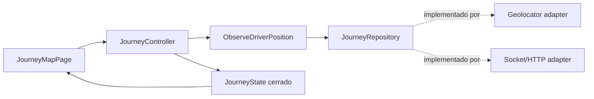
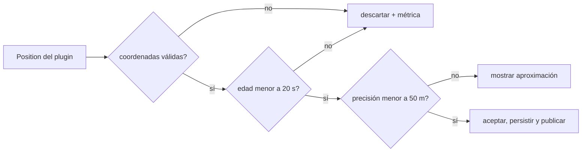
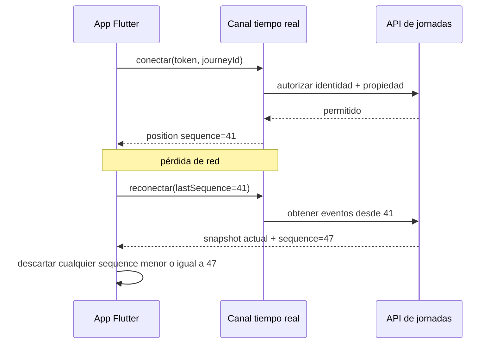
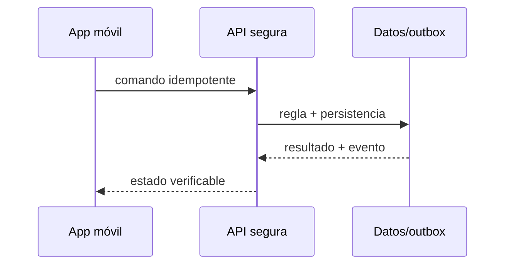

# Módulo 14: Flutter para entregas: mapas, GPS y tiempo real


## Antes de escribir código: vertical y estructura de carpetas

Construirás una vertical pequeña, no un clon completo de una marca: el conductor inicia una jornada, comparte posiciones aceptables, recibe una ruta y confirma una entrega aun si pierde conexión. Parte de un proyecto nuevo con `flutter create rutaflow_driver`, agrega únicamente los paquetes del incremento que estés implementando y conserva las claves de mapas fuera del repositorio.

```text
lib/
  features/journey/
    domain/position_sample.dart
    domain/journey_repository.dart
    application/observe_driver_position.dart
    data/geolocator_position_source.dart
    data/socket_journey_gateway.dart
    presentation/journey_controller.dart
    presentation/journey_map_page.dart
  shared/
    network/dio_client.dart
    storage/local_database.dart
test/features/journey/
  position_sample_test.dart
  journey_controller_test.dart
```

La dirección de dependencias es `presentation → application → domain`; `data` implementa interfaces del dominio. Google Maps, Geolocator, Dio y Socket.IO son adaptadores reemplazables, no tipos que deban atravesar toda la aplicación. Ejecuta después de cada incremento con `flutter analyze` y `flutter test`; prueba permisos y ejecución en segundo plano en dispositivo real porque el simulador no reproduce todas las restricciones del sistema operativo.

## Aprende construyendo

### Tema 1: Diseño de pantallas y Riverpod

**Conceptos clave:** contratos, estados explícitos, fallos, seguridad y verificación.

La jornada se diseña desde tareas reales: iniciar turno, aceptar ruta, navegar a una parada, escanear, capturar evidencia y confirmar. La pantalla no debería deducir reglas a partir de varios booleanos independientes (`isLoading`, `hasError`, `isOffline`), porque combinaciones imposibles terminan apareciendo. Modela un estado cerrado que indique exactamente qué puede mostrar y qué acción es válida.

```dart
sealed class JourneyState {
  const JourneyState();
}
final class JourneyIdle extends JourneyState { const JourneyIdle(); }
final class JourneyLoading extends JourneyState { const JourneyLoading(); }
final class JourneyReady extends JourneyState {
  const JourneyReady(this.viewModel);
  final JourneyViewModel viewModel;
}
final class JourneyOffline extends JourneyState {
  const JourneyOffline(this.pendingCommands);
  final int pendingCommands;
}
final class JourneyFailure extends JourneyState {
  const JourneyFailure(this.message, {required this.canRetry});
  final String message;
  final bool canRetry;
}
```

`JourneyController` coordina casos de uso y emite estos estados; no importa widgets, `BuildContext`, Dio ni SQLite. La vista usa un `switch` exhaustivo para renderizar progreso, mapa, cola pendiente o recuperación. Esto permite probar el flujo sin inicializar plugins móviles y hace imposible olvidar visualmente el estado offline.

**Analogía:** Es como una central de despacho: cada mensaje necesita identidad, hora, destino y confirmación; ver un vehículo en pantalla no demuestra que el paquete fue entregado.

**¿Por qué es importante?** Porque una aplicación logística funciona en movimiento, con mala red, concurrencia y datos sensibles. La corrección debe sobrevivir fuera de una demostración local.

**Casos de uso reales:** posición tardía, token vencido, fotografía pesada, comando repetido y usuario intentando acceder a una entrega ajena.

**Diagrama: cómo leer la dependencia:** la UI solicita una acción al controlador; el caso de uso aplica la regla; el repositorio decide entre adaptadores sin que el dominio conozca plugins.


### Tema 2: Google Maps y localización en tiempo real

**Conceptos clave:** contratos, estados explícitos, fallos, seguridad y verificación.

`google_maps_flutter` presenta marcadores, polylines y cámara; `geolocator` obtiene posiciones con precisión, instante y velocidad. No envíes directamente cada `Position` del plugin. Conviértela primero a un tipo de dominio que pueda rechazar coordenadas imposibles, muestras antiguas o una precisión incompatible con el caso de uso.

```dart
final class PositionSample {
  PositionSample({
    required this.latitude,
    required this.longitude,
    required this.accuracyMeters,
    required this.capturedAt,
  }) {
    if (latitude < -90 || latitude > 90) throw ArgumentError('latitude');
    if (longitude < -180 || longitude > 180) throw ArgumentError('longitude');
    if (accuracyMeters < 0) throw ArgumentError('accuracyMeters');
  }

  final double latitude;
  final double longitude;
  final double accuracyMeters;
  final DateTime capturedAt;

  bool isUsableAt(DateTime now) =>
      accuracyMeters <= 50 && now.difference(capturedAt) <= const Duration(seconds: 20);
}
```

En `geolocator_position_source.dart`, solicita permiso cuando el conductor activa «Iniciar jornada», explica antes para qué se usa y diferencia `denied`, `deniedForever` y servicio de ubicación desactivado. Configura una distancia mínima antes de una frecuencia fija agresiva; una jornada detenida no necesita el mismo muestreo que un vehículo en movimiento. En Android e iOS, la ubicación en segundo plano requiere configuración, justificación y pruebas separadas: conceder permiso «mientras se usa» no garantiza actualizaciones cuando la app queda suspendida.

En el mapa conserva dos conceptos: la última muestra **recibida** y la última muestra **aceptada**. Una muestra imprecisa puede mostrarse como un círculo de incertidumbre sin reemplazar la posición operacional. La polyline representa la geometría sugerida por el proveedor de rutas; no demuestra que el conductor haya recorrido ese trayecto.

**Analogía:** una muestra GPS es una medición con margen de error, como una balanza que informa peso y tolerancia; dibujar más decimales no vuelve más preciso el instrumento.

**¿Por qué es importante?** Separar la medición cruda de la posición aceptada evita que datos antiguos o imprecisos hagan retroceder el vehículo, disparen una llegada falsa o recalculen rutas innecesariamente.

**Casos de uso reales:** permiso negado permanentemente, servicio GPS apagado, muestra con 200 metros de precisión, salto a una vía paralela y suspensión de la app por ahorro de batería.

**Diagrama: filtro de una muestra antes de actualizar mapa o servidor:**


### Tema 3: Socket.IO y actualización de rutas

**Conceptos clave:** contratos, estados explícitos, fallos, seguridad y verificación.

`socket_io_client` conecta con un servidor Socket.IO compatible, autentica el *handshake*, entra en un canal autorizado de la jornada y procesa eventos versionados. Socket.IO aporta negociación, eventos con nombre y reconexión sobre su propio protocolo; no es intercambiable automáticamente con un endpoint WebSocket o STOMP de Spring. El backend debe usar un servidor Socket.IO compatible o debe elegirse deliberadamente STOMP/WebSocket en ambos extremos.

Cada evento de posición necesita `journeyId`, `driverId`, `sequence`, `capturedAt` y coordenadas. El cliente conserva la última secuencia aplicada y descarta duplicados o eventos anteriores. Después de reconectar solicita un *snapshot* o eventos desde esa secuencia; “conectado otra vez” no significa que recibió lo ocurrido durante la desconexión.

```dart
final class JourneyEventReducer {
  int _lastSequence = 0;

  PositionSample? apply(DriverPositionEvent event, DateTime now) {
    if (event.sequence <= _lastSequence) return null;
    if (!event.position.isUsableAt(now)) return null;
    _lastSequence = event.sequence;
    return event.position;
  }

  int get resumeAfter => _lastSequence;
}
```

Configura el token en `auth` durante la conexión y valida identidad y propiedad de la jornada en el servidor antes de unir el socket a una sala. No uses el `journeyId` enviado por el cliente como autorización. Al renovar el token, crea una estrategia explícita de reconexión; registrar tokens completos en eventos de diagnóstico expone credenciales.

La ruta no se recalcula ante cada punto. Define una política con distancia a la polyline, tiempo desde el último cálculo y cambio operacional. Por ejemplo: recalcular si el vehículo permanece a más de 80 metros del corredor durante tres muestras aceptadas, o si se agrega/cancela una parada. Esta histéresis evita oscilación y gasto de API por ruido GPS.

**Analogía:** reconectar un teléfono después de perder cobertura restablece la llamada, pero no reproduce las frases dichas mientras estaba desconectado; hace falta un resumen o historial desde el último mensaje confirmado.

**¿Por qué es importante?** Sin secuencia, reanudación y autorización por recurso, el mapa puede retroceder, omitir posiciones o permitir que una identidad válida observe una jornada ajena.

**Casos de uso reales:** reconexión después de un túnel, evento duplicado, dos dispositivos para el mismo conductor, token vencido durante la jornada y desviación causada por precisión deficiente.

**Diagrama: reanudación después de perder conectividad:**


### Tema 4: Animaciones de localización

**Conceptos clave:** contratos, estados explícitos, fallos, seguridad y verificación.

El marcador no salta entre puntos: interpola posición y rumbo durante un intervalo limitado. Los eventos fuera de orden no retroceden el vehículo. AnimationController se libera en dispose y el frame budget se mide con DevTools. La animación comunica movimiento estimado; no fabrica precisión que el GPS no posee. La implementación se conecta a RutaFlow y se prueba con camino feliz, entrada inválida, repetición y dependencia no disponible.

**Analogía:** Es como una central de despacho: cada mensaje necesita identidad, hora, destino y confirmación; ver un vehículo en pantalla no demuestra que el paquete fue entregado.

**¿Por qué es importante?** Porque una aplicación logística funciona en movimiento, con mala red, concurrencia y datos sensibles. La corrección debe sobrevivir fuera de una demostración local.

**Casos de uso reales:** posición tardía, token vencido, fotografía pesada, comando repetido y usuario intentando acceder a una entrega ajena.

**Diagrama:**


### Tema 5: Almacenamiento local, imágenes y offline

**Conceptos clave:** contratos, estados explícitos, fallos, seguridad y verificación.

SQLite conserva jornada, paradas y un outbox de comandos. Capturar foto genera un archivo comprimido y cifrado con referencia local; no guarda bytes grandes en una fila. Cada confirmación usa UUID idempotente y estados pending/syncing/synced/failed. image_picker/camera manejan cancelación, metadatos y permisos. La implementación se conecta a RutaFlow y se prueba con camino feliz, entrada inválida, repetición y dependencia no disponible.

**Analogía:** Es como una central de despacho: cada mensaje necesita identidad, hora, destino y confirmación; ver un vehículo en pantalla no demuestra que el paquete fue entregado.

**¿Por qué es importante?** Porque una aplicación logística funciona en movimiento, con mala red, concurrencia y datos sensibles. La corrección debe sobrevivir fuera de una demostración local.

**Casos de uso reales:** posición tardía, token vencido, fotografía pesada, comando repetido y usuario intentando acceder a una entrega ajena.

**Diagrama:**


### Tema 6: Dio y notificaciones push

**Conceptos clave:** contratos, estados explícitos, fallos, seguridad y verificación.

Dio configura timeouts, cancelación, interceptores seguros y subida multipart con progreso. El refresh de token se serializa para evitar una tormenta de solicitudes. FCM/APNs despierta o informa, pero la app consulta el backend como fuente de verdad. El token push rota, se asocia a instalación y nunca autoriza operaciones. La implementación se conecta a RutaFlow y se prueba con camino feliz, entrada inválida, repetición y dependencia no disponible.

**Analogía:** Es como una central de despacho: cada mensaje necesita identidad, hora, destino y confirmación; ver un vehículo en pantalla no demuestra que el paquete fue entregado.

**¿Por qué es importante?** Porque una aplicación logística funciona en movimiento, con mala red, concurrencia y datos sensibles. La corrección debe sobrevivir fuera de una demostración local.

**Casos de uso reales:** posición tardía, token vencido, fotografía pesada, comando repetido y usuario intentando acceder a una entrega ajena.

**Diagrama:**


