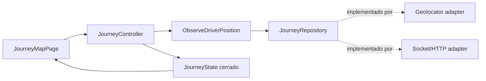
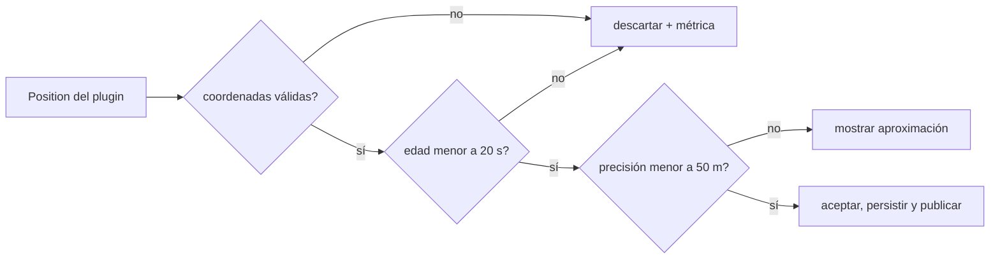
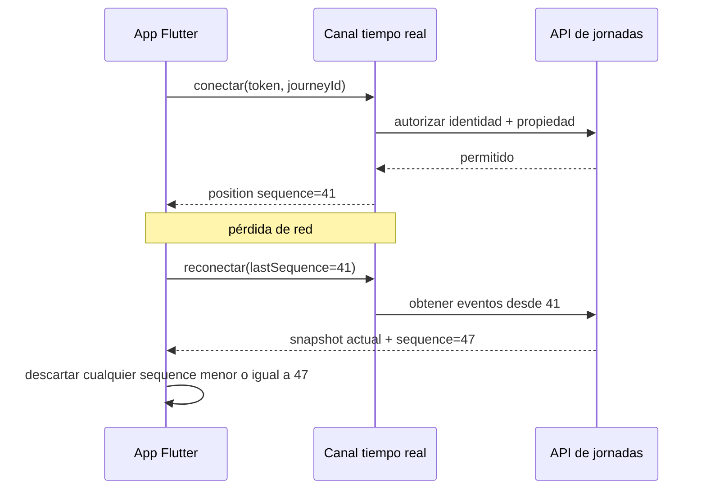
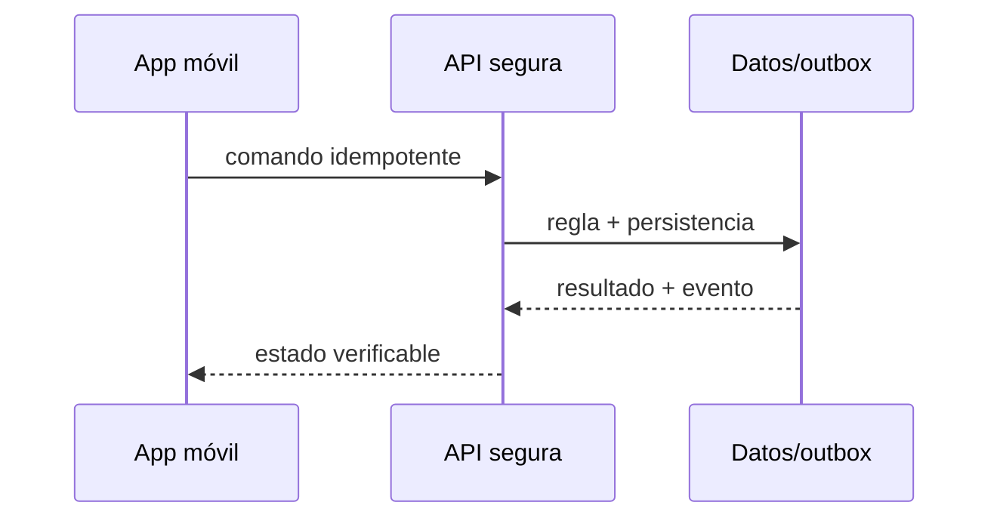

# Módulo 14: Flutter para entregas: mapas, GPS y tiempo real

## Sílabo

**Objetivo general:** construir una vertical de seguimiento de entregas que conecte interfaz, ubicación, tiempo real, persistencia, seguridad, evidencia y notificaciones sin esconder los fallos normales de una aplicación móvil.

**Evaluación:** 40 % implementación, 25 % pruebas, 20 % explicación y decisiones, 15 % seguridad y operación.

## Antes de escribir código: vertical y estructura de carpetas

Construirás una vertical pequeña, no un clon completo de una marca: el conductor inicia una jornada, comparte posiciones aceptables, recibe una ruta y confirma una entrega aun si pierde conexión. Parte de un proyecto nuevo con `flutter create rutaflow_driver`, agrega únicamente los paquetes del incremento que estés implementando y conserva las claves de mapas fuera del repositorio.

```text
lib/
  features/journey/
    domain/position_sample.dart
    domain/journey_repository.dart
    application/observe_driver_position.dart
    data/geolocator_position_source.dart
    data/socket_journey_gateway.dart
    presentation/journey_controller.dart
    presentation/journey_map_page.dart
  shared/
    network/dio_client.dart
    storage/local_database.dart
test/features/journey/
  position_sample_test.dart
  journey_controller_test.dart
```

La dirección de dependencias es `presentation → application → domain`; `data` implementa interfaces del dominio. Google Maps, Geolocator, Dio y Socket.IO son adaptadores reemplazables, no tipos que deban atravesar toda la aplicación. Ejecuta después de cada incremento con `flutter analyze` y `flutter test`; prueba permisos y ejecución en segundo plano en dispositivo real porque el simulador no reproduce todas las restricciones del sistema operativo.

## Comienza desde cero: prepara este capítulo

Este recorrido parte de una carpeta vacía. Al finalizar tendrás **Un incremento pequeño, probado y reproducible del capítulo.** No avances ejecutando comandos que no comprendes: primero identifica la entrada, la transformación y la evidencia que comprobará el resultado.

### 1. Comprueba las herramientas

Los comandos funcionan en macOS, Linux y WSL. En PowerShell usa el equivalente indicado por la herramienta.

```bash
flutter doctor -v
flutter --version
git --version
```

Si un comando no existe, detente e instala esa herramienta desde su sitio oficial. Cierra y abre la terminal después de modificar `PATH`. Las versiones deben ser compatibles entre sí antes de crear archivos.

### 2. Crea o recupera el proyecto del track

```bash
flutter create --org com.academia academia-labs/flutter_app
cd academia-labs/flutter_app
git init
flutter pub get
```

Trabaja dentro de `academia-labs/flutter_app`. Si ya existe, no lo vuelvas a generar: entra en la carpeta, confirma `git status` y continúa sobre una rama propia.

### 3. Ubica cada tema antes de escribir

```text
academia-labs/flutter_app/
├─ lib/features/
│  └─ module-14/
├─ tests/
├─ docs/decisions/
├─ evidence/module-14/
└─ README.md
```

| Tema | Archivo o decisión | Evidencia mínima |
|---|---|---|
| 1. Diseño de pantallas y Riverpod | `lib/features/module-14/topic-1-diseno-de-pantallas-y-riverpod.dart` | prueba + salida observable |
| 2. Google Maps y localización en tiempo real | `lib/features/module-14/topic-2-google-maps-y-localizacion-en-tiempo-real.dart` | prueba + salida observable |
| 3. Socket.IO y actualización de rutas | `lib/features/module-14/topic-3-socket-io-y-actualizacion-de-rutas.dart` | prueba + salida observable |
| 4. Animaciones de localización | `lib/features/module-14/topic-4-animaciones-de-localizacion.dart` | prueba + salida observable |
| 5. Almacenamiento local, imágenes y offline | `lib/features/module-14/topic-5-almacenamiento-local-imagenes-y-offline.dart` | prueba + salida observable |
| 6. Dio y notificaciones push | `lib/features/module-14/topic-6-dio-y-notificaciones-push.dart` | prueba + salida observable |

Un ejemplo técnico vive en el archivo indicado y debe tener una prueba. Un tema conceptual vive en `docs/decisions/`: compara opciones usando restricciones medibles; no escribas código decorativo solo para llenar espacio.

### 4. Ejecuta una línea base

Desde `academia-labs/flutter_app`:

```bash
flutter analyze && flutter test
```

**Resultado esperado:** el comando reconoce el proyecto y termina sin errores antes de introducir el cambio del capítulo. Después del incremento, la evidencia debe demostrar: **Un incremento pequeño, probado y reproducible del capítulo.**

Si falla la línea base, no continúes. Localiza el primer mensaje que indique archivo, línea o dependencia; formula una causa y compruébala con un cambio pequeño.

### 5. Provoca un fallo y recupérate

Simula pérdida de red, permiso denegado o widget desmontado; comprueba la recuperación sin errores ocultos. Guarda en `evidence/module-14/` el comando, la salida relevante, tu hipótesis y la corrección. Revierte únicamente el cambio deliberado; no borres todo el proyecto para ocultar la causa.

### 6. Conecta el capítulo con RutaFlow

Aplica el aprendizaje de **Flutter para entregas: mapas, GPS y tiempo real** a un incremento vertical de RutaFlow. Define qué componente produce el dato, qué contrato lo transporta, quién lo consume y cómo observarás un fallo. La entrega final incluye archivo o decisión, prueba, salida, error corregido y una limitación que todavía validarías en producción.

---

## Contenido teórico

### Tema 1: Diseño de pantallas y Riverpod

**Conceptos clave:** contratos, estados explícitos, fallos, seguridad y verificación.

La jornada se diseña desde tareas reales: iniciar turno, aceptar ruta, navegar a una parada, escanear, capturar evidencia y confirmar. La pantalla no debería deducir reglas a partir de varios booleanos independientes (`isLoading`, `hasError`, `isOffline`), porque combinaciones imposibles terminan apareciendo. Modela un estado cerrado que indique exactamente qué puede mostrar y qué acción es válida.

```dart
sealed class JourneyState {
  const JourneyState();
}
final class JourneyIdle extends JourneyState { const JourneyIdle(); }
final class JourneyLoading extends JourneyState { const JourneyLoading(); }
final class JourneyReady extends JourneyState {
  const JourneyReady(this.viewModel);
  final JourneyViewModel viewModel;
}
final class JourneyOffline extends JourneyState {
  const JourneyOffline(this.pendingCommands);
  final int pendingCommands;
}
final class JourneyFailure extends JourneyState {
  const JourneyFailure(this.message, {required this.canRetry});
  final String message;
  final bool canRetry;
}
```

`JourneyController` coordina casos de uso y emite estos estados; no importa widgets, `BuildContext`, Dio ni SQLite. La vista usa un `switch` exhaustivo para renderizar progreso, mapa, cola pendiente o recuperación. Esto permite probar el flujo sin inicializar plugins móviles y hace imposible olvidar visualmente el estado offline.

**Analogía:** Es como una central de despacho: cada mensaje necesita identidad, hora, destino y confirmación; ver un vehículo en pantalla no demuestra que el paquete fue entregado.

**¿Por qué es importante?** Porque una aplicación logística funciona en movimiento, con mala red, concurrencia y datos sensibles. La corrección debe sobrevivir fuera de una demostración local.

**Casos de uso reales:** posición tardía, token vencido, fotografía pesada, comando repetido y usuario intentando acceder a una entrega ajena.

**Diagrama: cómo leer la dependencia:** la UI solicita una acción al controlador; el caso de uso aplica la regla; el repositorio decide entre adaptadores sin que el dominio conozca plugins.


### Tema 2: Google Maps y localización en tiempo real

**Conceptos clave:** contratos, estados explícitos, fallos, seguridad y verificación.

`google_maps_flutter` presenta marcadores, polylines y cámara; `geolocator` obtiene posiciones con precisión, instante y velocidad. No envíes directamente cada `Position` del plugin. Conviértela primero a un tipo de dominio que pueda rechazar coordenadas imposibles, muestras antiguas o una precisión incompatible con el caso de uso.

```dart
final class PositionSample {
  PositionSample({
    required this.latitude,
    required this.longitude,
    required this.accuracyMeters,
    required this.capturedAt,
  }) {
    if (latitude < -90 || latitude > 90) throw ArgumentError('latitude');
    if (longitude < -180 || longitude > 180) throw ArgumentError('longitude');
    if (accuracyMeters < 0) throw ArgumentError('accuracyMeters');
  }

  final double latitude;
  final double longitude;
  final double accuracyMeters;
  final DateTime capturedAt;

  bool isUsableAt(DateTime now) =>
      accuracyMeters <= 50 && now.difference(capturedAt) <= const Duration(seconds: 20);
}
```

En `geolocator_position_source.dart`, solicita permiso cuando el conductor activa «Iniciar jornada», explica antes para qué se usa y diferencia `denied`, `deniedForever` y servicio de ubicación desactivado. Configura una distancia mínima antes de una frecuencia fija agresiva; una jornada detenida no necesita el mismo muestreo que un vehículo en movimiento. En Android e iOS, la ubicación en segundo plano requiere configuración, justificación y pruebas separadas: conceder permiso «mientras se usa» no garantiza actualizaciones cuando la app queda suspendida.

En el mapa conserva dos conceptos: la última muestra **recibida** y la última muestra **aceptada**. Una muestra imprecisa puede mostrarse como un círculo de incertidumbre sin reemplazar la posición operacional. La polyline representa la geometría sugerida por el proveedor de rutas; no demuestra que el conductor haya recorrido ese trayecto.

**Analogía:** una muestra GPS es una medición con margen de error, como una balanza que informa peso y tolerancia; dibujar más decimales no vuelve más preciso el instrumento.

**¿Por qué es importante?** Separar la medición cruda de la posición aceptada evita que datos antiguos o imprecisos hagan retroceder el vehículo, disparen una llegada falsa o recalculen rutas innecesariamente.

**Casos de uso reales:** permiso negado permanentemente, servicio GPS apagado, muestra con 200 metros de precisión, salto a una vía paralela y suspensión de la app por ahorro de batería.

**Diagrama: filtro de una muestra antes de actualizar mapa o servidor:**


### Tema 3: Socket.IO y actualización de rutas

**Conceptos clave:** contratos, estados explícitos, fallos, seguridad y verificación.

`socket_io_client` conecta con un servidor Socket.IO compatible, autentica el *handshake*, entra en un canal autorizado de la jornada y procesa eventos versionados. Socket.IO aporta negociación, eventos con nombre y reconexión sobre su propio protocolo; no es intercambiable automáticamente con un endpoint WebSocket o STOMP de Spring. El backend debe usar un servidor Socket.IO compatible o debe elegirse deliberadamente STOMP/WebSocket en ambos extremos.

Cada evento de posición necesita `journeyId`, `driverId`, `sequence`, `capturedAt` y coordenadas. El cliente conserva la última secuencia aplicada y descarta duplicados o eventos anteriores. Después de reconectar solicita un *snapshot* o eventos desde esa secuencia; “conectado otra vez” no significa que recibió lo ocurrido durante la desconexión.

```dart
final class JourneyEventReducer {
  int _lastSequence = 0;

  PositionSample? apply(DriverPositionEvent event, DateTime now) {
    if (event.sequence <= _lastSequence) return null;
    if (!event.position.isUsableAt(now)) return null;
    _lastSequence = event.sequence;
    return event.position;
  }

  int get resumeAfter => _lastSequence;
}
```

Configura el token en `auth` durante la conexión y valida identidad y propiedad de la jornada en el servidor antes de unir el socket a una sala. No uses el `journeyId` enviado por el cliente como autorización. Al renovar el token, crea una estrategia explícita de reconexión; registrar tokens completos en eventos de diagnóstico expone credenciales.

La ruta no se recalcula ante cada punto. Define una política con distancia a la polyline, tiempo desde el último cálculo y cambio operacional. Por ejemplo: recalcular si el vehículo permanece a más de 80 metros del corredor durante tres muestras aceptadas, o si se agrega/cancela una parada. Esta histéresis evita oscilación y gasto de API por ruido GPS.

**Analogía:** reconectar un teléfono después de perder cobertura restablece la llamada, pero no reproduce las frases dichas mientras estaba desconectado; hace falta un resumen o historial desde el último mensaje confirmado.

**¿Por qué es importante?** Sin secuencia, reanudación y autorización por recurso, el mapa puede retroceder, omitir posiciones o permitir que una identidad válida observe una jornada ajena.

**Casos de uso reales:** reconexión después de un túnel, evento duplicado, dos dispositivos para el mismo conductor, token vencido durante la jornada y desviación causada por precisión deficiente.

**Diagrama: reanudación después de perder conectividad:**


### Tema 4: Animaciones de localización

**Conceptos clave:** contratos, estados explícitos, fallos, seguridad y verificación.

El marcador no salta entre puntos: interpola posición y rumbo durante un intervalo limitado. Los eventos fuera de orden no retroceden el vehículo. AnimationController se libera en dispose y el frame budget se mide con DevTools. La animación comunica movimiento estimado; no fabrica precisión que el GPS no posee. La implementación se conecta a RutaFlow y se prueba con camino feliz, entrada inválida, repetición y dependencia no disponible.

**Analogía:** Es como una central de despacho: cada mensaje necesita identidad, hora, destino y confirmación; ver un vehículo en pantalla no demuestra que el paquete fue entregado.

**¿Por qué es importante?** Porque una aplicación logística funciona en movimiento, con mala red, concurrencia y datos sensibles. La corrección debe sobrevivir fuera de una demostración local.

**Casos de uso reales:** posición tardía, token vencido, fotografía pesada, comando repetido y usuario intentando acceder a una entrega ajena.

**Diagrama:**


### Tema 5: Almacenamiento local, imágenes y offline

**Conceptos clave:** contratos, estados explícitos, fallos, seguridad y verificación.

SQLite conserva jornada, paradas y un outbox de comandos. Capturar foto genera un archivo comprimido y cifrado con referencia local; no guarda bytes grandes en una fila. Cada confirmación usa UUID idempotente y estados pending/syncing/synced/failed. image_picker/camera manejan cancelación, metadatos y permisos. La implementación se conecta a RutaFlow y se prueba con camino feliz, entrada inválida, repetición y dependencia no disponible.

**Analogía:** Es como una central de despacho: cada mensaje necesita identidad, hora, destino y confirmación; ver un vehículo en pantalla no demuestra que el paquete fue entregado.

**¿Por qué es importante?** Porque una aplicación logística funciona en movimiento, con mala red, concurrencia y datos sensibles. La corrección debe sobrevivir fuera de una demostración local.

**Casos de uso reales:** posición tardía, token vencido, fotografía pesada, comando repetido y usuario intentando acceder a una entrega ajena.

**Diagrama:**


### Tema 6: Dio y notificaciones push

**Conceptos clave:** contratos, estados explícitos, fallos, seguridad y verificación.

Dio configura timeouts, cancelación, interceptores seguros y subida multipart con progreso. El refresh de token se serializa para evitar una tormenta de solicitudes. FCM/APNs despierta o informa, pero la app consulta el backend como fuente de verdad. El token push rota, se asocia a instalación y nunca autoriza operaciones. La implementación se conecta a RutaFlow y se prueba con camino feliz, entrada inválida, repetición y dependencia no disponible.

**Analogía:** Es como una central de despacho: cada mensaje necesita identidad, hora, destino y confirmación; ver un vehículo en pantalla no demuestra que el paquete fue entregado.

**¿Por qué es importante?** Porque una aplicación logística funciona en movimiento, con mala red, concurrencia y datos sensibles. La corrección debe sobrevivir fuera de una demostración local.

**Casos de uso reales:** posición tardía, token vencido, fotografía pesada, comando repetido y usuario intentando acceder a una entrega ajena.

**Diagrama:**


## Criterio transversal de calidad del código

Usa nombres del dominio, dependencias dirigidas hacia políticas estables y errores tipados. Escribe una prueba antes de corregir cada fallo. SOLID se aplica para separar mapas, transporte, persistencia y notificaciones, no para crear capas vacías. No abstraer hasta encontrar repetición con el mismo significado. Revisa nombres, errores, prueba, privacidad, permisos y operación.

## Laboratorio práctico

Parte de una carpeta vacía de feature dentro de RutaFlow. Define primero el contrato `DeliveryUpdate` con identificador, secuencia, instante y precisión. Implementa una pantalla de jornada, un endpoint protegido y persistencia durable. Luego conecta mapa y canal en tiempo real. Finalmente captura evidencia, trabaja sin red y sincroniza.

1. Dibuja pantalla, estados y amenazas antes de instalar paquetes.
2. Implementa el camino feliz con datos simulados y una prueba automatizada.
3. Sustituye un adaptador a la vez: mapa, GPS, socket, datos, archivos y push.
4. Desconecta la red, repite el comando, vence el token y envía eventos fuera de orden.
5. Mide batería o consulta, latencia, frames y backlog; registra resultados en README.

La definición de terminado exige comandos reproducibles, datos ficticios, secretos fuera del repositorio y una demostración en dispositivo o entorno de integración. No basta con que el marcador se mueva.

## Ejercicios de evaluación

### Ejercicio 1: seguridad y propiedad

Intenta leer o modificar una entrega ajena con un token válido. Escribe la prueba negativa y corrige autorización sin depender solo del rol.

### Ejercicio 2: red inestable

Confirma una entrega, pierde la respuesta y reintenta. Demuestra que existe un único efecto y que la interfaz distingue pendiente de fallido.

### Ejercicio 3: geografía honesta

Procesa una posición antigua, una imprecisa y otra fuera de orden. Explica cuál descartas, cuál conservas y cómo lo comunicas.

### Ejercicio 4: alternativa tecnológica

Compara Google Maps con MapLibre, Socket.IO con WebSocket/STOMP y MySQL Spatial con PostGIS según licencia, capacidades, operación y portabilidad. No hay ganador universal.

## Rúbrica del proyecto

| Criterio | Inicial | Competente | Profesional |
|---|---|---|---|
| Funcionalidad | Demo aislada | Flujo integrado | Offline, reintentos y recuperación |
| Geografía | Dibuja puntos | Valida precisión/tiempo | Índices, secuencia y medición |
| Seguridad | Solo login | Bearer y roles | Propiedad, amenazas y mínimo dato |
| Código | Plugins acoplados | Límites probados | Adaptadores sustituibles con criterio |
| Operación | Logs manuales | Métricas básicas | Correlación, runbook y prueba de fallo |

## Bibliografía y fundamento académico

- Documentación oficial de Flutter, Riverpod, Google Maps Platform, Dio, Firebase y Socket.IO para el cliente.
- Spring Boot Reference, Spring Security Reference, MySQL 8 Spatial Reference, Hibernate Spatial y Firebase Admin para el servidor.
- RFC 6750 para Bearer Tokens, RFC 7946 para GeoJSON y especificación WebSocket RFC 6455.
- OWASP MASVS/ASVS para permisos, almacenamiento, autenticación, archivos y APIs.
- Martin Kleppmann, *Designing Data-Intensive Applications*, para orden, duplicación y fallos parciales.

Verifica versión, licencia y política de precios antes de elegir proveedor de mapas o mensajería. Socket.IO no es WebSocket puro y JWT no significa automáticamente autorización correcta.

<!-- REQUESTED-PRACTICAL-EXAMPLES:START -->
## Ejemplos guiados verificables

### Ejemplo guiado: Animaciones en Flutter

Separa la interpolación del widget para poder probarla sin reloj, mapa ni `AnimationController`. La animación visual consume esta función; la regla que impide retroceder por eventos fuera de orden permanece en `JourneyEventReducer`.

`lib/features/journey/presentation/interpolate_position.dart`:

```dart
import 'package:google_maps_flutter/google_maps_flutter.dart';

LatLng interpolatePosition(LatLng from, LatLng to, double progress) {
  final t = progress.clamp(0.0, 1.0);
  return LatLng(
    from.latitude + (to.latitude - from.latitude) * t,
    from.longitude + (to.longitude - from.longitude) * t,
  );
}
```

`test/features/journey/interpolate_position_test.dart`:

```dart
test('interpola la mitad y limita progreso fuera de rango', () {
  const from = LatLng(4.60, -74.10);
  const to = LatLng(4.62, -74.08);

  expect(interpolatePosition(from, to, .5), const LatLng(4.61, -74.09));
  expect(interpolatePosition(from, to, 2), to);
});
```

Ejecuta `flutter test test/features/journey/interpolate_position_test.dart`. Después activa `disableAnimations` desde accesibilidad y verifica que el marcador salte al punto aceptado sin una transición obligatoria. Una animación suave no debe retrasar una alerta crítica ni fingir precisión adicional.

### Ejemplo guiado: Notificaciones push (Firebase Cloud Messaging)

Una notificación es una señal para sincronizar, no la fuente de verdad ni un permiso. El mensaje transporta identificadores mínimos; la app consulta la entrega con su sesión autenticada y el backend vuelve a comprobar propiedad.

`lib/shared/notifications/push_router.dart`:

```dart
final class PushRouter {
  PushRouter(this.refreshDelivery);
  final Future<void> Function(String deliveryId) refreshDelivery;

  Future<void> handle(Map<String, dynamic> data) async {
    if (data['type'] != 'delivery.updated') return;
    final deliveryId = data['deliveryId'];
    if (deliveryId is! String || deliveryId.isEmpty) {
      throw const FormatException('deliveryId ausente');
    }
    await refreshDelivery(deliveryId); // vuelve a consultar la API autorizada
  }
}
```

Prueba un tipo desconocido, un identificador ausente y una entrega ajena. Los dos primeros casos se controlan en el cliente; el tercero debe producir `403` desde Spring Boot aunque el dispositivo haya recibido el push. Registra la instalación y rota su token FCM, pero nunca incluyas JWT, dirección completa, fotografía ni datos sensibles en el payload.

<!-- REQUESTED-PRACTICAL-EXAMPLES:END -->

## Resumen del módulo

Los temas de la lista ahora forman una capacidad visible y evaluable. La persona diseña pantallas, gestiona estado, dibuja y actualiza rutas, recibe posiciones, conserva trabajo offline, procesa imágenes, consume HTTP, protege recursos y envía notificaciones. El aprendizaje termina cuando puede explicar y demostrar qué ocurre ante mala red, duplicados, datos geográficos imperfectos y accesos indebidos.
