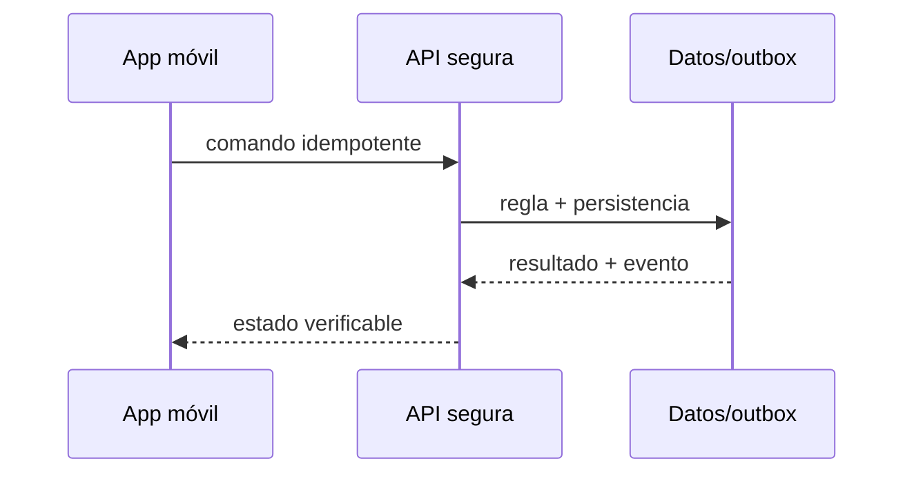

# Módulo 14: Flutter para entregas: mapas, GPS y tiempo real

## Sílabo

**Objetivo general:** construir una vertical de seguimiento de entregas que conecte interfaz, ubicación, tiempo real, persistencia, seguridad, evidencia y notificaciones sin esconder los fallos normales de una aplicación móvil.

**Evaluación:** 40 % implementación, 25 % pruebas, 20 % explicación y decisiones, 15 % seguridad y operación.

## Contenido teórico

### Tema 1: Diseño de pantallas y Riverpod

**Conceptos clave:** contratos, estados explícitos, fallos, seguridad y verificación.

La jornada se diseña desde tareas reales: iniciar turno, aceptar ruta, navegar a una parada, escanear, capturar evidencia y confirmar. Riverpod representa estados sellados de carga, datos, error y sincronización; un provider no debe convertirse en una clase global que conozca UI, red y SQLite. Los widgets observan modelos de pantalla y los casos de uso preservan reglas. La implementación se conecta a RutaFlow y se prueba con camino feliz, entrada inválida, repetición y dependencia no disponible.

**Analogía:** Es como una central de despacho: cada mensaje necesita identidad, hora, destino y confirmación; ver un vehículo en pantalla no demuestra que el paquete fue entregado.

**¿Por qué es importante?** Porque una aplicación logística funciona en movimiento, con mala red, concurrencia y datos sensibles. La corrección debe sobrevivir fuera de una demostración local.

**Casos de uso reales:** posición tardía, token vencido, fotografía pesada, comando repetido y usuario intentando acceder a una entrega ajena.

**Diagrama:**

### Tema 2: Google Maps y localización en tiempo real

**Conceptos clave:** contratos, estados explícitos, fallos, seguridad y verificación.

google_maps_flutter presenta marcadores, polylines y cámara; geolocator obtiene posiciones con precisión, timestamp y velocidad. Antes de solicitar permiso se explica el beneficio. Background location requiere justificación y configuración separada en Android/iOS. Una posición vieja o imprecisa se descarta o comunica como aproximación. La implementación se conecta a RutaFlow y se prueba con camino feliz, entrada inválida, repetición y dependencia no disponible.

**Analogía:** Es como una central de despacho: cada mensaje necesita identidad, hora, destino y confirmación; ver un vehículo en pantalla no demuestra que el paquete fue entregado.

**¿Por qué es importante?** Porque una aplicación logística funciona en movimiento, con mala red, concurrencia y datos sensibles. La corrección debe sobrevivir fuera de una demostración local.

**Casos de uso reales:** posición tardía, token vencido, fotografía pesada, comando repetido y usuario intentando acceder a una entrega ajena.

**Diagrama:**

### Tema 3: Socket.IO y actualización de rutas

**Conceptos clave:** contratos, estados explícitos, fallos, seguridad y verificación.

socket_io_client conecta con un servidor compatible, autentica el handshake, entra en una sala por jornada y procesa eventos versionados. La app reconecta con backoff, reanuda desde el último sequence number y no supone entrega exactamente una vez. La ruta se recalcula únicamente ante desviación significativa o cambio operativo. La implementación se conecta a RutaFlow y se prueba con camino feliz, entrada inválida, repetición y dependencia no disponible.

**Analogía:** Es como una central de despacho: cada mensaje necesita identidad, hora, destino y confirmación; ver un vehículo en pantalla no demuestra que el paquete fue entregado.

**¿Por qué es importante?** Porque una aplicación logística funciona en movimiento, con mala red, concurrencia y datos sensibles. La corrección debe sobrevivir fuera de una demostración local.

**Casos de uso reales:** posición tardía, token vencido, fotografía pesada, comando repetido y usuario intentando acceder a una entrega ajena.

**Diagrama:**

### Tema 4: Animaciones de localización

**Conceptos clave:** contratos, estados explícitos, fallos, seguridad y verificación.

El marcador no salta entre puntos: interpola posición y rumbo durante un intervalo limitado. Los eventos fuera de orden no retroceden el vehículo. AnimationController se libera en dispose y el frame budget se mide con DevTools. La animación comunica movimiento estimado; no fabrica precisión que el GPS no posee. La implementación se conecta a RutaFlow y se prueba con camino feliz, entrada inválida, repetición y dependencia no disponible.

**Analogía:** Es como una central de despacho: cada mensaje necesita identidad, hora, destino y confirmación; ver un vehículo en pantalla no demuestra que el paquete fue entregado.

**¿Por qué es importante?** Porque una aplicación logística funciona en movimiento, con mala red, concurrencia y datos sensibles. La corrección debe sobrevivir fuera de una demostración local.

**Casos de uso reales:** posición tardía, token vencido, fotografía pesada, comando repetido y usuario intentando acceder a una entrega ajena.

**Diagrama:**

### Tema 5: Almacenamiento local, imágenes y offline

**Conceptos clave:** contratos, estados explícitos, fallos, seguridad y verificación.

SQLite conserva jornada, paradas y un outbox de comandos. Capturar foto genera un archivo comprimido y cifrado con referencia local; no guarda bytes grandes en una fila. Cada confirmación usa UUID idempotente y estados pending/syncing/synced/failed. image_picker/camera manejan cancelación, metadatos y permisos. La implementación se conecta a RutaFlow y se prueba con camino feliz, entrada inválida, repetición y dependencia no disponible.

**Analogía:** Es como una central de despacho: cada mensaje necesita identidad, hora, destino y confirmación; ver un vehículo en pantalla no demuestra que el paquete fue entregado.

**¿Por qué es importante?** Porque una aplicación logística funciona en movimiento, con mala red, concurrencia y datos sensibles. La corrección debe sobrevivir fuera de una demostración local.

**Casos de uso reales:** posición tardía, token vencido, fotografía pesada, comando repetido y usuario intentando acceder a una entrega ajena.

**Diagrama:**

### Tema 6: Dio y notificaciones push

**Conceptos clave:** contratos, estados explícitos, fallos, seguridad y verificación.

Dio configura timeouts, cancelación, interceptores seguros y subida multipart con progreso. El refresh de token se serializa para evitar una tormenta de solicitudes. FCM/APNs despierta o informa, pero la app consulta el backend como fuente de verdad. El token push rota, se asocia a instalación y nunca autoriza operaciones. La implementación se conecta a RutaFlow y se prueba con camino feliz, entrada inválida, repetición y dependencia no disponible.

**Analogía:** Es como una central de despacho: cada mensaje necesita identidad, hora, destino y confirmación; ver un vehículo en pantalla no demuestra que el paquete fue entregado.

**¿Por qué es importante?** Porque una aplicación logística funciona en movimiento, con mala red, concurrencia y datos sensibles. La corrección debe sobrevivir fuera de una demostración local.

**Casos de uso reales:** posición tardía, token vencido, fotografía pesada, comando repetido y usuario intentando acceder a una entrega ajena.

**Diagrama:**

## Criterio transversal de calidad del código

Usa nombres del dominio, dependencias dirigidas hacia políticas estables y errores tipados. Escribe una prueba antes de corregir cada fallo. SOLID se aplica para separar mapas, transporte, persistencia y notificaciones, no para crear capas vacías. No abstraer hasta encontrar repetición con el mismo significado. Revisa nombres, errores, prueba, privacidad, permisos y operación.

## Laboratorio práctico

Parte de una carpeta vacía de feature dentro de RutaFlow. Define primero el contrato `DeliveryUpdate` con identificador, secuencia, instante y precisión. Implementa una pantalla de jornada, un endpoint protegido y persistencia durable. Luego conecta mapa y canal en tiempo real. Finalmente captura evidencia, trabaja sin red y sincroniza.

1. Dibuja pantalla, estados y amenazas antes de instalar paquetes.
2. Implementa el camino feliz con datos simulados y una prueba automatizada.
3. Sustituye un adaptador a la vez: mapa, GPS, socket, datos, archivos y push.
4. Desconecta la red, repite el comando, vence el token y envía eventos fuera de orden.
5. Mide batería o consulta, latencia, frames y backlog; registra resultados en README.

La definición de terminado exige comandos reproducibles, datos ficticios, secretos fuera del repositorio y una demostración en dispositivo o entorno de integración. No basta con que el marcador se mueva.

## Ejercicios de evaluación

### Ejercicio 1: seguridad y propiedad

Intenta leer o modificar una entrega ajena con un token válido. Escribe la prueba negativa y corrige autorización sin depender solo del rol.

### Ejercicio 2: red inestable

Confirma una entrega, pierde la respuesta y reintenta. Demuestra que existe un único efecto y que la interfaz distingue pendiente de fallido.

### Ejercicio 3: geografía honesta

Procesa una posición antigua, una imprecisa y otra fuera de orden. Explica cuál descartas, cuál conservas y cómo lo comunicas.

### Ejercicio 4: alternativa tecnológica

Compara Google Maps con MapLibre, Socket.IO con WebSocket/STOMP y MySQL Spatial con PostGIS según licencia, capacidades, operación y portabilidad. No hay ganador universal.

## Rúbrica del proyecto

| Criterio | Inicial | Competente | Profesional |
|---|---|---|---|
| Funcionalidad | Demo aislada | Flujo integrado | Offline, reintentos y recuperación |
| Geografía | Dibuja puntos | Valida precisión/tiempo | Índices, secuencia y medición |
| Seguridad | Solo login | Bearer y roles | Propiedad, amenazas y mínimo dato |
| Código | Plugins acoplados | Límites probados | Adaptadores sustituibles con criterio |
| Operación | Logs manuales | Métricas básicas | Correlación, runbook y prueba de fallo |

## Bibliografía y fundamento académico

- Documentación oficial de Flutter, Riverpod, Google Maps Platform, Dio, Firebase y Socket.IO para el cliente.
- Spring Boot Reference, Spring Security Reference, MySQL 8 Spatial Reference, Hibernate Spatial y Firebase Admin para el servidor.
- RFC 6750 para Bearer Tokens, RFC 7946 para GeoJSON y especificación WebSocket RFC 6455.
- OWASP MASVS/ASVS para permisos, almacenamiento, autenticación, archivos y APIs.
- Martin Kleppmann, *Designing Data-Intensive Applications*, para orden, duplicación y fallos parciales.

Verifica versión, licencia y política de precios antes de elegir proveedor de mapas o mensajería. Socket.IO no es WebSocket puro y JWT no significa automáticamente autorización correcta.

## Resumen del módulo

Los temas de la lista ahora forman una capacidad visible y evaluable. La persona diseña pantallas, gestiona estado, dibuja y actualiza rutas, recibe posiciones, conserva trabajo offline, procesa imágenes, consume HTTP, protege recursos y envía notificaciones. El aprendizaje termina cuando puede explicar y demostrar qué ocurre ante mala red, duplicados, datos geográficos imperfectos y accesos indebidos.
