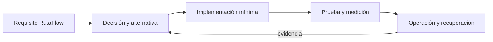

# Módulo 15: Flutter Master: calidad, arquitectura y despliegue


## Aprende construyendo

### Tema 1: flutter test y WidgetTester

#### Paso 1 · Objetivo y preparación
Al finalizar podrás aplicar este tema desde cero. **Prerrequisitos:** Flutter estable y Dart; confirma `flutter doctor`.
#### Paso 2 · Contexto y caso real
#### Paso 1 · Objetivo y preparación
**Objetivo:** construir y verificar pruebas Flutter aisladas. **Prerrequisitos:** Flutter estable y Dart; confirma `flutter doctor`. **Contexto:** una entrega debe poder cambiar sin romper su flujo visual. **Teoría y analogía:** el WidgetTester es un simulador controlado del usuario.
#### Paso 3 · Teoría, modelo mental y analogía
El test es un contrato observable.#### Paso 4 · Demostración guiada
**Demostración guiada:** ejecuta `flutter create ejemplo_test`, crea `test/features/journey/widget_test.dart` con una aserción comentada. **Ejecución y resultado:** `flutter test` termina verde.
```bash
flutter test
```
Resultado esperado: pruebas verdes.
**Fallo deliberado:** cambia una expectativa, conserva el diagnóstico y corrígela. #### Paso 5 · Práctica guiada
Pista: lee la aserción antes de cambiarla. **Práctica guiada:** prueba estado loading; #### Paso 6 · Práctica independiente
**independiente:** añade error y recuperación. Ejemplo independiente desde carpeta vacía: `flutter create ejemplo_test`.
#### Paso 7 · Cierre y evidencia
**Cierre y evidencia:** entrega código, salida y explica el resultado; como siguiente paso estudia integración. Errores comunes: sleeps, selectores frágiles y pruebas globales. Fuente oficial: https://docs.flutter.dev/testing.

**Conceptos clave:** propósito, modelo de ejecución, configuración, seguridad, coste, pruebas y operación.

flutter test y WidgetTester se estudia como una decisión de ingeniería y no como una colección de comandos. Primero identifica el problema que resuelve y los límites de la plataforma; luego construye el incremento mínimo dentro de RutaFlow. Registra entradas, salidas, dependencias y condiciones de fallo. Compara al menos una alternativa y conserva la medición que justifica la elección. Si la tecnología es experimental, se aísla del camino estable y se documenta la estrategia de retirada.

En producción debes considerar configuración por ambiente, identidad de máquina y persona, secretos, compatibilidad, telemetría y recuperación. Una demostración exitosa no prueba comportamiento bajo concurrencia, reintentos, pérdida de red o datos inválidos. Por eso el laboratorio introduce un fallo deliberado y exige una prueba de regresión. El resultado debe poder repetirse desde terminal y CI sin pasos secretos del editor.

**Analogía:** es como incorporar una nueva estación a una red logística: no basta con construirla; hay que definir rutas, capacidad, controles, contingencias y cómo sabremos que funciona.

**¿Por qué es importante?** Porque flutter test y WidgetTester aparece cuando el sistema crece y las decisiones dejan de ser locales. Comprender su coste evita adoptar una herramienta por popularidad o descartarla por una primera experiencia incompleta.

**Casos de uso reales:** operación normal, configuración inválida, dependencia lenta, solicitud duplicada, cambio incompatible y recuperación posterior a un despliegue fallido.

**Diagrama:**


### Tema 2: pumpAndSettle, golden e integration tests

#### Paso 1 · Objetivo y preparación
Al finalizar podrás aplicar este tema desde cero. **Prerrequisitos:** Flutter estable y Dart; confirma `flutter doctor`.
#### Paso 2 · Contexto y caso real
#### Paso 1 · Objetivo y preparación
**Objetivo:** construir y verificar pruebas de interacción. **Prerrequisitos:** Flutter estable y Dart; confirma `flutter doctor`. **Contexto:** los estados asíncronos deben ser reproducibles. **Teoría y analogía:** `pumpAndSettle` espera a que la escena deje de moverse.
#### Paso 3 · Teoría, modelo mental y analogía
El snapshot es un contrato visual.#### Paso 4 · Demostración guiada
**Demostración guiada:** ejecuta `flutter create ejemplo_golden`, crea `test/golden/journey_test.dart`. **Ejecución y resultado:** `flutter test` produce snapshot estable.
```bash
flutter test
```
Resultado esperado: snapshot estable.
**Fallo deliberado:** altera un color para observar el diff, registra el fallo y corrígelo. #### Paso 5 · Práctica guiada
Pista: compara el diff. **Práctica guiada:** cubre loading; #### Paso 6 · Práctica independiente
**independiente:** prueba integración. Ejemplo independiente desde carpeta vacía: `flutter create ejemplo_golden`.
#### Paso 7 · Cierre y evidencia
**Cierre y evidencia:** entrega snapshot, salida y explica el resultado; como siguiente paso estudia integración. Errores comunes: golden dependiente de plataforma y esperas infinitas. Fuente oficial: https://docs.flutter.dev/testing/integration-tests.

**Conceptos clave:** propósito, modelo de ejecución, configuración, seguridad, coste, pruebas y operación.

pumpAndSettle, golden e integration tests se estudia como una decisión de ingeniería y no como una colección de comandos. Primero identifica el problema que resuelve y los límites de la plataforma; luego construye el incremento mínimo dentro de RutaFlow. Registra entradas, salidas, dependencias y condiciones de fallo. Compara al menos una alternativa y conserva la medición que justifica la elección. Si la tecnología es experimental, se aísla del camino estable y se documenta la estrategia de retirada.

En producción debes considerar configuración por ambiente, identidad de máquina y persona, secretos, compatibilidad, telemetría y recuperación. Una demostración exitosa no prueba comportamiento bajo concurrencia, reintentos, pérdida de red o datos inválidos. Por eso el laboratorio introduce un fallo deliberado y exige una prueba de regresión. El resultado debe poder repetirse desde terminal y CI sin pasos secretos del editor.

**Analogía:** es como incorporar una nueva estación a una red logística: no basta con construirla; hay que definir rutas, capacidad, controles, contingencias y cómo sabremos que funciona.

**¿Por qué es importante?** Porque pumpAndSettle, golden e integration tests aparece cuando el sistema crece y las decisiones dejan de ser locales. Comprender su coste evita adoptar una herramienta por popularidad o descartarla por una primera experiencia incompleta.

**Casos de uso reales:** operación normal, configuración inválida, dependencia lenta, solicitud duplicada, cambio incompatible y recuperación posterior a un despliegue fallido.

**Diagrama:**


### Tema 3: Rendimiento, RepaintBoundary y Keys

#### Paso 1 · Objetivo y preparación
Al finalizar podrás aplicar este tema desde cero. **Prerrequisitos:** Flutter estable y Dart; confirma `flutter doctor`.
#### Paso 2 · Contexto y caso real
#### Paso 1 · Objetivo y preparación
**Objetivo:** medir y verificar rendimiento. **Prerrequisitos:** Flutter estable y Dart; confirma `flutter doctor`. **Contexto:** mapas y listas no deben perder frames. **Teoría y analogía:** una Key identifica una pieza; RepaintBoundary limita el repintado.
#### Paso 3 · Teoría, modelo mental y analogía
Medir precede a optimizar.#### Paso 4 · Demostración guiada
**Demostración guiada:** ejecuta `flutter create ejemplo_perf`, crea `lib/performance/list.dart`. **Ejecución y resultado:** `flutter analyze` y perfil muestran menos trabajo.
```bash
flutter analyze
```
Resultado esperado: análisis sin errores.
**Fallo deliberado:** elimina la Key para observar el diagnóstico, registra el fallo y corrígelo. #### Paso 5 · Práctica guiada
Pista: mide antes y después. **Práctica guiada:** mide baseline; #### Paso 6 · Práctica independiente
**independiente:** compara dos implementaciones. Ejemplo independiente desde carpeta vacía: `flutter create ejemplo_perf`.
#### Paso 7 · Cierre y evidencia
**Cierre y evidencia:** entrega medición y explica el resultado; como siguiente paso estudia profiling. Errores comunes: optimizar sin medir y rebuilds globales. Fuente oficial: https://docs.flutter.dev/perf.

**Conceptos clave:** propósito, modelo de ejecución, configuración, seguridad, coste, pruebas y operación.

Rendimiento, RepaintBoundary y Keys se estudia como una decisión de ingeniería y no como una colección de comandos. Primero identifica el problema que resuelve y los límites de la plataforma; luego construye el incremento mínimo dentro de RutaFlow. Registra entradas, salidas, dependencias y condiciones de fallo. Compara al menos una alternativa y conserva la medición que justifica la elección. Si la tecnología es experimental, se aísla del camino estable y se documenta la estrategia de retirada.

En producción debes considerar configuración por ambiente, identidad de máquina y persona, secretos, compatibilidad, telemetría y recuperación. Una demostración exitosa no prueba comportamiento bajo concurrencia, reintentos, pérdida de red o datos inválidos. Por eso el laboratorio introduce un fallo deliberado y exige una prueba de regresión. El resultado debe poder repetirse desde terminal y CI sin pasos secretos del editor.

**Analogía:** es como incorporar una nueva estación a una red logística: no basta con construirla; hay que definir rutas, capacidad, controles, contingencias y cómo sabremos que funciona.

**¿Por qué es importante?** Porque Rendimiento, RepaintBoundary y Keys aparece cuando el sistema crece y las decisiones dejan de ser locales. Comprender su coste evita adoptar una herramienta por popularidad o descartarla por una primera experiencia incompleta.

**Casos de uso reales:** operación normal, configuración inválida, dependencia lenta, solicitud duplicada, cambio incompatible y recuperación posterior a un despliegue fallido.

**Diagrama:**


### Tema 4: Clean Architecture

#### Paso 1 · Objetivo y preparación
Al finalizar podrás aplicar este tema desde cero. **Prerrequisitos:** Flutter estable y Dart; confirma `flutter doctor`.
#### Paso 2 · Contexto y caso real
#### Paso 1 · Objetivo y preparación
**Objetivo:** construir límites verificables. **Prerrequisitos:** Flutter estable y Dart; confirma `flutter doctor`. **Contexto:** el dominio de entregas debe sobrevivir a cambios de UI. **Teoría y analogía:** cada capa es un puesto con contrato.
#### Paso 3 · Teoría, modelo mental y analogía
Las capas son límites de dependencia.#### Paso 4 · Demostración guiada
**Demostración guiada:** ejecuta `flutter create ejemplo_arch`, crea `lib/domain`, `lib/application` y `lib/data`. **Ejecución y resultado:** `flutter test` pasa sin plugins.
```bash
flutter test
```
Resultado esperado: pruebas verdes.
**Fallo deliberado:** importa Dio desde dominio, observa el diagnóstico y corrígelo. #### Paso 5 · Práctica guiada
Pista: sigue la dirección de dependencias. **Práctica guiada:** agrega un caso de uso; #### Paso 6 · Práctica independiente
**independiente:** sustituye el repositorio por mock. Ejemplo independiente desde carpeta vacía: `flutter create ejemplo_arch`.
#### Paso 7 · Cierre y evidencia
**Cierre y evidencia:** entrega árbol, salida y explica el resultado; como siguiente paso estudia testing. Errores comunes: capas ceremoniales y dependencias invertidas. Fuente oficial: https://docs.flutter.dev/app-architecture.

**Conceptos clave:** propósito, modelo de ejecución, configuración, seguridad, coste, pruebas y operación.

Clean Architecture se estudia como una decisión de ingeniería y no como una colección de comandos. Primero identifica el problema que resuelve y los límites de la plataforma; luego construye el incremento mínimo dentro de RutaFlow. Registra entradas, salidas, dependencias y condiciones de fallo. Compara al menos una alternativa y conserva la medición que justifica la elección. Si la tecnología es experimental, se aísla del camino estable y se documenta la estrategia de retirada.

En producción debes considerar configuración por ambiente, identidad de máquina y persona, secretos, compatibilidad, telemetría y recuperación. Una demostración exitosa no prueba comportamiento bajo concurrencia, reintentos, pérdida de red o datos inválidos. Por eso el laboratorio introduce un fallo deliberado y exige una prueba de regresión. El resultado debe poder repetirse desde terminal y CI sin pasos secretos del editor.

**Analogía:** es como incorporar una nueva estación a una red logística: no basta con construirla; hay que definir rutas, capacidad, controles, contingencias y cómo sabremos que funciona.

**¿Por qué es importante?** Porque Clean Architecture aparece cuando el sistema crece y las decisiones dejan de ser locales. Comprender su coste evita adoptar una herramienta por popularidad o descartarla por una primera experiencia incompleta.

**Casos de uso reales:** operación normal, configuración inválida, dependencia lenta, solicitud duplicada, cambio incompatible y recuperación posterior a un despliegue fallido.

**Diagrama:**


### Tema 5: Internacionalización completa

#### Paso 1 · Objetivo y preparación
Al finalizar podrás aplicar este tema desde cero. **Prerrequisitos:** Flutter estable y Dart; confirma `flutter doctor`.
#### Paso 2 · Contexto y caso real
#### Paso 1 · Objetivo y preparación
**Objetivo:** construir textos y formatos localizables. **Prerrequisitos:** Flutter estable y Dart; confirma `flutter doctor`. **Contexto:** una plataforma latina necesita fechas, plural y RTL correctos. **Teoría y analogía:** traducir es adaptar contrato, no concatenar cadenas.
#### Paso 3 · Teoría, modelo mental y analogía
La localización es un contrato de formato.#### Paso 4 · Demostración guiada
**Demostración guiada:** ejecuta `flutter create ejemplo_i18n`, crea `lib/l10n/app_es.arb`. **Ejecución y resultado:** `flutter gen-l10n` genera código y la app cambia idioma.
```bash
flutter gen-l10n
```
Resultado esperado: código generado.
**Fallo deliberado:** elimina una clave, observa el diagnóstico y corrígelo. #### Paso 5 · Práctica guiada
Pista: compara las traducciones. **Práctica guiada:** añade plural; #### Paso 6 · Práctica independiente
**independiente:** prueba RTL. Ejemplo independiente desde carpeta vacía: `flutter create ejemplo_i18n`.
#### Paso 7 · Cierre y evidencia
**Cierre y evidencia:** entrega archivos, salida y explica el resultado; como siguiente paso estudia formatos. Errores comunes: texto hardcodeado y fechas manuales. Fuente oficial: https://docs.flutter.dev/ui/accessibility-and-internationalization/internationalization.

**Conceptos clave:** propósito, modelo de ejecución, configuración, seguridad, coste, pruebas y operación.

Internacionalización completa se estudia como una decisión de ingeniería y no como una colección de comandos. Primero identifica el problema que resuelve y los límites de la plataforma; luego construye el incremento mínimo dentro de RutaFlow. Registra entradas, salidas, dependencias y condiciones de fallo. Compara al menos una alternativa y conserva la medición que justifica la elección. Si la tecnología es experimental, se aísla del camino estable y se documenta la estrategia de retirada.

En producción debes considerar configuración por ambiente, identidad de máquina y persona, secretos, compatibilidad, telemetría y recuperación. Una demostración exitosa no prueba comportamiento bajo concurrencia, reintentos, pérdida de red o datos inválidos. Por eso el laboratorio introduce un fallo deliberado y exige una prueba de regresión. El resultado debe poder repetirse desde terminal y CI sin pasos secretos del editor.

**Analogía:** es como incorporar una nueva estación a una red logística: no basta con construirla; hay que definir rutas, capacidad, controles, contingencias y cómo sabremos que funciona.

**¿Por qué es importante?** Porque Internacionalización completa aparece cuando el sistema crece y las decisiones dejan de ser locales. Comprender su coste evita adoptar una herramienta por popularidad o descartarla por una primera experiencia incompleta.

**Casos de uso reales:** operación normal, configuración inválida, dependencia lenta, solicitud duplicada, cambio incompatible y recuperación posterior a un despliegue fallido.

**Diagrama:**


### Tema 6: Builds, firma y despliegue

#### Paso 1 · Objetivo y preparación
Al finalizar podrás aplicar este tema desde cero. **Prerrequisitos:** Flutter estable y Dart; confirma `flutter doctor`.
#### Paso 2 · Contexto y caso real
#### Paso 1 · Objetivo y preparación
**Objetivo:** producir un artefacto verificable. **Prerrequisitos:** Flutter estable, SDK de plataforma y credenciales seguras; confirma `flutter doctor`. **Contexto:** una entrega necesita versiones trazables. **Teoría y analogía:** firmar es sellar el paquete para que el receptor detecte cambios.
#### Paso 3 · Teoría, modelo mental y analogía
Firmar es hacer trazable el artefacto.#### Paso 4 · Demostración guiada
**Demostración guiada:** ejecuta `flutter create ejemplo_release`, crea `android/app/build.gradle` o `ios/Runner/Info.plist` sin secretos. **Ejecución y resultado:** `flutter build apk --release` genera artefacto.
```bash
flutter build apk --release
```
Resultado esperado: artefacto firmado.
#### Paso 4 · Demostración guiada
**Fallo deliberado:** usa una firma inválida, registra el diagnóstico y corrígelo. #### Paso 5 · Práctica guiada
Pista: valida la firma antes de publicar. **Práctica guiada:** automatiza checksum; #### Paso 6 · Práctica independiente
**independiente:** añade pipeline. Ejemplo independiente desde carpeta vacía: `flutter create ejemplo_release`.
#### Paso 7 · Cierre y evidencia
**Cierre y evidencia:** entrega versión, checksum, salida y explica el resultado; como siguiente paso estudia distribución. Errores comunes: secretos en Git y versionado inconsistente. Fuente oficial: https://docs.flutter.dev/deployment.

**Conceptos clave:** propósito, modelo de ejecución, configuración, seguridad, coste, pruebas y operación.

Builds, firma y despliegue se estudia como una decisión de ingeniería y no como una colección de comandos. Primero identifica el problema que resuelve y los límites de la plataforma; luego construye el incremento mínimo dentro de RutaFlow. Registra entradas, salidas, dependencias y condiciones de fallo. Compara al menos una alternativa y conserva la medición que justifica la elección. Si la tecnología es experimental, se aísla del camino estable y se documenta la estrategia de retirada.

En producción debes considerar configuración por ambiente, identidad de máquina y persona, secretos, compatibilidad, telemetría y recuperación. Una demostración exitosa no prueba comportamiento bajo concurrencia, reintentos, pérdida de red o datos inválidos. Por eso el laboratorio introduce un fallo deliberado y exige una prueba de regresión. El resultado debe poder repetirse desde terminal y CI sin pasos secretos del editor.

**Analogía:** es como incorporar una nueva estación a una red logística: no basta con construirla; hay que definir rutas, capacidad, controles, contingencias y cómo sabremos que funciona.

**¿Por qué es importante?** Porque Builds, firma y despliegue aparece cuando el sistema crece y las decisiones dejan de ser locales. Comprender su coste evita adoptar una herramienta por popularidad o descartarla por una primera experiencia incompleta.

**Casos de uso reales:** operación normal, configuración inválida, dependencia lenta, solicitud duplicada, cambio incompatible y recuperación posterior a un despliegue fallido.

**Diagrama:**


## Trazabilidad de la auditoría original

- **Pruebas en Flutter**: cubierto mediante fundamento, laboratorio y evidencia del capítulo.
- **Rendimiento en Flutter**: cubierto mediante fundamento, laboratorio y evidencia del capítulo.
- **Clean Architecture**: cubierto mediante fundamento, laboratorio y evidencia del capítulo.
- **Internacionalización**: cubierto mediante fundamento, laboratorio y evidencia del capítulo.
- **Despliegue**: cubierto mediante fundamento, laboratorio y evidencia del capítulo.
