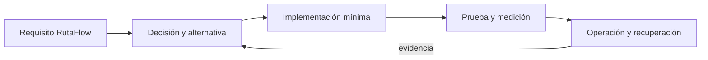

# Módulo 15: Flutter Master: calidad, arquitectura y despliegue

## Sílabo

**Objetivo general:** dominar las capacidades avanzadas señaladas en la auditoría del track mediante una ampliación ejecutable de RutaFlow, decisiones justificadas, pruebas, seguridad y evidencia operacional.

**Resultados observables:** explicar cada tecnología sin depender de marcas; implementar un incremento pequeño; comparar alternativas; provocar un fallo; medir el resultado; y escribir un runbook de recuperación.

**Evaluación:** 20 % fundamento, 35 % implementación, 25 % pruebas y fallos, 10 % seguridad, 10 % documentación y comunicación.

## Contenido teórico

### Tema 1: flutter test y WidgetTester

**Conceptos clave:** propósito, modelo de ejecución, configuración, seguridad, coste, pruebas y operación.

flutter test y WidgetTester se estudia como una decisión de ingeniería y no como una colección de comandos. Primero identifica el problema que resuelve y los límites de la plataforma; luego construye el incremento mínimo dentro de RutaFlow. Registra entradas, salidas, dependencias y condiciones de fallo. Compara al menos una alternativa y conserva la medición que justifica la elección. Si la tecnología es experimental, se aísla del camino estable y se documenta la estrategia de retirada.

En producción debes considerar configuración por ambiente, identidad de máquina y persona, secretos, compatibilidad, telemetría y recuperación. Una demostración exitosa no prueba comportamiento bajo concurrencia, reintentos, pérdida de red o datos inválidos. Por eso el laboratorio introduce un fallo deliberado y exige una prueba de regresión. El resultado debe poder repetirse desde terminal y CI sin pasos secretos del editor.

**Analogía:** es como incorporar una nueva estación a una red logística: no basta con construirla; hay que definir rutas, capacidad, controles, contingencias y cómo sabremos que funciona.

**¿Por qué es importante?** Porque flutter test y WidgetTester aparece cuando el sistema crece y las decisiones dejan de ser locales. Comprender su coste evita adoptar una herramienta por popularidad o descartarla por una primera experiencia incompleta.

**Casos de uso reales:** operación normal, configuración inválida, dependencia lenta, solicitud duplicada, cambio incompatible y recuperación posterior a un despliegue fallido.

**Diagrama:**

### Tema 2: pumpAndSettle, golden e integration tests

**Conceptos clave:** propósito, modelo de ejecución, configuración, seguridad, coste, pruebas y operación.

pumpAndSettle, golden e integration tests se estudia como una decisión de ingeniería y no como una colección de comandos. Primero identifica el problema que resuelve y los límites de la plataforma; luego construye el incremento mínimo dentro de RutaFlow. Registra entradas, salidas, dependencias y condiciones de fallo. Compara al menos una alternativa y conserva la medición que justifica la elección. Si la tecnología es experimental, se aísla del camino estable y se documenta la estrategia de retirada.

En producción debes considerar configuración por ambiente, identidad de máquina y persona, secretos, compatibilidad, telemetría y recuperación. Una demostración exitosa no prueba comportamiento bajo concurrencia, reintentos, pérdida de red o datos inválidos. Por eso el laboratorio introduce un fallo deliberado y exige una prueba de regresión. El resultado debe poder repetirse desde terminal y CI sin pasos secretos del editor.

**Analogía:** es como incorporar una nueva estación a una red logística: no basta con construirla; hay que definir rutas, capacidad, controles, contingencias y cómo sabremos que funciona.

**¿Por qué es importante?** Porque pumpAndSettle, golden e integration tests aparece cuando el sistema crece y las decisiones dejan de ser locales. Comprender su coste evita adoptar una herramienta por popularidad o descartarla por una primera experiencia incompleta.

**Casos de uso reales:** operación normal, configuración inválida, dependencia lenta, solicitud duplicada, cambio incompatible y recuperación posterior a un despliegue fallido.

**Diagrama:**

### Tema 3: Rendimiento, RepaintBoundary y Keys

**Conceptos clave:** propósito, modelo de ejecución, configuración, seguridad, coste, pruebas y operación.

Rendimiento, RepaintBoundary y Keys se estudia como una decisión de ingeniería y no como una colección de comandos. Primero identifica el problema que resuelve y los límites de la plataforma; luego construye el incremento mínimo dentro de RutaFlow. Registra entradas, salidas, dependencias y condiciones de fallo. Compara al menos una alternativa y conserva la medición que justifica la elección. Si la tecnología es experimental, se aísla del camino estable y se documenta la estrategia de retirada.

En producción debes considerar configuración por ambiente, identidad de máquina y persona, secretos, compatibilidad, telemetría y recuperación. Una demostración exitosa no prueba comportamiento bajo concurrencia, reintentos, pérdida de red o datos inválidos. Por eso el laboratorio introduce un fallo deliberado y exige una prueba de regresión. El resultado debe poder repetirse desde terminal y CI sin pasos secretos del editor.

**Analogía:** es como incorporar una nueva estación a una red logística: no basta con construirla; hay que definir rutas, capacidad, controles, contingencias y cómo sabremos que funciona.

**¿Por qué es importante?** Porque Rendimiento, RepaintBoundary y Keys aparece cuando el sistema crece y las decisiones dejan de ser locales. Comprender su coste evita adoptar una herramienta por popularidad o descartarla por una primera experiencia incompleta.

**Casos de uso reales:** operación normal, configuración inválida, dependencia lenta, solicitud duplicada, cambio incompatible y recuperación posterior a un despliegue fallido.

**Diagrama:**

### Tema 4: Clean Architecture

**Conceptos clave:** propósito, modelo de ejecución, configuración, seguridad, coste, pruebas y operación.

Clean Architecture se estudia como una decisión de ingeniería y no como una colección de comandos. Primero identifica el problema que resuelve y los límites de la plataforma; luego construye el incremento mínimo dentro de RutaFlow. Registra entradas, salidas, dependencias y condiciones de fallo. Compara al menos una alternativa y conserva la medición que justifica la elección. Si la tecnología es experimental, se aísla del camino estable y se documenta la estrategia de retirada.

En producción debes considerar configuración por ambiente, identidad de máquina y persona, secretos, compatibilidad, telemetría y recuperación. Una demostración exitosa no prueba comportamiento bajo concurrencia, reintentos, pérdida de red o datos inválidos. Por eso el laboratorio introduce un fallo deliberado y exige una prueba de regresión. El resultado debe poder repetirse desde terminal y CI sin pasos secretos del editor.

**Analogía:** es como incorporar una nueva estación a una red logística: no basta con construirla; hay que definir rutas, capacidad, controles, contingencias y cómo sabremos que funciona.

**¿Por qué es importante?** Porque Clean Architecture aparece cuando el sistema crece y las decisiones dejan de ser locales. Comprender su coste evita adoptar una herramienta por popularidad o descartarla por una primera experiencia incompleta.

**Casos de uso reales:** operación normal, configuración inválida, dependencia lenta, solicitud duplicada, cambio incompatible y recuperación posterior a un despliegue fallido.

**Diagrama:**

### Tema 5: Internacionalización completa

**Conceptos clave:** propósito, modelo de ejecución, configuración, seguridad, coste, pruebas y operación.

Internacionalización completa se estudia como una decisión de ingeniería y no como una colección de comandos. Primero identifica el problema que resuelve y los límites de la plataforma; luego construye el incremento mínimo dentro de RutaFlow. Registra entradas, salidas, dependencias y condiciones de fallo. Compara al menos una alternativa y conserva la medición que justifica la elección. Si la tecnología es experimental, se aísla del camino estable y se documenta la estrategia de retirada.

En producción debes considerar configuración por ambiente, identidad de máquina y persona, secretos, compatibilidad, telemetría y recuperación. Una demostración exitosa no prueba comportamiento bajo concurrencia, reintentos, pérdida de red o datos inválidos. Por eso el laboratorio introduce un fallo deliberado y exige una prueba de regresión. El resultado debe poder repetirse desde terminal y CI sin pasos secretos del editor.

**Analogía:** es como incorporar una nueva estación a una red logística: no basta con construirla; hay que definir rutas, capacidad, controles, contingencias y cómo sabremos que funciona.

**¿Por qué es importante?** Porque Internacionalización completa aparece cuando el sistema crece y las decisiones dejan de ser locales. Comprender su coste evita adoptar una herramienta por popularidad o descartarla por una primera experiencia incompleta.

**Casos de uso reales:** operación normal, configuración inválida, dependencia lenta, solicitud duplicada, cambio incompatible y recuperación posterior a un despliegue fallido.

**Diagrama:**

### Tema 6: Builds, firma y despliegue

**Conceptos clave:** propósito, modelo de ejecución, configuración, seguridad, coste, pruebas y operación.

Builds, firma y despliegue se estudia como una decisión de ingeniería y no como una colección de comandos. Primero identifica el problema que resuelve y los límites de la plataforma; luego construye el incremento mínimo dentro de RutaFlow. Registra entradas, salidas, dependencias y condiciones de fallo. Compara al menos una alternativa y conserva la medición que justifica la elección. Si la tecnología es experimental, se aísla del camino estable y se documenta la estrategia de retirada.

En producción debes considerar configuración por ambiente, identidad de máquina y persona, secretos, compatibilidad, telemetría y recuperación. Una demostración exitosa no prueba comportamiento bajo concurrencia, reintentos, pérdida de red o datos inválidos. Por eso el laboratorio introduce un fallo deliberado y exige una prueba de regresión. El resultado debe poder repetirse desde terminal y CI sin pasos secretos del editor.

**Analogía:** es como incorporar una nueva estación a una red logística: no basta con construirla; hay que definir rutas, capacidad, controles, contingencias y cómo sabremos que funciona.

**¿Por qué es importante?** Porque Builds, firma y despliegue aparece cuando el sistema crece y las decisiones dejan de ser locales. Comprender su coste evita adoptar una herramienta por popularidad o descartarla por una primera experiencia incompleta.

**Casos de uso reales:** operación normal, configuración inválida, dependencia lenta, solicitud duplicada, cambio incompatible y recuperación posterior a un despliegue fallido.

**Diagrama:**

## Trazabilidad de la auditoría original

- **Pruebas en Flutter**: cubierto mediante fundamento, laboratorio y evidencia del capítulo.
- **Rendimiento en Flutter**: cubierto mediante fundamento, laboratorio y evidencia del capítulo.
- **Clean Architecture**: cubierto mediante fundamento, laboratorio y evidencia del capítulo.
- **Internacionalización**: cubierto mediante fundamento, laboratorio y evidencia del capítulo.
- **Despliegue**: cubierto mediante fundamento, laboratorio y evidencia del capítulo.

## Criterio transversal de calidad del código

Usa nombres del dominio, errores tipados y límites claros. Escribe una prueba que exprese el comportamiento antes de corregir el defecto. SOLID se aplica cuando reduce el coste real de sustituir infraestructura o política; no abstraer antes de observar repetición con el mismo significado. Revisa nombres, cohesión, dependencias, errores, prueba, mínimo privilegio y capacidad de diagnóstico.

## Laboratorio práctico

Selecciona una vertical de RutaFlow —cotización, asignación, tracking, evidencia o liquidación— y crea una rama desde un estado verificable. Para cada tema agrega una capacidad pequeña, no una aplicación paralela. Mantén un diario con hipótesis, comando, resultado, métrica y decisión.

1. Define requisito, amenaza y atributo de calidad medible.
2. Construye la versión mínima con configuración reproducible.
3. Prueba camino feliz, entrada inválida y fallo de dependencia.
4. Ejecuta análisis de seguridad y registra datos sensibles tratados.
5. Mide latencia, coste, tamaño, accesibilidad o recuperación según corresponda.
6. Automatiza la comprobación en CI y documenta rollback.

La definición de terminado requiere código ejecutable, prueba automatizada, diagrama, ADR, enlace oficial con versión, medición antes/después y un procedimiento de limpieza. No se aceptan capturas sin comandos ni resultados imposibles de repetir.

## Ejercicios de evaluación

### Ejercicio 1: comparación profesional

Compara dos alternativas mediante cinco criterios: complejidad, seguridad, coste, portabilidad y operación. Elige una y escribe qué evidencia futura haría cambiar la decisión.

### Ejercicio 2: fallo deliberado

Interrumpe una dependencia o introduce configuración inválida. Conserva la prueba que reproduce el defecto, mejora el mensaje de error y verifica recuperación sin pérdida ni duplicación.

### Ejercicio 3: transferencia a RutaFlow

Integra tres temas del capítulo en una sola vertical. Dibuja las fronteras, identifica el dato sensible y demuestra observabilidad de extremo a extremo mediante correlation ID.

### Ejercicio 4: enseñar para demostrar dominio

Explica el tema más difícil en lenguaje cotidiano, presenta un ejemplo mínimo y responde cuándo no debería utilizarse. La explicación debe diferenciar hecho, estimación y opinión.

## Rúbrica del proyecto

| Criterio | Inicial | Competente | Master verificable |
|---|---|---|---|
| Fundamento | Enumera APIs | Explica propósito | Compara límites y alternativas |
| Implementación | Demo manual | Flujo reproducible | Integración cohesionada y recuperable |
| Calidad | Camino feliz | Pruebas y errores | Fallos, compatibilidad y regresión |
| Seguridad | Secretos locales | Mínimo privilegio | Threat model y evidencia negativa |
| Operación | Sin métricas | Telemetría básica | SLO, coste y runbook ensayado |

## Bibliografía y fundamento académico

- Documentación primaria enlazada en el capítulo de actualizaciones oficiales del track.
- ACM/IEEE CS2023 y SWEBOK V4 para fundamentos, diseño, pruebas, seguridad y operación.
- NIST Secure Software Development Framework y OWASP ASVS/MASVS.
- Martin Kleppmann, *Designing Data-Intensive Applications*.
- Google, *Site Reliability Engineering* y *SRE Workbook*.
- Documentación de accesibilidad W3C/WCAG cuando exista interfaz humana.

<!-- DEFINITIVE-COMPLEMENTS:START -->
## Complementos de la lista definitiva

Las siguientes capacidades no aparecían literalmente en el índice previo. Se incorporan con el mismo criterio del capítulo: fundamento, aplicación en RutaFlow, fallo deliberado y evidencia reproducible.

### Tema complementario: extends, implements, with

**Conceptos clave:** Herencia, interfaces, mixins, @override.

Este tema se incorpora de forma explícita porque no aparecía con el mismo nombre en el currículo visible. Estúdialo identificando propósito, entradas, salida observable, límites, amenaza y coste de operación. Construye un ejemplo mínimo conectado con RutaFlow y compara una alternativa antes de añadir una dependencia.

**Analogía:** es una pieza del sistema logístico que solo aporta valor cuando se conecta con un proceso, una responsabilidad y una señal verificable.

**¿Por qué es importante?** Porque reconocer `extends, implements, with` no demuestra dominio; debes aplicarlo, provocar un fallo y explicar cuándo no conviene utilizarlo.

**Casos de uso reales:** camino feliz, configuración inválida, dato tardío, acceso no autorizado y recuperación tras una dependencia indisponible.

**Práctica breve:** implementa una capacidad pequeña, escribe una prueba de éxito y otra de fallo, registra una métrica y documenta la decisión en un ADR.
### Tema complementario: async/await, Future, Stream

**Conceptos clave:** Programación asíncrona.

Este tema se incorpora de forma explícita porque no aparecía con el mismo nombre en el currículo visible. Estúdialo identificando propósito, entradas, salida observable, límites, amenaza y coste de operación. Construye un ejemplo mínimo conectado con RutaFlow y compara una alternativa antes de añadir una dependencia.

**Analogía:** es una pieza del sistema logístico que solo aporta valor cuando se conecta con un proceso, una responsabilidad y una señal verificable.

**¿Por qué es importante?** Porque reconocer `async/await, Future, Stream` no demuestra dominio; debes aplicarlo, provocar un fallo y explicar cuándo no conviene utilizarlo.

**Casos de uso reales:** camino feliz, configuración inválida, dato tardío, acceso no autorizado y recuperación tras una dependencia indisponible.

**Práctica breve:** implementa una capacidad pequeña, escribe una prueba de éxito y otra de fallo, registra una métrica y documenta la decisión en un ADR.
### Tema complementario: Componentes Básicos

**Conceptos clave:** Text, TextField, Button, Image, Icon, Checkbox, Radio, Slider.

Este tema se incorpora de forma explícita porque no aparecía con el mismo nombre en el currículo visible. Estúdialo identificando propósito, entradas, salida observable, límites, amenaza y coste de operación. Construye un ejemplo mínimo conectado con RutaFlow y compara una alternativa antes de añadir una dependencia.

**Analogía:** es una pieza del sistema logístico que solo aporta valor cuando se conecta con un proceso, una responsabilidad y una señal verificable.

**¿Por qué es importante?** Porque reconocer `Componentes Básicos` no demuestra dominio; debes aplicarlo, provocar un fallo y explicar cuándo no conviene utilizarlo.

**Casos de uso reales:** camino feliz, configuración inválida, dato tardío, acceso no autorizado y recuperación tras una dependencia indisponible.

**Práctica breve:** implementa una capacidad pequeña, escribe una prueba de éxito y otra de fallo, registra una métrica y documenta la decisión en un ADR.
### Tema complementario: State Management

**Conceptos clave:** Provider, Riverpod, BLoC, GetX.

Este tema se incorpora de forma explícita porque no aparecía con el mismo nombre en el currículo visible. Estúdialo identificando propósito, entradas, salida observable, límites, amenaza y coste de operación. Construye un ejemplo mínimo conectado con RutaFlow y compara una alternativa antes de añadir una dependencia.

**Analogía:** es una pieza del sistema logístico que solo aporta valor cuando se conecta con un proceso, una responsabilidad y una señal verificable.

**¿Por qué es importante?** Porque reconocer `State Management` no demuestra dominio; debes aplicarlo, provocar un fallo y explicar cuándo no conviene utilizarlo.

**Casos de uso reales:** camino feliz, configuración inválida, dato tardío, acceso no autorizado y recuperación tras una dependencia indisponible.

**Práctica breve:** implementa una capacidad pequeña, escribe una prueba de éxito y otra de fallo, registra una métrica y documenta la decisión en un ADR.
### Tema complementario: Internationalization

**Conceptos clave:** intl, flutter_localizations, LocalizationsDelegate.

Este tema se incorpora de forma explícita porque no aparecía con el mismo nombre en el currículo visible. Estúdialo identificando propósito, entradas, salida observable, límites, amenaza y coste de operación. Construye un ejemplo mínimo conectado con RutaFlow y compara una alternativa antes de añadir una dependencia.

**Analogía:** es una pieza del sistema logístico que solo aporta valor cuando se conecta con un proceso, una responsabilidad y una señal verificable.

**¿Por qué es importante?** Porque reconocer `Internationalization` no demuestra dominio; debes aplicarlo, provocar un fallo y explicar cuándo no conviene utilizarlo.

**Casos de uso reales:** camino feliz, configuración inválida, dato tardío, acceso no autorizado y recuperación tras una dependencia indisponible.

**Práctica breve:** implementa una capacidad pequeña, escribe una prueba de éxito y otra de fallo, registra una métrica y documenta la decisión en un ADR.
### Tema complementario: Isolates y presupuesto de frames

**Conceptos clave:** trabajo CPU-bound, jank y medición.

Este tema se incorpora de forma explícita porque no aparecía con el mismo nombre en el currículo visible. Estúdialo identificando propósito, entradas, salida observable, límites, amenaza y coste de operación. Construye un ejemplo mínimo conectado con RutaFlow y compara una alternativa antes de añadir una dependencia.

**Analogía:** es una pieza del sistema logístico que solo aporta valor cuando se conecta con un proceso, una responsabilidad y una señal verificable.

**¿Por qué es importante?** Porque reconocer `Isolates y presupuesto de frames` no demuestra dominio; debes aplicarlo, provocar un fallo y explicar cuándo no conviene utilizarlo.

**Casos de uso reales:** camino feliz, configuración inválida, dato tardío, acceso no autorizado y recuperación tras una dependencia indisponible.

**Práctica breve:** implementa una capacidad pequeña, escribe una prueba de éxito y otra de fallo, registra una métrica y documenta la decisión en un ADR.
### Tema complementario: Seguridad de plugins

**Conceptos clave:** permisos, platform channels y supply chain.

Este tema se incorpora de forma explícita porque no aparecía con el mismo nombre en el currículo visible. Estúdialo identificando propósito, entradas, salida observable, límites, amenaza y coste de operación. Construye un ejemplo mínimo conectado con RutaFlow y compara una alternativa antes de añadir una dependencia.

**Analogía:** es una pieza del sistema logístico que solo aporta valor cuando se conecta con un proceso, una responsabilidad y una señal verificable.

**¿Por qué es importante?** Porque reconocer `Seguridad de plugins` no demuestra dominio; debes aplicarlo, provocar un fallo y explicar cuándo no conviene utilizarlo.

**Casos de uso reales:** camino feliz, configuración inválida, dato tardío, acceso no autorizado y recuperación tras una dependencia indisponible.

**Práctica breve:** implementa una capacidad pequeña, escribe una prueba de éxito y otra de fallo, registra una métrica y documenta la decisión en un ADR.
### Tema complementario: Offline-first resiliente

**Conceptos clave:** outbox, conflictos, reintentos e idempotencia.

Este tema se incorpora de forma explícita porque no aparecía con el mismo nombre en el currículo visible. Estúdialo identificando propósito, entradas, salida observable, límites, amenaza y coste de operación. Construye un ejemplo mínimo conectado con RutaFlow y compara una alternativa antes de añadir una dependencia.

**Analogía:** es una pieza del sistema logístico que solo aporta valor cuando se conecta con un proceso, una responsabilidad y una señal verificable.

**¿Por qué es importante?** Porque reconocer `Offline-first resiliente` no demuestra dominio; debes aplicarlo, provocar un fallo y explicar cuándo no conviene utilizarlo.

**Casos de uso reales:** camino feliz, configuración inválida, dato tardío, acceso no autorizado y recuperación tras una dependencia indisponible.

**Práctica breve:** implementa una capacidad pequeña, escribe una prueba de éxito y otra de fallo, registra una métrica y documenta la decisión en un ADR.

<!-- DEFINITIVE-COMPLEMENTS:END -->

<!-- SUPPLEMENTAL-COMPLEMENTS:START -->
## Ampliación académica suplementaria

Esta sección incorpora los elementos de la nueva auditoría que no aparecían literalmente en el currículo. Cada uno se conecta con fundamento, práctica y evidencia.

### Tema suplementario: Arquitecturas de aplicaciones móviles

**Conceptos clave:** Mobile app architectures.

La fuente académica señalada es **MCC**. Este tema se estudia identificando el problema, sus prerrequisitos, un modelo mínimo, un experimento y las limitaciones de la evidencia. En RutaFlow se conecta con una decisión concreta de producto, datos, plataforma u operación, evitando agregar tecnología sin necesidad verificable.

**Analogía:** es una asignatura dentro de un programa universitario: aporta una perspectiva específica y necesita conectarse con las demás para formar criterio profesional.

**¿Por qué es importante?** Porque Arquitecturas de aplicaciones móviles amplía el mapa mental y permite comprender decisiones que una guía centrada únicamente en frameworks no explica.

**Casos de uso reales:** diseño inicial, restricción de recursos, entrada inválida, fallo parcial, impacto humano y revisión posterior mediante métricas.

**Práctica breve:** construye un ejemplo pequeño, formula una hipótesis, mide el resultado, registra una amenaza o sesgo y explica qué conocimiento adicional necesitarías para usarlo en producción.
### Tema suplementario: Características de arquitecturas híbridas

**Conceptos clave:** Hybrid architectures.

La fuente académica señalada es **MCC**. Este tema se estudia identificando el problema, sus prerrequisitos, un modelo mínimo, un experimento y las limitaciones de la evidencia. En RutaFlow se conecta con una decisión concreta de producto, datos, plataforma u operación, evitando agregar tecnología sin necesidad verificable.

**Analogía:** es una asignatura dentro de un programa universitario: aporta una perspectiva específica y necesita conectarse con las demás para formar criterio profesional.

**¿Por qué es importante?** Porque Características de arquitecturas híbridas amplía el mapa mental y permite comprender decisiones que una guía centrada únicamente en frameworks no explica.

**Casos de uso reales:** diseño inicial, restricción de recursos, entrada inválida, fallo parcial, impacto humano y revisión posterior mediante métricas.

**Práctica breve:** construye un ejemplo pequeño, formula una hipótesis, mide el resultado, registra una amenaza o sesgo y explica qué conocimiento adicional necesitarías para usarlo en producción.
### Tema suplementario: Características específicas de Flutter

**Conceptos clave:** Flutter-specific features.

La fuente académica señalada es **MCC**. Este tema se estudia identificando el problema, sus prerrequisitos, un modelo mínimo, un experimento y las limitaciones de la evidencia. En RutaFlow se conecta con una decisión concreta de producto, datos, plataforma u operación, evitando agregar tecnología sin necesidad verificable.

**Analogía:** es una asignatura dentro de un programa universitario: aporta una perspectiva específica y necesita conectarse con las demás para formar criterio profesional.

**¿Por qué es importante?** Porque Características específicas de Flutter amplía el mapa mental y permite comprender decisiones que una guía centrada únicamente en frameworks no explica.

**Casos de uso reales:** diseño inicial, restricción de recursos, entrada inválida, fallo parcial, impacto humano y revisión posterior mediante métricas.

**Práctica breve:** construye un ejemplo pequeño, formula una hipótesis, mide el resultado, registra una amenaza o sesgo y explica qué conocimiento adicional necesitarías para usarlo en producción.
### Tema suplementario: Estructura de proyectos Flutter

**Conceptos clave:** Flutter project structure.

La fuente académica señalada es **MCC**. Este tema se estudia identificando el problema, sus prerrequisitos, un modelo mínimo, un experimento y las limitaciones de la evidencia. En RutaFlow se conecta con una decisión concreta de producto, datos, plataforma u operación, evitando agregar tecnología sin necesidad verificable.

**Analogía:** es una asignatura dentro de un programa universitario: aporta una perspectiva específica y necesita conectarse con las demás para formar criterio profesional.

**¿Por qué es importante?** Porque Estructura de proyectos Flutter amplía el mapa mental y permite comprender decisiones que una guía centrada únicamente en frameworks no explica.

**Casos de uso reales:** diseño inicial, restricción de recursos, entrada inválida, fallo parcial, impacto humano y revisión posterior mediante métricas.

**Práctica breve:** construye un ejemplo pequeño, formula una hipótesis, mide el resultado, registra una amenaza o sesgo y explica qué conocimiento adicional necesitarías para usarlo en producción.
### Tema suplementario: Programación orientada a objetos en Dart

**Conceptos clave:** OOP en Dart.

La fuente académica señalada es **MCC**. Este tema se estudia identificando el problema, sus prerrequisitos, un modelo mínimo, un experimento y las limitaciones de la evidencia. En RutaFlow se conecta con una decisión concreta de producto, datos, plataforma u operación, evitando agregar tecnología sin necesidad verificable.

**Analogía:** es una asignatura dentro de un programa universitario: aporta una perspectiva específica y necesita conectarse con las demás para formar criterio profesional.

**¿Por qué es importante?** Porque Programación orientada a objetos en Dart amplía el mapa mental y permite comprender decisiones que una guía centrada únicamente en frameworks no explica.

**Casos de uso reales:** diseño inicial, restricción de recursos, entrada inválida, fallo parcial, impacto humano y revisión posterior mediante métricas.

**Práctica breve:** construye un ejemplo pequeño, formula una hipótesis, mide el resultado, registra una amenaza o sesgo y explica qué conocimiento adicional necesitarías para usarlo en producción.
### Tema suplementario: Escenarios de aplicación

**Conceptos clave:** Application scenarios.

La fuente académica señalada es **NUM**. Este tema se estudia identificando el problema, sus prerrequisitos, un modelo mínimo, un experimento y las limitaciones de la evidencia. En RutaFlow se conecta con una decisión concreta de producto, datos, plataforma u operación, evitando agregar tecnología sin necesidad verificable.

**Analogía:** es una asignatura dentro de un programa universitario: aporta una perspectiva específica y necesita conectarse con las demás para formar criterio profesional.

**¿Por qué es importante?** Porque Escenarios de aplicación amplía el mapa mental y permite comprender decisiones que una guía centrada únicamente en frameworks no explica.

**Casos de uso reales:** diseño inicial, restricción de recursos, entrada inválida, fallo parcial, impacto humano y revisión posterior mediante métricas.

**Práctica breve:** construye un ejemplo pequeño, formula una hipótesis, mide el resultado, registra una amenaza o sesgo y explica qué conocimiento adicional necesitarías para usarlo en producción.
### Tema suplementario: Uso de widgets

**Conceptos clave:** Widgets.

La fuente académica señalada es **NUM**. Este tema se estudia identificando el problema, sus prerrequisitos, un modelo mínimo, un experimento y las limitaciones de la evidencia. En RutaFlow se conecta con una decisión concreta de producto, datos, plataforma u operación, evitando agregar tecnología sin necesidad verificable.

**Analogía:** es una asignatura dentro de un programa universitario: aporta una perspectiva específica y necesita conectarse con las demás para formar criterio profesional.

**¿Por qué es importante?** Porque Uso de widgets amplía el mapa mental y permite comprender decisiones que una guía centrada únicamente en frameworks no explica.

**Casos de uso reales:** diseño inicial, restricción de recursos, entrada inválida, fallo parcial, impacto humano y revisión posterior mediante métricas.

**Práctica breve:** construye un ejemplo pequeño, formula una hipótesis, mide el resultado, registra una amenaza o sesgo y explica qué conocimiento adicional necesitarías para usarlo en producción.
### Tema suplementario: Navegación por pestañas

**Conceptos clave:** Tab navigation.

La fuente académica señalada es **NUM**. Este tema se estudia identificando el problema, sus prerrequisitos, un modelo mínimo, un experimento y las limitaciones de la evidencia. En RutaFlow se conecta con una decisión concreta de producto, datos, plataforma u operación, evitando agregar tecnología sin necesidad verificable.

**Analogía:** es una asignatura dentro de un programa universitario: aporta una perspectiva específica y necesita conectarse con las demás para formar criterio profesional.

**¿Por qué es importante?** Porque Navegación por pestañas amplía el mapa mental y permite comprender decisiones que una guía centrada únicamente en frameworks no explica.

**Casos de uso reales:** diseño inicial, restricción de recursos, entrada inválida, fallo parcial, impacto humano y revisión posterior mediante métricas.

**Práctica breve:** construye un ejemplo pequeño, formula una hipótesis, mide el resultado, registra una amenaza o sesgo y explica qué conocimiento adicional necesitarías para usarlo en producción.
### Tema suplementario: Cajones laterales

**Conceptos clave:** Side drawers.

La fuente académica señalada es **NUM**. Este tema se estudia identificando el problema, sus prerrequisitos, un modelo mínimo, un experimento y las limitaciones de la evidencia. En RutaFlow se conecta con una decisión concreta de producto, datos, plataforma u operación, evitando agregar tecnología sin necesidad verificable.

**Analogía:** es una asignatura dentro de un programa universitario: aporta una perspectiva específica y necesita conectarse con las demás para formar criterio profesional.

**¿Por qué es importante?** Porque Cajones laterales amplía el mapa mental y permite comprender decisiones que una guía centrada únicamente en frameworks no explica.

**Casos de uso reales:** diseño inicial, restricción de recursos, entrada inválida, fallo parcial, impacto humano y revisión posterior mediante métricas.

**Práctica breve:** construye un ejemplo pequeño, formula una hipótesis, mide el resultado, registra una amenaza o sesgo y explica qué conocimiento adicional necesitarías para usarlo en producción.
### Tema suplementario: Navegación basada en pila

**Conceptos clave:** Stack-based navigation.

La fuente académica señalada es **NUM**. Este tema se estudia identificando el problema, sus prerrequisitos, un modelo mínimo, un experimento y las limitaciones de la evidencia. En RutaFlow se conecta con una decisión concreta de producto, datos, plataforma u operación, evitando agregar tecnología sin necesidad verificable.

**Analogía:** es una asignatura dentro de un programa universitario: aporta una perspectiva específica y necesita conectarse con las demás para formar criterio profesional.

**¿Por qué es importante?** Porque Navegación basada en pila amplía el mapa mental y permite comprender decisiones que una guía centrada únicamente en frameworks no explica.

**Casos de uso reales:** diseño inicial, restricción de recursos, entrada inválida, fallo parcial, impacto humano y revisión posterior mediante métricas.

**Práctica breve:** construye un ejemplo pequeño, formula una hipótesis, mide el resultado, registra una amenaza o sesgo y explica qué conocimiento adicional necesitarías para usarlo en producción.
### Tema suplementario: Diseño de UI

**Conceptos clave:** UI design.

La fuente académica señalada es **Beder University**. Este tema se estudia identificando el problema, sus prerrequisitos, un modelo mínimo, un experimento y las limitaciones de la evidencia. En RutaFlow se conecta con una decisión concreta de producto, datos, plataforma u operación, evitando agregar tecnología sin necesidad verificable.

**Analogía:** es una asignatura dentro de un programa universitario: aporta una perspectiva específica y necesita conectarse con las demás para formar criterio profesional.

**¿Por qué es importante?** Porque Diseño de UI amplía el mapa mental y permite comprender decisiones que una guía centrada únicamente en frameworks no explica.

**Casos de uso reales:** diseño inicial, restricción de recursos, entrada inválida, fallo parcial, impacto humano y revisión posterior mediante métricas.

**Práctica breve:** construye un ejemplo pequeño, formula una hipótesis, mide el resultado, registra una amenaza o sesgo y explica qué conocimiento adicional necesitarías para usarlo en producción.
### Tema suplementario: Gestión de estado avanzada

**Conceptos clave:** Advanced state management.

La fuente académica señalada es **Bursa Uludağ University**. Este tema se estudia identificando el problema, sus prerrequisitos, un modelo mínimo, un experimento y las limitaciones de la evidencia. En RutaFlow se conecta con una decisión concreta de producto, datos, plataforma u operación, evitando agregar tecnología sin necesidad verificable.

**Analogía:** es una asignatura dentro de un programa universitario: aporta una perspectiva específica y necesita conectarse con las demás para formar criterio profesional.

**¿Por qué es importante?** Porque Gestión de estado avanzada amplía el mapa mental y permite comprender decisiones que una guía centrada únicamente en frameworks no explica.

**Casos de uso reales:** diseño inicial, restricción de recursos, entrada inválida, fallo parcial, impacto humano y revisión posterior mediante métricas.

**Práctica breve:** construye un ejemplo pequeño, formula una hipótesis, mide el resultado, registra una amenaza o sesgo y explica qué conocimiento adicional necesitarías para usarlo en producción.
### Tema suplementario: Procesamiento y validación de entrada

**Conceptos clave:** Input processing/validation.

La fuente académica señalada es **Bursa Uludağ University**. Este tema se estudia identificando el problema, sus prerrequisitos, un modelo mínimo, un experimento y las limitaciones de la evidencia. En RutaFlow se conecta con una decisión concreta de producto, datos, plataforma u operación, evitando agregar tecnología sin necesidad verificable.

**Analogía:** es una asignatura dentro de un programa universitario: aporta una perspectiva específica y necesita conectarse con las demás para formar criterio profesional.

**¿Por qué es importante?** Porque Procesamiento y validación de entrada amplía el mapa mental y permite comprender decisiones que una guía centrada únicamente en frameworks no explica.

**Casos de uso reales:** diseño inicial, restricción de recursos, entrada inválida, fallo parcial, impacto humano y revisión posterior mediante métricas.

**Práctica breve:** construye un ejemplo pequeño, formula una hipótesis, mide el resultado, registra una amenaza o sesgo y explica qué conocimiento adicional necesitarías para usarlo en producción.
### Tema suplementario: Conexión a servidores backend

**Conceptos clave:** HTTP requests.

La fuente académica señalada es **Bursa Uludağ University**. Este tema se estudia identificando el problema, sus prerrequisitos, un modelo mínimo, un experimento y las limitaciones de la evidencia. En RutaFlow se conecta con una decisión concreta de producto, datos, plataforma u operación, evitando agregar tecnología sin necesidad verificable.

**Analogía:** es una asignatura dentro de un programa universitario: aporta una perspectiva específica y necesita conectarse con las demás para formar criterio profesional.

**¿Por qué es importante?** Porque Conexión a servidores backend amplía el mapa mental y permite comprender decisiones que una guía centrada únicamente en frameworks no explica.

**Casos de uso reales:** diseño inicial, restricción de recursos, entrada inválida, fallo parcial, impacto humano y revisión posterior mediante métricas.

**Práctica breve:** construye un ejemplo pequeño, formula una hipótesis, mide el resultado, registra una amenaza o sesgo y explica qué conocimiento adicional necesitarías para usarlo en producción.
### Tema suplementario: Transiciones de páginas

**Conceptos clave:** Page transitions.

La fuente académica señalada es **Bursa Uludağ University**. Este tema se estudia identificando el problema, sus prerrequisitos, un modelo mínimo, un experimento y las limitaciones de la evidencia. En RutaFlow se conecta con una decisión concreta de producto, datos, plataforma u operación, evitando agregar tecnología sin necesidad verificable.

**Analogía:** es una asignatura dentro de un programa universitario: aporta una perspectiva específica y necesita conectarse con las demás para formar criterio profesional.

**¿Por qué es importante?** Porque Transiciones de páginas amplía el mapa mental y permite comprender decisiones que una guía centrada únicamente en frameworks no explica.

**Casos de uso reales:** diseño inicial, restricción de recursos, entrada inválida, fallo parcial, impacto humano y revisión posterior mediante métricas.

**Práctica breve:** construye un ejemplo pequeño, formula una hipótesis, mide el resultado, registra una amenaza o sesgo y explica qué conocimiento adicional necesitarías para usarlo en producción.
### Tema suplementario: Directrices de Material Design

**Conceptos clave:** Material Design.

La fuente académica señalada es **UniUrb**. Este tema se estudia identificando el problema, sus prerrequisitos, un modelo mínimo, un experimento y las limitaciones de la evidencia. En RutaFlow se conecta con una decisión concreta de producto, datos, plataforma u operación, evitando agregar tecnología sin necesidad verificable.

**Analogía:** es una asignatura dentro de un programa universitario: aporta una perspectiva específica y necesita conectarse con las demás para formar criterio profesional.

**¿Por qué es importante?** Porque Directrices de Material Design amplía el mapa mental y permite comprender decisiones que una guía centrada únicamente en frameworks no explica.

**Casos de uso reales:** diseño inicial, restricción de recursos, entrada inválida, fallo parcial, impacto humano y revisión posterior mediante métricas.

**Práctica breve:** construye un ejemplo pequeño, formula una hipótesis, mide el resultado, registra una amenaza o sesgo y explica qué conocimiento adicional necesitarías para usarlo en producción.
### Tema suplementario: Comunicación y persistencia de datos

**Conceptos clave:** Data communication/persistence.

La fuente académica señalada es **UniUrb**. Este tema se estudia identificando el problema, sus prerrequisitos, un modelo mínimo, un experimento y las limitaciones de la evidencia. En RutaFlow se conecta con una decisión concreta de producto, datos, plataforma u operación, evitando agregar tecnología sin necesidad verificable.

**Analogía:** es una asignatura dentro de un programa universitario: aporta una perspectiva específica y necesita conectarse con las demás para formar criterio profesional.

**¿Por qué es importante?** Porque Comunicación y persistencia de datos amplía el mapa mental y permite comprender decisiones que una guía centrada únicamente en frameworks no explica.

**Casos de uso reales:** diseño inicial, restricción de recursos, entrada inválida, fallo parcial, impacto humano y revisión posterior mediante métricas.

**Práctica breve:** construye un ejemplo pequeño, formula una hipótesis, mide el resultado, registra una amenaza o sesgo y explica qué conocimiento adicional necesitarías para usarlo en producción.
### Tema suplementario: Creación de formularios

**Conceptos clave:** Form creation.

La fuente académica señalada es **CU BPP264**. Este tema se estudia identificando el problema, sus prerrequisitos, un modelo mínimo, un experimento y las limitaciones de la evidencia. En RutaFlow se conecta con una decisión concreta de producto, datos, plataforma u operación, evitando agregar tecnología sin necesidad verificable.

**Analogía:** es una asignatura dentro de un programa universitario: aporta una perspectiva específica y necesita conectarse con las demás para formar criterio profesional.

**¿Por qué es importante?** Porque Creación de formularios amplía el mapa mental y permite comprender decisiones que una guía centrada únicamente en frameworks no explica.

**Casos de uso reales:** diseño inicial, restricción de recursos, entrada inválida, fallo parcial, impacto humano y revisión posterior mediante métricas.

**Práctica breve:** construye un ejemplo pequeño, formula una hipótesis, mide el resultado, registra una amenaza o sesgo y explica qué conocimiento adicional necesitarías para usarlo en producción.
### Tema suplementario: Validación y procesamiento de datos

**Conceptos clave:** Data validation/processing.

La fuente académica señalada es **CU BPP264**. Este tema se estudia identificando el problema, sus prerrequisitos, un modelo mínimo, un experimento y las limitaciones de la evidencia. En RutaFlow se conecta con una decisión concreta de producto, datos, plataforma u operación, evitando agregar tecnología sin necesidad verificable.

**Analogía:** es una asignatura dentro de un programa universitario: aporta una perspectiva específica y necesita conectarse con las demás para formar criterio profesional.

**¿Por qué es importante?** Porque Validación y procesamiento de datos amplía el mapa mental y permite comprender decisiones que una guía centrada únicamente en frameworks no explica.

**Casos de uso reales:** diseño inicial, restricción de recursos, entrada inválida, fallo parcial, impacto humano y revisión posterior mediante métricas.

**Práctica breve:** construye un ejemplo pequeño, formula una hipótesis, mide el resultado, registra una amenaza o sesgo y explica qué conocimiento adicional necesitarías para usarlo en producción.

<!-- SUPPLEMENTAL-COMPLEMENTS:END -->

## Resumen del módulo

Este capítulo vuelve visibles las capacidades solicitadas y las convierte en trabajo evaluable. Completarlo significa poder explicar, implementar, romper, medir y operar una solución; reconocer el nombre de una herramienta no demuestra nivel Master. La evidencia final conecta el track con RutaFlow y conserva decisiones, pruebas y recuperación para que otra persona pueda revisarlas.
