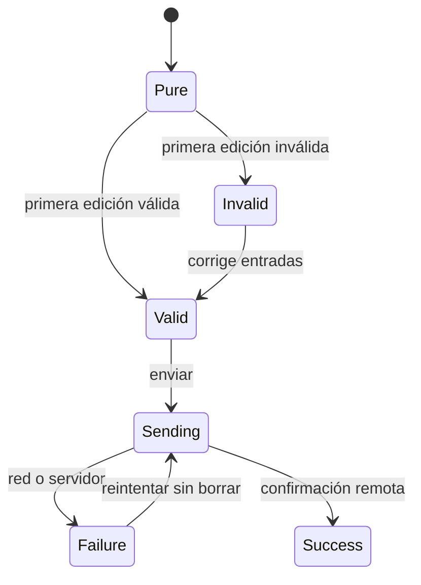

# Módulo 4: Gestión de estado

## Sílabo

**Objetivo general**

Entender que Flutter no impone una única solución de gestión de estado, aprendiendo cuándo `setState` es suficiente, cuándo Riverpod ofrece el balance correcto entre simplicidad y robustez verificada en compilación, y cuándo Bloc/Cubit aporta la estructura explícita basada en eventos que equipos grandes valoran.

**Objetivos específicos**

1. Implementar una feature simple con `setState` y documentar sus límites al crecer.
2. Reimplementar la misma feature con Riverpod.
3. Consumir ese estado desde 2 widgets distintos sin pasarlo manualmente.
4. Reimplementar la misma feature con Bloc/Cubit y comparar la ceremonia.
5. Documentar un criterio propio de elección entre los tres enfoques.
6. Modelar un formulario complejo con entradas inmutables, validación progresiva y envío sin duplicados.

**Contenido**

- `setState`: cuándo es suficiente.
- Provider: inyección y notificación simples.
- Riverpod: providers seguros en tiempo de compilación.
- Bloc/Cubit: estado predecible basado en eventos.
- GetX como alternativa todo-en-uno.
- `get_it` e `injectable` para inyección de dependencias.
- Formularios con Formz, Riverpod y estados de envío explícitos.

**Evaluación**

Feature completa implementada con Riverpod (o Bloc), formulario validado y cuatro ejercicios de evaluación.

---

## Contenido teórico

### Tema 1: setState y sus límites

**Conceptos clave:** suficiente para estado local, incómodo para estado compartido entre widgets distantes.

`setState()` (Módulo 1) es suficiente y apropiado cuando el estado pertenece exclusivamente a un único widget y su subárbol inmediato de hijos, sin necesidad de que ningún otro widget distante en el árbol lea o reaccione a ese mismo estado; se vuelve incómodo y progresivamente más difícil de mantener cuando varios widgets distantes entre sí (que no comparten una relación directa de padre-hijo cercana) necesitan compartir y reaccionar al mismo estado, dado que la única forma de compartir ese estado con `setState` puro sería elevarlo hasta un ancestro común suficientemente alto en el árbol y pasarlo manualmente hacia abajo a través de cada nivel intermedio, un patrón de "prop drilling" tedioso y frágil que se agrava cuanto más distantes están los widgets que necesitan el mismo estado compartido.

Este es exactamente el mismo problema fundamental de gestión de estado compartido estudiado en cada ecosistema de UI declarativa: `@State` local vs Context API en React (Módulo 5 del track de React), `remember` local vs un store de signals en Angular (Módulo 4 del track de Angular), y `@State` local vs `@Environment` en SwiftUI (Módulo 2 del track de iOS), todos resolviendo la misma tensión entre simplicidad de estado local y necesidad de compartir estado entre partes distantes de un árbol de UI.

**Analogía:** `setState` para estado puramente local es como llevar notas personales en el propio bolsillo, perfectamente eficiente mientras solo uno mismo las necesita consultar; cuando varias personas distantes entre sí necesitan consultar y modificar la misma nota, mantener copias manuales sincronizadas en cada bolsillo individual se vuelve rápidamente insostenible, requiriendo en cambio un tablero compartido accesible por todos sin necesidad de copias manuales dispersas.

**¿Por qué es importante?** `setState` es suficiente para estado puramente local a un widget y su subárbol cercano, pero se vuelve incómodo cuando widgets distantes necesitan compartir el mismo estado, requiriendo una solución de gestión de estado más robusta como Riverpod o Bloc.

**Diagrama:**

```
setState()  → apropiado: estado local a un widget y su subárbol cercano
setState()  → incómodo: estado compartido entre widgets distantes (requiere prop drilling manual)
```

### Tema 2: Riverpod

**Conceptos clave:** verificación de providers en tiempo de compilación, no dependiente del árbol de widgets en runtime.

```dart
final contadorProvider = StateProvider<int>((ref) => 0);

class PantallaContador extends ConsumerWidget {
  Widget build(BuildContext context, WidgetRef ref) {
    final contador = ref.watch(contadorProvider);
    return ElevatedButton(
      onPressed: () => ref.read(contadorProvider.notifier).state++,
      child: Text("$contador"),
    );
  }
}
```

Riverpod (evolución de Provider, el paquete de gestión de estado más antiguo del ecosistema Flutter) declara providers como objetos globales independientes del árbol de widgets, verificados en tiempo de **compilación**: intentar leer un provider que no existe o que tiene un tipo incorrecto produce un error de compilación inmediato, a diferencia de Provider (el paquete anterior), donde un provider se busca en runtime recorriendo el árbol de widgets hacia arriba (`context.watch<T>()`), de modo que un error de "provider no encontrado" (porque el widget que lo provee no está en el ancestro esperado en el árbol) solo se manifiesta como una excepción en tiempo de ejecución, potencialmente descubierta tarde durante pruebas manuales o incluso en producción.

`ref.watch(contadorProvider)` suscribe el widget a reconstruirse cuando ese provider cambia; `ref.read(contadorProvider.notifier).state++` modifica el estado sin suscribirse a cambios (apropiado dentro de callbacks de eventos, donde no se necesita observar el propio cambio que se está provocando). Consumir el mismo provider desde dos widgets distintos y distantes entre sí simplemente requiere que ambos llamen `ref.watch(contadorProvider)`, sin ningún prop drilling manual entre ellos, resolviendo directamente el problema descrito en el Tema 1.

**Analogía:** Riverpod es como un directorio centralizado de servicios verificado formalmente antes de la apertura de un edificio, donde cualquier intento de referenciar un servicio inexistente se detecta durante la inspección previa (compilación), en vez de descubrirse recién cuando alguien intenta usar ese servicio en el día a día de operación del edificio ya abierto al público (runtime).

**¿Por qué es importante?** Riverpod verifica providers en tiempo de compilación, detectando errores de "provider no encontrado" antes de ejecutar la app, a diferencia de Provider, que depende del árbol de widgets en runtime y descubre esos errores solo al ejecutar el código afectado.

**Código del ejemplo:**

```dart
final contadorProvider = StateProvider<int>((ref) => 0);
// Verificado en COMPILACIÓN, independiente de dónde esté ubicado en el árbol de widgets
```

### Tema 3: Bloc/Cubit y otras alternativas

**Conceptos clave:** separación explícita entre evento y cambio de estado resultante.

```dart
class ContadorCubit extends Cubit<int> {
  ContadorCubit() : super(0);
  void incrementar() => emit(state + 1);
}

BlocBuilder<ContadorCubit, int>(
  builder: (context, contador) => Text("$contador"),
)
```

Bloc/Cubit fuerza una separación explícita y estructurada entre "qué pasó" (una llamada a un método como `incrementar()`, o en el patrón Bloc completo, un evento explícito modelado como su propio tipo) y "cómo cambia el estado en respuesta" (`emit(state + 1)`), un patrón considerablemente más predecible y fácil de testear de forma aislada que mutaciones de estado dispersas directamente en callbacks de UI, a cambio de más ceremonia (más código boilerplate) que Riverpod para casos simples como un contador; esta estructura explícita es especialmente valorada en equipos grandes donde la previsibilidad y testeabilidad exhaustiva del flujo de eventos justifica el costo adicional de ceremonia, un patrón conceptualmente similar al de Redux (estudiado en el Módulo 8 del track de React) o a NgRx (mencionado en el Módulo 4 del track de Angular).

GetX ofrece un enfoque "todo-en-uno" que combina gestión de estado, inyección de dependencias y navegación en un único paquete con una API más ligera, apreciado por su simplicidad inicial pero criticado por algunos equipos por acoplar demasiadas responsabilidades distintas en una única herramienta; `get_it` (un simple service locator) e `injectable` (generación de código para configurar `get_it` automáticamente a partir de anotaciones) son alternativas de inyección de dependencias más ligeras y menos opinionadas que el sistema de providers de Riverpod, apropiadas cuando se prefiere una solución de DI más simple sin adoptar todo el ecosistema de gestión de estado de Riverpod.

**Analogía:** Bloc/Cubit es como un protocolo formal de solicitud de cambios en una organización burocrática (cada cambio requiere una solicitud explícita documentada y una respuesta correspondiente), más lento de operar para cambios triviales pero extremadamente auditable y predecible para cambios complejos en organizaciones grandes; GetX es como una caja de herramientas multiuso conveniente pero menos especializada que herramientas dedicadas a cada tarea individual.

**¿Por qué es importante?** Bloc/Cubit aporta un modelo de eventos predecible y fácil de testear para apps con lógica de negocio compleja, a cambio de más ceremonia que Riverpod; elegir entre `setState`, Riverpod y Bloc depende del tamaño del equipo y la complejidad del estado compartido de la app.

**Diagrama:**

```
setState  → estado puramente local
Riverpod  → balance simplicidad/robustez, mayoría de apps
Bloc      → equipos grandes, estructura explícita basada en eventos
```

### Tema 4: Formularios profesionales con Formz y Riverpod

**Conceptos clave:** valor `pure`/`dirty`, validación determinista, estado inmutable, feedback progresivo, envío único y error de servidor.

Construiremos el formulario «No fue posible entregar» de RutaFlow. El conductor debe elegir un motivo y escribir una observación de 10 a 300 caracteres. Un formulario real no es solamente un conjunto de `TextEditingController`: necesita distinguir lo que el usuario todavía no tocó, una entrada inválida, un envío en curso, un rechazo del backend y una confirmación exitosa.

**Requisitos previos:** Módulos 0–3, proyecto `rutaflow_driver` y Riverpod configurado. Desde la raíz ejecuta:

```bash
flutter pub add flutter_riverpod formz
```

```text
lib/features/delivery_issue/
├── domain/delivery_issue_repository.dart
├── application/report_issue.dart
└── presentation/
    ├── issue_form_inputs.dart
    ├── issue_form_state.dart
    ├── issue_form_notifier.dart
    └── issue_form_page.dart
test/features/delivery_issue/presentation/issue_form_notifier_test.dart
```

En `issue_form_inputs.dart`, cada entrada contiene su valor y su validación. `pure` significa «aún no hubo interacción»; `dirty` significa «el usuario ya la modificó». Esto evita mostrar una pantalla llena de errores antes de escribir.

```dart
import 'package:formz/formz.dart';

enum ReasonError { empty }
final class ReasonInput extends FormzInput<String, ReasonError> {
  const ReasonInput.pure() : super.pure('');
  const ReasonInput.dirty([super.value = '']) : super.dirty();
  @override
  ReasonError? validator(String value) => value.isEmpty ? ReasonError.empty : null;
}

enum NoteError { tooShort, tooLong }
final class NoteInput extends FormzInput<String, NoteError> {
  const NoteInput.pure() : super.pure('');
  const NoteInput.dirty([super.value = '']) : super.dirty();
  @override
  NoteError? validator(String value) {
    final text = value.trim();
    if (text.length < 10) return NoteError.tooShort;
    if (text.length > 300) return NoteError.tooLong;
    return null;
  }
}
```

En `issue_form_state.dart`, el estado es inmutable y separa validez de estado de red:

```dart
enum SubmitStatus { idle, sending, success, failure }

final class IssueFormState {
  const IssueFormState({
    this.reason = const ReasonInput.pure(),
    this.note = const NoteInput.pure(),
    this.submitStatus = SubmitStatus.idle,
    this.serverMessage,
  });

  final ReasonInput reason;
  final NoteInput note;
  final SubmitStatus submitStatus;
  final String? serverMessage;
  bool get isValid => Formz.validate([reason, note]);

  IssueFormState copyWith({ReasonInput? reason, NoteInput? note,
      SubmitStatus? submitStatus, String? serverMessage}) => IssueFormState(
    reason: reason ?? this.reason,
    note: note ?? this.note,
    submitStatus: submitStatus ?? this.submitStatus,
    serverMessage: serverMessage,
  );
}
```

El `Notifier` de `issue_form_notifier.dart` es el único lugar que coordina cambios y envío. La guarda inicial impide doble toque mientras la petición está activa:

```dart
final class IssueFormNotifier extends Notifier<IssueFormState> {
  @override
  IssueFormState build() => const IssueFormState();

  void reasonChanged(String value) {
    state = state.copyWith(reason: ReasonInput.dirty(value));
  }

  void noteChanged(String value) {
    state = state.copyWith(note: NoteInput.dirty(value));
  }

  Future<void> submit() async {
    if (!state.isValid || state.submitStatus == SubmitStatus.sending) return;
    state = state.copyWith(submitStatus: SubmitStatus.sending);
    try {
      await ref.read(deliveryIssueRepositoryProvider).report(
        reason: state.reason.value,
        note: state.note.value.trim(),
      );
      state = state.copyWith(submitStatus: SubmitStatus.success);
    } catch (_) {
      state = state.copyWith(
        submitStatus: SubmitStatus.failure,
        serverMessage: 'No pudimos guardar el reporte. Intenta nuevamente.',
      );
    }
  }
}
```

La página observa el estado, traduce errores tipados a español y anuncia el resultado con `Semantics` o `SnackBar`. El botón se deshabilita si el formulario no es válido o ya está enviando; no borres lo escrito cuando el servidor falla.

```dart
FilledButton(
  onPressed: form.isValid && form.submitStatus != SubmitStatus.sending
      ? notifier.submit
      : null,
  child: form.submitStatus == SubmitStatus.sending
      ? const SizedBox.square(dimension: 20, child: CircularProgressIndicator())
      : const Text('Reportar novedad'),
)
```



**Analogía:** las entradas Formz son inspectores especializados y el estado del formulario es el tablero de despacho. El tablero coordina resultados, pero no repite las reglas de inspección de cada campo.

**¿Por qué es importante?** Centralizar validación en tipos puros permite probar reglas sin renderizar widgets. Separar `isValid` de `SubmitStatus` evita confundir «datos correctos» con «datos ya guardados» y previene envíos duplicados.

**Ejecución y resultado esperado:** ejecuta `flutter test test/features/delivery_issue/presentation/issue_form_notifier_test.dart` y luego `flutter run`. El botón permanece inactivo con observación corta, se activa con entradas válidas, muestra progreso durante una única petición y conserva valores ante un error recuperable.

**Fallo deliberado:** toca dos veces rápidamente el botón y configura el repositorio falso para tardar dos segundos. La prueba debe demostrar que `report` se invoca una sola vez. Después haz que el backend responda `422`; conserva un mensaje general y asigna errores de campo solamente si el contrato del servidor los identifica explícitamente.

**Modificación sin copiar:** agrega fotografía obligatoria solo para el motivo `damaged_package`. Decide si esa regla pertenece a una entrada compuesta o al formulario, y prueba las transiciones sin usar `pumpWidget`.

---

## Criterio transversal de calidad del código

Aplica estas decisiones en todos los ejemplos y en tu entrega:

- usa nombres que expresen intención, dominio y unidades; evita `data`, `temp`, `manager` o `process` cuando exista un término preciso;
- mantén funciones, componentes, clases, consultas y módulos cohesionados alrededor de una responsabilidad comprobable;
- haz visibles las dependencias y los efectos de red, tiempo, archivos, estado y base de datos;
- valida entradas en la frontera y representa errores con contexto, sin ocultar la causa ni registrar secretos;
- elimina duplicación de reglas, no toda repetición textual; una abstracción incorrecta cuesta más que dos líneas parecidas;
- escribe primero la solución más simple que satisface el requisito y refactoriza con pruebas verdes;
- aplica SOLID únicamente cuando exista una necesidad real de cambio, extensión, sustitución o aislamiento.

**SOLID con criterio:** responsabilidad única significa una razón coherente de cambio, no una clase por función. Abierto/cerrado justifica estrategias cuando hay variantes reales. Sustitución exige respetar contratos. Segregación evita obligar a consumidores a depender de operaciones que no usan. Inversión de dependencias protege el dominio frente a detalles externos; no exige crear interfaces para cada objeto.

**Comprobación antes de continuar:** ¿otra persona puede entender los nombres y el flujo?, ¿los casos de error son observables?, ¿una prueba demuestra la regla principal?, ¿cada abstracción aporta más claridad de la que cuesta? Registra una decisión de refactorización y una decisión consciente de *no abstraer*.

## Laboratorio práctico

**Objetivo del laboratorio:** construir una feature completa implementada con Riverpod (o Bloc) en vez de `setState`.

**Requisitos previos:** Módulo 3 completado.

| Paso | Acción | Código | Explicación |
|---|---|---|---|
| 1 | Implementar una feature simple con `setState` | Ver Tema 1 | Documenta sus límites al crecer |
| 2 | Reimplementarla con Riverpod | Ver Tema 2 | Un `Provider` para exponer el estado |
| 3 | Consumirlo desde 2 widgets distintos | Ver Tema 2 | Sin pasar el estado manualmente |
| 4 | Reimplementarla con Bloc/Cubit | Ver Tema 3 | Compara ceremonia y curva de aprendizaje |
| 5 | Documentar un criterio propio | Ver Tema 3 | setState vs Riverpod vs Bloc |
| 6 | Construir el formulario de novedad | Ver Tema 4 | Entradas tipadas, feedback progresivo y envío único |
| 7 | Probar doble toque y error remoto | Ver Tema 4 | Una petición y valores conservados para reintento |

**Verificación:** el laboratorio se considera exitoso si el estado se comparte correctamente entre los dos widgets distantes sin prop drilling manual usando Riverpod, y si el documento comparativo identifica correctamente las diferencias de ceremonia entre los tres enfoques.

**Errores comunes y soluciones**

- **Usar `setState` para estado que necesita compartirse entre widgets distantes.** Migra a Riverpod o Bloc antes de que el prop drilling se vuelva insostenible.
- **Adoptar Bloc para una feature muy simple sin necesidad real de esa ceremonia.** Considera Riverpod como balance para la mayoría de los casos.
- **Confundir `ref.watch` con `ref.read` dentro de un callback.** Usa `ref.read` cuando no necesitas suscribirte a cambios, típicamente dentro de callbacks de eventos.
- **Mostrar todos los errores al abrir el formulario.** Usa el estado `pure` hasta que exista interacción o intento de envío.
- **Usar la validez como confirmación remota.** Un formulario válido todavía puede estar pendiente, fallar o ser rechazado por el servidor.

---

## Ejercicios de evaluación

### Ejercicio 1: Qué garantiza Riverpod en tiempo de compilación

**Enunciado:** ¿qué garantiza Riverpod "en tiempo de compilación" que Provider no garantiza?

**Solución esperada:** Riverpod verifica la existencia y el tipo correcto de un provider en tiempo de compilación, detectando errores de "provider no encontrado" inmediatamente; Provider depende del árbol de widgets en runtime, por lo que ese mismo error solo se manifiesta como una excepción al ejecutar el código afectado.

**Criterios de éxito:**
- Explica correctamente la verificación en compilación de Riverpod frente a la dependencia del árbol en runtime de Provider.

### Ejercicio 2: Ventaja del modelo de eventos de Bloc/Cubit

**Enunciado:** ¿qué ventaja da el modelo de eventos de Bloc/Cubit para apps con lógica de negocio compleja?

**Solución esperada:** fuerza una separación explícita y estructurada entre "qué pasó" (el evento) y "cómo cambia el estado en respuesta" (la emisión resultante), un patrón considerablemente más predecible y fácil de testear de forma aislada que mutaciones de estado dispersas directamente en callbacks de UI.

**Criterios de éxito:**
- Explica correctamente la separación evento/estado como la ventaja de predictibilidad y testeabilidad.

### Ejercicio 3: Límite de setState al compartir estado

**Enunciado:** ¿por qué `setState` se vuelve incómodo cuando varios widgets distantes necesitan compartir el mismo estado?

**Solución esperada:** la única forma de compartir ese estado con `setState` puro sería elevarlo hasta un ancestro común y pasarlo manualmente hacia abajo por cada nivel intermedio del árbol (prop drilling), un patrón tedioso y frágil que se agrava cuanto más distantes están los widgets que necesitan ese mismo estado compartido.

**Criterios de éxito:**
- Explica correctamente el prop drilling manual como la razón de la incomodidad al escalar.

### Ejercicio 4: Estados de un formulario que puede fallar

**Enunciado:** explica por qué `isValid == true` no basta para representar el formulario y diseña la reacción de la interfaz ante doble toque, timeout y error de campo devuelto por el servidor.

**Solución esperada:** la validez representa solamente reglas locales. El envío necesita estados `idle/sending/success/failure`; durante `sending` se bloquea otro envío, un timeout conserva entradas y ofrece reintento, y un error de campo remoto se asocia a la entrada correspondiente sin reemplazar las reglas locales ni mostrar datos sensibles.

**Criterios de éxito:**
- Separa validación local de resultado remoto.
- Evita peticiones duplicadas.
- Mantiene datos y feedback accesible ante errores recuperables.

---

## Rúbrica del proyecto

Esta rúbrica evalúa el laboratorio y los ejercicios como evidencia de dominio, no la mera finalización de pasos.

| Criterio | Peso | Evidencia esperada |
|---|---:|---|
| Comprensión conceptual | 20% | Explica el mecanismo, sus límites y por qué la solución funciona. |
| Implementación funcional | 30% | El artefacto satisface requisitos normales, límite y de error. |
| Verificación | 20% | Incluye pruebas, mediciones o inspecciones reproducibles. |
| Diseño y calidad | 15% | Nombres, estructura, seguridad y mantenibilidad son deliberados. |
| Comunicación profesional | 15% | README, decisiones, comandos y resultados permiten repetir el trabajo. |

Se alcanza competencia con 70/100 y sin cero en implementación o verificación. El nivel experto exige comparar alternativas, justificar trade-offs y reconocer condiciones donde la solución dejaría de ser válida.

## Bibliografía y fundamento académico

Estas fuentes sustentan los conceptos y deben consultarse para verificar detalles que cambian entre versiones:

- Google, *Flutter Documentation* y guías de arquitectura y rendimiento.
- Google, *Dart Language Documentation* y *Effective Dart*.
- OWASP Foundation, *Mobile Application Security Verification Standard*.
- ACM/IEEE-CS/AAAI, *Computer Science Curricula 2023*.
- IEEE Computer Society, *SWEBOK Guide V4.0*.

## Resumen del módulo

**Puntos clave**

- `setState` es suficiente para estado puramente local, pero incómodo cuando widgets distantes necesitan compartir el mismo estado.
- Riverpod verifica providers en tiempo de compilación, resolviendo el problema de errores de runtime del Provider anterior.
- Bloc/Cubit fuerza una separación explícita entre evento y cambio de estado, predecible y testeable, a costa de más ceremonia.
- GetX ofrece un enfoque todo-en-uno; `get_it`/`injectable` son alternativas más ligeras de inyección de dependencias.
- Formz modela entradas puras y modificadas; el estado de envío sigue siendo una preocupación separada.

**Conceptos aprendidos**

- `setState`: cuándo es suficiente.
- Provider.
- Riverpod.
- Bloc/Cubit.
- GetX.
- `get_it` e `injectable`.
- Formz, validación progresiva y estados de envío.

**Próximos pasos**

En el Módulo 5 aprenderás a consumir APIs REST reales con `http`/`dio`, serialización con `json_serializable` y manejo de errores explícito.

**Recursos adicionales**

- Documentación oficial de Riverpod (riverpod.dev).
