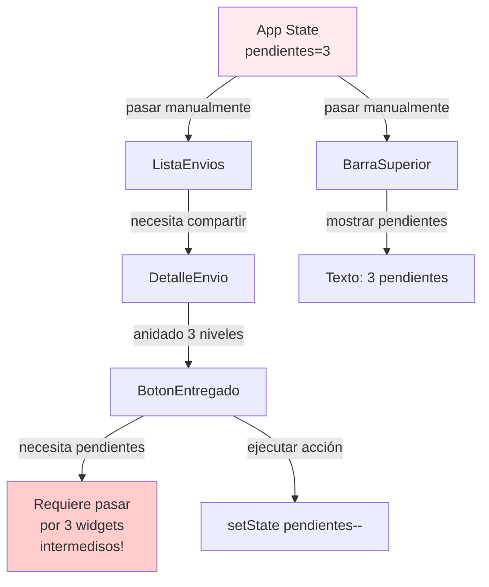
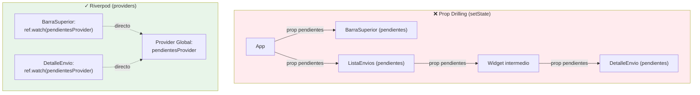
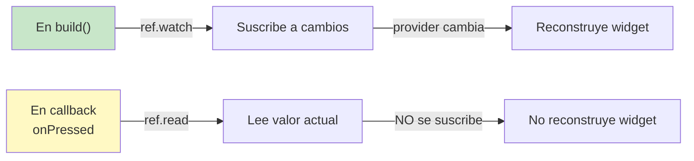
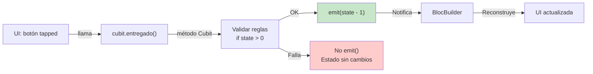
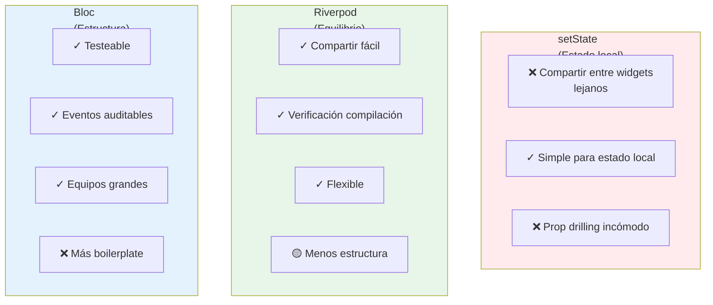
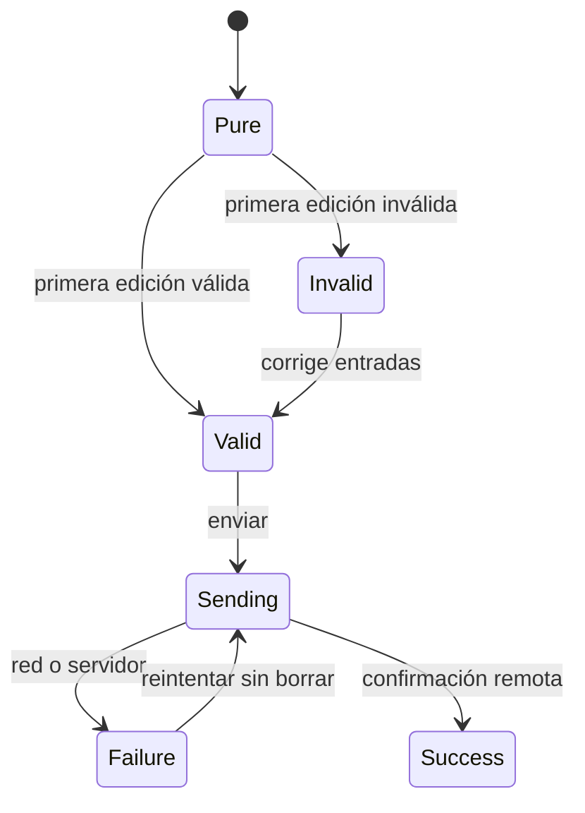

# Módulo 4: Gestión de estado


## Aprende construyendo

### Tema 1: setState y sus límites

#### Paso 1 · Objetivo y preparación
Al finalizar vas a confirmar por qué `setState` no alcanza para compartir el contador de "envíos pendientes" entre `BarraSuperior` y `ListaEnvios`, dos widgets que no son padre-hijo directo. Prerrequisitos: Módulo 3 completo.

#### Paso 2 · Contexto y caso real
`BarraSuperior` necesita mostrar "3 pendientes" mientras `ListaEnvios` (en otra parte del árbol) es quien efectivamente marca envíos como entregados — con `setState` puro, compartir ese número exigiría elevarlo hasta un ancestro común y pasarlo manualmente por cada nivel intermedio.

#### Paso 3 · Teoría, modelo mental y analogía
`setState` es apropiado para estado local a un widget y su subárbol cercano; se vuelve incómodo cuando widgets distantes necesitan compartir el mismo estado sin una relación directa.

**Diagrama: Prop Drilling problema**


```mermaid
graph TD
    A["App State\npendientes=3"] -->|pasar manualmente| B["BarraSuperior"]
    A -->|pasar manualmente| C["ListaEnvios"]
    C -->|necesita compartir| D["DetalleEnvio"]
    D -->|anidado 3 niveles| E["BotonEntregado"]
    
    E -->|necesita pendientes| F["Requiere pasar\npor 3 widgets\nintermedisos!"]
    
    B -->|mostrar pendientes| G["Texto: 3 pendientes"]
    E -->|ejecutar acción| H["setState pendientes--"]
    
    style A fill:#ffebee
    style F fill:#ffcccc
```

#### Paso 4 · Demostración guiada desde cero
```dart
class _AppState extends State<App> {
  int pendientes = 3;
  Widget build(BuildContext context) => Column(children: [
    BarraSuperior(pendientes: pendientes), // prop drilling: pasado manualmente
    ListaEnvios(onEntregado: () => setState(() => pendientes--)),
  ]);
}
```
Resultado esperado: `pendientes` vive en `_AppState` y se pasa manualmente como prop hacia abajo a ambos widgets — funciona, pero cualquier widget nuevo que necesite leer `pendientes` en un nivel más profundo del árbol exigiría repetir ese mismo reenvío manual por cada nivel intermedio.

#### Paso 5 · Práctica guiada
Pista: agregá una tercera pantalla (`DetalleEnvio`, anidada tres niveles más abajo dentro de `ListaEnvios`) que también necesita mostrar `pendientes`, y pasala como prop a través de cada widget intermedio que no la usa para nada propio — ese es el fallo deliberado: ahora tres widgets intermedios reciben y reenvían `pendientes` sin usarla ellos mismos, puro acoplamiento sin beneficio.

#### Paso 6 · Práctica independiente
Corregí el Paso 5 documentando por escrito en qué punto exacto el prop drilling se volvió insostenible, como evidencia concreta de por qué `setState` puro deja de alcanzar en este caso.

#### Paso 7 · Cierre y evidencia
Entregá el prop drilling funcional del Paso 4, el acoplamiento sin beneficio provocado en el Paso 5, y tu documentación del Paso 6; explicá en qué momento preciso decidirías migrar de `setState` a una solución de estado compartido. Siguiente paso: estudia Riverpod. Errores comunes: usar `setState` para estado que varios widgets distantes necesitan compartir, elevar estado a un ancestro común demasiado alto sin necesidad real todavía, y confundir prop drilling tedioso con un problema de rendimiento. Fuentes oficiales: https://docs.flutter.dev/data-and-backend/state-mgmt/simple y https://docs.flutter.dev/get-started/fwe/state-management.
**¿Por qué es importante?** `setState` es suficiente para estado puramente local, pero se vuelve incómodo cuando widgets distantes necesitan compartir el mismo estado, requiriendo una solución más robusta.
**Evidencia de aprendizaje:** entrega prop drilling funcional, acoplamiento sin beneficio detectado y documentación del punto de quiebre.
**Conceptos clave:** suficiente para estado local, incómodo para estado compartido entre widgets distantes.

`setState()` (Módulo 1) es suficiente y apropiado cuando el estado pertenece exclusivamente a un único widget y su subárbol inmediato de hijos, sin necesidad de que ningún otro widget distante en el árbol lea o reaccione a ese mismo estado; se vuelve incómodo y progresivamente más difícil de mantener cuando varios widgets distantes entre sí (que no comparten una relación directa de padre-hijo cercana) necesitan compartir y reaccionar al mismo estado, dado que la única forma de compartir ese estado con `setState` puro sería elevarlo hasta un ancestro común suficientemente alto en el árbol y pasarlo manualmente hacia abajo a través de cada nivel intermedio, un patrón de "prop drilling" tedioso y frágil que se agrava cuanto más distantes están los widgets que necesitan el mismo estado compartido.

Este es exactamente el mismo problema fundamental de gestión de estado compartido estudiado en cada ecosistema de UI declarativa: `@State` local vs Context API en React (Módulo 5 del track de React), `remember` local vs un store de signals en Angular (Módulo 4 del track de Angular), y `@State` local vs `@Environment` en SwiftUI (Módulo 2 del track de iOS), todos resolviendo la misma tensión entre simplicidad de estado local y necesidad de compartir estado entre partes distantes de un árbol de UI.

**Analogía:** `setState` para estado puramente local es como llevar notas personales en el propio bolsillo, perfectamente eficiente mientras solo uno mismo las necesita consultar; cuando varias personas distantes entre sí necesitan consultar y modificar la misma nota, mantener copias manuales sincronizadas en cada bolsillo individual se vuelve rápidamente insostenible, requiriendo en cambio un tablero compartido accesible por todos sin necesidad de copias manuales dispersas.

**¿Por qué es importante?** `setState` es suficiente para estado puramente local a un widget y su subárbol cercano, pero se vuelve incómodo cuando widgets distantes necesitan compartir el mismo estado, requiriendo una solución de gestión de estado más robusta como Riverpod o Bloc.

**Diagrama:**

```
setState()  → apropiado: estado local a un widget y su subárbol cercano
setState()  → incómodo: estado compartido entre widgets distantes (requiere prop drilling manual)
```

### Tema 2: Riverpod

#### Paso 1 · Objetivo y preparación
Al finalizar vas a migrar el contador de "envíos pendientes" del Tema 1 a un `StateProvider` de Riverpod, consumido desde `BarraSuperior` y `DetalleEnvio` sin ningún prop drilling. Prerrequisitos: Tema 1 de este módulo.

#### Paso 2 · Contexto y caso real
El prop drilling de tres niveles del Tema 1 ya se sentía insostenible — ahora `BarraSuperior` y `DetalleEnvio` necesitan leer y modificar el mismo contador sin que ningún widget intermedio lo reenvíe manualmente.

#### Paso 3 · Teoría, modelo mental y analogía
Riverpod declara providers como objetos globales independientes del árbol de widgets, verificados en tiempo de compilación — un directorio centralizado de servicios verificado antes de abrir el edificio.

**Diagrama: Riverpod vs prop drilling**


```mermaid
graph TB
    subgraph PropDrill["❌ Prop Drilling (setState)"]
        PD1["App"]
        PD2["BarraSuperior (pendientes)"]
        PD3["ListaEnvios (pendientes)"]
        PD4["Widget intermedio"]
        PD5["DetalleEnvio (pendientes)"]
        PD1 -->|prop pendientes| PD2
        PD1 -->|prop pendientes| PD3
        PD3 -->|prop pendientes| PD4
        PD4 -->|prop pendientes| PD5
    end
    
    subgraph Riverpod["✓ Riverpod (providers)"]
        RV1["BarraSuperior:\nref.watch(pendientesProvider)"]
        RV2["DetalleEnvio:\nref.watch(pendientesProvider)"]
        RV3["Provider Global:\npendientesProvider"]
        RV1 -.->|directo| RV3
        RV2 -.->|directo| RV3
    end
    
    style PropDrill fill:#ffebee
    style Riverpod fill:#e8f5e9
```

**Diagrama: ref.watch vs ref.read en Riverpod**


```mermaid
graph LR
    A["En build()"] -->|ref.watch| B["Suscribe a cambios"]
    B -->|provider cambia| C["Reconstruye widget"]
    
    D["En callback\nonPressed"] -->|ref.read| E["Lee valor actual"]
    E -->|NO se suscribe| F["No reconstruye widget"]
    
    style A fill:#c8e6c9
    style D fill:#fff9c4
```

#### Paso 4 · Demostración guiada desde cero
```dart
final pendientesProvider = StateProvider<int>((ref) => 3);

class BarraSuperior extends ConsumerWidget {
  Widget build(BuildContext context, WidgetRef ref) {
    final pendientes = ref.watch(pendientesProvider);
    return Text("$pendientes pendientes");
  }
}
class DetalleEnvio extends ConsumerWidget {
  Widget build(BuildContext context, WidgetRef ref) =>
    ElevatedButton(onPressed: () => ref.read(pendientesProvider.notifier).state--, child: Text("Entregado"));
}
```
Resultado esperado: `BarraSuperior` y `DetalleEnvio` leen y modifican `pendientesProvider` sin que ningún widget entre ellos conozca ni reenvíe ese valor — el acoplamiento sin beneficio del Tema 1 desaparece.

#### Paso 5 · Práctica guiada
Pista: en `DetalleEnvio`, usá `ref.watch(pendientesProvider.notifier).state--` (con `watch` en vez de `read`) dentro del `onPressed` — ese es el fallo deliberado: `ref.watch` dentro de un callback de evento no tiene el efecto esperado de suscripción y es un uso incorrecto que el propio analizador de Riverpod señala, dado que espera `watch` solo durante la construcción del widget.

#### Paso 6 · Práctica independiente
Corregí el Paso 5 devolviendo `ref.read(pendientesProvider.notifier).state--` dentro del callback, y agregá un tercer widget (`ResumenZona`) que también observe `pendientesProvider`, confirmando que los tres widgets reflejan siempre el mismo valor sin ninguna sincronización manual.

#### Paso 7 · Cierre y evidencia
Entregá el provider compartido del Paso 4, el uso incorrecto de `watch` en un callback del Paso 5, y el tercer consumidor del Paso 6; explicá la diferencia entre `ref.watch` (suscribe a cambios, usar en `build`) y `ref.read` (lee una vez, usar en callbacks). Siguiente paso: estudia Bloc/Cubit como alternativa con más estructura. Errores comunes: confundir `ref.watch` con `ref.read` dentro de un callback, leer un provider que no fue declarado antes de usarlo, y no aprovechar la verificación en tiempo de compilación que Riverpod ofrece sobre Provider. Fuentes oficiales: https://riverpod.dev/docs/concepts/providers y https://riverpod.dev/docs/concepts/reading.
**¿Por qué es importante?** Riverpod verifica providers en tiempo de compilación y permite compartir estado entre widgets distantes sin prop drilling manual, resolviendo directamente el problema del Tema 1.
**Evidencia de aprendizaje:** entrega provider compartido, uso incorrecto de watch detectado y tercer consumidor sincronizado.
**Conceptos clave:** verificación de providers en tiempo de compilación, no dependiente del árbol de widgets en runtime.

```dart
final contadorProvider = StateProvider<int>((ref) => 0);

class PantallaContador extends ConsumerWidget {
  Widget build(BuildContext context, WidgetRef ref) {
    final contador = ref.watch(contadorProvider);
    return ElevatedButton(
      onPressed: () => ref.read(contadorProvider.notifier).state++,
      child: Text("$contador"),
    );
  }
}
```

Riverpod (evolución de Provider, el paquete de gestión de estado más antiguo del ecosistema Flutter) declara providers como objetos globales independientes del árbol de widgets, verificados en tiempo de **compilación**: intentar leer un provider que no existe o que tiene un tipo incorrecto produce un error de compilación inmediato, a diferencia de Provider (el paquete anterior), donde un provider se busca en runtime recorriendo el árbol de widgets hacia arriba (`context.watch<T>()`), de modo que un error de "provider no encontrado" (porque el widget que lo provee no está en el ancestro esperado en el árbol) solo se manifiesta como una excepción en tiempo de ejecución, potencialmente descubierta tarde durante pruebas manuales o incluso en producción.

`ref.watch(contadorProvider)` suscribe el widget a reconstruirse cuando ese provider cambia; `ref.read(contadorProvider.notifier).state++` modifica el estado sin suscribirse a cambios (apropiado dentro de callbacks de eventos, donde no se necesita observar el propio cambio que se está provocando). Consumir el mismo provider desde dos widgets distintos y distantes entre sí simplemente requiere que ambos llamen `ref.watch(contadorProvider)`, sin ningún prop drilling manual entre ellos, resolviendo directamente el problema descrito en el Tema 1.

**Analogía:** Riverpod es como un directorio centralizado de servicios verificado formalmente antes de la apertura de un edificio, donde cualquier intento de referenciar un servicio inexistente se detecta durante la inspección previa (compilación), en vez de descubrirse recién cuando alguien intenta usar ese servicio en el día a día de operación del edificio ya abierto al público (runtime).

**¿Por qué es importante?** Riverpod verifica providers en tiempo de compilación, detectando errores de "provider no encontrado" antes de ejecutar la app, a diferencia de Provider, que depende del árbol de widgets en runtime y descubre esos errores solo al ejecutar el código afectado.

**Código del ejemplo:**

```dart
final contadorProvider = StateProvider<int>((ref) => 0);
// Verificado en COMPILACIÓN, independiente de dónde esté ubicado en el árbol de widgets
```

### Tema 3: Bloc/Cubit y otras alternativas

#### Paso 1 · Objetivo y preparación
Al finalizar vas a reimplementar el contador de "envíos pendientes" con un `Cubit`, separando explícitamente el evento ("se entregó un envío") del cambio de estado resultante. Prerrequisitos: Tema 2 de este módulo.

#### Paso 2 · Contexto y caso real
El equipo de RutaFlow quiere poder testear exhaustivamente cada transición posible del contador de pendientes (nunca puede ir por debajo de 0) de forma aislada, sin depender de ningún widget renderizado.

#### Paso 3 · Teoría, modelo mental y analogía
Bloc/Cubit separa explícitamente "qué pasó" (una llamada a un método) de "cómo cambia el estado en respuesta" (`emit(...)`) — un protocolo formal de solicitud de cambios, auditable y predecible.

**Diagrama: Bloc event → state flow**


```mermaid
graph LR
    A["UI: botón tapped"] -->|llama| B["cubit.entregado()"]
    B -->|método Cubit| C["Validar reglas\nif state > 0"]
    C -->|OK| D["emit(state - 1)"]
    D -->|Notifica| E["BlocBuilder"]
    E -->|Reconstruye| F["UI actualizada"]
    
    C -->|Falla| G["No emit()\nEstado sin cambios"]
    
    style D fill:#c8e6c9
    style G fill:#ffcccc
```

**Diagrama: Comparación setState vs Riverpod vs Bloc**


```mermaid
graph TB
    subgraph SetState["setState\n(Estado local)"]
        SS1["❌ Compartir entre widgets\nlejanos"]
        SS2["✓ Simple para estado local"]
        SS3["❌ Prop drilling incómodo"]
    end
    
    subgraph Riverpod2["Riverpod\n(Equilibrio)"]
        RV1["✓ Compartir fácil"]
        RV2["✓ Verificación compilación"]
        RV3["✓ Flexible"]
        RV4["🟡 Menos estructura"]
    end
    
    subgraph Bloc2["Bloc\n(Estructura)"]
        BL1["✓ Testeable"]
        BL2["✓ Eventos auditables"]
        BL3["✓ Equipos grandes"]
        BL4["❌ Más boilerplate"]
    end
    
    style SetState fill:#ffebee
    style Riverpod2 fill:#e8f5e9
    style Bloc2 fill:#e3f2fd
```

#### Paso 4 · Demostración guiada desde cero
```dart
class PendientesCubit extends Cubit<int> {
  PendientesCubit() : super(3);
  void entregado() {
    if (state > 0) emit(state - 1);
  }
}

BlocBuilder<PendientesCubit, int>(
  builder: (context, pendientes) => Text("$pendientes pendientes"),
)
```
Resultado esperado: llamar a `entregado()` disminuye el contador en uno, pero nunca por debajo de 0 (la guarda `if (state > 0)` lo impide); esa regla puede testearse de forma completamente aislada instanciando `PendientesCubit()` directamente, sin renderizar ningún widget.

#### Paso 5 · Práctica guiada
Pista: quitá la guarda `if (state > 0)` y llamá a `entregado()` cuatro veces seguidas con el contador inicial en 3 — ese es el fallo deliberado: el contador llega a -1, un estado que no tiene ningún sentido real en el dominio, y nada en el tipo `int` del estado lo había prevenido.

#### Paso 6 · Práctica independiente
Corregí el Paso 5 restaurando la guarda, y escribí un test unitario que instancie `PendientesCubit()` directamente y confirme que llamar `entregado()` cuatro veces desde el estado inicial 3 deja el contador exactamente en 0, no en un valor negativo.

#### Paso 7 · Cierre y evidencia
Entregá el Cubit con la guarda del Paso 4, el estado inválido provocado en el Paso 5, y el test unitario del Paso 6; explicá por qué poder testear esta regla sin renderizar ningún widget es una ventaja concreta de separar "evento" de "cambio de estado" de forma explícita. Siguiente paso: estudia formularios profesionales con Formz y Riverpod. Errores comunes: adoptar Bloc para una feature tan simple que no necesita esa ceremonia, omitir guardas de validez en el método que emite el nuevo estado, y testear un Cubit renderizando widgets en vez de instanciándolo directamente. Fuentes oficiales: https://bloclibrary.dev/bloc-concepts/ y https://bloclibrary.dev/testing/.
**¿Por qué es importante?** Bloc/Cubit aporta un modelo de eventos predecible y fácil de testear de forma aislada para lógica con reglas de transición que deben protegerse explícitamente.
**Evidencia de aprendizaje:** entrega Cubit con guarda, estado inválido detectado y test unitario sin renderizar widgets.
**Conceptos clave:** separación explícita entre evento y cambio de estado resultante.

```dart
class ContadorCubit extends Cubit<int> {
  ContadorCubit() : super(0);
  void incrementar() => emit(state + 1);
}

BlocBuilder<ContadorCubit, int>(
  builder: (context, contador) => Text("$contador"),
)
```

Bloc/Cubit fuerza una separación explícita y estructurada entre "qué pasó" (una llamada a un método como `incrementar()`, o en el patrón Bloc completo, un evento explícito modelado como su propio tipo) y "cómo cambia el estado en respuesta" (`emit(state + 1)`), un patrón considerablemente más predecible y fácil de testear de forma aislada que mutaciones de estado dispersas directamente en callbacks de UI, a cambio de más ceremonia (más código boilerplate) que Riverpod para casos simples como un contador; esta estructura explícita es especialmente valorada en equipos grandes donde la previsibilidad y testeabilidad exhaustiva del flujo de eventos justifica el costo adicional de ceremonia, un patrón conceptualmente similar al de Redux (estudiado en el Módulo 8 del track de React) o a NgRx (mencionado en el Módulo 4 del track de Angular).

GetX ofrece un enfoque "todo-en-uno" que combina gestión de estado, inyección de dependencias y navegación en un único paquete con una API más ligera, apreciado por su simplicidad inicial pero criticado por algunos equipos por acoplar demasiadas responsabilidades distintas en una única herramienta; `get_it` (un simple service locator) e `injectable` (generación de código para configurar `get_it` automáticamente a partir de anotaciones) son alternativas de inyección de dependencias más ligeras y menos opinionadas que el sistema de providers de Riverpod, apropiadas cuando se prefiere una solución de DI más simple sin adoptar todo el ecosistema de gestión de estado de Riverpod.

**Analogía:** Bloc/Cubit es como un protocolo formal de solicitud de cambios en una organización burocrática (cada cambio requiere una solicitud explícita documentada y una respuesta correspondiente), más lento de operar para cambios triviales pero extremadamente auditable y predecible para cambios complejos en organizaciones grandes; GetX es como una caja de herramientas multiuso conveniente pero menos especializada que herramientas dedicadas a cada tarea individual.

**¿Por qué es importante?** Bloc/Cubit aporta un modelo de eventos predecible y fácil de testear para apps con lógica de negocio compleja, a cambio de más ceremonia que Riverpod; elegir entre `setState`, Riverpod y Bloc depende del tamaño del equipo y la complejidad del estado compartido de la app.

**Diagrama:**

```
setState  → estado puramente local
Riverpod  → balance simplicidad/robustez, mayoría de apps
Bloc      → equipos grandes, estructura explícita basada en eventos
```

### Tema 4: Formularios profesionales con Formz y Riverpod

#### Paso 1 · Objetivo y preparación
Al finalizar vas a construir el formulario "No fue posible entregar" con entradas Formz tipadas (`ReasonInput`, `NoteInput`) y un `Notifier` de Riverpod que coordine validación y envío único. Prerrequisitos: módulos 0-3, Riverpod configurado.

#### Paso 2 · Contexto y caso real
El conductor debe elegir un motivo y escribir una observación de 10 a 300 caracteres — un formulario real necesita distinguir lo que el usuario todavía no tocó, una entrada inválida, un envío en curso, un rechazo del backend y una confirmación exitosa, no solo un conjunto de `TextEditingController`.

#### Paso 3 · Teoría, modelo mental y analogía
Formz distingue `pure` (sin interacción) de `dirty` (ya modificado); el estado del formulario es inmutable y separa validez de estado de red — las entradas son inspectores especializados, el estado del formulario es el tablero de despacho.

#### Paso 4 · Demostración guiada desde cero
```dart
enum ReasonError { empty }
final class ReasonInput extends FormzInput<String, ReasonError> {
  const ReasonInput.pure() : super.pure('');
  const ReasonInput.dirty([super.value = '']) : super.dirty();
  @override
  ReasonError? validator(String value) => value.isEmpty ? ReasonError.empty : null;
}
```
Resultado esperado: un `ReasonInput.pure()` sin que el usuario haya escrito nada no muestra ningún error todavía (porque está "pure"); en cuanto el usuario escribe algo y se convierte en `ReasonInput.dirty(valor)`, el validador corre y puebla el error correspondiente si el valor sigue vacío.

#### Paso 5 · Práctica guiada
Pista: tocá dos veces rápidamente el botón "Reportar novedad" mientras el repositorio falso tarda dos segundos en responder — ese es el fallo deliberado: sin la guarda `state.submitStatus == SubmitStatus.sending` dentro de `submit()`, el segundo toque dispara una segunda llamada a `report()` mientras la primera todavía está en curso, pudiendo duplicar el reporte en el servidor.

#### Paso 6 · Práctica independiente
Corregí el Paso 5 confirmando que la guarda `if (!state.isValid || state.submitStatus == SubmitStatus.sending) return;` está presente, y escribí el test que confirma que `report` se invoca exactamente una vez sin importar cuántos toques rápidos reciba el botón.

#### Paso 7 · Cierre y evidencia
Entregá las entradas Formz tipadas y el Notifier del Paso 4, el envío duplicado provocado en el Paso 5, y el test de envío único del Paso 6; explicá por qué separar `isValid` (datos correctos) de `submitStatus` (datos ya guardados) evita confundir ambas cosas y previene envíos duplicados. Siguiente paso: cerrá el módulo documentando el criterio de elección entre setState, Riverpod y Bloc. Errores comunes: mostrar todos los errores de validación antes de que el usuario interactúe con el campo, no proteger `submit()` contra doble toque mientras una petición está en curso, y borrar los valores escritos cuando el servidor rechaza el envío. Fuentes oficiales: https://pub.dev/packages/formz y https://riverpod.dev/docs/concepts/providers.
**¿Por qué es importante?** Centralizar validación en tipos puros permite probar reglas sin renderizar widgets; separar `isValid` de `SubmitStatus` evita confundir "datos correctos" con "datos ya guardados" y previene envíos duplicados.
**Evidencia de aprendizaje:** entrega entradas Formz tipadas, envío duplicado detectado y test de envío único.
**Conceptos clave:** valor `pure`/`dirty`, validación determinista, estado inmutable, feedback progresivo, envío único y error de servidor.

Construiremos el formulario «No fue posible entregar» de nuestra app. El conductor debe elegir un motivo y escribir una observación de 10 a 300 caracteres. Un formulario real no es solamente un conjunto de `TextEditingController`: necesita distinguir lo que el usuario todavía no tocó, una entrada inválida, un envío en curso, un rechazo del backend y una confirmación exitosa.

**Requisitos previos:** Módulos 0–3, proyecto `demo_driver` y Riverpod configurado. Desde la raíz ejecuta:

```bash
flutter pub add flutter_riverpod formz
```

```text
lib/features/delivery_issue/
├── domain/delivery_issue_repository.dart
├── application/report_issue.dart
└── presentation/
    ├── issue_form_inputs.dart
    ├── issue_form_state.dart
    ├── issue_form_notifier.dart
    └── issue_form_page.dart
test/features/delivery_issue/presentation/issue_form_notifier_test.dart
```

En `issue_form_inputs.dart`, cada entrada contiene su valor y su validación. `pure` significa «aún no hubo interacción»; `dirty` significa «el usuario ya la modificó». Esto evita mostrar una pantalla llena de errores antes de escribir.

```dart
import 'package:formz/formz.dart';

enum ReasonError { empty }
final class ReasonInput extends FormzInput<String, ReasonError> {
  const ReasonInput.pure() : super.pure('');
  const ReasonInput.dirty([super.value = '']) : super.dirty();
  @override
  ReasonError? validator(String value) => value.isEmpty ? ReasonError.empty : null;
}

enum NoteError { tooShort, tooLong }
final class NoteInput extends FormzInput<String, NoteError> {
  const NoteInput.pure() : super.pure('');
  const NoteInput.dirty([super.value = '']) : super.dirty();
  @override
  NoteError? validator(String value) {
    final text = value.trim();
    if (text.length < 10) return NoteError.tooShort;
    if (text.length > 300) return NoteError.tooLong;
    return null;
  }
}
```

En `issue_form_state.dart`, el estado es inmutable y separa validez de estado de red:

```dart
enum SubmitStatus { idle, sending, success, failure }

final class IssueFormState {
  const IssueFormState({
    this.reason = const ReasonInput.pure(),
    this.note = const NoteInput.pure(),
    this.submitStatus = SubmitStatus.idle,
    this.serverMessage,
  });

  final ReasonInput reason;
  final NoteInput note;
  final SubmitStatus submitStatus;
  final String? serverMessage;
  bool get isValid => Formz.validate([reason, note]);

  IssueFormState copyWith({ReasonInput? reason, NoteInput? note,
      SubmitStatus? submitStatus, String? serverMessage}) => IssueFormState(
    reason: reason ?? this.reason,
    note: note ?? this.note,
    submitStatus: submitStatus ?? this.submitStatus,
    serverMessage: serverMessage,
  );
}
```

El `Notifier` de `issue_form_notifier.dart` es el único lugar que coordina cambios y envío. La guarda inicial impide doble toque mientras la petición está activa:

```dart
final class IssueFormNotifier extends Notifier<IssueFormState> {
  @override
  IssueFormState build() => const IssueFormState();

  void reasonChanged(String value) {
    state = state.copyWith(reason: ReasonInput.dirty(value));
  }

  void noteChanged(String value) {
    state = state.copyWith(note: NoteInput.dirty(value));
  }

  Future<void> submit() async {
    if (!state.isValid || state.submitStatus == SubmitStatus.sending) return;
    state = state.copyWith(submitStatus: SubmitStatus.sending);
    try {
      await ref.read(deliveryIssueRepositoryProvider).report(
        reason: state.reason.value,
        note: state.note.value.trim(),
      );
      state = state.copyWith(submitStatus: SubmitStatus.success);
    } catch (_) {
      state = state.copyWith(
        submitStatus: SubmitStatus.failure,
        serverMessage: 'No pudimos guardar el reporte. Intenta nuevamente.',
      );
    }
  }
}
```

La página observa el estado, traduce errores tipados a español y anuncia el resultado con `Semantics` o `SnackBar`. El botón se deshabilita si el formulario no es válido o ya está enviando; no borres lo escrito cuando el servidor falla.

```dart
FilledButton(
  onPressed: form.isValid && form.submitStatus != SubmitStatus.sending
      ? notifier.submit
      : null,
  child: form.submitStatus == SubmitStatus.sending
      ? const SizedBox.square(dimension: 20, child: CircularProgressIndicator())
      : const Text('Reportar novedad'),
)
```


```mermaid
stateDiagram-v2
  [*] --> Pure
  Pure --> Invalid: primera edición inválida
  Pure --> Valid: primera edición válida
  Invalid --> Valid: corrige entradas
  Valid --> Sending: enviar
  Sending --> Failure: red o servidor
  Failure --> Sending: reintentar sin borrar
  Sending --> Success: confirmación remota
```

**Analogía:** las entradas Formz son inspectores especializados y el estado del formulario es el tablero de despacho. El tablero coordina resultados, pero no repite las reglas de inspección de cada campo.

**¿Por qué es importante?** Centralizar validación en tipos puros permite probar reglas sin renderizar widgets. Separar `isValid` de `SubmitStatus` evita confundir «datos correctos» con «datos ya guardados» y previene envíos duplicados.

**Ejecución y resultado esperado:** ejecuta `flutter test test/features/delivery_issue/presentation/issue_form_notifier_test.dart` y luego `flutter run`. El botón permanece inactivo con observación corta, se activa con entradas válidas, muestra progreso durante una única petición y conserva valores ante un error recuperable.

**Fallo deliberado:** toca dos veces rápidamente el botón y configura el repositorio falso para tardar dos segundos. La prueba debe demostrar que `report` se invoca una sola vez. Después haz que el backend responda `422`; conserva un mensaje general y asigna errores de campo solamente si el contrato del servidor los identifica explícitamente.

**Modificación sin copiar:** agrega fotografía obligatoria solo para el motivo `damaged_package`. Decide si esa regla pertenece a una entrada compuesta o al formulario, y prueba las transiciones sin usar `pumpWidget`.

---

## Referencia: RutaFlow Flutter

**App completa que demuestra Temas 2-4 de este módulo:**

Ver `examples/flutter_rutaflow/lib/features/deliveries/domain/delivery_providers.dart`:
- Riverpod providers para estado compartido (Tema 2)
- StateNotifier para operaciones de actualización
- Diferencia entre `ref.watch()` y `ref.read()`
- Invalidación de providers para sincronización

Ver `examples/flutter_rutaflow/lib/features/deliveries/presentation/delivery_list_screen.dart`:
- ConsumerWidget para integración con Riverpod
- Manejo de AsyncValue (loading/error/data)
- Uso correcto de Keys en listas

**Ejecutar localmente:**
```bash
cd examples/flutter_rutaflow
flutter pub get
flutter run
```

Luego inspecciona en Flutter DevTools:
1. **Performance tab**: Observa rebuilds selectivos con Riverpod
2. **Network tab**: Inspecciona requests al API
3. **Console tab**: Ve logs de providers siendo creados/invalidados

---

## Laboratorio práctico

**Objetivo del laboratorio:** construir una feature completa implementada con Riverpod (o Bloc) en vez de `setState`.

**Requisitos previos:** Módulo 3 completado.

| Paso | Acción | Código | Explicación |
|---|---|---|---|
| 1 | Implementar una feature simple con `setState` | Ver Tema 1 | Documenta sus límites al crecer |
| 2 | Reimplementarla con Riverpod | Ver Tema 2 | Un `Provider` para exponer el estado |
| 3 | Consumirlo desde 2 widgets distintos | Ver Tema 2 | Sin pasar el estado manualmente |
| 4 | Reimplementarla con Bloc/Cubit | Ver Tema 3 | Compara ceremonia y curva de aprendizaje |
| 5 | Documentar un criterio propio | Ver Tema 3 | setState vs Riverpod vs Bloc |
| 6 | Construir el formulario de novedad | Ver Tema 4 | Entradas tipadas, feedback progresivo y envío único |
| 7 | Probar doble toque y error remoto | Ver Tema 4 | Una petición y valores conservados para reintento |

**Verificación:** el laboratorio se considera exitoso si el estado se comparte correctamente entre los dos widgets distantes sin prop drilling manual usando Riverpod, y si el documento comparativo identifica correctamente las diferencias de ceremonia entre los tres enfoques.

**Errores comunes y soluciones**

- **Usar `setState` para estado que necesita compartirse entre widgets distantes.** Migra a Riverpod o Bloc antes de que el prop drilling se vuelva insostenible.
- **Adoptar Bloc para una feature muy simple sin necesidad real de esa ceremonia.** Considera Riverpod como balance para la mayoría de los casos.
- **Confundir `ref.watch` con `ref.read` dentro de un callback.** Usa `ref.read` cuando no necesitas suscribirte a cambios, típicamente dentro de callbacks de eventos.
- **Mostrar todos los errores al abrir el formulario.** Usa el estado `pure` hasta que exista interacción o intento de envío.
- **Usar la validez como confirmación remota.** Un formulario válido todavía puede estar pendiente, fallar o ser rechazado por el servidor.

---
