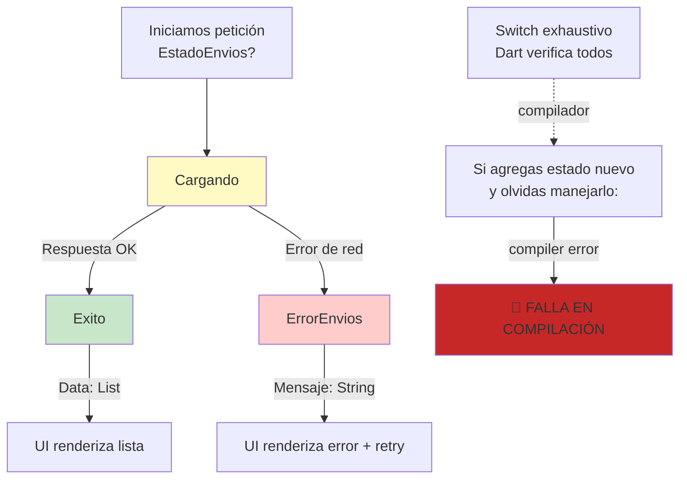

# Módulo 5: Networking


## Aprende construyendo

### Tema 1: http vs dio

#### Paso 1 · Objetivo y preparación
Al finalizar vas a migrar la consulta de envíos de RutaFlow de `http` a `dio`, para poder cancelar una búsqueda en curso cuando el operador escribe una guía nueva. Prerrequisitos: Módulo 4 completo.

#### Paso 2 · Contexto y caso real
Con `http` básico, si el operador escribe rápido una guía distinta mientras la búsqueda anterior todavía está en vuelo, ambas peticiones completan de forma independiente y pueden sobrescribirse en el orden equivocado — `http` no ofrece ningún mecanismo nativo de cancelación.

#### Paso 3 · Teoría, modelo mental y analogía
`http` ofrece una API mínima suficiente para casos simples; `dio` agrega interceptores, cancelación de peticiones en curso y timeouts configurables como parte de su API central.

**Diagrama: Ciclo de petición con Dio e interceptores**

```mermaid
graph LR
    A["Código:\ndio.get('/envios')"] -->|OnRequest\ninterceptor| B["Agrega header Auth"]
    B -->|HTTP GET| C["Servidor"]
    C -->|HTTP 200\n+ JSON| D["OnResponse\ninterceptor"]
    D -->|Log respuesta| E["Retorna data"]
    
    F["❌ Error"] -->|OnError\ninterceptor| G["Log error"]
    G -->|Retorna error"]
    C -->|HTTP 5xx| F
    
    style A fill:#c8e6c9
    style E fill:#c8e6c9
    style F fill:#ffcccc
```

#### Paso 4 · Demostración guiada desde cero
```dart
final dio = Dio();
final cancelToken = CancelToken();
final respuesta = await dio.get('/envios', queryParameters: {'guia': guia}, cancelToken: cancelToken);
// al escribir una nueva guía: cancelToken.cancel('nueva búsqueda');
```
Resultado esperado: al escribir una guía nueva antes de que la búsqueda anterior complete, llamar a `cancelToken.cancel()` cancela efectivamente esa petición en curso — la respuesta vieja nunca llega a sobrescribir el resultado de la búsqueda más reciente.

#### Paso 5 · Práctica guiada
Pista: seguí usando `http.get(Uri.parse(...))` para esta búsqueda, sin ningún mecanismo de cancelación — ese es el fallo deliberado: escribí dos guías rápido seguidas y confirmá que, si la primera petición responde después de la segunda, sus resultados sobrescriben los de la búsqueda más reciente en pantalla, mostrando envíos que no corresponden a lo que el operador realmente buscó al final.

#### Paso 6 · Práctica independiente
Corregí el Paso 5 migrando esa búsqueda a `dio` con `CancelToken`, y confirmá explícitamente que la respuesta de una búsqueda cancelada nunca llega a actualizar el estado de la pantalla.

#### Paso 7 · Cierre y evidencia
Entregá la búsqueda cancelable con `dio` del Paso 4, la respuesta obsoleta sobrescribiendo resultados del Paso 5, y la confirmación del Paso 6; explicá por qué `http` básico, al no ofrecer cancelación nativa, exigiría construir manualmente esa infraestructura si se insistiera en usarlo para este caso. Siguiente paso: estudia json_serializable para deserializar la respuesta de forma tipada. Errores comunes: usar `http` para casos que necesitan cancelación o interceptores sin medir el costo de construir eso manualmente, no cancelar peticiones obsoletas antes de disparar una nueva, y olvidar manejar el error específico de cancelación. Fuentes oficiales: https://pub.dev/packages/dio y https://pub.dev/packages/http.
**¿Por qué es importante?** `dio` ofrece interceptores, cancelación y timeouts configurables como parte de su API central, capacidades que una app de tamaño real necesita y que `http` no ofrece nativamente.
**Evidencia de aprendizaje:** entrega búsqueda cancelable con dio, respuesta obsoleta detectada y confirmación de cancelación efectiva.
**Conceptos clave:** simplicidad básica frente a un cliente HTTP completo para apps de tamaño real.

```dart
// http: simple, suficiente para casos básicos
final respuesta = await http.get(Uri.parse('https://api.miapp.com/tareas'));

// dio: interceptores, cancelación, timeouts configurables, transformación de datos
final dio = Dio();
dio.interceptors.add(LogInterceptor());
final respuesta = await dio.get('/tareas');
```

El paquete `http` (mantenido oficialmente por el equipo de Dart) ofrece una API mínima y directa para peticiones HTTP básicas, suficiente para casos simples de un proyecto pequeño o un prototipo; `dio` es un cliente HTTP considerablemente más completo, con soporte incorporado para interceptores (Tema 3), cancelación de peticiones en curso, configuración fina de timeouts por petición, y transformación automática de datos, capacidades que en `http` requerirían implementarse manualmente con código adicional propio, aumentando la complejidad de mantenimiento a medida que la app crece más allá de casos triviales.

Para una app de tamaño real que necesita manejar autenticación (agregando un header en cada petición), logging consistente de todas las peticiones para depuración, y cancelación de peticiones obsoletas (por ejemplo, al iniciar una nueva búsqueda antes de que la anterior complete, el mismo patrón estudiado con `Task.cancel()` en Swift, Módulo 5 del track de iOS), `dio` ofrece estas capacidades como parte de su API central, en vez de requerir construir esa infraestructura manualmente sobre el paquete `http` más básico.

**Analogía:** `http` es como un servicio postal básico que simplemente entrega y recibe correspondencia; `dio` es como un servicio de logística completo con seguimiento en tiempo real, capacidad de cancelar un envío en tránsito, y reglas configurables de manejo especial para cada tipo específico de paquete, capacidades que el servicio básico simplemente no ofrece de forma nativa.

**¿Por qué es importante?** `dio` ofrece interceptores, cancelación y timeouts configurables como parte de su API central, capacidades que una app de tamaño real necesita y que `http` no ofrece nativamente, requiriendo construir esa infraestructura manualmente si se usara el paquete más básico.

**Código del ejemplo:**

```dart
final dio = Dio();
dio.interceptors.add(LogInterceptor());
final respuesta = await dio.get('/tareas');
```

### Tema 2: json_serializable

#### Paso 1 · Objetivo y preparación
Al finalizar vas a generar el modelo `Envio` con `json_serializable`, detectando en tiempo de deserialización si la API devuelve un campo faltante o mal tipado. Prerrequisitos: Tema 1 de este módulo.

#### Paso 2 · Contexto y caso real
Parsear la respuesta de `/envios` manualmente accediendo a `json['guia']` como `Map<String, dynamic>` sin verificación de tipo deja pasar silenciosamente un campo faltante como `null`, que solo causa un error confuso mucho más adelante en el código, lejos de donde realmente se originó el problema.

#### Paso 3 · Teoría, modelo mental y analogía
`json_serializable` genera en tiempo de compilación el código de parsing hacia una instancia tipada; un campo faltante o mal tipado produce un error claro al deserializar, no un `null` silencioso.

#### Paso 4 · Demostración guiada desde cero
```dart
@JsonSerializable()
class Envio {
  final String guia;
  final String estado;
  Envio({required this.guia, required this.estado});
  factory Envio.fromJson(Map<String, dynamic> json) => _$EnvioFromJson(json);
}
```
Resultado esperado: deserializar una respuesta de la API que le falte el campo `estado` lanza un error explícito y claro en el punto exacto de `Envio.fromJson(json)` — no un `null` silencioso que recién falla mucho más adelante al intentar mostrar `envio.estado` en pantalla.

#### Paso 5 · Práctica guiada
Pista: cambiá el modelo para parsear `estado` manualmente con `json['estado'] as String? ?? ''` "para evitar el error" — ese es el fallo deliberado: ahora un envío con el campo `estado` faltante en la respuesta real de la API se parsea silenciosamente como un string vacío, sin ningún error ni advertencia, y la UI simplemente muestra una tarjeta de envío sin estado visible.

#### Paso 6 · Práctica independiente
Corregí el Paso 5 devolviendo el campo a `required this.estado` tipado estrictamente, y agregá un test que confirme que deserializar un JSON sin el campo `estado` lanza una excepción, en vez de producir un `Envio` con datos incompletos silenciosos.

#### Paso 7 · Cierre y evidencia
Entregá el modelo generado del Paso 4, el error silenciado por el valor por defecto del Paso 5, y el test de deserialización del Paso 6; explicá por qué "evitar el error" con un valor por defecto en este caso oculta un problema real de datos en vez de resolverlo. Siguiente paso: estudia interceptores y estados explícitos. Errores comunes: usar valores por defecto para "evitar" errores de deserialización que en realidad señalan datos incompletos reales, parsear JSON manualmente sin ninguna verificación de tipo centralizada, y olvidar correr `build_runner` después de modificar un modelo anotado. Fuentes oficiales: https://pub.dev/packages/json_serializable y https://docs.flutter.dev/data-and-backend/serialization/json.
**¿Por qué es importante?** Generar modelos con `json_serializable` es más seguro que parsear JSON manualmente porque un campo faltante o mal tipado falla de forma clara y explícita, en vez de propagar un error silencioso.
**Evidencia de aprendizaje:** entrega modelo generado, error silenciado detectado y test de deserialización estricta.
**Conceptos clave:** generación de código en tiempo de compilación, parsing tipado y verificado.

```dart
@JsonSerializable()
class Tarea {
  final String id;
  final String titulo;
  Tarea({required this.id, required this.titulo});
  factory Tarea.fromJson(Map<String, dynamic> json) => _$TareaFromJson(json);
}
```

`json_serializable` genera automáticamente, en tiempo de compilación (mediante un paso de build separado, `build_runner`), el código de parsing (`_$TareaFromJson`) que convierte un `Map<String, dynamic>` genérico (la representación cruda de JSON decodificado en Dart) hacia una instancia tipada de `Tarea`; un campo faltante o con un tipo incorrecto en el JSON recibido produce un error claro y explícito al deserializar, en vez de fallar silenciosamente o de forma confusa más adelante en el código si se hubiera parseado manualmente accediendo directamente a claves de un `Map<String, dynamic>` sin ninguna verificación de tipo centralizada (un enfoque propenso a errores silenciosos como acceder a una clave inexistente y obtener `null` sin ningún error visible hasta que ese valor `null` causa un problema en un punto completamente distinto y más difícil de rastrear del código).

Este mismo principio de generación de código de parsing tipado en tiempo de compilación es directamente análogo a `Codable` en Swift (Módulo 5 del track de iOS) y a `kotlinx.serialization` en Kotlin (Módulo 6 del track de Kotlin Multiplatform), todos eliminando la necesidad de escribir manualmente el parsing campo por campo desde una estructura genérica no tipada.

**Analogía:** `json_serializable` es como un traductor certificado que verifica cuidadosamente que cada campo del documento original (JSON) tenga el formato exacto esperado antes de producir la versión traducida y tipada, rechazando explícitamente con un error claro cualquier documento que no cumpla el formato esperado, en vez de producir una traducción silenciosamente incompleta o incorrecta.

**¿Por qué es importante?** Generar modelos con `json_serializable` es más seguro que parsear JSON manualmente con `Map<String, dynamic>` porque un campo faltante o mal tipado falla de forma clara y explícita en el punto de deserialización, en vez de propagar un error silencioso que se manifiesta de forma confusa más adelante en el código.

**Código del ejemplo:**

```dart
@JsonSerializable()
class Tarea {
  final String id;
  final String titulo;
  factory Tarea.fromJson(Map<String, dynamic> json) => _$TareaFromJson(json);
}
```

### Tema 3: Interceptores y estados explícitos

#### Paso 1 · Objetivo y preparación
Al finalizar vas a agregar un interceptor de autenticación a `dio` que inyecte el token del conductor en cada petición, y a modelar `EstadoEnvios` como una `sealed class` con los tres estados posibles. Prerrequisitos: Tema 2 de este módulo.

#### Paso 2 · Contexto y caso real
Hoy, cada llamada individual a la API de RutaFlow agrega manualmente el header `Authorization` por su cuenta — si alguien agrega un nuevo endpoint y se olvida de ese header, esa llamada queda sin autenticar sin que nadie lo note hasta que falla en producción.

#### Paso 3 · Teoría, modelo mental y analogía
Un interceptor se ejecuta transversalmente en cada petición que pasa por ese cliente; una `sealed class` verificada exhaustivamente por el compilador obliga a manejar cada estado posible explícitamente.

**Diagrama: Estados explícitos con sealed class**



#### Paso 4 · Demostración guiada desde cero
```dart
dio.interceptors.add(InterceptorsWrapper(
  onRequest: (options, handler) {
    options.headers['Authorization'] = 'Bearer $token';
    handler.next(options);
  },
));

sealed class EstadoEnvios {}
class Cargando extends EstadoEnvios {}
class Exito extends EstadoEnvios { final List<Envio> envios; Exito(this.envios); }
class ErrorEnvios extends EstadoEnvios { final String mensaje; ErrorEnvios(this.mensaje); }
```
Resultado esperado: cualquier petición nueva agregada al cliente `dio` incluye automáticamente el header de autenticación sin código adicional por llamada; un `switch` sobre `EstadoEnvios` que no maneje alguno de los tres casos produce una advertencia del analizador de Dart, no un bug silencioso descubierto en producción.

#### Paso 5 · Práctica guiada
Pista: decidí qué renderizar según el estado usando `if (estado is Cargando) ... else if (estado is Exito) ...` en vez de un `switch` exhaustivo sobre la `sealed class` — ese es el fallo deliberado: agregá el caso `ErrorEnvios` más tarde a la jerarquía, y esta cadena de `if`/`else if` sigue compilando sin ninguna advertencia aunque nadie haya agregado la rama para el nuevo estado, dejando la pantalla en blanco cuando ocurre un error real de red.

#### Paso 6 · Práctica independiente
Corregí el Paso 5 reemplazando la cadena `if`/`else if` por un `switch` exhaustivo sobre la `sealed class`, confirmando que el analizador de Dart ahora señala explícitamente si en el futuro se agrega un cuarto estado sin actualizar este `switch`.

#### Paso 7 · Cierre y evidencia
Entregá el interceptor y la sealed class del Paso 4, la omisión silenciosa con `if`/`else if` del Paso 5, y el switch exhaustivo corregido del Paso 6; explicá por qué un `switch` exhaustivo sobre una `sealed class` previene específicamente el tipo de omisión que ocurrió en el Paso 5, mientras que una cadena de `if`/`else if` manual no ofrece esa garantía del compilador. Siguiente paso: cerrá el módulo integrando networking completo en el proyecto. Errores comunes: agregar headers de autenticación manualmente en cada llamada en vez de centralizarlos en un interceptor, usar `if`/`else if` en vez de un `switch` exhaustivo sobre una sealed class, y omitir el manejo explícito del estado de error en la UI. Fuentes oficiales: https://pub.dev/documentation/dio/latest/dio/InterceptorsWrapper-class.html y https://dart.dev/language/class-modifiers#sealed.
**¿Por qué es importante?** Los interceptores centralizan transformaciones transversales sin duplicar lógica; modelar estados explícitos con sealed classes, verificados exhaustivamente por el compilador, previene omitir el manejo de algún estado en la UI.
**Evidencia de aprendizaje:** entrega interceptor y sealed class, omisión silenciosa con if/else detectada y switch exhaustivo corregido.
**Conceptos clave:** transformación transversal de cada petición, categorías modeladas exhaustivamente.

```dart
dio.interceptors.add(InterceptorsWrapper(
  onRequest: (options, handler) {
    options.headers['Authorization'] = 'Bearer $token';
    handler.next(options);
  },
));
```

Un interceptor de `dio` se ejecuta de forma transversal en cada petición (o respuesta, o error) que pasa por ese cliente HTTP, permitiendo aplicar una transformación común (agregar un header de autenticación, loguear cada petición) sin repetir esa lógica manualmente en cada llamada individual a la API, el mismo principio ya estudiado con interceptores de OkHttp en Android (Módulo 5 de ese track) y de `HttpClient` en Angular (Módulo 7 del track de Angular).

```dart
sealed class EstadoTareas {}
class Cargando extends EstadoTareas {}
class Exito extends EstadoTareas { final List<Tarea> tareas; Exito(this.tareas); }
class Error extends EstadoTareas { final String mensaje; Error(this.mensaje); }
```

Modelar explícitamente los tres estados posibles de una pantalla que depende de datos remotos (cargando, éxito con datos, error con un mensaje) mediante una jerarquía `sealed class` (verificada exhaustivamente por el compilador de Dart en un `switch`, el mismo principio que las sealed classes de Kotlin, Módulo 1 del track de Kotlin Multiplatform, o los enums con valores asociados de Swift, Módulo 0 del track de iOS) obliga a manejar cada caso explícitamente en la UI, evitando el problema de omitir accidentalmente el manejo del estado de error y dejar a la pantalla en un estado indefinido o con un comportamiento silenciosamente incorrecto ante un fallo de red.

**Analogía:** un interceptor de `dio` es como una estación de control por la que pasa obligatoriamente cada paquete de un servicio de logística, aplicando el mismo sello a todos sin que el remitente individual deba solicitarlo en cada envío; modelar estados explícitos con sealed classes es como un formulario con secciones obligatorias claramente marcadas para cada resultado posible de un trámite, garantizando que ninguna posibilidad quede sin una sección correspondiente de manejo.

**¿Por qué es importante?** Los interceptores centralizan transformaciones transversales sin duplicar lógica en cada llamada; modelar estados explícitos con sealed classes, verificados exhaustivamente por el compilador, previene omitir el manejo de algún estado (especialmente el de error) en la UI.

**Código del ejemplo:**

```dart
sealed class EstadoTareas {}
class Cargando extends EstadoTareas {}
class Exito extends EstadoTareas { final List<Tarea> tareas; Exito(this.tareas); }
class Error extends EstadoTareas { final String mensaje; Error(this.mensaje); }
```

---

## Referencia: RutaFlow Flutter

**App completa que demuestra Temas 1-3 de este módulo:**

Ver `examples/flutter_rutaflow/lib/core/api_client.dart`:
- Cliente Dio con interceptadores (Tema 1, 3)
- Serialización JSON automática (Tema 2)
- Manejo de errores y estados

Ver `examples/flutter_rutaflow/lib/core/models.dart`:
- Modelos con `@JsonSerializable()` y generación automática
- Deserialization tipada y segura

Ver `examples/flutter_rutaflow/lib/features/deliveries/presentation/delivery_list_screen.dart`:
- Consumo de API con Riverpod FutureProvider
- Estados loading/error/data explícitos

**Ejecutar localmente:**
```bash
cd examples/flutter_rutaflow
flutter pub get
flutter run
```

Inspecciona en Flutter DevTools:
1. **Network tab**: Requests GET a `/api/deliveries`
2. **Console**: Logs de interceptadores (request/response/error)
3. **Storage tab**: Capas de caché local (cuando se agregue Hive)

---

## Laboratorio práctico

**Objetivo del laboratorio:** construir una app que consume una API real con estados loading/error/success explícitos.

**Requisitos previos:** Módulo 4 completado.

| Paso | Acción | Código | Explicación |
|---|---|---|---|
| 1 | Petición GET con `http` | Ver Tema 1 | Contra una API pública |
| 2 | Repetir con `dio` | Ver Tema 1 | Compara ergonomía |
| 3 | Generar modelos con `json_serializable` | Ver Tema 2 | Deserialización tipada |
| 4 | Modelar los 3 estados explícitamente | Ver Tema 3 | `sealed class` |
| 5 | Agregar un interceptor de autenticación | Ver Tema 3 | Header en cada request |

**Verificación:** el laboratorio se considera exitoso si la UI muestra correctamente cada uno de los tres estados según corresponda, y si el interceptor de autenticación aplica el header correctamente en cada petición verificable con logging.

**Errores comunes y soluciones**

- **Parsear JSON manualmente con `Map<String, dynamic>` sin verificación de tipo.** Prefiere `json_serializable` para detección temprana de campos faltantes o mal tipados.
- **Usar `http` básico para una app que necesita cancelación e interceptores.** Considera `dio` para esas capacidades nativas.
- **Omitir el manejo explícito del estado de error en la UI.** Modélalo con una `sealed class` verificada exhaustivamente por el compilador.

---
