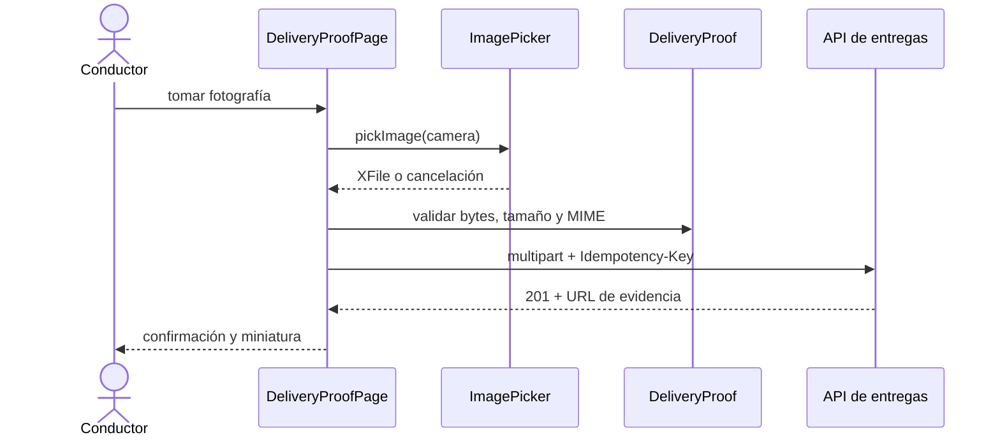

# Módulo 7: Integración con plataformas nativas

## Sílabo

**Objetivo general**

Comunicarse directamente con código nativo de Android e iOS cuando un plugin existente no cubre una necesidad específica, usando `MethodChannel` para invocar código Kotlin/Swift desde Dart, entendiendo plugins federados y el manejo de permisos de plataforma.

**Objetivos específicos**

1. Crear un `MethodChannel` que invoque código nativo Kotlin desde Dart.
2. Implementar el lado Android (Kotlin) que responde a esa invocación.
3. Implementar el lado iOS (Swift) del mismo `MethodChannel`.
4. Solicitar un permiso de plataforma y manejar el rechazo.
5. Capturar una evidencia desde cámara o galería y subirla como `multipart/form-data` sin acoplar la interfaz a Dio.

**Contenido**

- `MethodChannel`: Dart ↔ Kotlin/Swift.
- Plugins federados.
- Permisos de plataforma.
- Cuándo escribir un platform channel propio.
- Cámara, galería, validación de archivos y carga multipart.

**Evaluación**

Platform channel propio y flujo de evidencia fotográfica verificable, más cuatro ejercicios de evaluación.

---

## Contenido teórico

### Tema 1: MethodChannel

**Conceptos clave:** puente de comunicación bidireccional entre Dart y el código nativo de cada plataforma.

```dart
// Dart
const canal = MethodChannel('com.miapp/sistema');
final version = await canal.invokeMethod<String>('obtenerVersionSO');
```

```kotlin
// Android (Kotlin)
MethodChannel(flutterEngine.dartExecutor.binaryMessenger, "com.miapp/sistema")
    .setMethodCallHandler { call, result ->
        if (call.method == "obtenerVersionSO") result.success(Build.VERSION.RELEASE)
    }
```

```swift
// iOS (Swift)
let canal = FlutterMethodChannel(name: "com.miapp/sistema", binaryMessenger: controller.binaryMessenger)
canal.setMethodCallHandler { call, result in
    if call.method == "obtenerVersionSO" { result(UIDevice.current.systemVersion) }
}
```

Un `MethodChannel` establece un canal de comunicación bidireccional identificado por un nombre único de string (`"com.miapp/sistema"`) entre el código Dart y el código nativo de cada plataforma: `invokeMethod` desde Dart envía una invocación asíncrona hacia el lado nativo correspondiente, y el `setMethodCallHandler` en Kotlin (Android) o Swift (iOS) recibe esa invocación, ejecuta la lógica nativa necesaria (aquí, leer la versión del sistema operativo mediante APIs específicas de cada plataforma) y devuelve el resultado de vuelta hacia Dart de forma asíncrona.

Este mecanismo es necesario específicamente porque Dart, aunque compila a código nativo en ambas plataformas, no tiene acceso directo a las APIs específicas de cada sistema operativo (las APIs de Android están escritas en Kotlin/Java, las de iOS en Swift/Objective-C); el `MethodChannel` es el puente explícito que permite que la lógica de la app, mayoritariamente escrita en Dart, invoque esas capacidades nativas específicas de plataforma cuando sea necesario, requiriendo implementar el lado receptor por separado en cada plataforma (Kotlin para Android, Swift para iOS), dado que cada una expone sus propias APIs de sistema con su propio lenguaje nativo.

**Analogía:** un `MethodChannel` es como un servicio de traducción e intermediación entre dos oficinas que hablan idiomas distintos (Dart y el código nativo de cada plataforma): una solicitud se traduce y transmite hacia la oficina correspondiente, se procesa allí con las herramientas específicas disponibles en esa oficina, y la respuesta se traduce de vuelta hacia el idioma original del solicitante.

**¿Por qué es importante?** El `MethodChannel` es el puente explícito necesario porque Dart no tiene acceso directo a las APIs nativas específicas de cada sistema operativo, requiriendo implementar el lado receptor por separado en Kotlin (Android) y Swift (iOS), cada uno con sus propias APIs de sistema.

**Diagrama:**

```
Dart: invokeMethod('obtenerVersionSO')
   ↓
Kotlin (Android) / Swift (iOS): setMethodCallHandler procesa y responde
   ↓
Dart: recibe el resultado de vuelta
```

### Tema 2: Plugins federados

**Conceptos clave:** separación de la interfaz Dart de las implementaciones específicas por plataforma.

Un plugin federado separa formalmente la interfaz Dart pública (el conjunto de métodos y tipos que el desarrollador Flutter consume, independiente de la plataforma) de las implementaciones concretas específicas de cada plataforma (Android, iOS, web, cada una en su propio paquete separado que implementa esa misma interfaz), permitiendo que la comunidad agregue soporte para una plataforma nueva (por ejemplo, una implementación para Linux o Windows) sin necesidad de modificar el paquete principal ni las implementaciones ya existentes de otras plataformas, dado que cada implementación específica de plataforma vive de forma completamente independiente y aislada de las demás.

Esta arquitectura de plugin federado es especialmente valiosa para el ecosistema de paquetes de terceros de Flutter, donde un mismo plugin popular (por ejemplo, uno de geolocalización o de cámara) necesita mantener implementaciones nativas correctas y actualizadas para múltiples plataformas simultáneamente: separar esas implementaciones en paquetes independientes permite que distintos mantenedores, potencialmente sin ninguna relación directa entre sí, contribuyan y actualicen cada implementación de plataforma de forma independiente sin coordinar cambios en un único paquete monolítico compartido.

**Analogía:** un plugin federado es como un estándar de enchufe eléctrico universal definido de forma independiente de la implementación local específica de cada país (voltaje, forma física del conector): el estándar general permite que cualquier fabricante local implemente su propia versión conforme a las especificidades de su región, sin necesidad de coordinar cambios con los fabricantes de otras regiones.

**¿Por qué es importante?** Un plugin federado permite agregar soporte para una plataforma nueva sin modificar el paquete principal ni las implementaciones existentes de otras plataformas, facilitando que la comunidad contribuya implementaciones específicas de forma independiente y descentralizada.

**Diagrama:**

```
Paquete principal (interfaz Dart)
   ├── Implementación Android (paquete separado)
   ├── Implementación iOS (paquete separado)
   └── Implementación web (paquete separado, agregable sin tocar los demás)
```

### Tema 3: Permisos de plataforma y cuándo escribir un platform channel propio

**Conceptos clave:** manejo explícito del rechazo, búsqueda de un plugin existente antes de construir uno propio.

```dart
final estado = await Permission.camera.request();
if (estado.isGranted) { abrirCamara(); } else { mostrarMensajePermisoDenegado(); }
```

Solicitar un permiso de plataforma sensible (cámara, ubicación, contactos) requiere manejar explícitamente ambos resultados posibles: concedido (proceder con la funcionalidad que depende de ese permiso) y denegado (mostrar un mensaje apropiado explicando por qué la funcionalidad no está disponible, en vez de simplemente fallar silenciosamente o crashear al intentar usar una capacidad sin el permiso correspondiente); este es el mismo patrón de manejo de permisos estudiado en Android nativo (Módulo 2 de ese track) e iOS nativo, expuesto aquí a través de un plugin de Flutter que internamente usa `MethodChannel` para comunicarse con las APIs nativas de permisos de cada plataforma.

Escribir un platform channel propio solo se justifica cuando el plugin necesario no existe ya publicado en pub.dev (el repositorio central de paquetes Dart/Flutter), o cuando se requiere una integración muy específica de bajo nivel que ningún plugin genérico existente cubre adecuadamente para el caso de uso concreto de la app; buscar primero un plugin ya existente y mantenido por la comunidad ahorra el esfuerzo considerable de escribir y mantener código nativo duplicado por plataforma (Kotlin para Android, Swift para iOS) que un plugin ya publicado probablemente ya resolvió correctamente, incluyendo el manejo de casos límite que un platform channel propio recién escrito podría no haber considerado todavía.

**Analogía:** manejar explícitamente el rechazo de un permiso es como preparar de antemano una respuesta cortés para cuando alguien decline una solicitud, en vez de quedarse sin ningún plan de contingencia si la respuesta no es la esperada; escribir un platform channel propio antes de buscar un plugin existente es como construir una herramienta especializada desde cero sin verificar primero si ya existe una herramienta comercial probada que resuelve exactamente la misma necesidad.

**¿Por qué es importante?** Manejar explícitamente el caso de permiso denegado evita fallos silenciosos o crashes; escribir un platform channel propio solo se justifica cuando no existe ya un plugin publicado, dado que reescribir esa integración manualmente duplica esfuerzo que probablemente ya está resuelto y mantenido por la comunidad.

### Tema 4: Cámara, galería y carga multipart de una evidencia

**Conceptos clave:** `XFile`, permiso contextual, validación local, puerto de dominio, `FormData`, progreso, idempotencia y archivo temporal.

En RutaFlow construiremos la evidencia de entrega: el conductor toma una fotografía o elige una imagen, ve una previsualización y confirma antes de subirla. Capturar, validar y transferir son responsabilidades distintas. La pantalla no debe conocer cabeceras HTTP ni construir `FormData`; pide una imagen a un adaptador de dispositivo y entrega una evidencia válida a un repositorio.

**Requisitos previos:** una app creada con `flutter create rutaflow_driver`, el Módulo 5 para Dio y un emulador o dispositivo. Desde la raíz ejecuta:

```bash
flutter pub add image_picker dio mime http_parser
```

Agrega las descripciones de uso en `ios/Runner/Info.plist` (`NSCameraUsageDescription` y `NSPhotoLibraryUsageDescription`). En Android verifica la configuración exigida por la versión actual del plugin y prueba el flujo de recuperación cuando el sistema destruye la actividad por falta de memoria; no copies permisos antiguos sin revisar la plataforma objetivo.

```text
lib/features/delivery_proof/
├── domain/delivery_proof.dart
├── domain/delivery_proof_repository.dart
├── application/attach_delivery_proof.dart
├── infrastructure/image_picker_proof_source.dart
├── infrastructure/dio_delivery_proof_repository.dart
└── presentation/delivery_proof_page.dart
```

Primero representa la entrada válida en `lib/features/delivery_proof/domain/delivery_proof.dart`. El dominio no depende de `XFile`, widgets ni Dio:

```dart
import 'dart:typed_data';

final class DeliveryProof {
  DeliveryProof({required this.bytes, required this.fileName, required this.mimeType}) {
    if (bytes.isEmpty) throw ArgumentError('La imagen está vacía');
    if (bytes.lengthInBytes > 5 * 1024 * 1024) {
      throw ArgumentError('La imagen supera 5 MB');
    }
    if (!{'image/jpeg', 'image/png'}.contains(mimeType)) {
      throw ArgumentError('Formato no permitido: $mimeType');
    }
  }

  final Uint8List bytes;
  final String fileName;
  final String mimeType;
}
```

El adaptador `image_picker_proof_source.dart` convierte el resultado del plugin en un tipo propio. `pickImage` puede devolver `null`: cancelar el selector no es un error.

```dart
import 'package:image_picker/image_picker.dart';
import 'package:mime/mime.dart';

final class ImagePickerProofSource {
  ImagePickerProofSource(this._picker);
  final ImagePicker _picker;

  Future<DeliveryProof?> capture() async {
    final file = await _picker.pickImage(
      source: ImageSource.camera,
      imageQuality: 82,
      maxWidth: 1920,
    );
    if (file == null) return null;
    final bytes = await file.readAsBytes();
    return DeliveryProof(
      bytes: bytes,
      fileName: file.name,
      mimeType: lookupMimeType(file.name, headerBytes: bytes) ?? '',
    );
  }
}
```

Define en `delivery_proof_repository.dart` el contrato que necesita el caso de uso:

```dart
abstract interface class DeliveryProofRepository {
  Future<Uri> upload({
    required String deliveryId,
    required DeliveryProof proof,
    required String idempotencyKey,
    required void Function(double progress) onProgress,
  });
}
```

La implementación `dio_delivery_proof_repository.dart` traduce el contrato de dominio a HTTP. Envía un identificador de idempotencia para que reintentar después de perder la conexión no cree dos evidencias:

```dart
import 'package:dio/dio.dart';
import 'package:http_parser/http_parser.dart';

final class DioDeliveryProofRepository implements DeliveryProofRepository {
  DioDeliveryProofRepository(this._dio);
  final Dio _dio;

  @override
  Future<Uri> upload({
    required String deliveryId,
    required DeliveryProof proof,
    required String idempotencyKey,
    required void Function(double) onProgress,
  }) async {
    final response = await _dio.post<Map<String, dynamic>>(
      '/deliveries/$deliveryId/proof',
      data: FormData.fromMap({
        'file': MultipartFile.fromBytes(
          proof.bytes,
          filename: proof.fileName,
          contentType: MediaType.parse(proof.mimeType),
        ),
      }),
      options: Options(headers: {'Idempotency-Key': idempotencyKey}),
      onSendProgress: (sent, total) => onProgress(total == 0 ? 0 : sent / total),
    );
    return Uri.parse(response.data!['url'] as String);
  }
}
```



**Analogía:** la cámara obtiene el paquete, el dominio inspecciona peso y tipo, y el repositorio es la empresa transportadora. La pantalla coordina el envío, pero no necesita conocer cómo se construye el vehículo HTTP.

**¿Por qué es importante?** Una foto visible en pantalla todavía no es una evidencia persistida. Separar selección, validación y carga permite probar reglas sin cámara real, mostrar progreso, reintentar con seguridad y reemplazar Dio sin modificar el dominio.

**Resultado esperado:** al confirmar aparece progreso de 0 a 100 %, el servidor responde `201` con una URL y la interfaz cambia a «Evidencia guardada». Cancelar vuelve a la pantalla sin error; un PNG/JPEG mayor de 5 MB se rechaza antes de consumir red.

**Fallo deliberado:** activa modo avión cuando la carga llegue aproximadamente al 50 %. La interfaz debe conservar la fotografía para reintento, mostrar un error recuperable y reutilizar la misma clave de idempotencia. No marques la entrega como completada hasta recibir la confirmación del servidor.

**Modificación sin copiar:** agrega selección desde galería y compresión en un isolate. Decide mediante una prueba qué componente cambia y demuestra que `DeliveryProof` sigue sin importar paquetes de Flutter.

---

## Criterio transversal de calidad del código

Aplica estas decisiones en todos los ejemplos y en tu entrega:

- usa nombres que expresen intención, dominio y unidades; evita `data`, `temp`, `manager` o `process` cuando exista un término preciso;
- mantén funciones, componentes, clases, consultas y módulos cohesionados alrededor de una responsabilidad comprobable;
- haz visibles las dependencias y los efectos de red, tiempo, archivos, estado y base de datos;
- valida entradas en la frontera y representa errores con contexto, sin ocultar la causa ni registrar secretos;
- elimina duplicación de reglas, no toda repetición textual; una abstracción incorrecta cuesta más que dos líneas parecidas;
- escribe primero la solución más simple que satisface el requisito y refactoriza con pruebas verdes;
- aplica SOLID únicamente cuando exista una necesidad real de cambio, extensión, sustitución o aislamiento.

**SOLID con criterio:** responsabilidad única significa una razón coherente de cambio, no una clase por función. Abierto/cerrado justifica estrategias cuando hay variantes reales. Sustitución exige respetar contratos. Segregación evita obligar a consumidores a depender de operaciones que no usan. Inversión de dependencias protege el dominio frente a detalles externos; no exige crear interfaces para cada objeto.

**Comprobación antes de continuar:** ¿otra persona puede entender los nombres y el flujo?, ¿los casos de error son observables?, ¿una prueba demuestra la regla principal?, ¿cada abstracción aporta más claridad de la que cuesta? Registra una decisión de refactorización y una decisión consciente de *no abstraer*.

## Laboratorio práctico

**Objetivo del laboratorio:** construir un platform channel propio que invoca una API nativa simple desde Dart.

**Requisitos previos:** Módulo 6 completado, entorno con Android Studio y Xcode configurados.

| Paso | Acción | Código | Explicación |
|---|---|---|---|
| 1 | Crear un `MethodChannel` simple en Dart | Ver Tema 1 | Ej. obtener la versión del SO |
| 2 | Implementar el lado Android (Kotlin) | Ver Tema 1 | Responde a la invocación |
| 3 | Implementar el lado iOS (Swift) | Ver Tema 1 | Mismo `MethodChannel` |
| 4 | Solicitar un permiso de plataforma | Ver Tema 3 | Maneja el rechazo del usuario |
| 5 | Capturar y subir una evidencia | Ver Tema 4 | Valida, previsualiza y muestra progreso multipart |
| 6 | Cortar la red durante la carga | Ver Tema 4 | Conserva la evidencia y reintenta con idempotencia |

**Verificación:** el laboratorio se considera exitoso si el `MethodChannel` invoca correctamente el código nativo en ambas plataformas (Android e iOS) y devuelve el resultado esperado a Dart, y si el flujo de permisos maneja correctamente tanto la concesión como el rechazo.

**Errores comunes y soluciones**

- **Escribir un platform channel propio sin buscar primero un plugin existente en pub.dev.** Ahorra esfuerzo verificando primero si ya existe una solución mantenida por la comunidad.
- **Olvidar implementar el lado nativo en alguna de las dos plataformas.** El `MethodChannel` requiere implementación explícita en ambos lados (Kotlin e Swift) para funcionar en ambas plataformas.
- **No manejar el caso de permiso denegado.** Muestra un mensaje apropiado en vez de fallar silenciosamente o crashear.
- **Marcar la entrega completa cuando solo existe una foto local.** Espera la confirmación del backend y conserva un estado pendiente recuperable.
- **Confiar únicamente en la extensión del archivo.** Valida tipo, firma, tamaño y autorización también en el servidor.

---

## Ejercicios de evaluación

### Ejercicio 1: Cuándo escribir un platform channel propio

**Enunciado:** ¿cuándo deberías escribir un platform channel propio en vez de buscar un plugin existente?

**Solución esperada:** solo cuando el plugin necesario no existe ya publicado en pub.dev, o se requiere una integración muy específica de bajo nivel que ningún plugin genérico existente cubre adecuadamente; buscar primero un plugin existente ahorra el esfuerzo de mantener código nativo duplicado por plataforma.

**Criterios de éxito:**
- Explica correctamente la ausencia de un plugin existente adecuado como la condición para justificar un platform channel propio.

### Ejercicio 2: Qué distingue a un plugin federado

**Enunciado:** ¿qué hace un "plugin federado" distinto de un plugin simple?

**Solución esperada:** un plugin federado separa formalmente la interfaz Dart pública de las implementaciones específicas de cada plataforma, cada una en un paquete independiente, permitiendo que la comunidad agregue soporte para una plataforma nueva sin modificar el paquete principal ni las implementaciones ya existentes de otras plataformas.

**Criterios de éxito:**
- Explica correctamente la separación de interfaz e implementaciones por plataforma en paquetes independientes.

### Ejercicio 3: Por qué un MethodChannel requiere implementación en ambos lados

**Enunciado:** ¿por qué un `MethodChannel` requiere implementar el lado receptor por separado en Kotlin y en Swift?

**Solución esperada:** Dart no tiene acceso directo a las APIs nativas específicas de cada sistema operativo (las de Android están en Kotlin/Java, las de iOS en Swift/Objective-C), por lo que cada plataforma necesita su propia implementación del `setMethodCallHandler` que invoque las APIs nativas específicas correspondientes a esa plataforma.

**Criterios de éxito:**
- Explica correctamente la falta de acceso directo de Dart a las APIs nativas de cada plataforma como la razón.

### Ejercicio 4: Evidencia robusta con conectividad intermitente

**Enunciado:** diseña los estados de la pantalla desde que el conductor abre la cámara hasta que el backend confirma la evidencia. Incluye cancelación, permiso denegado, archivo inválido y pérdida de red al 50 %.

**Solución esperada:** estados explícitos como `idle`, `capturing`, `preview`, `uploading(progress)`, `saved(url)` y `failure(retryable, message)`. Cancelar vuelve a `idle`; permiso y validación muestran acciones específicas; la pérdida de red conserva la evidencia y la clave de idempotencia para reintentar; solo `saved` permite completar la entrega.

**Criterios de éxito:**
- Distingue una evidencia local, una carga en curso y una confirmación remota.
- Evita duplicados mediante idempotencia.
- Propone feedback y recuperación para cada fallo solicitado.

---

## Rúbrica del proyecto

Esta rúbrica evalúa el laboratorio y los ejercicios como evidencia de dominio, no la mera finalización de pasos.

| Criterio | Peso | Evidencia esperada |
|---|---:|---|
| Comprensión conceptual | 20% | Explica el mecanismo, sus límites y por qué la solución funciona. |
| Implementación funcional | 30% | El artefacto satisface requisitos normales, límite y de error. |
| Verificación | 20% | Incluye pruebas, mediciones o inspecciones reproducibles. |
| Diseño y calidad | 15% | Nombres, estructura, seguridad y mantenibilidad son deliberados. |
| Comunicación profesional | 15% | README, decisiones, comandos y resultados permiten repetir el trabajo. |

Se alcanza competencia con 70/100 y sin cero en implementación o verificación. El nivel experto exige comparar alternativas, justificar trade-offs y reconocer condiciones donde la solución dejaría de ser válida.

## Bibliografía y fundamento académico

Estas fuentes sustentan los conceptos y deben consultarse para verificar detalles que cambian entre versiones:

- Google, *Flutter Documentation* y guías de arquitectura y rendimiento.
- Google, *Dart Language Documentation* y *Effective Dart*.
- OWASP Foundation, *Mobile Application Security Verification Standard*.
- ACM/IEEE-CS/AAAI, *Computer Science Curricula 2023*.
- IEEE Computer Society, *SWEBOK Guide V4.0*.

## Resumen del módulo

**Puntos clave**

- Un `MethodChannel` establece comunicación bidireccional entre Dart y el código nativo de cada plataforma, requiriendo implementación separada en Kotlin e iOS Swift.
- Un plugin federado separa la interfaz Dart de las implementaciones específicas por plataforma, facilitando agregar soporte para plataformas nuevas de forma independiente.
- Manejar explícitamente el rechazo de un permiso evita fallos silenciosos o crashes.
- Escribir un platform channel propio solo se justifica cuando no existe ya un plugin publicado que cubra la necesidad.
- Cámara, validación y carga multipart son fronteras distintas y deben poder probarse por separado.

**Conceptos aprendidos**

- `MethodChannel`: Dart ↔ Kotlin/Swift.
- Plugins federados.
- Permisos de plataforma.
- Cuándo escribir un platform channel propio.
- Evidencia fotográfica, `XFile`, `FormData`, progreso e idempotencia.

**Próximos pasos**

En el Módulo 8 aprenderás animaciones y rendimiento: `AnimationController`, animaciones implícitas vs explícitas, y cómo detectar jank con Flutter DevTools.

**Recursos adicionales**

- Documentación oficial de platform channels de Flutter (docs.flutter.dev/platform-integration/platform-channels).
