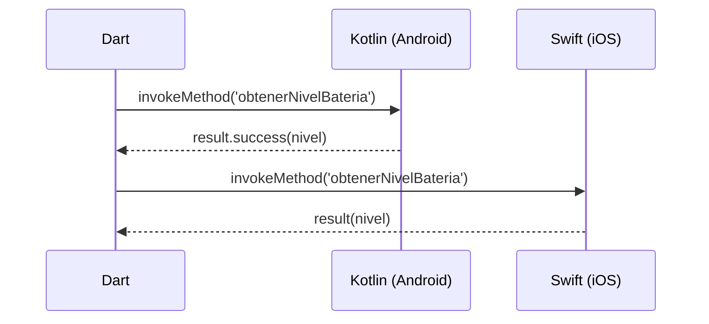
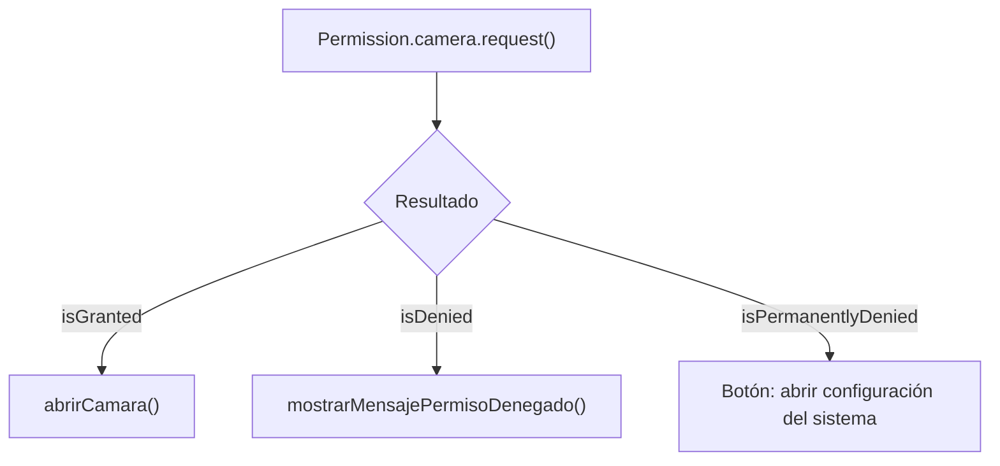
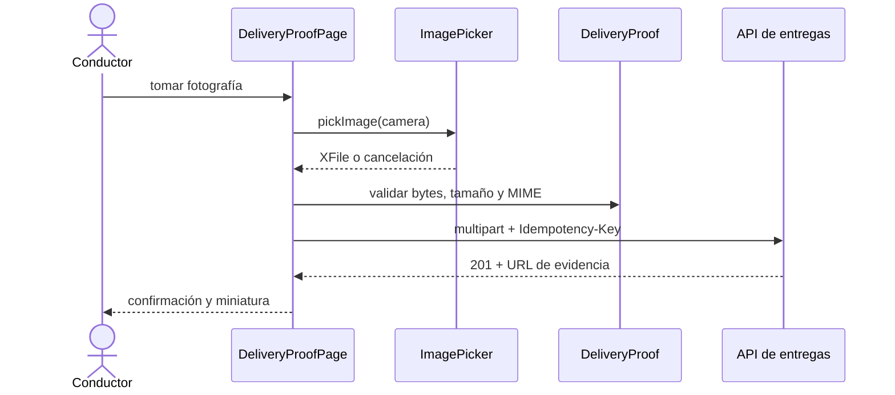

# Módulo 7: Integración con plataformas nativas


## Aprende construyendo

### Tema 1: MethodChannel

#### Paso 1 · Objetivo y preparación
Al finalizar vas a crear un `MethodChannel` que consulte el nivel de batería del dispositivo, implementado tanto en Android (Kotlin) como en iOS (Swift). Prerrequisitos: Módulo 6 completo.

#### Paso 2 · Contexto y caso real
Flutter no tiene acceso directo a las APIs nativas de batería de cada sistema operativo — necesitás un puente explícito que invoque código Kotlin en Android y Swift en iOS, cada uno con su propia forma de leer ese dato, para avisarle al conductor que cargue el teléfono antes de iniciar una ruta larga.

#### Paso 3 · Teoría, modelo mental y analogía
Un `MethodChannel` establece un canal bidireccional identificado por un nombre único; `invokeMethod` desde Dart envía la invocación, y `setMethodCallHandler` en el lado nativo responde.

#### Paso 4 · Demostración guiada desde cero
```dart
const canal = MethodChannel('com.rutaflow/bateria');
final nivel = await canal.invokeMethod<int>('obtenerNivelBateria');
```
```kotlin
MethodChannel(flutterEngine.dartExecutor.binaryMessenger, "com.rutaflow/bateria")
    .setMethodCallHandler { call, result ->
        if (call.method == "obtenerNivelBateria") result.success(obtenerNivelReal())
    }
```
Resultado esperado: llamar a `canal.invokeMethod<int>('obtenerNivelBateria')` desde Dart dispara la lógica nativa de Android, que lee el nivel real de batería del dispositivo y lo devuelve a Dart de forma asíncrona.

#### Paso 5 · Práctica guiada
Pista: implementá el `setMethodCallHandler` únicamente en Android, pero probá la app en un dispositivo iOS sin implementar el lado Swift — ese es el fallo deliberado: `invokeMethod` lanza una excepción `MissingPluginException` en tiempo de ejecución en iOS, porque no hay ningún handler nativo registrado del lado de esa plataforma para ese canal.

#### Paso 6 · Práctica independiente
Corregí el Paso 5 implementando también el `FlutterMethodChannel` del lado de Swift, y agregá un manejo explícito del caso en que `call.method` no coincide con ningún método conocido, en vez de dejarlo sin respuesta.

#### Paso 7 · Cierre y evidencia
Entregá el MethodChannel funcionando en ambas plataformas del Paso 4, el `MissingPluginException` provocado en el Paso 5, y el manejo de método desconocido del Paso 6; explicá por qué un `MethodChannel` requiere implementación explícita en cada plataforma, sin que implementarlo en una sea suficiente para la otra. Siguiente paso: estudia plugins federados. Errores comunes: implementar el lado nativo en una sola plataforma y asumir que funciona en ambas, no manejar el caso de un método invocado que no existe del lado nativo, y usar `MethodChannel` para algo que ya resuelve un plugin publicado en pub.dev. Fuentes oficiales: https://docs.flutter.dev/platform-integration/platform-channels y https://api.flutter.dev/flutter/services/MethodChannel-class.html.
**¿Por qué es importante?** El `MethodChannel` es el puente explícito necesario porque Dart no tiene acceso directo a las APIs nativas de cada sistema operativo, requiriendo implementación por separado en cada plataforma.
**Evidencia de aprendizaje:** entrega MethodChannel en ambas plataformas, MissingPluginException detectado y manejo de método desconocido agregado.
**Conceptos clave:** puente de comunicación bidireccional entre Dart y el código nativo de cada plataforma.

```dart
// Dart
const canal = MethodChannel('com.miapp/sistema');
final version = await canal.invokeMethod<String>('obtenerVersionSO');
```

```kotlin
// Android (Kotlin)
MethodChannel(flutterEngine.dartExecutor.binaryMessenger, "com.miapp/sistema")
    .setMethodCallHandler { call, result ->
        if (call.method == "obtenerVersionSO") result.success(Build.VERSION.RELEASE)
    }
```

```swift
// iOS (Swift)
let canal = FlutterMethodChannel(name: "com.miapp/sistema", binaryMessenger: controller.binaryMessenger)
canal.setMethodCallHandler { call, result in
    if call.method == "obtenerVersionSO" { result(UIDevice.current.systemVersion) }
}
```

Un `MethodChannel` establece un canal de comunicación bidireccional identificado por un nombre único de string (`"com.miapp/sistema"`) entre el código Dart y el código nativo de cada plataforma: `invokeMethod` desde Dart envía una invocación asíncrona hacia el lado nativo correspondiente, y el `setMethodCallHandler` en Kotlin (Android) o Swift (iOS) recibe esa invocación, ejecuta la lógica nativa necesaria (aquí, leer la versión del sistema operativo mediante APIs específicas de cada plataforma) y devuelve el resultado de vuelta hacia Dart de forma asíncrona.

Este mecanismo es necesario específicamente porque Dart, aunque compila a código nativo en ambas plataformas, no tiene acceso directo a las APIs específicas de cada sistema operativo (las APIs de Android están escritas en Kotlin/Java, las de iOS en Swift/Objective-C); el `MethodChannel` es el puente explícito que permite que la lógica de la app, mayoritariamente escrita en Dart, invoque esas capacidades nativas específicas de plataforma cuando sea necesario, requiriendo implementar el lado receptor por separado en cada plataforma (Kotlin para Android, Swift para iOS), dado que cada una expone sus propias APIs de sistema con su propio lenguaje nativo.

**Analogía:** un `MethodChannel` es como un servicio de traducción e intermediación entre dos oficinas que hablan idiomas distintos (Dart y el código nativo de cada plataforma): una solicitud se traduce y transmite hacia la oficina correspondiente, se procesa allí con las herramientas específicas disponibles en esa oficina, y la respuesta se traduce de vuelta hacia el idioma original del solicitante.

**¿Por qué es importante?** El `MethodChannel` es el puente explícito necesario porque Dart no tiene acceso directo a las APIs nativas específicas de cada sistema operativo, requiriendo implementar el lado receptor por separado en Kotlin (Android) y Swift (iOS), cada uno con sus propias APIs de sistema.

**Diagrama:**

```
Dart: invokeMethod('obtenerVersionSO')
   ↓
Kotlin (Android) / Swift (iOS): setMethodCallHandler procesa y responde
   ↓
Dart: recibe el resultado de vuelta
```

**Diagrama: MethodChannel bidireccional**


```mermaid
sequenceDiagram
    participant Dart
    participant Android as Kotlin (Android)
    participant iOS as Swift (iOS)
    Dart->>Android: invokeMethod('obtenerNivelBateria')
    Android-->>Dart: result.success(nivel)
    Dart->>iOS: invokeMethod('obtenerNivelBateria')
    iOS-->>Dart: result(nivel)
```

En el proyecto integrador RutaFlow, practicá este patrón creando tu propio canal en tu proyecto propio antes de depender de un plugin publicado para el mismo dato.

### Tema 2: Plugins federados

#### Paso 1 · Objetivo y preparación
Al finalizar vas a evaluar la estructura de `geolocator` (un plugin federado real) para entender cómo RutaFlow podría agregar soporte de una plataforma nueva sin tocar el paquete principal. Prerrequisitos: Tema 1 de este módulo.

#### Paso 2 · Contexto y caso real
RutaFlow usa geolocalización en Android e iOS hoy; si más adelante alguien quisiera agregar soporte para Flutter Web, necesitaría poder hacerlo sin modificar ni romper las implementaciones de Android/iOS ya probadas en producción.

#### Paso 3 · Teoría, modelo mental y analogía
Un plugin federado separa la interfaz Dart pública de las implementaciones concretas por plataforma, cada una en su propio paquete independiente.

#### Paso 4 · Demostración guiada desde cero
```text
geolocator (interfaz Dart pública)
  ├── geolocator_android (implementación Android, paquete separado)
  ├── geolocator_apple (implementación iOS/macOS, paquete separado)
  └── geolocator_web (implementación web, agregable sin tocar los demás)
```
Resultado esperado: inspeccionando pub.dev, cada implementación de plataforma de `geolocator` vive en su propio paquete versionado independientemente — actualizar `geolocator_android` no exige ni afecta ninguna modificación en `geolocator_apple`.

#### Paso 5 · Práctica guiada
Pista: imaginá que el equipo de RutaFlow decide "simplificar" copiando toda la lógica de `geolocator_android` directamente dentro del código de la app, en vez de depender del paquete federado — ese es el fallo deliberado: ahora RutaFlow tiene que mantener manualmente esa integración nativa cada vez que Android cambia sus APIs de ubicación, perdiendo las correcciones que la comunidad ya mantiene en el paquete federado real.

#### Paso 6 · Práctica independiente
Corregí el Paso 5 explicando por escrito por qué depender del paquete federado permite recibir actualizaciones de la comunidad sin esfuerzo propio, y verificá en pub.dev qué plataformas tiene actualmente soportadas `geolocator`.

#### Paso 7 · Cierre y evidencia
Entregá la estructura federada analizada del Paso 4, la decisión de copiar código desaconsejada en el Paso 5, y tu explicación del Paso 6; explicá por qué la arquitectura federada permite que la comunidad contribuya implementaciones de plataforma de forma independiente y descentralizada. Siguiente paso: estudia permisos de plataforma y cuándo escribir un platform channel propio. Errores comunes: copiar la lógica de un plugin federado en vez de depender de él, asumir que todas las plataformas de un plugin federado tienen el mismo nivel de soporte sin verificarlo, y modificar directamente el código de un paquete de terceros en vez de contribuir al repositorio real. Fuentes oficiales: https://docs.flutter.dev/packages-and-plugins/developing-packages#federated-plugins y https://pub.dev/packages/geolocator.
**¿Por qué es importante?** Un plugin federado permite agregar soporte para una plataforma nueva sin modificar el paquete principal ni las implementaciones existentes de otras plataformas.
**Evidencia de aprendizaje:** entrega estructura federada analizada, riesgo de copiar código identificado y verificación de plataformas soportadas.
**Conceptos clave:** separación de la interfaz Dart de las implementaciones específicas por plataforma.

Un plugin federado separa formalmente la interfaz Dart pública (el conjunto de métodos y tipos que el desarrollador Flutter consume, independiente de la plataforma) de las implementaciones concretas específicas de cada plataforma (Android, iOS, web, cada una en su propio paquete separado que implementa esa misma interfaz), permitiendo que la comunidad agregue soporte para una plataforma nueva (por ejemplo, una implementación para Linux o Windows) sin necesidad de modificar el paquete principal ni las implementaciones ya existentes de otras plataformas, dado que cada implementación específica de plataforma vive de forma completamente independiente y aislada de las demás.

Esta arquitectura de plugin federado es especialmente valiosa para el ecosistema de paquetes de terceros de Flutter, donde un mismo plugin popular (por ejemplo, uno de geolocalización o de cámara) necesita mantener implementaciones nativas correctas y actualizadas para múltiples plataformas simultáneamente: separar esas implementaciones en paquetes independientes permite que distintos mantenedores, potencialmente sin ninguna relación directa entre sí, contribuyan y actualicen cada implementación de plataforma de forma independiente sin coordinar cambios en un único paquete monolítico compartido.

**Analogía:** un plugin federado es como un estándar de enchufe eléctrico universal definido de forma independiente de la implementación local específica de cada país (voltaje, forma física del conector): el estándar general permite que cualquier fabricante local implemente su propia versión conforme a las especificidades de su región, sin necesidad de coordinar cambios con los fabricantes de otras regiones.

**¿Por qué es importante?** Un plugin federado permite agregar soporte para una plataforma nueva sin modificar el paquete principal ni las implementaciones existentes de otras plataformas, facilitando que la comunidad contribuya implementaciones específicas de forma independiente y descentralizada.

**Diagrama:**

```
Paquete principal (interfaz Dart)
   ├── Implementación Android (paquete separado)
   ├── Implementación iOS (paquete separado)
   └── Implementación web (paquete separado, agregable sin tocar los demás)
```

En el proyecto integrador RutaFlow, la geolocalización de `lib/features/journey/presentation/journey_controller.dart` depende de `geolocator` como ejemplo real de esta arquitectura federada. Práctica: verificá en pub.dev qué paquetes de implementación federada usa una dependencia de tu proyecto propio.

### Tema 3: Permisos de plataforma y cuándo escribir un platform channel propio

#### Paso 1 · Objetivo y preparación
Al finalizar vas a solicitar el permiso de cámara para que el conductor pueda fotografiar una evidencia de entrega, manejando explícitamente tanto la concesión como el rechazo. Prerrequisitos: Tema 2 de este módulo.

#### Paso 2 · Contexto y caso real
Si el conductor rechaza el permiso de cámara y la app simplemente intenta abrir la cámara igual sin verificar el resultado, puede crashear o quedar en un estado confuso sin ninguna explicación visible.

#### Paso 3 · Teoría, modelo mental y analogía
Solicitar un permiso sensible requiere manejar explícitamente ambos resultados posibles: concedido y denegado, mostrando un mensaje apropiado en el segundo caso.

#### Paso 4 · Demostración guiada desde cero
```dart
final estado = await Permission.camera.request();
if (estado.isGranted) {
  abrirCamara();
} else {
  mostrarMensajePermisoDenegado();
}
```
Resultado esperado: si el conductor concede el permiso, la cámara se abre normalmente; si lo rechaza, la app muestra un mensaje explicando por qué no puede fotografiar la evidencia, en vez de intentar abrir la cámara igual o quedar sin ninguna respuesta visible.

#### Paso 5 · Práctica guiada
Pista: quitá el `else` y dejá solo `if (estado.isGranted) { abrirCamara(); }` — ese es el fallo deliberado: si el conductor rechaza el permiso, la app simplemente no hace nada en absoluto, sin ningún mensaje ni indicio de por qué el botón de "Fotografiar evidencia" no tuvo ningún efecto visible.

#### Paso 6 · Práctica independiente
Corregí el Paso 5 restaurando el `else` con un mensaje explícito, y agregá un tercer caso para `estado.isPermanentlyDenied`, ofreciendo un botón que abra la configuración del sistema directamente.

#### Paso 7 · Cierre y evidencia
Entregá el manejo de concesión/rechazo del Paso 4, el silencio sin feedback provocado en el Paso 5, y el tercer caso de rechazo permanente del Paso 6; explicá por qué un permiso denegado nunca debería dejar a la app sin ninguna respuesta visible para el usuario. Siguiente paso: estudia cámara, galería y carga multipart de una evidencia. Errores comunes: no manejar el caso de permiso denegado, no distinguir rechazo simple de rechazo permanente, y escribir un platform channel propio para pedir un permiso que un plugin ya publicado resuelve. Fuentes oficiales: https://pub.dev/packages/permission_handler y https://docs.flutter.dev/platform-integration/platform-channels.
**¿Por qué es importante?** Manejar explícitamente el caso de permiso denegado evita fallos silenciosos; escribir un platform channel propio solo se justifica cuando no existe ya un plugin publicado que resuelva la necesidad.
**Evidencia de aprendizaje:** entrega manejo de concesión/rechazo, silencio sin feedback detectado y manejo de rechazo permanente.
**Conceptos clave:** manejo explícito del rechazo, búsqueda de un plugin existente antes de construir uno propio.

```dart
final estado = await Permission.camera.request();
if (estado.isGranted) { abrirCamara(); } else { mostrarMensajePermisoDenegado(); }
```

Solicitar un permiso de plataforma sensible (cámara, ubicación, contactos) requiere manejar explícitamente ambos resultados posibles: concedido (proceder con la funcionalidad que depende de ese permiso) y denegado (mostrar un mensaje apropiado explicando por qué la funcionalidad no está disponible, en vez de simplemente fallar silenciosamente o crashear al intentar usar una capacidad sin el permiso correspondiente); este es el mismo patrón de manejo de permisos estudiado en Android nativo (Módulo 2 de ese track) e iOS nativo, expuesto aquí a través de un plugin de Flutter que internamente usa `MethodChannel` para comunicarse con las APIs nativas de permisos de cada plataforma.

Escribir un platform channel propio solo se justifica cuando el plugin necesario no existe ya publicado en pub.dev (el repositorio central de paquetes Dart/Flutter), o cuando se requiere una integración muy específica de bajo nivel que ningún plugin genérico existente cubre adecuadamente para el caso de uso concreto de la app; buscar primero un plugin ya existente y mantenido por la comunidad ahorra el esfuerzo considerable de escribir y mantener código nativo duplicado por plataforma (Kotlin para Android, Swift para iOS) que un plugin ya publicado probablemente ya resolvió correctamente, incluyendo el manejo de casos límite que un platform channel propio recién escrito podría no haber considerado todavía.

**Analogía:** manejar explícitamente el rechazo de un permiso es como preparar de antemano una respuesta cortés para cuando alguien decline una solicitud, en vez de quedarse sin ningún plan de contingencia si la respuesta no es la esperada; escribir un platform channel propio antes de buscar un plugin existente es como construir una herramienta especializada desde cero sin verificar primero si ya existe una herramienta comercial probada que resuelve exactamente la misma necesidad.

**¿Por qué es importante?** Manejar explícitamente el caso de permiso denegado evita fallos silenciosos o crashes; escribir un platform channel propio solo se justifica cuando no existe ya un plugin publicado, dado que reescribir esa integración manualmente duplica esfuerzo que probablemente ya está resuelto y mantenido por la comunidad.

**Diagrama: flujo de solicitud de permiso**


```mermaid
flowchart TD
    A["Permission.camera.request()"] --> B{"Resultado"}
    B -->|isGranted| C["abrirCamara()"]
    B -->|isDenied| D["mostrarMensajePermisoDenegado()"]
    B -->|isPermanentlyDenied| E["Botón: abrir configuración del sistema"]
```

En el proyecto integrador RutaFlow, esta solicitud de permiso vive en `lib/features/delivery_proof/presentation/delivery_proof_page.dart`.

### Tema 4: Cámara, galería y carga multipart de una evidencia

#### Paso 1 · Objetivo y preparación
Al finalizar vas a construir el flujo de "evidencia de entrega": el conductor toma una fotografía, el dominio la valida (tamaño, formato) y el repositorio la sube con una clave de idempotencia. Prerrequisitos: Módulo 5 completo, `image_picker` instalado.

#### Paso 2 · Contexto y caso real
Una foto visible en pantalla todavía no es una evidencia persistida — capturar, validar y transferir son responsabilidades distintas que no deberían vivir todas juntas dentro de la misma pantalla.

#### Paso 3 · Teoría, modelo mental y analogía
El dominio no depende de `XFile` ni de Dio; valida bytes, tamaño y MIME de forma aislada; el repositorio traduce ese contrato a HTTP con una clave de idempotencia para que reintentar no duplique la evidencia.

#### Paso 4 · Demostración guiada desde cero
```dart
final class DeliveryProof {
  DeliveryProof({required this.bytes, required this.fileName, required this.mimeType}) {
    if (bytes.isEmpty) throw ArgumentError('La imagen está vacía');
    if (bytes.lengthInBytes > 5 * 1024 * 1024) throw ArgumentError('La imagen supera 5 MB');
    if (!{'image/jpeg', 'image/png'}.contains(mimeType)) throw ArgumentError('Formato no permitido: $mimeType');
  }
  final Uint8List bytes;
  final String fileName;
  final String mimeType;
}
```
Resultado esperado: construir un `DeliveryProof` con una imagen de 6 MB (o un tipo MIME no permitido) lanza un `ArgumentError` inmediatamente en el dominio, antes de que esos bytes lleguen siquiera a considerarse para una subida por red.

#### Paso 5 · Práctica guiada
Pista: activá modo avión cuando la carga llegue aproximadamente al 50% sin una clave de idempotencia estable del lado del repositorio — ese es el fallo deliberado: reintentar la subida desde cero después de recuperar la conexión puede crear una segunda evidencia en el servidor para la misma entrega, en vez de completar o reemplazar la que se cortó a la mitad.

#### Paso 6 · Práctica independiente
Corregí confirmando que la implementación reutiliza la misma `idempotencyKey` en el reintento, y que la interfaz conserva la fotografía localmente para ese reintento, sin marcar la entrega como completada hasta recibir la confirmación `201` real del servidor.

#### Paso 7 · Cierre y evidencia
Entregá el dominio con validación del Paso 4, el riesgo de evidencia duplicada del Paso 5, y la confirmación de idempotencia del Paso 6; explicá por qué separar selección, validación y transferencia permite probar las reglas de validación sin necesitar una cámara real. Siguiente paso: cerrá el módulo integrando permisos, MethodChannel y carga de evidencia en el flujo completo. Errores comunes: confiar únicamente en la extensión del archivo para validar el tipo, marcar la entrega como completa antes de la confirmación del servidor, y generar una nueva clave de idempotencia en cada reintento. Fuentes oficiales: https://pub.dev/packages/image_picker y https://pub.dev/packages/dio.
**¿Por qué es importante?** Una foto visible en pantalla todavía no es una evidencia persistida; separar selección, validación y carga permite probar reglas sin cámara real y reintentar con seguridad.
**Evidencia de aprendizaje:** entrega dominio con validación, riesgo de evidencia duplicada detectado y confirmación de idempotencia en el reintento.
**Conceptos clave:** `XFile`, permiso contextual, validación local, puerto de dominio, `FormData`, progreso, idempotencia y archivo temporal.

En esta app construiremos la evidencia de entrega: el conductor toma una fotografía o elige una imagen, ve una previsualización y confirma antes de subirla. Capturar, validar y transferir son responsabilidades distintas. La pantalla no debe conocer cabeceras HTTP ni construir `FormData`; pide una imagen a un adaptador de dispositivo y entrega una evidencia válida a un repositorio.

**Requisitos previos:** una app creada con `flutter create demo_driver`, el Módulo 5 para Dio y un emulador o dispositivo. Desde la raíz ejecuta:

```bash
flutter pub add image_picker dio mime http_parser
```

Agrega las descripciones de uso en `ios/Runner/Info.plist` (`NSCameraUsageDescription` y `NSPhotoLibraryUsageDescription`). En Android verifica la configuración exigida por la versión actual del plugin y prueba el flujo de recuperación cuando el sistema destruye la actividad por falta de memoria; no copies permisos antiguos sin revisar la plataforma objetivo.

```text
lib/features/delivery_proof/
├── domain/delivery_proof.dart
├── domain/delivery_proof_repository.dart
├── application/attach_delivery_proof.dart
├── infrastructure/image_picker_proof_source.dart
├── infrastructure/dio_delivery_proof_repository.dart
└── presentation/delivery_proof_page.dart
```

Primero representa la entrada válida en `lib/features/delivery_proof/domain/delivery_proof.dart`. El dominio no depende de `XFile`, widgets ni Dio:

```dart
import 'dart:typed_data';

final class DeliveryProof {
  DeliveryProof({required this.bytes, required this.fileName, required this.mimeType}) {
    if (bytes.isEmpty) throw ArgumentError('La imagen está vacía');
    if (bytes.lengthInBytes > 5 * 1024 * 1024) {
      throw ArgumentError('La imagen supera 5 MB');
    }
    if (!{'image/jpeg', 'image/png'}.contains(mimeType)) {
      throw ArgumentError('Formato no permitido: $mimeType');
    }
  }

  final Uint8List bytes;
  final String fileName;
  final String mimeType;
}
```

El adaptador `image_picker_proof_source.dart` convierte el resultado del plugin en un tipo propio. `pickImage` puede devolver `null`: cancelar el selector no es un error.

```dart
import 'package:image_picker/image_picker.dart';
import 'package:mime/mime.dart';

final class ImagePickerProofSource {
  ImagePickerProofSource(this._picker);
  final ImagePicker _picker;

  Future<DeliveryProof?> capture() async {
    final file = await _picker.pickImage(
      source: ImageSource.camera,
      imageQuality: 82,
      maxWidth: 1920,
    );
    if (file == null) return null;
    final bytes = await file.readAsBytes();
    return DeliveryProof(
      bytes: bytes,
      fileName: file.name,
      mimeType: lookupMimeType(file.name, headerBytes: bytes) ?? '',
    );
  }
}
```

Define en `delivery_proof_repository.dart` el contrato que necesita el caso de uso:

```dart
abstract interface class DeliveryProofRepository {
  Future<Uri> upload({
    required String deliveryId,
    required DeliveryProof proof,
    required String idempotencyKey,
    required void Function(double progress) onProgress,
  });
}
```

La implementación `dio_delivery_proof_repository.dart` traduce el contrato de dominio a HTTP. Envía un identificador de idempotencia para que reintentar después de perder la conexión no cree dos evidencias:

```dart
import 'package:dio/dio.dart';
import 'package:http_parser/http_parser.dart';

final class DioDeliveryProofRepository implements DeliveryProofRepository {
  DioDeliveryProofRepository(this._dio);
  final Dio _dio;

  @override
  Future<Uri> upload({
    required String deliveryId,
    required DeliveryProof proof,
    required String idempotencyKey,
    required void Function(double) onProgress,
  }) async {
    final response = await _dio.post<Map<String, dynamic>>(
      '/deliveries/$deliveryId/proof',
      data: FormData.fromMap({
        'file': MultipartFile.fromBytes(
          proof.bytes,
          filename: proof.fileName,
          contentType: MediaType.parse(proof.mimeType),
        ),
      }),
      options: Options(headers: {'Idempotency-Key': idempotencyKey}),
      onSendProgress: (sent, total) => onProgress(total == 0 ? 0 : sent / total),
    );
    return Uri.parse(response.data!['url'] as String);
  }
}
```


```mermaid
sequenceDiagram
  actor C as Conductor
  participant UI as DeliveryProofPage
  participant P as ImagePicker
  participant D as DeliveryProof
  participant API as API de entregas
  C->>UI: tomar fotografía
  UI->>P: pickImage(camera)
  P-->>UI: XFile o cancelación
  UI->>D: validar bytes, tamaño y MIME
  UI->>API: multipart + Idempotency-Key
  API-->>UI: 201 + URL de evidencia
  UI-->>C: confirmación y miniatura
```

**Analogía:** la cámara obtiene el paquete, el dominio inspecciona peso y tipo, y el repositorio es la empresa transportadora. La pantalla coordina el envío, pero no necesita conocer cómo se construye el vehículo HTTP.

**¿Por qué es importante?** Una foto visible en pantalla todavía no es una evidencia persistida. Separar selección, validación y carga permite probar reglas sin cámara real, mostrar progreso, reintentar con seguridad y reemplazar Dio sin modificar el dominio.

**Resultado esperado:** al confirmar aparece progreso de 0 a 100 %, el servidor responde `201` con una URL y la interfaz cambia a «Evidencia guardada». Cancelar vuelve a la pantalla sin error; un PNG/JPEG mayor de 5 MB se rechaza antes de consumir red.

**Fallo deliberado:** activa modo avión cuando la carga llegue aproximadamente al 50 %. La interfaz debe conservar la fotografía para reintento, mostrar un error recuperable y reutilizar la misma clave de idempotencia. No marques la entrega como completada hasta recibir la confirmación del servidor.

**Modificación sin copiar:** agrega selección desde galería y compresión en un isolate. Decide mediante una prueba qué componente cambia y demuestra que `DeliveryProof` sigue sin importar paquetes de Flutter.

---


## Laboratorio práctico

**Objetivo del laboratorio:** construir un platform channel propio que invoca una API nativa simple desde Dart.

**Requisitos previos:** Módulo 6 completado, entorno con Android Studio y Xcode configurados.

| Paso | Acción | Código | Explicación |
|---|---|---|---|
| 1 | Crear un `MethodChannel` simple en Dart | Ver Tema 1 | Ej. obtener la versión del SO |
| 2 | Implementar el lado Android (Kotlin) | Ver Tema 1 | Responde a la invocación |
| 3 | Implementar el lado iOS (Swift) | Ver Tema 1 | Mismo `MethodChannel` |
| 4 | Solicitar un permiso de plataforma | Ver Tema 3 | Maneja el rechazo del usuario |
| 5 | Capturar y subir una evidencia | Ver Tema 4 | Valida, previsualiza y muestra progreso multipart |
| 6 | Cortar la red durante la carga | Ver Tema 4 | Conserva la evidencia y reintenta con idempotencia |

**Verificación:** el laboratorio se considera exitoso si el `MethodChannel` invoca correctamente el código nativo en ambas plataformas (Android e iOS) y devuelve el resultado esperado a Dart, y si el flujo de permisos maneja correctamente tanto la concesión como el rechazo.

**Errores comunes y soluciones**

- **Escribir un platform channel propio sin buscar primero un plugin existente en pub.dev.** Ahorra esfuerzo verificando primero si ya existe una solución mantenida por la comunidad.
- **Olvidar implementar el lado nativo en alguna de las dos plataformas.** El `MethodChannel` requiere implementación explícita en ambos lados (Kotlin e Swift) para funcionar en ambas plataformas.
- **No manejar el caso de permiso denegado.** Muestra un mensaje apropiado en vez de fallar silenciosamente o crashear.
- **Marcar la entrega completa cuando solo existe una foto local.** Espera la confirmación del backend y conserva un estado pendiente recuperable.
- **Confiar únicamente en la extensión del archivo.** Valida tipo, firma, tamaño y autorización también en el servidor.

---
