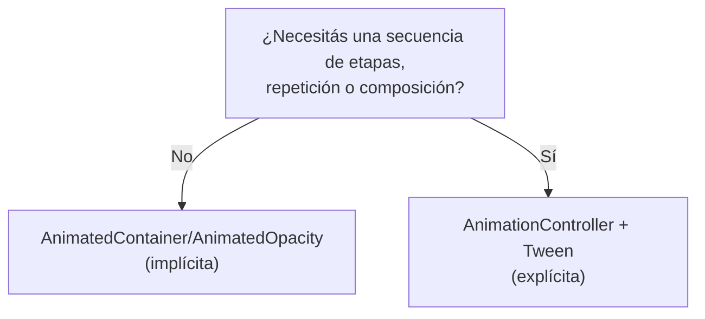
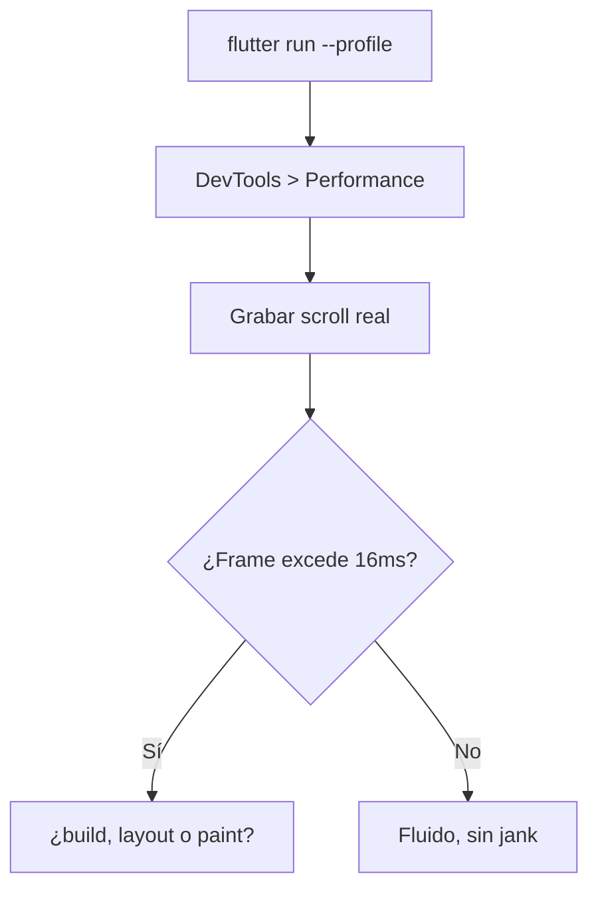
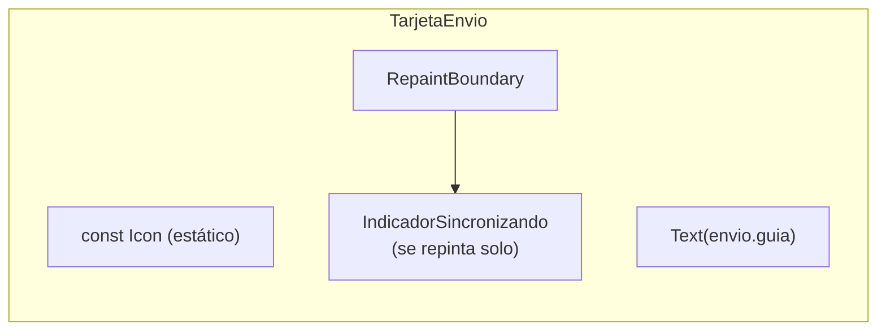

# Módulo 8: Animaciones y rendimiento


## Aprende construyendo

### Tema 1: Animaciones implícitas vs explícitas

#### Paso 1 · Objetivo y preparación
Al finalizar vas a animar la expansión de `TarjetaEnvio` al tocarla con `AnimatedContainer`, y a comparar con la misma animación implementada explícitamente con `AnimationController`. Prerrequisitos: Módulo 7 completo.

#### Paso 2 · Contexto y caso real
Al tocar una `TarjetaEnvio` en la lista, debería expandirse suavemente para mostrar la dirección completa y el historial reciente, en vez de cambiar de tamaño de golpe.

#### Paso 3 · Teoría, modelo mental y analogía
Una animación implícita interpola automáticamente entre el valor anterior y el nuevo; una explícita con `AnimationController`/`Tween` da control total sobre curvas, repetición y composición, a costa de más código.

#### Paso 4 · Demostración guiada desde cero
```dart
AnimatedContainer(
  duration: Duration(milliseconds: 300),
  height: expandida ? 160 : 72,
  child: expandida ? DetalleCompacto(envio: envio) : null,
)
```
Resultado esperado: tocar `TarjetaEnvio` cambia `expandida` y la altura del contenedor se interpola suavemente de 72 a 160 píxeles en 300ms, sin ningún código explícito de animación.

#### Paso 5 · Práctica guiada
Pista: intentá lograr que la tarjeta se expanda, pause un instante a mitad de camino, y luego continúe expandiéndose usando únicamente `AnimatedContainer` — ese es el fallo deliberado: `AnimatedContainer` solo interpola linealmente entre el valor inicial y el final, sin ninguna forma de expresar una pausa intermedia o una secuencia de múltiples etapas dentro de esa misma animación implícita.

#### Paso 6 · Práctica independiente
Corregí el Paso 5 reemplazando esa animación por un `AnimationController` con un `TweenSequence` que defina explícitamente las dos etapas, confirmando que esa secuencia coreografiada sí es posible con el control explícito.

#### Paso 7 · Cierre y evidencia
Entregá la animación implícita del Paso 4, la limitación de `AnimatedContainer` del Paso 5, y el `TweenSequence` explícito del Paso 6; explicá cuándo una animación implícita deja de ser suficiente y se necesita el control explícito de un `AnimationController`. Siguiente paso: estudia Flutter DevTools para medir si estas animaciones son realmente fluidas. Errores comunes: usar `AnimationController` para una interpolación simple que `AnimatedContainer` ya resuelve con menos código, olvidar hacer `dispose()` de un `AnimationController`, y no considerar `TweenSequence` cuando se necesita una secuencia de múltiples etapas. Fuentes oficiales: https://docs.flutter.dev/ui/animations/implicit-animations y https://docs.flutter.dev/ui/animations/tutorial.
**¿Por qué es importante?** Una animación implícita es suficiente para interpolar automáticamente entre dos valores; se necesita el control de una explícita para secuencias coreografiadas o composición de múltiples animaciones coordinadas.
**Evidencia de aprendizaje:** entrega animación implícita funcionando, limitación detectada y TweenSequence explícito implementado.
**Conceptos clave:** interpolación automática frente a control total sobre curvas y composición.

```dart
AnimatedContainer(
  duration: Duration(milliseconds: 300),
  width: expandido ? 200 : 100,
  color: expandido ? Colors.blue : Colors.grey,
)
```

`AnimatedContainer` (una animación implícita) simplemente interpola automáticamente entre el valor anterior y el nuevo cada vez que una de sus propiedades cambia (aquí, `width` y `color`), sin que el desarrollador escriba ningún código explícito de control de la animación: cambiar el valor de entrada es suficiente para disparar una transición suave automática.

```dart
class _MiAnimacionState extends State<MiAnimacion> with SingleTickerProviderStateMixin {
  late final controller = AnimationController(duration: Duration(seconds: 1), vsync: this);
  late final animacion = Tween<double>(begin: 0, end: 1).animate(controller);

  Widget build(BuildContext context) => FadeTransition(opacity: animacion, child: Text("Hola"));
}
```

Una animación explícita con `AnimationController` y `Tween` da control total sobre curvas de interpolación no lineales, repetición (loop, reverse), y composición de múltiples animaciones sincronizadas entre sí, a cambio de considerablemente más código que una animación implícita; esta elección es apropiada cuando la animación implícita simple no puede expresar el comportamiento deseado (por ejemplo, una secuencia coreografiada de múltiples animaciones distintas disparándose en momentos relativos específicos entre sí, o una animación que debe pausarse y reanudarse programáticamente en respuesta a eventos externos).

**Analogía:** una animación implícita es como encender un regulador de luz que interpola automáticamente la intensidad entre el nivel anterior y el nuevo sin necesidad de programar manualmente esa transición; una animación explícita es como un sistema de iluminación teatral completamente programable, capaz de coreografiar secuencias complejas y sincronizadas de múltiples luces, a cambio de requerir mucho más trabajo de configuración inicial.

**¿Por qué es importante?** Una animación implícita es suficiente cuando basta con interpolar automáticamente entre dos valores; se necesita el control de una explícita para curvas no lineales, repetición controlada, o composición de múltiples animaciones coordinadas entre sí.

**Código del ejemplo:**

```dart
AnimatedContainer(duration: Duration(milliseconds: 300), width: expandido ? 200 : 100)  // implícita
AnimationController(duration: Duration(seconds: 1), vsync: this)                          // explícita
```

**Diagrama: decisión implícita vs explícita**



En el proyecto integrador RutaFlow, esta animación vive en `lib/features/deliveries/presentation/delivery_list_screen.dart`. Práctica: implementá ambas versiones (implícita y explícita) sobre un widget propio de tu proyecto propio y compará el código resultante.

### Tema 2: Flutter DevTools y detección de jank

#### Paso 1 · Objetivo y preparación
Al finalizar vas a grabar con el panel de Performance de DevTools el scroll de `ListaEnvios` para identificar qué fase específica del renderizado causa frames perdidos. Prerrequisitos: Tema 1 de este módulo.

#### Paso 2 · Contexto y caso real
Varios conductores reportaron que la lista de envíos "se traba" al hacer scroll rápido en sus teléfonos — en el emulador de desarrollo se siente perfectamente fluida, lo cual no prueba nada sobre dispositivos reales de gama media.

#### Paso 3 · Teoría, modelo mental y analogía
El panel de Performance mide el tiempo real de cada frame; a 60fps cada frame tiene ~16ms de presupuesto, y DevTools señala exactamente qué fase (build, layout, paint) excedió ese presupuesto.

#### Paso 4 · Demostración guiada desde cero
```text
1. flutter run --profile (nunca en modo debug para medir performance real)
2. Abrí DevTools > pestaña Performance
3. Grabá mientras hacés scroll rápido en ListaEnvios
4. Detené la grabación y revisá los frames marcados en rojo
```
Resultado esperado: DevTools muestra que varios frames durante el scroll exceden los 16ms, y señala específicamente que la fase de "build" (no layout ni paint) consume más tiempo — apuntando a que algo dentro del método `build` de `TarjetaEnvio` es costoso.

#### Paso 5 · Práctica guiada
Pista: grabá la misma sesión pero en modo `debug` (`flutter run` sin `--profile`) y compará los tiempos de frame — ese es el fallo deliberado: en modo debug, Flutter agrega verificaciones adicionales que no existen en producción, haciendo que los tiempos medidos sean sistemáticamente peores que en un release real, llevando a conclusiones de rendimiento incorrectas.

#### Paso 6 · Práctica independiente
Corregí el Paso 5 volviendo a medir en modo `--profile`, e identificá el cálculo costoso específico dentro del `build` de `TarjetaEnvio` usando la pestaña de CPU Profiler de DevTools.

#### Paso 7 · Cierre y evidencia
Entregá la grabación en modo profile del Paso 4, la medición distorsionada en modo debug del Paso 5, y el cálculo costoso identificado en el Paso 6; explicá por qué medir rendimiento en modo debug produce conclusiones sistemáticamente equivocadas. Siguiente paso: estudia const widgets y RepaintBoundary para optimizar lo que encontraste. Errores comunes: medir rendimiento en modo debug en vez de profile/release, confiar en la percepción subjetiva de fluidez en el emulador de desarrollo, y no grabar una interacción específica real sino solo observar la app en reposo. Fuentes oficiales: https://docs.flutter.dev/tools/devtools/performance y https://docs.flutter.dev/perf/ui-performance.
**¿Por qué es importante?** DevTools mide objetivamente el tiempo real de cada frame y señala exactamente qué fase del renderizado causó un frame perdido, en vez de depender de percepción visual subjetiva.
**Evidencia de aprendizaje:** entrega grabación en modo profile, medición distorsionada en debug detectada y cálculo costoso identificado.
**Conceptos clave:** medición objetiva de tiempo de frame, no percepción subjetiva.

El panel de Performance de Flutter DevTools graba el tiempo real que toma renderizar cada frame individual de la app; a 60fps, cada frame dispone de aproximadamente 16 milisegundos para completarse (construcción, layout, pintura), y cualquier frame que exceda ese presupuesto de tiempo causa "jank" (un entrecorte visual perceptible por el usuario, una pausa o salto brusco en una animación o scroll que debería percibirse como fluido); DevTools resalta exactamente qué fase específica del renderizado (build, layout, o paint) consumió ese tiempo excesivo en el frame problemático, permitiendo diagnosticar con precisión dónde optimizar en vez de adivinar basándose en percepción visual subjetiva, el mismo principio de medición objetiva frente a percepción subjetiva estudiado con Instruments en iOS (Módulo 10 de ese track) y el Layout Inspector en Android (Módulo 10 de ese track).

Grabar una sesión real sobre una interacción específica de scroll o animación (en vez de simplemente confiar en la impresión general de que "se ve fluido" durante desarrollo) revela problemas concretos y medibles, especialmente relevante dado que el hardware de desarrollo suele ser considerablemente más potente que los dispositivos de gama media o baja donde efectivamente correrá la app en manos de usuarios reales.

**Analogía:** Flutter DevTools es como un cronómetro de precisión que mide el tiempo exacto de cada etapa de una línea de ensamblaje, revelando exactamente en qué estación específica se acumula un retraso que ralentiza toda la línea, en vez de simplemente observar que "el proceso general se siente algo lento" sin poder señalar la causa concreta.

**¿Por qué es importante?** DevTools mide objetivamente el tiempo real de cada frame y señala exactamente qué fase del renderizado causó un frame perdido, permitiendo diagnósticos precisos de rendimiento en vez de depender de percepción visual subjetiva durante desarrollo.

**Diagrama:**

```
Frame a 60fps  → presupuesto ~16ms
Frame que excede ese presupuesto → jank perceptible
DevTools señala: ¿build, layout, o paint consumió el tiempo excedido?
```

**Diagrama: flujo de diagnóstico con DevTools**



En el proyecto integrador RutaFlow, `TarjetaEnvio` que se graba en esta sesión vive en `lib/features/deliveries/presentation/delivery_list_screen.dart`.

### Tema 3: const widgets, RepaintBoundary y shouldRepaint

#### Paso 1 · Objetivo y preparación
Al finalizar vas a marcar los íconos estáticos de `TarjetaEnvio` como `const`, y a aislar con `RepaintBoundary` un indicador animado de "sincronizando" para que no fuerce repintar el resto de la tarjeta. Prerrequisitos: Tema 2 de este módulo.

#### Paso 2 · Contexto y caso real
El cálculo costoso identificado en el Tema 2 resultó ser el ícono de estado, que se reconstruye innecesariamente en cada frame aunque nunca cambia; además, un pequeño indicador animado de "sincronizando" dentro de la tarjeta fuerza repintar toda la tarjeta en cada frame de su propia animación.

#### Paso 3 · Teoría, modelo mental y analogía
Marcar un widget inmutable como `const` le permite a Flutter omitirlo por completo en reconstrucciones futuras; `RepaintBoundary` aísla una porción del árbol en su propia capa de pintura.

#### Paso 4 · Demostración guiada desde cero
```dart
Row(children: [
  const Icon(Icons.local_shipping), // estático: Flutter lo omite en reconstrucciones futuras
  Text(envio.guia),
  RepaintBoundary(child: IndicadorSincronizando()), // aísla su repintura del resto de la tarjeta
])
```
Resultado esperado: grabando de nuevo con DevTools, el ícono `const` ya no aparece en la lista de widgets reconstruidos en cada frame; el `IndicadorSincronizando` sigue animándose normalmente, pero su repintura ya no obliga a repintar el resto de `TarjetaEnvio`.

#### Paso 5 · Práctica guiada
Pista: quitá `RepaintBoundary` del indicador animado y medí de nuevo con DevTools cuántos píxeles se repintan en cada frame mientras ese indicador anima — ese es el fallo deliberado: sin `RepaintBoundary`, cada frame de la animación fuerza repintar toda la `TarjetaEnvio` circundante, aunque ninguno de esos elementos cambió realmente.

#### Paso 6 · Práctica independiente
Corregí el Paso 5 restaurando `RepaintBoundary`, y medí con DevTools (la opción "Highlight repaints") cuántas áreas de la pantalla se repintan en cada frame antes y después, confirmando la reducción.

#### Paso 7 · Cierre y evidencia
Entregá los widgets `const` y el `RepaintBoundary` del Paso 4, el repintado excesivo detectado en el Paso 5, y la medición comparativa del Paso 6; explicá por qué un elemento animado dentro de un árbol más grande necesita aislarse explícitamente con `RepaintBoundary`. Siguiente paso: cerrá el módulo integrando estas optimizaciones medibles en el proyecto completo. Errores comunes: omitir `const` en widgets estáticos dentro de listas largas, no aislar con `RepaintBoundary` elementos que se animan frecuentemente dentro de contenido mayormente estático, y aplicar estas optimizaciones sin medir primero con DevTools si realmente hacían falta. Fuentes oficiales: https://api.flutter.dev/flutter/widgets/RepaintBoundary-class.html y https://docs.flutter.dev/perf/best-practices.
**¿Por qué es importante?** Marcar un widget como `const` permite a Flutter omitirlo por completo durante reconstrucciones futuras; `RepaintBoundary` aísla repinturas frecuentes evitando que afecten innecesariamente al resto del árbol circundante.
**Evidencia de aprendizaje:** entrega widgets const y RepaintBoundary, repintado excesivo detectado y medición comparativa confirmada.
**Conceptos clave:** widgets que Flutter puede omitir por completo durante una reconstrucción.

```dart
const Text("Texto estático") // Flutter sabe que nunca cambia: lo salta en reconstrucciones futuras
```

Marcar un widget que no depende de ningún estado mutable como `const` (verificado por el compilador de Dart, que garantiza que ese widget es efectivamente inmutable en tiempo de compilación) le comunica a Flutter que ese widget específico nunca necesita reconstruirse en respuesta a cambios posteriores, permitiendo que Flutter lo omita por completo durante una reconstrucción del árbol que lo contiene, reduciendo trabajo innecesario de forma medible, especialmente en árboles de widgets grandes con muchos elementos estáticos repetidos (como iconos o textos fijos dentro de una lista larga que se reconstruye frecuentemente por otras razones).

`RepaintBoundary` aísla una porción del árbol de renderizado en su propia capa de pintura independiente, de modo que cambios visuales dentro de esa porción no fuerzan repintar el resto del árbol circundante que no cambió, útil específicamente para widgets que se animan o actualizan frecuentemente rodeados de contenido estático que no debería repintarse innecesariamente en cada frame de esa animación; `shouldRepaint` (un método que se implementa al crear un `CustomPainter` propio) permite controlar explícitamente si una repintura personalizada es realmente necesaria comparando el estado anterior contra el nuevo, evitando repinturas costosas cuando el resultado visual sería idéntico de todas formas.

**Analogía:** un widget `const` es como una pieza de decoración fija atornillada permanentemente a la pared que un equipo de mantenimiento sabe que nunca necesita revisar en cada inspección de rutina, ahorrando ese tiempo de verificación innecesario; `RepaintBoundary` es como una pared divisoria que aísla el ruido y la actividad de renovación de una habitación específica, evitando que esa actividad perturbe innecesariamente a las habitaciones adyacentes que no están siendo renovadas.

**¿Por qué es importante?** Marcar un widget como `const` permite a Flutter omitirlo por completo durante reconstrucciones futuras, reduciendo trabajo innecesario de forma medible; `RepaintBoundary` aísla repinturas frecuentes evitando que afecten innecesariamente al resto del árbol de renderizado circundante.

**Código del ejemplo:**

```dart
const Text("Texto estático")   // omitido por completo en reconstrucciones futuras
RepaintBoundary(child: WidgetQueAnimaFrecuentemente())  // aísla su repintura del resto del árbol
```

**Diagrama: aislamiento de repintura**



En el proyecto integrador RutaFlow, `TarjetaEnvio` vive en `lib/features/deliveries/presentation/delivery_list_screen.dart`. Límite de la decisión: no conviene envolver cada widget con `RepaintBoundary` "por si acaso" — cada capa de pintura adicional tiene su propio costo de memoria; usalo específicamente cuando DevTools confirma que un elemento se repinta frecuentemente dentro de contenido mayormente estático, no como optimización preventiva sin medir.

---


## Laboratorio práctico

**Objetivo del laboratorio:** construir una animación fluida propia auditada con DevTools sin frames perdidos.

**Requisitos previos:** Módulo 7 completado.

| Paso | Acción | Código | Explicación |
|---|---|---|---|
| 1 | Implementar una animación implícita con `AnimatedContainer` | Ver Tema 1 | Interpolación automática |
| 2 | Implementar la misma animación explícita con `AnimationController` | Ver Tema 1 | Compara el control que da cada enfoque |
| 3 | Grabar el rendimiento con DevTools | Ver Tema 2 | Identifica frames perdidos en scroll |
| 4 | Marcar widgets estáticos como `const` | Ver Tema 3 | Mide la reducción de rebuilds con DevTools |

**Verificación:** el laboratorio se considera exitoso si la sesión grabada en DevTools tras las optimizaciones aplicadas no muestra frames que excedan el presupuesto de ~16ms durante la interacción auditada, y si marcar widgets como `const` reduce medible mente el número de rebuilds registrados.

**Errores comunes y soluciones**

- **Usar una animación explícita cuando una implícita simple sería suficiente.** Prefiere `AnimatedContainer` u otros widgets implícitos para casos simples de interpolación directa.
- **No grabar una sesión real con DevTools, confiando solo en percepción visual.** Mide objetivamente el tiempo de frame antes de asumir que el rendimiento es adecuado.
- **Omitir `const` en widgets estáticos dentro de listas largas.** Aumenta trabajo innecesario de reconstrucción; márcalos como `const` cuando sea posible.

---
