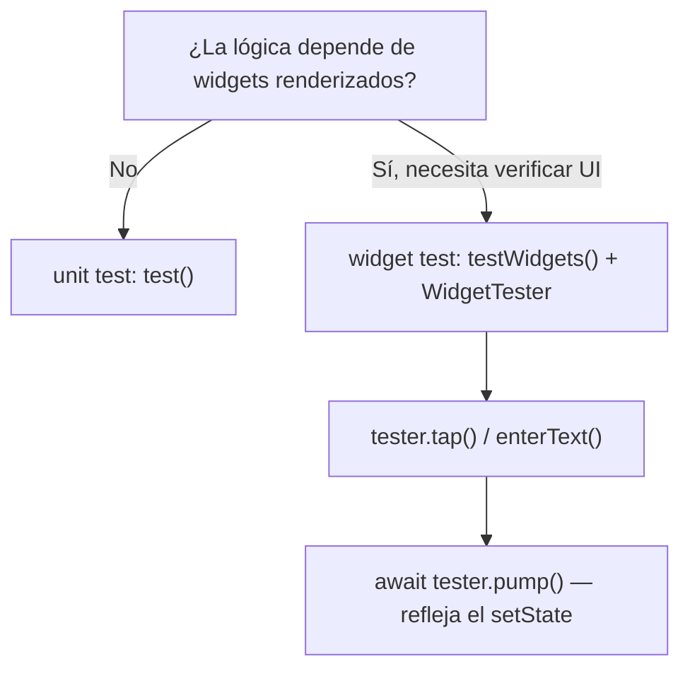
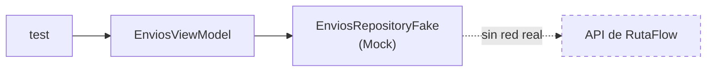
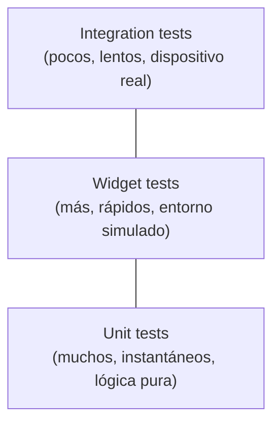

# Módulo 9: Testing en Flutter


## Aprende construyendo

### Tema 1: Unit tests y widget tests

#### Paso 1 · Objetivo y preparación
Al finalizar vas a escribir un unit test de la regla "envío atrasado" y un widget test que confirme que `TarjetaEnvio` muestra la guía correcta. Prerrequisitos: Módulo 8 completo.

#### Paso 2 · Contexto y caso real
La regla de negocio que marca un envío como "atrasado" no debería necesitar renderizar ningún widget para probarse; pero confirmar que `TarjetaEnvio` efectivamente muestra ese estado en pantalla sí necesita un entorno de renderizado, aunque no un dispositivo real completo.

#### Paso 3 · Teoría, modelo mental y analogía
Un unit test verifica lógica pura completamente aislada; un widget test usa `WidgetTester` para renderizar en un entorno simulado, sin necesidad de un dispositivo real.

#### Paso 4 · Demostración guiada desde cero
```dart
test('un envío con fecha estimada pasada está atrasado', () {
  expect(estaAtrasado(Envio(fechaEstimada: DateTime.now().subtract(Duration(hours: 1)))), isTrue);
});

testWidgets('TarjetaEnvio muestra la guía', (tester) async {
  await tester.pumpWidget(MaterialApp(home: TarjetaEnvio(guia: 'RF-4471', estado: 'en_ruta')));
  expect(find.text('RF-4471'), findsOneWidget);
});
```
Resultado esperado: el unit test verifica la regla de negocio en milisegundos sin ningún widget involucrado; el widget test renderiza `TarjetaEnvio` en un entorno simulado y confirma que el texto "RF-4471" aparece, sin necesitar un emulador completo corriendo.

#### Paso 5 · Práctica guiada
Pista: en un tercer test, simulá tocar el botón "Marcar revisado" con `tester.tap(...)` pero no llamés a `tester.pump()` después — ese es el fallo deliberado: la aserción que verifica que el ícono cambió a "revisado" falla, aunque el `onPressed` sí se ejecutó correctamente, porque el test nunca le pidió a Flutter que reconstruyera el árbol para reflejar el `setState()` disparado por ese tap.

#### Paso 6 · Práctica independiente
Corregí el Paso 5 agregando `await tester.pump()` inmediatamente después del `tap`, y confirmá que ahora la aserción sobre el ícono "revisado" pasa correctamente.

#### Paso 7 · Cierre y evidencia
Entregá el unit test y el widget test del Paso 4, el fallo por `pump()` faltante del Paso 5, y la corrección del Paso 6; explicá por qué un widget test necesita simular explícitamente el ciclo de reconstrucción que un dispositivo real haría automáticamente. Siguiente paso: estudia cómo mockear dependencias con mocktail. Errores comunes: olvidar `tester.pump()` tras simular una interacción, escribir un widget test para lógica que en realidad es pura, y buscar widgets por texto visible cuando ese texto puede cambiar por copywriting. Fuentes oficiales: https://docs.flutter.dev/cookbook/testing/widget/introduction y https://docs.flutter.dev/testing/overview.
**¿Por qué es importante?** Los widget tests verifican tanto el renderizado como la interacción en un entorno simulado considerablemente más rápido que un dispositivo real.
**Evidencia de aprendizaje:** entrega unit test y widget test, fallo por pump faltante detectado y corrección confirmada.
**Conceptos clave:** entorno simulado sin dispositivo real, considerablemente más rápido que un test end-to-end.

```dart
test('valida un email correcto', () {
  expect(esEmailValido('ana@ejemplo.com'), isTrue);
});
```

```dart
testWidgets('muestra el título de la tarea', (tester) async {
  await tester.pumpWidget(MaterialApp(home: TarjetaTarea(titulo: 'Comprar leche')));
  expect(find.text('Comprar leche'), findsOneWidget);
});

testWidgets('incrementa el contador al tocar el botón', (tester) async {
  await tester.pumpWidget(MaterialApp(home: Contador()));
  await tester.tap(find.byType(ElevatedButton));
  await tester.pump(); // reconstruye tras el setState
  expect(find.text('1'), findsOneWidget);
});
```

Un unit test verifica lógica pura (como una función de validación) completamente aislada de cualquier widget o UI, la forma más rápida y directa de testear; un widget test usa `WidgetTester` para renderizar un widget en un entorno de renderizado simulado (sin necesidad de un dispositivo físico o emulador completo corriendo), permitiendo verificar tanto el contenido renderizado (`find.text(...).assertExists`) como simular interacciones del usuario (`tester.tap(...)`) y verificar el estado resultante tras esa interacción, todo ejecutándose considerablemente más rápido que si se lanzara la app completa en un dispositivo real.

`tester.pump()` después de simular una interacción fuerza una reconstrucción del árbol de widgets, reflejando el efecto de un `setState()` disparado por esa interacción (Módulo 1); sin esa llamada explícita a `pump()`, el test no vería el resultado de la reconstrucción que la interacción disparó, dado que el entorno de test no ejecuta automáticamente un ciclo continuo de refresco como lo haría un dispositivo real corriendo la app en vivo.

**Analogía:** un unit test es como verificar una fórmula matemática de forma aislada en un pizarrón, sin ningún contexto visual; un widget test es como montar una maqueta simplificada en un taller controlado para verificar cómo se comporta visualmente un componente específico ante ciertas acciones, sin necesidad de construir el edificio completo a tamaño real para esa verificación puntual.

**¿Por qué es importante?** Los widget tests verifican tanto el renderizado como la interacción en un entorno simulado considerablemente más rápido que un dispositivo real, cerrando la brecha entre "la lógica es correcta" (unit test) y "la UI refleja correctamente esa lógica" sin el costo de un integration test completo.

**Código del ejemplo:**

```dart
testWidgets('incrementa el contador al tocar el botón', (tester) async {
  await tester.pumpWidget(MaterialApp(home: Contador()));
  await tester.tap(find.byType(ElevatedButton));
  await tester.pump();
  expect(find.text('1'), findsOneWidget);
});
```

**Diagrama: unit test vs widget test**



En el proyecto integrador RutaFlow, estos tests viven en `test/tarjeta_envio_test.dart` sobre `lib/features/deliveries/presentation/delivery_list_screen.dart`. Límite de la decisión: no conviene escribir un widget test para lógica puramente de dominio (como `estaAtrasado()`) — eso es más rápido y claro como unit test aislado; reservá el widget test específicamente para verificar que la UI refleja correctamente ese resultado.

### Tema 2: Mocking con mocktail

#### Paso 1 · Objetivo y preparación
Al finalizar vas a mockear `EnviosRepository` con `mocktail` para testear `EnviosViewModel` sin hacer ninguna llamada de red real. Prerrequisitos: Tema 1 de este módulo.

#### Paso 2 · Contexto y caso real
Testear `EnviosViewModel.cargar()` contra la API real de RutaFlow haría el test lento, dependiente de que el backend esté disponible, y frágil ante cualquier cambio en los datos reales de prueba.

#### Paso 3 · Teoría, modelo mental y analogía
`mocktail` genera un mock de una dependencia, permitiendo configurar exactamente qué debe devolver un método específico sin una implementación real completa.

#### Paso 4 · Demostración guiada desde cero
```dart
class EnviosRepositoryFake extends Mock implements EnviosRepository {}

test('el ViewModel carga envíos del repositorio', () async {
  final repo = EnviosRepositoryFake();
  when(() => repo.obtenerEnvios()).thenAnswer((_) async => [envioDePrueba]);
  final vm = EnviosViewModel(repo);
  await vm.cargar();
  expect(vm.envios, [envioDePrueba]);
});
```
Resultado esperado: el test completa en milisegundos sin ninguna conexión de red real — `EnviosRepositoryFake` responde exactamente lo configurado con `when(...).thenAnswer(...)`, sin depender de que el backend de RutaFlow esté corriendo.

#### Paso 5 · Práctica guiada
Pista: en un segundo test, llamá a `vm.cargar()` sin haber configurado ningún `when(() => repo.obtenerEnvios())` sobre el mock — ese es el fallo deliberado: `mocktail` lanza una excepción indicando que ese método no tiene ningún comportamiento configurado, en vez de devolver silenciosamente `null` o una lista vacía.

#### Paso 6 · Práctica independiente
Corregí el Paso 5 agregando el `when(...)` correspondiente antes de llamar a `cargar()`, y agregá un tercer test que configure el mock para lanzar una excepción (`thenThrow`), confirmando que `EnviosViewModel` maneja ese error sin crashear.

#### Paso 7 · Cierre y evidencia
Entregá el mock configurado del Paso 4, el error por mock sin configurar del Paso 5, y el test del camino de error del Paso 6; explicá por qué que `mocktail` falle explícitamente ante un método sin configurar ayuda a detectar tests incompletos. Siguiente paso: estudia integration tests para el flujo completo end-to-end. Errores comunes: depender de una API real en un test que debería estar aislado, no configurar el comportamiento de un método del mock antes de invocarlo, y mockear solo el camino feliz sin probar el camino de error. Fuentes oficiales: https://pub.dev/packages/mocktail y https://docs.flutter.dev/cookbook/testing/unit/mocking.
**¿Por qué es importante?** Aislar dependencias externas con `mocktail` hace los tests más rápidos y confiables, sin depender de la disponibilidad de servicios externos reales.
**Evidencia de aprendizaje:** entrega mock configurado, error por mock sin configurar detectado y test del camino de error.
**Conceptos clave:** aislar el widget bajo prueba de sus dependencias reales.

```dart
class RepositorioFake extends Mock implements TareaRepository {}

test('el ViewModel carga tareas del repositorio', () async {
  final repo = RepositorioFake();
  when(() => repo.obtenerTodas()).thenAnswer((_) async => [tareaDePrueba]);
  // ...
});
```

`mocktail` genera un mock (una implementación simulada dinámicamente) de una dependencia como `TareaRepository`, permitiendo configurar exactamente qué debe devolver un método específico cuando se invoque (`when(...).thenAnswer(...)`) sin necesidad de una implementación real completa; esto aísla el widget o la lógica bajo prueba de sus dependencias externas reales (una API real, una base de datos real), haciendo el test más rápido (sin latencia de red o disco real) y más confiable (sin depender de la disponibilidad de un servidor externo o el estado de una base de datos real que podría variar entre ejecuciones del test).

Esta necesidad de aislar dependencias externas para hacer los tests más rápidos y confiables es exactamente el mismo principio ya estudiado con repositorios fake en Android (Módulo 9 de ese track) y Kotlin Multiplatform (Módulo 9 de ese track), aunque `mocktail` usa mocks generados dinámicamente en vez de fakes escritos manualmente como implementación completa; ambos enfoques cumplen la misma función de aislamiento, con `mocktail` requiriendo menos código escrito manualmente a cambio de una capa adicional de "magia" en tiempo de ejecución que un fake explícito no tiene.

**Analogía:** mockear una dependencia con `mocktail` es como usar un maniquí programable que responde exactamente como se le indique ante una acción específica de práctica, sin necesidad de contar con la persona o el sistema real completo para ese ensayo puntual, permitiendo repetir el ensayo tantas veces como sea necesario de forma rápida y predecible.

**¿Por qué es importante?** Aislar dependencias externas con `mocktail` hace los widget tests más rápidos (sin latencia real de red/disco) y más confiables (sin depender de la disponibilidad de servicios externos reales que podrían fallar o variar entre ejecuciones del test).

**Código del ejemplo:**

```dart
class RepositorioFake extends Mock implements TareaRepository {}
when(() => repo.obtenerTodas()).thenAnswer((_) async => [tareaDePrueba]);
```

**Diagrama: aislamiento con mock**



En el proyecto integrador RutaFlow, el mock vive en `test/envios_viewmodel_test.dart` sobre `lib/features/deliveries/domain/delivery_providers.dart`. Límite de la decisión: no conviene mockear una dependencia que no tiene efectos externos reales (una función pura de cálculo, por ejemplo) — ahí llamarla directamente en el test es más simple y claro; reservá `mocktail` específicamente para dependencias con red, disco o estado externo real.

### Tema 3: Integration tests

#### Paso 1 · Objetivo y preparación
Al finalizar vas a escribir un integration test que confirme en un dispositivo o emulador real el flujo completo de confirmar una entrega. Prerrequisitos: Tema 2 de este módulo.

#### Paso 2 · Contexto y caso real
Los widget tests del Tema 1 y los mocks del Tema 2 prueban piezas aisladas — nadie confirmó todavía que el flujo completo (navegación real, formulario real, llamada real al backend de staging) funciona de punta a punta como lo experimentaría un conductor real.

#### Paso 3 · Teoría, modelo mental y analogía
Un integration test corre contra un dispositivo o emulador real, validando la integración completa de la app, incluyendo plugins nativos y navegación real.

#### Paso 4 · Demostración guiada desde cero
```dart
testWidgets('flujo completo: confirmar una entrega', (tester) async {
  await tester.pumpWidget(RutaFlowApp());
  await tester.tap(find.text('RF-4471'));
  await tester.pumpAndSettle();
  await tester.enterText(find.byType(TextField), '837201');
  await tester.tap(find.text('Confirmar'));
  await tester.pumpAndSettle();
  expect(find.text('Entrega confirmada'), findsOneWidget);
});
```
Resultado esperado: corriendo este test contra un emulador o dispositivo real, el flujo completo navega desde la lista hasta la confirmación exitosa, validando la integración real entre pantallas, formulario y backend de staging.

#### Paso 5 · Práctica guiada
Pista: reemplazá `await tester.pumpAndSettle()` después de tocar "Confirmar" por un simple `await tester.pump()` — ese es el fallo deliberado: si la confirmación depende de una animación de transición todavía en curso, la aserción final puede ejecutarse antes de que termine, y el test falla de forma intermitente según cuánto tarde la animación en cada corrida.

#### Paso 6 · Práctica independiente
Corregí el Paso 5 restaurando `pumpAndSettle()`, y agregá un segundo integration test que confirme el camino de error (PIN incorrecto), verificando que el mensaje de error aparece en el dispositivo real.

#### Paso 7 · Cierre y evidencia
Entregá el integration test del flujo feliz del Paso 4, la falla intermitente provocada en el Paso 5, y el test del camino de error del Paso 6; explicá por qué `pumpAndSettle()` es necesario específicamente en integration tests donde las animaciones reales ocurren, a diferencia de un widget test simulado donde `pump()` simple suele bastar. Siguiente paso: cerrá el módulo integrando unit tests, widget tests e integration tests en la suite completa de RutaFlow. Errores comunes: usar `pump()` simple en vez de `pumpAndSettle()` cuando hay animaciones reales en curso, escribir únicamente integration tests sin ninguna base de widget tests más rápidos, y no cubrir el camino de error en los flujos críticos. Fuentes oficiales: https://docs.flutter.dev/testing/integration-tests y https://api.flutter.dev/flutter/flutter_test/WidgetTester/pumpAndSettle.html.
**¿Por qué es importante?** Un integration test valida la integración completa contra un dispositivo real, necesario para verificar flujos críticos de principio a fin que los widget tests aislados no cubren.
**Evidencia de aprendizaje:** entrega integration test del flujo feliz, falla intermitente detectada y test del camino de error.
**Conceptos clave:** validación completa contra un dispositivo o emulador real.

```dart
testWidgets('flujo completo: crear y ver una tarea', (tester) async {
  await tester.pumpWidget(MiApp());
  await tester.tap(find.byIcon(Icons.add));
  await tester.enterText(find.byType(TextField), 'Nueva tarea');
  await tester.tap(find.text('Guardar'));
  await tester.pumpAndSettle();
  expect(find.text('Nueva tarea'), findsOneWidget);
});
```

Un integration test corre contra un dispositivo o emulador real (no el entorno de renderizado simulado de un widget test), validando la integración completa de la app tal como la experimentaría un usuario real, incluyendo la interacción real con plugins nativos, persistencia real, y navegación completa entre pantallas; `tester.pumpAndSettle()` espera a que todas las animaciones y transiciones en curso completen antes de continuar con las siguientes aserciones, apropiado específicamente en este contexto de integración completa donde las transiciones reales sí ocurren, a diferencia de un widget test simulado donde `pump()` simple suele ser suficiente.

Esta distinción de velocidad y alcance (widget test rápido en entorno simulado frente a integration test lento pero completo en dispositivo real) refleja la misma pirámide de tests estudiada en Android con Espresso (Módulo 9 de ese track) y en iOS con XCUITest (Módulo 9 de ese track): la mayoría de la suite debería ser widget tests rápidos, reservando integration tests más costosos para validar únicamente los flujos más críticos de la app de principio a fin.

**Analogía:** un integration test es como una prueba de manejo real completa del vehículo terminado en condiciones de tráfico real, mientras un widget test es como probar un componente específico del vehículo en un banco de pruebas de laboratorio controlado — ambos son necesarios, pero la prueba de manejo real es considerablemente más costosa de repetir con frecuencia.

**¿Por qué es importante?** Un widget test (entorno simulado) es rápido y aísla el componente bajo prueba sin necesidad de dispositivo real; un integration test valida la integración completa contra un dispositivo real, más lento pero necesario para verificar flujos críticos de principio a fin.

**Diagrama:**

```
Unit tests        → lógica pura, sin UI, más rápidos
Widget tests       → entorno simulado, con UI, rápidos
Integration tests   → dispositivo/emulador real, lentos, flujos completos críticos
```

**Diagrama: pirámide de tests**



En el proyecto integrador RutaFlow, este test vive en `integration_test/confirmar_entrega_test.dart`. Ejecutalo con:

```bash
flutter test integration_test/confirmar_entrega_test.dart
```

---


## Laboratorio práctico

**Objetivo del laboratorio:** construir una suite de widget tests sobre una feature completa de la app.

**Requisitos previos:** Módulo 8 completado.

| Paso | Acción | Código | Explicación |
|---|---|---|---|
| 1 | Unit test de una función pura | Ver Tema 1 | Ej. validación de formulario |
| 2 | Widget test que verifica texto renderizado | Ver Tema 1 | `WidgetTester.pumpWidget` |
| 3 | Simular un tap y verificar el estado resultante | Ver Tema 1 | `tester.tap` + `tester.pump()` |
| 4 | Mockear una dependencia con `mocktail` | Ver Tema 2 | Aísla el widget test |
| 5 | Escribir un integration test end-to-end | Ver Tema 3 | Flujo completo en dispositivo/emulador |

**Verificación:** el laboratorio se considera exitoso si la suite de widget tests pasa consistentemente con dependencias mockeadas (sin llamadas reales de red), y si el integration test completa correctamente el flujo de crear y ver una tarea en un dispositivo o emulador real.

**Errores comunes y soluciones**

- **Olvidar `tester.pump()` tras simular una interacción.** El test no verá el resultado de la reconstrucción disparada por esa interacción.
- **Depender de una API real en un widget test.** Hace el test lento y frágil; mockea la dependencia con `mocktail`.
- **Confiar únicamente en widget tests sin ningún integration test.** No cubre la validación completa de la integración real de la app en un dispositivo.

---
