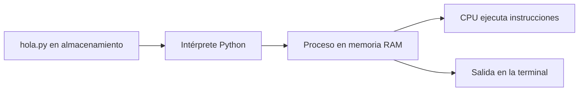
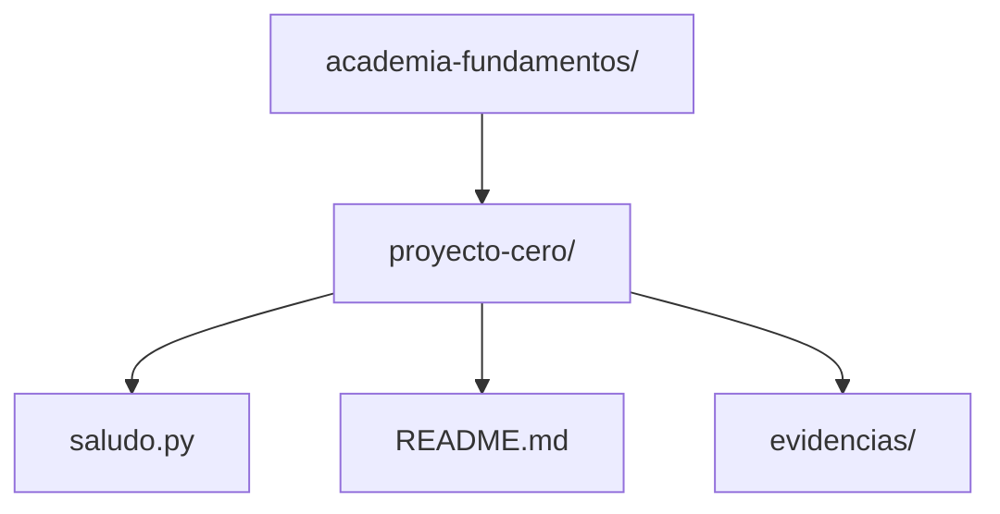
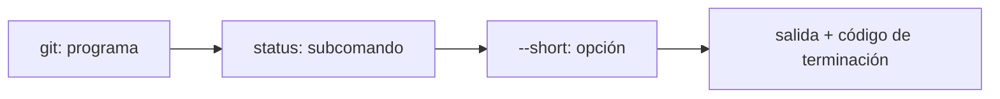
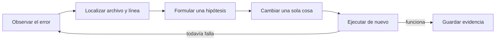

# Módulo 0: Cómo funciona tu entorno de desarrollo


## Antes de comenzar: instalación guiada

No se presupone experiencia previa. Instala Visual Studio Code y Git desde sus sitios oficiales. Para el primer programa usaremos Python porque su sintaxis mínima permite concentrarnos en el proceso; los demás tracks instalarán después sus herramientas específicas.

- **Windows:** instala Python desde `python.org` marcando **Add Python to PATH**. Abre PowerShell en VS Code y comprueba `python --version`; si no funciona, prueba `py --version`.
- **macOS:** abre Terminal y comprueba `python3 --version`. Si no está disponible, instala Homebrew desde `brew.sh` y ejecuta `brew install python git`.
- **Ubuntu/Debian:** ejecuta `sudo apt update && sudo apt install -y python3 git`. Comprueba `python3 --version` y `git --version`.

Un comando que muestra una versión demuestra dos cosas: el programa está instalado y la shell sabe localizarlo mediante `PATH`. No continúes si obtienes “comando no encontrado”; corrige primero la instalación.

## Aprende construyendo

### Tema 1: Del hardware al programa en ejecución

Ejecuta node --version para comprobar el entorno antes de continuar. **Evidencia de aprendizaje:** conserva la salida y explica qué verificaste.

Ejecuta node --version para comprobar el entorno y crea src/ejecucion.txt como evidencia.

#### Paso 1 · Objetivo y preparación
Al finalizar podrás explicar y ejecutar este concepto desde cero. Prerrequisitos: un ordenador, terminal y editor. Verifica que la terminal abre y crea una carpeta de práctica.

#### Paso 2 · Contexto y caso real
En un caso real de entregas, una aplicación convierte datos, archivos y comandos en decisiones; entender cada capa evita copiar pasos sin saber qué cambió.

#### Paso 3 · Teoría, modelo mental y analogía
El hardware ejecuta instrucciones, el sistema operativo administra recursos y el programa expresa reglas. Una ruta identifica una ubicación y un comando combina verbo, opciones y argumentos. La analogía es una cocina: ingredientes, utensilios y receta tienen responsabilidades distintas y el resultado depende de cada paso.

#### Paso 4 · Demostración guiada desde cero
Parte de una carpeta vacía:
```bash
mkdir ejemplo-fundamentos-m0
cd ejemplo-fundamentos-m0
python --version
mkdir src
printf "hola academia\n" > src/resultado.txt
cat src/resultado.txt
```
Observa la ruta, el archivo creado y la salida; explica cada comando antes de ejecutarlo.

#### Paso 5 · Práctica guiada
Pista: escribe deliberadamente una ruta incorrecta para provocar un fallo deliberado, lee el mensaje de la terminal y corrígela. Resultado esperado: el archivo se muestra sin errores.

#### Paso 6 · Práctica independiente
Crea una carpeta de proyecto con README, src y docs; documenta tres comandos, su propósito, entrada, salida y una forma segura de deshacerlos.

#### Paso 7 · Cierre y evidencia
Guarda árbol de carpetas, comandos, salida y diagnóstico; como siguiente paso instala el lenguaje de tu track. Errores comunes: ejecutar desde otra carpeta, pegar comandos desconocidos, usar rutas absolutas innecesarias y borrar sin verificar. Fuentes oficiales: https://developer.mozilla.org/es/docs/Learn/Getting_started_with_the_web y https://www.gnu.org/software/bash/manual/.
**¿Por qué es importante?** Porque leer el entorno y la terminal reduce bloqueos antes de escribir código.
**Evidencia de aprendizaje:** entrega la estructura, la salida y la explicación de cada comando.
**Conceptos clave:** CPU, memoria RAM, almacenamiento, sistema operativo, programa, proceso, entrada y salida.

Un computador combina componentes físicos y software. La **CPU** ejecuta instrucciones y realiza operaciones. La **memoria RAM** mantiene temporalmente instrucciones y datos que se están usando; es rápida, pero su contenido ordinario se pierde al apagar el equipo. El **almacenamiento** —SSD o disco— conserva archivos incluso sin energía. El **sistema operativo** coordina estos recursos y ofrece servicios para que los programas puedan abrir archivos, usar red, mostrar ventanas o crear procesos sin controlar directamente cada pieza de hardware.

Un archivo `hola.py` guardado en el SSD contiene texto: es **código fuente**. Todavía no está haciendo nada. `python` es el comando que ejecuta el intérprete de Python sobre un archivo (`python hola.py`); al correrlo, el sistema operativo crea un **proceso**, le asigna memoria y tiempo de CPU, y conecta sus canales de entrada y salida. El intérprete de Python lee el archivo, comprende sus instrucciones y las ejecuta. Cuando termina, el proceso desaparece, pero el archivo continúa almacenado.

Esta distinción evita confusiones comunes. Guardar un archivo no equivale a ejecutarlo; cerrar la terminal no elimina el código; abrir dos veces una aplicación suele crear dos procesos que proceden del mismo programa. Más adelante, un servidor será simplemente un proceso que permanece activo esperando peticiones.

```python
nombre = input("¿Cómo te llamas? ")
print(f"Hola, {nombre}. Tu primer proceso recibió una entrada y produjo una salida.")
```

La primera línea pide una entrada y guarda el texto en `nombre`. La segunda construye otro texto y lo envía a la salida estándar. No memorices la sintaxis todavía: observa el ciclo **entrada → procesamiento → salida**, presente en casi todo sistema informático.

**Analogía:** el código fuente es una receta guardada; el proceso es una persona preparando esa receta en una cocina. La receta puede existir años sin cocinarse y varias personas pueden usar copias de la misma receta simultáneamente.

**¿Por qué es importante?** Depurar exige saber si el problema pertenece al archivo, al programa que lo interpreta, al proceso en ejecución o al entorno. “Mi código no funciona” es demasiado ambiguo; “Python no encuentra el archivo” o “el proceso termina con un error en la línea 2” ya son diagnósticos útiles.



**Construcción guiada:** crea `academia-fundamentos/proyecto-cero/saludo.py`, copia el ejemplo y cambia la salida para mostrar `Operador <nombre> inició el proyecto`. Desde `proyecto-cero/` ejecuta `python3 saludo.py` (`py saludo.py` en Windows). Debes observar primero la pregunta y luego el mensaje con el nombre ingresado. Elimina una comilla, predice el tipo de error y restáurala después de localizar archivo y línea.

### Tema 2: Archivos, carpetas y rutas sin perderse

Ejecuta node --version para comprobar el entorno antes de continuar. **Evidencia de aprendizaje:** conserva la salida y explica qué verificaste.

Crea src/ruta.txt para guardar la ruta que estás practicando.

#### Paso 1 · Objetivo y preparación
Al finalizar podrás explicar y ejecutar este concepto desde cero. Prerrequisitos: un ordenador, terminal y editor. Verifica que la terminal abre y crea una carpeta de práctica.

#### Paso 2 · Contexto y caso real
En un caso real de entregas, una aplicación convierte datos, archivos y comandos en decisiones; entender cada capa evita copiar pasos sin saber qué cambió.

#### Paso 3 · Teoría, modelo mental y analogía
El hardware ejecuta instrucciones, el sistema operativo administra recursos y el programa expresa reglas. Una ruta identifica una ubicación y un comando combina verbo, opciones y argumentos. La analogía es una cocina: ingredientes, utensilios y receta tienen responsabilidades distintas y el resultado depende de cada paso.

#### Paso 4 · Demostración guiada desde cero
Parte de una carpeta vacía:
```bash
mkdir ejemplo-fundamentos-m0
cd ejemplo-fundamentos-m0
python --version
mkdir src
printf "hola academia\n" > src/resultado.txt
cat src/resultado.txt
```
Observa la ruta, el archivo creado y la salida; explica cada comando antes de ejecutarlo.

#### Paso 5 · Práctica guiada
Pista: escribe deliberadamente una ruta incorrecta para provocar un fallo deliberado, lee el mensaje de la terminal y corrígela. Resultado esperado: el archivo se muestra sin errores.

#### Paso 6 · Práctica independiente
Crea una carpeta de proyecto con README, src y docs; documenta tres comandos, su propósito, entrada, salida y una forma segura de deshacerlos.

#### Paso 7 · Cierre y evidencia
Guarda árbol de carpetas, comandos, salida y diagnóstico; como siguiente paso instala el lenguaje de tu track. Errores comunes: ejecutar desde otra carpeta, pegar comandos desconocidos, usar rutas absolutas innecesarias y borrar sin verificar. Fuentes oficiales: https://developer.mozilla.org/es/docs/Learn/Getting_started_with_the_web y https://www.gnu.org/software/bash/manual/.
**¿Por qué es importante?** Porque leer el entorno y la terminal reduce bloqueos antes de escribir código.
**Evidencia de aprendizaje:** entrega la estructura, la salida y la explicación de cada comando.
**Conceptos clave:** archivo, directorio, raíz, carpeta actual, ruta absoluta, ruta relativa y extensión.

El sistema de archivos organiza información como una jerarquía. Una carpeta puede contener archivos y otras carpetas. Cada elemento tiene una ruta que indica dónde se encuentra. Una **ruta absoluta** comienza en la raíz del sistema y no depende de dónde estás; una **ruta relativa** parte de la carpeta de trabajo actual.

En Windows una ruta absoluta puede ser `C:\Users\Ana\academia\hola.py`. En macOS o Linux puede ser `/home/ana/academia/hola.py` o `/Users/Ana/academia/hola.py`. Aunque los separadores cambian, la idea es idéntica. La ruta relativa `proyectos/hola.py` solo tiene sentido si conocemos la carpeta actual.

```bash
pwd
mkdir academia
cd academia
mkdir primer-programa
cd primer-programa
```

`pwd` muestra dónde estás. `mkdir` crea una carpeta. `cd` cambia la carpeta de trabajo. En PowerShell, `pwd` también funciona; `Get-Location` es su nombre completo. Después de cada `cd`, ejecuta `pwd` y explica cómo cambió la ruta. Para volver a la carpeta padre usa `cd ..`.

Las extensiones como `.py`, `.java`, `.js` o `.md` son parte del nombre y ayudan a herramientas y personas a reconocer el formato. No convierten mágicamente el contenido: renombrar una imagen como `.py` no la transforma en programa.

**Analogía:** una ruta es una dirección postal. La ruta absoluta incluye país, ciudad, calle y número; una relativa dice “dos puertas a la derecha” y solo funciona si conocemos el punto de partida.

**¿Por qué es importante?** Gran parte de los errores iniciales no son de programación: la terminal está en otra carpeta, el archivo fue guardado con doble extensión o el comando usa una ruta equivocada. Orientarse evita ejecutar instalaciones o eliminaciones en el lugar incorrecto.



**Construcción guiada:** crea exactamente la estructura del diagrama con `mkdir -p academia-fundamentos/proyecto-cero/evidencias` en macOS/Linux. En PowerShell usa `New-Item -ItemType Directory -Force academia-fundamentos/proyecto-cero/evidencias`. Entra en `proyecto-cero`, ejecuta `pwd` y lista el contenido. La evidencia es una captura textual de la ruta y el árbol; desde una carpeta equivocada, `python3 saludo.py` debe fallar y enseñarte a verificar ubicación antes de editar código.

### Tema 3: Cómo leer un comando antes de ejecutarlo

Ejecuta node --version para comprobar el entorno antes de continuar. **Evidencia de aprendizaje:** conserva la salida y explica qué verificaste.

Crea src/comando.txt y registra verbo, opciones y argumentos antes de ejecutar.

#### Paso 1 · Objetivo y preparación
Al finalizar podrás explicar y ejecutar este concepto desde cero. Prerrequisitos: un ordenador, terminal y editor. Verifica que la terminal abre y crea una carpeta de práctica.

#### Paso 2 · Contexto y caso real
En un caso real de entregas, una aplicación convierte datos, archivos y comandos en decisiones; entender cada capa evita copiar pasos sin saber qué cambió.

#### Paso 3 · Teoría, modelo mental y analogía
El hardware ejecuta instrucciones, el sistema operativo administra recursos y el programa expresa reglas. Una ruta identifica una ubicación y un comando combina verbo, opciones y argumentos. La analogía es una cocina: ingredientes, utensilios y receta tienen responsabilidades distintas y el resultado depende de cada paso.

#### Paso 4 · Demostración guiada desde cero
Parte de una carpeta vacía:
```bash
mkdir ejemplo-fundamentos-m0
cd ejemplo-fundamentos-m0
mkdir src
printf "hola academia\n" > src/resultado.txt
cat src/resultado.txt
```
Observa la ruta, el archivo creado y la salida; explica cada comando antes de ejecutarlo.

#### Paso 5 · Práctica guiada
Pista: escribe deliberadamente una ruta incorrecta para provocar un fallo deliberado, lee el mensaje de la terminal y corrígela. Resultado esperado: el archivo se muestra sin errores.

#### Paso 6 · Práctica independiente
Crea una carpeta de proyecto con README, src y docs; documenta tres comandos, su propósito, entrada, salida y una forma segura de deshacerlos.

#### Paso 7 · Cierre y evidencia
Guarda árbol de carpetas, comandos, salida y diagnóstico; como siguiente paso instala el lenguaje de tu track. Errores comunes: ejecutar desde otra carpeta, pegar comandos desconocidos, usar rutas absolutas innecesarias y borrar sin verificar. Fuentes oficiales: https://developer.mozilla.org/es/docs/Learn/Getting_started_with_the_web y https://www.gnu.org/software/bash/manual/.
**¿Por qué es importante?** Porque leer el entorno y la terminal reduce bloqueos antes de escribir código.
**Evidencia de aprendizaje:** entrega la estructura, la salida y la explicación de cada comando.
**Conceptos clave:** terminal, shell, prompt, comando, opción, argumento, salida estándar, salida de error y código de salida.

La **terminal** es la interfaz de texto. La **shell** es el programa que interpreta lo escrito: PowerShell en Windows, zsh en macOS o Bash en muchas distribuciones Linux. El prompt indica que la shell espera instrucciones. Un comando suele contener el nombre del programa, opciones que modifican su comportamiento y argumentos que indican sobre qué trabajar.

```bash
python3 hola.py
```

Aquí `python3` es el programa y `hola.py` es el argumento. En Windows puede ser `python hola.py` o `py hola.py`. Otro ejemplo:

```bash
git status --short
```

`git` es el programa, `status` es un subcomando y `--short` es una opción. Antes de pegar algo, identifica cada parte. Si aparece `sudo`, detente: solicita privilegios administrativos y debes comprender por qué son necesarios.

Los programas pueden escribir en salida estándar y salida de error. También devuelven un número al terminar: por convenio, `0` significa éxito y otro valor indica algún tipo de fallo. En Bash/zsh puedes consultar el último código con `echo $?`; en PowerShell puedes revisar `$LASTEXITCODE`.

```bash
python3 archivo-que-no-existe.py
echo $?
```

El error no es un castigo: contiene el nombre buscado y explica que no existe. El procedimiento correcto es leerlo completo, verificar `pwd`, listar archivos con `ls` (`dir` también funciona en PowerShell) y corregir ruta o nombre.

**Analogía:** un comando es una frase imperativa: verbo, modificadores y objeto. En “copia rápidamente informe.txt”, copiar es la acción, rápidamente modifica cómo se realiza e informe.txt es el objeto.

**¿Por qué es importante?** Un profesional no evalúa un comando por si “parece funcionar”, sino por su intención, salida y código de terminación. Esta disciplina es esencial en automatización y CI/CD, donde nadie observa manualmente la pantalla.



**Construcción guiada:** dentro de `academia-fundamentos/proyecto-cero/`, ejecuta `git init`, `git status --short` y consulta el código de salida. Crea `README.md` y repite el estado: ahora debe aparecer `?? README.md`. Predice qué ocurrirá con `git status --opcion-inexistente`, ejecútalo y registra mensaje y código en `evidencias/comandos.md`. No continúes hasta explicar programa, subcomando, opción y resultado.

### Tema 4: Primer programa, primer error y primera evidencia

Ejecuta node --version para comprobar el entorno antes de continuar. **Evidencia de aprendizaje:** conserva la salida y explica qué verificaste.

#### Paso 1 · Objetivo y preparación
Al finalizar podrás explicar y ejecutar este concepto desde cero. Prerrequisitos: un ordenador, terminal y editor. Verifica que la terminal abre y crea una carpeta de práctica.

#### Paso 2 · Contexto y caso real
En un caso real de entregas, una aplicación convierte datos, archivos y comandos en decisiones; entender cada capa evita copiar pasos sin saber qué cambió.

#### Paso 3 · Teoría, modelo mental y analogía
El hardware ejecuta instrucciones, el sistema operativo administra recursos y el programa expresa reglas. Una ruta identifica una ubicación y un comando combina verbo, opciones y argumentos. La analogía es una cocina: ingredientes, utensilios y receta tienen responsabilidades distintas y el resultado depende de cada paso.

#### Paso 4 · Demostración guiada desde cero
Parte de una carpeta vacía:
```bash
mkdir ejemplo-fundamentos-m0
cd ejemplo-fundamentos-m0
mkdir src
printf "hola academia\n" > src/resultado.txt
cat src/resultado.txt
```
Observa la ruta, el archivo creado y la salida; explica cada comando antes de ejecutarlo.

#### Paso 5 · Práctica guiada
Pista: escribe deliberadamente una ruta incorrecta para provocar un fallo deliberado, lee el mensaje de la terminal y corrígela. Resultado esperado: el archivo se muestra sin errores.

#### Paso 6 · Práctica independiente
Crea una carpeta de proyecto con README, src y docs; documenta tres comandos, su propósito, entrada, salida y una forma segura de deshacerlos.

#### Paso 7 · Cierre y evidencia
Guarda árbol de carpetas, comandos, salida y diagnóstico; como siguiente paso instala el lenguaje de tu track. Errores comunes: ejecutar desde otra carpeta, pegar comandos desconocidos, usar rutas absolutas innecesarias y borrar sin verificar. Fuentes oficiales: https://developer.mozilla.org/es/docs/Learn/Getting_started_with_the_web y https://www.gnu.org/software/bash/manual/.
**¿Por qué es importante?** Porque leer el entorno y la terminal reduce bloqueos antes de escribir código.
**Evidencia de aprendizaje:** entrega la estructura, la salida y la explicación de cada comando.
**¿Por qué es importante?** Aprender a leer el primer error y conservar evidencia convierte la ejecución en un proceso reproducible, no en ensayo al azar.

**Conceptos clave:** editor, código fuente, ejecución, mensaje de error, hipótesis, corrección, reproducibilidad y README.

Abre la carpeta `primer-programa` en Visual Studio Code. Crea `hola.py` y escribe el ejemplo del Tema 1 manualmente. Guardar con `Ctrl+S` o `Cmd+S` garantiza que la terminal lea la versión actual. Ejecuta el archivo desde la terminal integrada.

```bash
python3 hola.py
```

Introduce tu nombre y observa la salida. Después elimina deliberadamente el paréntesis final de `print(...)` y vuelve a ejecutar. Python mostrará un `SyntaxError` y señalará una ubicación. Sigue este método:

1. Lee el error completo.
2. Identifica tipo, archivo y línea.
3. Formula una hipótesis en una frase.
4. Cambia una sola cosa.
5. Ejecuta de nuevo.
6. Conserva evidencia del antes y después.

No cambies diez líneas al azar. Si el programa vuelve a funcionar no sabrás cuál cambio resolvió el problema. Restaurado el paréntesis, crea `README.md`:

```markdown
# Mi primer programa

## Cómo ejecutarlo
python3 hola.py

## Resultado esperado
Pregunta el nombre y muestra un saludo.

## Error investigado
Eliminé un paréntesis, obtuve SyntaxError y lo corregí en la línea indicada.
```

Un README permite que otra persona reproduzca el resultado. Esta es la primera forma de comunicación técnica y será obligatoria en los proyectos posteriores.

**Analogía:** depurar se parece al método científico: observas, propones una hipótesis, haces un cambio controlado y vuelves a medir. Cambiar cosas al azar equivale a mezclar varios experimentos y perder la posibilidad de aprender.

**¿Por qué es importante?** La programación profesional consiste tanto en comprender fallos como en escribir código correcto. Documentar comandos, entorno y resultados transforma una demostración personal en evidencia reproducible.



**Construcción guiada:** guarda la versión correcta de `saludo.py`, una versión rota temporal y la explicación del diagnóstico en `evidencias/primer-error.md`. Ejecuta desde una terminal nueva siguiendo únicamente el README. El capítulo queda terminado cuando otra persona reproduce el saludo, provoca el mismo `SyntaxError` y lo corrige sin preguntarte qué carpeta abrir.


## Construcción guiada del capítulo

**Proyecto cero: evidencia reproducible desde una carpeta vacía**

1. Abre una terminal y registra `pwd`.
2. Crea `academia/primer-programa` exclusivamente con comandos.
3. Abre esa carpeta en VS Code.
4. Crea `hola.py`, ejecútalo y guarda la salida.
5. Provoca dos errores distintos: archivo inexistente y error de sintaxis.
6. Para cada error registra mensaje, hipótesis, corrección y nueva salida.
7. Crea un README que permita repetir todo desde cero.
8. Inicializa Git con `git init`, agrega archivos con `git add .` y crea el primer commit con `git commit -m "Crear primer programa reproducible"`.

**Verificación:** otra persona debe poder seguir el README en una carpeta nueva y obtener el mismo resultado sin preguntarte pasos omitidos. `git status` debe mostrar un árbol limpio después del commit.

**Errores comunes y soluciones**

- **“python no se reconoce”.** La instalación o `PATH` no está listo; abre una terminal nueva y prueba el comando específico de tu sistema.
- **“No such file or directory”.** Comprueba `pwd`, lista archivos y revisa mayúsculas, extensión y ruta.
- **Editar sin guardar.** Activa Auto Save o guarda antes de ejecutar.
- **Pegar comandos administrativos.** Detente y comprende cada parte antes de aceptar privilegios.
