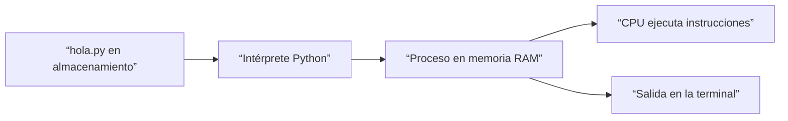
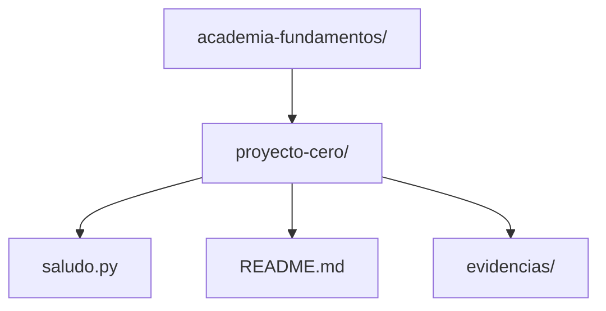
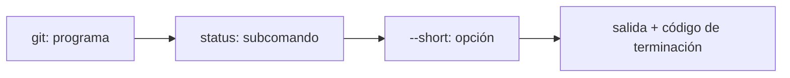
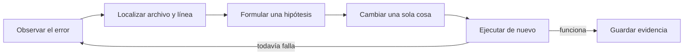

# Módulo 0: Cómo funciona tu entorno de desarrollo


## Antes de comenzar: instalación guiada

No se presupone experiencia previa. Instala Visual Studio Code y Git desde sus sitios oficiales. Para el primer programa usaremos Python porque su sintaxis mínima permite concentrarnos en el proceso; los demás tracks instalarán después sus herramientas específicas.

- **Windows:** instala Python desde `python.org` marcando **Add Python to PATH**. Abre PowerShell en VS Code y comprueba `python --version`; si no funciona, prueba `py --version`.
- **macOS:** abre Terminal y comprueba `python3 --version`. Si no está disponible, instala Homebrew desde `brew.sh` y ejecuta `brew install python git`.
- **Ubuntu/Debian:** ejecuta `sudo apt update && sudo apt install -y python3 git`. Comprueba `python3 --version` y `git --version`.

Un comando que muestra una versión demuestra dos cosas: el programa está instalado y la shell sabe localizarlo mediante `PATH`. No continúes si obtienes “comando no encontrado”; corrige primero la instalación.

## Aprende construyendo

### Tema 1: Del hardware al programa en ejecución

#### Paso 1 · Objetivo y preparación
Al finalizar vas a ejecutar un programa Python que pide un nombre y saluda, observar su ciclo entrada→proceso→salida, y comprobar qué parte de su trabajo sobrevive si el proceso se interrumpe a mitad de una escritura. **Prerrequisitos:** Python instalado; comprueba `python3 --version` (o `py --version` en Windows).

#### Paso 2 · Contexto y caso real
El proyecto integrador Fundamentos (un gestor de tareas por terminal) va a guardar cada tarea en un archivo. Si el proceso se cierra justo mientras escribe ese archivo —por ejemplo, al cerrar la terminal de golpe—, el resultado depende de si esos datos ya llegaron a almacenamiento o todavía estaban solo en la memoria RAM del proceso.

#### Paso 3 · Teoría, modelo mental y analogía
Un archivo guardado en disco es código fuente inerte; recién se convierte en un **proceso** —con su propia memoria y tiempo de CPU asignado por el sistema operativo— cuando lo ejecutás. Mientras el proceso corre, sus variables viven en RAM (rápida, pero se pierde si el proceso termina abruptamente); solo lo que explícitamente se escribió a disco con una operación de archivo persiste. La analogía: la receta guardada en papel (código fuente) no alimenta a nadie hasta que alguien la cocina (el proceso) — y si la cocina se incendia a mitad de la receta, lo que ya sirvió en el plato (datos en disco) sobrevive, lo que seguía en la olla (datos en RAM) no.

#### Paso 4 · Demostración guiada desde cero
```bash
mkdir -p academia-fundamentos/proyecto-cero
cd academia-fundamentos/proyecto-cero
```
Crea `saludo.py`:
```python
nombre = input("¿Cómo te llamas? ")
with open("evidencia.txt", "w") as f:
    f.write(f"Hola, {nombre}. Tu primer proceso recibió una entrada y produjo una salida.\n")
print("Guardado en evidencia.txt")
```
```bash
python3 saludo.py
cat evidencia.txt
```
**Resultado esperado:** la terminal pregunta tu nombre, y `evidencia.txt` contiene el saludo completo — confirmando que el `write()` dentro del bloque `with` ya llegó a disco antes de que el proceso terminara normalmente.

**Fallo deliberado:** cambiá el script para que, DESPUÉS de escribir el archivo, entre en un bucle infinito (`while True: pass`) simulando que el proceso nunca llega a terminar limpio — ejecutalo y, antes de que termine por sí solo, interrumpilo con Ctrl+C. Volvé a revisar `evidencia.txt`: el contenido SÍ está completo, porque el `write()` dentro del `with` ya se había ejecutado y cerrado el archivo antes del bucle infinito. Ahora probá lo contrario: movés el `while True: pass` ANTES del bloque `with open(...)` — interrumpido con Ctrl+C en ese punto, `evidencia.txt` ni siquiera se crea, porque el proceso nunca llegó a ejecutar esa línea.

#### Paso 5 · Práctica guiada
Pista: el momento exacto en el que interrumpís el proceso (antes o después del `write()`) es lo que determina si los datos sobrevivieron — no hay ninguna garantía intermedia; o se ejecutó la escritura completa, o no se ejecutó en absoluto.

#### Paso 6 · Práctica independiente
Agregá una segunda línea al archivo con `f.write(...)` ANTES de cerrar el `with`, y confirmá (interrumpiendo el proceso en distintos puntos con `time.sleep` de prueba) que mientras el bloque `with` no haya terminado de ejecutarse completo, ninguna de sus escrituras es visible desde afuera del proceso.

#### Paso 7 · Cierre y evidencia
Entregá la ejecución normal del Paso 4, los dos casos de interrupción del Paso 5 (antes y después del `write()`), y la prueba de las dos escrituras del Paso 6; explicá por qué "¿llegó a disco?" depende del punto exacto de interrupción, no de que el programa "se viera bien" al ejecutarlo. Como siguiente paso, en el Tema 2 vas a trabajar con rutas absolutas y relativas para que tu programa encuentre ese mismo archivo sin perderse. Errores comunes: asumir que una variable en RAM sobrevive si el proceso termina mal; no cerrar explícitamente un archivo abierto fuera de un bloque `with`. Fuentes oficiales: https://docs.python.org/es/3/tutorial/inputoutput.html y https://docs.python.org/es/3/reference/datamodel.html.

**¿Por qué es importante?** Depurar exige saber si el problema pertenece al archivo, al proceso en ejecución o al momento exacto de una interrupción; "mi código no funciona" es demasiado ambiguo, pero "el proceso murió antes del write()" ya es un diagnóstico verificable.

**Evidencia de aprendizaje:** entrega la ejecución normal, los dos casos de interrupción (antes/después del write) y la prueba con dos escrituras independientes.

**Conceptos clave:** CPU, memoria RAM, almacenamiento, proceso, entrada y salida, persistencia.

Un computador combina componentes físicos y software. La **CPU** ejecuta instrucciones y realiza operaciones. La **memoria RAM** mantiene temporalmente instrucciones y datos que se están usando; es rápida, pero su contenido ordinario se pierde al apagar el equipo. El **almacenamiento** —SSD o disco— conserva archivos incluso sin energía. El **sistema operativo** coordina estos recursos y ofrece servicios para que los programas puedan abrir archivos, usar red, mostrar ventanas o crear procesos sin controlar directamente cada pieza de hardware.

Un archivo `hola.py` guardado en el SSD contiene texto: es **código fuente**. Todavía no está haciendo nada. `python` es el comando que ejecuta el intérprete de Python sobre un archivo (`python hola.py`); al correrlo, el sistema operativo crea un **proceso**, le asigna memoria y tiempo de CPU, y conecta sus canales de entrada y salida. El intérprete de Python lee el archivo, comprende sus instrucciones y las ejecuta. Cuando termina, el proceso desaparece, pero el archivo continúa almacenado.

Esta distinción evita confusiones comunes. Guardar un archivo no equivale a ejecutarlo; cerrar la terminal no elimina el código; abrir dos veces una aplicación suele crear dos procesos que proceden del mismo programa. Más adelante, un servidor será simplemente un proceso que permanece activo esperando peticiones.

```python
nombre = input("¿Cómo te llamas? ")
print(f"Hola, {nombre}. Tu primer proceso recibió una entrada y produjo una salida.")
```

La primera línea pide una entrada y guarda el texto en `nombre`. La segunda construye otro texto y lo envía a la salida estándar. No memorices la sintaxis todavía: observa el ciclo **entrada → procesamiento → salida**, presente en casi todo sistema informático.

**Analogía:** el código fuente es una receta guardada; el proceso es una persona preparando esa receta en una cocina. La receta puede existir años sin cocinarse y varias personas pueden usar copias de la misma receta simultáneamente.

**¿Por qué es importante?** Depurar exige saber si el problema pertenece al archivo, al programa que lo interpreta, al proceso en ejecución o al entorno. “Mi código no funciona” es demasiado ambiguo; “Python no encuentra el archivo” o “el proceso termina con un error en la línea 2” ya son diagnósticos útiles.


```mermaid
flowchart LR
  File[“hola.py en almacenamiento”] --> Interpreter[“Intérprete Python”]
  Interpreter --> Process[“Proceso en memoria RAM”]
  Process --> CPU[“CPU ejecuta instrucciones”]
  Process --> Output[“Salida en la terminal”]
```

**Construcción guiada:** crea `academia-fundamentos/proyecto-cero/saludo.py`, copia el ejemplo y cambia la salida para mostrar `Operador <nombre> inició el proyecto`. Desde `proyecto-cero/` ejecuta `python3 saludo.py` (`py saludo.py` en Windows). Debes observar primero la pregunta y luego el mensaje con el nombre ingresado. Elimina una comilla, predice el tipo de error y restáurala después de localizar archivo y línea.

**Conceptos clave:** CPU, memoria RAM, almacenamiento, sistema operativo, programa, proceso, entrada y salida.

#### Profundización · Diseño: Diagrama CPU/RAM/Almacenamiento para tu programa

**Escenario real:** El gestor de tareas CLI (proyecto integrador Fundamentos) ejecuta un script `saludo.py` que pide nombre, guarda datos y luego los carga. Necesitas entender dónde vive cada cosa mientras se ejecuta.

**Tu tarea (sin mirar solución):**

1. **Dibuja:** Cuando ejecutas `python saludo.py`, ¿dónde reside el archivo, el intérprete, el proceso y la salida?
2. **Identifica:** ¿Cuál se pierde al apagar la computadora?, ¿cuál permanece?, ¿cuál es más rápido?
3. **Traza:** Un dato ingresado en `input()` ¿pasa por CPU, RAM y almacenamiento en qué orden?
4. **Diseña:** Si el programa falla a los 2 segundos, ¿qué información ya se guardó?

**Escribe tu respuesta:**
```
CPU: _________ (¿Qué ejecuta aquí?)
RAM: _________ (¿Qué vive aquí temporalmente?)
Almacenamiento: _________ (¿Qué persiste?)
Tiempo de acceso: RAM vs Almacenamiento _________ más rápido
Si falla a los 2 seg: ¿Se guardó el archivo? _________ ¿Por qué?
```

[SOLUCIÓN — Lee solo después de intentar]

> **Respuesta esperada:**
>
> **CPU:** Ejecuta instrucciones del intérprete Python línea por línea.
>
> **RAM:** Guarda variables (`nombre`, estado de ejecución), el intérprete Python, datos del proceso.
>
> **Almacenamiento:** `saludo.py` (código fuente), archivo de tareas (si `open()` ejecutó `write()` completamente).
>
> **Velocidad:** RAM es ~1000x más rápido que almacenamiento.
>
> **Si falla a los 2 seg:**
> - Sí se guardó si `close()` o el `with` ya terminaron.
> - No se guardó si aún estaba en buffer de RAM.
> - El intérprete jamás tocó almacenamiento para esa variable.

### Tema 2: Archivos, carpetas y rutas sin perderse

#### Paso 1 · Objetivo y preparación
Al finalizar vas a confirmar, con comandos, la diferencia entre una ruta absoluta y una relativa, y vas a reproducir el error más común de principiante: ejecutar un comando correcto desde la carpeta equivocada. **Prerrequisitos:** Tema 1 de este módulo.

#### Paso 2 · Contexto y caso real
El gestor de tareas CLI (proyecto integrador Fundamentos) va a guardar sus tareas en un archivo relativo a donde se ejecuta el programa. Si ejecutás `python3 tareas.py` desde una carpeta distinta a la que esperás, el programa busca (o crea) ese archivo en un lugar completamente distinto, sin ningún mensaje de error que diga "estás en la carpeta equivocada".

#### Paso 3 · Teoría, modelo mental y analogía
Una **ruta absoluta** empieza en la raíz del sistema de archivos y señala exactamente el mismo lugar sin importar desde dónde la escribas; una **ruta relativa** se interpreta siempre respecto a la carpeta de trabajo actual (`pwd`), así que el mismo texto (`datos/tareas.txt`) apunta a un archivo distinto según desde dónde ejecutes el comando. La analogía: una ruta absoluta es una dirección postal completa (país, ciudad, calle, número); una ruta relativa es "dos puertas a la derecha" — solo tiene sentido si ya sabés dónde estás parado.

#### Paso 4 · Demostración guiada desde cero
```bash
mkdir -p academia-fundamentos/proyecto-cero
cd academia-fundamentos/proyecto-cero
pwd
printf "tarea-001\n" > tareas.txt
cat tareas.txt
```
**Resultado esperado:** `pwd` muestra la ruta absoluta completa de `proyecto-cero`, y `tareas.txt` existe exactamente ahí porque lo creaste con una ruta relativa evaluada respecto a esa carpeta.

**Fallo deliberado:** sin moverte de carpeta, subí un nivel con `cd ..` y ejecutá de nuevo `cat tareas.txt`. Falla con `No such file or directory` — no porque el archivo se haya borrado, sino porque la ruta relativa `tareas.txt` ahora se evalúa respecto a una carpeta distinta (`academia-fundamentos`), donde ese archivo nunca existió.

#### Paso 5 · Práctica guiada
Pista: antes de ejecutar `cat tareas.txt` después de cada `cd`, corré `pwd` primero — el error de "archivo no encontrado" tiene sentido inmediatamente si ya sabés en qué carpeta estás parado.

#### Paso 6 · Práctica independiente
Desde `academia-fundamentos/` (un nivel arriba de `proyecto-cero`), escribí la ruta RELATIVA correcta para leer `tareas.txt` sin moverte de carpeta (pista: necesitás bajar un nivel en la ruta, no solo el nombre del archivo), y confirmá que `cat` esa ruta relativa funciona exactamente igual que una ruta absoluta completa al mismo archivo.

#### Paso 7 · Cierre y evidencia
Entregá la lectura exitosa del Paso 4, el error de "archivo no encontrado" del Paso 5 explicado por la carpeta equivocada (no por un archivo borrado), y las dos rutas equivalentes (relativa y absoluta) del Paso 6; explicá por qué el mismo texto de ruta relativa puede ser correcto o incorrecto dependiendo solo de dónde estés parado. Como siguiente paso, en el Tema 3 vas a aprender a leer un comando completo (programa, subcomando, opciones) antes de ejecutarlo. Errores comunes: ejecutar un comando correcto desde la carpeta equivocada; confundir "el archivo no existe" con "estoy en el lugar equivocado". Fuentes oficiales: https://developer.mozilla.org/es/docs/Learn/Getting_started_with_the_web y https://www.gnu.org/software/bash/manual/.

**¿Por qué es importante?** La mayoría de los errores de "archivo no encontrado" de un principiante no son bugs del programa: son la carpeta de trabajo equivocada — y `pwd` resuelve esa ambigüedad en un segundo, antes de sospechar del código.

**Evidencia de aprendizaje:** entrega la lectura exitosa, el error de archivo-no-encontrado explicado por la carpeta equivocada, y las dos rutas equivalentes del Paso 6.

**Conceptos clave:** ruta absoluta, ruta relativa, carpeta de trabajo actual (`pwd`), raíz del sistema de archivos.

#### Profundización · Diseño: Estructura de permisos para /tmp compartido

**Escenario real:** El proyecto Fundamentos guarda datos en `~/.fundamentos/tareas.txt`. Si varios usuarios trabajan en la misma máquina, necesitas entender permisos para evitar sobreescrituras accidentales.

**Tu tarea (sin mirar solución):**

1. **Diagrama:** ¿Cómo organizaías carpetas en `/tmp` si 5 usuarios ejecutan el mismo programa simultáneamente?
2. **Permisos:** Archivo `tareas.txt` ¿debería ser `644` (rw-r--r--) o `600` (rw-------)? ¿Por qué?
3. **Aislamiento:** ¿Qué sucede si dos instancias escriben el archivo a la vez?
4. **Recuperación:** Un usuario borró su `tareas.txt` accidentalmente. ¿Puede recuperarlo desde `/tmp/.backup`?

**Escribe tu respuesta:**
```
Estructura de carpetas: /tmp/usuario_/tareas.txt o /tmp/tareas_usuario_.txt? _________
Permisos recomendados: _________ (644 vs 600)
Justificación: _________
Si dos escriben a la vez: _________ (¿qué pasa?)
Recuperación: ¿Posible? _________ (¿Dónde se guardaría backup?)
```

[SOLUCIÓN — Lee solo después de intentar]

> **Respuesta esperada:**
>
> **Estructura:** `/tmp/fundamentos_<usuario>/tareas.txt` (aísla por usuario, evita conflictos).
>
> **Permisos:** `600` (rw-------). Tu archivo no debe ser legible por otros usuarios en el mismo equipo.
>
> **Justificación:** Datos de tareas son privados; otro usuario no debería ver tu lista ni sobrescribirla.
>
> **Si dos escriben a la vez:** Corrupción de datos (lectura incompleta, sobreescritura parcial). Necesitarías un lock.
>
> **Recuperación:** Posible solo si un backup automático como `rsync` o `.git` la guarda. `/tmp` se limpia en reboots.

El sistema de archivos organiza información como una jerarquía. Una carpeta puede contener archivos y otras carpetas. Cada elemento tiene una ruta que indica dónde se encuentra. Una **ruta absoluta** comienza en la raíz del sistema y no depende de dónde estás; una **ruta relativa** parte de la carpeta de trabajo actual.

En Windows una ruta absoluta puede ser `C:\Users\Ana\academia\hola.py`. En macOS o Linux puede ser `/home/ana/academia/hola.py` o `/Users/Ana/academia/hola.py`. Aunque los separadores cambian, la idea es idéntica. La ruta relativa `proyectos/hola.py` solo tiene sentido si conocemos la carpeta actual.

```bash
pwd
mkdir academia
cd academia
mkdir primer-programa
cd primer-programa
```

`pwd` muestra dónde estás. `mkdir` crea una carpeta. `cd` cambia la carpeta de trabajo. En PowerShell, `pwd` también funciona; `Get-Location` es su nombre completo. Después de cada `cd`, ejecuta `pwd` y explica cómo cambió la ruta. Para volver a la carpeta padre usa `cd ..`.

Las extensiones como `.py`, `.java`, `.js` o `.md` son parte del nombre y ayudan a herramientas y personas a reconocer el formato. No convierten mágicamente el contenido: renombrar una imagen como `.py` no la transforma en programa.

**Analogía:** una ruta es una dirección postal. La ruta absoluta incluye país, ciudad, calle y número; una relativa dice “dos puertas a la derecha” y solo funciona si conocemos el punto de partida.

**¿Por qué es importante?** Gran parte de los errores iniciales no son de programación: la terminal está en otra carpeta, el archivo fue guardado con doble extensión o el comando usa una ruta equivocada. Orientarse evita ejecutar instalaciones o eliminaciones en el lugar incorrecto.


```mermaid
flowchart TB
  Academia["academia-fundamentos/"] --> Project["proyecto-cero/"]
  Project --> Source["saludo.py"]
  Project --> Readme["README.md"]
  Project --> Evidence["evidencias/"]
```

**Construcción guiada:** crea exactamente la estructura del diagrama con `mkdir -p academia-fundamentos/proyecto-cero/evidencias` en macOS/Linux. En PowerShell usa `New-Item -ItemType Directory -Force academia-fundamentos/proyecto-cero/evidencias`. Entra en `proyecto-cero`, ejecuta `pwd` y lista el contenido. La evidencia es una captura textual de la ruta y el árbol; desde una carpeta equivocada, `python3 saludo.py` debe fallar y enseñarte a verificar ubicación antes de editar código.

### Tema 3: Cómo leer un comando antes de ejecutarlo

#### Paso 1 · Objetivo y preparación
Al finalizar vas a descomponer un comando real en programa, subcomando, opciones y argumentos ANTES de ejecutarlo, y vas a provocar y leer un error con un código de salida distinto de cero. **Prerrequisitos:** Tema 2 de este módulo.

#### Paso 2 · Contexto y caso real
El CLI que vas a construir en este track se invoca como `tarea add "comprar pan"` o `tarea list --pendientes`. Copiar y pegar un comando de internet sin entender cada parte (programa, subcomando, opción) es la forma más común de ejecutar algo distinto de lo que creías, incluyendo comandos destructivos.

#### Paso 3 · Teoría, modelo mental y analogía
Un comando típico tiene hasta cuatro partes: el **programa** (`git`), un **subcomando** opcional (`status`), **opciones** que modifican el comportamiento (`--short`) y **argumentos** sobre los que actúa. Al terminar, todo programa devuelve un **código de salida**: `0` significa éxito, cualquier otro valor indica algún tipo de fallo — consultable con `echo $?` en Bash/zsh o `$LASTEXITCODE` en PowerShell. La analogía: un comando es una frase imperativa — "copia rápidamente informe.txt" tiene un verbo (copiar), un modificador (rápidamente) y un objeto (informe.txt); leer el comando completo antes de ejecutarlo es leer la frase completa antes de obedecerla.

#### Paso 4 · Demostración guiada desde cero
```bash
mkdir -p academia-fundamentos/proyecto-cero
cd academia-fundamentos/proyecto-cero
git init
git status --short
echo $?
```
**Resultado esperado:** `git status --short` no muestra nada (repo vacío) y `echo $?` imprime `0` — el comando se ejecutó sin error, aunque no haya nada que mostrar todavía.

**Fallo deliberado:** ejecutá `git status --opcion-inexistente`. Git responde con `error: unknown option` y, al revisar `echo $?` inmediatamente después, el código ya NO es `0` (es `129` en git) — confirmando que el código de salida distingue "el comando corrió pero no encontró nada" (Paso 4, código `0`) de "el comando ni siquiera pudo interpretarse" (código distinto de cero), aunque ambos casos muestren algo en pantalla.

#### Paso 5 · Práctica guiada
Pista: revisá `echo $?` INMEDIATAMENTE después de cada comando — si ejecutás otro comando en el medio (incluso `ls`), `$?` ya se sobreescribió con el código de ESE comando, no del que querías diagnosticar.

#### Paso 6 · Práctica independiente
Creá un archivo `README.md` vacío con `touch` y ejecutá `git status --short` de nuevo: ahora debería aparecer `?? README.md`. Descomponé ese comando (`git` programa, `status` subcomando, `--short` opción) en un comentario, y confirmá con `echo $?` que seguir corriendo sin error (código `0`) es compatible con mostrar un archivo sin seguimiento.

#### Paso 7 · Cierre y evidencia
Entregá el `git status` sin errores del Paso 4, el código de salida distinto de cero con la opción inválida del Paso 5, y la descomposición del comando con `README.md` del Paso 6; explicá por qué el código de salida es una señal más confiable que "se imprimió algo en pantalla" para saber si un comando realmente falló. Como siguiente paso, en el Tema 4 vas a escribir y depurar tu primer programa completo. Errores comunes: pegar un comando sin identificar programa/subcomando/opción; revisar `$?` después de ejecutar otro comando en el medio. Fuentes oficiales: https://git-scm.com/docs/git-status y https://www.gnu.org/software/bash/manual/.

**¿Por qué es importante?** Un profesional no evalúa un comando por si "parece funcionar" sino por su código de salida; esta disciplina es esencial en automatización y CI/CD, donde nadie observa manualmente la pantalla.

**Evidencia de aprendizaje:** entrega el `git status` exitoso, el código de salida distinto de cero con la opción inválida, y la descomposición del comando del Paso 6.
**Conceptos clave:** terminal, shell, prompt, comando, opción, argumento, salida estándar, salida de error y código de salida.

#### Profundización · Diseño: Análisis de man pages para comandos desconocidos

**Escenario real:** Necesitas automatizar tareas (proyecto Fundamentos), pero encuentras comandos complejos como `find`, `tar`, `sed` en ejemplos. Ejecutar a ciegas es arriesgado.

**Tu tarea (sin mirar solución):**

1. **Lee:** Abre `man ls` (o `ls --help`). ¿Cuál sección explica opciones?, ¿cuál ejemplos?
2. **Identifica:** `tar -cvf archivo.tar src/` ¿qué hace cada opción? (c, v, f)
3. **Anticipa:** Antes de ejecutar `rm -rf /tmp/test`, ¿qué verificarías para no destruir archivos importantes?
4. **Documenta:** Escribe un comando `find` para listar solo archivos `.py` modificados en las últimas 24 horas. Explica cada opción.

**Escribe tu respuesta:**
```
Sección de man donde aprendes opciones: _________
tar -cvf: c=_________, v=_________, f=_________
Antes de rm -rf: Verificaría _________ (¿cómo?)
Comando find: find _________ -name "*.py" -mtime _________
```

[SOLUCIÓN — Lee solo después de intentar]

> **Respuesta esperada:**
>
> **Sección:** NAME, DESCRIPTION, OPTIONS, EXAMPLES (varía por comando).
>
> **tar opciones:**
> - c = **c**reate (crea archivo)
> - v = **v**erbose (muestra cada archivo)
> - f = **f**ile (especifica nombre de archivo)
>
> **Antes de rm -rf:** 
> - `pwd` (confirma carpeta actual)
> - `ls -la` (lista archivos a borrar)
> - Backup: `cp -r /tmp/test /tmp/test.backup`
>
> **find:** `find . -name "*.py" -mtime -1` (modificado hace menos de 1 día)

La **terminal** es la interfaz de texto. La **shell** es el programa que interpreta lo escrito: PowerShell en Windows, zsh en macOS o Bash en muchas distribuciones Linux. El prompt indica que la shell espera instrucciones. Un comando suele contener el nombre del programa, opciones que modifican su comportamiento y argumentos que indican sobre qué trabajar.

```bash
python3 hola.py
```

Aquí `python3` es el programa y `hola.py` es el argumento. En Windows puede ser `python hola.py` o `py hola.py`. Otro ejemplo:

```bash
git status --short
```

`git` es el programa, `status` es un subcomando y `--short` es una opción. Antes de pegar algo, identifica cada parte. Si aparece `sudo`, detente: solicita privilegios administrativos y debes comprender por qué son necesarios.

Los programas pueden escribir en salida estándar y salida de error. También devuelven un número al terminar: por convenio, `0` significa éxito y otro valor indica algún tipo de fallo. En Bash/zsh puedes consultar el último código con `echo $?`; en PowerShell puedes revisar `$LASTEXITCODE`.

```bash
python3 archivo-que-no-existe.py
echo $?
```

El error no es un castigo: contiene el nombre buscado y explica que no existe. El procedimiento correcto es leerlo completo, verificar `pwd`, listar archivos con `ls` (`dir` también funciona en PowerShell) y corregir ruta o nombre.

**Analogía:** un comando es una frase imperativa: verbo, modificadores y objeto. En “copia rápidamente informe.txt”, copiar es la acción, rápidamente modifica cómo se realiza e informe.txt es el objeto.

**¿Por qué es importante?** Un profesional no evalúa un comando por si “parece funcionar”, sino por su intención, salida y código de terminación. Esta disciplina es esencial en automatización y CI/CD, donde nadie observa manualmente la pantalla.


```mermaid
flowchart LR
  Program["git: programa"] --> Subcommand["status: subcomando"]
  Subcommand --> Option["--short: opción"]
  Option --> Result["salida + código de terminación"]
```

**Construcción guiada:** dentro de `academia-fundamentos/proyecto-cero/`, ejecuta `git init`, `git status --short` y consulta el código de salida. Crea `README.md` y repite el estado: ahora debe aparecer `?? README.md`. Predice qué ocurrirá con `git status --opcion-inexistente`, ejecútalo y registra mensaje y código en `evidencias/comandos.md`. No continúes hasta explicar programa, subcomando, opción y resultado.

### Tema 4: Primer programa, primer error y primera evidencia

#### Paso 1 · Objetivo y preparación
Al finalizar vas a provocar deliberadamente un `SyntaxError`, diagnosticarlo leyendo el mensaje completo (no adivinando), corregirlo con un único cambio, y documentar todo el proceso en un `README.md` reproducible. **Prerrequisitos:** Tema 3 de este módulo.

#### Paso 2 · Contexto y caso real
Cuando tu primer programa falle —y va a fallar—, la reacción instintiva es cambiar varias cosas a la vez "a ver si ahora funciona". Si eso funciona, no vas a saber cuál cambio lo arregló; si no funciona, vas a tener aún más variables mezcladas que al principio.

#### Paso 3 · Teoría, modelo mental y analogía
Depurar se parece al método científico: observás el error completo, formulás una hipótesis concreta de la causa, hacés UN SOLO cambio controlado, y volvés a ejecutar para confirmar o descartar esa hipótesis. Un mensaje de error de Python no es un castigo — nombra el archivo, la línea y el tipo exacto de problema. La analogía: cambiar diez líneas a la vez para "arreglar" un error es como mezclar diez ingredientes distintos en un experimento fallido — si el resultado cambia, no vas a saber cuál de los diez fue la causa.

#### Paso 4 · Demostración guiada desde cero
```bash
cd academia-fundamentos/proyecto-cero
```
Editá `saludo.py` (del Tema 1) y quitá a propósito el paréntesis de cierre de `print(...)`:
```python
nombre = input("¿Cómo te llamas? ")
print(f"Hola, {nombre}."
```
```bash
python3 saludo.py
```
**Resultado esperado:** Python responde con `SyntaxError: '(' was never closed`, señalando el archivo y la línea exacta donde empezó el paréntesis sin cerrar.

**Fallo deliberado:** antes de corregirlo, formulá tu hipótesis por escrito en una línea ("falta un paréntesis de cierre en la línea del print") y SOLO DESPUÉS agregá el paréntesis que falta. Ejecutá de nuevo: si todavía falla, tu hipótesis era incompleta o había un segundo problema — nunca asumas que "ya debería estar arreglado" sin volver a ejecutar y confirmar.

#### Paso 5 · Práctica guiada
Pista: leé el mensaje de error de punta a punta antes de tocar el código — Python ya te dice el archivo, la línea y qué esperaba encontrar; adivinar sin leer esa información completa es la forma más lenta de depurar.

#### Paso 6 · Práctica independiente
Provocá un segundo error distinto (por ejemplo, escribí `imput` en vez de `input`) y repetí exactamente el mismo método: leer el error completo, formular una hipótesis en una línea, hacer un solo cambio, confirmar. Documentá ambos errores (el `SyntaxError` del Paso 4 y este nuevo) en un `README.md` con las secciones "Cómo ejecutarlo", "Resultado esperado" y "Error investigado".

#### Paso 7 · Cierre y evidencia
Entregá el `SyntaxError` reproducido y corregido del Paso 4, la hipótesis escrita antes de corregir, el segundo error distinto del Paso 6, y el `README.md` completo; explicá por qué formular la hipótesis ANTES de cambiar el código es lo que distingue depurar de ensayar al azar. Con esto cerrás el Módulo 0; como siguiente paso, instalá el lenguaje específico de tu track para seguir construyendo sobre esta misma base. Errores comunes: cambiar varias líneas a la vez sin aislar la causa; no leer el mensaje de error completo antes de actuar; no volver a ejecutar después de "corregir" para confirmar que realmente se arregló. Fuentes oficiales: https://docs.python.org/es/3/tutorial/errors.html y https://www.gnu.org/software/bash/manual/.

**¿Por qué es importante?** La programación profesional consiste tanto en comprender fallos como en escribir código correcto; documentar el error, la hipótesis y la corrección transforma una demostración personal en evidencia que otra persona puede reproducir.

**Evidencia de aprendizaje:** entrega el SyntaxError reproducido y corregido con su hipótesis escrita, el segundo error distinto del Paso 6, y el README completo.

**Conceptos clave:** mensaje de error, hipótesis, corrección de un solo cambio, reproducibilidad, README.

#### Profundización · Diseño: Herramientas de debugging para diagnóstico de errores

**Escenario real:** Tu script `saludo.py` falla con `TypeError: unsupported operand type(s) for +: 'int' and 'str'` en la línea 15. El mensaje cita línea incorrecta o inexistente.

**Tu tarea (sin mirar solución):**

1. **Analiza:** ¿Qué información proporciona el stack trace?, ¿qué deduce el programador de cada parte?
2. **Reproduce:** Escribe un script que falle deliberadamente. Captura el stack trace completo.
3. **Aísla:** Si el error está "en algún lugar", ¿cómo añadirías `print()` o un debugger sin cambiar lógica?
4. **Documenta:** El error ocurre cuando `input()` recibe 1e10 en vez de un número pequeño. ¿Cómo lo capturarías?

**Escribe tu respuesta:**
```
Stack trace muestra: archivo, línea, _________, tipo de error, contexto.
Cómo reproducir: mkdir _________, script con error, ejecutar, guardar output.
Debugging sin romper: print(...) o pdb.set_trace() después de línea _________
Captura de 1e10: int(input()) → falla, pero _________ lo manejaria.
```

[SOLUCIÓN — Lee solo después de intentar]

> **Respuesta esperada:**
>
> **Stack trace muestra:** archivo, línea, **función**, tipo de error, contexto de ejecución.
>
> **Reproducciones:**
> ```bash
> mkdir debug-test && cd debug-test && python script.py > error.log 2>&1
> ```
>
> **Debugging:** `print()` antes/después de cada línea o `import pdb; pdb.set_trace()` en la línea sospechosa.
>
> **Captura de 1e10:**
> ```python
> try:
>     numero = int(input("Número: "))
> except ValueError:
>     print("Entrada inválida")
> ```

Abre la carpeta `primer-programa` en Visual Studio Code. Crea `hola.py` y escribe el ejemplo del Tema 1 manualmente. Guardar con `Ctrl+S` o `Cmd+S` garantiza que la terminal lea la versión actual. Ejecuta el archivo desde la terminal integrada.

```bash
python3 hola.py
```

Introduce tu nombre y observa la salida. Después elimina deliberadamente el paréntesis final de `print(...)` y vuelve a ejecutar. Python mostrará un `SyntaxError` y señalará una ubicación. Sigue este método:

1. Lee el error completo.
2. Identifica tipo, archivo y línea.
3. Formula una hipótesis en una frase.
4. Cambia una sola cosa.
5. Ejecuta de nuevo.
6. Conserva evidencia del antes y después.

No cambies diez líneas al azar. Si el programa vuelve a funcionar no sabrás cuál cambio resolvió el problema. Restaurado el paréntesis, crea `README.md`:

```markdown
# Mi primer programa

## Cómo ejecutarlo
python3 hola.py

## Resultado esperado
Pregunta el nombre y muestra un saludo.

## Error investigado
Eliminé un paréntesis, obtuve SyntaxError y lo corregí en la línea indicada.
```

Un README permite que otra persona reproduzca el resultado. Esta es la primera forma de comunicación técnica y será obligatoria en los proyectos posteriores.

**Analogía:** depurar se parece al método científico: observas, propones una hipótesis, haces un cambio controlado y vuelves a medir. Cambiar cosas al azar equivale a mezclar varios experimentos y perder la posibilidad de aprender.

**¿Por qué es importante?** La programación profesional consiste tanto en comprender fallos como en escribir código correcto. Documentar comandos, entorno y resultados transforma una demostración personal en evidencia reproducible.


```mermaid
flowchart LR
  Observe["Observar el error"] --> Locate["Localizar archivo y línea"]
  Locate --> Hypothesis["Formular una hipótesis"]
  Hypothesis --> Change["Cambiar una sola cosa"]
  Change --> Run["Ejecutar de nuevo"]
  Run -->|"todavía falla"| Observe
  Run -->|"funciona"| Evidence["Guardar evidencia"]
```

**Construcción guiada:** guarda la versión correcta de `saludo.py`, una versión rota temporal y la explicación del diagnóstico en `evidencias/primer-error.md`. Ejecuta desde una terminal nueva siguiendo únicamente el README. El capítulo queda terminado cuando otra persona reproduce el saludo, provoca el mismo `SyntaxError` y lo corrige sin preguntarte qué carpeta abrir.


## Construcción guiada del capítulo

**Proyecto cero: evidencia reproducible desde una carpeta vacía**

1. Abre una terminal y registra `pwd`.
2. Crea `academia/primer-programa` exclusivamente con comandos.
3. Abre esa carpeta en VS Code.
4. Crea `hola.py`, ejecútalo y guarda la salida.
5. Provoca dos errores distintos: archivo inexistente y error de sintaxis.
6. Para cada error registra mensaje, hipótesis, corrección y nueva salida.
7. Crea un README que permita repetir todo desde cero.
8. Inicializa Git con `git init`, agrega archivos con `git add .` y crea el primer commit con `git commit -m "Crear primer programa reproducible"`.

**Verificación:** otra persona debe poder seguir el README en una carpeta nueva y obtener el mismo resultado sin preguntarte pasos omitidos. `git status` debe mostrar un árbol limpio después del commit.

**Errores comunes y soluciones**

- **“python no se reconoce”.** La instalación o `PATH` no está listo; abre una terminal nueva y prueba el comando específico de tu sistema.
- **“No such file or directory”.** Comprueba `pwd`, lista archivos y revisa mayúsculas, extensión y ruta.
- **Editar sin guardar.** Activa Auto Save o guarda antes de ejecutar.
- **Pegar comandos administrativos.** Detente y comprende cada parte antes de aceptar privilegios.
