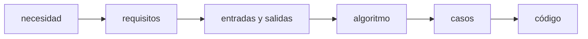
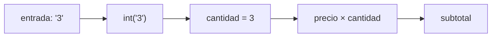
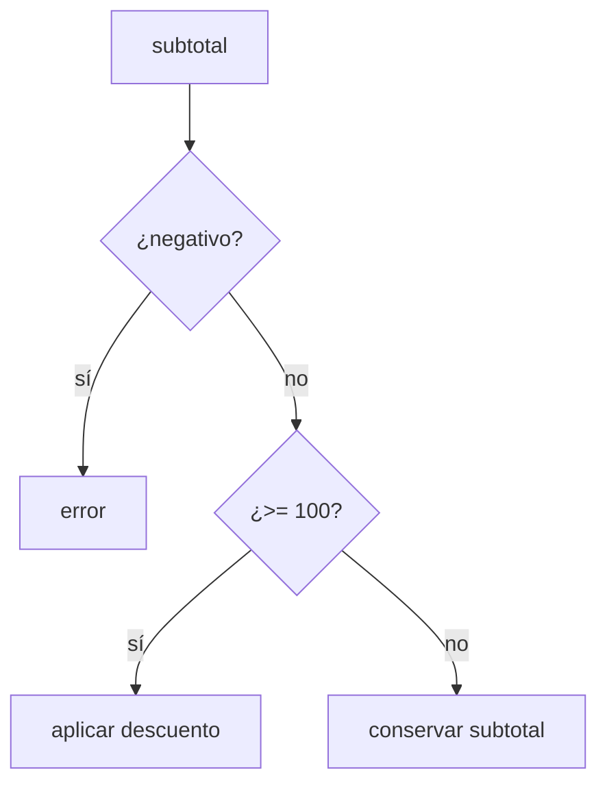
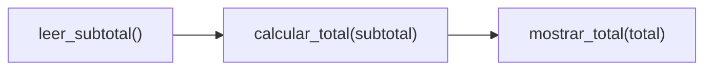

# Módulo 1: Pensamiento computacional y programación


## Aprende construyendo

### Tema 1: Del problema al algoritmo y a los casos de prueba

Ejecuta `python3 --version` (`py --version` en Windows) para comprobar el intérprete que usará el ejemplo.

#### Paso 1 · Objetivo y preparación
Al finalizar podrás resolver este problema desde cero. Prerrequisitos: terminal, editor y un lenguaje instalado; verifica su versión.

#### Paso 2 · Contexto y caso real
En un caso real de entregas, una regla de tarifa o estado debe poder explicarse, probarse y modificarse sin adivinar qué ocurre.

#### Paso 3 · Teoría, modelo mental y analogía
Un algoritmo transforma entradas en salidas mediante pasos finitos. Variables guardan estado, decisiones eligen caminos, bucles repiten y funciones encapsulan una responsabilidad. La analogía es una receta con medidas: cambiar un ingrediente debe dejar claro qué resultado cambia.

#### Paso 4 · Demostración guiada desde cero
Parte de una carpeta vacía y crea `src/total.py`:
```bash
mkdir ejemplo-algoritmo
cd ejemplo-algoritmo
mkdir src
```
```python
def calcular_total(subtotal):
    # Precondición: una compra no puede tener subtotal negativo.
    if subtotal < 0:
        raise ValueError("subtotal inválido")
    return subtotal * 0.90 if subtotal >= 100 else subtotal

for entrada in [80, 100, -1]:
    try:
        print(entrada, "->", calcular_total(entrada))
    except ValueError as error:
        print(entrada, "-> ERROR:", error)
```
```bash
python src/total.py
```
**Resultado esperado:** `80 -> 80`, `100 -> 90.0` y un error controlado para `-1`. **Fallo deliberado:** cambia `>= 100` por `> 100`; el caso límite 100 devolverá 100 y revela que el algoritmo ya no cumple el requisito.

#### Paso 5 · Práctica guiada
Pista: usa una entrada límite para provocar un fallo deliberado de lógica, traza cada paso y corrígelo. Resultado esperado: salida coherente con la regla escrita.

#### Paso 6 · Práctica independiente
Añade tres casos normales, uno límite y uno inválido; separa una función pura y documenta su complejidad.

#### Paso 7 · Cierre y evidencia
Guarda algoritmo, tabla de casos, código y salida; como siguiente paso estudia estructuras de datos. Errores comunes: programar antes de definir entrada, bucles sin condición, funciones gigantes y pruebas solo felices. Fuentes oficiales: https://www.cs.cmu.edu/~15110/ y https://developer.mozilla.org/es/docs/Learn.
**¿Por qué es importante?** Porque una solución clara se puede revisar antes de convertirla en código.
**Evidencia de aprendizaje:** entrega pseudocódigo, casos, implementación y diagnóstico.
**Conceptos clave:** problema, requisito, entrada, proceso, salida, algoritmo, precondición, caso normal, caso límite y caso inválido.

Programar no comienza escribiendo sintaxis. Comienza definiendo con precisión qué problema se resolverá. “Haz una calculadora” es ambiguo: ¿qué operaciones admite?, ¿acepta decimales?, ¿qué ocurre si el usuario escribe texto?, ¿cómo se informa una división por cero? Un **requisito** elimina ambigüedad al describir comportamiento observable.

Considera: “calcular el total de una compra aplicando 10 % de descuento cuando el subtotal sea al menos 100”. La entrada es el subtotal; el proceso compara y quizá descuenta; la salida es el total. Una precondición razonable es que el subtotal no sea negativo.

```text
LEER subtotal
SI subtotal < 0
    MOSTRAR "valor inválido"
SI NO, SI subtotal >= 100
    total = subtotal * 0.90
SI NO
    total = subtotal
MOSTRAR total
```

Este pseudocódigo no pertenece a un lenguaje específico. Permite discutir la lógica antes de preocuparnos por paréntesis. Después diseñamos casos: `50 → 50` es normal sin descuento; `100 → 90` prueba exactamente el límite; `-1 → error` prueba entrada inválida. Un único ejemplo como `150 → 135` no demuestra que el límite ni la validación funcionen.

**Ejemplo desde cero:** escribe primero la tabla de pruebas, luego el programa. Esto invierte el hábito de “codificar y ver qué pasa” por “definir qué debe pasar y comprobarlo”.

**Analogía:** un algoritmo es una ruta de viaje y los casos de prueba son recorridos de inspección: uno por la carretera principal, otro por el límite del mapa y otro intentando entrar por una vía prohibida.

**¿Por qué es importante?** Los defectos caros suelen surgir de requisitos ambiguos y casos no considerados, no de desconocer una palabra reservada. Pensar en ejemplos antes de implementar conecta programación con ingeniería.

**Casos de uso reales:** reglas de descuento, validación de edad, cálculo de impuestos, límites de retiro y permisos de acceso se expresan como entradas, decisiones y resultados verificables.

**Diagrama:**



### Tema 2: Variables, tipos, expresiones y cambios de estado

Ejecuta `python3 --version` (`py --version` en Windows) antes de probar conversiones y expresiones.

#### Paso 1 · Objetivo y preparación
Al finalizar podrás resolver este problema desde cero. Prerrequisitos: terminal, editor y un lenguaje instalado; verifica su versión.

#### Paso 2 · Contexto y caso real
En un caso real de entregas, una regla de tarifa o estado debe poder explicarse, probarse y modificarse sin adivinar qué ocurre.

#### Paso 3 · Teoría, modelo mental y analogía
Un algoritmo transforma entradas en salidas mediante pasos finitos. Variables guardan estado, decisiones eligen caminos, bucles repiten y funciones encapsulan una responsabilidad. La analogía es una receta con medidas: cambiar un ingrediente debe dejar claro qué resultado cambia.

#### Paso 4 · Demostración guiada desde cero
Parte de una carpeta vacía y crea `src/estado.py`:
```bash
mkdir ejemplo-variables
cd ejemplo-variables
mkdir src
```
```python
precio = 25.50          # float: número con decimales
cantidad_texto = "3"   # str: texto recibido desde un formulario
cantidad = int(cantidad_texto)
subtotal = precio * cantidad
estado = "calculado"
print(type(cantidad).__name__, subtotal, estado)
```
```bash
python src/estado.py
```
**Salida esperada:** `int 76.5 calculado`. **Fallo deliberado:** elimina `int(...)`; Python mostrará un `TypeError` porque no puede multiplicar un decimal por una cadena. El mensaje identifica los tipos incompatibles.

#### Paso 5 · Práctica guiada
Pista: usa una entrada límite para provocar un fallo deliberado de lógica, traza cada paso y corrígelo. Resultado esperado: salida coherente con la regla escrita.

#### Paso 6 · Práctica independiente
Añade tres casos normales, uno límite y uno inválido; separa una función pura y documenta su complejidad.

#### Paso 7 · Cierre y evidencia
Guarda algoritmo, tabla de casos, código y salida; como siguiente paso estudia estructuras de datos. Errores comunes: programar antes de definir entrada, bucles sin condición, funciones gigantes y pruebas solo felices. Fuentes oficiales: https://www.cs.cmu.edu/~15110/ y https://developer.mozilla.org/es/docs/Learn.
**¿Por qué es importante?** Porque una solución clara se puede revisar antes de convertirla en código.
**Evidencia de aprendizaje:** entrega pseudocódigo, casos, implementación y diagnóstico.
**Conceptos clave:** valor, variable, asignación, tipo, expresión, conversión y estado.

Un valor es información concreta, como `25`, `3.14`, `"Ana"` o `True`. Una variable asocia un nombre con un valor para poder usarlo posteriormente. El tipo determina qué representa el valor y qué operaciones tienen sentido: sumar números es distinto de concatenar textos.

```python
precio = 25.50
cantidad = 3
subtotal = precio * cantidad
print(subtotal)
```

Línea por línea: `precio` recibe un decimal; `cantidad`, un entero; la tercera línea evalúa la expresión de multiplicación y guarda `76.5`; la cuarta envía ese valor a salida. El signo `=` significa asignación, no afirmación matemática permanente. Si luego escribimos `cantidad = 4`, el estado cambia.

La entrada de `input()` siempre es texto. Para operar numéricamente hay que convertirla:

```python
texto = input("Cantidad: ")
cantidad = int(texto)
```

`int` puede fallar si el texto no representa un entero. Esa posibilidad forma parte del requisito; no debe ocultarse. Usa nombres que expresen significado (`precio_unitario`) y no posiciones accidentales (`x`).

Haz un trazado manual con columnas `línea`, `precio`, `cantidad`, `subtotal`. Actualiza la tabla después de cada instrucción. Este ejercicio parece lento, pero enseña a observar estado y prepara para usar un debugger.

**Analogía:** una variable es una etiqueta reutilizable sobre una caja; el tipo describe qué clase de contenido admite y las expresiones combinan contenidos para producir uno nuevo.

**¿Por qué es importante?** Comprender estado permite razonar sobre formularios, bases de datos, interfaces y procesos concurrentes. Muchos errores ocurren porque una variable tiene un valor distinto del que el programador supone.

**Casos de uso reales:** totales de una factura, estado de una sesión, cantidad disponible en inventario y progreso de una descarga son valores que cambian durante la ejecución.

**Diagrama:**



### Tema 3: Decisiones, repeticiones y trazado de ejecución

Ejecuta `python3 --version` (`py --version` en Windows) antes de trazar el flujo.

#### Paso 1 · Objetivo y preparación
Al finalizar podrás resolver este problema desde cero. Prerrequisitos: terminal, editor y un lenguaje instalado; verifica su versión.

#### Paso 2 · Contexto y caso real
En un caso real de entregas, una regla de tarifa o estado debe poder explicarse, probarse y modificarse sin adivinar qué ocurre.

#### Paso 3 · Teoría, modelo mental y analogía
Un algoritmo transforma entradas en salidas mediante pasos finitos. Variables guardan estado, decisiones eligen caminos, bucles repiten y funciones encapsulan una responsabilidad. La analogía es una receta con medidas: cambiar un ingrediente debe dejar claro qué resultado cambia.

#### Paso 4 · Demostración guiada desde cero
Parte de una carpeta vacía y crea `src/traza.py`:
```bash
mkdir ejemplo-control-flujo
cd ejemplo-control-flujo
mkdir src
```
```python
pesos = [12, 8, 5]
total = 0
for paso, peso in enumerate(pesos, start=1):
    total += peso
    print(f"paso={paso} peso={peso} total={total}")

print("capacidad excedida" if total > 20 else "capacidad disponible")
```
```bash
python src/traza.py
```
**Resultado esperado:** la traza muestra totales 12, 20 y 25; termina con `capacidad excedida`. **Fallo deliberado:** cambia `total += peso` por `total = peso`; la traza deja de acumular y permite localizar el error en la primera iteración incorrecta.

#### Paso 5 · Práctica guiada
Pista: usa una entrada límite para provocar un fallo deliberado de lógica, traza cada paso y corrígelo. Resultado esperado: salida coherente con la regla escrita.

#### Paso 6 · Práctica independiente
Añade tres casos normales, uno límite y uno inválido; separa una función pura y documenta su complejidad.

#### Paso 7 · Cierre y evidencia
Guarda algoritmo, tabla de casos, código y salida; como siguiente paso estudia estructuras de datos. Errores comunes: programar antes de definir entrada, bucles sin condición, funciones gigantes y pruebas solo felices. Fuentes oficiales: https://www.cs.cmu.edu/~15110/ y https://developer.mozilla.org/es/docs/Learn.
**¿Por qué es importante?** Porque una solución clara se puede revisar antes de convertirla en código.
**Evidencia de aprendizaje:** entrega pseudocódigo, casos, implementación y diagnóstico.
**Conceptos clave:** booleano, comparación, condición, rama, bucle, iteración, acumulador e invariante.

Una condición produce `True` o `False`. `if` selecciona una rama; `for` o `while` repite trabajo. Estas herramientas son suficientes para expresar gran cantidad de algoritmos, pero también permiten bucles infinitos y ramas imposibles si no se razona con cuidado.

```python
total = 0
for numero in [12, 8, 5]:
    total = total + numero
print(total)
```

Antes del bucle, `total` vale cero. En cada iteración mantiene la suma de los elementos ya visitados: esa propiedad es un **invariante**. Después de 12 vale 12; después de 8 vale 20; después de 5 vale 25. Trazar una tabla permite predecir la salida sin ejecutar.

```python
if subtotal < 0:
    print("El subtotal no puede ser negativo")
elif subtotal >= 100:
    print(subtotal * 0.90)
else:
    print(subtotal)
```

El orden importa. Primero se rechaza lo inválido; luego se evalúa descuento; finalmente queda el caso ordinario. Para probarlo, elige valores a ambos lados de cada frontera: `-1`, `0`, `99.99`, `100` y `100.01`.

**Error deliberado:** cambia `>= 100` por `> 100`. El caso `100` descubrirá la regresión. Esta práctica enseña que una prueba debe ser capaz de fallar cuando el comportamiento se rompe.

**Analogía:** una condición es una bifurcación; un bucle es recorrer estaciones hasta cumplir un criterio. El trazado es el registro del viaje, no una suposición sobre dónde terminaste.

**¿Por qué es importante?** Control de flujo modela reglas de negocio y procesamiento de colecciones. Saber trazarlo es la base para diagnosticar resultados incorrectos sin llenar el código de impresiones aleatorias.

**Casos de uso reales:** recorrer pedidos, filtrar usuarios autorizados, reintentar una petición y procesar líneas de un archivo.

**Diagrama:**



### Tema 4: Funciones y descomposición de problemas

Ejecuta `python3 --version` (`py --version` en Windows) antes de llamar la función.

#### Paso 1 · Objetivo y preparación
Al finalizar podrás resolver este problema desde cero. Prerrequisitos: terminal, editor y un lenguaje instalado; verifica su versión.

#### Paso 2 · Contexto y caso real
En un caso real de entregas, una regla de tarifa o estado debe poder explicarse, probarse y modificarse sin adivinar qué ocurre.

#### Paso 3 · Teoría, modelo mental y analogía
Un algoritmo transforma entradas en salidas mediante pasos finitos. Variables guardan estado, decisiones eligen caminos, bucles repiten y funciones encapsulan una responsabilidad. La analogía es una receta con medidas: cambiar un ingrediente debe dejar claro qué resultado cambia.

#### Paso 4 · Demostración guiada desde cero
Parte de una carpeta vacía y crea `src/tarifa.py`:
```bash
mkdir ejemplo-funciones
cd ejemplo-funciones
mkdir src
```
```python
def validar_peso(peso_kg):
    if peso_kg <= 0:
        raise ValueError("el peso debe ser positivo")

def calcular_tarifa(peso_kg, precio_por_kg=2500):
    validar_peso(peso_kg)
    return peso_kg * precio_por_kg

print(calcular_tarifa(3))
```
```bash
python src/tarifa.py
```
**Salida esperada:** `7500`. `calcular_tarifa` compone validación y cálculo; cada función conserva una responsabilidad. **Fallo deliberado:** llama `calcular_tarifa(0)` y diagnostica el `ValueError` antes de corregir la entrada.

#### Paso 5 · Práctica guiada
Pista: usa una entrada límite para provocar un fallo deliberado de lógica, traza cada paso y corrígelo. Resultado esperado: salida coherente con la regla escrita.

#### Paso 6 · Práctica independiente
Añade tres casos normales, uno límite y uno inválido; separa una función pura y documenta su complejidad.

#### Paso 7 · Cierre y evidencia
Guarda algoritmo, tabla de casos, código y salida; como siguiente paso estudia estructuras de datos. Errores comunes: programar antes de definir entrada, bucles sin condición, funciones gigantes y pruebas solo felices. Fuentes oficiales: https://www.cs.cmu.edu/~15110/ y https://developer.mozilla.org/es/docs/Learn.
**¿Por qué es importante?** Porque una solución clara se puede revisar antes de convertirla en código.
**Evidencia de aprendizaje:** entrega pseudocódigo, casos, implementación y diagnóstico.
**Conceptos clave:** función, parámetro, argumento, retorno, alcance, contrato, responsabilidad y composición.

Una función nombra una operación y permite utilizarla con datos distintos. Sus parámetros son entradas; `return` produce una salida. Una función pequeña puede comprobarse de manera aislada.

```python
def calcular_total(subtotal):
    if subtotal < 0:
        raise ValueError("El subtotal no puede ser negativo")
    if subtotal >= 100:
        return subtotal * 0.90
    return subtotal
```

`def` declara la función. `subtotal` solo existe dentro de ella: tiene alcance local. La validación establece parte de su contrato. `raise` no imprime silenciosamente un valor inventado; informa que el contrato fue violado. Cada `return` termina la función y entrega un resultado.

```python
def leer_subtotal():
    return float(input("Subtotal: "))

def mostrar_total(total):
    print(f"Total: {total:.2f}")

subtotal = leer_subtotal()
total = calcular_total(subtotal)
mostrar_total(total)
```

Ahora entrada, negocio y presentación están separadas. `calcular_total` no conoce la terminal y puede probarse directamente con `calcular_total(100)`. Evita funciones que lean, calculen, guarden y muestren todo a la vez.

**Analogía:** una función es una máquina con conectores de entrada y salida. Si además obliga a introducir la mano, pintar el producto y enviarlo por correo, tiene demasiadas responsabilidades.

**¿Por qué es importante?** La descomposición reduce carga mental, facilita pruebas y permite reemplazar terminal por web o móvil sin reescribir la regla central.

**Casos de uso reales:** validar credenciales, calcular envío, convertir monedas y transformar respuestas de una API son operaciones que conviene aislar.

**Diagrama:**



## Construcción guiada del capítulo

### Proyecto 1: calculadora de presupuesto desde carpeta vacía

Construye un programa que reciba descripción, precio y cantidad de varios productos; calcule subtotal; aplique descuento configurable; rechace valores negativos; y muestre un resumen. Empieza con `mkdir presupuesto`, crea `presupuesto.py`, `README.md` y `casos.md`.

Implementa por incrementos y crea un commit después de cada etapa:

1. Un producto con valores escritos en código.
2. Entrada del usuario y conversión de tipos.
3. Validación y mensajes claros.
4. Funciones separadas para leer, calcular y mostrar.
5. Repetición para varios productos.
6. Tabla manual con al menos ocho casos.

**Verificación:** otra persona debe poder clonar/copiar la carpeta, ejecutar el comando documentado y reproducir todos los casos. Incluye un caso normal, valores cero, límite exacto del descuento, decimales, negativo y texto inválido.

**Errores comunes y soluciones**

- Mezclar texto y número sin conversión: inspecciona tipos antes de operar.
- Usar `>` cuando el requisito dice “al menos”: prueba la frontera exacta.
- Atrapar todo error sin explicarlo: captura solo excepciones esperadas.
- Crear una función enorme: separa entrada, regla y presentación.
