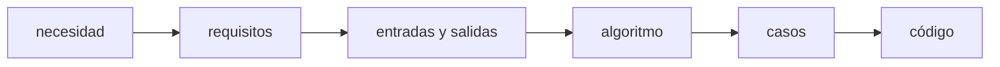
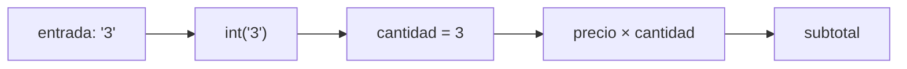
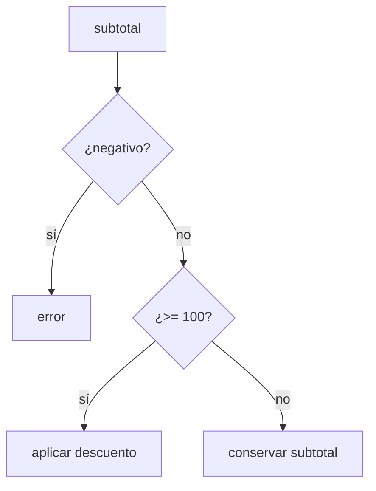
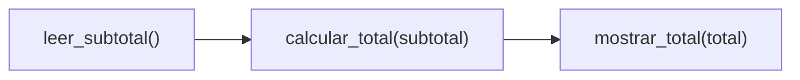

# Módulo 1: Pensamiento computacional y programación


## Aprende construyendo

### Tema 1: Del problema al algoritmo y a los casos de prueba

#### Paso 1 · Objetivo y preparación
Al finalizar vas a convertir un problema informal ("¿cuántas tareas están pendientes?") en un algoritmo explícito, implementarlo en Python, y diseñar casos de prueba que incluyan el caso límite de la lista vacía. **Prerrequisitos:** Python instalado; comprueba `python3 --version` (o `py --version` en Windows).

#### Paso 2 · Contexto y caso real
El gestor de tareas CLI (proyecto integrador Fundamentos) que vas a construir módulo a módulo necesita, desde el día uno, contestar una pregunta simple: de todas las tareas guardadas, ¿cuántas están pendientes? Parece trivial, pero si no definís el algoritmo antes de escribir código —¿qué devuelve si no hay ninguna tarea todavía?— vas a terminar adivinando el comportamiento en vez de poder explicarlo.

#### Paso 3 · Teoría, modelo mental y analogía
Un problema informal ("contar pendientes") esconde preguntas sin responder. Un algoritmo es la versión explícita de la solución: una secuencia finita de pasos que, dada una entrada, produce una salida predecible, sin importar si después la escribís en Python o la ejecutás a mano con papel. Por eso el orden profesional es problema → algoritmo explícito → casos de prueba (incluyendo los bordes) → código, nunca directamente problema → código:
```text
CONTAR_PENDIENTES(tareas):
  contador = 0
  PARA cada tarea en tareas:
    SI tarea.estado es "pendiente": contador = contador + 1
  DEVOLVER contador
```
Este algoritmo no dice nada todavía sobre Python: funciona igual si `tareas` tiene 0, 1 o 1000 elementos, y eso es justo lo que hay que comprobar con casos de prueba antes de confiar en la traducción a código. La analogía: diseñar un algoritmo sin pensar en sus bordes es como planear una ruta de reparto sin preguntar qué pasa si la lista de paradas viene vacía: el camión sale de todos modos, pero nadie sabe qué hace.

#### Paso 4 · Demostración guiada desde cero
Parte de una carpeta vacía y crea `src/pendientes.py`:
```bash
mkdir ejemplo-algoritmo
cd ejemplo-algoritmo
mkdir src
```
```python
def contar_pendientes(tareas):
    contador = 0
    for tarea in tareas:
        if tarea["estado"] == "pendiente":
            contador += 1
    return contador

tareas = [
    {"descripcion": "comprar pan", "estado": "pendiente"},
    {"descripcion": "pagar luz", "estado": "hecho"},
    {"descripcion": "llamar al dentista", "estado": "pendiente"},
]
print(contar_pendientes(tareas))
print(contar_pendientes([]))
```
```bash
python src/pendientes.py
```
**Resultado esperado:** `2` y luego `0`; la lista vacía nunca entra al `for`, así que el contador queda en cero sin necesitar ningún caso especial. **Fallo deliberado:** agregá esta segunda función, que calcula qué porcentaje de las tareas están pendientes sin pensar en la lista vacía:
```python
def porcentaje_pendientes(tareas):
    return contar_pendientes(tareas) / len(tareas) * 100

print(porcentaje_pendientes([]))
```
Python lanza `ZeroDivisionError: division by zero`: el conteo sobrevivió a la lista vacía, pero el porcentaje no, porque divide por `len(tareas)` sin comprobar que sea distinto de cero. Corregilo agregando `if not tareas: return 0.0` antes de dividir.

#### Paso 5 · Práctica guiada
Pista: antes de escribir cualquier función sobre una lista de tareas, preguntate primero qué debería devolver con cero tareas; si no podés responder esa pregunta en una frase, todavía no terminaste de diseñar el algoritmo, mucho menos el código.

#### Paso 6 · Práctica independiente
Escribí la tabla de casos de prueba para `contar_pendientes` ANTES de tocar el código: una lista con tareas mixtas (caso normal), una lista vacía (caso límite), una lista donde todas están pendientes, y una lista con un `estado` inesperado como `"archivada"` (caso inválido). Para cada fila anotá la entrada y la salida esperada, y después confirmá que el código las cumple todas.

#### Paso 7 · Cierre y evidencia
Entregá el algoritmo en pseudocódigo del Paso 3, la tabla de casos del Paso 6, el código de `contar_pendientes` y `porcentaje_pendientes`, y el `ZeroDivisionError` reproducido y corregido del Paso 4; explicá por qué una función puede ser correcta en el caso que probaste primero y romperse en un borde que nunca ejecutaste. Como siguiente paso, en el Tema 2 vas a ver qué pasa cuando esos mismos datos —por ejemplo, una prioridad escrita por el usuario— llegan con el tipo equivocado. Errores comunes: probar solo el caso feliz; dividir o indexar sin comprobar que la colección no esté vacía; escribir código antes de tener la tabla de casos. Fuentes oficiales: https://docs.python.org/es/3/tutorial/controlflow.html y https://docs.python.org/es/3/library/unittest.html.
**¿Por qué es importante?** Porque el conteo de pendientes funcionó a la primera con datos de ejemplo, y ese falso éxito es exactamente lo que oculta el bug hasta que un usuario real se queda sin tareas.

**Cuándo NO usar:** No programes sin definir requisitos. No intentes casos límite sin pseudocódigo primero.

**Evidencia de aprendizaje:** entregá el pseudocódigo de `contar_pendientes`, la tabla de casos con el borde de la lista vacía, el código de ambas funciones y el `ZeroDivisionError` diagnosticado y corregido.
**Conceptos clave:** problema, requisito, entrada, proceso, salida, algoritmo, precondición, caso normal, caso límite y caso inválido.

Programar no comienza escribiendo sintaxis. Comienza definiendo con precisión qué problema se resolverá. “Haz una calculadora” es ambiguo: ¿qué operaciones admite?, ¿acepta decimales?, ¿qué ocurre si el usuario escribe texto?, ¿cómo se informa una división por cero? Un **requisito** elimina ambigüedad al describir comportamiento observable.

Considera: “calcular el total de una compra aplicando 10 % de descuento cuando el subtotal sea al menos 100”. La entrada es el subtotal; el proceso compara y quizá descuenta; la salida es el total. Una precondición razonable es que el subtotal no sea negativo.

```text
LEER subtotal
SI subtotal < 0
    MOSTRAR "valor inválido"
SI NO, SI subtotal >= 100
    total = subtotal * 0.90
SI NO
    total = subtotal
MOSTRAR total
```

Este pseudocódigo no pertenece a un lenguaje específico. Permite discutir la lógica antes de preocuparnos por paréntesis. Después diseñamos casos: `50 → 50` es normal sin descuento; `100 → 90` prueba exactamente el límite; `-1 → error` prueba entrada inválida. Un único ejemplo como `150 → 135` no demuestra que el límite ni la validación funcionen.

**Ejemplo desde cero:** escribe primero la tabla de pruebas, luego el programa. Esto invierte el hábito de “codificar y ver qué pasa” por “definir qué debe pasar y comprobarlo”.

**Analogía:** un algoritmo es una ruta de viaje y los casos de prueba son recorridos de inspección: uno por la carretera principal, otro por el límite del mapa y otro intentando entrar por una vía prohibida.

**¿Por qué es importante?** Los defectos caros suelen surgir de requisitos ambiguos y casos no considerados, no de desconocer una palabra reservada. Pensar en ejemplos antes de implementar conecta programación con ingeniería.

**Casos de uso reales:** reglas de descuento, validación de edad, cálculo de impuestos, límites de retiro y permisos de acceso se expresan como entradas, decisiones y resultados verificables.

**Diagrama:**


```mermaid
flowchart LR
    NEED["necesidad"] --> REQ["requisitos"] --> IO["entradas y salidas"]
    IO --> ALG["algoritmo"] --> CASES["casos"] --> CODE["código"]
```

#### Profundización · Diseño: Casos límite con números flotantes (99.99)

**Escenario real:** El gestor de tareas aplica descuentos: "si subtotal >= 100, aplica 10%". Pruebas con 100 pasan, pero 99.99 falla al guardar precisión decimal.

**Tu tarea (sin mirar solución):**

1. **Predice:** `0.1 + 0.1 + 0.1` ¿da exactamente `0.3`? Si aplicás tres descuentos sucesivos de 0.10 cada uno, ¿el total acumulado es exacto?
2. **Diseña casos:**
   - Normal: 99.99
   - Límite: 100.00, 100.01
   - Trunca: Redondea a 2 decimales. ¿El resultado sigue siendo válido?
3. **Detecta:** Escribe una función que valide `precio * cantidad` sin perder centavos.
4. **Escenario:** ¿`99.99 * 0.90` imprime exactamente `89.991` en Python, o aparece un residuo binario visible?

**Escribe tu respuesta:**
```
0.1 + 0.1 + 0.1 en Python: _________
Casos diseñados: _________, _________, _________
Función validadora: redondea_a_centavos(resultado) _________
99.99 * 0.90 imprime: _________
```

[SOLUCIÓN — Lee solo después de intentar]

> **Respuesta esperada:**
>
> **`0.1 + 0.1 + 0.1` da `0.30000000000000004`, NO `0.3` exacto** — tres descuentos de 0.10 sumados en punto flotante binario acumulan un residuo visible, aunque cada número individual (`0.1`) "se vea" simple en decimal.
>
> **Casos:**
> - 99.99 → 99.99 (sin descuento)
> - 100.00 → 90.00 (límite exacto, descuento)
> - 100.01 → 90.009 (requiere redondeo)
>
> **Validador:**
> ```python
> from decimal import Decimal
> precio = Decimal('99.99') * Decimal('0.90')
> ```
>
> **`99.99 * 0.90` imprime exactamente `89.991`** en Python — este caso puntual NO muestra residuo visible (la imprecisión interna existe en binario, pero redondea limpio al convertir a texto). Esa es precisamente la trampa: no podés predecir de antemano cuál cálculo con decimales se va a ver "limpio" y cuál no con solo mirarlo, por eso `Decimal` (o trabajar en centavos como enteros) es la única forma confiable de garantizar precisión exacta en dinero, en vez de confiar en que "este número en particular no tuvo problemas".

### Tema 2: Variables, tipos, expresiones y cambios de estado

#### Paso 1 · Objetivo y preparación
Al finalizar vas a ver cómo Python distingue tipos en tiempo de ejecución, y vas a reproducir un bug silencioso —sin ningún error ni traceback— que aparece al comparar dos textos como si fueran números. **Prerrequisitos:** Tema 1 de este módulo.

#### Paso 2 · Contexto y caso real
El gestor de tareas CLI va a leer la prioridad de una tarea desde la terminal con `input()`, por ejemplo para decidir cuál tarea atender primero. El problema: `input()` devuelve SIEMPRE texto, nunca un número, aunque el usuario haya tecleado solamente dígitos.

#### Paso 3 · Teoría, modelo mental y analogía
En Python cada valor tiene un tipo (`int`, `float`, `str`, `bool`, `list`...) y ese tipo decide qué operaciones son válidas: `3 + 2` suma, pero `"3" + "2"` concatena y da `"32"`, no `5`. Una variable es apenas una etiqueta que apunta a un valor; reasignarla (`prioridad = 5`) no modifica el valor anterior, solo hace que la etiqueta apunte a otro. Pero si DOS variables apuntan al mismo objeto mutable —una lista, por ejemplo— modificar esa lista a través de una de las dos etiquetas se ve reflejado en la otra, porque ambas señalan el mismo objeto en memoria, no dos copias independientes. La analogía: un valor es una casa y una variable es una dirección postal que apunta a ella; reasignar la variable es cambiar a qué casa apunta la dirección, pero si dos direcciones apuntan a la misma casa, pintarla desde una de ellas la deja pintada también para la otra.

#### Paso 4 · Demostración guiada desde cero
Parte de una carpeta vacía y crea `src/prioridad.py`:
```bash
mkdir ejemplo-variables
cd ejemplo-variables
mkdir src
```
```python
def tarea_mas_urgente(prioridad_a, prioridad_b):
    return "a" if prioridad_a > prioridad_b else "b"

prioridad_a = int("9")
prioridad_b = int("10")
print(tarea_mas_urgente(prioridad_a, prioridad_b))
```
```bash
python src/prioridad.py
```
**Resultado esperado:** `b`; la tarea con prioridad 10 es la más urgente, como corresponde numéricamente. **Fallo deliberado:** quitá los dos `int(...)` y dejá las prioridades como las entrega `input()`, es decir como texto:
```python
prioridad_a = "9"
prioridad_b = "10"
print(tarea_mas_urgente(prioridad_a, prioridad_b))
```
Esto imprime `a`. Python no lanza ningún error, porque comparar dos strings con `>` es válido: compara carácter por carácter, y `"9" > "1"` es cierto, así que `"9" > "10"` también lo es. El resultado es numéricamente incorrecto —10 es mayor que 9— pero no hay ningún traceback que lo delate. Corregilo convirtiendo ambas prioridades con `int(...)` antes de compararlas.

#### Paso 5 · Práctica guiada
Pista: cuando algo se ejecuta sin ningún error pero el resultado está mal, sospechá primero de los tipos; imprimí `type(prioridad_a)` y `type(prioridad_b)` antes de comparar, no asumas que porque "se ven como números" Python los está tratando como números.

#### Paso 6 · Práctica independiente
Agregá una tercera prioridad `"100"` y predecí, ANTES de ejecutar, si `"100" > "9"` da `True` o `False` tratándolas como texto; después comprobalo y escribí en una línea por qué la comparación de textos puede contradecir la comparación numérica incluso con más de un dígito de diferencia.

#### Paso 7 · Cierre y evidencia
Entregá la versión correcta con `int(...)` del Paso 4, la comparación de strings que da `a` en vez de `b`, y la predicción escrita del Paso 6 sobre `"100" > "9"`; explicá por qué un programa sin errores ni advertencias puede estar devolviendo una respuesta incorrecta. Como siguiente paso, en el Tema 3 vas a recorrer todas las tareas con un bucle, donde este mismo descuido se puede repetir en cada vuelta sin que lo notes. Errores comunes: comparar o calcular con un valor que todavía es texto porque vino de `input()`; asumir que "no hay error" significa "el resultado es correcto". Fuentes oficiales: https://docs.python.org/es/3/library/stdtypes.html y https://docs.python.org/es/3/reference/expressions.html.
**¿Por qué es importante?** Porque `"9" > "10"` se ejecuta sin ninguna queja de Python: el intérprete no sabe que vos querías comparar números, y un programa que falla en silencio es más peligroso que uno que explota con un traceback.

**Cuándo NO usar:** No uses variables sin saber su tipo. No cambies tipos sin conversión explícita.

**Evidencia de aprendizaje:** entregá la comparación correcta con `int(...)`, la comparación de strings que invierte el resultado, y la predicción escrita sobre `"100" > "9"` antes de comprobarla.
**Conceptos clave:** valor, variable, asignación, tipo, expresión, conversión y estado.

Un valor es información concreta, como `25`, `3.14`, `"Ana"` o `True`. Una variable asocia un nombre con un valor para poder usarlo posteriormente. El tipo determina qué representa el valor y qué operaciones tienen sentido: sumar números es distinto de concatenar textos.

```python
precio = 25.50
cantidad = 3
subtotal = precio * cantidad
print(subtotal)
```

Línea por línea: `precio` recibe un decimal; `cantidad`, un entero; la tercera línea evalúa la expresión de multiplicación y guarda `76.5`; la cuarta envía ese valor a salida. El signo `=` significa asignación, no afirmación matemática permanente. Si luego escribimos `cantidad = 4`, el estado cambia.

La entrada de `input()` siempre es texto. Para operar numéricamente hay que convertirla:

```python
texto = input("Cantidad: ")
cantidad = int(texto)
```

`int` puede fallar si el texto no representa un entero. Esa posibilidad forma parte del requisito; no debe ocultarse. Usa nombres que expresen significado (`precio_unitario`) y no posiciones accidentales (`x`).

Haz un trazado manual con columnas `línea`, `precio`, `cantidad`, `subtotal`. Actualiza la tabla después de cada instrucción. Este ejercicio parece lento, pero enseña a observar estado y prepara para usar un debugger.

**Analogía:** una variable es una etiqueta reutilizable sobre una caja; el tipo describe qué clase de contenido admite y las expresiones combinan contenidos para producir uno nuevo.

**¿Por qué es importante?** Comprender estado permite razonar sobre formularios, bases de datos, interfaces y procesos concurrentes. Muchos errores ocurren porque una variable tiene un valor distinto del que el programador supone.

**Casos de uso reales:** totales de una factura, estado de una sesión, cantidad disponible en inventario y progreso de una descarga son valores que cambian durante la ejecución.

**Diagrama:**


```mermaid
flowchart LR
    TEXT["entrada: '3'"] --> CONVERT["int('3')"] --> VALUE["cantidad = 3"]
    VALUE --> CALC["precio × cantidad"] --> TOTAL["subtotal"]
```

#### Profundización · Diseño: Conversión segura de entrada 1e10

**Escenario real:** El usuario ingresa `1e10` (científica: 10 mil millones) en "cantidad de tareas". El programa espera un entero pequeño (1-1000).

**Tu tarea (sin mirar solución):**

1. **Convierte:** `int(input())` recibe `"1e10"`. ¿Qué ocurre?, ¿es error?
2. **Valida:** Diseña un rango: cantidad entre 1 y 1000. ¿Cómo rechazarías 1e10?
3. **Recupera:** Si `float("1e10")` funciona pero `int("1e10")` falla, ¿cuál es la ruta segura?
4. **Escenario:** Usuarios en diferentes locales: ¿"3,14" (coma) es distinto de "3.14"?

**Escribe tu respuesta:**
```
int(input("1e10")) → _________
Rango válido: 1 a 1000. Si entra 10000: _________
Ruta segura: float() o Decimal() antes de int()? _________
"3,14" vs "3.14": El mismo número? _________ (¿por qué?)
```

[SOLUCIÓN — Lee solo después de intentar]

> **Respuesta esperada:**
>
> **int(input("1e10")):** ValueError (Python no convierte notación científica directamente a int).
>
> **Si entra 10000:** Rechazarlo con `if cantidad > 1000: raise ValueError("máximo 1000")`.
>
> **Ruta segura:**
> ```python
> cantidad = int(float(input()))  # 1e10 → 10000000000.0 → 10000000000
> if 1 <= cantidad <= 1000:
>     # válida
> ```
>
> **"3,14" vs "3.14":** Distinto en Python (es error). Locales usan coma, pero `int()` espera punto.

### Tema 3: Decisiones, repeticiones y trazado de ejecución

#### Paso 1 · Objetivo y preparación
Al finalizar vas a recorrer una lista de tareas con un bucle y una condición para detectar cuáles están vencidas, y vas a trazar a mano la ejecución para encontrar un error de "uno de más, uno de menos" que deja afuera la última tarea sin que se note a simple vista. **Prerrequisitos:** Tema 2 de este módulo.

#### Paso 2 · Contexto y caso real
El gestor de tareas CLI necesita recorrer todas las tareas guardadas para marcar cuáles están vencidas (por ejemplo, con más de 3 días pendientes) y avisarle al usuario. Si el bucle que las recorre tiene un límite mal calculado, el programa no se cae ni avisa nada: simplemente deja una tarea sin revisar, y nadie lo nota hasta que esa tarea vencida se le escapó al usuario.

#### Paso 3 · Teoría, modelo mental y analogía
Una condición (`if`) elige un camino según si una expresión es `True` o `False`; un bucle (`for`, `while`) repite un bloque de instrucciones una cantidad de veces que puede depender de una lista, un contador o otra condición. El punto donde más errores se esconden es el límite del bucle: `range(len(tareas))` recorre exactamente los índices válidos, pero `range(len(tareas) - 1)` se queda un índice corto, y `range(len(tareas) + 1)` se pasa uno de más y revienta con `IndexError`. Trazar la ejecución a mano —anotar en una tabla el valor de cada variable después de cada vuelta— es la única forma confiable de detectar un límite mal puesto, porque el código "se ve bien" aunque esté iterando una vuelta de menos. La analogía: repasar un bucle sin trazarlo es como contar personas en una fila mirando de lejos: si te saltás a la última porque "ya viste suficientes", la fila sigue pareciendo completa aunque falte alguien.

#### Paso 4 · Demostración guiada desde cero
Parte de una carpeta vacía y crea `src/vencidas.py`:
```bash
mkdir ejemplo-control-flujo
cd ejemplo-control-flujo
mkdir src
```
```python
tareas = [
    {"descripcion": "comprar pan", "dias_pendiente": 1},
    {"descripcion": "pagar luz", "dias_pendiente": 5},
    {"descripcion": "llamar al dentista", "dias_pendiente": 4},
]

for i in range(len(tareas)):
    tarea = tareas[i]
    if tarea["dias_pendiente"] > 3:
        print(f"VENCIDA: {tarea['descripcion']}")
```
```bash
python src/vencidas.py
```
**Resultado esperado:** imprime `VENCIDA: pagar luz` y `VENCIDA: llamar al dentista`: dos tareas vencidas sobre tres. **Fallo deliberado:** cambiá `range(len(tareas))` por `range(len(tareas) - 1)`. Ahora solo imprime `VENCIDA: pagar luz`; "llamar al dentista", que es el último elemento (índice 2), nunca se revisa, porque con 3 tareas `range(len(tareas) - 1)` genera `0, 1` y se detiene antes de llegar a `2`. No hay ningún error: la tarea vencida simplemente queda sin alertar. Corregilo devolviendo el límite a `range(len(tareas))`.

#### Paso 5 · Práctica guiada
Pista: antes de ejecutar, armá una tabla con columnas `i`, `tarea` y `¿se revisó?` y completala a mano siguiendo `range(len(tareas) - 1)` paso por paso; vas a ver en la tabla, antes de correr el código, que el índice 2 nunca aparece.

#### Paso 6 · Práctica independiente
Reescribí el bucle como un `while` con contador manual (`i = 0`, `i += 1` dentro del bucle) que logre el mismo resultado correcto que el `for` del Paso 4, y después rompelo cambiando la condición de corte de `i < len(tareas)` a `i <= len(tareas)`; tracealo a mano y explicá en una línea qué error concreto produce esta vez.

#### Paso 7 · Cierre y evidencia
Entregá el recorrido correcto del Paso 4, la versión con `range(len(tareas) - 1)` que se saltea la última tarea vencida, y la versión `while` con `i <= len(tareas)` del Paso 6 junto con el error que produce; explicá por qué un bucle con el límite mal puesto no avisa nada: simplemente procesa de menos o se pasa un paso más allá del final. Como siguiente paso, en el Tema 4 vas a dividir este mismo recorrido en funciones más chicas para que cada una se pueda probar por separado. Errores comunes: calcular el límite de un bucle sumando o restando uno sin verificarlo contra una tabla trazada a mano; confundir "no hay error" con "recorrió todo". Fuentes oficiales: https://docs.python.org/es/3/tutorial/controlflow.html y https://docs.python.org/es/3/library/stdtypes.html.
**¿Por qué es importante?** Porque `range(len(tareas) - 1)` no lanza ningún error ni advertencia: el programa corre, imprime algo razonable, y la única pista de que algo falta es contar a mano cuántas tareas vencidas había en realidad.
**Evidencia de aprendizaje:** entregá el recorrido correcto, la versión con el índice de más que se saltea la última tarea, la versión `while` con su error de corte, y la tabla trazada a mano.
**Conceptos clave:** booleano, comparación, condición, rama, bucle, iteración, acumulador e invariante.

Una condición produce `True` o `False`. `if` selecciona una rama; `for` o `while` repite trabajo. Estas herramientas son suficientes para expresar gran cantidad de algoritmos, pero también permiten bucles infinitos y ramas imposibles si no se razona con cuidado.

```python
total = 0
for numero in [12, 8, 5]:
    total = total + numero
print(total)
```

Antes del bucle, `total` vale cero. En cada iteración mantiene la suma de los elementos ya visitados: esa propiedad es un **invariante**. Después de 12 vale 12; después de 8 vale 20; después de 5 vale 25. Trazar una tabla permite predecir la salida sin ejecutar.

```python
if subtotal < 0:
    print("El subtotal no puede ser negativo")
elif subtotal >= 100:
    print(subtotal * 0.90)
else:
    print(subtotal)
```

El orden importa. Primero se rechaza lo inválido; luego se evalúa descuento; finalmente queda el caso ordinario. Para probarlo, elige valores a ambos lados de cada frontera: `-1`, `0`, `99.99`, `100` y `100.01`.

**Error deliberado:** cambia `>= 100` por `> 100`. El caso `100` descubrirá la regresión. Esta práctica enseña que una prueba debe ser capaz de fallar cuando el comportamiento se rompe.

**Analogía:** una condición es una bifurcación; un bucle es recorrer estaciones hasta cumplir un criterio. El trazado es el registro del viaje, no una suposición sobre dónde terminaste.

**¿Por qué es importante?** Control de flujo modela reglas de negocio y procesamiento de colecciones. Saber trazarlo es la base para diagnosticar resultados incorrectos sin llenar el código de impresiones aleatorias.

**Casos de uso reales:** recorrer pedidos, filtrar usuarios autorizados, reintentar una petición y procesar líneas de un archivo.

**Diagrama:**


```mermaid
flowchart TD
    VALUE["subtotal"] --> INVALID{"¿negativo?"}
    INVALID -->|"sí"| ERROR["error"]
    INVALID -->|"no"| LIMIT{"¿>= 100?"}
    LIMIT -->|"sí"| DISCOUNT["aplicar descuento"]
    LIMIT -->|"no"| ORIGINAL["conservar subtotal"]
```

#### Profundización · Diseño: Loop sobre lista vacía y comportamiento inesperado

**Escenario real:** El gestor de tareas itera sobre todas las tareas: `for tarea in tareas:`. Si la lista es vacía, el loop no entra, pero debe haber un mensaje. ¿Cuál es el comportamiento esperado?

**Tu tarea (sin mirar solución):**

1. **Traza:** Escribe loop `for` sobre lista vacía. ¿Se ejecuta el cuerpo alguna vez?
2. **Diseña:** Si no hay tareas, mostrar "sin tareas pendientes". ¿Dónde va el `if`?
3. **Compara:** ¿Es mejor `if len(tareas) == 0` o `if not tareas`?
4. **Edge case:** Loop `for i in range(0)` ¿entra en el cuerpo?

**Escribe tu respuesta:**
```
for tarea in []: cuerpo ejecuta _________ vez(ces)
Si lista vacía: if _________ (not tareas vs len(tareas)==0)
Mejor opción: _________ (¿por qué?)
for i in range(0): entra _________ vez(ces)
```

[SOLUCIÓN — Lee solo después de intentar]

> **Respuesta esperada:**
>
> **for tarea in []:** Nunca entra al cuerpo (0 veces).
>
> **Si lista vacía:** `if not tareas:` (más pythónico y legible).
>
> **Mejor opción:** `if not tareas` porque:
> - Funciona para listas, tuplas, strings, etc.
> - Más conciso: `not []` es True
> - No depende de `len()` (O(1) vs potencial O(n))
>
> **for i in range(0):** Nunca entra (0 veces). `range(0)` es una secuencia vacía.
>
> **Patrón robusto:**
> ```python
> if tareas:
>     for tarea in tareas:
>         print(tarea)
> else:
>     print("Sin tareas pendientes")
> ```

### Tema 4: Funciones y descomposición de problemas

#### Paso 1 · Objetivo y preparación
Al finalizar vas a dividir el problema de "contar tareas pendientes" en varias funciones chicas, cada una con una sola responsabilidad, y vas a descubrir por qué una función que hace más de lo que su nombre promete puede sorprender a quien la usa. **Prerrequisitos:** Tema 3 de este módulo.

#### Paso 2 · Contexto y caso real
El gestor de tareas CLI va a crecer: cargar tareas desde un archivo, filtrarlas, contarlas, mostrarlas, guardarlas. Si todo ese trabajo vive en una sola función gigante, cualquier cambio chico —por ejemplo, cambiar cómo se guarda una tarea— obliga a releer y entender todo el bloque, incluso la parte que no tiene nada que ver con el cambio.

#### Paso 3 · Teoría, modelo mental y analogía
Una función con una sola responsabilidad hace una cosa, la hace bien, y su nombre describe exactamente esa cosa, ni más ni menos. El problema aparece cuando una función hace algo que su nombre NO anuncia: un **efecto secundario** oculto, como modificar una lista que recibió por parámetro, imprimir algo en pantalla, o escribir a un archivo, cuando quien la llama solo esperaba un valor de vuelta. Separar "calcular" de "mostrar" y de "guardar" en funciones distintas no es una regla estética: permite llamar a `contar(tareas)` cien veces en una prueba sin que eso imprima nada ni toque el disco. La analogía: una función con un efecto secundario oculto es como un cajero automático que, además de darte el saldo que pediste, le manda un mensaje a otra persona sin avisarte: técnicamente respondió tu pregunta, pero hizo algo más que vos no pediste ni esperabas.

#### Paso 4 · Demostración guiada desde cero
Parte de una carpeta vacía y crea `src/descomposicion.py`:
```bash
mkdir ejemplo-funciones
cd ejemplo-funciones
mkdir src
```
```python
def filtrar_pendientes(tareas):
    return [tarea for tarea in tareas if tarea["estado"] == "pendiente"]

def contar(tareas):
    return len(tareas)

tareas = [
    {"descripcion": "comprar pan", "estado": "pendiente"},
    {"descripcion": "pagar luz", "estado": "hecho"},
]
pendientes = filtrar_pendientes(tareas)
print(contar(pendientes))
```
```bash
python src/descomposicion.py
```
**Resultado esperado:** `1`. Cada función hace una sola cosa —`filtrar_pendientes` filtra, `contar` cuenta— y ninguna imprime ni modifica la lista original: `tareas` sigue teniendo sus 2 elementos después de llamarlas. **Fallo deliberado:** reemplazá `contar` por esta versión que "de paso" también vacía la lista:
```python
def contar_pendientes(tareas):
    print(f"Hay {len(tareas)} pendientes")
    cantidad = len(tareas)
    tareas.clear()
    return cantidad

pendientes = filtrar_pendientes(tareas)
total = contar_pendientes(pendientes)
print(pendientes)
```
`total` da el valor correcto, pero la última línea imprime `[]`: `contar_pendientes` vació la lista que recibió, aunque su nombre solo prometía contar. Quien la llamó no tenía forma de adivinar, por el nombre, que `pendientes` iba a quedar vacía después. Corregilo quitando el `print` y el `.clear()`, dejándola pura: recibe una lista y devuelve un número, sin tocar nada más.

#### Paso 5 · Práctica guiada
Pista: para confirmar que una función es pura, llamala dos veces seguidas con el mismo argumento; si `contar_pendientes(pendientes)` cambia lo que devuelve la segunda vez —o la lista misma cambió—, algo además de "contar" está pasando ahí adentro.

#### Paso 6 · Práctica independiente
Escribí `cargar_tareas()` que devuelva una lista fija en memoria (simulando un archivo), sin filtrar ni contar nada adentro; después encadená `cargar_tareas() → filtrar_pendientes() → contar()` y confirmá que podés probar cada una por separado, pasándole datos armados a mano, sin necesitar las otras dos.

#### Paso 7 · Cierre y evidencia
Entregá las tres funciones puras (`cargar_tareas`, `filtrar_pendientes`, `contar`) de los Pasos 4 y 6, la versión con el efecto secundario oculto que vacía la lista, y la explicación de por qué el nombre de una función es una promesa que el código debe cumplir sin sorpresas. Con esto cerrás el Módulo 1; como siguiente paso, en el Módulo 2 (Estructuras de datos, algoritmos y complejidad) vas a usar estas mismas funciones chicas sobre listas, diccionarios, pilas y colas más grandes. Errores comunes: una función que calcula y además imprime o guarda; nombrar una función con un verbo que no describe todo lo que hace. Fuentes oficiales: https://docs.python.org/es/3/tutorial/controlflow.html y https://docs.python.org/es/3/reference/compound_stmts.html.
**¿Por qué es importante?** Porque `contar_pendientes` devolvió el número correcto: el bug no está en el resultado que mirás, sino en el efecto secundario que nadie pidió y que solo se nota revisando la lista después.
**Evidencia de aprendizaje:** entregá las funciones puras encadenadas (`cargar_tareas`, `filtrar_pendientes`, `contar`), la versión con el efecto secundario que vacía la lista, y la explicación de por qué el nombre de una función debe cumplir lo que promete.
**Conceptos clave:** función, parámetro, argumento, retorno, alcance, contrato, responsabilidad y composición.

Una función nombra una operación y permite utilizarla con datos distintos. Sus parámetros son entradas; `return` produce una salida. Una función pequeña puede comprobarse de manera aislada.

```python
def calcular_total(subtotal):
    if subtotal < 0:
        raise ValueError("El subtotal no puede ser negativo")
    if subtotal >= 100:
        return subtotal * 0.90
    return subtotal
```

`def` declara la función. `subtotal` solo existe dentro de ella: tiene alcance local. La validación establece parte de su contrato. `raise` no imprime silenciosamente un valor inventado; informa que el contrato fue violado. Cada `return` termina la función y entrega un resultado.

```python
def leer_subtotal():
    return float(input("Subtotal: "))

def mostrar_total(total):
    print(f"Total: {total:.2f}")

subtotal = leer_subtotal()
total = calcular_total(subtotal)
mostrar_total(total)
```

Ahora entrada, negocio y presentación están separadas. `calcular_total` no conoce la terminal y puede probarse directamente con `calcular_total(100)`. Evita funciones que lean, calculen, guarden y muestren todo a la vez.

**Analogía:** una función es una máquina con conectores de entrada y salida. Si además obliga a introducir la mano, pintar el producto y enviarlo por correo, tiene demasiadas responsabilidades.

**¿Por qué es importante?** La descomposición reduce carga mental, facilita pruebas y permite reemplazar terminal por web o móvil sin reescribir la regla central.

**Casos de uso reales:** validar credenciales, calcular envío, convertir monedas y transformar respuestas de una API son operaciones que conviene aislar.

**Diagrama:**


```mermaid
flowchart LR
    INPUT["leer_subtotal()"] --> RULE["calcular_total(subtotal)"] --> OUTPUT["mostrar_total(total)"]
```

#### Profundización · Diseño: Nivel de descomposición y tamaño de funciones

**Escenario real:** El gestor de tareas crece: listar, crear, editar, borrar. Una función `main()` de 200 líneas es imposible de depurar. ¿Cómo dividirla?

**Tu tarea (sin mirar solución):**

1. **Diseña jerarquía:**
   - Nivel 1: `main()` — orquesta el flujo
   - Nivel 2: `cargar_tareas()`, `guardar_tareas()`, `mostrar_menu()`
   - Nivel 3: ¿Qué funciones agregarías?
2. **Tamaño:** Una función ¿debería caber en una pantalla (20 líneas) o puede tener 50?
3. **Responsabilidad:** ¿Una función `editar_tarea()` debe también guardar en disco o solo modificar en memoria?
4. **Testeo:** ¿Qué función es más fácil de probar?, ¿por qué?

**Escribe tu respuesta:**
```
Funciones nivel 3: _________, _________, _________
Tamaño ideal: _________ líneas máximo
Responsabilidad de editar_tarea(): _________ (¿guarda disco?)
Función más fácil de testear: _________ (¿por qué?)
```

[SOLUCIÓN — Lee solo después de intentar]

> **Respuesta esperada:**
>
> **Nivel 3 típico:**
> - `validar_titulo()`
> - `formatear_tareas_para_mostrar()`
> - `buscar_tarea_por_id()`
> - `eliminar_tarea_por_id()`
>
> **Tamaño ideal:** 10-30 líneas (cabe en pantalla, una responsabilidad).
>
> **editar_tarea():** Solo modifica en memoria. `guardar_tareas()` es responsable del disco (separación de concerns).
>
> **Más fácil de testear:** Funciones puras sin I/O:
> - `validar_titulo("abc")` → True/False
> - Vs. `guardar_tareas()` que toca disco

## Construcción guiada del capítulo

### Proyecto 1: calculadora de presupuesto desde carpeta vacía

Construye un programa que reciba descripción, precio y cantidad de varios productos; calcule subtotal; aplique descuento configurable; rechace valores negativos; y muestre un resumen. Empieza con `mkdir presupuesto`, crea `presupuesto.py`, `README.md` y `casos.md`.

Implementa por incrementos y crea un commit después de cada etapa:

1. Un producto con valores escritos en código.
2. Entrada del usuario y conversión de tipos.
3. Validación y mensajes claros.
4. Funciones separadas para leer, calcular y mostrar.
5. Repetición para varios productos.
6. Tabla manual con al menos ocho casos.

**Verificación:** otra persona debe poder clonar/copiar la carpeta, ejecutar el comando documentado y reproducir todos los casos. Incluye un caso normal, valores cero, límite exacto del descuento, decimales, negativo y texto inválido.

**Errores comunes y soluciones**

- Mezclar texto y número sin conversión: inspecciona tipos antes de operar.
- Usar `>` cuando el requisito dice “al menos”: prueba la frontera exacta.
- Atrapar todo error sin explicarlo: captura solo excepciones esperadas.
- Crear una función enorme: separa entrada, regla y presentación.
