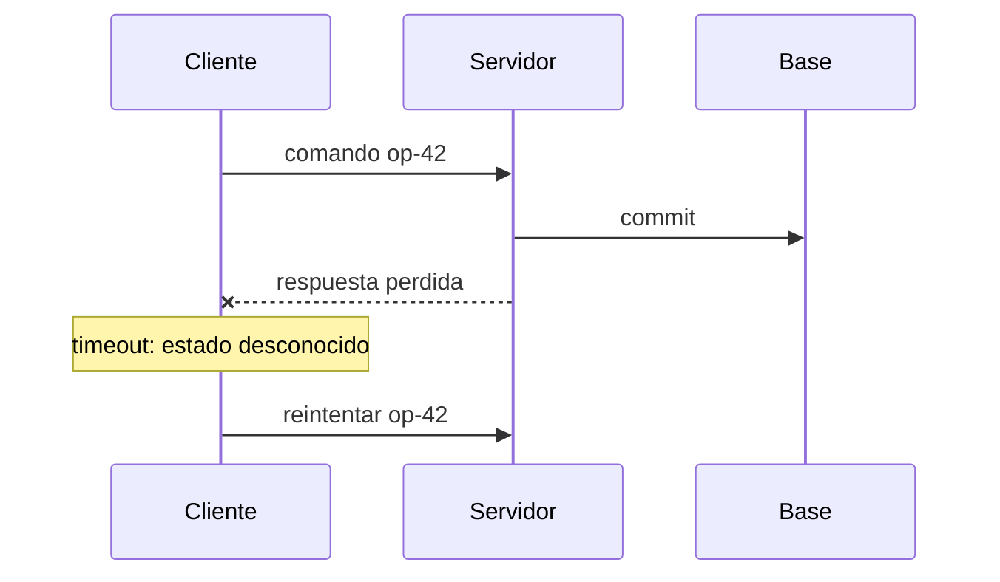
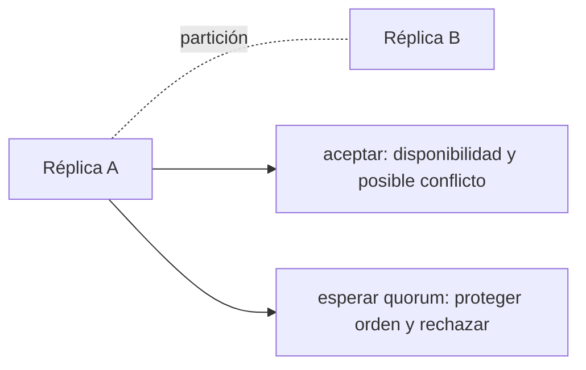
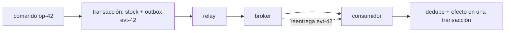
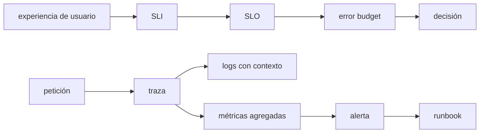

# Sistemas distribuidos, resiliencia y observabilidad

Una aplicación local puede asumir que una llamada termina o falla de forma visible. Cuando dos procesos se comunican por red aparece una tercera posibilidad: el resultado es **desconocido**. La respuesta puede perderse después de que el servidor confirmó un pedido; un mensaje puede llegar dos veces; dos réplicas pueden observar órdenes diferentes. Este módulo enseña a razonar bajo esa incertidumbre sin prometer garantías que el sistema no puede cumplir.


## Aprende construyendo

### Tema 1: La red convierte el resultado en una incertidumbre

#### Paso 1 · Objetivo y preparación
Al finalizar vas a simular un timeout real al confirmar una entrega de RutaFlow, y a comprobar por qué el cliente no puede saber qué pasó del otro lado. Prerrequisitos: Python 3 instalado.

#### Paso 2 · Contexto y caso real
Cuando la app del conductor envía "confirmar entrega" y la conexión se corta antes de recibir respuesta, el conductor no sabe si el servidor nunca recibió el comando, lo procesó y se perdió la respuesta, o lo procesó dos veces por un reintento previo.

#### Paso 3 · Teoría, modelo mental y analogía
La red es una carretera con retrasos, pérdidas y duplicados — un timeout es un límite de espera local, nunca una prueba de lo que pasó del lado del servidor.

#### Paso 4 · Demostración guiada
```python
import socket

def confirmar_con_timeout(sock, command_id, segundos=2):
    sock.settimeout(segundos)
    try:
        sock.sendall(f"CONFIRMAR {command_id}".encode())
        return sock.recv(1024)
    except socket.timeout:
        return None  # estado desconocido: no sabemos si el servidor procesó el comando
```
Resultado esperado: si el servidor tarda más que `segundos`, la función devuelve `None` — eso significa literalmente "no sé qué pasó", no "falló".

#### Paso 5 · Práctica guiada
Pista: tratá ese `None` como "seguro que falló" y reenviá el mismo comando SIN usar el mismo `command_id` (generando uno nuevo) — ese es el fallo deliberado: si el primer intento sí había llegado y se procesó, ahora la entrega queda confirmada dos veces con dos IDs distintos, exactamente el duplicado que la identidad del comando (Tema 3) existe para evitar.

#### Paso 6 · Práctica independiente
Corregí el Paso 5 reenviando el comando con el MISMO `command_id` original, y documentá qué necesitaría el servidor para responder correctamente a ese reintento (pista: la respuesta del Tema 3, `findCommandResult(commandId)`).

#### Paso 7 · Cierre y evidencia
Entregá el timeout real devolviendo estado desconocido del Paso 4, el duplicado provocado por generar un ID nuevo del Paso 5, y la corrección reusando el ID original del Paso 6; explicá por qué tratar un timeout como "falló con certeza" es tan equivocado como tratarlo como "funcionó con certeza". Siguiente paso: estudiar consistencia. Errores comunes: asumir orden y reintentar sin límite. Fuente oficial: https://sre.google/sre-book.
**Conceptos clave:** sistema distribuido, nodo, mensaje, latencia, ancho de banda, timeout, fallo parcial, pérdida, duplicación, reordenamiento, reloj físico, reloj lógico, causalidad y deadline.

Un sistema distribuido contiene componentes que cooperan mediante mensajes y no comparten una memoria ni un reloj perfecto. Un proceso puede continuar mientras otro está caído, lento o aislado. Esto produce **fallos parciales**: desde un nodo no siempre es posible distinguir si el receptor falló, la red está lenta o solo se perdió la respuesta.

Si el cliente envía “retirar 1 unidad” y vence su timeout, no sabe si el servidor nunca recibió, recibió pero falló o completó y perdió la respuesta. Repetir sin identidad puede retirar dos veces. Un timeout es un límite de espera local, no una prueba sobre el estado remoto.

La latencia tiene distribución y cola; no es una constante. Un deadline comunica cuánto tiempo total queda para una operación y debe propagarse a dependencias. Si cada capa usa un timeout independiente de cinco segundos, una solicitud puede consumir muchos múltiplos del presupuesto original.

Los relojes físicos derivan y se sincronizan con error. No uses una marca temporal como prueba absoluta de orden entre máquinas. Cuando importa la relación “A ocurrió antes que B”, registra causalidad mediante versión, secuencia o reloj lógico. Dos eventos sin relación causal pueden ser concurrentes aunque sus timestamps parezcan ordenados.

```python
from dataclasses import dataclass

@dataclass(frozen=True)
class Command:
    operation_id: str
    product_id: int
    quantity: int

def withdraw(client, command: Command, deadline_seconds: float):
    # operation_id conserva identidad a través de reintentos.
    return client.post("/withdrawals", json=command.__dict__, timeout=deadline_seconds)
```

**Analogía:** envías una carta certificada y no recibes el acuse. El silencio no permite saber si la carta no llegó o si llegó y el acuse se perdió. Reenviar una orden sin número único puede ejecutar dos compras.

**¿Por qué es importante?** porque muchos defectos distribuidos nacen al tratar una llamada remota como una función local. La red añade latencia, pérdida, independencia de fallos y estados desconocidos.

**Casos de uso reales:** pagos con respuesta perdida, API lenta, servicio DNS intermitente, petición móvil que cambia de red, procesamiento fuera de orden y jobs ejecutados tras un reinicio.

**Diagrama:**



### Tema 2: Replicación, consistencia y decisiones explícitas

#### Paso 1 · Objetivo y preparación
Al finalizar vas a simular una lectura obsoleta real sobre una réplica de `ShipmentEvents` de RutaFlow, y a decidir si ese envío específico tolera esa inconsistencia. Prerrequisitos: ninguno adicional.

#### Paso 2 · Contexto y caso real
Si `ShipmentEvents` tuviera una tabla global multi-región (como la del Módulo 33 del track Cloud), el estado "entregado" podría escribirse en una región y tardar en replicarse a la otra — alguien consultando desde la región equivocada vería un estado viejo.

#### Paso 3 · Teoría, modelo mental y analogía
Las réplicas son copias con reglas de coordinación propias; leer una réplica puede devolver un estado anterior al real — el mismo quorum que evita decisiones aisladas también tiene un costo de latencia.

#### Paso 4 · Demostración guiada
```python
primaria = {"env-4471": "entregado"}
replica = {"env-4471": "en_ruta"}  # todavía no recibió la replicación

def leer_estado(fuente, shipment_id):
    return fuente.get(shipment_id)

print("primaria:", leer_estado(primaria, "env-4471"))
print("réplica (obsoleta):", leer_estado(replica, "env-4471"))
```
Resultado esperado: `primaria` devuelve `"entregado"`, `réplica` todavía devuelve `"en_ruta"` — ambos valores son reales en su propia copia, la inconsistencia es temporal, no un bug.

#### Paso 5 · Práctica guiada
Pista: usá el valor de la réplica para decidir si facturar el envío como completado — ese es el fallo deliberado: facturar basándose en una lectura obsoleta podría cobrar antes de que la entrega esté realmente confirmada en todo el sistema, exactamente el tipo de operación que necesita consistencia fuerte (leer siempre de la primaria), no eventual.

#### Paso 6 · Práctica independiente
Identificá, para RutaFlow, una operación que SÍ toleraría leer de la réplica (pista: mostrar el historial de ubicaciones en un panel de analítica, Módulo 19 del track Cloud) frente a una que no (pista: decidir si cobrar o reembolsar) — documentando el criterio que usaste para distinguirlas.

#### Paso 7 · Cierre y evidencia
Entregá la lectura obsoleta real del Paso 4, el uso incorrecto para facturación del Paso 5, y la clasificación de operaciones del Paso 6; explicá por qué "elegir una base AP o CP" no sustituye decidir, operación por operación, qué inconsistencia tolera el negocio. Siguiente paso: estudiar mensajes. Errores comunes: prometer consistencia sin coste y ocultar lecturas obsoletas. Fuente oficial: https://martinfowler.com/articles/patterns-of-distributed-systems.
**Conceptos clave:** réplica, líder, seguidor, quorum, partición, disponibilidad, consistencia linealizable, consistencia eventual, lectura obsoleta, conflicto, consenso, CAP, PACELC y fencing token.

Replicar datos mejora tolerancia a fallos y capacidad de lectura, pero exige decidir qué valor observar cuando las copias difieren. En replicación con líder, las escrituras pasan por una autoridad y seguidores aplican cambios después. Leer un seguidor puede devolver estado anterior. En multi-líder o peer-to-peer aparecen conflictos que requieren reglas de resolución compatibles con el dominio.

**Consistencia** no significa una sola cosa. La linealizabilidad hace que operaciones parezcan ocurrir en un orden único compatible con tiempo real; es útil para reservar el último artículo, pero cuesta coordinación. La consistencia eventual promete convergencia si cesan actualizaciones; puede ser suficiente para un contador analítico, no necesariamente para autorizar un retiro.

CAP no dice “elige dos para siempre”. Durante una partición de red, una operación concreta debe rechazar o esperar para conservar consistencia, o aceptar y arriesgar divergencia para conservar disponibilidad. Sin partición, PACELC recuerda que aún existe un compromiso entre latencia y consistencia. La elección se hace por invariante y operación, no por etiqueta del producto.

El consenso permite acordar una secuencia o líder pese a ciertos fallos; protocolos como Raft requieren mayorías y no crean disponibilidad cuando no existe quorum. Un lock distribuido con lease puede expirar mientras el antiguo propietario sigue trabajando. Un **fencing token** creciente permite que el recurso rechace escrituras de propietarios obsoletos.

```text
Invariante fuerte: ninguna ubicación vende más unidades de las asignadas.
Opción A: coordinar cada venta con autoridad central.
Opción B: reservar cupos por ubicación y reconciliar transferencias.
```

La opción B conserva autonomía usando partición explícita del inventario; no elimina el invariante, lo reformula con derechos de venta limitados.

**Analogía:** dos taquillas desconectadas no pueden vender libremente el mismo último asiento y garantizar que nunca se duplique. Pueden esperar conexión o recibir previamente cupos diferentes.

**¿Por qué es importante?** porque seleccionar una base “AP” o “CP” no sustituye analizar qué inconsistencia soporta el negocio y cómo se repara.

**Casos de uso reales:** catálogos con lecturas obsoletas tolerables, stock y saldos fuertes, elección de líder, cachés, réplicas geográficas y bloqueos de jobs.

**Diagrama:**



### Tema 3: Mensajes que se procesan con efectos exactamente una vez

#### Paso 1 · Objetivo y preparación
Al finalizar vas a confirmar, ejecutando el código real de RutaFlow, que `confirmDelivery` ya logra el efecto "exactamente una vez" aunque el comando llegue duplicado. Prerrequisitos: Node.js instalado.

#### Paso 2 · Contexto y caso real
Si la app del conductor reintenta "confirmar entrega" por una mala conexión (Tema 1), el mismo `commandId` puede llegarle al backend dos o tres veces — `examples/rutaflow/node/confirm-delivery.ts` ya resuelve esto, pero nunca lo comprobamos ejecutándolo de verdad.

#### Paso 3 · Teoría, modelo mental y analogía
Un broker es una bandeja numerada; la deduplicación por `commandId` hace que repetir el mismo número nunca produzca un segundo efecto, solo devuelve el recibo que ya existía.

#### Paso 4 · Demostración guiada
```typescript
import { confirmDelivery, type DeliveryRepository, type DeliveryResult } from "./confirm-delivery";

const resultados = new Map<string, DeliveryResult>();
const repo: DeliveryRepository = {
  async findCommandResult(commandId) { return resultados.get(commandId) ?? null; },
  async confirm(command) {
    const result = { shipmentId: command.shipmentId, status: "delivered" as const };
    resultados.set(command.commandId, result);
    return result;
  },
};

const comando = { commandId: "cmd-1", shipmentId: "env-4471", occurredAt: "2026-10-05", recipientPin: "837201" };
console.log(await confirmDelivery(comando, repo));
console.log(await confirmDelivery(comando, repo)); // mismo commandId, reenviado
```
Resultado esperado: ambas líneas imprimen el mismo resultado, pero `repo.confirm()` solo se ejecuta una vez — la segunda llamada a `confirmDelivery` lo detecta con `findCommandResult` y devuelve el resultado ya guardado, sin volver a "confirmar" nada.

#### Paso 5 · Práctica guiada
Pista: cambiá el segundo comando para que use `commandId: "cmd-2"` (distinto) pero el mismo `shipmentId` — ese es el fallo deliberado: como el `commandId` es nuevo, `confirmDelivery` lo trata como un comando genuino y vuelve a llamar `repo.confirm()`, confirmando el mismo envío una segunda vez; la deduplicación protege por `commandId`, no por `shipmentId`.

#### Paso 6 · Práctica independiente
Agregá un `console.log` dentro de `repo.confirm` para contar cuántas veces se ejecuta de verdad, y repetí el comando original (`cmd-1`) cinco veces seguidas — confirmá que el contador queda en 1, sin importar cuántos reintentos reciba.

#### Paso 7 · Cierre y evidencia
Entregá la deduplicación real confirmada del Paso 4, el duplicado por ID distinto del Paso 5, y el contador en 1 tras cinco reintentos del Paso 6; explicá por qué la garantía es "exactamente una vez por `commandId`", no "exactamente una vez por envío" en términos absolutos. Siguiente paso: estudiar resiliencia. Errores comunes: confundir entrega con efecto y reintentar operaciones no idempotentes. Fuente oficial: https://microservices.io/patterns/data/transactional-outbox.html.
**Conceptos clave:** productor, broker, consumidor, ack, entrega al menos una vez, como máximo una vez, exactamente una vez efectiva, idempotencia, deduplicación, retry, backoff, jitter, dead-letter queue, outbox y saga.

Los brokers desacoplan tiempo y capacidad: el productor publica y el consumidor procesa después. Pero el acknowledgement puede perderse y el broker reenviar. “Al menos una vez” implica posibles duplicados; “como máximo una vez” puede perder trabajo. Muchos sistemas que anuncian exactly-once limitan la garantía a una frontera. El efecto de negocio requiere diseño idempotente de extremo a extremo.

Una operación idempotente produce el mismo efecto observable al repetirse con la misma identidad. Guarda `operation_id` bajo restricción única en la misma transacción del cambio. Si llega otra vez, devuelve el resultado registrado sin repetir el retiro.

El problema de doble escritura ocurre al actualizar la base y publicar un evento como pasos separados. Si la aplicación cae entre ambos, uno queda sin el otro. El patrón **transactional outbox** escribe cambio y evento pendiente en una transacción local; un relay publica después y marca progreso. Puede publicar dos veces, por lo que el consumidor también deduplica.

```sql
BEGIN;
UPDATE products SET stock = stock - 1
 WHERE id = 7 AND stock >= 1;
INSERT INTO outbox(event_id, kind, payload, published)
 VALUES ('evt-42', 'StockWithdrawn', '{"product_id":7}', 0);
COMMIT;
```

Los reintentos se reservan para errores transitorios y usan backoff exponencial con jitter para evitar una estampida sincronizada. Deben respetar deadline y presupuesto máximo. Errores permanentes van a revisión o dead-letter con contexto y procedimiento; una DLQ sin propietario es un cementerio silencioso.

Una saga coordina una transacción de negocio entre servicios mediante pasos y compensaciones. Compensar no viaja atrás en el tiempo: crea una acción nueva y puede fallar. Diseña estados intermedios visibles, operaciones idempotentes y recuperación manual.

**Analogía:** el outbox es el libro de correspondencia de una oficina. La decisión y la nota “enviar aviso” se registran juntas; un mensajero puede intentar varias veces y el destinatario reconoce el número de expediente.

**¿Por qué es importante?** porque una entrega duplicada es normal bajo recuperación. Sin identidad e invariantes, los reintentos que mejoran disponibilidad corrompen datos.

**Casos de uso reales:** cobros, emails, webhooks, integración de inventario, workers, importaciones masivas y publicación de eventos de dominio.

**Diagrama:**



### Tema 4: Resiliencia y observabilidad orientadas a objetivos

#### Paso 1 · Objetivo y preparación
Al finalizar vas a definir un SLI/SLO real para `confirmar-entrega` de RutaFlow, y a medir cuánto presupuesto de error consume una dependencia lenta. Prerrequisitos: Python 3 instalado.

#### Paso 2 · Contexto y caso real
Si el proveedor de SMS que notifica al cliente (Módulo 10 del track Cloud) empieza a responder lento, RutaFlow necesita un número concreto para decidir si eso ya es un problema real o todavía tolerable, no una sensación de "se siente lento".

#### Paso 3 · Teoría, modelo mental y analogía
Un SLI mide lo que importa (proporción de confirmaciones completadas bajo 300ms); el error budget es la fracción de incumplimiento que el negocio decidió tolerar — una alerta solo tiene sentido si consume una parte real de ese presupuesto.

#### Paso 4 · Demostración guiada
```python
def sli_confirmaciones(eventos):
    elegibles = [e for e in eventos if e["valido"]]
    buenos = [e for e in elegibles if e["estado"] == "ok" and e["ms"] <= 300]
    return len(buenos) / len(elegibles) if elegibles else 1.0

eventos = [
    {"valido": True, "estado": "ok", "ms": 120},
    {"valido": True, "estado": "ok", "ms": 280},
    {"valido": True, "estado": "ok", "ms": 900},  # el proveedor de SMS respondió lento
]
print(sli_confirmaciones(eventos))
```
Resultado esperado: `0.6666...` — dos de tres confirmaciones cumplieron el SLI de 300ms; si el SLO es 99.9% en 28 días, este único evento lento ya consume una fracción real y medible del presupuesto de error, no una sensación vaga.

#### Paso 5 · Práctica guiada
Pista: cambiá el cálculo para usar `mean([e["ms"] for e in eventos])` como única métrica, en vez del SLI de proporción bajo el umbral — ese es el fallo deliberado: el promedio (433ms) puede esconder que 2 de 3 confirmaciones estuvieron perfectamente bien y solo una se disparó; el SLI correcto mide el resultado que le importa al usuario, no un promedio que cualquier valor extremo puede distorsionar.

#### Paso 6 · Práctica independiente
Agregá una alerta que dispare solo cuando el SLI caiga por debajo de un umbral sostenido (por ejemplo, menos de 99% durante más de 5 minutos, no por un solo evento lento aislado), y documentá qué acción humana concreta debería seguir esa alerta — una alerta sin acción clara es ruido, no observabilidad.

#### Paso 7 · Cierre y evidencia
Entregá el SLI real calculado del Paso 4, el promedio engañoso del Paso 5, y la alerta con acción concreta del Paso 6; explicá por qué medir "lo que le importa al usuario" (confirmaciones a tiempo) es distinto de medir "lo que es fácil de medir" (CPU, promedio). Siguiente paso: estudiar sistemas operativos. Errores comunes: alertar sin acción y medir solo promedios. Fuente oficial: https://sre.google/sre-book/monitoring-distributed-systems/.
**Conceptos clave:** resiliencia, bulkhead, circuit breaker, load shedding, degradación, observabilidad, log, métrica, traza, correlation ID, SLI, SLO, error budget, alerta, runbook, incidente y postmortem.

Resiliencia es mantener una función aceptable y recuperarse; no fingir que nada falla. Timeouts limitan espera; bulkheads aíslan recursos; circuit breakers evitan insistir sobre una dependencia que falla; load shedding rechaza temprano cuando aceptar empeoraría todo. Cada patrón tiene coste y estado propio. Un circuit breaker mal configurado puede ocultar recuperación o amplificar oscilaciones.

La observabilidad permite inferir estado interno desde señales. Los logs describen eventos con campos estructurados; métricas agregan series numéricas; trazas conectan el camino de una solicitud entre componentes. Incluye `trace_id`, `operation_id` y versión, pero evita contraseñas, tokens y datos personales. Alta cardinalidad como `user_id` puede volver inviable una métrica; pertenece normalmente a logs protegidos o atributos muestreados.

Un SLI mide comportamiento que importa: proporción de retiros válidos completados bajo 300 ms, por ejemplo. El SLO fija un objetivo y ventana: 99.9 % durante 28 días. El error budget es la fracción permitida de incumplimiento y facilita decidir entre velocidad de cambio y trabajo de confiabilidad. Una alerta debe representar consumo significativo del presupuesto y tener acción humana clara.

```python
def availability_sli(events):
    eligible = [e for e in events if e["valid_request"]]
    good = [e for e in eligible if e["status"] == "ok" and e["ms"] <= 300]
    return len(good) / len(eligible) if eligible else 1.0
```

Durante un incidente: declara coordinación, limita impacto, conserva línea temporal, comunica y recupera. Después, un postmortem sin culpables analiza condiciones y defensas, no busca una persona “causante”. Las acciones deben tener propietario, prioridad y criterio verificable.

**Analogía:** el tablero de un avión no evita turbulencia; ofrece señales relacionadas para reconocerla y procedimientos practicados para mantener vuelo seguro.

**¿Por qué es importante?** porque un sistema distribuido no puede operarse con `print` desconectados ni alertas sobre cada error. Se necesitan objetivos de usuario, correlación y decisiones ensayadas.

**Casos de uso reales:** latencia de checkout, saturación de pool, dependencia caída, cola acumulada, despliegue defectuoso, guardia operativa y game days.

**Diagrama:**



## Construcción guiada del capítulo

### Proyecto 10: inventario distribuido mínimo y observable

No dividas el sistema en muchos microservicios. Conserva el núcleo modular y añade únicamente un proceso API, un relay de outbox y un consumidor de reportes. La meta es observar garantías y fallos, no acumular infraestructura.

1. Define los invariantes de retiro y reporte, modelo de consistencia y garantía de entrega.
2. Agrega `operation_id` a comandos y una restricción única. Prueba repetición secuencial y concurrente.
3. Escribe el cambio de stock y evento outbox en una sola transacción SQLite.
4. Implementa un relay reiniciable que pueda publicar duplicados deliberadamente.
5. Implementa consumidor con tabla de eventos procesados y efecto idempotente.
6. Conecta los tres procesos con Docker Compose y una cola simple apropiada para aprendizaje.
7. Crea un proxy o adaptador de fallos configurable: latencia, pérdida de respuesta, duplicación y pausa del consumidor.
8. Instrumenta logs JSON, métricas y trazas con identificadores correlacionados.
9. Define un SLI, SLO y alerta. Genera carga normal y un fallo que consuma presupuesto.
10. Ejecuta un game day: reinicia relay después del commit, duplica mensajes, llena cola y recupera siguiendo el runbook.
11. Entrega línea temporal y postmortem con impacto, factores contribuyentes, detección, recuperación y acciones verificables.

**Verificación:** demuestra mediante consultas que cada `operation_id` afecta stock una vez, cada evento converge a un único efecto y ningún evento comprometido se pierde tras reinicios. Muestra una traza completa, métricas antes/durante/después y logs correlacionados. Ejecuta todo desde un clon limpio con un solo comando documentado.

**Errores comunes y soluciones**

- Reintentar todo: clasifica errores permanentes, transitorios y ambiguos; limita por deadline.
- Confundir ACK con efecto único: deduplica junto al efecto del consumidor.
- Marcar outbox antes de publicar: publica y luego marca; acepta duplicación segura.
- Usar timestamp como orden global: utiliza secuencia o relación causal.
- Crear una métrica por usuario: controla cardinalidad y privacidad.
- SLO basado en CPU: vincúlalo con resultado y latencia percibidos por usuario.
- Postmortem “el operador falló”: investiga por qué una acción humana podía causar impacto sin barreras.
