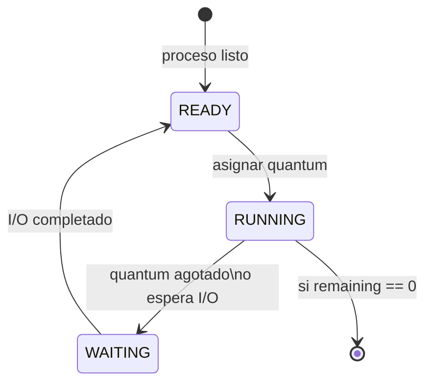
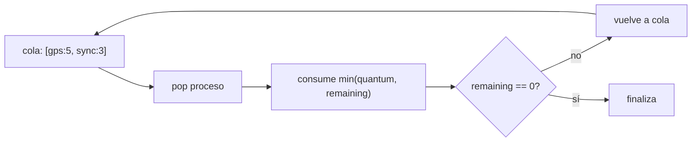
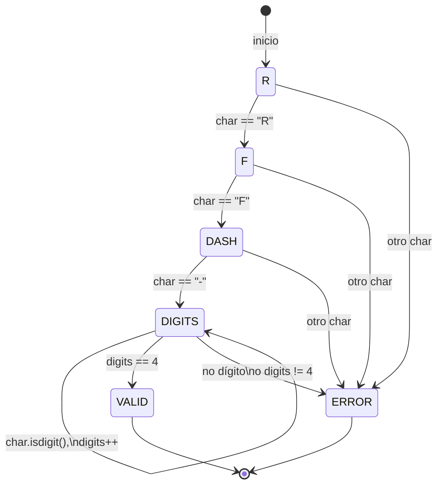
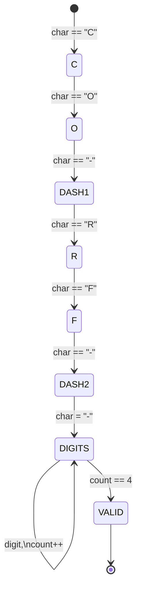
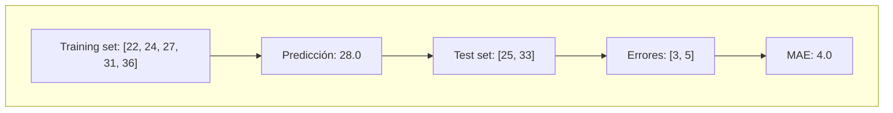
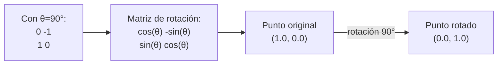

# Módulo 11: Ciencias de la Computación: mapa de especializaciones

## Antes de comenzar: entorno de experimentos

Necesitas Python 3 y una terminal. Crea `academia-labs/foundations/specializations/{src,evidence}`; en Windows PowerShell crea las dos carpetas por separado si tu terminal no expande llaves. Comprueba `python3 --version` o `py --version`. No instales dependencias: todos los ejemplos usan la biblioteca estándar.

## Aprende construyendo

Este capítulo no intenta resumir toda la disciplina. Construirás seis experimentos pequeños para distinguir sus áreas, reconocer los fundamentos que comparten y elegir qué estudiar después con evidencia. Trabaja dentro de `academia-labs/foundations/specializations/` y guarda cada resultado en `evidence/`.

### Tema 1: Sistemas, arquitectura y sistemas operativos

#### Paso 1 · Objetivo y preparación
Al finalizar vas a simular con Round Robin cómo un dispositivo de RutaFlow repartiría CPU entre GPS, sincronización y procesamiento de fotos. Prerrequisitos: Python 3 instalado.
#### Paso 2 · Contexto y caso real
A lo largo de estos 12 módulos vas a construir el proyecto integrador Fundamentos; en este módulo le toca refactorizar todo en un CLI profesional. El dispositivo del conductor corre varias tareas a la vez (reportar GPS, sincronizar datos, procesar la foto de entrega) con un solo procesador — alguna política decide a quién le toca el turno.
#### Paso 3 · Teoría, modelo mental y analogía
El sistema operativo coordina recursos como el administrador de una mesa compartida por turnos: cada proceso usa la CPU por un tiempo fijo (quantum) y vuelve a la cola si le queda trabajo.
#### Paso 4 · Demostración guiada
Ejecutá el `round_robin.py` de más abajo con los procesos `gps` (ráfaga 5) y `sync` (ráfaga 3) y `quantum=2`.
#### Paso 5 · Práctica guiada
Pista: cambiá `quantum = 0` y volvé a correr el simulador — ese es el fallo deliberado: el programa nunca avanza, porque ningún proceso consume CPU con un quantum nulo; `quantum` tiene que ser mayor que cero para que el planificador tenga sentido.
#### Paso 6 · Práctica independiente
Agregá un tercer proceso `photo` con ráfaga 7 y contá cuántos turnos completos necesita hasta llegar a cero.
#### Paso 7 · Cierre y evidencia
Entrega código, salida, fallo y corrección; explica el resultado. Siguiente paso: algoritmos. Errores comunes: confundir proceso e hilo. Fuente oficial: https://pages.cs.wisc.edu/~remzi/OSTEP/.

**¿Por qué es importante?** Permite entender por qué una aplicación compite por CPU, memoria y entrada/salida antes de intentar optimizarla.

**Qué construirás:** un simulador mínimo de planificación de procesos. Un sistema operativo decide qué trabajo usa el procesador; la cola no es la CPU, sino el modelo que permite decidir el siguiente turno. Esto importa en servidores, móviles y sistemas de entregas porque una mala política aumenta latencia o deja tareas sin atender.

**Conceptos clave:** un *proceso* es un programa en ejecución; una *ráfaga* es el tiempo de CPU que necesita; *Round Robin* asigna turnos de duración fija. No concluyas que una política es universalmente mejor: el resultado depende de carga, prioridad y coste del cambio de contexto.

**Modelo mental:** imagina una mesa compartida por turnos. **Límite:** el simulador no representa prioridades, espera de entrada/salida ni el coste real de cambiar de proceso.

Crea `src/round_robin.py`:

```python
from collections import deque

processes = deque([{"id": "gps", "remaining": 5}, {"id": "sync", "remaining": 3}])
quantum = 2

while processes:
    process = processes.popleft()
    consumed = min(quantum, process["remaining"])
    process["remaining"] -= consumed
    print(f"{process['id']}: usa {consumed}, resta {process['remaining']}")
    if process["remaining"] > 0:  # Solo vuelve a la cola si falta trabajo.
        processes.append(process)
```

Ejecuta `python3 src/round_robin.py`. **Resultado esperado:** turnos alternados hasta que ambos procesos lleguen a cero. Provoca `quantum = 0`: el programa no avanza porque ningún proceso consume CPU. Valida `quantum > 0` y explica el error en `evidence/systems.md`.

**Modifica y comprueba:** añade un proceso `photo` con ráfaga 7 y registra cuántos turnos necesita. En un sistema de logística, relaciona cada proceso con GPS, sincronización y procesamiento de evidencia fotográfica.


#### Profundización · Round Robin con prioridades y coste de cambio de contexto

**Escenario real:** En el dispositivo del conductor, `sync` (ráfaga 3) es más urgente que `photo` (ráfaga 7): perder la sincronización de GPS es peor que tardar en subir una foto. Tu simulador de Round Robin de este Tema trata a los tres procesos exactamente igual.

**Tu tarea (sin mirar solución):**

1. ¿Cómo modificarías `round_robin.py` para que `sync` consuma el doble de turnos que `photo` sin usar un quantum distinto por proceso?
2. Si cada cambio de proceso tuviera un coste fijo (por ejemplo, 1 unidad de tiempo perdida por cambio de contexto), ¿cómo afecta eso el tiempo total con `quantum=2` frente a `quantum=5`?
3. ¿Qué mide el "tiempo de espera" de un proceso en una cola Round Robin, y por qué `photo` (la ráfaga más larga) tiende a tener el peor tiempo de espera promedio bajo esta política?
4. ¿Qué política de planificación elegirías si `gps` NUNCA puede esperar más de 1 segundo?

[SOLUCIÓN — Lee solo después de intentar]

> **Respuesta esperada:**
> Para dar más turnos a `sync` sin cambiar el quantum, agregá dos entradas de `sync` en la cola inicial en vez de una: así compite por el doble de turnos solo por estar dos veces en la fila. Con un coste fijo por cambio de contexto, un quantum chico (2) produce más cambios de proceso que uno grande (5) para la misma carga total, así que ese coste penaliza más al quantum chico aunque reparta turnos de forma más pareja — es el trade-off real entre equidad y overhead. El tiempo de espera es el tiempo total que un proceso pasa en la cola sin ejecutar; `photo` espera más porque necesita más vueltas completas a la cola para completar sus 7 unidades de ráfaga. Si `gps` tiene un límite estricto de espera, Round Robin puro no lo garantiza: hace falta una política con prioridades o un planificador de tiempo real (deadline scheduling), no solo ajustar el quantum.

**Diagrama (Round Robin - máquina de estados):**



**Diagrama (simulador Round Robin - ciclo):**



### Tema 2: Algoritmos, autómatas, lenguajes y compiladores

#### Paso 1 · Objetivo y preparación
Al finalizar vas a construir un autómata que reconoce guías de RutaFlow con el formato `RF-####`. Prerrequisitos: Python 3 instalado.
#### Paso 2 · Contexto y caso real
Antes de buscar un envío en `ShipmentEvents`, RutaFlow necesita confirmar que la guía que alguien escribió tiene la forma correcta — reconocer la forma es un problema distinto (y más simple) que verificar que el envío exista.
#### Paso 3 · Teoría, modelo mental y analogía
Un autómata recorre un texto carácter por carácter, cambiando de estado — cada carácter abre o cierra el camino hacia un estado válido, como seguir un mapa de decisiones fijo.
#### Paso 4 · Demostración guiada
Ejecutá el `tracking_parser.py` de más abajo contra `"RF-2048"`, `"RF-20A8"` y `"RF-12345"`.
#### Paso 5 · Práctica guiada
Pista: quitá la comprobación `digits == 4` del `return` final, dejando que acepte cualquier cantidad de dígitos — ese es el fallo deliberado: `"RF-12345"` (5 dígitos) pasaría a ser válido, aceptando guías con una forma distinta a la que RutaFlow realmente usa.
#### Paso 6 · Práctica independiente
Corregí el Paso 5 restaurando `digits == 4`, y extendé el autómata para aceptar un prefijo de país opcional (`CO-RF-2048`) sin usar expresiones regulares — dibujando los estados nuevos a mano antes de programarlos.
#### Paso 7 · Cierre y evidencia
Entrega código, salida, fallo y corrección; explica el resultado. Siguiente paso: datos. Errores comunes: mezclar análisis y ejecución. Fuente oficial: https://craftinginterpreters.com/.

**Cuándo NO usar:** No intentes construir un parser con regex si la gramática es recursiva o compleja.

#### Profundización · Autómatas finitos vs gramáticas libres de contexto

**Escenario real:** RutaFlow ahora necesita validar no solo una guía suelta, sino un manifiesto de carga que agrupa guías entre paréntesis anidados, por ejemplo `(RF-2048 (RF-2049 RF-2050) RF-2051)`, para representar paquetes consolidados dentro de paquetes.

**Tu tarea (sin mirar solución):**

1. ¿Podés reconocer "paréntesis balanceados" con el mismo tipo de autómata de estados finitos que usaste para `RF-####`? ¿Por qué sí o por qué no?
2. ¿Qué información necesitarías recordar mientras leés el texto que un autómata de estados finitos (con un número fijo de estados) no puede recordar?
3. ¿Qué estructura de datos agregarías a tu parser para resolver esto, y por qué una pila (stack) encaja naturalmente con el anidamiento?
4. ¿En qué nivel de la jerarquía de Chomsky cae "paréntesis balanceados" frente a `RF-####`?

[SOLUCIÓN — Lee solo después de intentar]

> **Respuesta esperada:**
> No: un autómata finito tiene memoria fija (su estado actual), y "balanceado" requiere contar un número de paréntesis abiertos que no tiene límite superior — necesitarías infinitos estados para contar infinitos niveles de anidamiento. Lo que falta es una memoria que crezca con la entrada. Una pila resuelve esto: empujás al ver `(`, sacás al ver `)`, y el texto es válido si la pila queda vacía al terminar. `RF-####` es un lenguaje regular (nivel 3 de Chomsky, reconocible con autómata finito); "paréntesis balanceados" es un lenguaje libre de contexto (nivel 2), reconocible con un autómata de pila o un parser recursivo — exactamente la frontera que separa a un validador de formato de un compilador real.

**¿Por qué es importante?** Convierte reglas informales en lenguajes que una máquina puede reconocer, rechazar y probar de manera determinista.

**Qué construirás:** un analizador de códigos de seguimiento. Un autómata conserva un estado pequeño mientras lee símbolos; un parser decide si una secuencia pertenece a un lenguaje. Esta idea sostiene validadores, protocolos, compiladores y formularios.

El código válido tendrá `RF-` seguido de cuatro dígitos. Esta gramática es deliberadamente limitada: reconocer una forma no verifica que el envío exista ni que el usuario tenga autorización.

**Modelo mental:** cada carácter abre o cierra el camino hacia un estado válido. **Límite:** validar sintaxis no valida identidad, existencia ni permisos en un sistema real.

Crea `src/tracking_parser.py`:

```python
def is_tracking_code(text: str) -> bool:
    state = "R"
    digits = 0
    for char in text:
        if state == "R" and char == "R": state = "F"
        elif state == "F" and char == "F": state = "DASH"
        elif state == "DASH" and char == "-": state = "DIGITS"
        elif state == "DIGITS" and char.isdigit(): digits += 1
        else: return False  # Símbolo inválido para el estado actual.
    return state == "DIGITS" and digits == 4

for value in ["RF-2048", "RF-20A8", "RF-12345"]:
    print(value, is_tracking_code(value))
```

Ejecuta `python3 src/tracking_parser.py`. La salida esperada es `True`, `False`, `False`. El fallo más común es aceptar cualquier cantidad de dígitos; prueba límites antes de conectar el parser con datos reales.

**Modifica y comprueba:** permite un prefijo de país `CO-RF-2048` sin usar expresiones regulares. Dibuja los nuevos estados y guarda tres casos en `evidence/languages.md`.

**Diagrama (autómata para validar RF-####):**



**Diagrama (máquina con prefijo de país CO-RF-####):**



### Tema 3: Bases de datos, almacenes analíticos y minería de datos

#### Paso 1 · Objetivo y preparación
Al finalizar vas a agregar tiempos de entrega de RutaFlow por zona, y a confirmar que una restricción `CHECK` protege la calidad del dato. Prerrequisitos: Python 3 instalado.
#### Paso 2 · Contexto y caso real
RutaFlow necesita saber el tiempo promedio de entrega por zona para decidir dónde reforzar reparto — una pregunta analítica distinta de "guardar esta entrega puntual", aunque use los mismos datos.
#### Paso 3 · Teoría, modelo mental y analogía
Una base de datos es un archivo con reglas de acceso y consistencia; la base operacional es la libreta de trabajo del día, el almacén analítico es el archivo histórico que se consulta para comparar periodos.
#### Paso 4 · Demostración guiada
Ejecutá el `delivery_data.py` de más abajo y confirmá que agrupa minutos de entrega por zona (`norte`/`sur`).
#### Paso 5 · Práctica guiada
Pista: intentá insertar una entrega con `minutes = 0` — ese es el fallo deliberado: la restricción `CHECK(minutes > 0)` rechaza el dato con un error real de SQLite, no en silencio; si quitaras esa restricción, el promedio seguiría calculándose, pero sobre un dato que no debería existir.
#### Paso 6 · Práctica independiente
Agregá columnas `fecha` y `estado`, calculá entregas completadas por día, y documentá qué índice crearías para que esa consulta no tenga que recorrer la tabla completa cada vez (pista: el mismo problema de Query vs Scan del Módulo 4 del track Cloud).
#### Paso 7 · Cierre y evidencia
Entrega código, salida, fallo y corrección; explica el resultado. Siguiente paso: inteligencia artificial. Errores comunes: ignorar cardinalidad. Fuente oficial: https://www.postgresql.org/docs/.

**Cuándo NO usar:** No cachés consultas analíticas sin timestamp; son históricas. No confundas correlación con causalidad.

#### Profundización · Predicciones de rendimiento vs realidad

**Escenario real:** Calculaste: 100 tareas=1ms, 10k=100ms (lineal). Mides: 100=0.5ms, 10k=5000ms (cuadrático).

**Tu tarea (sin mirar solución):**

1. ¿Por qué tu predicción falló?
2. ¿O(n) u O(n²)?
3. ¿Caché, GC, otros factores?
4. ¿Cómo medir complejidad en producción?

[SOLUCIÓN — Lee solo después de intentar]

> **Respuesta esperada:**
> Predicción: basada en análisis teórico. Realidad: incluye overhead (GC, syscalls, cache miss). Mide con profiler real. Identifica cuello: sorting, JOINs no indexados, loops anidados.

**¿Por qué es importante?** Ayuda a separar decisiones operativas de análisis histórico y evita extraer conclusiones que los datos no respaldan.

**Qué construirás:** una consulta transaccional y una agregación analítica sobre entregas. Una base operacional optimiza escrituras y consultas concretas; un almacén analítico organiza historia para comparar periodos. Minería de datos busca patrones, pero una correlación no demuestra una causa.

**Modelo mental:** la base operacional es la libreta de trabajo actual y el almacén analítico es el archivo histórico. **Límite:** tres filas comprueban la consulta, pero no representan toda la operación.

Crea `src/delivery_data.py`:

```python
import sqlite3

db = sqlite3.connect(":memory:")
db.execute("CREATE TABLE delivery (zone TEXT NOT NULL, minutes INTEGER NOT NULL CHECK(minutes > 0))")
db.executemany("INSERT INTO delivery VALUES (?, ?)", [("norte", 31), ("norte", 25), ("sur", 48)])

query = "SELECT zone, COUNT(*), ROUND(AVG(minutes), 1) FROM delivery GROUP BY zone"
for zone, total, average in db.execute(query):
    print(zone, total, average)
```

Ejecuta `python3 src/delivery_data.py`. **Resultado esperado:** `norte 2 28.0` y `sur 1 48.0`. Intenta insertar cero minutos: la restricción `CHECK` debe rechazar el dato. Si eliminas esa restricción, el promedio seguirá ejecutándose, pero representará información inválida.

**Modifica y comprueba:** añade fecha y estado, calcula entregas completadas por día y explica qué índice usarías. Este experimento alimenta un tablero operativo real, no un modelo predictivo todavía.

### Tema 4: Inteligencia artificial, aprendizaje automático y visión

#### Paso 1 · Objetivo y preparación
Al finalizar vas a construir la línea base mínima que cualquier modelo de predicción de retraso de RutaFlow tendría que superar para justificar su complejidad. Prerrequisitos: Python 3 instalado.
#### Paso 2 · Contexto y caso real
Antes de entrenar un modelo complejo para predecir cuánto va a tardar una entrega, RutaFlow necesita saber qué tan bien le iría solo con el promedio histórico — sin esa línea base, no hay forma de saber si el modelo complejo realmente mejora algo.
#### Paso 3 · Teoría, modelo mental y analogía
Aprender es ajustar una función con datos y validar con datos que el modelo nunca vio — la línea base es el rival mínimo que cualquier modelo nuevo debe superar.
#### Paso 4 · Demostración guiada
Ejecutá el `delay_baseline.py` de más abajo y confirmá `predicción=28.0, mae=4.0`.
#### Paso 5 · Práctica guiada
Pista: calculá la predicción usando TODOS los minutos (entrenamiento + prueba mezclados) en vez de solo `training_minutes` — ese es el fallo deliberado (fuga de datos): el modelo "adivinaría" mejor de lo que realmente podría en producción, porque ya vio los datos que se supone debía predecir.
#### Paso 6 · Práctica independiente
Dejá `training_minutes` vacío y confirmá que el programa falla por división por cero — la corrección correcta no es inventar un valor de reemplazo, sino validar la entrada y registrar el incidente antes de publicar cualquier predicción.
#### Paso 7 · Cierre y evidencia
Entrega código, salida, fallo y corrección; explica el resultado. Siguiente paso: gráficos. Errores comunes: fuga de datos y sesgo no medido. Fuente oficial: https://scikit-learn.org/stable/user_guide.html.

**Cuándo NO usar:** No entrenes un modelo sin línea base. No uses datos de test en entrenamiento (fuga de datos).

#### Profundización · Validación cruzada: cuándo confiar en el MAE de la línea base

**Escenario real:** Tu línea base de este Tema midió `mae=4.0` usando un único split fijo: `training_minutes = [22, 24, 27, 31, 36]` contra `test_minutes = [25, 33]`. Con solo 2 datos de prueba, ese MAE depende muchísimo de qué valores cayeron justo en el conjunto de test.

**Tu tarea (sin mirar solución):**

1. Si reordenaras los 7 valores originales (`[22, 24, 25, 27, 31, 33, 36]`) y probaras otros splits de entrenamiento/prueba, ¿esperarías el mismo MAE siempre? ¿Por qué no?
2. ¿Qué es la validación cruzada (k-fold) y cómo evita depender de un solo split?
3. Con solo 7 valores totales, ¿tiene sentido hacer 5-fold cross-validation? ¿Qué problema aparece con folds muy chicos?
4. Si el modelo complejo (no la línea base) tuviera MAE=3.9 contra el MAE=4.0 de la línea base, ¿esa diferencia justifica la complejidad adicional?

[SOLUCIÓN — Lee solo después de intentar]

> **Respuesta esperada:**
> No, el MAE cambiaría con otro split: con tan pocos datos, un solo valor atípico en el conjunto de test puede dominar el promedio de errores. k-fold cross-validation divide los datos en k partes, entrena con k-1 y prueba con la restante, repitiendo k veces y promediando el error — así cada dato pasa por el conjunto de prueba exactamente una vez, reduciendo la dependencia de un split particular. Con 7 valores, folds muy chicos (por ejemplo "leave-one-out") dejan un solo dato de prueba por fold, lo que vuelve el MAE de cada fold tan ruidoso como el problema original; en la práctica se necesitan muchos más datos para que cross-validation aporte señal real. Una mejora de 4.0 a 3.9 con tan poca evidencia no justifica nada por sí sola: hay que ver si esa diferencia se mantiene a través de los folds o es solo ruido de muestra.

**¿Por qué es importante?** Obliga a comparar cualquier modelo con una línea base y a medir errores antes de confiar decisiones a una predicción.

**Qué construirás:** una línea base que estima retraso usando el promedio histórico. Una *característica* es una entrada medible; una *etiqueta* es el resultado que se quiere predecir; una línea base sencilla permite demostrar si un modelo complejo realmente mejora.

**Modelo mental:** la línea base es el rival mínimo que cualquier modelo nuevo debe superar. **Límite:** una media histórica no entiende tráfico, zona, clima ni cambios operativos.

Crea `src/delay_baseline.py`:

```python
training_minutes = [22, 24, 27, 31, 36]
test_minutes = [25, 33]
prediction = sum(training_minutes) / len(training_minutes)

errors = [abs(real - prediction) for real in test_minutes]
mae = sum(errors) / len(errors)  # Error absoluto medio: menor es mejor.
print(f"predicción={prediction:.1f}, mae={mae:.1f}")
```

Ejecuta `python3 src/delay_baseline.py`. **Resultado esperado:** `predicción=28.0, mae=4.0`. Deja `training_minutes` vacío para provocar una división por cero. La corrección profesional no es inventar un valor: valida datos, registra el incidente y evita publicar una predicción.

**Modifica y comprueba:** compara la media con la mediana y justifica cuál resiste mejor un valor extremo de 300 minutos. En cualquier sistema real, nunca uses ubicación, imagen o comportamiento personal sin propósito, consentimiento, retención definida y análisis de sesgo.

**Diagrama (scatter plot: predicción vs. error real):**



**Diagrama (interpretación visual del scatter):**

```
test_error (eje Y)
    ^
    | (25, 3) o
    | 
    | (33, 5) o
    |___________> train_error (eje X)
    0   10   20   28.0   40
    
    Línea base: predicción = 28.0 (roja)
    Puntos: (train_dato, |test_dato - predicción|)
```

### Tema 5: Gráficos y cómputo científico

#### Paso 1 · Objetivo y preparación
Al finalizar vas a rotar las coordenadas de una parada de RutaFlow y a confirmar que la distancia entre paradas se conserva. Prerrequisitos: Python 3 instalado.
#### Paso 2 · Contexto y caso real
Si el panel de seguimiento de RutaFlow necesitara reorientar el mapa de una zona (por ejemplo, para alinear la vista con la dirección de la ruta), la transformación tiene que conservar las distancias reales entre paradas, no deformarlas.
#### Paso 3 · Teoría, modelo mental y analogía
Un gráfico traduce variables y escalas en una comparación visible; una rotación es una transformación que debe conservar propiedades conocidas, como la distancia entre dos puntos.
#### Paso 4 · Demostración guiada
Ejecutá el `transform.py` de más abajo y confirmá que rotar `(1.0, 0.0)` por 90 grados da `(0.0, 1.0)`.
#### Paso 5 · Práctica guiada
Pista: quitá el `round(..., 6)` de la impresión final — ese es el fallo deliberado: vas a ver un número diminuto distinto de cero donde esperabas exactamente `0.0` (algo como `6.123e-17`); no es un error de la fórmula de rotación, es precisión finita de punto flotante, y confundir ambas cosas lleva a "corregir" código que ya era correcto.
#### Paso 6 · Práctica independiente
Rotá tres puntos que formen una pequeña ruta (por ejemplo, tres paradas de un envío) y verificá que la distancia entre cada par de puntos antes y después de rotar sea la misma — la propiedad real que una rotación debe conservar.
#### Paso 7 · Cierre y evidencia
Entrega código, salida, fallo y corrección; explica el resultado. Siguiente paso: redes. Errores comunes: ejes ambiguos y datos sin unidad. Fuente oficial: https://matplotlib.org/stable/users/explain/quick_start.html.

**Cuándo NO usar:** No ignores precisión numérica; es real. No confundas error de precisión con error lógico.

#### Profundización · Error numérico acumulado en transformaciones encadenadas

**Escenario real:** El panel de RutaFlow podría necesitar rotar la misma parada muchas veces seguidas (por ejemplo, para animar el giro del mapa paso a paso) en vez de aplicar una sola rotación de 90 grados.

**Tu tarea (sin mirar solución):**

1. Si rotás un punto 1 grado, 360 veces seguidas, usando la misma función `rotate()` de este Tema (encadenando el resultado de cada rotación como entrada de la siguiente), ¿esperás volver exactamente al punto original?
2. ¿Por qué cada rotación individual introduce un error de precisión tan chico, pero encadenar 360 puede hacerlo visible?
3. ¿Cómo lo comprobarías sin solo "mirar" los números impresos?
4. ¿Qué alternativa reduce la acumulación de error frente a aplicar la misma rotación muchas veces?

[SOLUCIÓN — Lee solo después de intentar]

> **Respuesta esperada:**
> No exactamente: cada llamada a `rotate()` redondea internamente con la precisión finita de `float`, y ese error chico (como el `6.123e-17` del Paso 5) se vuelve la entrada de la siguiente rotación, en vez de desaparecer. Una sola rotación introduce un error del orden de `1e-16`; 360 rotaciones encadenadas pueden acumular un error visible en la segunda o tercera cifra decimal. Para comprobarlo, calculá la distancia entre el punto final y el original (debería ser 0.0 exacto) y compará con una tolerancia (`abs(distancia) < 1e-9`) en vez de comparar igualdad exacta de floats. La alternativa más estable es calcular una sola rotación de 360 grados (que matemáticamente es la identidad) en vez de encadenar 360 rotaciones de 1 grado, porque así el error de redondeo no se acumula paso a paso.

**¿Por qué es importante?** Explica cómo mapas, animaciones y simulaciones transforman coordenadas conservando propiedades que pueden verificarse.

**Qué construirás:** una transformación de coordenadas 2D. Los gráficos representan puntos mediante vectores y los transforman con matrices; el cómputo científico exige además medir error numérico y documentar unidades.

**Modelo mental:** una transformación cambia la representación siguiendo una regla que debe conservar propiedades conocidas. **Límite:** este plano cartesiano no sustituye una proyección geográfica para GPS.

Crea `src/transform.py`:

```python
from math import cos, sin, pi

def rotate(point: tuple[float, float], degrees: float) -> tuple[float, float]:
    radians = degrees * pi / 180
    x, y = point
    return (x * cos(radians) - y * sin(radians), x * sin(radians) + y * cos(radians))

x, y = rotate((1.0, 0.0), 90)
print(round(x, 6), round(y, 6))
```

Ejecuta `python3 src/transform.py`. El resultado esperado es `0.0 1.0`. Sin `round` probablemente verás un número diminuto distinto de cero: no es necesariamente un error lógico, sino precisión finita de punto flotante.

**Modifica y comprueba:** rota tres puntos que formen una ruta y verifica que la distancia entre ellos se conserve. En un sistema de mapas esta base ayuda a entender mapas y animación, pero latitud y longitud reales requieren una proyección geográfica apropiada.

**Diagrama (rotación de 90 grados en 2D):**



**Diagrama (ruta de tres paradas antes y después de rotación):**

```
Antes (coordenadas originales):        Después (rotadas 90°):
  (0, 0) Salida                         (-0, 0) Salida
    ↓                                     ↓
  (1, 0) Parada 1     →rotación→       (0, 1) Parada 1
    ↓                                     ↓
  (1, 1) Entrega                        (-1, 1) Entrega

Distancia Salida→Parada 1: 1.0 (antes) = 1.0 (después) ✓
Distancia Parada 1→Entrega: 1.0 (antes) = 1.0 (después) ✓
```

### Tema 6: Redes, seguridad, web e ingeniería profesional

#### Paso 1 · Objetivo y preparación
Al finalizar vas a registrar un hallazgo real de latencia de RutaFlow separando evidencia, inferencia y decisión, sin que nada se pueda editar después en silencio. Prerrequisitos: Python 3 instalado.
#### Paso 2 · Contexto y caso real
Si alguien reporta "RutaFlow está lento", esa frase no es evidencia ni una decisión — hace falta separar lo que realmente se observó, la explicación provisional, y la acción concreta que se va a tomar.
#### Paso 3 · Teoría, modelo mental y analogía
Cada capa de ingeniería profesional tiene contrato, amenaza, prueba y responsable; evidencia es lo observado, inferencia es la explicación provisional, decisión es la acción reversible.
#### Paso 4 · Demostración guiada
Ejecutá el `evidence.py` de más abajo y confirmá que `Finding` imprime sus tres campos (`evidence`, `inference`, `decision`) por separado.
#### Paso 5 · Práctica guiada
Pista: cambiá `frozen=True` por `False` en `Finding`, y modificá `finding.evidence` DESPUÉS de haber tomado la decisión — ese es el fallo deliberado: técnicamente funciona, pero destruye la trazabilidad; alguien podría reescribir la evidencia original para que coincida con la decisión ya tomada, en vez de que la decisión siga respaldada por lo que realmente se observó.
#### Paso 6 · Práctica independiente
Restaurá `frozen=True`, agregá los campos `risk` y `owner` a `Finding`, y escribí un hallazgo real sobre el SLI de `confirmar-entrega` del Módulo 10 de este track (la latencia del proveedor de SMS) con sus cuatro campos completos.
#### Paso 7 · Cierre y evidencia
Entrega código, salida, fallo y corrección; explica el resultado. Siguiente paso: especialización. Errores comunes: seguridad como añadido y documentación desactualizada. Fuente oficial: https://owasp.org/www-project-top-ten/.

**Cuándo NO usar:** No guardes evidencia en variables mutables; es rastreable. No confundas observación con causa.

#### Profundización · De un Finding aislado a una línea temporal de incidente

**Escenario real:** El SLI de `confirmar-entrega` del Módulo 10 cayó por debajo del umbral durante 20 minutos. Durante ese tiempo se registraron tres `Finding` distintos (uno por cada persona que investigó), cada uno con su propia evidencia, inferencia y decisión — pero nadie los ordenó ni verificó si las decisiones se contradecían entre sí.

**Tu tarea (sin mirar solución):**

1. ¿Qué campo le agregarías a `Finding` para poder ordenar varios hallazgos de un mismo incidente en una línea temporal?
2. Si el primer `Finding` decide "esperar y monitorear" y el segundo, 10 minutos después, decide "escalar a infraestructura", ¿cómo registrás que la segunda decisión reemplaza a la primera sin borrar la primera (que sigue siendo evidencia real de lo que se pensó en ese momento)?
3. ¿Por qué la inmutabilidad de cada `Finding` (Paso 5 de este Tema) es precisamente lo que permite reconstruir esa línea temporal con confianza después?
4. ¿Qué parte de un postmortem (Módulo 10) depende directamente de tener varios `Finding` ordenados en vez de un solo resumen escrito después de que todo terminó?

[SOLUCIÓN — Lee solo después de intentar]

> **Respuesta esperada:**
> Un campo `timestamp` (o mejor, un reloj lógico/secuencia, como viste en el Módulo 10) permite ordenar los `Finding` sin depender de relojes de máquina desincronizados. La segunda decisión no borra la primera: se agrega un `Finding` nuevo que referencia al anterior (por ejemplo con un campo `supersedes`), y ambos quedan en la colección — la línea temporal es la lista completa, no el último registro. La inmutabilidad importa porque si cualquier `Finding` pudiera editarse después, alguien podría "corregir" el primero para que parezca que ya sabían del problema de infraestructura desde el principio, destruyendo la posibilidad de aprender de la secuencia real de decisiones. Un postmortem sin culpables (Módulo 10) depende exactamente de esto: reconstruir qué se sabía en cada momento, no juzgar con la información que solo apareció al final.

**¿Por qué es importante?** Enseña a comunicar evidencia y riesgos para que una decisión técnica pueda revisarse, reproducirse y corregirse.

**Qué construirás:** un informe reproducible que separa evidencia, inferencia y decisión. La ingeniería profesional no termina al producir código: declara amenazas, privacidad, accesibilidad, operación y límites éticos.

**Modelo mental:** evidencia es lo observado, inferencia es la explicación provisional y decisión es la acción reversible. **Límite:** una observación pequeña no demuestra por sí sola la causa de un incidente.

Crea `src/evidence.py`:

```python
from dataclasses import dataclass

@dataclass(frozen=True)
class Finding:
    evidence: str
    inference: str
    decision: str

finding = Finding(
    evidence="2 de 20 solicitudes superaron 500 ms",
    inference="la latencia podría concentrarse en una dependencia",
    decision="añadir trazas antes de escalar infraestructura",
)
print(finding)
```

Ejecuta `python3 src/evidence.py` y guarda la salida en `evidence/professional-practice.txt`. **Resultado esperado:** una representación de `Finding` con sus tres campos. Cambia `frozen=True` por `False` y modifica la evidencia después de decidir: técnicamente funciona, pero destruye la trazabilidad. La inmutabilidad no garantiza verdad; evita que el registro cambie accidentalmente.

**Modifica y comprueba:** añade `risk` y `owner`, después redacta un README para que otra persona reproduzca uno de los seis experimentos. El entregable es una decisión de especialización respaldada por resultados, límites y el prerrequisito que estudiarás después.

## Fuentes para continuar

- ACM/IEEE-CS/AAAI, *Computer Science Curricula 2023*.
- Python, SQLite y documentación de cada biblioteca estándar utilizada.
- NIST Secure Software Development Framework y W3C Web Accessibility Initiative para práctica profesional.
