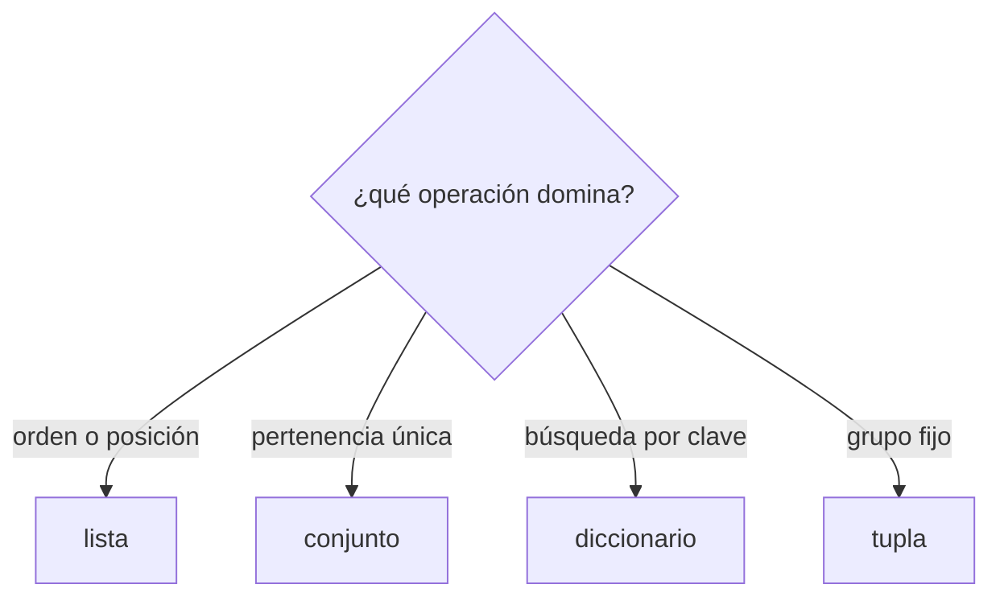
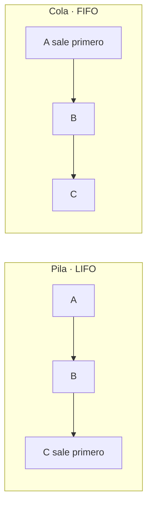
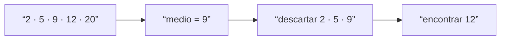
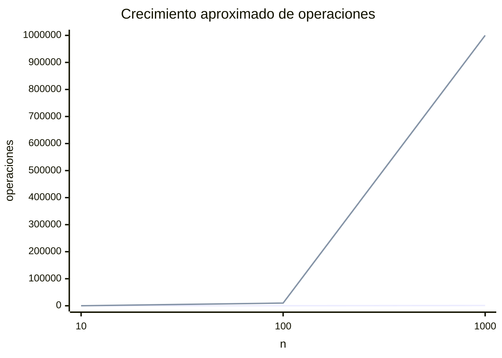

# Módulo 2: Estructuras de datos, algoritmos y complejidad


## Aprende construyendo

### Tema 1: Elegir estructuras según las operaciones

#### Paso 1 · Objetivo y preparación
Al finalizar vas a comparar guardar las tareas de tu gestor en una `list` contra guardarlas en un `dict` indexado por id, para la operación "buscar la tarea con id X", y vas a reproducir un bug real de confundir la posición de una lista con la identidad de una tarea. **Prerrequisitos:** Python instalado; comprobá `python3 --version` (o `py --version` en Windows).

#### Paso 2 · Contexto y caso real
El gestor de tareas CLI (proyecto integrador Fundamentos) necesita, desde el primer módulo, responder rápido a "¿existe la tarea con id 42?". Si guardás las tareas en una `list` y buscás por posición, cada eliminación desplaza los índices de todas las tareas que estaban después; un índice que guardaste antes de esa eliminación ya no es confiable, aunque Python no te avise.

#### Paso 3 · Teoría, modelo mental y analogía
Una `list` en Python es una secuencia: accedés rápido por posición (`lista[0]`), pero buscar por valor exige recorrerla elemento por elemento en el peor caso — es O(n). Un `dict` guarda pares clave-valor en una tabla hash: calcula dónde vive cada clave y accede casi siempre en O(1), sin importar cuántos elementos tenga. La diferencia de fondo es qué identifica a una tarea: en el diccionario, la clave (el id) es la identidad lógica de la tarea y no cambia; en la lista, la posición es solo un lugar físico que se corre cada vez que insertás o eliminás algo antes. La analogía es un archivador con carpetas rotuladas —vas directo a la etiqueta que buscás— contra una fila de cajas sin rotular, donde tenés que revisar caja por caja.

#### Paso 4 · Demostración guiada desde cero
Parte de una carpeta vacía y crea `src/tareas_estructura.py`:
```bash
mkdir ejemplo-estructuras
cd ejemplo-estructuras
mkdir src
```
```python
tareas = [
    {"id": 1, "descripcion": "comprar leche", "estado": "pendiente"},
    {"id": 2, "descripcion": "pagar factura", "estado": "pendiente"},
    {"id": 3, "descripcion": "llamar al dentista", "estado": "hecho"},
]

def buscar_por_id_lista(tareas, id_buscado):
    for tarea in tareas:
        if tarea["id"] == id_buscado:
            return tarea
    return None

por_id = {tarea["id"]: tarea for tarea in tareas}

indice_guardado = 1  # "la tarea 2 está en la posición 1" — guardado para usar después
print(tareas[indice_guardado]["descripcion"])
```
```bash
python src/tareas_estructura.py
```
**Resultado esperado:** `pagar factura` — la tarea 2 vive en la posición 1, y tanto `buscar_por_id_lista(tareas, 2)` como `por_id[2]` devuelven lo mismo. **Fallo deliberado:** eliminá la tarea 1 con `del tareas[0]` (como si "comprar leche" se completara y se sacara de la lista) y volvé a ejecutar `print(tareas[indice_guardado]["descripcion"])` sin tocar `indice_guardado`. Ahora imprime `llamar al dentista`: el índice 1 sigue siendo válido pero ya no apunta a la tarea 2, porque la eliminación desplazó una posición a todo lo que estaba después — sin ningún error. `por_id[2]` sigue devolviendo la tarea correcta porque el diccionario no depende de la posición física. Corregí siempre buscando por `por_id[id]`, nunca guardando un índice de lista para usar después.

#### Paso 5 · Práctica guiada
Pista: después de cualquier `del tareas[i]`, cualquier índice que guardaste antes queda potencialmente inválido aunque no lance error — confirmalo guardando el índice de la última tarea antes y después de eliminar la primera, y compará qué tarea devuelve cada vez.

#### Paso 6 · Práctica independiente
Agregá 50 tareas más a la lista y al diccionario (ids del 4 al 53), medí con `time.perf_counter()` cuánto tarda `buscar_por_id_lista` comparado con `por_id[53]` para el peor caso (el último id), y repetí con 5000 tareas. Anotá cómo crece el tiempo de la lista mientras el del diccionario se mantiene estable.

#### Paso 7 · Cierre y evidencia
Guardá el código con `buscar_por_id_lista`, el diccionario `por_id` y la demostración del índice desactualizado tras `del tareas[0]`; como siguiente paso, en el Tema 2 vas a usar pilas y colas para las funciones "deshacer" y "procesar en orden" del mismo gestor de tareas. Errores comunes: guardar un índice de lista y asumir que sigue apuntando a la misma tarea después de cualquier eliminación; elegir diccionario sin medir si en tu caso realmente hay más búsquedas que inserciones. Fuentes oficiales: https://docs.python.org/es/3/tutorial/datastructures.html y https://docs.python.org/es/3/library/stdtypes.html#dict.
**¿Por qué es importante?** Porque un id guardado en el lugar equivocado —una posición en vez de una clave— produce errores que no lanzan excepción: la tarea que "aparece" es simplemente otra.
**Evidencia de aprendizaje:** entregá la búsqueda por lista y por diccionario, el código que reproduce el índice desactualizado después de `del tareas[0]`, y la corrección usando `por_id`.
**Conceptos clave:** lista, tupla, conjunto, diccionario, orden, duplicados, clave, acceso, inserción y mutabilidad.

Una estructura de datos organiza valores para facilitar ciertas operaciones. No existe una estructura universalmente mejor. Una lista conserva orden y permite duplicados; un conjunto representa pertenencia sin duplicados; un diccionario relaciona claves únicas con valores; una tupla expresa una agrupación fija que no se modifica.

```python
productos = [
    {"sku": "A-10", "nombre": "Teclado", "stock": 4},
    {"sku": "B-20", "nombre": "Mouse", "stock": 9},
]

por_sku = {producto["sku"]: producto for producto in productos}
categorias = {"periféricos", "oficina", "periféricos"}
```

`productos` sirve para recorrer y conservar un orden. `por_sku` permite expresar “dame el producto cuya clave es A-10” sin revisar conceptualmente todos. `categorias` elimina el duplicado porque la pregunta relevante es pertenencia, no posición.

Antes de elegir, escribe las operaciones dominantes: buscar por SKU, listar en orden, agregar, eliminar y comprobar categorías. La estructura se decide por esas operaciones y por restricciones como memoria u orden estable. Duplicar una vista derivada —lista y diccionario— puede mejorar lectura a cambio de sincronización y memoria; esa es una decisión, no magia gratuita.

**Ejemplo desde cero:** modela cinco contactos. Primero usa una lista y escribe una búsqueda por teléfono. Después crea un diccionario indexado por teléfono y compara claridad. No afirmes que uno “es más rápido” sin explicar tamaño, operación y coste de mantener el índice.

**Analogía:** una lista es una fila numerada, un conjunto es un control de invitados únicos y un diccionario es un archivador con una etiqueta única por carpeta. Cada organización acelera preguntas distintas.

**¿Por qué es importante?** Seleccionar una estructura adecuada suele producir mejoras mayores y código más claro que optimizar instrucciones individuales. Bases de datos e índices generalizan la misma idea.

**Casos de uso reales:** carrito ordenado, permisos únicos, caché por identificador, catálogo por SKU y registro de coordenadas inmutables.

**Diagrama:**



#### Profundización · Diseño: Estructura óptima para "búsqueda frecuente, inserción rara"

**Escenario real:** El gestor de tareas mantiene 1000 tareas. Operación común: "¿existe tarea con ID 42?" (búsqueda). Inserción: una vez por día.

**Tu tarea (sin mirar solución):**

1. **Opciones:** Lista (array), diccionario (hash map), árbol ordenado. Compara búsqueda vs inserción.
2. **Costo:** Lista ordenada: búsqueda O(?), inserción O(?). Diccionario: O(?), O(?).
3. **Elige:** ¿Qué estructura para tu gestor?, ¿por qué?
4. **Trade-off:** Si cambias a "inserción frecuente", ¿cambias estructura?

**Escribe tu respuesta:**
```
Lista búsqueda: O(_), inserción: O(_)
Diccionario búsqueda: O(_), inserción: O(_)
Elegida para Fundamentos: _________ (¿por qué?)
Si inserción = 50/seg: cambiarías a _________
```

[SOLUCIÓN — Lee solo después de intentar]

> **Respuesta esperada:**
>
> **Lista:** Búsqueda O(n) / O(log n) si ordenada, inserción O(n).
>
> **Diccionario:** Búsqueda O(1), inserción O(1) promedio.
>
> **Fundamentos:** Diccionario `{id: tarea}` porque búsqueda es frecuente y O(1) es crítica.
>
> **Si 50 inserciones/seg:** Seguiría con diccionario (ambas O(1)). Solo si necesitas orden, usaría árbol.

### Tema 2: Pilas, colas y abstracciones de comportamiento

#### Paso 1 · Objetivo y preparación
Al finalizar vas a implementar un "deshacer" (undo) con una pila y un "procesar en el orden en que llegaron" con una cola, y vas a medir por qué usar una lista como cola (con `pop(0)`) es una trampa de rendimiento que no se nota hasta que la cola crece. **Prerrequisitos:** Tema 1 de este módulo.

#### Paso 2 · Contexto y caso real
El mismo gestor de tareas necesita dos comportamientos nuevos: un "deshacer" que revierta la última acción primero (crear tarea, luego marcarla hecha, luego deshacer debe revertir "marcarla hecha" antes que "crear tarea"), y un "procesar pendientes" que las atienda en el orden exacto en que se agregaron. Son dos abstracciones distintas —pila y cola— aunque ambas puedan implementarse con una lista de Python.

#### Paso 3 · Teoría, modelo mental y analogía
Una pila es LIFO: lo último que entra es lo primero que sale; una cola es FIFO: lo primero que entra es lo primero que sale. Esto es un contrato de comportamiento, no una implementación — podés construir ambas con una `list`. Lo que cambia es el costo: `list.append()` y `list.pop()` (sin índice) operan sobre el final de la lista y son O(1), porque Python solo ajusta un puntero; pero `list.pop(0)` o `list.insert(0, x)` operan sobre el principio y son O(n), porque hay que desplazar todos los elementos restantes una posición. `collections.deque` está pensada para operar en O(1) en AMBOS extremos. La analogía: una pila es una torre de platos (sacás el de arriba); una cola bien implementada es una fila donde atender al primero no mueve a nadie más; `list.pop(0)` es esa misma fila pero donde, cada vez que atienden a alguien, el resto tiene que dar un paso al frente.

#### Paso 4 · Demostración guiada desde cero
Parte de una carpeta vacía y crea `src/pila_cola.py`:
```bash
mkdir ejemplo-pila-cola
cd ejemplo-pila-cola
mkdir src
```
```python
import time
from collections import deque

# "Deshacer": cada acción se apila; deshacer = pop() (LIFO, la última entra, sale primero)
acciones = []
acciones.append("crear tarea 1")
acciones.append("marcar tarea 1 como hecha")
acciones.append("crear tarea 2")
print("deshacer:", acciones.pop())

# "Procesar en el orden en que llegaron": dos formas de representar la misma cola
pendientes_lista = list(range(20_000))
pendientes_deque = deque(range(20_000))

inicio = time.perf_counter()
while pendientes_lista:
    pendientes_lista.pop(0)
tiempo_lista = time.perf_counter() - inicio

inicio = time.perf_counter()
while pendientes_deque:
    pendientes_deque.popleft()
tiempo_deque = time.perf_counter() - inicio

print(f"list.pop(0): {tiempo_lista:.4f}s | deque.popleft(): {tiempo_deque:.4f}s")
```
```bash
python src/pila_cola.py
```
**Resultado esperado:** `deshacer: crear tarea 2` (deshace la acción más reciente primero), y dos tiempos donde `list.pop(0)` es notablemente más lento que `deque.popleft()` para vaciar las mismas 20 000 tareas. **Fallo deliberado:** usar `list.pop(0)` para una cola no lanza ningún error ni da un resultado incorrecto — el bug es de rendimiento oculto. Vaciar una cola con `list.pop(0)` cuesta O(n²) en total, porque cada `pop(0)` debe desplazar todos los elementos restantes una posición; `deque.popleft()` cuesta O(n) en total porque cada extracción es O(1). Con 20 000 elementos la diferencia ya es medible; en el Paso 6 vas a subir a 100 000 y la vas a ver crecer. Corregí usando `deque` desde el principio cuando la operación dominante sea sacar del frente.

#### Paso 5 · Práctica guiada
Pista: implementá `deshacer_todo` vaciando la pila con `pop()` hasta que esté vacía, y `procesar_todo` vaciando la cola con `popleft()` hasta que esté vacía; comprobá que llamar una vez de más sobre cualquiera de las dos ya vacías produce `IndexError`, y decidí cómo evitarlo (validar antes de extraer).

#### Paso 6 · Práctica independiente
Repetí la medición del Paso 4 con `pendientes_lista` y `pendientes_deque` de 100 000 elementos. La brecha entre `list.pop(0)` y `deque.popleft()` debería crecer, porque el costo de desplazar el resto escala con el tamaño de la lista, no es un costo fijo.

#### Paso 7 · Cierre y evidencia
Guardá el código de la pila de deshacer, la cola de pendientes y la medición de `list.pop(0)` contra `deque.popleft()`; como siguiente paso, en el Tema 3 vas a necesitar que esas mismas tareas estén ordenadas para poder buscarlas con búsqueda binaria. Errores comunes: usar `list.pop(0)` para una cola y no notar el costo porque con pocos elementos no se nota; desapilar o desencolar sin comprobar antes si la estructura está vacía. Fuentes oficiales: https://docs.python.org/es/3/library/collections.html#collections.deque y https://docs.python.org/es/3/tutorial/datastructures.html#using-lists-as-stacks.
**¿Por qué es importante?** Porque elegir mal entre lista y deque no se nota con 10 elementos ni con 100 — se nota cuando la cola de pendientes crece, y para entonces ya está en producción.
**Evidencia de aprendizaje:** entregá la pila de deshacer, la cola de pendientes y los dos tiempos medidos (`list.pop(0)` vs `deque.popleft()`) con al menos dos tamaños distintos.
**Conceptos clave:** tipo abstracto de datos, pila, cola, LIFO, FIFO, push, pop, enqueue y dequeue.

Una estructura también puede definirse por las operaciones permitidas, no por su implementación concreta. Una **pila** sigue LIFO: el último elemento agregado sale primero. Una **cola** sigue FIFO: el primero en entrar sale primero. Python puede representarlas con listas o `deque`, pero el comportamiento conceptual es independiente del lenguaje.

```python
from collections import deque

historial = []
historial.append("abrir archivo")
historial.append("editar título")
ultima_accion = historial.pop()

trabajos = deque()
trabajos.append("generar factura 1")
trabajos.append("generar factura 2")
primero = trabajos.popleft()
```

En el historial, `pop` devuelve “editar título”: base de deshacer. En trabajos, `popleft` devuelve la factura 1: orden de llegada. Usar `list.pop(0)` desplaza los elementos restantes y expresa peor una cola; `deque` está diseñada para operar eficientemente en ambos extremos.

Implementa una pila con funciones `apilar`, `desapilar` y `esta_vacia`. Define qué ocurre al desapilar vacía. Ese comportamiento forma parte del contrato. Después utiliza la pila para comprobar paréntesis balanceados: al abrir, apila; al cerrar, verifica y desapila; al final debe quedar vacía.

**Analogía:** una pila es una torre de platos; una cola es la fila de atención. Sacar el plato inferior o atender al último que llegó viola el modelo.

**¿Por qué es importante?** Pilas aparecen en llamadas, navegación y parsing; colas en mensajería, impresión y procesamiento asíncrono. Reconocer el patrón evita diseñar estados confusos.

**Casos de uso reales:** undo/redo, historial del navegador, cola de emails, tareas en background y recorrido de grafos.

**Diagrama:**



#### Profundización · Diseño: Deshacer/Rehacer con pilas vs colas

**Escenario real:** Gestor de tareas con "Deshacer" (Undo): editar una tarea, cambiar su estado, agregar nota. Necesitas poder revertir en orden inverso.

**Tu tarea (sin mirar solución):**

1. **Analiza:** Deshacer = LIFO (last-in-first-out). ¿Es pila o cola?
2. **Diseña:** Estructura con dos pilas: `pila_undo` y `pila_redo`.
3. **Escenario:** Usuario: edita → edita → edita → Deshacer → Deshacer → Rehacer. Dibuja estado de pilas.
4. **Alternativa:** ¿Por qué no usar una cola?, ¿qué perderías?

**Escribe tu respuesta:**
```
Deshacer = _________ (pila/cola)
Dos pilas: push/pop en undo, cómo se alimenta redo: _________
Estado tras 2 × Deshacer y 1 × Rehacer: _________ items en undo, _________ en redo
Cola vs pila: Perderías _________ (¿qué?)
```

[SOLUCIÓN — Lee solo después de intentar]

> **Respuesta esperada:**
>
> **Deshacer = Pila** (LIFO: la última acción se revierte primero).
>
> **Flujo:**
> - Acción A → push pila_undo, clear pila_redo
> - Deshacer → pop undo, push redo
> - Rehacer → pop redo, push undo
>
> **Dibuja:**
> ```
> Tras 3 ediciones: undo=[A,B,C], redo=[]
> Tras 2 × Deshacer: undo=[A], redo=[C,B]
> Tras 1 × Rehacer: undo=[A,B], redo=[C]
> ```
>
> **Cola:** Invertirías el orden de reversión (FIFO). Deshacer sería mal: "deshacer A primero" en vez de "deshacer C primero".

### Tema 3: Búsqueda, precondiciones y demostración de corrección

#### Paso 1 · Objetivo y preparación
Al finalizar vas a implementar búsqueda binaria sobre una lista de tareas ordenada por fecha límite, y vas a reproducir el fallo silencioso de aplicarla sobre una lista que no cumple esa precondición. **Prerrequisitos:** Tema 2 de este módulo.

#### Paso 2 · Contexto y caso real
El gestor de tareas va a necesitar listar tareas por fecha límite y, más adelante, encontrar rápido la que vence en una fecha exacta. Si la lista de tareas está ordenada por fecha, podés usar búsqueda binaria; si no lo está —por ejemplo, porque alguien agregó una tarea nueva al final sin reordenar— la búsqueda binaria no se rompe con un error: devuelve una respuesta incorrecta sin avisar.

#### Paso 3 · Teoría, modelo mental y analogía
La búsqueda binaria exige una precondición explícita: la lista tiene que estar ordenada según el mismo criterio que usás para comparar. A cambio, cada paso descarta la mitad del espacio de búsqueda restante — por eso es O(log n) en vez de O(n). Esa garantía depende enteramente de que la precondición se cumpla; si no se cumple, el algoritmo no "se rompe" con una excepción, simplemente deja de ser correcto, y nada en su código te avisa. Un algoritmo se demuestra correcto respecto a un contrato explícito (precondición + poscondición), no porque "funcionó" en un caso de prueba. La analogía: buscar una palabra en un diccionario abriéndolo por la mitad funciona porque está ordenado alfabéticamente; hacer lo mismo con hojas sueltas sin ordenar no te dice nada sobre dónde está la palabra.

#### Paso 4 · Demostración guiada desde cero
Parte de una carpeta vacía y crea `src/busqueda.py`:
```bash
mkdir ejemplo-busqueda
cd ejemplo-busqueda
mkdir src
```
```python
tareas_por_fecha = [
    {"id": 1, "fecha": "2026-01-05"},
    {"id": 2, "fecha": "2026-02-10"},
    {"id": 3, "fecha": "2026-03-01"},
    {"id": 4, "fecha": "2026-04-20"},
]

def buscar_binaria_por_fecha(tareas, fecha_objetivo):
    izquierda, derecha = 0, len(tareas) - 1
    while izquierda <= derecha:
        medio = (izquierda + derecha) // 2
        if tareas[medio]["fecha"] == fecha_objetivo:
            return tareas[medio]
        if tareas[medio]["fecha"] < fecha_objetivo:
            izquierda = medio + 1
        else:
            derecha = medio - 1
    return None

print(buscar_binaria_por_fecha(tareas_por_fecha, "2026-03-01"))
```
```bash
python src/busqueda.py
```
**Resultado esperado:** imprime la tarea con id 3 (`fecha: "2026-03-01"`) porque `tareas_por_fecha` está ordenada de la fecha más antigua a la más reciente — esa es la precondición de `buscar_binaria_por_fecha`. **Fallo deliberado:** desordená la lista a mano (por ejemplo, poné la tarea de id 3 primero) y volvé a buscar la misma fecha `"2026-03-01"`. La función devuelve `None` aunque la tarea EXISTE en la lista — sin ningún error, solo un resultado silenciosamente incorrecto, porque la mitad que descarta en cada paso ya no garantiza nada cuando el orden está roto. Corregí ordenando con `tareas_por_fecha.sort(key=lambda t: t["fecha"])` antes de buscar, o usando búsqueda lineal cuando no puedas garantizar el orden.

#### Paso 5 · Práctica guiada
Pista: probá con la lista desordenada del Paso 4 buscando una fecha que quedó en la primera posición y otra que quedó en la última — vas a ver que a veces "por suerte" sí la encuentra. Eso es lo más peligroso de violar una precondición: el fallo no es consistente, así que un solo caso de prueba que "funciona" no demuestra nada.

#### Paso 6 · Práctica independiente
Generá 1000 tareas con fechas aleatorias, ordenalas con `.sort(key=...)` antes de buscar, y medí con `time.perf_counter()` si `buscar_binaria_por_fecha` sigue siendo más rápida que una búsqueda lineal equivalente a ese tamaño.

#### Paso 7 · Cierre y evidencia
Guardá `buscar_binaria_por_fecha`, la versión que falla sobre la lista desordenada y la corrección (ordenar antes o usar búsqueda lineal); como siguiente paso, en el Tema 4 vas a medir cuánto cuesta ese orden previo —y el resto de las operaciones— a medida que crece el número de tareas. Errores comunes: aplicar búsqueda binaria sin verificar que la lista esté ordenada por la misma clave que usás para comparar; confundir "no la encontró" con "no existe" cuando en realidad la precondición estaba rota. Fuentes oficiales: https://docs.python.org/es/3/library/bisect.html y https://opendsa-server.cs.vt.edu/.
**¿Por qué es importante?** Porque un algoritmo que exige una precondición y la da por sentada sin verificarla no está mal "a veces": está mal siempre que alguien la rompa, y el síntoma es un resultado incorrecto sin ningún aviso.
**Evidencia de aprendizaje:** entregá la búsqueda binaria correcta, el caso que falla en silencio sobre la lista desordenada, y la corrección aplicada.
**Conceptos clave:** búsqueda lineal, búsqueda binaria, precondición, invariante, corrección y caso ausente.

La búsqueda lineal revisa elementos hasta encontrar el objetivo o terminar. Funciona aunque los datos no estén ordenados.

```python
def buscar_lineal(valores, objetivo):
    for indice, valor in enumerate(valores):
        if valor == objetivo:
            return indice
    return -1
```

El retorno `-1` expresa ausencia. Prueba objetivo al inicio, medio, final, ausente y lista vacía. El invariante es: antes de cada iteración, el objetivo no está en las posiciones ya examinadas.

La búsqueda binaria descarta la mitad en cada paso, pero exige datos ordenados:

```python
def buscar_binaria(valores, objetivo):
    izquierda, derecha = 0, len(valores) - 1
    while izquierda <= derecha:
        medio = (izquierda + derecha) // 2
        if valores[medio] == objetivo:
            return medio
        if valores[medio] < objetivo:
            izquierda = medio + 1
        else:
            derecha = medio - 1
    return -1
```

Traza `[2, 5, 9, 12, 20]` buscando `12`. Anota izquierda, derecha y medio. La región posible se reduce sin excluir el objetivo. Probar el algoritmo con una lista desordenada no demuestra que esté roto: viola su precondición. La interfaz o documentación debe hacer esa exigencia visible.

**Error deliberado:** usa `while izquierda < derecha`. Busca un valor que quede como último candidato y observa cómo se omite. El caso de una lista de un elemento detecta rápidamente este error.

**Analogía:** la búsqueda lineal revisa cada página; la binaria abre un diccionario por la mitad y decide en qué mitad continuar, posible solo porque está ordenado.

**¿Por qué es importante?** Un algoritmo no es correcto “porque funcionó una vez”. Debe funcionar para todas las entradas que satisfacen su contrato y terminar en tiempo finito.

**Casos de uso reales:** localizar registros, autocompletado, índices ordenados y diagnóstico de versiones mediante bisección.

**Diagrama:**



#### Profundización · Diseño: Búsqueda binaria con duplicados

**Escenario real:** Lista de tareas completadas ordenadas por timestamp: `[t1, t1, t2, t2, t2, t3]`. Búsqueda binaria clásica devuelve un índice de t2. Necesitas el PRIMERO y el ÚLTIMO de todos los t2.

**Tu tarea (sin mirar solución):**

1. **Precondición:** ¿Qué debe garantizarse sobre la lista?
2. **Desafío:** Búsqueda binaria estándar encuentra T, pero ¿cómo ubicas primer y último?
3. **Algoritmo:** Modifica búsqueda para hallar `primer_t2` y `ultimo_t2`.
4. **Correctitud:** Si hay 0 coincidencias, ¿qué devuelves?

**Escribe tu respuesta:**
```
Precondición: lista _________ (¿ordenada?)
Algoritmo para primer_t2: búsqueda binaria pero _________
Algoritmo para ultimo_t2: búsqueda binaria pero _________
Si 0 coincidencias: devuelve _________ (None, -1, excepción)
```

[SOLUCIÓN — Lee solo después de intentar]

> **Respuesta esperada:**
>
> **Precondición:** Lista **ordenada** (creciente o decreciente).
>
> **primer_t2:** Busca binaria normal, luego expande hacia izquierda hasta encontrar valor distinto.
>
> **ultimo_t2:** Busca binaria normal, luego expande hacia derecha hasta valor distinto.
>
> **Si 0 coincidencias:** Devuelve `(-1, -1)` o lanza `ValueError`.
>
> **Pseudocódigo:**
> ```
> idx = busqueda_binaria(lista, t2)
> primer = idx; ultimo = idx
> mientras primer > 0 y lista[primer-1] == t2: primer -= 1
> mientras ultimo < len(lista)-1 y lista[ultimo+1] == t2: ultimo += 1
> return (primer, ultimo)
> ```

### Tema 4: Complejidad, medición, ordenamiento y recursión

#### Paso 1 · Objetivo y preparación
Al finalizar vas a medir con `time.perf_counter()` cuánto tarda ordenar una lista de tareas con `sorted()` comparado con una implementación propia de bubble sort, en varios tamaños, y vas a ver en números reales por qué O(n²) deja de ser aceptable mucho antes de lo que parece. **Prerrequisitos:** Tema 3 de este módulo.

#### Paso 2 · Contexto y caso real
A medida que el gestor de tareas acumula historial, vas a necesitar ordenarlo (por fecha, por prioridad) con cierta frecuencia. Python ya trae una función de ordenamiento (`sorted()`) optimizada, pero para entender qué estás ganando al usarla conviene compararla con una implementación propia simple, y medir —no asumir— cuánto cuesta cada una a medida que crece la cantidad de tareas.

#### Paso 3 · Teoría, modelo mental y analogía
Big O describe cómo CRECE el trabajo cuando crece la entrada, no cuánto tarda en segundos —eso depende de la máquina—. `sorted()` en Python usa Timsort, un algoritmo híbrido que aprovecha el orden que ya pueda tener la entrada y logra O(n log n). Una implementación ingenua como bubble sort compara cada par de elementos adyacentes en pasadas repetidas sobre toda la lista —dos bucles anidados que dan O(n²)—. La teoría predice que la brecha entre ambas crece sin límite a medida que n crece; medir con `time.perf_counter()` en unos pocos tamaños es la única forma de confirmar esa predicción con números reales, en tu propia máquina.

#### Paso 4 · Demostración guiada desde cero
Parte de una carpeta vacía y crea `src/medir.py`:
```bash
mkdir ejemplo-complejidad
cd ejemplo-complejidad
mkdir src
```
```python
import time
import random

def bubble_sort(valores):
    valores = valores.copy()
    n = len(valores)
    for i in range(n):
        for j in range(n - 1 - i):
            if valores[j] > valores[j + 1]:
                valores[j], valores[j + 1] = valores[j + 1], valores[j]
    return valores

for tamano in (500, 1000, 2000):
    tareas = [random.random() for _ in range(tamano)]

    inicio = time.perf_counter()
    sorted(tareas)
    tiempo_sorted = time.perf_counter() - inicio

    inicio = time.perf_counter()
    bubble_sort(tareas)
    tiempo_bubble = time.perf_counter() - inicio

    print(f"n={tamano}: sorted()={tiempo_sorted:.5f}s  bubble_sort()={tiempo_bubble:.5f}s")
```
```bash
python src/medir.py
```
**Resultado esperado:** para n=500, 1000 y 2000, `sorted()` apenas crece, mientras que `bubble_sort()` crece mucho más rápido: al duplicar n, `sorted()` tarda un poco más del doble, pero `bubble_sort()` tarda aproximadamente CUATRO veces más, porque n² duplicado es (2n)² = 4n². **Fallo deliberado:** cambiá `tamano` a `20_000` sin tocar nada más. `bubble_sort()` pasa de tardar milisegundos a tardar varios segundos —la misma función que "andaba bien" con 500 elementos, usada sin medir antes con una entrada 40 veces más grande—. `sorted()` sigue siendo casi instantáneo. Corregí: para listas que pueden crecer, usá `sorted()`/`.sort()` (Timsort) y reservá una implementación manual como `bubble_sort` solo para fines didácticos.

#### Paso 5 · Práctica guiada
Pista: anotá el cociente `tiempo_bubble / tiempo_sorted` en cada tamaño del Paso 4 — ese cociente debería crecer a medida que n crece, porque O(n²) crece mucho más rápido que O(n log n); si el cociente se mantiene parecido, medí de nuevo con tamaños más separados.

#### Paso 6 · Práctica independiente
Agregá un tercer tamaño (10 000) a la medición del Paso 4, y una función de ordenamiento intermedia (por ejemplo insertion sort) para ver dónde queda ubicada respecto a `sorted()` y `bubble_sort()`. Anotá si el orden relativo de las tres (quién es más rápida) se mantiene igual en los tres tamaños.

#### Paso 7 · Cierre y evidencia
Guardá la tabla de tiempos de `sorted()` contra `bubble_sort()` en los tres tamaños medidos; con esto cerrás el Módulo 2. Como siguiente paso, en el Módulo 3 vas a aplicar este mismo tipo de razonamiento —medir antes de asumir— a cómo viaja una petición desde una URL hasta un servidor. Errores comunes: concluir con una sola medición; comparar tamaños demasiado parecidos para notar la diferencia entre O(n log n) y O(n²); usar bubble sort (o cualquier O(n²)) sobre una entrada que puede crecer sin límite. Fuentes oficiales: https://docs.python.org/es/3/library/time.html#time.perf_counter y https://docs.python.org/es/3/howto/sorting.html.
**¿Por qué es importante?** Porque la teoría (Big O) predice la forma del crecimiento, pero solo medir con reloj real confirma si esa diferencia importa en tu caso concreto —y cuánto—.
**Evidencia de aprendizaje:** entregá la tabla de tiempos con al menos tres tamaños, y la explicación de qué pasó al multiplicar por cuarenta el tamaño en `bubble_sort`.
**Conceptos clave:** tamaño de entrada, Big O, tiempo, espacio, O(1), O(log n), O(n), O(n²), ordenamiento y recursión.

Big O describe cómo crece el trabajo cuando crece la entrada; no es un cronómetro. Una búsqueda lineal es O(n): duplicar elementos puede duplicar comparaciones. La binaria es O(log n): duplicar el tamaño añade aproximadamente un paso. Dos bucles anidados sobre la entrada suelen sugerir O(n²).

```python
def tiene_duplicados_lento(valores):
    for i in range(len(valores)):
        for j in range(i + 1, len(valores)):
            if valores[i] == valores[j]:
                return True
    return False

def tiene_duplicados(valores):
    return len(valores) != len(set(valores))
```

La segunda solución usa memoria adicional para un conjunto y suele acercarse a O(n). Este intercambio tiempo-espacio debe documentarse. No concluyas solo por cinco elementos; mide tamaños crecientes con `time.perf_counter`, repite y evita incluir entrada/salida en la región medida.

Ordenar permite búsqueda binaria, pero ordenar también cuesta. Si harás una sola búsqueda, quizá no compense; si harás miles, puede hacerlo. El análisis debe considerar el flujo completo.

Recursión significa que una función resuelve un caso mediante una versión más pequeña del mismo problema. Necesita caso base y progreso.

```python
def factorial(n):
    if n < 0:
        raise ValueError("n debe ser no negativo")
    if n <= 1:
        return 1
    return n * factorial(n - 1)
```

Traza `factorial(4)` y dibuja llamadas. El caso base detiene; `n-1` progresa. Sin cualquiera aparece recursión infinita hasta agotar la pila. En Python, un bucle puede ser más apropiado para problemas lineales; recursión brilla en árboles y estructuras naturalmente anidadas.

**Analogía:** Big O compara la forma de crecimiento de rutas, no el modelo del vehículo. Un automóvil lento en una autopista escalable puede superar a uno rápido obligado a visitar cada par de ciudades.

**¿Por qué es importante?** El análisis permite anticipar fallos de escala antes de producción y comunicar decisiones con un vocabulario compartido.

**Casos de uso reales:** detectar duplicados, ordenar reportes, recorrer directorios, buscar en índices y evitar endpoints cuadráticos.

**Diagrama:**



#### Profundización · Diseño: Punto de inflexión O(n) vs O(n²) con 10M items

**Escenario real:** Gestor de tareas con 10 millones de tareas. Algoritmo A: O(n), Algoritmo B: O(n²). ¿En qué momento B es inaceptable?

**Tu tarea (sin mirar solución):**

1. **Calcula:** 10M × O(n) ¿cuántas operaciones?, ¿cuánto tiempo estimado?
2. **Calcula:** 10M × O(n²) = ?, ¿es viable en producción?
3. **Punto de inflexión:** ¿A qué tamaño de N, O(n²) > 10 segundos (timeout)?
4. **Medición real:** Escribe un script que mida tiempos reales de ambos.

**Escribe tu respuesta:**
```
10M con O(n): _________ operaciones, ~_________ segundos
10M con O(n²): _________ operaciones, ~_________ segundos (¿viable?)
Punto inflexión (timeout 10s): N máximo = _________
Medición: time.time() antes/después, imprime diferencia
```

[SOLUCIÓN — Lee solo después de intentar]

> **Respuesta esperada:**
>
> **O(n):** 10M operaciones ≈ 0.01s (10ms).
>
> **O(n²):** (10M)² = (10⁷)² = 10¹⁴ operaciones. Con la misma tasa de 10⁻⁹ s/operación usada arriba: 10¹⁴ × 10⁻⁹ s = 10⁵ segundos ≈ **1.16 días**. Sigue siendo inviable para un gestor interactivo, pero la cifra correcta es días, no siglos.
>
> **Punto inflexión:** Resolviendo n² × 10⁻⁹ s/op ≈ 10s → N ≈ 100,000 items máximo para O(n²).
>
> **Script:**
> ```python
> import time
> n = 1000000
> start = time.time()
> # O(n): for i in range(n): pass
> # O(n²): for i in range(n): for j in range(n): pass
> print(f"Tiempo: {time.time() - start:.4f}s")
> ```

## Construcción guiada del capítulo

### Proyecto 2: gestor de inventario con análisis de rendimiento

Desde una carpeta vacía crea `inventario/`, inicializa Git y construye una aplicación de consola que permita agregar, actualizar, listar, buscar y eliminar productos por SKU. Persiste los productos en `inventario.json` usando la biblioteca estándar.

Fases y commits sugeridos:

1. Modelo de producto y lista inicial.
2. CRUD en memoria con validaciones.
3. Índice por SKU y justificación escrita.
4. Guardado/carga JSON con manejo de archivo inexistente o corrupto.
5. Búsqueda lineal y binaria implementadas manualmente.
6. Generador de 100, 1 000 y 10 000 productos y medición repetida.
7. README con tabla de resultados, complejidad esperada y límites.

No uses una librería de benchmarking para ocultar el proceso. Aísla la operación, usa el mismo conjunto de consultas y registra entorno. La medición no sustituye el análisis: explica discrepancias por constantes, orden previo, caché o tamaño insuficiente.

**Verificación:** reiniciar el programa conserva datos; SKU duplicado se rechaza; búsqueda ausente no rompe; JSON corrupto produce mensaje accionable; las mediciones son reproducibles y no afirman causalidad sin evidencia.

**Errores comunes y soluciones**

- Elegir diccionario “porque es rápido” sin describir operaciones: escribe requisitos primero.
- Aplicar binaria a datos desordenados: valida o garantiza la precondición.
- Medir una sola vez: repite y reporta variabilidad.
- Confundir O(1) con tiempo cero: significa crecimiento independiente de n en el modelo.
- Recursión sin progreso: identifica caso base y reducción.
