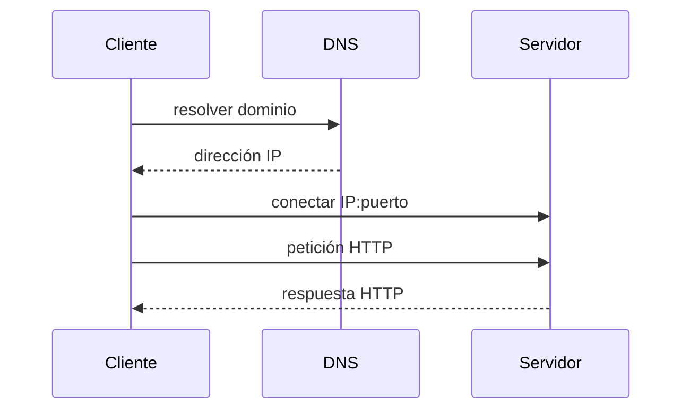
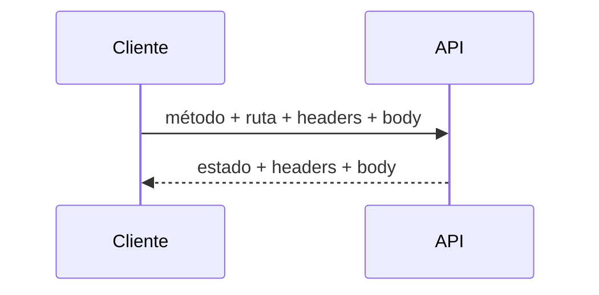
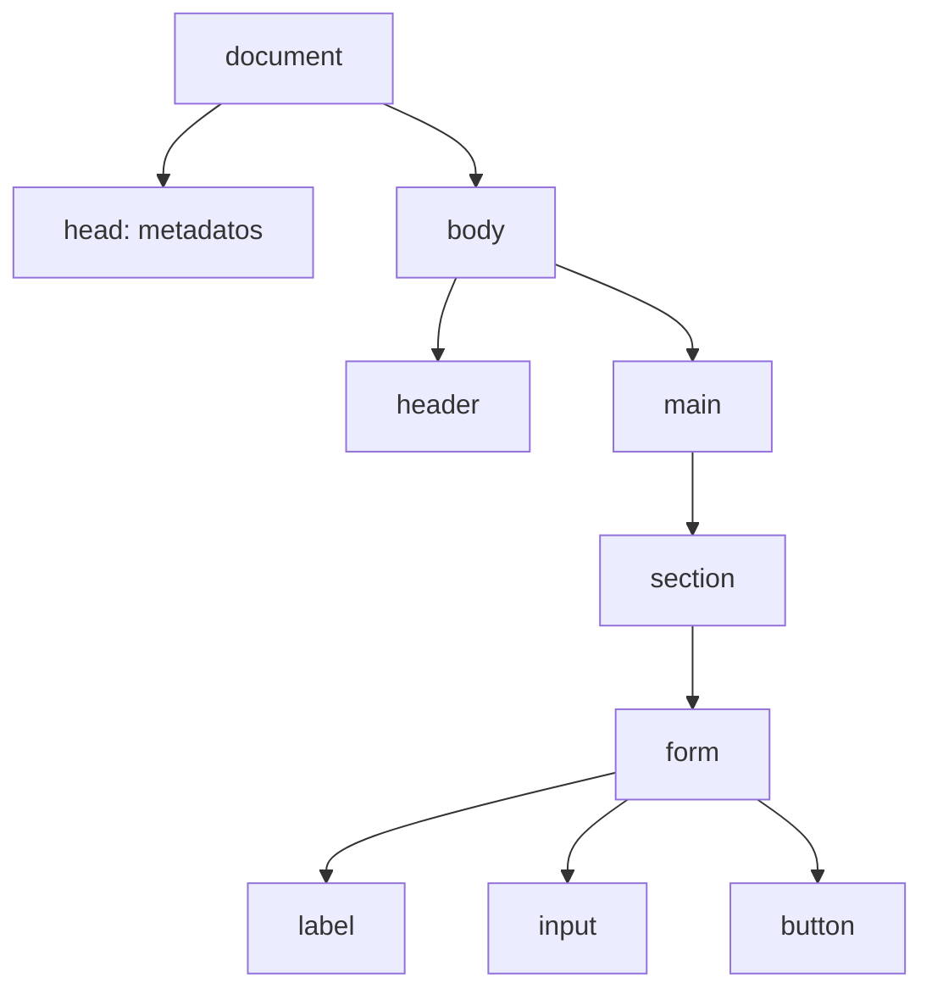
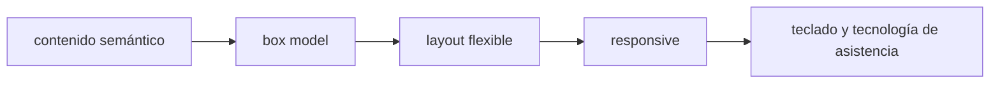

# Módulo 3: Fundamentos de web, redes y accesibilidad


## Aprende construyendo

### Tema 1: De una URL al servidor: red, DNS, IP y puertos

Ejecuta node --version para comprobar el entorno antes de continuar. **Evidencia de aprendizaje:** conserva la salida y explica qué verificaste.

#### Paso 1 · Objetivo y preparación
Al finalizar podrás construir esta base web desde cero. Prerrequisitos: navegador, terminal y editor. Comprueba que puedes abrir localhost.

#### Paso 2 · Contexto y caso real
En un caso real de entregas, una persona consulta un estado desde móvil y escritorio; red, contrato HTTP y interfaz deben cooperar sin ocultar errores.

#### Paso 3 · Teoría, modelo mental y analogía
DNS encuentra una dirección, TCP conecta puertos y HTTP intercambia mensajes con método, estado y representación. HTML expresa estructura, CSS presentación y el DOM permite interacción. La analogía es una oficina: dirección, protocolo de recepción, formulario y señalización cumplen funciones distintas.

#### Paso 4 · Demostración guiada desde cero
Parte de una carpeta vacía y crea `src/index.html`:
```bash
mkdir ejemplo-url-servidor
cd ejemplo-url-servidor
mkdir src
printf '<!doctype html><html lang="es"><main><h1>Estado</h1><p id="result">Listo</p></main></html>' > src/index.html
python3 -m http.server 8000 --directory src
```
`--directory` es la bandera que le dice al servidor de Python desde qué carpeta servir archivos (`src`), en vez de la carpeta actual completa.

Abre `http://localhost:8000`. **Resultado esperado:** el navegador muestra Estado/Listo y la terminal registra `GET /`. **Fallo deliberado:** visita el puerto 8001; “conexión rechazada” significa que ningún proceso escucha allí. Vuelve a 8000.

#### Paso 5 · Práctica guiada
Pista: cambia deliberadamente el puerto o elimina un elemento para provocar un fallo deliberado; observa el error de conexión o accesibilidad y corrígelo. Resultado esperado: página accesible y cargada.

#### Paso 6 · Práctica independiente
Añade formulario con label, estilos responsive, un estado de error y una prueba manual con teclado y lector de contraste.

#### Paso 7 · Cierre y evidencia
Guarda HTML, CSS, captura y comprobación de teclado; como siguiente paso estudia JavaScript. Errores comunes: divs sin semántica, inputs sin label, depender solo de color y asumir que localhost es producción. Fuentes oficiales: https://developer.mozilla.org/es/docs/Learn y https://www.w3.org/WAI/fundamentals/accessibility-intro/es.
**¿Por qué es importante?** Porque comprender cada capa hace diagnosticable una pantalla que no carga o no puede utilizarse.
**Evidencia de aprendizaje:** entrega estructura, URL, captura y lista de comprobaciones.
**Conceptos clave:** cliente, servidor, protocolo, URL, dominio, DNS, dirección IP, puerto, TCP y localhost.

Un **cliente** inicia una comunicación y un **servidor** escucha solicitudes. Son roles, no necesariamente máquinas distintas: tu navegador puede ser cliente y un proceso Python en el mismo equipo puede ser servidor. `localhost` se refiere al propio computador y normalmente se resuelve como `127.0.0.1` o `::1`.

En `http://localhost:8000/productos?id=3`, `http` es el esquema/protocolo, `localhost` el host, `8000` el puerto, `/productos` la ruta y `id=3` un parámetro de consulta. El puerto permite que varios procesos de red compartan una IP. Si ningún proceso escucha en 8000, obtendrás conexión rechazada aunque la máquina exista.

Para un dominio público, DNS traduce un nombre como `example.com` a una dirección IP. Después el cliente establece una conexión con el puerto correspondiente. HTTP usa TCP en sus versiones tradicionales; HTTP/3 utiliza QUIC sobre UDP, pero conserva la semántica de peticiones y respuestas.

```bash
python3 -m http.server 8000
```

Este comando inicia un servidor en la carpeta actual. Abre `http://localhost:8000`. Detén con `Ctrl+C`. Si aparece “address already in use”, otro proceso ocupa el puerto: elige 8001 o localiza el proceso en vez de reiniciar al azar.

**Ejemplo explicado:** el navegador no “abre un archivo remoto” directamente; resuelve el host, conecta al puerto, envía bytes según un protocolo y recibe una respuesta que interpreta.

**Analogía:** la IP es la dirección de un edificio; el puerto es la extensión de una oficina; DNS es el directorio que traduce un nombre recordable a una dirección.

**¿Por qué es importante?** Diagnosticar requiere separar resolución de nombre, conexión y aplicación. “No carga” puede significar DNS incorrecto, puerto cerrado, proceso caído o respuesta HTTP de error.

**Casos de uso reales:** configurar APIs locales, Docker, bases de datos, proxies, firewalls y servicios cloud.

**Diagrama:**



### Tema 2: HTTP como contrato observable

Ejecuta node --version para comprobar el entorno antes de continuar. **Evidencia de aprendizaje:** conserva la salida y explica qué verificaste.

#### Paso 1 · Objetivo y preparación
Al finalizar podrás construir esta base web desde cero. Prerrequisitos: navegador, terminal y editor. Comprueba que puedes abrir localhost.

#### Paso 2 · Contexto y caso real
En un caso real de entregas, una persona consulta un estado desde móvil y escritorio; red, contrato HTTP y interfaz deben cooperar sin ocultar errores.

#### Paso 3 · Teoría, modelo mental y analogía
DNS encuentra una dirección, TCP conecta puertos y HTTP intercambia mensajes con método, estado y representación. HTML expresa estructura, CSS presentación y el DOM permite interacción. La analogía es una oficina: dirección, protocolo de recepción, formulario y señalización cumplen funciones distintas.

#### Paso 4 · Demostración guiada desde cero
Parte de una carpeta vacía y crea `src/api.py`:
```bash
mkdir ejemplo-http
cd ejemplo-http
mkdir src
```
```python
from http.server import BaseHTTPRequestHandler, HTTPServer
import json

class API(BaseHTTPRequestHandler):
    def do_GET(self):
        body = json.dumps({'estado': 'listo'}).encode()
        self.send_response(200)
        self.send_header('Content-Type', 'application/json')
        self.send_header('Content-Length', str(len(body)))
        self.end_headers()
        self.wfile.write(body)

HTTPServer(('localhost', 8000), API).serve_forever()
```
```bash
python src/api.py
curl -i http://localhost:8000
```
`curl` es el comando que hace una petición HTTP desde la terminal y muestra la respuesta (`-i` incluye las cabeceras).

**Salida esperada:** estado `HTTP/1.0 200 OK`, cabecera JSON y `{"estado": "listo"}`. **Fallo deliberado:** pide `/faltante`; observa que el servidor todavía responde 200 y corrige el handler para devolver 404 en rutas desconocidas.

#### Paso 5 · Práctica guiada
Pista: cambia deliberadamente el puerto o elimina un elemento para provocar un fallo deliberado; observa el error de conexión o accesibilidad y corrígelo. Resultado esperado: página accesible y cargada.

#### Paso 6 · Práctica independiente
Añade formulario con label, estilos responsive, un estado de error y una prueba manual con teclado y lector de contraste.

#### Paso 7 · Cierre y evidencia
Guarda HTML, CSS, captura y comprobación de teclado; como siguiente paso estudia JavaScript. Errores comunes: divs sin semántica, inputs sin label, depender solo de color y asumir que localhost es producción. Fuentes oficiales: https://developer.mozilla.org/es/docs/Learn y https://www.w3.org/WAI/fundamentals/accessibility-intro/es.
**¿Por qué es importante?** Porque comprender cada capa hace diagnosticable una pantalla que no carga o no puede utilizarse.
**Evidencia de aprendizaje:** entrega estructura, URL, captura y lista de comprobaciones.
**Conceptos clave:** petición, respuesta, método, ruta, header, body, código de estado, idempotencia, caché y TLS.

HTTP intercambia mensajes. Una petición contiene método, destino, headers y quizá cuerpo. Una respuesta contiene estado, headers y quizá cuerpo.

```http
GET /productos/3 HTTP/1.1
Host: localhost:8000
Accept: application/json

HTTP/1.1 200 OK
Content-Type: application/json

{"id":3,"nombre":"Teclado"}
```

`GET` consulta; `POST` suele crear; `PUT` reemplaza; `PATCH` modifica parcialmente; `DELETE` elimina. La semántica importa para herramientas, cachés y reintentos. GET, PUT y DELETE se diseñan como idempotentes: repetir la misma intención debería dejar el mismo estado final, aunque la respuesta concreta pueda variar.

Los estados se agrupan: 2xx éxito, 3xx redirección, 4xx problema atribuible a la petición y 5xx fallo del servidor. `404` no significa que HTTP falló: la comunicación funcionó y el servidor respondió que el recurso no existe. Una conexión rechazada ocurre antes de HTTP.

```bash
curl -i http://localhost:8000/
curl -i http://localhost:8000/no-existe
```

`-i` incluye headers. Compara 200 y 404. En DevTools → Network inspecciona método, URL, estado, tamaño y tiempo. Desactiva caché y observa nuevas solicitudes.

HTTPS añade TLS: autentica el servidor mediante certificados y cifra el tránsito. No vuelve correcto ni seguro todo el código, pero evita que intermediarios lean o modifiquen fácilmente el contenido.

**Analogía:** HTTP es un formulario de solicitud y respuesta con campos estandarizados; TLS introduce un sobre cifrado y una identificación del destinatario.

**¿Por qué es importante?** Frameworks ocultan detalles, pero errores de CORS, caché, autenticación y APIs se entienden leyendo mensajes HTTP reales.

**Casos de uso reales:** APIs REST, navegación, descargas, autenticación, webhooks y comunicación entre microservicios.

**Diagrama:**



### Tema 3: HTML semántico, formularios y el DOM

Ejecuta node --version para comprobar el entorno antes de continuar. **Evidencia de aprendizaje:** conserva la salida y explica qué verificaste.

#### Paso 1 · Objetivo y preparación
Al finalizar podrás construir esta base web desde cero. Prerrequisitos: navegador, terminal y editor. Comprueba que puedes abrir localhost.

#### Paso 2 · Contexto y caso real
En un caso real de entregas, una persona consulta un estado desde móvil y escritorio; red, contrato HTTP y interfaz deben cooperar sin ocultar errores.

#### Paso 3 · Teoría, modelo mental y analogía
DNS encuentra una dirección, TCP conecta puertos y HTTP intercambia mensajes con método, estado y representación. HTML expresa estructura, CSS presentación y el DOM permite interacción. La analogía es una oficina: dirección, protocolo de recepción, formulario y señalización cumplen funciones distintas.

#### Paso 4 · Demostración guiada desde cero
Parte de una carpeta vacía y crea `src/index.html` y `src/app.js`:
```bash
mkdir ejemplo-dom
cd ejemplo-dom
mkdir src
```
```html
<!doctype html><html lang="es"><body><main><h1>Buscar guía</h1>
<form id="buscar"><label for="guia">Número de guía</label><input id="guia" required>
<button>Buscar</button></form><p id="resultado" aria-live="polite"></p>
<script src="app.js"></script></main></body></html>
```
```javascript
document.querySelector('#buscar').addEventListener('submit', event => {
  event.preventDefault();
  const guia = document.querySelector('#guia').value.trim();
  document.querySelector('#resultado').textContent = `Consultando ${guia}`;
});
```
```bash
python3 -m http.server 8000 --directory src
```
**Resultado esperado:** al enviar `RF-101`, el texto cambia a `Consultando RF-101` sin recargar. **Fallo deliberado:** cambia `#resultado` por `#result`; aparecerá un `TypeError` al escribir en `null`. Corrige el selector para que coincida con el `id` real.

#### Paso 5 · Práctica guiada
Pista: cambia deliberadamente el puerto o elimina un elemento para provocar un fallo deliberado; observa el error de conexión o accesibilidad y corrígelo. Resultado esperado: página accesible y cargada.

#### Paso 6 · Práctica independiente
Añade formulario con label, estilos responsive, un estado de error y una prueba manual con teclado y lector de contraste.

#### Paso 7 · Cierre y evidencia
Guarda HTML, CSS, captura y comprobación de teclado; como siguiente paso estudia JavaScript. Errores comunes: divs sin semántica, inputs sin label, depender solo de color y asumir que localhost es producción. Fuentes oficiales: https://developer.mozilla.org/es/docs/Learn y https://www.w3.org/WAI/fundamentals/accessibility-intro/es.
**¿Por qué es importante?** Porque comprender cada capa hace diagnosticable una pantalla que no carga o no puede utilizarse.
**Evidencia de aprendizaje:** entrega estructura, URL, captura y lista de comprobaciones.
**Conceptos clave:** elemento, atributo, documento, semántica, jerarquía, formulario, etiqueta, validación y DOM.

HTML describe estructura y significado. El navegador lo analiza y construye el DOM, un árbol que JavaScript puede consultar o modificar. HTML no es “decoración”: comunica relaciones a navegadores, buscadores y tecnologías de asistencia.

```html
<!doctype html>
<html lang="es">
  <head>
    <meta charset="utf-8">
    <meta name="viewport" content="width=device-width, initial-scale=1">
    <title>Inventario local</title>
  </head>
  <body>
    <header><h1>Inventario local</h1></header>
    <main>
      <section aria-labelledby="nuevo-producto">
        <h2 id="nuevo-producto">Nuevo producto</h2>
        <form>
          <label for="nombre">Nombre</label>
          <input id="nombre" name="nombre" required>
          <button type="submit">Guardar</button>
        </form>
      </section>
    </main>
  </body>
</html>
```

`lang` ayuda a pronunciación; `title` nombra la pestaña; `viewport` permite layout móvil; `main` identifica contenido principal; `label` relaciona texto con control; `required` ofrece validación nativa. Haz clic en la etiqueta: debe enfocar el input. Navega con Tab: el orden debe ser lógico.

Usar `<div>` para todo pierde significado. Elige elementos por función, no apariencia: un botón que ejecuta una acción debe ser `<button>`, no un `div` con click. La semántica aporta teclado y roles por defecto.

El DOM de DevTools permite inspeccionar el árbol resultante, que puede diferir del texto original si el navegador corrige marcado inválido. Valida HTML y corrige jerarquías antes de añadir CSS.

**Analogía:** HTML es el plano estructural con nombres de habitaciones; CSS pinta y distribuye. Llamar a todo “caja” hace imposible orientarse aunque visualmente parezca correcto.

**¿Por qué es importante?** Semántica y formularios accesibles reducen trabajo, mejoran compatibilidad y evitan reconstruir funciones que el navegador ya ofrece.

**Casos de uso reales:** formularios de registro, navegación, artículos, tablas de datos y paneles operables con teclado.

**Diagrama:**



### Tema 4: CSS, layout responsive y accesibilidad verificable

Ejecuta node --version para comprobar el entorno antes de continuar. **Evidencia de aprendizaje:** conserva la salida y explica qué verificaste.

#### Paso 1 · Objetivo y preparación
Al finalizar podrás construir esta base web desde cero. Prerrequisitos: navegador, terminal y editor. Comprueba que puedes abrir localhost.

#### Paso 2 · Contexto y caso real
En un caso real de entregas, una persona consulta un estado desde móvil y escritorio; red, contrato HTTP y interfaz deben cooperar sin ocultar errores.

#### Paso 3 · Teoría, modelo mental y analogía
DNS encuentra una dirección, TCP conecta puertos y HTTP intercambia mensajes con método, estado y representación. HTML expresa estructura, CSS presentación y el DOM permite interacción. La analogía es una oficina: dirección, protocolo de recepción, formulario y señalización cumplen funciones distintas.

#### Paso 4 · Demostración guiada desde cero
Parte de una carpeta vacía y crea `src/index.html` y `src/styles.css`:
```bash
mkdir ejemplo-responsive
cd ejemplo-responsive
mkdir src
```
```html
<!doctype html><html lang="es"><head><meta name="viewport" content="width=device-width"><link rel="stylesheet" href="styles.css"></head>
<body><main><h1>Entregas</h1><section class="grid"><article>RF-101</article><article>RF-102</article></section></main></body></html>
```
```css
body { margin: 0; font: 1rem/1.5 system-ui; color: #1d1d1f; }
main { width: min(70rem, 100% - 2rem); margin: 2rem auto; }
.grid { display: grid; grid-template-columns: repeat(2, minmax(0, 1fr)); gap: 1rem; }
article { padding: 1rem; border: 1px solid #d2d2d7; border-radius: .75rem; }
@media (max-width: 40rem) { .grid { grid-template-columns: 1fr; } }
```
```bash
python3 -m http.server 8000 --directory src
```
**Resultado esperado:** dos columnas en escritorio y una bajo 40rem, sin desplazamiento horizontal. **Fallo deliberado:** elimina la etiqueta `viewport`; en móvil el breakpoint puede no representar el ancho real. Restáurala y comprueba zoom al 200 % y navegación con teclado.

#### Paso 5 · Práctica guiada
Pista: cambia deliberadamente el puerto o elimina un elemento para provocar un fallo deliberado; observa el error de conexión o accesibilidad y corrígelo. Resultado esperado: página accesible y cargada.

#### Paso 6 · Práctica independiente
Añade formulario con label, estilos responsive, un estado de error y una prueba manual con teclado y lector de contraste.

#### Paso 7 · Cierre y evidencia
Guarda HTML, CSS, captura y comprobación de teclado; como siguiente paso estudia JavaScript. Errores comunes: divs sin semántica, inputs sin label, depender solo de color y asumir que localhost es producción. Fuentes oficiales: https://developer.mozilla.org/es/docs/Learn y https://www.w3.org/WAI/fundamentals/accessibility-intro/es.
**¿Por qué es importante?** Porque comprender cada capa hace diagnosticable una pantalla que no carga o no puede utilizarse.
**Evidencia de aprendizaje:** entrega estructura, URL, captura y lista de comprobaciones.
**Conceptos clave:** selector, cascada, especificidad, herencia, box model, Flexbox, Grid, media query, foco, contraste y responsive.

CSS aplica reglas a elementos. La **cascada** decide qué declaración gana según origen, importancia, especificidad y orden. Aumentar selectores hasta “ganar” crea deuda; comprende primero por qué una regla fue sobrescrita usando el panel Styles.

```css
:root {
  color-scheme: light dark;
  font-family: system-ui, sans-serif;
}

* { box-sizing: border-box; }

body { margin: 0; line-height: 1.6; }
main { width: min(70rem, 100% - 2rem); margin-inline: auto; }

.productos {
  display: grid;
  grid-template-columns: repeat(auto-fit, minmax(15rem, 1fr));
  gap: 1rem;
}

button:focus-visible { outline: 3px solid #6d5dfc; outline-offset: 3px; }
```

`box-sizing` hace que padding y border formen parte del ancho declarado. `min()` limita la columna sin desbordar móvil. Grid crea columnas que se adaptan. `focus-visible` conserva una indicación clara para teclado; eliminar outline sin reemplazo es un defecto.

El diseño responsive no consiste en diseñar solo para un teléfono específico. Cambia lentamente el ancho y observa dónde el contenido deja de funcionar; agrega un breakpoint por necesidad del contenido. Prueba zoom 200 %, texto largo y navegación por teclado. Las imágenes necesitan texto alternativo cuando comunican información; adornos pueden usar `alt=""`.

Accesibilidad no es una fase final. Verifica estructura de encabezados, nombres accesibles, contraste, foco, errores comprensibles y ausencia de dependencia exclusiva del color. Automatización ayuda, pero no sustituye probar teclado y lector de pantalla.

**Analogía:** la cascada es un sistema de reglas legales con precedencia; el layout responsive es arquitectura adaptable, no encoger una maqueta rígida.

**¿Por qué es importante?** Una interfaz que solo funciona con ratón, visión perfecta o un ancho concreto excluye usuarios y falla en dispositivos reales.

**Casos de uso reales:** dashboards responsive, formularios públicos, comercio electrónico, sistemas internos y cumplimiento de accesibilidad.

**Diagrama:**



## Construcción guiada del capítulo

### Proyecto 3: sitio profesional accesible desde carpeta vacía

Crea `sitio-profesional/` con `index.html`, `styles.css`, `assets/`, `README.md` e `informe-red.md`. El sitio debe incluir encabezado, navegación, presentación, proyectos en tarjetas, formulario de contacto y pie.

Fases:

1. HTML semántico sin CSS; valida jerarquía y formulario.
2. Servidor local con `python3 -m http.server 8000`.
3. Evidencia con `curl -i` para raíz y ruta inexistente.
4. CSS con box model, Flexbox/Grid y ancho fluido.
5. Pruebas en 320, 768 y 1440 px, zoom 200 % y texto largo.
6. Navegación completa con teclado y foco visible.
7. Auditoría Lighthouse/axe como apoyo, seguida de revisión manual.
8. Publicación opcional en GitHub Pages.

**Verificación:** no hay scroll horizontal a 320 px; todos los controles tienen nombre; Tab llega a cada interacción; Enter/Espacio activan botones; labels enfocan inputs; DevTools muestra respuestas y recursos; README reproduce el servidor.

**Errores comunes y soluciones**

- Abrir `file://` y asumir que equivale a HTTP: usa servidor local.
- Confundir 404 con caída de red: inspecciona capa y estado.
- Usar div como botón: emplea semántica nativa.
- Eliminar focus outline: crea un estilo visible.
- Diseñar con tamaños fijos: usa restricciones y prueba extremos.
