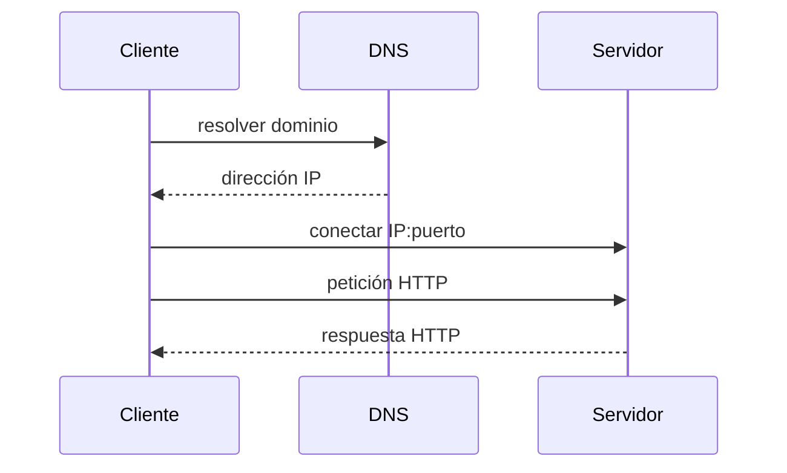
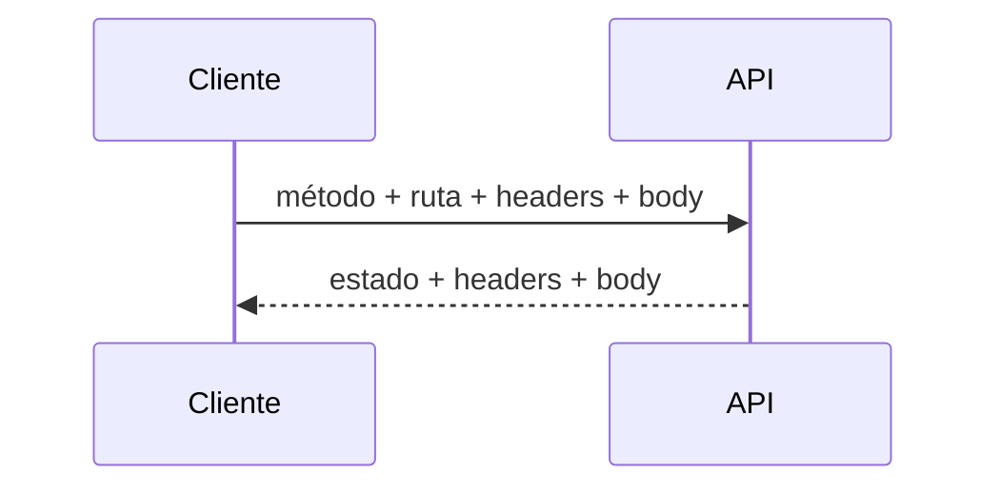
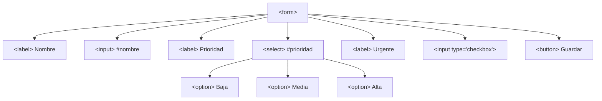
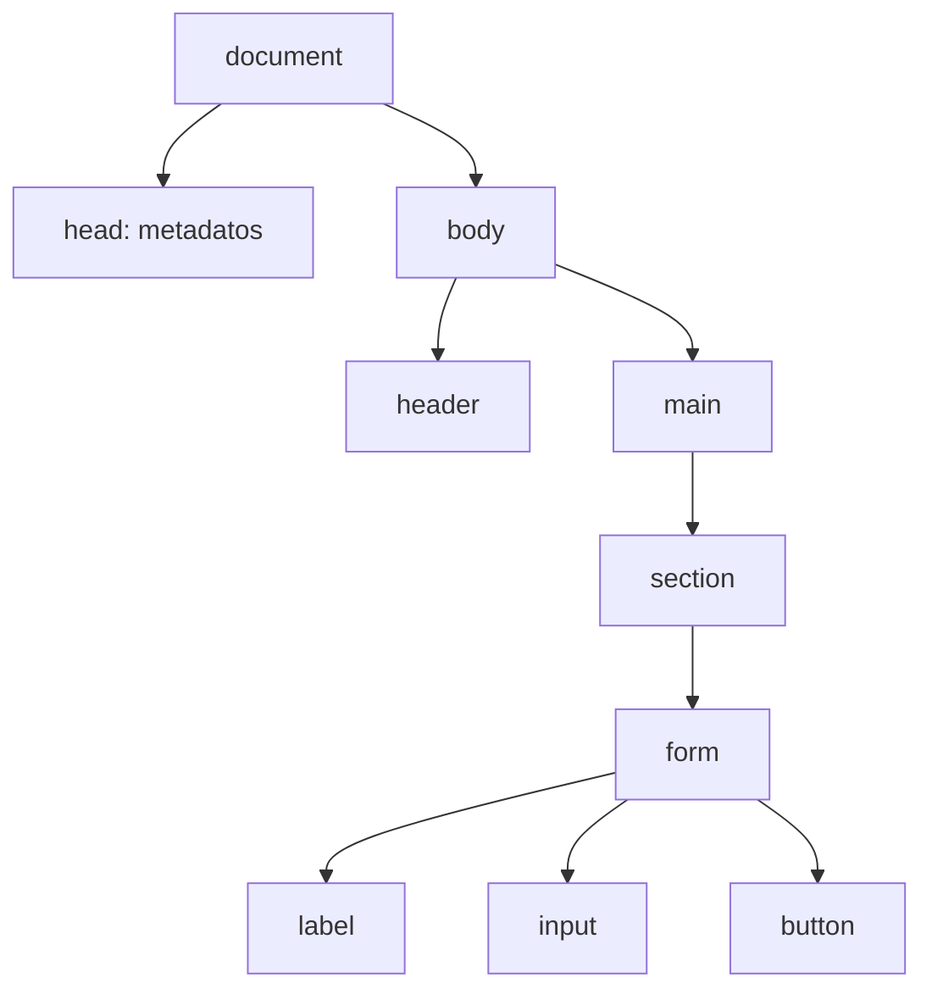
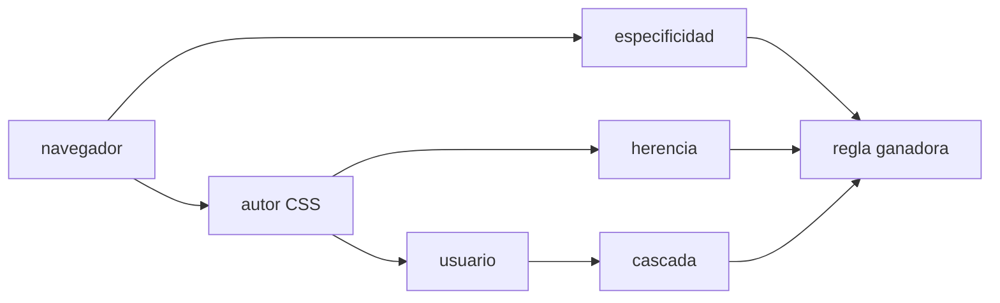
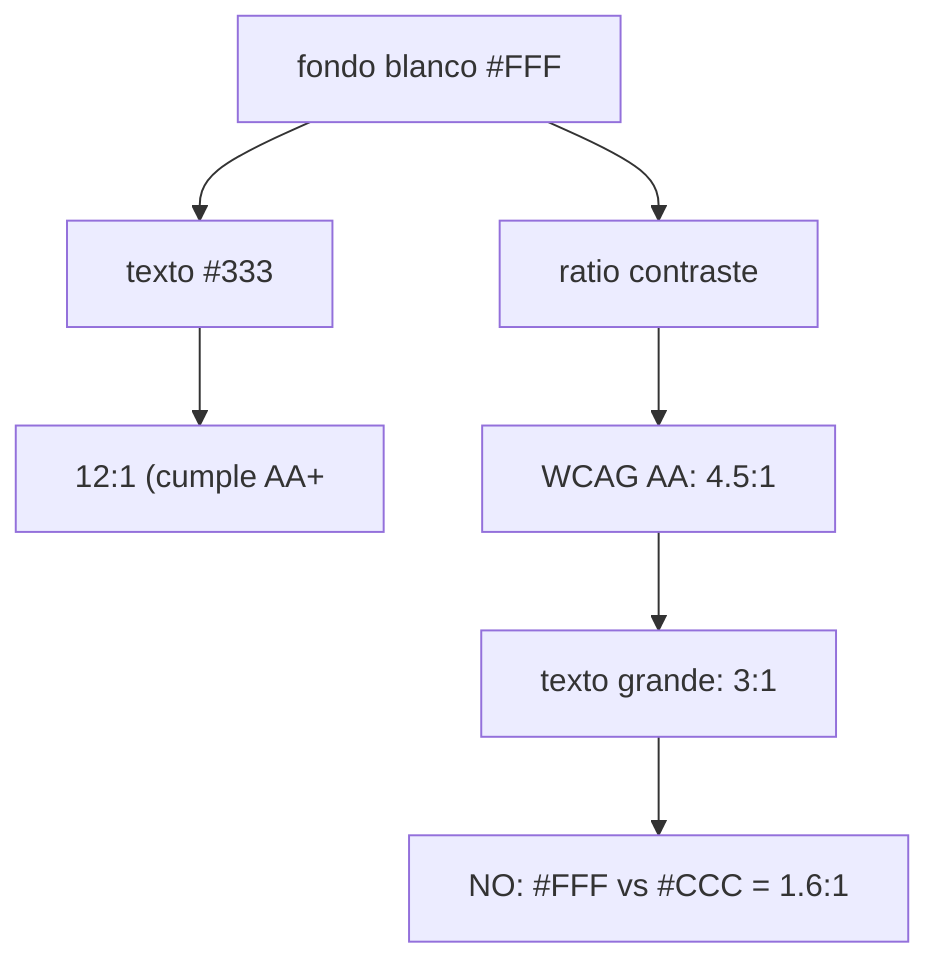
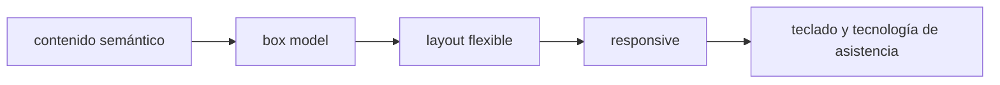

# Módulo 3: Fundamentos de web, redes y accesibilidad


## Aprende construyendo

### Tema 1: De una URL al servidor: red, DNS, IP y puertos

#### Paso 1 · Objetivo y preparación
Al finalizar vas a levantar un servidor HTTP local, confirmar con `curl` que responde en el puerto correcto, y reproducir el error de conexión rechazada cuando pedís un puerto donde no hay nada escuchando. **Prerrequisitos:** terminal y Python 3 instalado; comprobá `python3 --version`.

#### Paso 2 · Contexto y caso real
El proyecto integrador Fundamentos necesita, además de su CLI, una interfaz web que puedas abrir en el navegador. Cuando alguien te diga "no carga el sitio", la causa casi nunca es DNS — `localhost` se resuelve al instante sin salir a la red —; casi siempre es que el servidor quedó escuchando en un puerto distinto del que estás probando.

#### Paso 3 · Teoría, modelo mental y analogía
Abrir una URL dispara pasos distintos: si el host es un dominio público, DNS traduce el nombre a una dirección IP; después el cliente abre una conexión TCP contra esa IP en un puerto específico; solo entonces viaja el mensaje HTTP. `localhost` salta el primer paso — el sistema operativo lo resuelve a `127.0.0.1` sin consultar ningún servidor DNS —, así que en desarrollo local el cuello de botella casi nunca es la resolución de nombres: es que el puerto donde escucha tu servidor coincida exactamente con el puerto que pedís. La analogía: la IP es la dirección de un edificio, el puerto es el número de oficina dentro de ese edificio — podés tener la dirección perfecta y aun así golpear una puerta vacía si memorizaste mal el número de oficina.

#### Paso 4 · Demostración guiada desde cero
```bash
mkdir ejemplo-url-servidor
cd ejemplo-url-servidor
printf '<!doctype html><html lang="es"><body><h1>Servidor Fundamentos activo</h1></body></html>' > index.html
python3 -m http.server 8000
```

Desde otra terminal:
```bash
curl -i http://localhost:8000
```
**Resultado esperado:** `HTTP/1.0 200 OK` y el HTML completo en el cuerpo de la respuesta; la terminal del servidor registra `GET / HTTP/1.1`.

**Fallo deliberado:** sin detener el servidor, pedí un puerto distinto:
```bash
curl -i http://localhost:9999
```
Falla con `curl: (7) Failed to connect to localhost port 9999: Connection refused`. DNS no fue el problema — `localhost` se resolvió instantáneamente a `127.0.0.1` en ambos casos —; el problema es que ningún proceso escucha en el puerto 9999. Repetí contra `8000` para confirmar que vuelve a funcionar.

#### Paso 5 · Práctica guiada
Pista: ahora detené el servidor con `Ctrl+C` y volvé a ejecutar `curl -i http://localhost:8000`. También falla con conexión rechazada, aunque el puerto sea el correcto — distinguí ese caso (nadie escucha) del `404` que vas a ver en el Tema 2 (alguien escucha, pero no encuentra el recurso).

#### Paso 6 · Práctica independiente
Iniciá el servidor en un puerto distinto, por ejemplo `python3 -m http.server 8080`, y repetí `curl -i http://localhost:8000` sin cambiarlo: debe fallar. Corregí el comando para que apunte a `8080` y confirmá que responde. Si alguna vez ves `address already in use` al iniciar el servidor, usá `lsof -i :8000` (macOS/Linux) o `netstat -ano | findstr 8000` (Windows) para encontrar qué proceso ya ocupa ese puerto antes de matarlo a ciegas.

#### Paso 7 · Cierre y evidencia
Entregá la respuesta `200` del Paso 4, el `Connection refused` del puerto equivocado, y la verificación del Paso 6 con el servidor en `8080`; explicá por qué en `localhost` el cuello de botella casi nunca es DNS sino la coincidencia exacta de puerto. Como siguiente paso, en el Tema 2 vas a usar `curl -v` sobre un servidor real para observar el contrato HTTP completo: método, headers, código de estado y cuerpo. Errores comunes: confundir "conexión rechazada" con un error HTTP; asumir que `localhost` necesita resolución DNS; no verificar en qué puerto quedó escuchando el servidor antes de probarlo. Fuentes oficiales: https://developer.mozilla.org/es/docs/Learn y https://www.w3.org/WAI/fundamentals/accessibility-intro/es.
**¿Por qué es importante?** Porque diagnosticar "no carga" exige separar tres capas distintas — resolución de nombre, conexión TCP a un puerto y respuesta HTTP — y en desarrollo local casi siempre falla la segunda, no la primera.
**Evidencia de aprendizaje:** entrega la respuesta 200 en el puerto correcto, el "Connection refused" en el puerto equivocado, y la corrección del Paso 6.
**Conceptos clave:** cliente, servidor, protocolo, URL, dominio, DNS, dirección IP, puerto, TCP y localhost.

Un **cliente** inicia una comunicación y un **servidor** escucha solicitudes. Son roles, no necesariamente máquinas distintas: tu navegador puede ser cliente y un proceso Python en el mismo equipo puede ser servidor. `localhost` se refiere al propio computador y normalmente se resuelve como `127.0.0.1` o `::1`.

En `http://localhost:8000/productos?id=3`, `http` es el esquema/protocolo, `localhost` el host, `8000` el puerto, `/productos` la ruta y `id=3` un parámetro de consulta. El puerto permite que varios procesos de red compartan una IP. Si ningún proceso escucha en 8000, obtendrás conexión rechazada aunque la máquina exista.

Para un dominio público, DNS traduce un nombre como `example.com` a una dirección IP. Después el cliente establece una conexión con el puerto correspondiente. HTTP usa TCP en sus versiones tradicionales; HTTP/3 utiliza QUIC sobre UDP, pero conserva la semántica de peticiones y respuestas.

```bash
python3 -m http.server 8000
```

Este comando inicia un servidor en la carpeta actual. Abre `http://localhost:8000`. Detén con `Ctrl+C`. Si aparece “address already in use”, otro proceso ocupa el puerto: elige 8001 o localiza el proceso en vez de reiniciar al azar.

**Ejemplo explicado:** el navegador no “abre un archivo remoto” directamente; resuelve el host, conecta al puerto, envía bytes según un protocolo y recibe una respuesta que interpreta.

**Analogía:** la IP es la dirección de un edificio; el puerto es la extensión de una oficina; DNS es el directorio que traduce un nombre recordable a una dirección.

**¿Por qué es importante?** Diagnosticar requiere separar resolución de nombre, conexión y aplicación. “No carga” puede significar DNS incorrecto, puerto cerrado, proceso caído o respuesta HTTP de error.

**Casos de uso reales:** configurar APIs locales, Docker, bases de datos, proxies, firewalls y servicios cloud.

**Diagrama:**


```mermaid
sequenceDiagram
    participant C as Cliente
    participant D as DNS
    participant S as Servidor
    C->>D: resolver dominio
    D-->>C: dirección IP
    C->>S: conectar IP:puerto
    C->>S: petición HTTP
    S-->>C: respuesta HTTP
```

#### Profundización · Diseño: Rutas 404 vs 500 en servidor Fundamentos

**Escenario real:** Tu CLI Fundamentos expone una API HTTP simple. Cliente solicita `GET /tareas/999` (tarea inexistente). ¿Respondes 404 o 500?

**Tu tarea (sin mirar solución):**

1. **Define:** ¿Cuándo es 404?, ¿cuándo 500?
2. **Escenario A:** Tarea ID 999 nunca existió → ?
3. **Escenario B:** Servidor se quedó sin memoria, no puede verificar → ?
4. **Diseña:** ¿Cómo estructuras la respuesta? ¿JSON?, ¿qué campos?

**Escribe tu respuesta:**
```
404: _________ (¿quién es responsable?)
500: _________ (¿quién es responsable?)
Tarea 999 inexistente: _________ (código)
Servidor sin memoria: _________ (código)
Respuesta JSON: {“error”: “_________”, “code”: _________}
```

[SOLUCIÓN — Lee solo después de intentar]

> **Respuesta esperada:**
>
> **404:** Cliente solicitó mal (recurso no existe, ruta malformada).
>
> **500:** Servidor tiene un problema (lógica rota, excepciones, recursos agotados).
>
> **Tarea 999 inexistente:** 404 (cliente pidió algo que no existe, es responsabilidad del cliente verificar).
>
> **Servidor sin memoria:** 500 (servidor no puede procesar, es su problema).
>
> **JSON recomendado:**
> ```json
> {“error”: “Tarea no encontrada”, “code”: 404, “timestamp”: “2026-10-06T14:00:00Z”}
> ```

### Tema 2: HTTP como contrato observable

#### Paso 1 · Objetivo y preparación
Al finalizar vas a usar `curl -v` contra un servidor real para observar línea por línea una petición y una respuesta HTTP completas, y vas a reproducir un `404` real para confirmar que el servidor respondió correctamente aunque el recurso no exista. **Prerrequisitos:** Tema 1 de este módulo.

#### Paso 2 · Contexto y caso real
El proyecto integrador Fundamentos va a exponer una API HTTP simple para consultar tareas. Cuando alguien diga "la API no funciona", necesitás poder responder con un código de estado concreto, no con una sensación: el contrato HTTP te permite verificar éxito o fallo mirando solo el código, sin leer el cuerpo de la respuesta.

#### Paso 3 · Teoría, modelo mental y analogía
Una petición HTTP es texto estructurado: un método (`GET`, `POST`...), una ruta, una versión, cabeceras y, a veces, un cuerpo. Una respuesta es simétrica: una línea de estado con un código numérico, cabeceras y, a veces, un cuerpo. El código de estado por sí solo ya es un contrato observable: un cliente puede decidir si algo salió bien (`2xx`), si el problema es suyo (`4xx`) o del servidor (`5xx`) sin necesidad de parsear el cuerpo de la respuesta. La analogía: pedís algo por correo certificado — el acuse de recibo (código de estado) te confirma la entrega sin que tengas que abrir el sobre (el cuerpo) para saberlo.

#### Paso 4 · Demostración guiada desde cero
```bash
mkdir ejemplo-http-contrato
cd ejemplo-http-contrato
printf '<!doctype html><html lang="es"><body><h1>Tareas</h1></body></html>' > index.html
python3 -m http.server 8000
```

Desde otra terminal:
```bash
curl -v http://localhost:8000/
```
**Resultado esperado:** `curl -v` muestra todo el intercambio: la línea de petición (`GET / HTTP/1.1`), las cabeceras que enviaste, la línea de respuesta (`HTTP/1.0 200 OK`), las cabeceras de respuesta (`Content-type`, `Content-Length`...) y por último el cuerpo HTML.

**Fallo deliberado:**
```bash
curl -v http://localhost:8000/no-existe
```
La conexión se establece igual que antes (no es un "connection refused") y el servidor responde — pero con `HTTP/1.0 404 File not found`. Ese es el contrato observable: sabés que la petición falló leyendo solo la primera línea de la respuesta, sin necesidad de parsear el cuerpo.

#### Paso 5 · Práctica guiada
Pista: compará los dos `curl -v` del Paso 4 línea por línea — la línea de petición (`GET ... HTTP/1.1`) es casi idéntica en ambos casos; lo único que cambia de verdad es la línea de estado de la respuesta (`200` vs `404`) y el cuerpo. Ese código es la señal que importa, no el tamaño del cuerpo ni el mensaje de texto que lo acompaña.

#### Paso 6 · Práctica independiente
Repetí el experimento pidiendo el método `HEAD` en vez de `GET` (`curl -v -I http://localhost:8000/`) y comparalo: mismas cabeceras, sin cuerpo. Después probá `curl -v -X POST http://localhost:8000/` contra este servidor de archivos estáticos y observá qué código de estado devuelve (`501 Unsupported method ('POST')`) — confirmá que el método también es parte del contrato, no solo la ruta.

#### Paso 7 · Cierre y evidencia
Entregá los dos `curl -v` del Paso 4 (200 y 404) con la línea de estado señalada, y la comparación de métodos del Paso 6; explicá por qué un cliente puede verificar éxito o fallo con solo leer el código de estado, sin parsear el cuerpo. Como siguiente paso, en el Tema 3 vas a construir el HTML real que un servidor como este sirve, con formularios que un lector de pantalla pueda interpretar. Errores comunes: asumir que una respuesta con cuerpo siempre significa éxito; ignorar el código de estado y confiar solo en que "algo se mostró en pantalla"; no revisar las cabeceras de respuesta al depurar una API. Fuentes oficiales: https://developer.mozilla.org/es/docs/Learn y https://www.w3.org/WAI/fundamentals/accessibility-intro/es.
**¿Por qué es importante?** Porque los frameworks ocultan el intercambio real, pero cualquier bug de caché, CORS o autenticación se diagnostica leyendo la petición y la respuesta HTTP reales, no adivinando.
**Evidencia de aprendizaje:** entrega los dos `curl -v` (200 y 404) con la línea de estado señalada, y la comparación de métodos GET/HEAD/POST del Paso 6.
**Conceptos clave:** petición, respuesta, método, ruta, header, body, código de estado, idempotencia, caché y TLS.

HTTP intercambia mensajes. Una petición contiene método, destino, headers y quizá cuerpo. Una respuesta contiene estado, headers y quizá cuerpo.

```http
GET /productos/3 HTTP/1.1
Host: localhost:8000
Accept: application/json

HTTP/1.1 200 OK
Content-Type: application/json

{"id":3,"nombre":"Teclado"}
```

`GET` consulta; `POST` suele crear; `PUT` reemplaza; `PATCH` modifica parcialmente; `DELETE` elimina. La semántica importa para herramientas, cachés y reintentos. GET, PUT y DELETE se diseñan como idempotentes: repetir la misma intención debería dejar el mismo estado final, aunque la respuesta concreta pueda variar.

Los estados se agrupan: 2xx éxito, 3xx redirección, 4xx problema atribuible a la petición y 5xx fallo del servidor. `404` no significa que HTTP falló: la comunicación funcionó y el servidor respondió que el recurso no existe. Una conexión rechazada ocurre antes de HTTP.

```bash
curl -i http://localhost:8000/
curl -i http://localhost:8000/no-existe
```

`-i` incluye headers. Compara 200 y 404. En DevTools → Network inspecciona método, URL, estado, tamaño y tiempo. Desactiva caché y observa nuevas solicitudes.

HTTPS añade TLS: autentica el servidor mediante certificados y cifra el tránsito. No vuelve correcto ni seguro todo el código, pero evita que intermediarios lean o modifiquen fácilmente el contenido.

**Analogía:** HTTP es un formulario de solicitud y respuesta con campos estandarizados; TLS introduce un sobre cifrado y una identificación del destinatario.

**¿Por qué es importante?** Frameworks ocultan detalles, pero errores de CORS, caché, autenticación y APIs se entienden leyendo mensajes HTTP reales.

**Casos de uso reales:** APIs REST, navegación, descargas, autenticación, webhooks y comunicación entre microservicios.

**Diagrama:**


```mermaid
sequenceDiagram
    participant C as Cliente
    participant S as API
    C->>S: método + ruta + headers + body
    S-->>C: estado + headers + body
```

#### Profundización · Diseño: Métodos HTTP (GET, POST, PUT, DELETE) para CRUD

**Escenario real:** Tu API Fundamentos necesita listar, crear, editar y borrar tareas. ¿Qué método HTTP para cada operación?

**Tu tarea (sin mirar solución):**

1. **Mapea operaciones a métodos:**
   - Listar todas las tareas
   - Crear una tarea
   - Editar la tarea 5
   - Borrar la tarea 5
2. **Idempotencia:** GET en la misma URL 10 veces ¿produce 10 efectos o el mismo estado?
3. **Headers:** ¿Qué header distingue a `DELETE /tareas/5` de `GET /tareas/5`?
4. **Body:** ¿Lleva body POST?, ¿GET?

**Escribe tu respuesta:**
```
Listar: _________ /tareas
Crear: _________ /tareas (body: {...})
Editar tarea 5: _________ /tareas/5 (body: {...})
Borrar tarea 5: _________ /tareas/5
Idempotencia GET: _________ (sí/no, ¿por qué?)
Header decisivo: _________ (Request-Line: VERBO ...)
```

[SOLUCIÓN — Lee solo después de intentar]

> **Respuesta esperada:**
>
> **Operaciones CRUD:**
> - GET /tareas → **Read all**
> - POST /tareas → **Create**
> - PUT /tareas/5 (o PATCH) → **Update**
> - DELETE /tareas/5 → **Delete**
>
> **Idempotencia GET:** Sí, 10 × GET /tareas devuelve los mismos datos (efecto cero).
>
> **PUT:** Idempotente (si ejecutas dos veces, resultado es igual).
>
> **DELETE:** Segundo DELETE puede ser 404 (recurso ya borrado). Primer DELETE = 200 OK.
>
> **Header decisivo:** `GET /tareas/5 HTTP/1.1` vs `DELETE /tareas/5 HTTP/1.1` (el verbo).
>
> **Bodies:**
> - POST/PUT: llevan body (JSON con datos)
> - GET/DELETE: no llevan body (por convención)

### Tema 3: HTML semántico, formularios y el DOM

#### Paso 1 · Objetivo y preparación
Al finalizar vas a construir un formulario HTML real y vas a reproducir qué se rompe concretamente cuando un campo no tiene `<label>`: no es solo "menos accesible" en abstracto, es que el valor queda sin nombre para quien lo necesita. **Prerrequisitos:** Tema 2 de este módulo.

#### Paso 2 · Contexto y caso real
El proyecto integrador Fundamentos necesita un formulario de búsqueda de tareas por número de guía. Si lo publicás sin `<label>` en el campo, cualquier persona que use lector de pantalla no sabe qué está completando; y si además el `<input>` no tiene `name`, el valor ni siquiera viaja identificado al enviarse a un servidor.

#### Paso 3 · Teoría, modelo mental y analogía
El navegador analiza el HTML y construye el DOM: un árbol de nodos que JavaScript puede leer y modificar. Cada elemento aporta significado además de apariencia. Un `<label for="id">` no es decoración: es una relación programática entre un texto y un control. Clickear el texto enfoca el input, y un lector de pantalla anuncia ese texto como el nombre accesible del campo. Sin esa relación, el campo sigue siendo visible y hasta usable con mouse, pero queda sin nombre para quien no puede verlo. La analogía: un formulario sin label es un casillero sin rótulo — podés adivinar para qué sirve mirando su posición, pero nadie que no pueda ver esa posición puede saberlo con certeza.

#### Paso 4 · Demostración guiada desde cero
```bash
mkdir ejemplo-dom-formulario
cd ejemplo-dom-formulario
```
```html
<!doctype html><html lang="es"><body><main><h1>Buscar guía</h1>
<form id="buscar">
  <input id="guia">
  <button>Buscar</button>
</form>
<p id="resultado" aria-live="polite"></p>
</main></body></html>
```
```bash
python3 -m http.server 8000
```
**Fallo deliberado:** abrí `http://localhost:8000` e inspeccioná el input con DevTools → panel Accessibility (o un lector de pantalla). El campo aparece como "Edit text, blank": no tiene nombre accesible. Además, como el `<input>` no tiene atributo `name`, si este formulario se enviara de verdad a un servidor, el valor viajaría sin ninguna clave asociada — el backend no tendría forma de saber a qué campo pertenece.

**Corrección:** agregá el `label` y el `name`:
```html
<label for="guia">Número de guía</label>
<input id="guia" name="guia">
```
Volvé a inspeccionar: ahora el campo se anuncia como "Número de guía, edit text". Confirmalo también desde la consola del navegador: `document.querySelector('#guia').labels` devolvía una lista vacía antes de agregar el label, y ahora devuelve el label real — es el propio DOM, no solo la vista, confirmando la relación.

#### Paso 5 · Práctica guiada
Pista: hacé clic directamente sobre el texto "Número de guía" (no sobre el input) — si el `for` coincide con el `id` real, el clic enfoca el input igual que si lo hubieras tocado directamente; si eso no pasa, el `for` no coincide con el `id`.

#### Paso 6 · Práctica independiente
Agregá un segundo campo (`<select id="prioridad" name="prioridad">` con opciones baja/media/alta) sin su label, confirmá con DevTools que aparece sin nombre accesible, y corregilo igual que el anterior. Documentá en un comentario qué diferencia concreta notaste entre el campo con label y sin label, más allá de "uno es accesible y el otro no".

#### Paso 7 · Cierre y evidencia
Entregá la captura de DevTools con el input sin nombre accesible del Paso 4, la corrección con `label` y `name`, y el segundo campo corregido del Paso 6; explicá qué se rompe en términos concretos (nombre accesible ausente, dato sin clave al enviarse) cuando falta un `label`, no solo que "es menos accesible". Como siguiente paso, en el Tema 4 vas a darle estilos responsive a este mismo formulario y vas a verificar que el contraste de color no excluya a quien ya podés identificar por nombre accesible. Errores comunes: usar solo el `placeholder` como si fuera un label; relacionar un `label` con un `id` que no coincide exactamente; omitir `name` en inputs que después se envían a un servidor. Fuentes oficiales: https://developer.mozilla.org/es/docs/Learn y https://www.w3.org/WAI/fundamentals/accessibility-intro/es.
**¿Por qué es importante?** Porque un campo sin nombre accesible no es un detalle visual: para quien usa lector de pantalla directamente no existe, y para un backend que lee `name`, su valor directamente no llega.
**Evidencia de aprendizaje:** entrega la captura del input sin nombre accesible, la corrección con label y name, y el segundo campo corregido del Paso 6.
**Conceptos clave:** elemento, atributo, documento, semántica, jerarquía, formulario, etiqueta, validación y DOM.

HTML describe estructura y significado. El navegador lo analiza y construye el DOM, un árbol que JavaScript puede consultar o modificar. HTML no es “decoración”: comunica relaciones a navegadores, buscadores y tecnologías de asistencia.

```html
<!doctype html>
<html lang="es">
  <head>
    <meta charset="utf-8">
    <meta name="viewport" content="width=device-width, initial-scale=1">
    <title>Inventario local</title>
  </head>
  <body>
    <header><h1>Inventario local</h1></header>
    <main>
      <section aria-labelledby="nuevo-producto">
        <h2 id="nuevo-producto">Nuevo producto</h2>
        <form>
          <label for="nombre">Nombre</label>
          <input id="nombre" name="nombre" required>
          <button type="submit">Guardar</button>
        </form>
      </section>
    </main>
  </body>
</html>
```

`lang` ayuda a pronunciación; `title` nombra la pestaña; `viewport` permite layout móvil; `main` identifica contenido principal; `label` relaciona texto con control; `required` ofrece validación nativa. Haz clic en la etiqueta: debe enfocar el input. Navega con Tab: el orden debe ser lógico.

Usar `<div>` para todo pierde significado. Elige elementos por función, no apariencia: un botón que ejecuta una acción debe ser `<button>`, no un `div` con click. La semántica aporta teclado y roles por defecto.

El DOM de DevTools permite inspeccionar el árbol resultante, que puede diferir del texto original si el navegador corrige marcado inválido. Valida HTML y corrige jerarquías antes de añadir CSS.

**Analogía:** HTML es el plano estructural con nombres de habitaciones; CSS pinta y distribuye. Llamar a todo “caja” hace imposible orientarse aunque visualmente parezca correcto.

**¿Por qué es importante?** Semántica y formularios accesibles reducen trabajo, mejoran compatibilidad y evitan reconstruir funciones que el navegador ya ofrece.

**Casos de uso reales:** formularios de registro, navegación, artículos, tablas de datos y paneles operables con teclado.

**Diagrama (árbol DOM de un formulario HTML):**


```mermaid
flowchart TD
    FORM["&lt;form&gt;"] --> LABEL1["&lt;label&gt; Nombre"]
    FORM --> INPUT1["&lt;input&gt; #nombre"]
    FORM --> LABEL2["&lt;label&gt; Prioridad"]
    FORM --> SELECT["&lt;select&gt; #prioridad"]
    SELECT --> OPT1["&lt;option&gt; Baja"]
    SELECT --> OPT2["&lt;option&gt; Media"]
    SELECT --> OPT3["&lt;option&gt; Alta"]
    FORM --> LABEL3["&lt;label&gt; Urgente"]
    FORM --> INPUT2["&lt;input type='checkbox'&gt;"]
    FORM --> BUTTON["&lt;button&gt; Guardar"]
```

**Diagrama (estructura general del DOM):**


```mermaid
flowchart TD
    DOC["document"] --> HEAD["head: metadatos"]
    DOC --> BODY["body"]
    BODY --> HEADER["header"]
    BODY --> MAIN["main"]
    MAIN --> SECTION["section"] --> FORM["form"]
    FORM --> LABEL["label"]
    FORM --> INPUT["input"]
    FORM --> BUTTON["button"]
```

#### Profundización · Diseño: Diagrama del DOM para formulario de tareas

**Escenario real:** Crear un formulario HTML para agregar tareas: campo nombre, selector de prioridad, checkbox "urgente", botón enviar. Necesitas acceder desde JavaScript.

**Tu tarea (sin mirar solución):**

1. **Dibuja árbol DOM:**
   - `<form id="form-tareas">`
     - `<input id="titulo" ...>`
     - `<select id="prioridad">` → opción baja, media, alta
     - `<input id="urgente" type="checkbox" ...>`
     - `<button id="enviar">Agregar</button>`
2. **Selectores:** Para acceder desde JS: `document.getElementById(...)` vs `document.querySelector(...)`
3. **Validación:** Antes de enviar, JavaScript debe verificar "titulo vacío = error". ¿Cómo?
4. **Accesibilidad:** ¿Cada campo tiene `<label>`?

**Escribe tu respuesta:**
```
Árbol DOM: form → input, select, input, button (relaciones padre-hijo)
Selector para titulo: document.getElementById("_________")
Selector para prioridad: document.querySelector("_________")
Validación: if (!titulo.value) { _________ }
Label + input: <label for="titulo">...</label> <input id="titulo" ...>
```

[SOLUCIÓN — Lee solo después de intentar]

> **Respuesta esperada:**
>
> **DOM:**
> ```
> form#form-tareas
> ├── input#titulo (type="text")
> ├── select#prioridad
> │   ├── option (value="baja") "Baja"
> │   ├── option (value="media") "Media"
> │   └── option (value="alta") "Alta"
> ├── input#urgente (type="checkbox")
> └── button#enviar "Agregar"
> ```
>
> **Selectores:**
> - `document.getElementById("titulo")`
> - `document.querySelector("#prioridad")`
>
> **Validación:**
> ```javascript
> if (!titulo.value.trim()) {
>     alert("Título vacío");
>     return false;
> }
> ```
>
> **Accesibilidad:**
> ```html
> <label for="titulo">Título</label>
> <input id="titulo" type="text" required>
> ```

### Tema 4: CSS, layout responsive y accesibilidad verificable

#### Paso 1 · Objetivo y preparación
Al finalizar vas a verificar con un número concreto, no "a ojo", si una combinación de colores cumple el contraste mínimo de accesibilidad, y vas a corregir una que no cumple. **Prerrequisitos:** Tema 3 de este módulo.

#### Paso 2 · Contexto y caso real
El sitio del proyecto integrador Fundamentos necesita texto legible para cualquier persona, no solo para quien lo diseñó con buena luz y buena vista. "Se ve bien en mi pantalla" no es una verificación: WCAG AA define un número mínimo de contraste que podés calcular o comprobar con una herramienta.

#### Paso 3 · Teoría, modelo mental y analogía
La cascada CSS decide qué regla gana, pero el **contraste** entre color de texto y color de fondo es independiente de la cascada: es una relación matemática entre la luminancia relativa de ambos colores. WCAG AA exige un ratio mínimo de **4.5:1** para texto normal y **3:1** para texto grande; por debajo de eso, el texto es insuficiente para accesibilidad, más allá de cómo se vea en un monitor bien calibrado. La analogía: el contraste no es una opinión de diseño, es como el voltaje de un enchufe — hay un número que cumple o no cumple, y "a mí me pareció que andaba bien" no reemplaza medirlo.

#### Paso 4 · Demostración guiada desde cero
```bash
mkdir ejemplo-contraste
cd ejemplo-contraste
```
```html
<!doctype html><html lang="es"><head><meta name="viewport" content="width=device-width"><link rel="stylesheet" href="styles.css"></head>
<body><main><h1>Entregas</h1><section class="grid"><article>RF-101</article><article>RF-102</article></section></main></body></html>
```
```css
body { margin: 0; font: 1rem/1.5 system-ui; color: #cccccc; background: #ffffff; }
main { width: min(70rem, 100% - 2rem); margin: 2rem auto; }
.grid { display: grid; grid-template-columns: repeat(2, minmax(0, 1fr)); gap: 1rem; }
article { padding: 1rem; border: 1px solid #d2d2d7; border-radius: .75rem; }
@media (max-width: 40rem) { .grid { grid-template-columns: 1fr; } }
```
```bash
python3 -m http.server 8000
```
**Resultado esperado:** el layout responde bien — dos columnas en escritorio, una columna bajo 40rem —, pero el texto `#cccccc` sobre fondo `#ffffff` es casi ilegible aun con buena vista.

**Fallo deliberado (verificable, no solo "se ve mal"):** calculá el contraste real entre `#cccccc` y `#ffffff` (o abrí DevTools → inspeccioná el `<h1>` → ícono de contraste junto al color de texto). El ratio es aproximadamente **1.6:1**. WCAG AA exige **4.5:1** para texto normal: este diseño falla por un margen enorme, no por una cuestión de gusto.

**Corrección:** cambiá `color: #cccccc;` por `color: #1d1d1f;`. Recalculá o volvé a mirar DevTools: el nuevo ratio supera **16:1**, muy por encima del mínimo.

#### Paso 5 · Práctica guiada
Pista: no te quedes en "se ve mejor" — recalculá el ratio o volvé a mirar el ícono de contraste de DevTools después del cambio. Que el número pase de 1.6:1 a más de 4.5:1 es la única evidencia de que corregiste el problema; un color que "se ve más oscuro" sin medirlo no es evidencia.

#### Paso 6 · Práctica independiente
Elegí otras dos combinaciones de color de texto/fondo (por ejemplo las que ya usás en los bordes o enlaces de tu sitio), calculá o verificá su ratio con la misma herramienta, y documentá cuáles cumplen 4.5:1 (texto normal) y cuáles necesitarían ser texto grande para que alcance con el mínimo de 3:1.

#### Paso 7 · Cierre y evidencia
Entregá el ratio reprobado (~1.6:1) del Paso 4, la corrección verificada por encima de 4.5:1, y las combinaciones adicionales del Paso 6; explicá por qué "se ve mal" no alcanza como diagnóstico de accesibilidad — necesitás un número verificable. Con esto cerrás el Módulo 3; como siguiente paso, en el Módulo 4 vas a modelar los datos de este mismo proyecto integrador en una base de datos relacional con SQL. Errores comunes: evaluar contraste "a ojo" sin calcular ni verificar con herramienta; depender solo del color para indicar un estado de error o éxito; eliminar el `outline` de foco sin reemplazo visible. Fuentes oficiales: https://developer.mozilla.org/es/docs/Learn y https://www.w3.org/WAI/fundamentals/accessibility-intro/es.
**¿Por qué es importante?** Porque la accesibilidad verificable exige un número que cualquiera pueda recalcular — "4.5:1 o no cumple" — en vez de una impresión subjetiva de legibilidad.
**Evidencia de aprendizaje:** entrega el ratio reprobado del diseño original, la corrección con ratio verificado, y las combinaciones adicionales calculadas en el Paso 6.
**Conceptos clave:** selector, cascada, especificidad, herencia, box model, Flexbox, Grid, media query, foco, contraste y responsive.

CSS aplica reglas a elementos. La **cascada** decide qué declaración gana según origen, importancia, especificidad y orden. Aumentar selectores hasta “ganar” crea deuda; comprende primero por qué una regla fue sobrescrita usando el panel Styles.

```css
:root {
  color-scheme: light dark;
  font-family: system-ui, sans-serif;
}

* { box-sizing: border-box; }

body { margin: 0; line-height: 1.6; }
main { width: min(70rem, 100% - 2rem); margin-inline: auto; }

.productos {
  display: grid;
  grid-template-columns: repeat(auto-fit, minmax(15rem, 1fr));
  gap: 1rem;
}

button:focus-visible { outline: 3px solid #6d5dfc; outline-offset: 3px; }
```

`box-sizing` hace que padding y border formen parte del ancho declarado. `min()` limita la columna sin desbordar móvil. Grid crea columnas que se adaptan. `focus-visible` conserva una indicación clara para teclado; eliminar outline sin reemplazo es un defecto.

El diseño responsive no consiste en diseñar solo para un teléfono específico. Cambia lentamente el ancho y observa dónde el contenido deja de funcionar; agrega un breakpoint por necesidad del contenido. Prueba zoom 200 %, texto largo y navegación por teclado. Las imágenes necesitan texto alternativo cuando comunican información; adornos pueden usar `alt=""`.

Accesibilidad no es una fase final. Verifica estructura de encabezados, nombres accesibles, contraste, foco, errores comprensibles y ausencia de dependencia exclusiva del color. Automatización ayuda, pero no sustituye probar teclado y lector de pantalla.

**Analogía:** la cascada es un sistema de reglas legales con precedencia; el layout responsive es arquitectura adaptable, no encoger una maqueta rígida.

**¿Por qué es importante?** Una interfaz que solo funciona con ratón, visión perfecta o un ancho concreto excluye usuarios y falla en dispositivos reales.

**Casos de uso reales:** dashboards responsive, formularios públicos, comercio electrónico, sistemas internos y cumplimiento de accesibilidad.

**Diagrama (cascada CSS):**


```mermaid
flowchart LR
    BROWSER["navegador"] --> AUTHOR["autor CSS"] --> USER["usuario"]
    BROWSER --> SPECIFY["especificidad"]
    AUTHOR --> INHERIT["herencia"]
    USER --> CASCADE["cascada"]
    SPECIFY --> WINNER["regla ganadora"]
    INHERIT --> WINNER
    CASCADE --> WINNER
```

**Diagrama (paleta WCAG y contraste):**


```mermaid
flowchart TD
    BG["fondo blanco #FFF"] --> TEXT["texto #333"]
    BG --> WCAG["ratio contraste"]
    TEXT --> RATIO["12:1 (cumple AA+"]
    WCAG --> AA["WCAG AA: 4.5:1"]
    AA --> LARGE["texto grande: 3:1"]
    LARGE --> FAIL["NO: #FFF vs #CCC = 1.6:1"]
```

**Diagrama (flujo de CSS a renderizado):**


```mermaid
flowchart LR
    HTML["contenido semántico"] --> BOX["box model"] --> LAYOUT["layout flexible"]
    LAYOUT --> RESPONSIVE["responsive"] --> ACCESS["teclado y tecnología de asistencia"]
```

#### Profundización · Diseño: WCAG y contraste de colores para tu gestor

**Escenario real:** Tu gestor CLI tiene interfaz web (proyecto Fundamentos). Colores: fondo blanco, texto gris claro. Usuario con baja visión dice que no lee. ¿Cumples WCAG AA?

**Tu tarea (sin mirar solución):**

1. **Contraste:** WCAG AA requiere ratio 4.5:1 para texto pequeño. Blanco (#FFF) vs gris (#CCC) ¿cuál es el ratio?
2. **Calcula:** Usa fórmula de luminancia. ¿Es >= 4.5?
3. **Diseña:** Propón color de texto que sí cumpla.
4. **Prueba:** Herramienta online (contrast-ratio.com). Verifica tu paleta.

**Escribe tu respuesta:**
```
WCAG AA requiere contraste: _________:1
Blanco #FFF vs gris #CCC: ratio = _________ (¿cumple?)
Color alternativo: _________ (más oscuro para cumplir)
Herramienta: contrast-ratio.com, comprobación: _________
```

[SOLUCIÓN — Lee solo después de intentar]

> **Respuesta esperada:**
>
> **WCAG AA:** Contraste **4.5:1** para texto pequeño, **3:1** para texto grande.
>
> **#FFF vs #CCC:**
> - Luminancia #FFF = 1
> - Luminancia #CCC ≈ 0.64
> - Ratio = (1 + 0.05) / (0.64 + 0.05) ≈ **1.6:1**
> - ❌ No cumple (< 4.5)
>
> **Solución:** Usar texto oscuro:
> - #000 (negro) vs #FFF = 21:1 ✅
> - #333 (gris oscuro) vs #FFF ≈ 12:1 ✅
>
> **CSS recomendado:**
> ```css
> body { background: #FFF; color: #333; }
> ```

## Construcción guiada del capítulo

### Proyecto 3: sitio profesional accesible desde carpeta vacía

Crea `sitio-profesional/` con `index.html`, `styles.css`, `assets/`, `README.md` e `informe-red.md`. El sitio debe incluir encabezado, navegación, presentación, proyectos en tarjetas, formulario de contacto y pie.

Fases:

1. HTML semántico sin CSS; valida jerarquía y formulario.
2. Servidor local con `python3 -m http.server 8000`.
3. Evidencia con `curl -i` para raíz y ruta inexistente.
4. CSS con box model, Flexbox/Grid y ancho fluido.
5. Pruebas en 320, 768 y 1440 px, zoom 200 % y texto largo.
6. Navegación completa con teclado y foco visible.
7. Auditoría Lighthouse/axe como apoyo, seguida de revisión manual.
8. Publicación opcional en GitHub Pages.

**Verificación:** no hay scroll horizontal a 320 px; todos los controles tienen nombre; Tab llega a cada interacción; Enter/Espacio activan botones; labels enfocan inputs; DevTools muestra respuestas y recursos; README reproduce el servidor.

**Errores comunes y soluciones**

- Abrir `file://` y asumir que equivale a HTTP: usa servidor local.
- Confundir 404 con caída de red: inspecciona capa y estado.
- Usar div como botón: emplea semántica nativa.
- Eliminar focus outline: crea un estilo visible.
- Diseñar con tamaños fijos: usa restricciones y prueba extremos.
