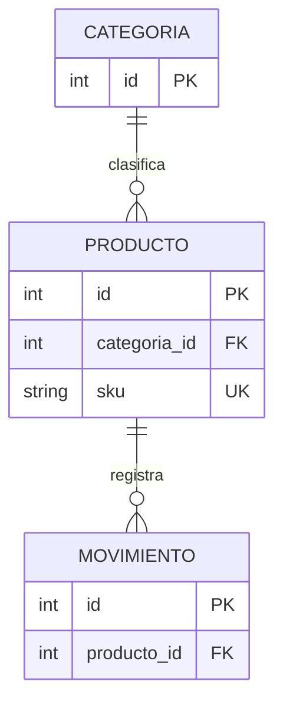
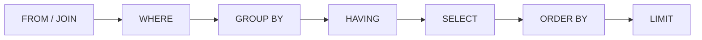
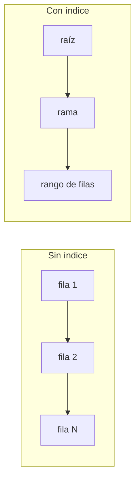
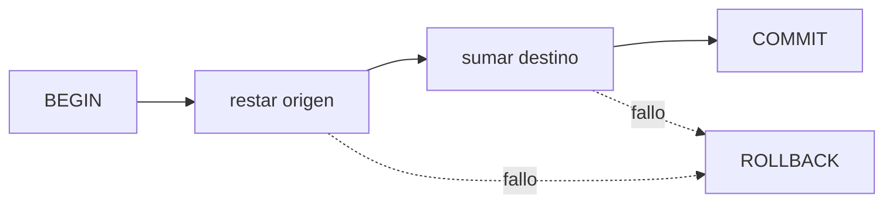

# Módulo 4: Modelado de datos, SQL y persistencia


## Aprende construyendo

### Tema 1: Del mundo real al modelo relacional

Ejecuta node --version para comprobar el entorno antes de continuar. **Evidencia de aprendizaje:** conserva la salida y explica qué verificaste.

#### Paso 1 · Objetivo y preparación
Al finalizar podrás diseñar y consultar datos desde cero. Prerrequisitos: Docker o SQLite, terminal y editor. Comprueba sqlite3 --version o docker --version.

#### Paso 2 · Contexto y caso real
En un caso real de entregas, pedidos, usuarios y ubicaciones deben conservar identidad, relaciones e historial sin duplicar información.

#### Paso 3 · Teoría, modelo mental y analogía
Un modelo relacional separa entidades y relaciones; SQL define, consulta y protege datos. Restricciones expresan invariantes, índices aceleran lecturas con coste de escritura y transacciones coordinan cambios. La analogía es un registro contable: cada asiento tiene clave, regla y confirmación.

#### Paso 4 · Demostración guiada desde cero
Parte de una carpeta vacía:
```bash
mkdir ejemplo-fundamentos-m4
cd ejemplo-fundamentos-m4
sqlite3 deliveries.db "create table delivery(id text primary key, status text not null);"
sqlite3 deliveries.db "insert into delivery values('d-1','ready'); select * from delivery;"
```
Crea schema.sql con una restricción y explica cada sentencia y resultado.

#### Paso 5 · Práctica guiada
Pista: inserta deliberadamente un estado inválido para provocar un fallo deliberado de restricción; lee el mensaje y corrígelo. Resultado esperado: solo datos válidos persistidos.

#### Paso 6 · Práctica independiente
Añade relación usuario-entrega, índice para búsqueda por estado, transacción de actualización y una comparación documentada con un almacén NoSQL.

#### Paso 7 · Cierre y evidencia
Guarda schema, consultas, logs y plan; como siguiente paso estudia APIs. Errores comunes: concatenar SQL, omitir claves, indexar todo, transacciones demasiado largas y elegir NoSQL sin requisito. Fuentes oficiales: https://www.sqlite.org/docs.html y https://www.postgresql.org/docs/current/.
**¿Por qué es importante?** Porque los datos persisten más que una función y necesitan invariantes explícitos.
**Evidencia de aprendizaje:** entrega esquema, consulta, fallo de restricción y medición.
**Conceptos clave:** entidad, atributo, fila, tabla, clave primaria, clave foránea, relación, cardinalidad, restricción y normalización.

Persistir no significa “guardar un objeto como sea”. Primero se modela qué hechos existen y qué reglas deben permanecer verdaderas. En un inventario hay productos, categorías y movimientos. Un producto tiene SKU único; un movimiento pertenece a un producto y registra cantidad, tipo y fecha.

```sql
CREATE TABLE categorias (
  id INTEGER PRIMARY KEY,
  nombre TEXT NOT NULL UNIQUE
);

CREATE TABLE productos (
  id INTEGER PRIMARY KEY,
  sku TEXT NOT NULL UNIQUE,
  nombre TEXT NOT NULL,
  stock INTEGER NOT NULL DEFAULT 0 CHECK (stock >= 0),
  categoria_id INTEGER,
  FOREIGN KEY (categoria_id) REFERENCES categorias(id)
);
```

`PRIMARY KEY` identifica una fila. `UNIQUE` impide SKU repetido. `NOT NULL` exige dato. `CHECK` expresa una regla cerca del dato. La clave foránea declara que una categoría referenciada debe existir. Estas restricciones no reemplazan mensajes amigables en la aplicación; protegen la base incluso si otro proceso escribe.

Guardar el nombre de categoría repetido en cada producto produce inconsistencias: “Periféricos” y “perifericos” podrían representar lo mismo. Separar la entidad y referenciarla reduce repetición. Normalizar no significa fragmentar todo: busca representar cada hecho en un lugar coherente, evaluando después necesidades de lectura.

El diagrama entidad-relación se diseña antes del `CREATE TABLE`. Anota cardinalidad: una categoría tiene muchos productos; un producto puede tener muchos movimientos. Decide si una relación es obligatoria y qué debe ocurrir al eliminar.

**Analogía:** una clave primaria es el número de documento; una foránea es escribir ese número en otro expediente para enlazarlo sin copiar a la persona completa.

**¿Por qué es importante?** Un mal modelo obliga a corregir datos duplicados y reglas contradictorias. La integridad declarativa convierte requisitos en garantías verificables.

**Casos de uso reales:** pedidos/clientes, cursos/estudiantes, cuentas/movimientos, productos/categorías y usuarios/roles.

**Diagrama:**



#### Construcción RutaFlow: modelo que protege hechos

Crea `rutaflow-fundamentos/13-datos/migrations/001_initial.sql` con `guias`, `centros` y `movimientos`, y `rutaflow-fundamentos/13-datos/src/setup.py` para aplicarla con `sqlite3` de la biblioteca estándar. Ejecuta `python src/setup.py` —o `python3 src/setup.py`— y consulta `.schema`; el resultado esperado refleja PK, FK, `UNIQUE`, `NOT NULL` y `CHECK`.

Inserta una guía con centro inexistente y verifica el fallo tras habilitar `PRAGMA foreign_keys = ON`. Después intenta SKU/número duplicado y peso negativo. Como modificación, decide qué relación es opcional y qué sucede al eliminar un centro, evitando `CASCADE` sin analizar pérdida. RutaFlow representa cada hecho una vez; normalizar no significa fragmentar datos sin una necesidad de integridad. SQLite local enseña el contrato, pero no reproduce por sí solo concurrencia, operación ni tipos de un motor servidor.

### Tema 2: SQL para definir, escribir, consultar y relacionar

Ejecuta node --version para comprobar el entorno antes de continuar. **Evidencia de aprendizaje:** conserva la salida y explica qué verificaste.

#### Paso 1 · Objetivo y preparación
Al finalizar podrás diseñar y consultar datos desde cero. Prerrequisitos: Docker o SQLite, terminal y editor. Comprueba sqlite3 --version o docker --version.

#### Paso 2 · Contexto y caso real
En un caso real de entregas, pedidos, usuarios y ubicaciones deben conservar identidad, relaciones e historial sin duplicar información.

#### Paso 3 · Teoría, modelo mental y analogía
Un modelo relacional separa entidades y relaciones; SQL define, consulta y protege datos. Restricciones expresan invariantes, índices aceleran lecturas con coste de escritura y transacciones coordinan cambios. La analogía es un registro contable: cada asiento tiene clave, regla y confirmación.

#### Paso 4 · Demostración guiada desde cero
Parte de una carpeta vacía:
```bash
mkdir ejemplo-fundamentos-m4
cd ejemplo-fundamentos-m4
sqlite3 deliveries.db "create table delivery(id text primary key, status text not null);"
sqlite3 deliveries.db "insert into delivery values('d-1','ready'); select * from delivery;"
```
Crea schema.sql con una restricción y explica cada sentencia y resultado.

#### Paso 5 · Práctica guiada
Pista: inserta deliberadamente un estado inválido para provocar un fallo deliberado de restricción; lee el mensaje y corrígelo. Resultado esperado: solo datos válidos persistidos.

#### Paso 6 · Práctica independiente
Añade relación usuario-entrega, índice para búsqueda por estado, transacción de actualización y una comparación documentada con un almacén NoSQL.

#### Paso 7 · Cierre y evidencia
Guarda schema, consultas, logs y plan; como siguiente paso estudia APIs. Errores comunes: concatenar SQL, omitir claves, indexar todo, transacciones demasiado largas y elegir NoSQL sin requisito. Fuentes oficiales: https://www.sqlite.org/docs.html y https://www.postgresql.org/docs/current/.
**¿Por qué es importante?** Porque los datos persisten más que una función y necesitan invariantes explícitos.
**Evidencia de aprendizaje:** entrega esquema, consulta, fallo de restricción y medición.
**Conceptos clave:** DDL, DML, SELECT, INSERT, UPDATE, DELETE, WHERE, ORDER BY, GROUP BY, agregación, JOIN y parámetro.

SQL es declarativo: expresas el resultado, no el recorrido exacto. DDL define estructura; DML consulta y modifica datos.

```sql
INSERT INTO categorias(nombre) VALUES ('Periféricos');

INSERT INTO productos(sku, nombre, stock, categoria_id)
VALUES ('A-10', 'Teclado', 4, 1);

SELECT p.sku, p.nombre, p.stock, c.nombre AS categoria
FROM productos AS p
LEFT JOIN categorias AS c ON c.id = p.categoria_id
WHERE p.stock < 5
ORDER BY p.stock ASC;
```

Lee la consulta en capas: `FROM` establece filas; `JOIN` combina por relación; `WHERE` filtra; `SELECT` elige columnas; `ORDER BY` ordena. `LEFT JOIN` conserva productos sin categoría; `INNER JOIN` los excluiría. La elección expresa una regla de negocio.

Agregaciones resumen:

```sql
SELECT c.nombre, COUNT(p.id) AS productos, SUM(p.stock) AS unidades
FROM categorias c
LEFT JOIN productos p ON p.categoria_id = c.id
GROUP BY c.id, c.nombre
ORDER BY unidades DESC;
```

Nunca construyas SQL concatenando entrada:

```python
# Incorrecto: permite alterar la consulta
cursor.execute("SELECT * FROM productos WHERE sku = '" + sku + "'")

# Correcto: el driver separa código y dato
cursor.execute("SELECT * FROM productos WHERE sku = ?", (sku,))
```

La parametrización previene inyección y maneja escaping/tipos. No es opcional aunque la herramienta sea local.

**Analogía:** SQL se parece a pedir un reporte indicando columnas, fuentes y condiciones; el motor decide cómo recorrer archivadores.

**¿Por qué es importante?** ORMs terminan generando SQL. Comprenderlo permite detectar N+1, filtros incorrectos, pérdida de filas y vulnerabilidades.

**Casos de uso reales:** reportes, paneles, búsquedas, conciliaciones y APIs CRUD.

**Diagrama:**



#### Construcción RutaFlow: consultar sin concatenar entrada

Crea `rutaflow-fundamentos/14-sql/src/reportes.py`. Abre la base anterior, inserta datos con parámetros y genera dos reportes: guías por centro y movimientos por estado mediante JOIN y GROUP BY. Ejecuta `python3 src/reportes.py` —o `python src/reportes.py`—; la salida esperada conserva centros sin guías cuando el contrato usa `LEFT JOIN`.

Concatena deliberadamente un filtro recibido como `"' OR 1=1 --"` y observa cómo altera la consulta; reemplázalo por `?` y parámetros. Como modificación, añade paginación con orden estable y prueba datos repetidos. RutaFlow selecciona columnas necesarias y define la semántica del JOIN; un ORM futuro no elimina la obligación de comprender el SQL generado.

### Tema 3: Índices, restricciones y planes de consulta

Ejecuta node --version para comprobar el entorno antes de continuar. **Evidencia de aprendizaje:** conserva la salida y explica qué verificaste.

#### Paso 1 · Objetivo y preparación
Al finalizar podrás diseñar y consultar datos desde cero. Prerrequisitos: Docker o SQLite, terminal y editor. Comprueba sqlite3 --version o docker --version.

#### Paso 2 · Contexto y caso real
En un caso real de entregas, pedidos, usuarios y ubicaciones deben conservar identidad, relaciones e historial sin duplicar información.

#### Paso 3 · Teoría, modelo mental y analogía
Un modelo relacional separa entidades y relaciones; SQL define, consulta y protege datos. Restricciones expresan invariantes, índices aceleran lecturas con coste de escritura y transacciones coordinan cambios. La analogía es un registro contable: cada asiento tiene clave, regla y confirmación.

#### Paso 4 · Demostración guiada desde cero
Parte de una carpeta vacía:
```bash
mkdir ejemplo-fundamentos-m4
cd ejemplo-fundamentos-m4
sqlite3 deliveries.db "create table delivery(id text primary key, status text not null);"
sqlite3 deliveries.db "insert into delivery values('d-1','ready'); select * from delivery;"
```
Crea schema.sql con una restricción y explica cada sentencia y resultado.

#### Paso 5 · Práctica guiada
Pista: inserta deliberadamente un estado inválido para provocar un fallo deliberado de restricción; lee el mensaje y corrígelo. Resultado esperado: solo datos válidos persistidos.

#### Paso 6 · Práctica independiente
Añade relación usuario-entrega, índice para búsqueda por estado, transacción de actualización y una comparación documentada con un almacén NoSQL.

#### Paso 7 · Cierre y evidencia
Guarda schema, consultas, logs y plan; como siguiente paso estudia APIs. Errores comunes: concatenar SQL, omitir claves, indexar todo, transacciones demasiado largas y elegir NoSQL sin requisito. Fuentes oficiales: https://www.sqlite.org/docs.html y https://www.postgresql.org/docs/current/.
**¿Por qué es importante?** Porque los datos persisten más que una función y necesitan invariantes explícitos.
**Evidencia de aprendizaje:** entrega esquema, consulta, fallo de restricción y medición.
**Conceptos clave:** índice, escaneo, búsqueda, selectividad, índice compuesto, plan de consulta, coste de escritura y constraint.

Un índice mantiene una estructura auxiliar ordenada para localizar filas sin recorrer toda la tabla. No es gratuito: ocupa espacio y debe actualizarse en cada escritura.

```sql
CREATE INDEX idx_productos_categoria_stock
ON productos(categoria_id, stock);

EXPLAIN QUERY PLAN
SELECT * FROM productos
WHERE categoria_id = 2 AND stock < 5;
```

Un índice compuesto sigue el orden de columnas. Puede ayudar a consultas que filtran por `categoria_id` y luego `stock`; no necesariamente a una consulta solo por `stock`. La selectividad importa: indexar un booleano con dos valores quizá no reduzca suficiente trabajo.

Genera miles de filas, consulta antes y después del índice y observa `EXPLAIN QUERY PLAN`. No midas únicamente milisegundos: un conjunto pequeño puede caber en memoria y ocultar diferencia. Busca evidencia de `SCAN` frente a `SEARCH`, repite y registra entorno.

Las restricciones también afectan diseño: `UNIQUE` suele respaldarse con índice; claves foráneas requieren habilitación en SQLite mediante `PRAGMA foreign_keys = ON`. Comprueba que una inserción inválida falla; no asumas que la declaración se aplica sin verificar configuración.

Demasiados índices ralentizan `INSERT/UPDATE/DELETE`. Define consultas críticas primero, mide y elimina índices redundantes. Un índice no corrige seleccionar todas las columnas, paginación ilimitada o un modelo incoherente.

**Analogía:** un índice de libro acelera encontrar un tema, pero ocupa páginas y debe actualizarse si cambia el contenido. Crear un índice para cada palabra haría costosa la edición.

**¿Por qué es importante?** Rendimiento de datos depende más de modelo, consultas e índices que de microoptimizar código de aplicación.

**Casos de uso reales:** búsqueda por email, pedidos por cliente/fecha, logs por servicio/tiempo y catálogo por categoría/precio.

**Diagrama:**



#### Construcción RutaFlow: índice justificado por plan

Crea `rutaflow-fundamentos/15-indices/src/medir_indices.py`, genera 10.000 movimientos reproducibles y ejecuta `EXPLAIN QUERY PLAN` para buscar por `guia_id` y fecha antes/después de un índice compuesto. Ejecuta `python3 src/medir_indices.py` —o `python src/medir_indices.py`—; la evidencia esperada cambia de `SCAN` a `SEARCH` y registra tiempos repetidos.

Invierte el orden de columnas del índice y comprueba qué consultas dejan de aprovecharlo. Como modificación, mide también inserción masiva con cero, uno y dos índices, mostrando el costo de escritura. RutaFlow añade índices por consultas críticas observadas; un índice no corrige una consulta que devuelve todo ni garantiza mejora en datos pequeños.

### Tema 4: Transacciones, concurrencia y elección SQL/NoSQL

Ejecuta node --version para comprobar el entorno antes de continuar. **Evidencia de aprendizaje:** conserva la salida y explica qué verificaste.

#### Paso 1 · Objetivo y preparación
Al finalizar podrás diseñar y consultar datos desde cero. Prerrequisitos: Docker o SQLite, terminal y editor. Comprueba sqlite3 --version o docker --version.

#### Paso 2 · Contexto y caso real
En un caso real de entregas, pedidos, usuarios y ubicaciones deben conservar identidad, relaciones e historial sin duplicar información.

#### Paso 3 · Teoría, modelo mental y analogía
Un modelo relacional separa entidades y relaciones; SQL define, consulta y protege datos. Restricciones expresan invariantes, índices aceleran lecturas con coste de escritura y transacciones coordinan cambios. La analogía es un registro contable: cada asiento tiene clave, regla y confirmación.

#### Paso 4 · Demostración guiada desde cero
Parte de una carpeta vacía:
```bash
mkdir ejemplo-fundamentos-m4
cd ejemplo-fundamentos-m4
sqlite3 deliveries.db "create table delivery(id text primary key, status text not null);"
sqlite3 deliveries.db "insert into delivery values('d-1','ready'); select * from delivery;"
```
Crea schema.sql con una restricción y explica cada sentencia y resultado.

#### Paso 5 · Práctica guiada
Pista: inserta deliberadamente un estado inválido para provocar un fallo deliberado de restricción; lee el mensaje y corrígelo. Resultado esperado: solo datos válidos persistidos.

#### Paso 6 · Práctica independiente
Añade relación usuario-entrega, índice para búsqueda por estado, transacción de actualización y una comparación documentada con un almacén NoSQL.

#### Paso 7 · Cierre y evidencia
Guarda schema, consultas, logs y plan; como siguiente paso estudia APIs. Errores comunes: concatenar SQL, omitir claves, indexar todo, transacciones demasiado largas y elegir NoSQL sin requisito. Fuentes oficiales: https://www.sqlite.org/docs.html y https://www.postgresql.org/docs/current/.
**¿Por qué es importante?** Porque los datos persisten más que una función y necesitan invariantes explícitos.
**Evidencia de aprendizaje:** entrega esquema, consulta, fallo de restricción y medición.
**Conceptos clave:** transacción, ACID, atomicidad, consistencia, aislamiento, durabilidad, commit, rollback, concurrencia, documento y patrón de acceso.

Una transacción agrupa operaciones como unidad. Transferir stock entre ubicaciones requiere restar y sumar; si solo ocurre una, el sistema queda inconsistente.

```python
import sqlite3

def mover_stock(conexion, origen, destino, cantidad):
    try:
        conexion.execute("BEGIN")
        conexion.execute(
            "UPDATE productos SET stock = stock - ? WHERE id = ? AND stock >= ?",
            (cantidad, origen, cantidad),
        )
        if conexion.total_changes == 0:
            raise ValueError("Stock insuficiente")
        conexion.execute(
            "UPDATE productos SET stock = stock + ? WHERE id = ?",
            (cantidad, destino),
        )
        conexion.commit()
    except Exception:
        conexion.rollback()
        raise
```

Atomicidad significa todo o nada. Consistencia conserva reglas. Aislamiento controla interferencia entre transacciones concurrentes. Durabilidad conserva un commit confirmado. Los niveles y detalles varían por motor; “ACID” no elimina la necesidad de conocer bloqueos y concurrencia.

NoSQL agrupa varias familias: documentos, clave-valor, columnas y grafos. Elegir NoSQL no significa “sin esquema”; el esquema se desplaza a aplicación/validación. Decide por patrones de acceso, volumen, relaciones, consistencia, latencia y operación. Un catálogo con documentos variables puede encajar en documentos; transferencias financieras relacionales exigen garantías fuertes; sesiones efímeras pueden usar clave-valor; relaciones profundas pueden justificar grafo.

Evita la falsa oposición. Sistemas reales combinan una fuente relacional con caché, búsqueda o eventos. Cada duplicación requiere estrategia de sincronización.

**Analogía:** una transacción es una mudanza registrada: no se acepta que el objeto salga del origen sin entrar al destino. SQL/NoSQL son tipos de archivo elegidos por preguntas y garantías, no equipos rivales.

**¿Por qué es importante?** Fallos parciales y concurrencia producen corrupción silenciosa. Elegir persistencia por moda crea costes operativos y modelos forzados.

**Casos de uso reales:** pagos, reservas, inventario, perfiles flexibles, caché de sesiones y redes sociales.

**Diagrama:**



#### Construcción RutaFlow: traslado atómico

Crea `rutaflow-fundamentos/16-transacciones/src/mover_guias.py`. Dentro de una transacción cambia una guía de centro y registra el movimiento; entre ambas operaciones permite activar un fallo de prueba. Ejecuta `python3 src/mover_guias.py --fallar`; el resultado esperado conserva centro original y ningún movimiento parcial. Sin `--fallar`, ambas operaciones quedan confirmadas.

Quita temporalmente el rollback o separa los commits para observar inconsistencia y luego restaura la unidad atómica. Como modificación, abre dos conexiones y simula actualización concurrente, documentando bloqueo o conflicto observado. Escribe un ADR comparando relacional, documentos y clave-valor según relaciones y consistencia de RutaFlow. NoSQL no elimina esquema ni hace transacciones irrelevantes.


## Construcción guiada del capítulo

### Proyecto 4: migrar el inventario JSON a SQLite

Copia el Proyecto 2 a una rama nueva. Conserva el JSON como fuente de migración, no como almacenamiento principal.

1. Diseña `modelo.md` con entidades, cardinalidades y reglas.
2. Crea `migrations/001_initial.sql` con categorías, productos y movimientos.
3. Escribe `migrate.py` que crea la base y registra versión aplicada.
4. Importa JSON dentro de una transacción; un dato inválido debe revertir todo.
5. Implementa repositorio con SQL parametrizado.
6. Añade reportes de bajo stock y unidades por categoría mediante JOIN/agregación.
7. Genera 10 000 productos, compara plan antes/después de índices.
8. Prueba SKU duplicado, categoría inexistente, stock negativo y rollback.
9. Documenta backup y restauración de `inventario.db`.
10. Escribe ADR: “Por qué SQLite y no documentos para esta etapa”.

**Verificación:** ejecutar migraciones dos veces no destruye datos; restricciones fallan donde corresponde; importación parcial se revierte; consultas no concatenan entrada; planes e índices están documentados.

**Errores comunes y soluciones**

- Crear tablas desde código sin versión: usa migraciones revisables.
- Concatenar entrada: parametriza siempre.
- Suponer foreign keys activas: habilita y prueba.
- Abrir una conexión por cada fila: agrupa trabajo en transacciones.
- Elegir NoSQL por evitar modelado: empieza por patrones y garantías.
