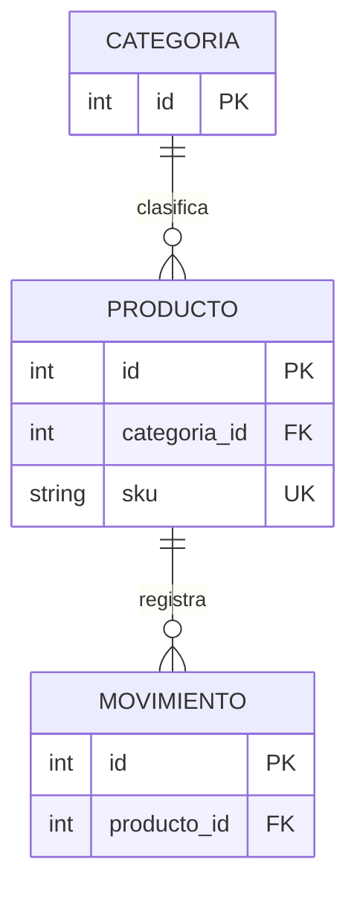
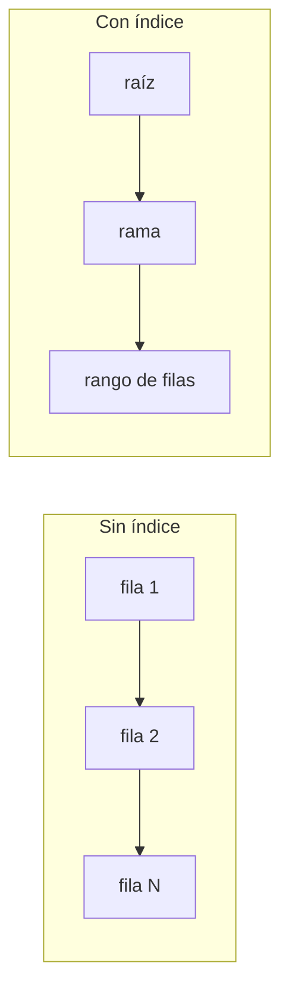
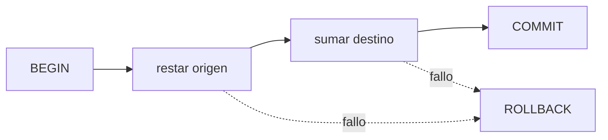

# Módulo 4: Modelado de datos, SQL y persistencia


## Aprende construyendo

### Tema 1: Del mundo real al modelo relacional

Ejecuta node --version para comprobar el entorno antes de continuar. **Evidencia de aprendizaje:** conserva la salida y explica qué verificaste.

#### Paso 1 · Objetivo y preparación
Al finalizar podrás diseñar y consultar datos desde cero. Prerrequisitos: Docker o SQLite, terminal y editor. Comprueba sqlite3 --version o docker --version.

#### Paso 2 · Contexto y caso real
El proyecto integrador Fundamentos que construirás a lo largo de estos 12 módulos es: el proyecto integrador Fundamentos: usarás lógica (if/else) para decidir si marcar tarea como completada. En un caso real de entregas, pedidos, usuarios y ubicaciones deben conservar identidad, relaciones e historial sin duplicar información.

#### Paso 3 · Teoría, modelo mental y analogía
Un modelo relacional separa entidades y relaciones; SQL define, consulta y protege datos. Restricciones expresan invariantes, índices aceleran lecturas con coste de escritura y transacciones coordinan cambios. La analogía es un registro contable: cada asiento tiene clave, regla y confirmación.

#### Paso 4 · Demostración guiada desde cero
Parte de una carpeta vacía y crea `src/schema.sql`:
```bash
mkdir ejemplo-modelo-relacional
cd ejemplo-modelo-relacional
mkdir src
```
```sql
PRAGMA foreign_keys = ON;
CREATE TABLE conductor(id INTEGER PRIMARY KEY, nombre TEXT NOT NULL);
CREATE TABLE entrega(
  guia TEXT PRIMARY KEY,
  conductor_id INTEGER NOT NULL REFERENCES conductor(id),
  estado TEXT NOT NULL CHECK(estado IN ('CREADA','EN_RUTA','ENTREGADA'))
);
```
```bash
sqlite3 entregas.db < src/schema.sql
sqlite3 entregas.db ".schema"
```
**Resultado esperado:** aparecen dos tablas, clave primaria, clave foránea y restricción de estado. **Fallo deliberado:** intenta insertar una entrega con `conductor_id=99`; SQLite rechaza la clave foránea si `PRAGMA foreign_keys=ON` está activo.

#### Paso 5 · Práctica guiada
Pista: inserta deliberadamente un estado inválido para provocar un fallo deliberado de restricción; lee el mensaje y corrígelo. Resultado esperado: solo datos válidos persistidos.

#### Paso 6 · Práctica independiente
Añade relación usuario-entrega, índice para búsqueda por estado, transacción de actualización y una comparación documentada con un almacén NoSQL.

#### Paso 7 · Cierre y evidencia
Guarda schema, consultas, logs y plan; como siguiente paso estudia APIs. Errores comunes: concatenar SQL, omitir claves, indexar todo, transacciones demasiado largas y elegir NoSQL sin requisito. Fuentes oficiales: https://www.sqlite.org/docs.html y https://www.postgresql.org/docs/current/.
**¿Por qué es importante?** Porque los datos persisten más que una función y necesitan invariantes explícitos.
**Evidencia de aprendizaje:** entrega esquema, consulta, fallo de restricción y medición.
**Escenario:** Tu base de RutaFlow crece a 50 000 entregas activas. Un conductor deja la empresa y alguien ejecuta `DELETE FROM conductor WHERE id=123`. El sistema debe decidir: ¿eliminar automáticamente sus entregas asignadas o rechazar la eliminación?

**Tu tarea:**
1. Diseña dos esquemas: uno con `FOREIGN KEY...CASCADE` y otro con `NO ACTION`.
2. Explica el impacto de cada decisión en auditoría, recuperación y reglas de negocio.
3. ¿Qué garantías ofrece `NO ACTION` que `CASCADE` no da?
4. Propón cuándo es seguro `CASCADE` (pista: diferencia entre datos técnicos y datos de negocio).

[SOLUCIÓN PLEGADA]
> `CASCADE` es para relaciones puramente técnicas (órdenes → líneas de orden: la línea no existe sin orden). `NO ACTION` para datos de negocio (conductor → entregas: la entrega sigue existiendo como hecho histórico, solo el propietario cambia). Auditoría exige registro explícito del cambio, no eliminación silenciosa.

**Conceptos clave:** entidad, atributo, fila, tabla, clave primaria, clave foránea, relación, cardinalidad, restricción y normalización.

Persistir no significa “guardar un objeto como sea”. Primero se modela qué hechos existen y qué reglas deben permanecer verdaderas. En un inventario hay productos, categorías y movimientos. Un producto tiene SKU único; un movimiento pertenece a un producto y registra cantidad, tipo y fecha.

```sql
CREATE TABLE categorias (
  id INTEGER PRIMARY KEY,
  nombre TEXT NOT NULL UNIQUE
);

CREATE TABLE productos (
  id INTEGER PRIMARY KEY,
  sku TEXT NOT NULL UNIQUE,
  nombre TEXT NOT NULL,
  stock INTEGER NOT NULL DEFAULT 0 CHECK (stock >= 0),
  categoria_id INTEGER,
  FOREIGN KEY (categoria_id) REFERENCES categorias(id)
);
```

`PRIMARY KEY` identifica una fila. `UNIQUE` impide SKU repetido. `NOT NULL` exige dato. `CHECK` expresa una regla cerca del dato. La clave foránea declara que una categoría referenciada debe existir. Estas restricciones no reemplazan mensajes amigables en la aplicación; protegen la base incluso si otro proceso escribe.

Guardar el nombre de categoría repetido en cada producto produce inconsistencias: “Periféricos” y “perifericos” podrían representar lo mismo. Separar la entidad y referenciarla reduce repetición. Normalizar no significa fragmentar todo: busca representar cada hecho en un lugar coherente, evaluando después necesidades de lectura.

El diagrama entidad-relación se diseña antes del `CREATE TABLE`. Anota cardinalidad: una categoría tiene muchos productos; un producto puede tener muchos movimientos. Decide si una relación es obligatoria y qué debe ocurrir al eliminar.

**Analogía:** una clave primaria es el número de documento; una foránea es escribir ese número en otro expediente para enlazarlo sin copiar a la persona completa.

**¿Por qué es importante?** Un mal modelo obliga a corregir datos duplicados y reglas contradictorias. La integridad declarativa convierte requisitos en garantías verificables.

**Casos de uso reales:** pedidos/clientes, cursos/estudiantes, cuentas/movimientos, productos/categorías y usuarios/roles.

**Diagrama:**


```mermaid
erDiagram
    CATEGORIA ||--o{ PRODUCTO : clasifica
    PRODUCTO ||--o{ MOVIMIENTO : registra
    CATEGORIA { int id PK }
    PRODUCTO { int id PK int categoria_id FK string sku UK }
    MOVIMIENTO { int id PK int producto_id FK }
```


#### Paso 8 · Ejercicio de diseño (sin solución visible)

**Escenario:** Tu gestor de tareas necesita un comando `tarea prioritize` que marque una tarea como urgente.

**Tu tarea:** Diseña la lógica (`if`/`else`) que:
1. Reciba comando y número de tarea
2. Valide que el número es válido
3. Marque la tarea como urgente
4. Devuelva éxito o error

[SOLUCIÓN PLEGADA]
> `if numero <= 0 or numero > len(tareas): print("Error"); else: tareas[numero].urgente = True`

**¿Por qué importa?** Aquí ves la diferencia entre Intermedio (copiar código) y Master (diseñar soluciones).
### Tema 2: SQL para definir, escribir, consultar y relacionar

Ejecuta node --version para comprobar el entorno antes de continuar. **Evidencia de aprendizaje:** conserva la salida y explica qué verificaste.

#### Paso 1 · Objetivo y preparación
Al finalizar podrás diseñar y consultar datos desde cero. Prerrequisitos: Docker o SQLite, terminal y editor. Comprueba sqlite3 --version o docker --version.

#### Paso 2 · Contexto y caso real
En un caso real de entregas, pedidos, usuarios y ubicaciones deben conservar identidad, relaciones e historial sin duplicar información.

#### Paso 3 · Teoría, modelo mental y analogía
Un modelo relacional separa entidades y relaciones; SQL define, consulta y protege datos. Restricciones expresan invariantes, índices aceleran lecturas con coste de escritura y transacciones coordinan cambios. La analogía es un registro contable: cada asiento tiene clave, regla y confirmación.

#### Paso 4 · Demostración guiada desde cero
Parte de una carpeta vacía y crea `src/consultas.sql`:
```bash
mkdir ejemplo-sql
cd ejemplo-sql
mkdir src
```
```sql
CREATE TABLE entrega(guia TEXT PRIMARY KEY, ciudad TEXT NOT NULL, estado TEXT NOT NULL);
INSERT INTO entrega VALUES ('RF-101','Bogotá','EN_RUTA'), ('RF-102','Cali','ENTREGADA');
UPDATE entrega SET estado='ENTREGADA' WHERE guia='RF-101';
SELECT guia, ciudad FROM entrega WHERE estado='ENTREGADA' ORDER BY guia;
```
```bash
sqlite3 entregas.db < src/consultas.sql
```
**Salida esperada:** `RF-101|Bogotá` y `RF-102|Cali`. **Fallo deliberado:** repite el mismo `INSERT`; la clave primaria produce `UNIQUE constraint failed`. Diagnostica duplicación y decide entre rechazar o usar una operación idempotente explícita.

#### Paso 5 · Práctica guiada
Pista: inserta deliberadamente un estado inválido para provocar un fallo deliberado de restricción; lee el mensaje y corrígelo. Resultado esperado: solo datos válidos persistidos.

#### Paso 6 · Práctica independiente
Añade relación usuario-entrega, índice para búsqueda por estado, transacción de actualización y una comparación documentada con un almacén NoSQL.

#### Paso 7 · Cierre y evidencia
Guarda schema, consultas, logs y plan; como siguiente paso estudia APIs. Errores comunes: concatenar SQL, omitir claves, indexar todo, transacciones demasiado largas y elegir NoSQL sin requisito. Fuentes oficiales: https://www.sqlite.org/docs.html y https://www.postgresql.org/docs/current/.
**¿Por qué es importante?** Porque los datos persisten más que una función y necesitan invariantes explícitos.
**Evidencia de aprendizaje:** entrega esquema, consulta, fallo de restricción y medición.

**Cuándo NO usar:** No uses `LEFT JOIN` si ambas tablas son obligatorias por requisito de negocio. No indexas todas las columnas; indexa solo las que filtras frecuentemente. No escribas SQL concatenado aunque sea una herramienta local: es inseguro y difícil de mantener.

#### Paso 8 · Diseño: Consulta óptima para reporte de entregas por estado

**Escenario real:** El CLI Fundamentos genera un reporte: "todas las entregas completadas en las últimas 24 horas". Escribes una consulta con `LEFT JOIN` pero descubres que demora 8 segundos en 100k registros.

**Tu tarea (sin mirar solución):**

1. **Columnas a indexar:** ¿Qué columna indexarías primero: `guia`, `estado` o `created_at`?
2. **Complejidad:** Diseña una consulta que filtre solo entregas 'ENTREGADA'. Sin índice, ¿complejidad O(?)? Con índice en `estado`, ¿cómo mejora?
3. **Idempotencia:** ¿Qué sucede si ejecutas `SELECT * FROM entrega WHERE created_at > DATE('now','-1 day')`? ¿Es la consulta idempotente (mismo resultado cada vez)?
4. **Verificación:** Propón una versión con `EXPLAIN QUERY PLAN` que verifique si usa índice.

**Escribe tu respuesta:**
```
Índice a crear: _________ (¿Por qué esa columna primero?)
Complejidad sin índice: O(_)
Complejidad con índice (estado): O(_)
¿Es idempotente? _________ (¿Por qué?)
EXPLAIN QUERY PLAN output debe mostrar: _________
```

[SOLUCIÓN — Lee solo después de intentar]

> **Respuesta esperada:**
>
> **Índice:** `(estado, created_at)` compuesto. Filtra por estado (más selectivo) luego por fecha.
>
> **Complejidad:** Sin índice O(n), con índice O(log n + k) donde k es resultado.
>
> **Idempotencia:** No exactamente. `DATE('now','-1 day')` cambia cada día. Mejor: usar timestamp fijo o rango: `created_at BETWEEN '2026-10-05' AND '2026-10-06'`.
>
> **EXPLAIN:** Debe mostrar `SEARCH entrega USING INDEX idx_estado_fecha` en lugar de `SCAN TABLE entrega`.

**Conceptos clave:** DDL, DML, SELECT, INSERT, UPDATE, DELETE, WHERE, ORDER BY, GROUP BY, agregación, JOIN y parámetro.

SQL es declarativo: expresas el resultado, no el recorrido exacto. DDL define estructura; DML consulta y modifica datos.

```sql
INSERT INTO categorias(nombre) VALUES ('Periféricos');

INSERT INTO productos(sku, nombre, stock, categoria_id)
VALUES ('A-10', 'Teclado', 4, 1);

SELECT p.sku, p.nombre, p.stock, c.nombre AS categoria
FROM productos AS p
LEFT JOIN categorias AS c ON c.id = p.categoria_id
WHERE p.stock < 5
ORDER BY p.stock ASC;
```

Lee la consulta en capas: `FROM` establece filas; `JOIN` combina por relación; `WHERE` filtra; `SELECT` elige columnas; `ORDER BY` ordena. `LEFT JOIN` conserva productos sin categoría; `INNER JOIN` los excluiría. La elección expresa una regla de negocio.

Agregaciones resumen:

```sql
SELECT c.nombre, COUNT(p.id) AS productos, SUM(p.stock) AS unidades
FROM categorias c
LEFT JOIN productos p ON p.categoria_id = c.id
GROUP BY c.id, c.nombre
ORDER BY unidades DESC;
```

Nunca construyas SQL concatenando entrada:

```python
# Incorrecto: permite alterar la consulta
cursor.execute("SELECT * FROM productos WHERE sku = '" + sku + "'")

# Correcto: el driver separa código y dato
cursor.execute("SELECT * FROM productos WHERE sku = ?", (sku,))
```

La parametrización previene inyección y maneja escaping/tipos. No es opcional aunque la herramienta sea local.

**Analogía:** SQL se parece a pedir un reporte indicando columnas, fuentes y condiciones; el motor decide cómo recorrer archivadores.

**¿Por qué es importante?** ORMs terminan generando SQL. Comprenderlo permite detectar N+1, filtros incorrectos, pérdida de filas y vulnerabilidades.

**Casos de uso reales:** reportes, paneles, búsquedas, conciliaciones y APIs CRUD.

**Diagrama:**


```mermaid
flowchart LR
    FROM["FROM / JOIN"] --> WHERE["WHERE"] --> GROUP["GROUP BY"]
    GROUP --> HAVING["HAVING"] --> SELECT["SELECT"] --> ORDER["ORDER BY"] --> LIMIT["LIMIT"]
```

### Tema 3: Índices, restricciones y planes de consulta

Ejecuta node --version para comprobar el entorno antes de continuar. **Evidencia de aprendizaje:** conserva la salida y explica qué verificaste.

#### Paso 1 · Objetivo y preparación
Al finalizar podrás diseñar y consultar datos desde cero. Prerrequisitos: Docker o SQLite, terminal y editor. Comprueba sqlite3 --version o docker --version.

#### Paso 2 · Contexto y caso real
En un caso real de entregas, pedidos, usuarios y ubicaciones deben conservar identidad, relaciones e historial sin duplicar información.

#### Paso 3 · Teoría, modelo mental y analogía
Un modelo relacional separa entidades y relaciones; SQL define, consulta y protege datos. Restricciones expresan invariantes, índices aceleran lecturas con coste de escritura y transacciones coordinan cambios. La analogía es un registro contable: cada asiento tiene clave, regla y confirmación.

#### Paso 4 · Demostración guiada desde cero
Parte de una carpeta vacía y crea `src/indice.sql`:
```bash
mkdir ejemplo-indices
cd ejemplo-indices
mkdir src
```
```sql
CREATE TABLE evento(id INTEGER PRIMARY KEY, guia TEXT NOT NULL, creado_en TEXT NOT NULL);
INSERT INTO evento(guia, creado_en) VALUES ('RF-101','2026-01-01'),('RF-102','2026-01-02');
EXPLAIN QUERY PLAN SELECT * FROM evento WHERE guia='RF-101';
CREATE INDEX idx_evento_guia ON evento(guia);
EXPLAIN QUERY PLAN SELECT * FROM evento WHERE guia='RF-101';
```
```bash
sqlite3 eventos.db < src/indice.sql
```
**Resultado esperado:** el primer plan indica `SCAN` y el segundo usa `SEARCH ... INDEX`. **Fallo deliberado:** crea de nuevo `idx_evento_guia`; SQLite informa que ya existe. Usa nombres versionados y migraciones idempotentes cuando corresponda.

#### Paso 5 · Práctica guiada
Pista: inserta deliberadamente un estado inválido para provocar un fallo deliberado de restricción; lee el mensaje y corrígelo. Resultado esperado: solo datos válidos persistidos.

#### Paso 6 · Práctica independiente
Añade relación usuario-entrega, índice para búsqueda por estado, transacción de actualización y una comparación documentada con un almacén NoSQL.

#### Paso 7 · Cierre y evidencia
Guarda schema, consultas, logs y plan; como siguiente paso estudia APIs. Errores comunes: concatenar SQL, omitir claves, indexar todo, transacciones demasiado largas y elegir NoSQL sin requisito. Fuentes oficiales: https://www.sqlite.org/docs.html y https://www.postgresql.org/docs/current/.
**¿Por qué es importante?** Porque los datos persisten más que una función y necesitan invariantes explícitos.
**Evidencia de aprendizaje:** entrega esquema, consulta, fallo de restricción y medición.

**Cuándo NO usar:** No crees índice en una columna con solo 2 valores (booleano). No indexas todas las columnas; solo las que filtran frecuentemente. No indexas una columna que rara vez se consulta porque ralentiza INSERT.

#### Paso 8 · Diseño: Plan de consulta cuando el índice no acelera

**Escenario real:** Fundamentos guarda 500k tareas. Escribes `SELECT * FROM tarea WHERE urgente=1 AND prioridad>5`. Sin índice: 2 segundos. Creas índice en `urgente` pero sigue demorando 2 segundos.

**Tu tarea (sin mirar solución):**

1. **Selectividad:** ¿Por qué `CREATE INDEX idx_urgente ON tarea(urgente)` no acelera si el predicado es `urgente=1 AND prioridad>5`?
2. **Índice compuesto:** Diseña un índice que acelere ambas condiciones. ¿Importa el orden de columnas?
3. **Verificación:** Ejecuta `EXPLAIN QUERY PLAN` antes y después. ¿Cómo cambia el plan?
4. **Trade-off:** ¿Cuándo un índice hace más lento un INSERT? ¿A partir de cuántos índices?

**Escribe tu respuesta:**

```
Selectividad de urgente=1: _________ (¿qué % de tareas?)
Índice compuesto propuesto: _________ (columnas y orden)
¿Importa el orden? _________ (¿Por qué?)
EXPLAIN antes: _________
EXPLAIN después: _________
Número de índices que ralentiza INSERT: _________
```

[SOLUCIÓN — Lee solo después de intentar]

> **Respuesta esperada:**
>
> **Selectividad:** Indexar solo `urgente` filtra ~50% de filas. Luego debe recorrer todas para verificar `prioridad>5` (O(n)).
>
> **Índice compuesto:** `(urgente, prioridad)`. Sí, el orden importa: primero columna más selectiva o que usas en igualdad.
>
> **Plan:** Antes: `SCAN TABLE tarea`. Después: `SEARCH tarea USING INDEX idx_urgente_prioridad`.
>
> **Trade-off:** Cada índice ralentiza INSERT/UPDATE. 2-3 índices = negligible; 10+ = significante. Balance con frecuencia de consulta.

**Conceptos clave:** índice, escaneo, búsqueda, selectividad, índice compuesto, plan de consulta, coste de escritura y constraint.

Un índice mantiene una estructura auxiliar ordenada para localizar filas sin recorrer toda la tabla. No es gratuito: ocupa espacio y debe actualizarse en cada escritura.

```sql
CREATE INDEX idx_productos_categoria_stock
ON productos(categoria_id, stock);

EXPLAIN QUERY PLAN
SELECT * FROM productos
WHERE categoria_id = 2 AND stock < 5;
```

Un índice compuesto sigue el orden de columnas. Puede ayudar a consultas que filtran por `categoria_id` y luego `stock`; no necesariamente a una consulta solo por `stock`. La selectividad importa: indexar un booleano con dos valores quizá no reduzca suficiente trabajo.

Genera miles de filas, consulta antes y después del índice y observa `EXPLAIN QUERY PLAN`. No midas únicamente milisegundos: un conjunto pequeño puede caber en memoria y ocultar diferencia. Busca evidencia de `SCAN` frente a `SEARCH`, repite y registra entorno.

Las restricciones también afectan diseño: `UNIQUE` suele respaldarse con índice; claves foráneas requieren habilitación en SQLite mediante `PRAGMA foreign_keys = ON`. Comprueba que una inserción inválida falla; no asumas que la declaración se aplica sin verificar configuración.

Demasiados índices ralentizan `INSERT/UPDATE/DELETE`. Define consultas críticas primero, mide y elimina índices redundantes. Un índice no corrige seleccionar todas las columnas, paginación ilimitada o un modelo incoherente.

**Analogía:** un índice de libro acelera encontrar un tema, pero ocupa páginas y debe actualizarse si cambia el contenido. Crear un índice para cada palabra haría costosa la edición.

**¿Por qué es importante?** Rendimiento de datos depende más de modelo, consultas e índices que de microoptimizar código de aplicación.

**Casos de uso reales:** búsqueda por email, pedidos por cliente/fecha, logs por servicio/tiempo y catálogo por categoría/precio.

**Diagrama:**


```mermaid
flowchart LR
    subgraph SCAN["Sin índice"]
      S1["fila 1"] --> S2["fila 2"] --> SN["fila N"]
    end
    subgraph SEARCH["Con índice"]
      ROOT["raíz"] --> BRANCH["rama"] --> RANGE["rango de filas"]
    end
```

### Tema 4: Transacciones, concurrencia y elección SQL/NoSQL

Ejecuta node --version para comprobar el entorno antes de continuar. **Evidencia de aprendizaje:** conserva la salida y explica qué verificaste.

#### Paso 1 · Objetivo y preparación
Al finalizar podrás diseñar y consultar datos desde cero. Prerrequisitos: Docker o SQLite, terminal y editor. Comprueba sqlite3 --version o docker --version.

#### Paso 2 · Contexto y caso real
En un caso real de entregas, pedidos, usuarios y ubicaciones deben conservar identidad, relaciones e historial sin duplicar información.

#### Paso 3 · Teoría, modelo mental y analogía
Un modelo relacional separa entidades y relaciones; SQL define, consulta y protege datos. Restricciones expresan invariantes, índices aceleran lecturas con coste de escritura y transacciones coordinan cambios. La analogía es un registro contable: cada asiento tiene clave, regla y confirmación.

#### Paso 4 · Demostración guiada desde cero
Parte de una carpeta vacía y crea `src/transaccion.sql`:
```bash
mkdir ejemplo-transacciones
cd ejemplo-transacciones
mkdir src
```
```sql
CREATE TABLE cuenta(id TEXT PRIMARY KEY, saldo INTEGER NOT NULL CHECK(saldo >= 0));
INSERT INTO cuenta VALUES ('origen',100),('destino',0);
BEGIN;
UPDATE cuenta SET saldo=saldo-40 WHERE id='origen';
UPDATE cuenta SET saldo=saldo+40 WHERE id='destino';
COMMIT;
SELECT * FROM cuenta ORDER BY id;
```
```bash
sqlite3 cuentas.db < src/transaccion.sql
```
**Salida esperada:** destino 40 y origen 60; la suma permanece 100. **Fallo deliberado:** intenta transferir 200 dentro de una transacción; la restricción produce error. Ejecuta `ROLLBACK` y comprueba que ninguno de los dos saldos cambió parcialmente.

#### Paso 5 · Práctica guiada
Pista: inserta deliberadamente un estado inválido para provocar un fallo deliberado de restricción; lee el mensaje y corrígelo. Resultado esperado: solo datos válidos persistidos.

#### Paso 6 · Práctica independiente
Añade relación usuario-entrega, índice para búsqueda por estado, transacción de actualización y una comparación documentada con un almacén NoSQL.

#### Paso 7 · Cierre y evidencia
Guarda schema, consultas, logs y plan; como siguiente paso estudia APIs. Errores comunes: concatenar SQL, omitir claves, indexar todo, transacciones demasiado largas y elegir NoSQL sin requisito. Fuentes oficiales: https://www.sqlite.org/docs.html y https://www.postgresql.org/docs/current/.
**¿Por qué es importante?** Porque los datos persisten más que una función y necesitan invariantes explícitos.
**Evidencia de aprendizaje:** entrega esquema, consulta, fallo de restricción y medición.

**Cuándo NO usar:** No uses NoSQL para datos relacionales complejos sin reinventar restricciones. No mantengas transacciones largas (> 1s); fragmenta en operaciones más pequeñas. No assumes `READ COMMITTED` es suficiente para operaciones críticas sin entender race conditions.

#### Paso 8 · Diseño: Transacción vs no-transacción en Fundamentos

**Escenario real:** Fundamentos guarda una tarea nueva: escribe `INSERT INTO tarea(id, titulo)` y luego `INSERT INTO etiqueta(tarea_id, tag)`. La conexión de red falla entre ambas operaciones.

**Tu tarea (sin mirar solución):**

1. **Sin transacción:** ¿Cuál es el estado de la BD? (Tarea existe pero sin etiqueta).
2. **Consistencia:** ¿Cómo lo llamas? ¿Cada entidad por separado es válida pero el par está inconsistente?
3. **Con transacción:** Escribe `BEGIN; ... COMMIT;` que agrupe ambas inserciones.
4. **Recuperación:** ¿Qué significa `ROLLBACK`? ¿Cuándo y cómo lo ejecutarías?

**Escribe tu respuesta:**

```
Sin transacción: tarea se crea _________ (¿sí/no?), etiqueta se crea _________ 
Estado inconsistente: _________ (nombre del problema)
Transacción: BEGIN; _________ ; COMMIT;
Si error entre INSERT: ejecutas _________ y el resultado es _________
```

[SOLUCIÓN — Lee solo después de intentar]

> **Respuesta esperada:**
>
> **Sin transacción:** Sí se crea tarea, no se crea etiqueta. Estado: inconsistencia; tarea huérfana.
>
> **Nombre:** Anomalía de durabilidad o inconsistencia parcial.
>
> **Transacción:** 
> ```sql
> BEGIN;
> INSERT INTO tarea(id, titulo) VALUES (?, ?);
> INSERT INTO etiqueta(tarea_id, tag) VALUES (?, ?);
> COMMIT;
> ```
>
> **Si error:** `ROLLBACK` y ninguna operación persiste. Tarea y etiqueta quedan inexistentes (atomicidad).

**Conceptos clave:** transacción, ACID, atomicidad, consistencia, aislamiento, durabilidad, commit, rollback, concurrencia, documento y patrón de acceso.

Una transacción agrupa operaciones como unidad. Transferir stock entre ubicaciones requiere restar y sumar; si solo ocurre una, el sistema queda inconsistente.

```python
import sqlite3

def mover_stock(conexion, origen, destino, cantidad):
    try:
        conexion.execute("BEGIN")
        conexion.execute(
            "UPDATE productos SET stock = stock - ? WHERE id = ? AND stock >= ?",
            (cantidad, origen, cantidad),
        )
        if conexion.total_changes == 0:
            raise ValueError("Stock insuficiente")
        conexion.execute(
            "UPDATE productos SET stock = stock + ? WHERE id = ?",
            (cantidad, destino),
        )
        conexion.commit()
    except Exception:
        conexion.rollback()
        raise
```

Atomicidad significa todo o nada. Consistencia conserva reglas. Aislamiento controla interferencia entre transacciones concurrentes. Durabilidad conserva un commit confirmado. Los niveles y detalles varían por motor; “ACID” no elimina la necesidad de conocer bloqueos y concurrencia.

NoSQL agrupa varias familias: documentos, clave-valor, columnas y grafos. Elegir NoSQL no significa “sin esquema”; el esquema se desplaza a aplicación/validación. Decide por patrones de acceso, volumen, relaciones, consistencia, latencia y operación. Un catálogo con documentos variables puede encajar en documentos; transferencias financieras relacionales exigen garantías fuertes; sesiones efímeras pueden usar clave-valor; relaciones profundas pueden justificar grafo.

Evita la falsa oposición. Sistemas reales combinan una fuente relacional con caché, búsqueda o eventos. Cada duplicación requiere estrategia de sincronización.

**Analogía:** una transacción es una mudanza registrada: no se acepta que el objeto salga del origen sin entrar al destino. SQL/NoSQL son tipos de archivo elegidos por preguntas y garantías, no equipos rivales.

**¿Por qué es importante?** Fallos parciales y concurrencia producen corrupción silenciosa. Elegir persistencia por moda crea costes operativos y modelos forzados.

**Casos de uso reales:** pagos, reservas, inventario, perfiles flexibles, caché de sesiones y redes sociales.

**Diagrama:**


```mermaid
flowchart LR
    BEGIN["BEGIN"] --> SUB["restar origen"] --> ADD["sumar destino"] --> COMMIT["COMMIT"]
    SUB -. "fallo" .-> ROLLBACK["ROLLBACK"]
    ADD -. "fallo" .-> ROLLBACK
```

## Construcción guiada del capítulo

### Proyecto 4: migrar el inventario JSON a SQLite

Copia el Proyecto 2 a una rama nueva. Conserva el JSON como fuente de migración, no como almacenamiento principal.

1. Diseña `modelo.md` con entidades, cardinalidades y reglas.
2. Crea `migrations/001_initial.sql` con categorías, productos y movimientos.
3. Escribe `migrate.py` que crea la base y registra versión aplicada.
4. Importa JSON dentro de una transacción; un dato inválido debe revertir todo.
5. Implementa repositorio con SQL parametrizado.
6. Añade reportes de bajo stock y unidades por categoría mediante JOIN/agregación.
7. Genera 10 000 productos, compara plan antes/después de índices.
8. Prueba SKU duplicado, categoría inexistente, stock negativo y rollback.
9. Documenta backup y restauración de `inventario.db`.
10. Escribe ADR: “Por qué SQLite y no documentos para esta etapa”.

**Verificación:** ejecutar migraciones dos veces no destruye datos; restricciones fallan donde corresponde; importación parcial se revierte; consultas no concatenan entrada; planes e índices están documentados.

**Errores comunes y soluciones**

- Crear tablas desde código sin versión: usa migraciones revisables.
- Concatenar entrada: parametriza siempre.
- Suponer foreign keys activas: habilita y prueba.
- Abrir una conexión por cada fila: agrupa trabajo en transacciones.
- Elegir NoSQL por evitar modelado: empieza por patrones y garantías.
