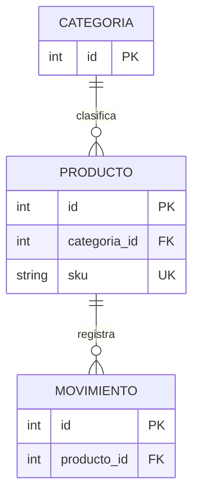
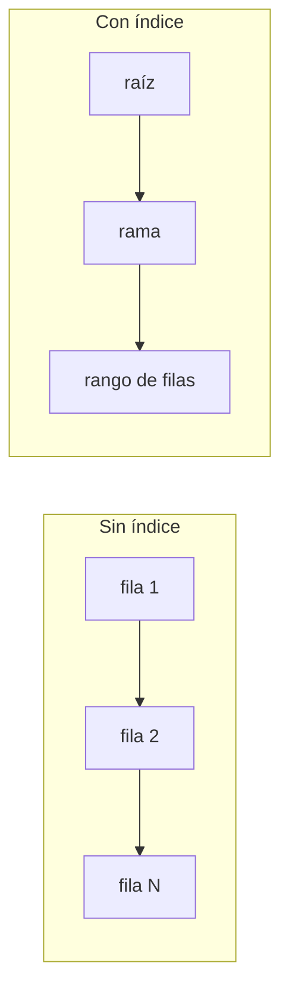
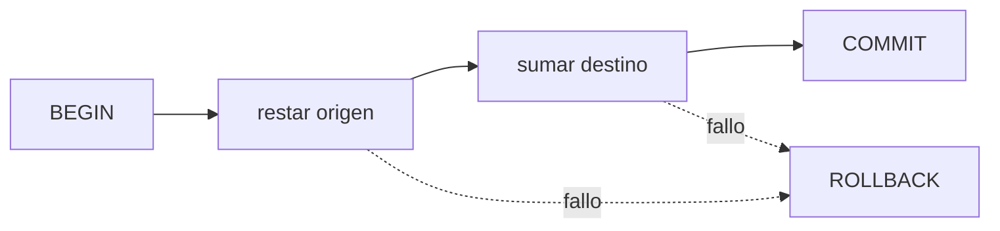

# Módulo 4: Modelado de datos, SQL y persistencia


## Aprende construyendo

### Tema 1: Del mundo real al modelo relacional

#### Paso 1 · Objetivo y preparación
Al finalizar vas a modelar las tareas de Fundamentos como una tabla `tareas` relacionada por clave foránea con una tabla `categorias`, y vas a comprobar en SQLite si esa relación protege o no la integridad al borrar una categoría. **Prerrequisitos:** Python 3 (incluye el módulo `sqlite3`), terminal y editor. Comprueba `python3 -c "import sqlite3; print(sqlite3.sqlite_version)"`.

#### Paso 2 · Contexto y caso real
El proyecto integrador Fundamentos (el gestor de tareas por terminal) hasta ahora guarda cada tarea como una línea de texto o un JSON plano. A partir de este módulo esas tareas pasan a vivir en una base SQLite: cada tarea necesita una categoría (trabajo, personal, urgente) y esa categoría no puede quedar duplicada en cada fila sin arriesgarse a inconsistencias como "trabajo" y "Trabajo" conviviendo como si fueran cosas distintas.

#### Paso 3 · Teoría, modelo mental y analogía
Modelar relacionalmente significa decidir primero qué hechos existen como entidades independientes (una tarea, una categoría) y qué hechos son solo atributos de esas entidades (el texto de la tarea, el nombre de la categoría). Una clave primaria identifica una fila sin ambigüedad; una clave foránea declara que un valor de una tabla debe corresponder a una fila existente en otra. La cardinalidad describe cuántas filas de un lado se relacionan con cuántas del otro: una categoría tiene muchas tareas, pero cada tarea pertenece a una sola categoría (relación uno a muchos). La analogía: una categoría es como una carpeta física y cada tarea es un papel dentro de ella con el número de esa carpeta escrito en la esquina — el papel no repite el nombre completo de la carpeta, solo su número, y ese número debería corresponder siempre a una carpeta que realmente existe.

#### Paso 4 · Demostración guiada desde cero
Parte de una carpeta vacía y crea `src/schema.sql`:
```bash
mkdir -p fundamentos-sqlite/src
cd fundamentos-sqlite
```
```sql
CREATE TABLE categorias(
  id INTEGER PRIMARY KEY,
  nombre TEXT NOT NULL UNIQUE
);
CREATE TABLE tareas(
  id INTEGER PRIMARY KEY,
  titulo TEXT NOT NULL,
  categoria_id INTEGER NOT NULL REFERENCES categorias(id)
);
INSERT INTO categorias(nombre) VALUES ('trabajo'), ('personal');
INSERT INTO tareas(titulo, categoria_id) VALUES ('Pagar factura', 1), ('Comprar pan', 2);
DELETE FROM categorias WHERE nombre='trabajo';
SELECT * FROM tareas;
```
```bash
sqlite3 tareas.db < src/schema.sql
```
**Resultado esperado:** la fila de "Pagar factura" sigue existiendo con `categoria_id=1`, aunque esa categoría ya no está en `categorias` — quedó huérfana. **Fallo deliberado:** a diferencia de PostgreSQL, SQLite NO activa las claves foráneas por defecto; aunque declaraste `REFERENCES categorias(id)`, el `DELETE` anterior se ejecutó sin ningún error. Repetí el experimento agregando `PRAGMA foreign_keys = ON;` como primera línea del script, antes del `DELETE`: ahora SQLite lo rechaza con `FOREIGN KEY constraint failed`, porque todavía existe una tarea que referencia esa categoría.

#### Paso 5 · Práctica guiada
Pista: volvé a crear la tabla `tareas` pero con `categoria_id INTEGER NOT NULL REFERENCES categorias(id) ON DELETE CASCADE`, activá `PRAGMA foreign_keys = ON;` y borrá la misma categoría. Resultado esperado: la tarea desaparece junto con la categoría, en vez de bloquear el `DELETE` o quedar huérfana; anotá los tres comportamientos (sin `PRAGMA`, con `PRAGMA` sin `CASCADE`, con `PRAGMA` y `CASCADE`) en una línea cada uno.

#### Paso 6 · Práctica independiente
Agregá una tabla `etiquetas` relacionada con `tareas` mediante una tabla intermedia `tarea_etiqueta` (relación muchos a muchos), dibujá el diagrama entidad-relación completo de categorías/tareas/etiquetas, y documentá qué pasa si borrás una etiqueta que todavía tiene tareas asociadas.

#### Paso 7 · Cierre y evidencia
Entregá el esquema `categorias`/`tareas`, los tres comportamientos del Paso 5 (sin `PRAGMA`, con `PRAGMA`, con `CASCADE`) y el diseño de `etiquetas` del Paso 6. Como siguiente paso, en el Tema 2 vas a escribir las consultas SQL (`INSERT`, `SELECT`, `JOIN`) sobre este mismo esquema. Errores comunes: asumir que declarar `REFERENCES` ya protege la integridad sin activar `PRAGMA foreign_keys`; confundir una relación uno-a-muchos con una muchos-a-muchos. Fuentes oficiales: https://www.sqlite.org/foreignkeys.html y https://www.sqlite.org/lang_createtable.html.
**¿Por qué es importante?** Porque una clave foránea declarada pero no verificada da una falsa sensación de seguridad: el esquema "se ve" correcto, pero la base permite exactamente lo que la relación debería impedir.
**Evidencia de aprendizaje:** entregá el esquema `categorias`/`tareas`, la fila huérfana sin `PRAGMA`, el rechazo con `PRAGMA` y el `CASCADE` del Paso 5.
**Escenario:** Tu base de RutaFlow crece a 50 000 entregas activas. Un conductor deja la empresa y alguien ejecuta `DELETE FROM conductor WHERE id=123`. El sistema debe decidir: ¿eliminar automáticamente sus entregas asignadas o rechazar la eliminación?

**Tu tarea:**
1. Diseña dos esquemas: uno con `FOREIGN KEY...CASCADE` y otro con `NO ACTION`.
2. Explica el impacto de cada decisión en auditoría, recuperación y reglas de negocio.
3. ¿Qué garantías ofrece `NO ACTION` que `CASCADE` no da?
4. Propón cuándo es seguro `CASCADE` (pista: diferencia entre datos técnicos y datos de negocio).

[SOLUCIÓN PLEGADA]
> `CASCADE` es para relaciones puramente técnicas (órdenes → líneas de orden: la línea no existe sin orden). `NO ACTION` para datos de negocio (conductor → entregas: la entrega sigue existiendo como hecho histórico, solo el propietario cambia). Auditoría exige registro explícito del cambio, no eliminación silenciosa.

**Conceptos clave:** entidad, atributo, fila, tabla, clave primaria, clave foránea, relación, cardinalidad, restricción y normalización.

Persistir no significa “guardar un objeto como sea”. Primero se modela qué hechos existen y qué reglas deben permanecer verdaderas. En un inventario hay productos, categorías y movimientos. Un producto tiene SKU único; un movimiento pertenece a un producto y registra cantidad, tipo y fecha.

```sql
CREATE TABLE categorias (
  id INTEGER PRIMARY KEY,
  nombre TEXT NOT NULL UNIQUE
);

CREATE TABLE productos (
  id INTEGER PRIMARY KEY,
  sku TEXT NOT NULL UNIQUE,
  nombre TEXT NOT NULL,
  stock INTEGER NOT NULL DEFAULT 0 CHECK (stock >= 0),
  categoria_id INTEGER,
  FOREIGN KEY (categoria_id) REFERENCES categorias(id)
);
```

`PRIMARY KEY` identifica una fila. `UNIQUE` impide SKU repetido. `NOT NULL` exige dato. `CHECK` expresa una regla cerca del dato. La clave foránea declara que una categoría referenciada debe existir. Estas restricciones no reemplazan mensajes amigables en la aplicación; protegen la base incluso si otro proceso escribe.

Guardar el nombre de categoría repetido en cada producto produce inconsistencias: “Periféricos” y “perifericos” podrían representar lo mismo. Separar la entidad y referenciarla reduce repetición. Normalizar no significa fragmentar todo: busca representar cada hecho en un lugar coherente, evaluando después necesidades de lectura.

El diagrama entidad-relación se diseña antes del `CREATE TABLE`. Anota cardinalidad: una categoría tiene muchos productos; un producto puede tener muchos movimientos. Decide si una relación es obligatoria y qué debe ocurrir al eliminar.

**Analogía:** una clave primaria es el número de documento; una foránea es escribir ese número en otro expediente para enlazarlo sin copiar a la persona completa.

**¿Por qué es importante?** Un mal modelo obliga a corregir datos duplicados y reglas contradictorias. La integridad declarativa convierte requisitos en garantías verificables.

**Casos de uso reales:** pedidos/clientes, cursos/estudiantes, cuentas/movimientos, productos/categorías y usuarios/roles.

**Diagrama:**


```mermaid
erDiagram
    CATEGORIA ||--o{ PRODUCTO : clasifica
    PRODUCTO ||--o{ MOVIMIENTO : registra
    CATEGORIA { int id PK }
    PRODUCTO { int id PK int categoria_id FK string sku UK }
    MOVIMIENTO { int id PK int producto_id FK }
```


#### Profundización · Diseño: normalizar una tabla de tareas con categoría repetida

**Escenario real:** Alguien implementó la tabla de tareas sin separar la categoría en su propia tabla:
```sql
CREATE TABLE tareas_mal_disenadas(
  id INTEGER PRIMARY KEY,
  titulo TEXT,
  categoria_nombre TEXT,
  categoria_color TEXT
);
```
Con 500 tareas de la categoría "trabajo", cambiar el color asignado a esa categoría implica actualizar 500 filas.

**Tu tarea (sin mirar solución):**
1. Identificá qué datos se repiten innecesariamente en `tareas_mal_disenadas`.
2. Diseñá las dos tablas normalizadas (`categorias` y `tareas`) que eliminan esa repetición.
3. Escribí el `UPDATE` que, en el diseño malo, tendría que tocar las 500 filas para cambiar el color; compará con el `UPDATE` equivalente en el diseño normalizado.
4. ¿Qué pasa si una fila de `tareas_mal_disenadas` guarda "trabajo" y otra "Trabajo "? ¿El modelo normalizado evita ese tipo de inconsistencia?

**Escribe tu respuesta:**
```
Datos repetidos en el diseño malo: _________
Tablas normalizadas: categorias(_________), tareas(_________)
UPDATE en diseño malo: afecta _________ filas
UPDATE en diseño normalizado: afecta _________ fila(s)
¿El modelo normalizado evita nombres inconsistentes? _________ (¿por qué?)
```

[SOLUCIÓN — Lee solo después de intentar]

> **Datos repetidos:** `categoria_nombre` y `categoria_color` se repiten en cada tarea de la misma categoría.
>
> **Normalizado:** `categorias(id, nombre, color)` y `tareas(id, titulo, categoria_id REFERENCES categorias(id))`.
>
> **UPDATE diseño malo:** `UPDATE tareas_mal_disenadas SET categoria_color='azul' WHERE categoria_nombre='trabajo'` afecta las 500 filas.
>
> **UPDATE normalizado:** `UPDATE categorias SET color='azul' WHERE nombre='trabajo'` afecta 1 fila; las 500 tareas heredan el cambio a través de la relación, sin tocarlas.
>
> **Nombres inconsistentes:** En parte. `UNIQUE` en `categorias.nombre` impide dos filas idénticas "trabajo", pero "trabajo" y "Trabajo " (con mayúscula o espacio) siguen siendo valores distintos para SQLite — normalizar la tabla evita la duplicación masiva, no sustituye la validación del texto de entrada.
### Tema 2: SQL para definir, escribir, consultar y relacionar

#### Paso 1 · Objetivo y preparación
Al finalizar vas a escribir las sentencias SQL (`CREATE TABLE`, `INSERT`, `SELECT` con `JOIN`) sobre el esquema `tareas`/`categorias` del Tema 1, y vas a provocar y corregir una inyección SQL real construyendo una consulta con texto concatenado en vez de parámetros. **Prerrequisitos:** Tema 1 de este módulo; Python 3 con `sqlite3` (viene incluido en la librería estándar).

#### Paso 2 · Contexto y caso real
El proyecto integrador Fundamentos necesita un comando `tarea listar --categoria trabajo` que filtre las tareas por el nombre de categoría escrito por quien usa el CLI. Si ese filtro se arma concatenando el texto ingresado directamente dentro del SQL, cualquiera puede escribir algo como `trabajo' OR '1'='1` y ver tareas de todas las categorías, no solo la suya.

#### Paso 3 · Teoría, modelo mental y analogía
SQL se divide en DDL (`CREATE`, `ALTER`, `DROP`: define estructura) y DML (`INSERT`, `SELECT`, `UPDATE`, `DELETE`: opera sobre datos). Es un lenguaje declarativo: describís qué filas querés, no el algoritmo para encontrarlas — el motor decide cómo recorrer las tablas. Un `JOIN` combina filas de dos tablas según una condición de igualdad entre claves; sin esa condición, el resultado mezclaría cada fila de una tabla con cada fila de la otra. La analogía: pedís un reporte a alguien que conoce el archivo completo ("dame las tareas de la categoría trabajo, ordenadas por título") en vez de explicarle paso a paso cómo revisar cada carpeta — describís el qué, el motor decide el cómo.

#### Paso 4 · Demostración guiada desde cero
Parte de una carpeta vacía y crea `src/consultas.py`:
```bash
mkdir -p fundamentos-sql/src
cd fundamentos-sql
```
```python
import sqlite3

conexion = sqlite3.connect("tareas.db")
conexion.execute("CREATE TABLE categorias(id INTEGER PRIMARY KEY, nombre TEXT NOT NULL UNIQUE)")
conexion.execute("CREATE TABLE tareas(id INTEGER PRIMARY KEY, titulo TEXT NOT NULL, categoria_id INTEGER NOT NULL REFERENCES categorias(id))")
conexion.execute("INSERT INTO categorias(nombre) VALUES ('trabajo'), ('personal')")
conexion.execute("INSERT INTO tareas(titulo, categoria_id) VALUES ('Pagar factura', 1), ('Comprar pan', 2)")
conexion.commit()

def listar_por_categoria_insegura(nombre_categoria):
    consulta = "SELECT t.titulo FROM tareas t JOIN categorias c ON c.id = t.categoria_id WHERE c.nombre = '" + nombre_categoria + "'"
    return conexion.execute(consulta).fetchall()

print(listar_por_categoria_insegura("trabajo"))
print(listar_por_categoria_insegura("trabajo' OR '1'='1"))
```
```bash
python3 src/consultas.py
```
**Salida esperada:** `listar_por_categoria_insegura("trabajo")` devuelve solo `[('Pagar factura',)]`. **Fallo deliberado:** la segunda llamada, con `"trabajo' OR '1'='1"`, devuelve TODAS las tareas (`[('Pagar factura',), ('Comprar pan',)]`) de cualquier categoría, porque el texto concatenado convirtió el `WHERE` en `c.nombre = 'trabajo' OR '1'='1'`, verdadero para cada fila. Corregilo reemplazando el cuerpo de la función por `conexion.execute("SELECT t.titulo FROM tareas t JOIN categorias c ON c.id = t.categoria_id WHERE c.nombre = ?", (nombre_categoria,)).fetchall()`: con el mismo texto malicioso como argumento, ahora devuelve una lista vacía porque SQLite lo trata como un valor literal, no como código SQL.

#### Paso 5 · Práctica guiada
Pista: escribí una función equivalente que busque por `titulo` con `LIKE` (por ejemplo, tareas que contengan "factura"), primero concatenando texto y después parametrizada con `?`. Probá qué pasa si alguien busca `%' OR '1'='1' --` en la versión insegura, y confirmá que la versión parametrizada trata ese mismo texto como literal.

#### Paso 6 · Práctica independiente
Escribí un `UPDATE` parametrizado que cambie el `titulo` de una tarea por `id`, un `DELETE` parametrizado que borre las tareas de una categoría dada, y una consulta con `GROUP BY categoria_id` que cuente, usando `JOIN`, cuántas tareas tiene cada categoría.

#### Paso 7 · Cierre y evidencia
Entregá las dos versiones (insegura y parametrizada) del Paso 4, la variante con `LIKE` del Paso 5, y el `UPDATE`/`DELETE`/`GROUP BY` del Paso 6. Como siguiente paso, en el Tema 3 vas a crear un índice sobre esta misma tabla `tareas` y vas a medir con `EXPLAIN QUERY PLAN` si realmente acelera las consultas. Errores comunes: concatenar entrada de usuario en SQL aunque la base sea local; asumir que un `JOIN` siempre encuentra una fila coincidente del otro lado. Fuentes oficiales: https://www.sqlite.org/lang.html y https://docs.python.org/es/3/library/sqlite3.html.
**¿Por qué es importante?** Porque cualquier entrada que llega desde afuera (un argumento de CLI, un formulario) puede contener texto diseñado para alterar tu consulta; parametrizar no es un detalle de estilo, es lo que separa código de dato.
**Evidencia de aprendizaje:** entregá la inyección reproducida con texto concatenado, la misma entrada neutralizada con parámetros, y las consultas `UPDATE`/`DELETE`/`GROUP BY` del Paso 6.

**Cuándo NO usar:** No uses `LEFT JOIN` si ambas tablas son obligatorias por requisito de negocio. No indexas todas las columnas; indexa solo las que filtras frecuentemente. No escribas SQL concatenado aunque sea una herramienta local: es inseguro y difícil de mantener.

#### Profundización · Diseño: Consulta óptima para reporte de entregas por estado

**Escenario real:** El CLI Fundamentos genera un reporte: "todas las entregas completadas en las últimas 24 horas". Escribes una consulta con `LEFT JOIN` pero descubres que demora 8 segundos en 100k registros.

**Tu tarea (sin mirar solución):**

1. **Columnas a indexar:** ¿Qué columna indexarías primero: `guia`, `estado` o `created_at`?
2. **Complejidad:** Diseña una consulta que filtre solo entregas 'ENTREGADA'. Sin índice, ¿complejidad O(?)? Con índice en `estado`, ¿cómo mejora?
3. **Idempotencia:** ¿Qué sucede si ejecutas `SELECT * FROM entrega WHERE created_at > DATE('now','-1 day')`? ¿Es la consulta idempotente (mismo resultado cada vez)?
4. **Verificación:** Propón una versión con `EXPLAIN QUERY PLAN` que verifique si usa índice.

**Escribe tu respuesta:**
```
Índice a crear: _________ (¿Por qué esa columna primero?)
Complejidad sin índice: O(_)
Complejidad con índice (estado): O(_)
¿Es idempotente? _________ (¿Por qué?)
EXPLAIN QUERY PLAN output debe mostrar: _________
```

[SOLUCIÓN — Lee solo después de intentar]

> **Respuesta esperada:**
>
> **Índice:** `(estado, created_at)` compuesto. Filtra por estado (más selectivo) luego por fecha.
>
> **Complejidad:** Sin índice O(n), con índice O(log n + k) donde k es resultado.
>
> **Idempotencia:** No exactamente. `DATE('now','-1 day')` cambia cada día. Mejor: usar timestamp fijo o rango: `created_at BETWEEN '2026-10-05' AND '2026-10-06'`.
>
> **EXPLAIN:** Debe mostrar `SEARCH entrega USING INDEX idx_estado_fecha` en lugar de `SCAN TABLE entrega`.

**Conceptos clave:** DDL, DML, SELECT, INSERT, UPDATE, DELETE, WHERE, ORDER BY, GROUP BY, agregación, JOIN y parámetro.

SQL es declarativo: expresas el resultado, no el recorrido exacto. DDL define estructura; DML consulta y modifica datos.

```sql
INSERT INTO categorias(nombre) VALUES ('Periféricos');

INSERT INTO productos(sku, nombre, stock, categoria_id)
VALUES ('A-10', 'Teclado', 4, 1);

SELECT p.sku, p.nombre, p.stock, c.nombre AS categoria
FROM productos AS p
LEFT JOIN categorias AS c ON c.id = p.categoria_id
WHERE p.stock < 5
ORDER BY p.stock ASC;
```

Lee la consulta en capas: `FROM` establece filas; `JOIN` combina por relación; `WHERE` filtra; `SELECT` elige columnas; `ORDER BY` ordena. `LEFT JOIN` conserva productos sin categoría; `INNER JOIN` los excluiría. La elección expresa una regla de negocio.

Agregaciones resumen:

```sql
SELECT c.nombre, COUNT(p.id) AS productos, SUM(p.stock) AS unidades
FROM categorias c
LEFT JOIN productos p ON p.categoria_id = c.id
GROUP BY c.id, c.nombre
ORDER BY unidades DESC;
```

Nunca construyas SQL concatenando entrada:

```python
# Incorrecto: permite alterar la consulta
cursor.execute("SELECT * FROM productos WHERE sku = '" + sku + "'")

# Correcto: el driver separa código y dato
cursor.execute("SELECT * FROM productos WHERE sku = ?", (sku,))
```

La parametrización previene inyección y maneja escaping/tipos. No es opcional aunque la herramienta sea local.

**Analogía:** SQL se parece a pedir un reporte indicando columnas, fuentes y condiciones; el motor decide cómo recorrer archivadores.

**¿Por qué es importante?** ORMs terminan generando SQL. Comprenderlo permite detectar N+1, filtros incorrectos, pérdida de filas y vulnerabilidades.

**Casos de uso reales:** reportes, paneles, búsquedas, conciliaciones y APIs CRUD.

**Diagrama:**


```mermaid
flowchart LR
    FROM["FROM / JOIN"] --> WHERE["WHERE"] --> GROUP["GROUP BY"]
    GROUP --> HAVING["HAVING"] --> SELECT["SELECT"] --> ORDER["ORDER BY"] --> LIMIT["LIMIT"]
```

### Tema 3: Índices, restricciones y planes de consulta

#### Paso 1 · Objetivo y preparación
Al finalizar vas a crear un índice sobre la tabla `tareas` y vas a comparar, con `EXPLAIN QUERY PLAN`, el plan de consulta antes y después de crearlo — confirmando en tu propia terminal la diferencia entre un `SCAN` (recorre toda la tabla) y un `SEARCH` (usa el índice). **Prerrequisitos:** Temas 1 y 2 de este módulo; `sqlite3` disponible como CLI o desde Python.

#### Paso 2 · Contexto y caso real
El comando `tarea listar --estado pendiente` del proyecto integrador Fundamentos filtra por estado cada vez que se ejecuta. Con 10 tareas no importa cómo lo resuelva SQLite, pero el mismo filtro sobre 200 000 tareas acumuladas durante meses obliga al motor a revisar fila por fila si no existe ninguna estructura que le diga dónde buscar directamente.

#### Paso 3 · Teoría, modelo mental y analogía
Un índice es una estructura auxiliar ordenada que SQLite mantiene junto a la tabla para localizar filas por el valor de una columna sin recorrerlas todas. `EXPLAIN QUERY PLAN` muestra, sin ejecutar realmente la consulta sobre los datos, qué estrategia usaría el motor: `SCAN TABLE` significa "voy a revisar cada fila una por una"; `SEARCH TABLE ... USING INDEX` significa "voy directo a las filas que coinciden". Un índice no es gratis: ocupa espacio en disco y SQLite debe actualizarlo en cada `INSERT`/`UPDATE`/`DELETE` sobre esa columna, no solo en cada lectura. La analogía: buscar un apellido en una guía telefónica ordenada alfabéticamente (índice) es muy distinto de buscarlo en una pila de fichas sueltas sin orden (`SCAN`) — pero si alguien agrega una ficha nueva, mantener la guía ordenada cuesta más trabajo que agregar la ficha al final de la pila.

#### Paso 4 · Demostración guiada desde cero
Parte de la base `tareas.db` del Tema 1 y crea `src/indice.sql`:
```bash
cd fundamentos-sqlite
```
```sql
ALTER TABLE tareas ADD COLUMN estado TEXT NOT NULL DEFAULT 'pendiente';
UPDATE tareas SET estado='completada' WHERE id=1;

EXPLAIN QUERY PLAN SELECT titulo FROM tareas WHERE estado='pendiente';

CREATE INDEX idx_tareas_estado ON tareas(estado);

EXPLAIN QUERY PLAN SELECT titulo FROM tareas WHERE estado='pendiente';
```
```bash
sqlite3 tareas.db < src/indice.sql
```
**Resultado esperado:** el primer `EXPLAIN QUERY PLAN` muestra `SCAN tareas`; el segundo, después de crear el índice, muestra `SEARCH tareas USING INDEX idx_tareas_estado (estado=?)`. **Fallo deliberado:** ejecutá de nuevo `CREATE INDEX idx_tareas_estado ON tareas(estado);` sin borrar el anterior; SQLite responde `index idx_tareas_estado already exists` y la migración se detiene ahí. Corregilo con `CREATE INDEX IF NOT EXISTS idx_tareas_estado ON tareas(estado);`, que no falla si el índice ya fue creado por una ejecución anterior de la misma migración.

#### Paso 5 · Práctica guiada
Pista: repetí el experimento filtrando por dos columnas (`WHERE estado='pendiente' AND categoria_id=1`): con el índice simple en `estado`, mirá en el `EXPLAIN QUERY PLAN` si SQLite igual necesita revisar filas de más; después creá un índice compuesto `CREATE INDEX idx_tareas_estado_categoria ON tareas(estado, categoria_id);` y compará el plan otra vez.

#### Paso 6 · Práctica independiente
Generá 5 000 tareas de prueba con un bucle en Python, medí el tiempo de la consulta por `estado` antes y después del índice con el módulo `time`, y documentá si la diferencia es perceptible con ese volumen o si recién se nota con más datos.

#### Paso 7 · Cierre y evidencia
Entregá los dos `EXPLAIN QUERY PLAN` (antes/después del índice) del Paso 4, el índice compuesto del Paso 5, y la medición de tiempo del Paso 6. Como siguiente paso, en el Tema 4 vas a envolver varias operaciones sobre estas mismas tablas dentro de una transacción para que un fallo a mitad de camino no deje la base a medio actualizar. Errores comunes: crear un índice por columna sin medir si realmente se usa; crear el mismo índice dos veces en una migración sin `IF NOT EXISTS`; medir con pocos datos y concluir que el índice "no sirve". Fuentes oficiales: https://www.sqlite.org/eqp.html y https://www.sqlite.org/lang_createindex.html.
**¿Por qué es importante?** Porque un índice mal elegido (o la ausencia de uno) es la causa más común de que una consulta que funcionaba bien con pocos datos se vuelva inutilizable cuando el proyecto crece — y `EXPLAIN QUERY PLAN` es la única forma de confirmarlo en vez de adivinarlo.
**Evidencia de aprendizaje:** entregá los dos planes de consulta, el índice compuesto y la medición con datos generados.

**Cuándo NO usar:** No crees índice en una columna con solo 2 valores (booleano). No indexas todas las columnas; solo las que filtran frecuentemente. No indexas una columna que rara vez se consulta porque ralentiza INSERT.

#### Profundización · Diseño: Plan de consulta cuando el índice no acelera

**Escenario real:** Fundamentos guarda 500k tareas. Escribes `SELECT * FROM tarea WHERE urgente=1 AND prioridad>5`. Sin índice: 2 segundos. Creas índice en `urgente` pero sigue demorando 2 segundos.

**Tu tarea (sin mirar solución):**

1. **Selectividad:** ¿Por qué `CREATE INDEX idx_urgente ON tarea(urgente)` no acelera si el predicado es `urgente=1 AND prioridad>5`?
2. **Índice compuesto:** Diseña un índice que acelere ambas condiciones. ¿Importa el orden de columnas?
3. **Verificación:** Ejecuta `EXPLAIN QUERY PLAN` antes y después. ¿Cómo cambia el plan?
4. **Trade-off:** ¿Cuándo un índice hace más lento un INSERT? ¿A partir de cuántos índices?

**Escribe tu respuesta:**

```
Selectividad de urgente=1: _________ (¿qué % de tareas?)
Índice compuesto propuesto: _________ (columnas y orden)
¿Importa el orden? _________ (¿Por qué?)
EXPLAIN antes: _________
EXPLAIN después: _________
Número de índices que ralentiza INSERT: _________
```

[SOLUCIÓN — Lee solo después de intentar]

> **Respuesta esperada:**
>
> **Selectividad:** Indexar solo `urgente` filtra ~50% de filas. Luego debe recorrer todas para verificar `prioridad>5` (O(n)).
>
> **Índice compuesto:** `(urgente, prioridad)`. Sí, el orden importa: primero columna más selectiva o que usas en igualdad.
>
> **Plan:** Antes: `SCAN TABLE tarea`. Después: `SEARCH tarea USING INDEX idx_urgente_prioridad`.
>
> **Trade-off:** Cada índice ralentiza INSERT/UPDATE. 2-3 índices = negligible; 10+ = significante. Balance con frecuencia de consulta.

**Conceptos clave:** índice, escaneo, búsqueda, selectividad, índice compuesto, plan de consulta, coste de escritura y constraint.

Un índice mantiene una estructura auxiliar ordenada para localizar filas sin recorrer toda la tabla. No es gratuito: ocupa espacio y debe actualizarse en cada escritura.

```sql
CREATE INDEX idx_productos_categoria_stock
ON productos(categoria_id, stock);

EXPLAIN QUERY PLAN
SELECT * FROM productos
WHERE categoria_id = 2 AND stock < 5;
```

Un índice compuesto sigue el orden de columnas. Puede ayudar a consultas que filtran por `categoria_id` y luego `stock`; no necesariamente a una consulta solo por `stock`. La selectividad importa: indexar un booleano con dos valores quizá no reduzca suficiente trabajo.

Genera miles de filas, consulta antes y después del índice y observa `EXPLAIN QUERY PLAN`. No midas únicamente milisegundos: un conjunto pequeño puede caber en memoria y ocultar diferencia. Busca evidencia de `SCAN` frente a `SEARCH`, repite y registra entorno.

Las restricciones también afectan diseño: `UNIQUE` suele respaldarse con índice; claves foráneas requieren habilitación en SQLite mediante `PRAGMA foreign_keys = ON`. Comprueba que una inserción inválida falla; no asumas que la declaración se aplica sin verificar configuración.

Demasiados índices ralentizan `INSERT/UPDATE/DELETE`. Define consultas críticas primero, mide y elimina índices redundantes. Un índice no corrige seleccionar todas las columnas, paginación ilimitada o un modelo incoherente.

**Analogía:** un índice de libro acelera encontrar un tema, pero ocupa páginas y debe actualizarse si cambia el contenido. Crear un índice para cada palabra haría costosa la edición.

**¿Por qué es importante?** Rendimiento de datos depende más de modelo, consultas e índices que de microoptimizar código de aplicación.

**Casos de uso reales:** búsqueda por email, pedidos por cliente/fecha, logs por servicio/tiempo y catálogo por categoría/precio.

**Diagrama:**


```mermaid
flowchart LR
    subgraph SCAN["Sin índice"]
      S1["fila 1"] --> S2["fila 2"] --> SN["fila N"]
    end
    subgraph SEARCH["Con índice"]
      ROOT["raíz"] --> BRANCH["rama"] --> RANGE["rango de filas"]
    end
```

### Tema 4: Transacciones, concurrencia y elección SQL/NoSQL

#### Paso 1 · Objetivo y preparación
Al finalizar vas a envolver dos actualizaciones relacionadas (marcar una tarea como completada y registrar ese cambio en un historial) dentro de una transacción, y vas a comprobar que un fallo simulado a mitad de camino deja la base exactamente como estaba antes — ni a medias, ni corrupta. **Prerrequisitos:** Temas 1 a 3 de este módulo.

#### Paso 2 · Contexto y caso real
El proyecto integrador Fundamentos necesita que marcar una tarea como completada también deje un registro en una tabla `historial` (qué tarea, qué acción). Son dos sentencias SQL separadas: si la segunda falla justo después de que la primera ya se ejecutó —por ejemplo porque el disco se llenó o el proceso se interrumpió—, la tarea queda marcada como completada pero sin ningún rastro en el historial, un estado que ninguna de las dos operaciones por sí sola produciría.

#### Paso 3 · Teoría, modelo mental y analogía
Una transacción agrupa varias sentencias SQL como si fueran una sola unidad indivisible: o se aplican todas (`COMMIT`), o no se aplica ninguna (`ROLLBACK`). Esa garantía se resume en ACID: atomicidad (todo o nada), consistencia (las reglas declaradas — `CHECK`, `UNIQUE`, claves foráneas — se siguen cumpliendo), aislamiento (una transacción no ve resultados a medio terminar de otra) y durabilidad (lo confirmado con `COMMIT` sobrevive incluso a un corte de luz). Elegir SQL o NoSQL no es una cuestión de moda: depende de si tus datos necesitan esas garantías fuertes entre entidades relacionadas (pagos, reservas, un historial de cambios) o si cada registro es independiente y puede vivir sin relaciones estrictas (una sesión de caché, un documento con forma variable). La analogía: una transacción es una transferencia bancaria firmada ante un notario — o se completan todos los pasos del contrato, o el notario rompe el papel entero; no existe un mundo donde el dinero salió de una cuenta pero el contrato quedó "a medias".

#### Paso 4 · Demostración guiada desde cero
Parte de la base `tareas.db` de los Temas anteriores y crea `src/transaccion.py`:
```bash
cd fundamentos-sqlite
```
```python
import sqlite3

conexion = sqlite3.connect("tareas.db")
conexion.execute("CREATE TABLE historial(id INTEGER PRIMARY KEY, tarea_id INTEGER NOT NULL, accion TEXT NOT NULL)")
conexion.commit()

def completar_con_transaccion(tarea_id, simular_fallo=False):
    try:
        conexion.execute("BEGIN")
        conexion.execute("UPDATE tareas SET estado='completada' WHERE id=?", (tarea_id,))
        if simular_fallo:
            raise RuntimeError("fallo simulado: el disco se llenó")
        conexion.execute("INSERT INTO historial(tarea_id, accion) VALUES (?, 'completada')", (tarea_id,))
        conexion.commit()
    except Exception as error:
        conexion.rollback()
        print("Revertido:", error)

completar_con_transaccion(2, simular_fallo=True)
print(conexion.execute("SELECT id, estado FROM tareas WHERE id=2").fetchone())
print(conexion.execute("SELECT * FROM historial WHERE tarea_id=2").fetchall())
```
```bash
python3 src/transaccion.py
```
**Resultado esperado:** después del `ROLLBACK`, la tarea 2 sigue con su estado original (no quedó "completada") y `historial` no tiene ninguna fila para esa tarea — el `UPDATE` que sí llegó a ejecutarse se revirtió por completo. **Fallo deliberado:** quitá el `BEGIN`/`try`/`rollback` y ejecutá las mismas dos sentencias sueltas, cada una con su propio `commit()` inmediato, con la excepción simulada entre medio: ahora la tarea 2 QUEDA marcada como "completada" (ese `UPDATE` ya se confirmó solo) pero `historial` sigue vacío para esa tarea — una inconsistencia que ningún `ROLLBACK` puede deshacer porque nunca hubo una transacción que agrupara ambos cambios.

#### Paso 5 · Práctica guiada
Pista: repetí `completar_con_transaccion` con `simular_fallo=False` para confirmar el camino feliz: la tarea queda completada Y aparece en `historial` en el mismo `COMMIT`. Después agregá una tercera operación dentro de la misma transacción (por ejemplo, decrementar un contador de "tareas pendientes" en otra tabla) y confirmá que un fallo en esa tercera operación también revierte las dos anteriores.

#### Paso 6 · Práctica independiente
Documentá una comparación de una línea cada caso: qué pasaría con este mismo escenario (completar tarea + historial) en una base de documentos sin transacciones multi-documento, y en qué casos esa falta de garantías sería aceptable para Fundamentos y en cuáles no.

#### Paso 7 · Cierre y evidencia
Entregá el camino feliz y el `ROLLBACK` del Paso 4, la transacción de tres pasos del Paso 5, y la comparación SQL/NoSQL del Paso 6. Con esto cerrás el Módulo 4; como siguiente paso, en el Módulo 5 (Testing, depuración, Git y CI) vas a escribir tests automatizados y usar Git/CI para que estos mismos cambios de esquema y consultas queden verificados antes de integrarse. Errores comunes: olvidar `BEGIN` y asumir que dos `execute()` consecutivos ya son atómicos; dejar transacciones abiertas por mucho tiempo bloqueando otras escrituras; elegir NoSQL únicamente para evitar diseñar un esquema. Fuentes oficiales: https://www.sqlite.org/lang_transaction.html y https://www.sqlite.org/atomiccommit.html.
**¿Por qué es importante?** Porque un fallo a mitad de camino no es un caso raro de laboratorio: un proceso puede interrumpirse por cualquier motivo, y sin transacción la base queda en un estado que ninguna de tus validaciones anticipó.
**Evidencia de aprendizaje:** entregá el camino feliz, el `ROLLBACK` reproducido, la transacción de tres pasos y la comparación SQL/NoSQL.

**Cuándo NO usar:** No uses NoSQL para datos relacionales complejos sin reinventar restricciones. No mantengas transacciones largas (> 1s); fragmenta en operaciones más pequeñas. No assumes `READ COMMITTED` es suficiente para operaciones críticas sin entender race conditions.

#### Profundización · Diseño: Transacción vs no-transacción en Fundamentos

**Escenario real:** Fundamentos guarda una tarea nueva: escribe `INSERT INTO tarea(id, titulo)` y luego `INSERT INTO etiqueta(tarea_id, tag)`. La conexión de red falla entre ambas operaciones.

**Tu tarea (sin mirar solución):**

1. **Sin transacción:** ¿Cuál es el estado de la BD? (Tarea existe pero sin etiqueta).
2. **Consistencia:** ¿Cómo lo llamas? ¿Cada entidad por separado es válida pero el par está inconsistente?
3. **Con transacción:** Escribe `BEGIN; ... COMMIT;` que agrupe ambas inserciones.
4. **Recuperación:** ¿Qué significa `ROLLBACK`? ¿Cuándo y cómo lo ejecutarías?

**Escribe tu respuesta:**

```
Sin transacción: tarea se crea _________ (¿sí/no?), etiqueta se crea _________ 
Estado inconsistente: _________ (nombre del problema)
Transacción: BEGIN; _________ ; COMMIT;
Si error entre INSERT: ejecutas _________ y el resultado es _________
```

[SOLUCIÓN — Lee solo después de intentar]

> **Respuesta esperada:**
>
> **Sin transacción:** Sí se crea tarea, no se crea etiqueta. Estado: inconsistencia; tarea huérfana.
>
> **Nombre:** Anomalía de durabilidad o inconsistencia parcial.
>
> **Transacción:** 
> ```sql
> BEGIN;
> INSERT INTO tarea(id, titulo) VALUES (?, ?);
> INSERT INTO etiqueta(tarea_id, tag) VALUES (?, ?);
> COMMIT;
> ```
>
> **Si error:** `ROLLBACK` y ninguna operación persiste. Tarea y etiqueta quedan inexistentes (atomicidad).

**Conceptos clave:** transacción, ACID, atomicidad, consistencia, aislamiento, durabilidad, commit, rollback, concurrencia, documento y patrón de acceso.

Una transacción agrupa operaciones como unidad. Transferir stock entre ubicaciones requiere restar y sumar; si solo ocurre una, el sistema queda inconsistente.

```python
import sqlite3

def mover_stock(conexion, origen, destino, cantidad):
    try:
        conexion.execute("BEGIN")
        conexion.execute(
            "UPDATE productos SET stock = stock - ? WHERE id = ? AND stock >= ?",
            (cantidad, origen, cantidad),
        )
        if conexion.total_changes == 0:
            raise ValueError("Stock insuficiente")
        conexion.execute(
            "UPDATE productos SET stock = stock + ? WHERE id = ?",
            (cantidad, destino),
        )
        conexion.commit()
    except Exception:
        conexion.rollback()
        raise
```

Atomicidad significa todo o nada. Consistencia conserva reglas. Aislamiento controla interferencia entre transacciones concurrentes. Durabilidad conserva un commit confirmado. Los niveles y detalles varían por motor; “ACID” no elimina la necesidad de conocer bloqueos y concurrencia.

NoSQL agrupa varias familias: documentos, clave-valor, columnas y grafos. Elegir NoSQL no significa “sin esquema”; el esquema se desplaza a aplicación/validación. Decide por patrones de acceso, volumen, relaciones, consistencia, latencia y operación. Un catálogo con documentos variables puede encajar en documentos; transferencias financieras relacionales exigen garantías fuertes; sesiones efímeras pueden usar clave-valor; relaciones profundas pueden justificar grafo.

Evita la falsa oposición. Sistemas reales combinan una fuente relacional con caché, búsqueda o eventos. Cada duplicación requiere estrategia de sincronización.

**Analogía:** una transacción es una mudanza registrada: no se acepta que el objeto salga del origen sin entrar al destino. SQL/NoSQL son tipos de archivo elegidos por preguntas y garantías, no equipos rivales.

**¿Por qué es importante?** Fallos parciales y concurrencia producen corrupción silenciosa. Elegir persistencia por moda crea costes operativos y modelos forzados.

**Casos de uso reales:** pagos, reservas, inventario, perfiles flexibles, caché de sesiones y redes sociales.

**Diagrama:**


```mermaid
flowchart LR
    BEGIN["BEGIN"] --> SUB["restar origen"] --> ADD["sumar destino"] --> COMMIT["COMMIT"]
    SUB -. "fallo" .-> ROLLBACK["ROLLBACK"]
    ADD -. "fallo" .-> ROLLBACK
```

## Construcción guiada del capítulo

### Proyecto 4: migrar el inventario JSON a SQLite

Copia el Proyecto 2 a una rama nueva. Conserva el JSON como fuente de migración, no como almacenamiento principal.

1. Diseña `modelo.md` con entidades, cardinalidades y reglas.
2. Crea `migrations/001_initial.sql` con categorías, productos y movimientos.
3. Escribe `migrate.py` que crea la base y registra versión aplicada.
4. Importa JSON dentro de una transacción; un dato inválido debe revertir todo.
5. Implementa repositorio con SQL parametrizado.
6. Añade reportes de bajo stock y unidades por categoría mediante JOIN/agregación.
7. Genera 10 000 productos, compara plan antes/después de índices.
8. Prueba SKU duplicado, categoría inexistente, stock negativo y rollback.
9. Documenta backup y restauración de `inventario.db`.
10. Escribe ADR: “Por qué SQLite y no documentos para esta etapa”.

**Verificación:** ejecutar migraciones dos veces no destruye datos; restricciones fallan donde corresponde; importación parcial se revierte; consultas no concatenan entrada; planes e índices están documentados.

**Errores comunes y soluciones**

- Crear tablas desde código sin versión: usa migraciones revisables.
- Concatenar entrada: parametriza siempre.
- Suponer foreign keys activas: habilita y prueba.
- Abrir una conexión por cada fila: agrupa trabajo en transacciones.
- Elegir NoSQL por evitar modelado: empieza por patrones y garantías.
