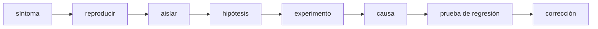
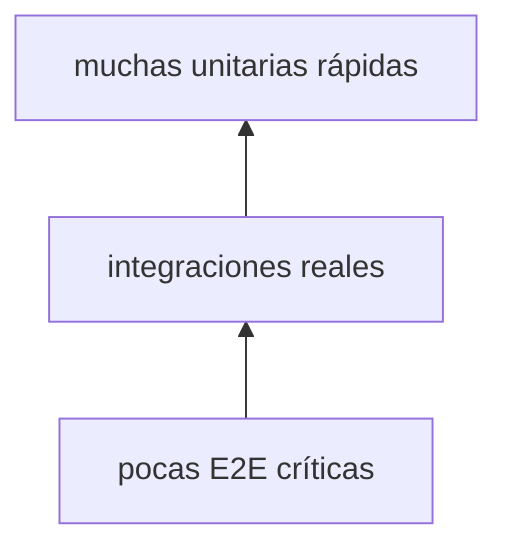
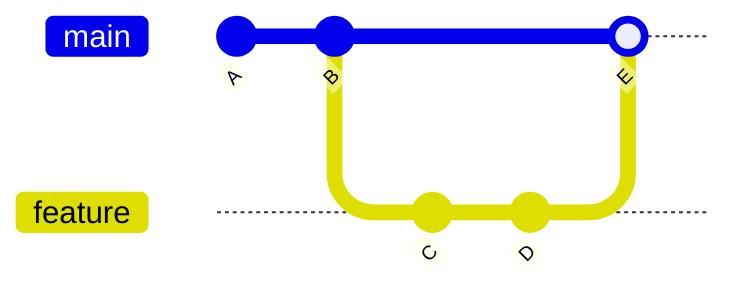
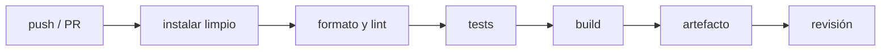

# Módulo 5: Testing, depuración, Git y CI


## Aprende construyendo

### Tema 1: Depurar con evidencia, no con cambios aleatorios

Ejecuta node --version para comprobar el entorno antes de continuar. **Evidencia de aprendizaje:** conserva la salida y explica qué verificaste.

#### Paso 1 · Objetivo y preparación
Al finalizar podrás investigar y mejorar un proyecto desde cero. Prerrequisitos: Git, terminal, editor y un lenguaje instalado. Verifica git --version.

#### Paso 2 · Contexto y caso real
En un caso real, un bug de entregas debe reproducirse, aislarse y corregirse sin perder historial ni introducir una regresión.

#### Paso 3 · Teoría, modelo mental y analogía
Depurar significa observar, formular hipótesis, cambiar una variable y medir. Las pruebas unitarias, integración y extremo a extremo cubren preguntas distintas. Git registra decisiones y CI automatiza controles. La analogía es una investigación: evidencia antes de conclusión, y una bitácora para que otra persona repita el análisis.

#### Paso 4 · Demostración guiada desde cero
Parte de una carpeta vacía:
```bash
mkdir ejemplo-fundamentos-m5
cd ejemplo-fundamentos-m5
git init
printf "ok\n" > README.md
git add README.md
git commit -m "inicio"
git log --oneline
```
Crea src/bug.txt con un caso reproducible y documenta la hipótesis.

#### Paso 5 · Práctica guiada
Pista: introduce deliberadamente una línea incorrecta para provocar un fallo deliberado de prueba o comando; usa git diff y el log para diagnosticar y corregir. Resultado esperado: historial claro y verificación verde.

#### Paso 6 · Práctica independiente
Añade una prueba automatizada, un lint, una revisión simulada y un workflow CI que ejecute los controles.

#### Paso 7 · Cierre y evidencia
Guarda commits, salida de CI y diagnóstico; como siguiente paso estudia despliegue. Errores comunes: editar sin reproducir, commits gigantes, ignorar fallos intermitentes y confiar solo en cobertura. Fuentes oficiales: https://git-scm.com/book/es/v2 y https://docs.github.com/actions.
**¿Por qué es importante?** Porque la calidad es un proceso observable, no una impresión subjetiva.
**Evidencia de aprendizaje:** entrega historial, prueba, fallo corregido y checklist de revisión.
**Conceptos clave:** síntoma, causa, reproducción, hipótesis, experimento, debugger, breakpoint, stack trace, log y regresión.

Un síntoma observable —“el stock queda negativo”— no identifica automáticamente la causa. Depurar consiste en reducir incertidumbre. Primero captura entrada, salida, versión y pasos. Después encuentra la reproducción mínima. Formula una hipótesis que pueda resultar falsa y cambia una sola variable.

```python
def retirar(stock, cantidad):
    if cantidad > stock:
        raise ValueError("Stock insuficiente")
    return stock - cantidad
```

Si `retirar(0, 0)` se considera válido, el resultado es cero. Si `cantidad=-2`, devuelve stock mayor: falta una precondición. El mensaje “algo está mal” no ayuda; el caso `retirar(5, -2) → error esperado` sí.

Lee el stack trace desde el tipo de error y la primera línea de tu código, no solo la última salida. Coloca un breakpoint antes de la decisión, inspecciona valores y avanza una instrucción. Los logs deben registrar evento y contexto útil sin secretos:

```python
logger.info("retirada_solicitada", extra={"sku": sku, "cantidad": cantidad})
```

Evita `print("aquí")` repetido: no expresa hipótesis ni estructura. Al corregir, crea una prueba que falle con la versión defectuosa y pase con la corrección. Así el conocimiento queda automatizado.

**Analogía:** depurar es investigación científica: reproducir, observar, plantear hipótesis, experimentar y conservar evidencia. Cambiar varias cosas equivale a alterar temperatura, presión y material a la vez.

**¿Por qué es importante?** La mayor parte del mantenimiento ocurre sobre comportamientos inesperados. Un proceso disciplinado reduce tiempo y evita “arreglos” que ocultan síntomas.

**Casos de uso reales:** errores de producción, consultas vacías, condiciones de carrera, datos corruptos y fallos dependientes de configuración.

**Diagrama:**



#### Construcción RutaFlow: corregir con una hipótesis falsable

Crea `rutaflow-fundamentos/17-debug/src/stock.py` y `tests/test_stock.py`. Reproduce `retirar(5, -2)` y escribe primero la expectativa de error. Ejecuta `python -m pytest -q`; la prueba debe fallar porque el stock aumenta. Coloca un breakpoint en la condición, inspecciona `stock` y `cantidad`, valida `cantidad > 0` y repite hasta obtener verde.

Provoca después un error dentro de tres funciones y lee el stack trace desde el tipo hasta la primera línea propia. Como modificación, añade un log estructurado con SKU sin incluir destinatario ni token. RutaFlow conserva el caso como regresión; agregar prints o cambiar varias condiciones simultáneamente no demuestra cuál era la causa.

### Tema 2: Pruebas con propósito y niveles adecuados

Ejecuta node --version para comprobar el entorno antes de continuar. **Evidencia de aprendizaje:** conserva la salida y explica qué verificaste.

#### Paso 1 · Objetivo y preparación
Al finalizar podrás investigar y mejorar un proyecto desde cero. Prerrequisitos: Git, terminal, editor y un lenguaje instalado. Verifica git --version.

#### Paso 2 · Contexto y caso real
En un caso real, un bug de entregas debe reproducirse, aislarse y corregirse sin perder historial ni introducir una regresión.

#### Paso 3 · Teoría, modelo mental y analogía
Depurar significa observar, formular hipótesis, cambiar una variable y medir. Las pruebas unitarias, integración y extremo a extremo cubren preguntas distintas. Git registra decisiones y CI automatiza controles. La analogía es una investigación: evidencia antes de conclusión, y una bitácora para que otra persona repita el análisis.

#### Paso 4 · Demostración guiada desde cero
Parte de una carpeta vacía:
```bash
mkdir ejemplo-fundamentos-m5
cd ejemplo-fundamentos-m5
git init
printf "ok\n" > README.md
git add README.md
git commit -m "inicio"
git log --oneline
```
Crea src/bug.txt con un caso reproducible y documenta la hipótesis.

#### Paso 5 · Práctica guiada
Pista: introduce deliberadamente una línea incorrecta para provocar un fallo deliberado de prueba o comando; usa git diff y el log para diagnosticar y corregir. Resultado esperado: historial claro y verificación verde.

#### Paso 6 · Práctica independiente
Añade una prueba automatizada, un lint, una revisión simulada y un workflow CI que ejecute los controles.

#### Paso 7 · Cierre y evidencia
Guarda commits, salida de CI y diagnóstico; como siguiente paso estudia despliegue. Errores comunes: editar sin reproducir, commits gigantes, ignorar fallos intermitentes y confiar solo en cobertura. Fuentes oficiales: https://git-scm.com/book/es/v2 y https://docs.github.com/actions.
**¿Por qué es importante?** Porque la calidad es un proceso observable, no una impresión subjetiva.
**Evidencia de aprendizaje:** entrega historial, prueba, fallo corregido y checklist de revisión.
**Conceptos clave:** prueba unitaria, integración, end-to-end, arrange-act-assert, fixture, fake, stub, mock, determinismo, cobertura y regresión.

Una prueba es evidencia ejecutable de comportamiento. Una unidad prueba una pieza aislada y rápida; integración comprueba colaboración real —por ejemplo repositorio y SQLite—; E2E atraviesa el sistema desde interfaz hasta persistencia. No todo debe ser E2E ni todo debe simularse.

```python
import pytest
from inventario import retirar

def test_retirar_descuenta_stock():
    resultado = retirar(stock=5, cantidad=2)
    assert resultado == 3

def test_retirar_rechaza_cantidad_negativa():
    with pytest.raises(ValueError, match="positiva"):
        retirar(stock=5, cantidad=-2)
```

La estructura es Arrange (datos), Act (operación) y Assert (resultado). El nombre comunica regla. Prueba comportamiento público, no detalles internos, para permitir refactorizar.

Una integración SQLite debe usar una base temporal por prueba y migraciones reales. Un fake implementa comportamiento simplificado; stub devuelve respuestas preparadas; mock verifica interacción. Usa dobles en límites lentos o no deterministas, no para simular toda tu propia aplicación.

Cobertura indica qué líneas/ramas se ejecutaron, no si las afirmaciones son buenas. Una prueba que llama funciones sin comprobar nada aumenta cobertura sin confianza. Mutation testing evalúa si pequeñas alteraciones son detectadas. Prioriza riesgos: dinero, permisos, integridad y casos frontera.

Evita tiempo y aleatoriedad no controlados. Inyecta reloj o semilla. Una prueba que falla ocasionalmente destruye confianza y debe tratarse como defecto.

**Analogía:** pruebas unitarias inspeccionan piezas; integración comprueba conexiones; E2E conduce el vehículo. Inspeccionar solo tornillos no demuestra que el automóvil frene.

**¿Por qué es importante?** Una suite bien diseñada permite cambiar código con retroalimentación rápida y convierte requisitos en ejemplos verificables.

**Casos de uso reales:** regresiones, migraciones, autorización, contratos API, cálculos y flujos críticos.

**Diagrama:**



#### Construcción RutaFlow: una prueba por frontera

En `rutaflow-fundamentos/18-testing/src/tarifas.py`, separa la regla pura de un repositorio SQLite. Crea `tests/test_tarifas.py` para límites y `tests/test_repositorio.py` con base temporal y migración real. Ejecuta `python -m pytest -q`; el resultado esperado distingue pruebas rápidas de regla y una integración que persiste/recupera decimales.

Congela una fecha mediante parámetro y semilla en vez de usar reloj/azar global. Elimina una aserción para comprobar que cobertura puede permanecer mientras confianza cae; restáurala y muta `>=` por `>` para verificar que el límite detecta el defecto. Como modificación, escribe un fake del puerto de mapas y justifica por qué no mockeas objetos de dominio. RutaFlow reserva E2E para recorridos críticos, no para cada combinación.

### Tema 3: Git como historial de decisiones y colaboración

Ejecuta node --version para comprobar el entorno antes de continuar. **Evidencia de aprendizaje:** conserva la salida y explica qué verificaste.

#### Paso 1 · Objetivo y preparación
Al finalizar podrás investigar y mejorar un proyecto desde cero. Prerrequisitos: Git, terminal, editor y un lenguaje instalado. Verifica git --version.

#### Paso 2 · Contexto y caso real
En un caso real, un bug de entregas debe reproducirse, aislarse y corregirse sin perder historial ni introducir una regresión.

#### Paso 3 · Teoría, modelo mental y analogía
Depurar significa observar, formular hipótesis, cambiar una variable y medir. Las pruebas unitarias, integración y extremo a extremo cubren preguntas distintas. Git registra decisiones y CI automatiza controles. La analogía es una investigación: evidencia antes de conclusión, y una bitácora para que otra persona repita el análisis.

#### Paso 4 · Demostración guiada desde cero
Parte de una carpeta vacía:
```bash
mkdir ejemplo-fundamentos-m5
cd ejemplo-fundamentos-m5
git init
printf "ok\n" > README.md
git add README.md
git commit -m "inicio"
git log --oneline
```
Crea src/bug.txt con un caso reproducible y documenta la hipótesis.

#### Paso 5 · Práctica guiada
Pista: introduce deliberadamente una línea incorrecta para provocar un fallo deliberado de prueba o comando; usa git diff y el log para diagnosticar y corregir. Resultado esperado: historial claro y verificación verde.

#### Paso 6 · Práctica independiente
Añade una prueba automatizada, un lint, una revisión simulada y un workflow CI que ejecute los controles.

#### Paso 7 · Cierre y evidencia
Guarda commits, salida de CI y diagnóstico; como siguiente paso estudia despliegue. Errores comunes: editar sin reproducir, commits gigantes, ignorar fallos intermitentes y confiar solo en cobertura. Fuentes oficiales: https://git-scm.com/book/es/v2 y https://docs.github.com/actions.
**¿Por qué es importante?** Porque la calidad es un proceso observable, no una impresión subjetiva.
**Evidencia de aprendizaje:** entrega historial, prueba, fallo corregido y checklist de revisión.
**Conceptos clave:** repositorio, commit, diff, branch, merge, conflicto, remoto, pull request, revisión y trazabilidad.

Git almacena snapshots conectados. Un commit profesional representa una intención coherente y explica por qué. Antes de confirmar revisa:

```bash
git status
git diff
git add src/inventario.py tests/test_inventario.py
git commit -m "Rechazar retiradas con cantidad no positiva"
```

No uses `git add .` automáticamente cuando hay archivos no revisados. Un commit con código y prueba de regresión cuenta una historia completa. Evita mensajes “cambios” o “fix”.

Una rama permite trabajar sin alterar la línea principal. `merge` combina historias. Un conflicto no significa que Git esté roto: dos cambios afectan la misma región y una persona debe decidir el resultado preservando intenciones.

```bash
git switch -c fix/cantidad-negativa
# editar y probar
git commit -am "Rechazar cantidades negativas"
git switch main
git merge fix/cantidad-negativa
```

En conflicto, lee marcadores, comprende ambos cambios, edita una versión coherente, ejecuta pruebas y recién entonces agrega/resuelve. No elijas “ours/theirs” sin entender.

Una pull request comunica contexto, riesgos, pruebas y capturas/evidencia. La revisión busca corrección, diseño, seguridad, pruebas y mantenibilidad; no preferencias personales ya automatizables por formatter. Comentarios deben explicar impacto y sugerir dirección respetuosa.

**Analogía:** Git es el cuaderno de laboratorio; cada commit registra un experimento reproducible. Una PR es revisión por pares antes de incorporar resultados al conocimiento compartido.

**¿Por qué es importante?** Trazabilidad permite entender decisiones, revertir cambios, investigar defectos y colaborar sin sobrescribir trabajo.

**Casos de uso reales:** desarrollo de features, hotfixes, auditoría, releases, revisión y contribución open source.

**Diagrama:**



#### Construcción RutaFlow: historial que explica el arreglo

En `rutaflow-fundamentos/19-git/`, inicializa un repositorio de práctica con `src/regla.py` y `tests/test_regla.py`. Crea la rama `fix/cantidad-negativa`, añade primero la reproducción y luego la corrección en un commit coherente. Ejecuta `git status`, `git diff --staged` y `python -m pytest -q` antes de confirmar; el resultado esperado es un historial donde el commit explica problema y evidencia.

Modifica la misma línea de README en main y feature para provocar un conflicto; lee marcadores, preserva ambas intenciones y vuelve a probar antes del merge. Como modificación, redacta `pull-request.md` con contexto, riesgo y verificación. Este repositorio es local y seguro para practicar: RutaFlow real no debe reescribirse ni resolver conflictos eligiendo un lado sin comprenderlo.

### Tema 4: Calidad estática, revisión e integración continua

Ejecuta node --version para comprobar el entorno antes de continuar. **Evidencia de aprendizaje:** conserva la salida y explica qué verificaste.

#### Paso 1 · Objetivo y preparación
Al finalizar podrás investigar y mejorar un proyecto desde cero. Prerrequisitos: Git, terminal, editor y un lenguaje instalado. Verifica git --version.

#### Paso 2 · Contexto y caso real
En un caso real, un bug de entregas debe reproducirse, aislarse y corregirse sin perder historial ni introducir una regresión.

#### Paso 3 · Teoría, modelo mental y analogía
Depurar significa observar, formular hipótesis, cambiar una variable y medir. Las pruebas unitarias, integración y extremo a extremo cubren preguntas distintas. Git registra decisiones y CI automatiza controles. La analogía es una investigación: evidencia antes de conclusión, y una bitácora para que otra persona repita el análisis.

#### Paso 4 · Demostración guiada desde cero
Parte de una carpeta vacía:
```bash
mkdir ejemplo-fundamentos-m5
cd ejemplo-fundamentos-m5
git init
printf "ok\n" > README.md
git add README.md
git commit -m "inicio"
git log --oneline
```
Crea src/bug.txt con un caso reproducible y documenta la hipótesis.

#### Paso 5 · Práctica guiada
Pista: introduce deliberadamente una línea incorrecta para provocar un fallo deliberado de prueba o comando; usa git diff y el log para diagnosticar y corregir. Resultado esperado: historial claro y verificación verde.

#### Paso 6 · Práctica independiente
Añade una prueba automatizada, un lint, una revisión simulada y un workflow CI que ejecute los controles.

#### Paso 7 · Cierre y evidencia
Guarda commits, salida de CI y diagnóstico; como siguiente paso estudia despliegue. Errores comunes: editar sin reproducir, commits gigantes, ignorar fallos intermitentes y confiar solo en cobertura. Fuentes oficiales: https://git-scm.com/book/es/v2 y https://docs.github.com/actions.
**¿Por qué es importante?** Porque la calidad es un proceso observable, no una impresión subjetiva.
**Evidencia de aprendizaje:** entrega historial, prueba, fallo corregido y checklist de revisión.
**Conceptos clave:** formatter, linter, análisis estático, type checking, pipeline, job, step, artefacto, CI, feedback y calidad continua.

Herramientas estáticas detectan problemas sin ejecutar todos los caminos. Un formatter elimina discusiones de estilo; un linter encuentra patrones riesgosos; type checking detecta incompatibilidades; análisis de dependencias descubre vulnerabilidades conocidas. Ninguna sustituye pruebas.

```yaml
name: calidad
on:
  pull_request:
  push:
    branches: [main]

jobs:
  test:
    runs-on: ubuntu-latest
    steps:
      - uses: actions/checkout@v4
      - uses: actions/setup-python@v5
        with:
          python-version: '3.12'
      - run: python -m pip install pytest ruff
      - run: ruff check .
      - run: pytest -q
```

CI reconstruye el proyecto en un entorno limpio. Esto descubre dependencias globales o archivos olvidados. Fija versiones importantes, usa instalación reproducible y falla con mensajes accionables. Mantén el pipeline rápido: controles baratos primero, E2E después, despliegue solo si todo pasa.

No “arregles” un pipeline desactivando la prueba. Reproduce localmente, identifica si el defecto está en producto, prueba o entorno. Un control flaky debe corregirse o aislarse con propietario y plazo, no ignorarse indefinidamente.

La revisión humana se enfoca en lo que automatización no comprende bien: requisitos, arquitectura, nombres del dominio, amenazas y trade-offs. CI aporta evidencia, no aprobación moral ni garantía absoluta.

**Analogía:** CI es una línea de inspección repetible para cada cambio; no diseña el producto, pero impide que defectos conocidos avancen silenciosamente.

**¿Por qué es importante?** La retroalimentación temprana reduce coste de corrección y convierte estándares de equipo en controles consistentes.

**Casos de uso reales:** pull requests, releases, actualizaciones de dependencias, múltiples plataformas y despliegues regulados.

**Diagrama:**



#### Construcción RutaFlow: pipeline reproducible

Crea `rutaflow-fundamentos/20-ci/.github/workflows/quality.yml`, `pyproject.toml` y `requirements-dev.txt` con versiones controladas. El workflow instala, ejecuta Ruff y `python -m pytest -q`. Ejecuta localmente los mismos comandos; el resultado esperado es verde sin depender del editor ni paquetes globales.

Introduce una variable no definida para que Ruff falle antes de tests y conserva el mensaje; corrige el código, no desactives la regla. Como modificación, añade caché basada en el archivo de dependencias y publica reportes solo tras pruebas. RutaFlow ordena controles baratos primero y mantiene revisión humana para requisitos, arquitectura y amenazas; CI no garantiza ausencia de defectos.


## Construcción guiada del capítulo

### Proyecto 5: convertir el inventario en un repositorio confiable

Trabaja en una rama `quality/test-suite`:

1. Extrae reglas puras de inventario para pruebas unitarias.
2. Configura `pytest` y crea fixtures.
3. Añade casos normales, límites, inválidos y regresiones.
4. Crea integraciones con SQLite temporal y migraciones reales.
5. Prueba rollback e importación corrupta.
6. Configura Ruff como formatter/linter o equivalente documentado.
7. Añade workflow CI para lint y pruebas.
8. Provoca una prueba fallida y conserva captura/log del pipeline rojo.
9. Corrige y conserva evidencia verde.
10. Simula una PR con descripción, riesgos, checklist y revisión de un cambio.
11. Crea conflicto deliberado en README y resuélvelo preservando ambas intenciones.

**Verificación:** `pytest` funciona en clon limpio; ninguna prueba comparte base; CI falla ante regresión; la corrección incluye prueba; historial contiene commits pequeños y explicativos.

**Errores comunes y soluciones**

- Pruebas dependientes del orden: aísla estado.
- Mockear SQLite: usa base temporal para integración.
- Cobertura como meta única: revisa aserciones y riesgos.
- Commits gigantes: separa intenciones.
- CI distinto al entorno local: documenta versiones y comandos idénticos.
