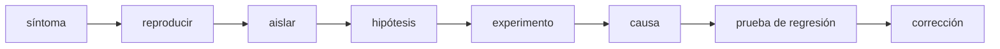
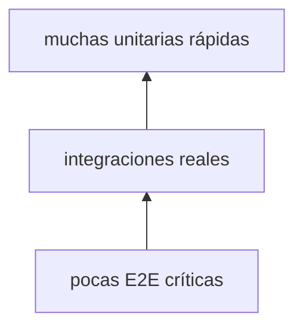
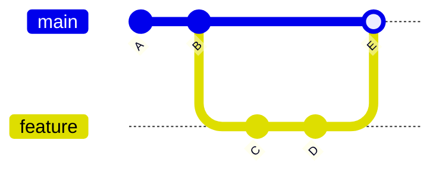
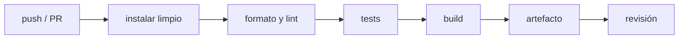

# Módulo 5: Testing, depuración, Git y CI


## Aprende construyendo

### Tema 1: Depurar con evidencia, no con cambios aleatorios

#### Paso 1 · Objetivo y preparación
Al finalizar vas a reproducir un bug real de `listar_pendientes` en el proyecto Fundamentos, vas a escribir tu hipótesis en una línea ANTES de tocar el código, y vas a distinguir un cambio que corrige la causa real de un cambio que solo parece arreglar algo. **Prerrequisitos:** `tareas.py` del Módulo 1 (con `contar_pendientes`) y la persistencia SQLite del Módulo 4; comprueba `python3 --version`.

#### Paso 2 · Contexto y caso real
El proyecto integrador Fundamentos que vas a construir en este track ya guarda tareas en SQLite desde el Módulo 4. Un reporte de "pendientes" que en realidad muestra tareas ya completadas —exactamente el bug de esta sección— no se arregla cambiando cosas al azar hasta que "parezca" funcionar: se reproduce con el caso mínimo, se formula una hipótesis concreta y se cambia una sola cosa para confirmarla.

#### Paso 3 · Teoría, modelo mental y analogía
Depurar con evidencia significa tres cosas en orden: reproducir el fallo con el caso más pequeño posible, escribir una hipótesis verificable sobre la causa ANTES de cambiar nada, y modificar una sola variable por intento para saber con certeza qué fue lo que corrigió (o no corrigió) el problema. Un cambio que "podría ayudar" pero no ataca la hipótesis es una pista falsa: puede incluso parecer una mejora y aun así dejar el bug intacto. La analogía es la de un perito: no reordena la escena antes de fotografiarla, la documenta, propone una explicación y prueba solo esa explicación.

#### Paso 4 · Demostración guiada desde cero
Partí de una carpeta vacía y reproducí un bug real de filtrado de tareas:
```bash
mkdir depuracion-tareas
cd depuracion-tareas
python3 -m venv .venv
source .venv/bin/activate  # Windows PowerShell: .venv\Scripts\Activate.ps1
```
Guardá `tareas.py` con un defecto deliberado: la función promete "pendientes" pero filtra por el estado contrario.

```python
def listar_pendientes(tareas):
    # Defecto: compara contra "hecho" en vez de "pendiente".
    return [t for t in tareas if t["estado"] == "hecho"]

tareas = [
    {"descripcion": "comprar pan", "estado": "pendiente"},
    {"descripcion": "pagar luz", "estado": "hecho"},
    {"descripcion": "llamar al dentista", "estado": "pendiente"},
]
print(listar_pendientes(tareas))
```

Ejecutá `python3 tareas.py`. **Resultado esperado del defecto:** imprime `[{'descripcion': 'pagar luz', 'estado': 'hecho'}]` — la única tarea YA HECHA, justo lo opuesto de lo que el nombre `listar_pendientes` promete. Ese caso de tres tareas es tu reproducción mínima; con ella podés formular la hipótesis por escrito: "la comparación usa 'hecho' donde debería usar 'pendiente'". **Fallo deliberado (pista falsa):** antes de tocar esa línea, probá "arreglarlo" ordenando la lista con `tareas.sort(key=lambda t: t["descripcion"])` antes del `return`. Volvé a ejecutar: el resultado sigue siendo la tarea hecha — ordenar no tocó la condición que causa el bug, así que el síntoma no cambió en absoluto. Recién ahora hacés el único cambio que ataca la hipótesis: `t["estado"] == "pendiente"`. Ejecutá de nuevo: aparecen las dos tareas pendientes, confirmando la hipótesis original.

#### Paso 5 · Práctica guiada
Pista: antes de declarar "arreglado", volvé a correr EXACTAMENTE el mismo caso de tres tareas del Paso 4 y compará la salida con la que esperabas por escrito — si solo "se ve mejor" pero no coincide con tu hipótesis, todavía no terminaste.

#### Paso 6 · Práctica independiente
Elegí una función real de tu propio `tareas.py` (no inventada) que sospeches que tiene un comportamiento incorrecto. Reproducí el caso mínimo que lo muestra, escribí la hipótesis en una línea ANTES de cambiar código, hacé un solo cambio y confirmá ejecutando de nuevo el mismo caso.

#### Paso 7 · Cierre y evidencia
Entregá la reproducción del bug de `listar_pendientes`, la hipótesis escrita antes de corregir, la pista falsa que no cambió el síntoma y la corrección real confirmada; como siguiente paso, en el Tema 2 vas a convertir ese mismo caso mínimo en una prueba automatizada para que nadie tenga que reproducirlo a mano otra vez. Errores comunes: cambiar varias cosas a la vez antes de confirmar cuál funcionó; aceptar un cambio como "arreglo" sin volver a ejecutar el caso que fallaba; depurar sin escribir la hipótesis, lo que impide saber después qué se estaba probando. Fuentes oficiales: https://docs.python.org/es/3/library/pdb.html y https://docs.python.org/es/3/howto/logging.html.
**¿Por qué es importante?** Porque sin un caso mínimo reproducible y una hipótesis escrita, "arreglar" un bug es indistinguible de cambiar cosas hasta que el síntoma visible desaparezca, aunque la causa real siga ahí.
**Evidencia de aprendizaje:** entrega el caso mínimo reproducido, la hipótesis escrita, la pista falsa descartada con su salida y la corrección confirmada.

**Cuándo NO usar:** No cambies varias líneas a la vez "a ver si ahora funciona"; si el síntoma desaparece no vas a saber cuál cambio fue. No aceptes un cambio como corrección sin volver a ejecutar el caso mínimo que fallaba. No depures a fuerza de `print()` disperso sin una hipótesis escrita: perdés la capacidad de saber qué estabas probando.

#### Profundización · Diseño: Depuración en Fundamentos CLI sin salida

**Escenario real:** Ejecutas `python fundamentos.py tareas listar` y nada sucede. ¿Falla silenciosa, timeout, espera indefinida?

**Tu tarea (sin mirar solución):**

1. **Print debugging:** Agrega `print()` antes y después de cada función clave. ¿Dónde se detiene?
2. **Debugger interactivo:** Usa `import pdb; pdb.set_trace()`. ¿Ventajas vs `print()`?
3. **Evidencia:** Escribe un script que confirme dónde falla.
4. **Producción:** ¿Logging (permanente) vs `print()` (transitorio)?

**Escribe tu respuesta:**

```
Función donde se detiene: _________
Print vs pdb: _________ (¿cuál usas?)
Logs en producción: _________
```

[SOLUCIÓN — Lee solo después de intentar]

> **Respuesta esperada:**
> Prints en dev para ritmo rápido. pdb para inspeccionar estado. Logging permanente en producción, no prints.

**Conceptos clave:** síntoma, causa, reproducción, hipótesis, experimento, debugger, breakpoint, stack trace, log y regresión.

Un síntoma observable —“el stock queda negativo”— no identifica automáticamente la causa. Depurar consiste en reducir incertidumbre. Primero captura entrada, salida, versión y pasos. Después encuentra la reproducción mínima. Formula una hipótesis que pueda resultar falsa y cambia una sola variable.

```python
def retirar(stock, cantidad):
    if cantidad > stock:
        raise ValueError("Stock insuficiente")
    return stock - cantidad
```

Si `retirar(0, 0)` se considera válido, el resultado es cero. Si `cantidad=-2`, devuelve stock mayor: falta una precondición. El mensaje “algo está mal” no ayuda; el caso `retirar(5, -2) → error esperado` sí.

Lee el stack trace desde el tipo de error y la primera línea de tu código, no solo la última salida. Coloca un breakpoint antes de la decisión, inspecciona valores y avanza una instrucción. Los logs deben registrar evento y contexto útil sin secretos:

```python
logger.info("retirada_solicitada", extra={"sku": sku, "cantidad": cantidad})
```

Evita `print("aquí")` repetido: no expresa hipótesis ni estructura. Al corregir, crea una prueba que falle con la versión defectuosa y pase con la corrección. Así el conocimiento queda automatizado.

**Analogía:** depurar es investigación científica: reproducir, observar, plantear hipótesis, experimentar y conservar evidencia. Cambiar varias cosas equivale a alterar temperatura, presión y material a la vez.

**¿Por qué es importante?** La mayor parte del mantenimiento ocurre sobre comportamientos inesperados. Un proceso disciplinado reduce tiempo y evita “arreglos” que ocultan síntomas.

**Casos de uso reales:** errores de producción, consultas vacías, condiciones de carrera, datos corruptos y fallos dependientes de configuración.

**Diagrama:**


```mermaid
flowchart LR
    S["síntoma"] --> R["reproducir"] --> I["aislar"] --> H["hipótesis"]
    H --> E["experimento"] --> C["causa"] --> T["prueba de regresión"] --> F["corrección"]
```

### Tema 2: Pruebas con propósito y niveles adecuados

#### Paso 1 · Objetivo y preparación
Al finalizar vas a escribir una prueba unitaria real para `contar_pendientes` y una prueba de integración real contra SQLite, y vas a comprobar en carne propia por qué una prueba unitaria sobresimulada (fake) puede seguir en verde aunque la consulta SQL real esté rota. **Prerrequisitos:** `tareas.py` del Módulo 1 y la base SQLite del Módulo 4; `python3 -m pip install pytest`.

#### Paso 2 · Contexto y caso real
Desde el Módulo 4, el proyecto Fundamentos no solo cuenta pendientes en memoria: también los cuenta consultando SQLite con `contar_pendientes_bd`. Si esa consulta SQL se rompe —un typo en el valor de `estado`, por ejemplo—, una prueba unitaria que reemplaza la base de datos por un objeto falso puede no detectarlo nunca, porque nunca llegó a ejecutar la consulta real.

#### Paso 3 · Teoría, modelo mental y analogía
Una prueba unitaria aísla una pieza pequeña y rápida: en este caso, `contar_pendientes(tareas)` operando sobre una lista en memoria, sin tocar disco. Una prueba de integración comprueba la colaboración real entre piezas: la misma regla de negocio, pero ejecutada contra una base SQLite real, con la consulta SQL real. Un doble de prueba (fake, stub o mock) reemplaza una pieza lenta o no determinista; el riesgo es que, si el doble es demasiado simple, deja de importar qué hace la pieza real que reemplaza — la prueba sigue en verde aunque esa pieza esté rota. La analogía: un simulador de vuelo que ignora el viento no te prepara para aterrizar con viento real, aunque todas sus lecciones salgan perfectas.

#### Paso 4 · Demostración guiada desde cero
Partí de una carpeta vacía y construí las dos capas que el Módulo 4 ya dejó instaladas: la función pura y la consulta SQL.
```bash
mkdir pruebas-tareas
cd pruebas-tareas
python3 -m venv .venv
source .venv/bin/activate  # Windows PowerShell: .venv\Scripts\Activate.ps1
python3 -m pip install pytest
mkdir src tests
```
Guardá `src/tareas.py`:
```python
def contar_pendientes(tareas):
    return len([t for t in tareas if t["estado"] == "pendiente"])

def contar_pendientes_bd(conexion):
    cursor = conexion.execute("SELECT COUNT(*) FROM tareas WHERE estado = 'pendiente'")
    return cursor.fetchone()[0]
```
Guardá `tests/test_tareas.py` con una unitaria real y una unitaria "sobresimulada" que usa un doble demasiado simple:
```python
import sqlite3
from src.tareas import contar_pendientes, contar_pendientes_bd

def test_contar_pendientes_unitaria():
    tareas = [{"estado": "pendiente"}, {"estado": "hecho"}, {"estado": "pendiente"}]
    assert contar_pendientes(tareas) == 2

class ConexionFalsa:
    def execute(self, consulta_sql):
        class Cursor:
            def fetchone(self):
                return (2,)  # valor fijo: no ejecuta ninguna consulta real
        return Cursor()

def test_contar_pendientes_bd_con_fake():
    assert contar_pendientes_bd(ConexionFalsa()) == 2
```
Ejecutá `python3 -m pytest -q`. **Resultado esperado:** `2 passed` — ambas pruebas están en verde. **Fallo deliberado:** rompé la consulta real en `src/tareas.py` cambiando `WHERE estado = 'pendiente'` por `WHERE estado = 'completada'` (un valor que no existe) y volvé a correr `pytest -q`: el fake sigue dando `2 passed`, porque `ConexionFalsa.execute` ignora por completo el texto de la consulta y siempre devuelve `(2,)` — la prueba no detecta que la base real ahora devolvería `0`. Agregá entonces una prueba de integración real con SQLite en memoria:
```python
def test_contar_pendientes_bd_integracion():
    conexion = sqlite3.connect(":memory:")
    conexion.execute("CREATE TABLE tareas(estado TEXT)")
    conexion.executemany("INSERT INTO tareas VALUES (?)", [("pendiente",), ("hecho",), ("pendiente",)])
    assert contar_pendientes_bd(conexion) == 2
```
Con la consulta rota, esta prueba de integración falla con `assert 0 == 2` — ahí sí se detecta el defecto. Revertí el `WHERE` a `'pendiente'` y confirmá que las tres pruebas pasan.

#### Paso 5 · Práctica guiada
Pista: antes de confiar en que una prueba "cubre" la base de datos, preguntate si ejecutó la consulta SQL real contra datos reales, o si solo llamó a una función que la rodea con un doble que inventa la respuesta.

#### Paso 6 · Práctica independiente
Agregá una prueba de integración real (con `sqlite3.connect(":memory:")`) para otra función de tu capa de almacenamiento, y una prueba unitaria para la misma regla que no toque la base. Rompé a propósito la consulta SQL real y confirmá cuál de las dos pruebas lo detecta.

#### Paso 7 · Cierre y evidencia
Entregá la prueba unitaria de `contar_pendientes`, la prueba con el fake que no detectó la consulta rota, y la prueba de integración que sí la detectó; como siguiente paso, en el Tema 3 vas a usar Git para dejar registrado POR QUÉ agregaste esa prueba de integración, no solo que la agregaste. Errores comunes: confiar en una prueba unitaria para cubrir la base de datos; usar un doble tan simple que ignora el comportamiento real que debería simular; medir éxito solo por cobertura y no por qué detecta cada prueba. Fuentes oficiales: https://docs.pytest.org/en/stable/ y https://docs.python.org/es/3/library/sqlite3.html.
**¿Por qué es importante?** Porque una suite en verde no garantiza nada por sí sola: garantiza solo lo que sus pruebas realmente ejecutaron, y un doble demasiado simple puede ejecutar menos de lo que parece.
**Evidencia de aprendizaje:** entrega la unitaria real, el fake que no detectó la consulta rota, y la integración que sí la detectó, con ambas corridas de `pytest -q`.

**Cuándo NO usar:** No reemplaces tu base de datos con un doble en la única prueba que debería validar tu consulta real; usalo solo donde la base sea lenta o no determinista y haya otra prueba de integración cubriendo lo real. No escribas pruebas solo para subir cobertura sin una aserción que realmente pueda fallar. No uses E2E para validar una regla que una unitaria ya prueba más rápido.

#### Profundización · Diseño: Pirámide de test para CLI Fundamentos

**Escenario real:** Comando `tarea crear "comprar leche"`. ¿Unit test, integración, E2E?

**Tu tarea (sin mirar solución):**

1. **Unitaria:** Prueba la función `parse_comando()` sin BD, sin CLI. ¿Qué hace?
2. **Integración:** Crea una tarea en BD SQLite real. ¿Qué necesitas?
3. **E2E:** Ejecutas CLI exactamente como usuario. ¿Qué verificas?
4. **Proporción:** ¿70% unit, 20% integ, 10% e2e? Justifica.

**Escribe tu respuesta:**

```
Unit (sin BD): _________
Integración (con BD): _________
E2E (CLI completo): _________
Proporción y por qué: _________
```

[SOLUCIÓN — Lee solo después de intentar]

> **Respuesta esperada:**
> Unit: función retorna objeto parsed. Integ: tarea guardada en BD. E2E: comando imprime confirmación. 70/20/10 porque units son rápidos, E2E es lento.

**Conceptos clave:** prueba unitaria, integración, end-to-end, arrange-act-assert, fixture, fake, stub, mock, determinismo, cobertura y regresión.

Una prueba es evidencia ejecutable de comportamiento. Una unidad prueba una pieza aislada y rápida; integración comprueba colaboración real —por ejemplo repositorio y SQLite—; E2E atraviesa el sistema desde interfaz hasta persistencia. No todo debe ser E2E ni todo debe simularse.

```python
import pytest
from inventario import retirar

def test_retirar_descuenta_stock():
    resultado = retirar(stock=5, cantidad=2)
    assert resultado == 3

def test_retirar_rechaza_cantidad_negativa():
    with pytest.raises(ValueError, match="positiva"):
        retirar(stock=5, cantidad=-2)
```

La estructura es Arrange (datos), Act (operación) y Assert (resultado). El nombre comunica regla. Prueba comportamiento público, no detalles internos, para permitir refactorizar.

Una integración SQLite debe usar una base temporal por prueba y migraciones reales. Un fake implementa comportamiento simplificado; stub devuelve respuestas preparadas; mock verifica interacción. Usa dobles en límites lentos o no deterministas, no para simular toda tu propia aplicación.

Cobertura indica qué líneas/ramas se ejecutaron, no si las afirmaciones son buenas. Una prueba que llama funciones sin comprobar nada aumenta cobertura sin confianza. Mutation testing evalúa si pequeñas alteraciones son detectadas. Prioriza riesgos: dinero, permisos, integridad y casos frontera.

Evita tiempo y aleatoriedad no controlados. Inyecta reloj o semilla. Una prueba que falla ocasionalmente destruye confianza y debe tratarse como defecto.

**Analogía:** pruebas unitarias inspeccionan piezas; integración comprueba conexiones; E2E conduce el vehículo. Inspeccionar solo tornillos no demuestra que el automóvil frene.

**¿Por qué es importante?** Una suite bien diseñada permite cambiar código con retroalimentación rápida y convierte requisitos en ejemplos verificables.

**Casos de uso reales:** regresiones, migraciones, autorización, contratos API, cálculos y flujos críticos.

**Diagrama:**


```mermaid
flowchart BT
    E2E["pocas E2E críticas"] --> INT["integraciones reales"] --> UNIT["muchas unitarias rápidas"]
```

### Tema 3: Git como historial de decisiones y colaboración

#### Paso 1 · Objetivo y preparación
Al finalizar vas a comprobar en la práctica por qué un mensaje de commit como "fix" no le sirve a nadie dentro de una semana, y vas a reemplazar ese hábito escribiendo mensajes que expliquen el motivo de un cambio, no solo qué archivo tocaron. **Prerrequisitos:** Git instalado; comprueba `git --version`.

#### Paso 2 · Contexto y caso real
El proyecto integrador Fundamentos acumula commits en `tareas.py` a medida que avanza el track. Si un commit dice solo "fix", dentro de un mes nadie —ni quien lo escribió— puede saber, sin abrir el diff completo, si ese cambio arregló un typo, una regresión de `contar_pendientes` o una migración de SQLite rota.

#### Paso 3 · Teoría, modelo mental y analogía
Git guarda snapshots del proyecto conectados en una línea de commits; cada commit puede tener un mensaje corto y, opcionalmente, un cuerpo más largo. El mensaje corto debería decir QUÉ cambió en modo imperativo ("corrige", no "corregido"); el cuerpo debería decir POR QUÉ, con el contexto que el diff por sí solo no muestra. `git log` solo es útil como historial de decisiones si cada mensaje realmente registra una decisión. La analogía es un cuaderno de laboratorio: anotar solo "experimento 4" no te dice, meses después, qué hipótesis probaba ese experimento ni por qué cambiaste el procedimiento.

#### Paso 4 · Demostración guiada desde cero
Desde una **carpeta vacía**, reproducí el problema de un mensaje de commit inútil y después corregí el hábito:
```bash
mkdir historial-tareas
cd historial-tareas
git init
git config user.name "Estudiante"
git config user.email "estudiante@example.com"
printf 'ESTADO_INICIAL = "pendiente"\n' > tareas.py
git add tareas.py
git commit -m "fix"
git log --oneline
```
**Resultado esperado:** `git log --oneline` muestra una sola línea con el hash y la palabra `fix` — nada más. **Fallo deliberado:** imaginá que pasaron tres semanas y necesitás saber por qué existe ese commit. Ejecutá `git show --stat HEAD`: ves qué archivo cambió, pero ni el mensaje ni el comando te dicen si "fix" arreglaba un typo, una regresión de `contar_pendientes` o algo urgente. El diagnóstico es que el único lugar donde el motivo podía sobrevivir —el mensaje del commit— nunca lo registró; el código ya está ahí, pero el porqué se perdió para siempre. Corregí el hábito con un commit nuevo que sí explica la decisión:
```bash
printf 'ESTADO_INICIAL = "pendiente"  # valor por defecto al crear una tarea sin estado explícito\n' > tareas.py
git add tareas.py
git commit -m "Documenta por qué una tarea nueva arranca en 'pendiente'

Sin este comentario, alguien podía cambiar ESTADO_INICIAL a otro valor
sin saber que contar_pendientes() depende exactamente de ese string."
git log --oneline
```
Ahora `git log --oneline` muestra dos líneas: la vieja `fix` sigue siendo tan inútil como antes (no la reescribimos, porque reescribir historial ya compartido no es seguro), pero la nueva explica QUÉ cambió y POR QUÉ sin necesitar abrir el diff.

#### Paso 5 · Práctica guiada
Pista: leé tu propio `git log --oneline` de los últimos días. Si no podés explicar, solo con el mensaje y sin abrir el diff, por qué se hizo cada commit, ese mensaje no está cumpliendo su función.

#### Paso 6 · Práctica independiente
Elegí 3 commits reales de tu proyecto (de este módulo o de uno anterior) y reescribí sus mensajes como si los fuera a leer alguien dentro de un año: qué cambió y por qué, no solo qué archivo. Si alguno dice "fix", "cambios" o "wip", es tu candidato prioritario.

#### Paso 7 · Cierre y evidencia
Entregá el commit con mensaje inútil del Paso 4, la dificultad real de diagnosticarlo tres semanas después, y el commit de reemplazo con mensaje que explica el motivo; como siguiente paso, en el Tema 4 vas a automatizar en CI los controles de calidad que hasta ahora corriste a mano. Errores comunes: escribir "fix" o "cambios" confiando en que "ya se entiende"; mezclar en un commit un refactor con una corrección de bug, lo que oscurece cuál de las dos cosas motivó el cambio; reescribir con `git commit --amend` un commit que ya compartiste con otra persona. Fuentes oficiales: https://git-scm.com/book/es/v2 y https://docs.github.com/es/pull-requests.
**¿Por qué es importante?** Porque el código muestra QUÉ existe hoy, pero solo el historial de commits puede explicar POR QUÉ se llegó hasta ahí — y esa información se pierde para siempre si el mensaje no la registra.
**Evidencia de aprendizaje:** entrega el commit "fix" original, la explicación de por qué no alcanza, y el commit de reemplazo con mensaje que sí comunica la decisión.

**Cuándo NO usar:** No hagas rebase ni `commit --amend` en ramas ya compartidas; reescribís historia que otra persona ya tiene clonada. No mezcles en un commit un refactor con una corrección de bug; separá ambas intenciones. No confíes en que el nombre del archivo modificado reemplaza al mensaje: un `git log --stat` nunca explica el motivo.

#### Profundización · Diseño: Git para diagnosticar un bug en Fundamentos

**Escenario real:** Hace 3 commits se cambió `fundamentos.py`. Comando `tareas` falla. ¿Qué cambió exactamente?

**Tu tarea (sin mirar solución):**

1. **Log:** `git log fundamentos.py`. ¿Qué muestra? ¿Cómo filtras por fecha/mensaje?
2. **Diff:** `git diff COMMIT_A COMMIT_B -- fundamentos.py`. ¿Qué líneas cambiaron?
3. **Blame:** `git blame fundamentos.py | grep "tarea_crear"`. ¿Quién y cuándo cambió esa línea?
4. **Revert:** Si encuentras commit culpable, ¿usas `git revert` o `git reset --hard`? ¿Por qué?

**Escribe tu respuesta:**

```
Ver log de archivo: _________
Ver cambios entre commits: _________
¿Revert crea nuevo commit? _________
Cuándo usas reset vs revert: _________
```

[SOLUCIÓN — Lee solo después de intentar]

> **Respuesta esperada:**
> `git log -- archivo.py`, `git diff A B -- archivo.py`, revert sí (seguro en rama compartida), reset solo local.

**Evidencia de aprendizaje:** entrega historial, prueba, fallo corregido y checklist de revisión.
**Conceptos clave:** repositorio, commit, diff, branch, merge, conflicto, remoto, pull request, revisión y trazabilidad.

Git almacena snapshots conectados. Un commit profesional representa una intención coherente y explica por qué. Antes de confirmar revisa:

```bash
git status
git diff
git add src/inventario.py tests/test_inventario.py
git commit -m "Rechazar retiradas con cantidad no positiva"
```

No uses `git add .` automáticamente cuando hay archivos no revisados. Un commit con código y prueba de regresión cuenta una historia completa. Evita mensajes “cambios” o “fix”.

Una rama permite trabajar sin alterar la línea principal. `merge` combina historias. Un conflicto no significa que Git esté roto: dos cambios afectan la misma región y una persona debe decidir el resultado preservando intenciones.

```bash
git switch -c fix/cantidad-negativa
# editar y probar
git commit -am "Rechazar cantidades negativas"
git switch main
git merge fix/cantidad-negativa
```

En conflicto, lee marcadores, comprende ambos cambios, edita una versión coherente, ejecuta pruebas y recién entonces agrega/resuelve. No elijas “ours/theirs” sin entender.

Una pull request comunica contexto, riesgos, pruebas y capturas/evidencia. La revisión busca corrección, diseño, seguridad, pruebas y mantenibilidad; no preferencias personales ya automatizables por formatter. Comentarios deben explicar impacto y sugerir dirección respetuosa.

**Analogía:** Git es el cuaderno de laboratorio; cada commit registra un experimento reproducible. Una PR es revisión por pares antes de incorporar resultados al conocimiento compartido.

**¿Por qué es importante?** Trazabilidad permite entender decisiones, revertir cambios, investigar defectos y colaborar sin sobrescribir trabajo.

**Casos de uso reales:** desarrollo de features, hotfixes, auditoría, releases, revisión y contribución open source.

**Diagrama:**


```mermaid
gitGraph
    commit id: "A"
    commit id: "B"
    branch feature
    commit id: "C"
    commit id: "D"
    checkout main
    merge feature id: "E"
```

### Tema 4: Calidad estática, revisión e integración continua

#### Paso 1 · Objetivo y preparación
Al finalizar vas a usar Ruff para detectar un error antes de ejecutar el código, y vas a reproducir en carne propia la trampa de "funciona en mi máquina": una prueba que pasa localmente solo porque depende de un archivo que quedó de una corrida manual anterior, y que falla en cuanto corre en un entorno limpio como el que usa CI. **Prerrequisitos:** `tareas.py` del Módulo 1; `python3 -m pip install ruff pytest`.

#### Paso 2 · Contexto y caso real
El proyecto Fundamentos ya tiene pruebas (Tema 2) e historial con buenos mensajes (Tema 3). Lo único que falta es que esos controles corran solos en cada cambio, en un entorno limpio, no solo en la máquina de quien escribió el código — porque "en mi máquina pasa" y "va a pasar en CI" no son la misma afirmación.

#### Paso 3 · Teoría, modelo mental y analogía
El análisis estático detecta problemas SIN ejecutar el programa: un linter como Ruff encuentra imports sin usar, variables no definidas y patrones riesgosos leyendo el código, no corriéndolo. CI (integración continua) ejecuta esos controles —lint, pruebas— automáticamente en un entorno recién creado, con un clon limpio del repositorio: ningún archivo que hayas creado a mano durante una sesión de prueba sobrevive ahí. Por eso una prueba que depende de "algo que ya está en mi carpeta" puede pasar en tu máquina y fallar en CI sin que el código haya cambiado — el entorno es el que cambió. La analogía: ensayar una receta en tu cocina, con ingredientes que ya tenías picados de ayer, no prueba que la receta funcione completa desde cero en otra cocina.

#### Paso 4 · Demostración guiada desde cero
Desde una **carpeta vacía**, reproducí primero un catch de análisis estático y después la trampa de "funciona en mi máquina":
```bash
mkdir calidad-tareas
cd calidad-tareas
python3 -m venv .venv
source .venv/bin/activate  # Windows PowerShell: .venv\Scripts\Activate.ps1
python3 -m pip install ruff pytest
mkdir src tests
```
Guardá `src/tareas.py`:
```python
import os  # defecto: queda sin usar

def contar_pendientes(tareas):
    return len([t for t in tareas if t["estado"] == "pendiente"])
```
Ejecutá `ruff check .` ANTES de correr nada. **Resultado esperado:** Ruff informa `F401 'os' imported but unused`, sin haber ejecutado una sola línea del programa. Quitá el import y confirmá que `ruff check .` ya no reporta nada.

Ahora guardá `tests/test_tareas.py` dependiendo de un archivo que vos mismo vas a crear "a mano", simulando una exploración manual previa:
```bash
printf '[{"estado":"pendiente"},{"estado":"pendiente"},{"estado":"hecho"}]' > tareas_prueba.json
```
```python
import json
from src.tareas import contar_pendientes

def test_contar_pendientes_desde_archivo():
    with open("tareas_prueba.json") as f:
        tareas = json.load(f)
    assert contar_pendientes(tareas) == 2
```
Ejecutá `python3 -m pytest -q` en esta misma carpeta. **Resultado esperado:** `1 passed` — funciona, porque `tareas_prueba.json` está ahí. **Fallo deliberado:** copiá SOLO `src/` y `tests/` (sin `tareas_prueba.json`) a una carpeta nueva y corré `python3 -m pytest -q` ahí — esto es exactamente lo que hace CI al clonar el repositorio: arranca limpio, sin tus archivos manuales. El resultado es `FileNotFoundError: [Errno 2] No such file or directory: 'tareas_prueba.json'`. El mismo código, la misma prueba, un resultado distinto — porque "pasar" dependía de un archivo que nadie commiteó y que solo existía porque lo creaste una vez a mano. La corrección real es que la prueba cree sus propios datos en lugar de depender de algo externo:
```python
import json
from src.tareas import contar_pendientes

def test_contar_pendientes_desde_archivo(tmp_path):
    archivo = tmp_path / "tareas_prueba.json"
    archivo.write_text('[{"estado":"pendiente"},{"estado":"pendiente"},{"estado":"hecho"}]')
    tareas = json.loads(archivo.read_text())
    assert contar_pendientes(tareas) == 2
```
Con `tmp_path` (una carpeta temporal que pytest crea y destruye por prueba), el test pasa igual en tu máquina y en cualquier clon limpio, porque ya no depende de nada que no haya creado él mismo.

#### Paso 5 · Práctica guiada
Pista: para saber si una prueba de verdad corre en limpio, cloná el proyecto en una carpeta nueva (o simplemente copiá solo `src/` y `tests/`, sin nada más) y corré `pytest -q` ahí — si falla, dependía de algo que no estaba versionado.

#### Paso 6 · Práctica independiente
Agregá al pipeline un segundo chequeo estático (por ejemplo `python3 -m py_compile src/tareas.py` o una regla adicional de `ruff check .`) y confirmá que ese chequeo falla con un commit roto ANTES de que llegue a ejecutarse `pytest`.

#### Paso 7 · Cierre y evidencia
Entregá el `F401` detectado y corregido, la prueba que pasaba en tu máquina y fallaba en una copia limpia, y la corrección con `tmp_path` que ya no depende de archivos manuales; con esto cerrás el Módulo 5. Como siguiente paso, en el Módulo 6 vas a aplicar exactamente esta misma disciplina de evidencia a seguridad: vas a modelar amenazas contra el mismo proyecto Fundamentos y a probar que una acción no autorizada falla, con pruebas, no con suposiciones. Errores comunes: confiar en que una prueba "pasó en mi máquina" sin probarla en un entorno limpio; dejar que una prueba dependa de archivos no versionados; desactivar una regla de lint en vez de corregir lo que señala. Fuentes oficiales: https://docs.github.com/actions y https://docs.astral.sh/ruff/.
**¿Por qué es importante?** Porque "funciona en mi máquina" no es una garantía: es una hipótesis sin probar sobre el entorno, y CI existe justamente para probarla en un lugar donde los atajos manuales no sobreviven.
**Evidencia de aprendizaje:** entrega el hallazgo de Ruff corregido, la prueba fallando en copia limpia, y la corrección con `tmp_path` pasando en ambos entornos.

**Cuándo NO usar:** No deshabilites una regla de lint por conveniencia; corregí lo que señala. No ignores un fallo que "solo pasa en CI" asumiendo que CI está mal configurado; es más probable que tu entorno local tenga algo que CI no tiene. No dejes una prueba que dependa de archivos, variables de entorno o datos que no estén versionados o generados por la prueba misma.

#### Profundización · Diseño: Refactor seguro mientras tests pasan

**Escenario real:** Renombras `tarea.estado` → `tarea.status` en toda la BD y CLI. Tests actuales fallan en 15 archivos.

**Tu tarea (sin mirar solución):**

1. **Estrategia:** ¿Cambias BD, código, tests en 1 commit o en 3 pasos?
2. **TDD del refactor:** Red → Green → Refactor. Explica cada paso.
3. **Cobertura:** ¿Qué tool mide qué % del código ejecutan tests? (`coverage`, `pytest --cov`?)
4. **Dead code:** ¿Cómo encuentras código que tests no ejecutan?

**Escribe tu respuesta:**

```
Orden de cambios: _________ (BD, código o tests primero?)
Pasos de TDD: red _________, green _________, refactor _________
Tool para cobertura: _________
Código no ejecutado por tests: _________
```

[SOLUCIÓN — Lee solo después de intentar]

> **Respuesta esperada:**
> Cambias en pasos: 1) escribe test con `status`, 2) refactoriza BD, 3) actualiza código. Pytest-cov mide cobertura. Código no cubierto aparece rojo en reporte.

**Evidencia de aprendizaje:** entrega historial, prueba, fallo corregido y checklist de revisión.
**Conceptos clave:** formatter, linter, análisis estático, type checking, pipeline, job, step, artefacto, CI, feedback y calidad continua.

Herramientas estáticas detectan problemas sin ejecutar todos los caminos. Un formatter elimina discusiones de estilo; un linter encuentra patrones riesgosos; type checking detecta incompatibilidades; análisis de dependencias descubre vulnerabilidades conocidas. Ninguna sustituye pruebas.

```yaml
name: calidad
on:
  pull_request:
  push:
    branches: [main]

jobs:
  test:
    runs-on: ubuntu-latest
    steps:
      - uses: actions/checkout@v4
      - uses: actions/setup-python@v5
        with:
          python-version: '3.12'
      - run: python -m pip install pytest ruff
      - run: ruff check .
      - run: pytest -q
```

CI reconstruye el proyecto en un entorno limpio. Esto descubre dependencias globales o archivos olvidados. Fija versiones importantes, usa instalación reproducible y falla con mensajes accionables. Mantén el pipeline rápido: controles baratos primero, E2E después, despliegue solo si todo pasa.

No “arregles” un pipeline desactivando la prueba. Reproduce localmente, identifica si el defecto está en producto, prueba o entorno. Un control flaky debe corregirse o aislarse con propietario y plazo, no ignorarse indefinidamente.

La revisión humana se enfoca en lo que automatización no comprende bien: requisitos, arquitectura, nombres del dominio, amenazas y trade-offs. CI aporta evidencia, no aprobación moral ni garantía absoluta.

**Analogía:** CI es una línea de inspección repetible para cada cambio; no diseña el producto, pero impide que defectos conocidos avancen silenciosamente.

**¿Por qué es importante?** La retroalimentación temprana reduce coste de corrección y convierte estándares de equipo en controles consistentes.

**Casos de uso reales:** pull requests, releases, actualizaciones de dependencias, múltiples plataformas y despliegues regulados.

**Diagrama:**


```mermaid
flowchart LR
    PUSH["push / PR"] --> INSTALL["instalar limpio"] --> LINT["formato y lint"]
    LINT --> TEST["tests"] --> BUILD["build"] --> ART["artefacto"] --> REVIEW["revisión"]
```

## Construcción guiada del capítulo

### Proyecto 5: convertir el inventario en un repositorio confiable

Trabaja en una rama `quality/test-suite`:

1. Extrae reglas puras de inventario para pruebas unitarias.
2. Configura `pytest` y crea fixtures.
3. Añade casos normales, límites, inválidos y regresiones.
4. Crea integraciones con SQLite temporal y migraciones reales.
5. Prueba rollback e importación corrupta.
6. Configura Ruff como formatter/linter o equivalente documentado.
7. Añade workflow CI para lint y pruebas.
8. Provoca una prueba fallida y conserva captura/log del pipeline rojo.
9. Corrige y conserva evidencia verde.
10. Simula una PR con descripción, riesgos, checklist y revisión de un cambio.
11. Crea conflicto deliberado en README y resuélvelo preservando ambas intenciones.

**Verificación:** `pytest` funciona en clon limpio; ninguna prueba comparte base; CI falla ante regresión; la corrección incluye prueba; historial contiene commits pequeños y explicativos.

**Errores comunes y soluciones**

- Pruebas dependientes del orden: aísla estado.
- Mockear SQLite: usa base temporal para integración.
- Cobertura como meta única: revisa aserciones y riesgos.
- Commits gigantes: separa intenciones.
- CI distinto al entorno local: documenta versiones y comandos idénticos.
