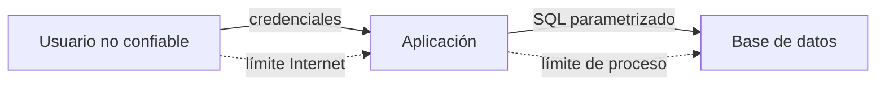
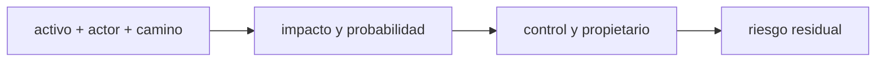
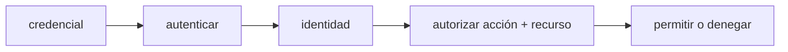
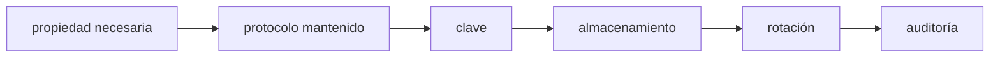
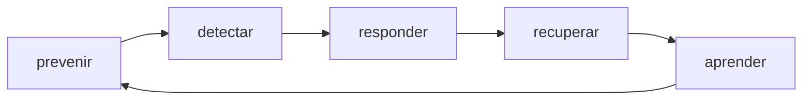

# Módulo 6: Seguridad, privacidad y modelado de amenazas


## Aprende construyendo

### Tema 1: Activos, amenazas, riesgos y límites de confianza

**Conceptos clave:** activo, actor, amenaza, vulnerabilidad, control, impacto, probabilidad, riesgo, superficie de ataque, límite de confianza y STRIDE.

Seguridad no empieza instalando una librería. Empieza preguntando qué debe protegerse, de quién y con qué consecuencias. Un **activo** puede ser credenciales, inventario, disponibilidad o reputación. Una amenaza es un evento potencial; una vulnerabilidad es una debilidad explotable; un control reduce probabilidad o impacto. Riesgo combina contexto, no solo severidad técnica.

Dibuja un flujo de datos: usuario → interfaz → aplicación → base. Marca límites donde cambia confianza: Internet a servidor, proceso a base, CI a nube. Para cada flujo aplica STRIDE como lista de preguntas: suplantación, manipulación, repudio, divulgación, denegación y elevación de privilegio.



Ejemplo: activo “stock correcto”; amenaza “operador modifica productos ajenos”; vulnerabilidad “endpoint no comprueba rol”; control “autorización en servidor + audit log + prueba negativa”. “Usar HTTPS” no corrige autorización: protege tránsito, no decide permisos.

Prioriza con impacto y probabilidad, registra supuestos y propietario. Un riesgo crítico sin responsable es solo una frase. Riesgo residual permanece después del control y debe aceptarse, transferirse, reducirse o evitarse conscientemente.

**Analogía:** threat modeling es inspeccionar un edificio antes de instalar cerraduras: identifica objetos valiosos, entradas, personas y consecuencias, en lugar de comprar la cerradura más cara para una puerta irrelevante.

**¿Por qué es importante?** Controles aislados crean falsa seguridad. El modelo conecta requisitos, arquitectura, pruebas y operación.

**Casos de uso reales:** revisión de APIs, pagos, datos personales, pipelines, aplicaciones móviles e infraestructura cloud.

**Diagrama:**



#### Construcción RutaFlow: amenaza conectada a una prueba

Crea `rutaflow-fundamentos/21-amenazas/docs/threat-model.md` con DFD, límites, activos y una tabla STRIDE. Implementa `src/autorizar.py` y `tests/test_autorizar.py` para el riesgo “operador modifica una guía ajena”. Ejecuta `python -m pytest -q`; el resultado esperado permite al propietario autorizado y niega otro centro sin cambiar estado.

Elimina la comprobación de recurso y comprueba que la prueba negativa falle. Como modificación, puntúa impacto/probabilidad, asigna propietario y anota riesgo residual del control. RutaFlow no convierte STRIDE en una lista decorativa: cada riesgo prioritario conecta arquitectura, control, evidencia y respuesta; HTTPS no sustituye autorización.

### Tema 2: Identidad, contraseñas, sesiones y autorización

**Conceptos clave:** identidad, autenticación, autorización, credencial, password hashing, salt, sesión, token, rol, permiso y mínimo privilegio.

Autenticación responde “¿quién eres?”; autorización responde “¿puedes hacer esto sobre este recurso?”. Un usuario autenticado no obtiene automáticamente permisos administrativos.

Las contraseñas no deben almacenarse en texto ni cifrarse reversiblemente. Se derivan con una función lenta y resistente a ataques, salt aleatorio único y parámetros guardados. En Python estándar:

```python
import hashlib
import hmac
import secrets

def crear_hash(password: str) -> tuple[bytes, bytes]:
    salt = secrets.token_bytes(16)
    digest = hashlib.scrypt(
        password.encode(), salt=salt, n=2**14, r=8, p=1
    )
    return salt, digest

def verificar(password: str, salt: bytes, esperado: bytes) -> bool:
    actual = hashlib.scrypt(
        password.encode(), salt=salt, n=2**14, r=8, p=1
    )
    return hmac.compare_digest(actual, esperado)
```

`secrets` genera salt criptográfico. `scrypt` encarece intentos masivos. `compare_digest` reduce filtraciones por comparación temporal. Los parámetros deben revisarse según entorno; en producción suelen usarse bibliotecas mantenidas con Argon2id/bcrypt/scrypt y políticas de actualización.

Autorización debe ocurrir en el servidor/capa de dominio, no solo ocultando botones:

```python
def eliminar_producto(usuario, producto_id, repositorio):
    if "producto:eliminar" not in usuario.permisos:
        raise PermissionError("Operación no autorizada")
    repositorio.eliminar(producto_id)
```

Prueba usuario anónimo, lector, operador y administrador. Aplica mínimo privilegio y denegación por defecto. Sesiones/tokens requieren expiración, revocación, protección contra robo y almacenamiento apropiado; JWT no resuelve estos problemas por sí mismo.

**Analogía:** mostrar identificación permite entrar al edificio; la autorización determina qué salas puedes abrir. Ocultar el letrero de una puerta no reemplaza la cerradura.

**¿Por qué es importante?** Fallos de control de acceso exponen datos y acciones incluso con login correcto.

**Casos de uso reales:** paneles administrativos, multi-tenant, archivos privados, APIs y operaciones financieras.

**Diagrama:**



#### Construcción RutaFlow: identidad separada de permiso

Crea `rutaflow-fundamentos/22-identidad/src/seguridad.py` con `scrypt`, salt aleatorio y `compare_digest`, más autorización por permiso y centro. En `tests/test_seguridad.py`, verifica contraseña correcta/incorrecta, salts distintos y lector intentando eliminar. Ejecuta `python -m pytest -q`; todas las denegaciones deben dejar el repositorio intacto.

Almacena temporalmente la contraseña en claro dentro de un fixture para reconocer el dato prohibido y elimínalo. Como modificación, añade expiración y revocación a una sesión opaca de práctica. RutaFlow niega por defecto y autoriza en servidor/dominio; ocultar el botón o usar JWT no decide quién puede actuar sobre una guía concreta.

### Tema 3: Criptografía aplicada, TLS, claves y secretos

**Conceptos clave:** hash, MAC, firma, cifrado simétrico/asimétrico, confidencialidad, integridad, autenticidad, TLS, clave, rotación y secret manager.

Criptografía ofrece propiedades distintas. Un hash detecta cambios, pero no autentica origen si cualquiera puede recalcularlo. Un MAC usa secreto compartido para integridad/autenticidad. Una firma usa clave privada y se verifica con pública. Cifrado protege confidencialidad, pero debe incluir autenticación para detectar manipulación.

No diseñes algoritmos ni combines primitivas por intuición. Usa protocolos y bibliotecas mantenidas. “Base64” no cifra; solo codifica. SHA-256 solo no sirve para contraseñas por ser demasiado rápido. Guardar una clave junto al dato cifrado elimina el beneficio.

TLS protege datos en tránsito y autentica el servidor mediante certificados. Verifica hostname y cadena; desactivar validación para “arreglar” desarrollo entrena una vulnerabilidad. En reposo, el problema central es gestión de claves: creación, permisos, almacenamiento, rotación, revocación y auditoría.

Secretos no pertenecen al repositorio:

```python
import os

database_url = os.environ.get("DATABASE_URL")
if not database_url:
    raise RuntimeError("Falta DATABASE_URL")
```

`.env` local debe ignorarse; `.env.example` contiene nombres sin valores reales. En producción usa gestor de secretos e identidad de workload. Si un secreto entra en Git, borrarlo del último commit no basta: puede permanecer en historial y clones; revócalo/rota primero.

**Analogía:** cifrado es una caja fuerte; gestión de claves decide quién tiene la llave, dónde se guarda y qué ocurre si se copia. Una caja fuerte con llave pegada no protege.

**¿Por qué es importante?** La criptografía correcta puede fallar por claves expuestas, validación desactivada o propósito equivocado.

**Casos de uso reales:** HTTPS, contraseñas, webhooks firmados, discos cifrados, backups y secretos de CI.

**Diagrama:**



#### Construcción RutaFlow: webhook auténtico y secreto rotatorio

Crea `rutaflow-fundamentos/23-cripto/src/webhook.py` para verificar HMAC-SHA256 con secreto obtenido de `RUTAFLOW_WEBHOOK_SECRET`, timestamp y comparación constante. Añade `tests/test_webhook.py` para firma válida, payload manipulado, timestamp vencido y secreto ausente. Ejecuta `python -m pytest -q`; solo el mensaje íntegro y reciente debe aceptarse.

Codifica una firma con Base64 y explica por qué eso no cifra el payload. Como modificación, acepta durante una ventana dos versiones de clave para practicar rotación y registra solo el identificador de versión. Incluye `.env.example` sin valores y `.gitignore`. Si un secreto llega a Git, RutaFlow lo revoca primero; borrar el archivo no elimina copias ni historial.

### Tema 4: Validación, vulnerabilidades web, privacidad y respuesta

**Conceptos clave:** validación, encoding, inyección, XSS, CSRF, CORS, logging seguro, minimización, retención, incidente y defensa en profundidad.

Valida entrada según el dominio: tipo, longitud, formato, rango y relación. Validar no significa “eliminar caracteres malos” universalmente. Mantén datos y código separados: SQL parametrizado; encoding contextual al renderizar HTML; APIs seguras para comandos.

**Inyección SQL** ocurre cuando entrada altera estructura de consulta. **XSS** ejecuta contenido no confiable como script; la defensa principal es salida codificada/contextual y evitar APIs peligrosas, complementada por CSP. **CSRF** induce al navegador autenticado a enviar una acción; defensas incluyen tokens, SameSite y comprobación de origen. **CORS** controla qué orígenes pueden leer respuestas en navegador; no autentica ni protege una API de clientes no navegador.

```html
<!-- Riesgoso si comentario viene del usuario -->
<div id="comentario"></div>
<script>
  comentario.textContent = datoNoConfiable;
</script>
```

`textContent` trata el valor como texto; `innerHTML` lo interpretaría como marcado. La regla depende del contexto.

Privacidad exige propósito, minimización, retención y derechos. No recopiles fecha de nacimiento si solo necesitas confirmar mayoría de edad. Logs no deben incluir contraseñas, tokens ni datos personales completos. Define tiempo de retención y borrado.

Un incidente necesita preparación: detectar, contener, preservar evidencia, erradicar, recuperar y aprender. El runbook incluye contactos, criterios, rotación, comunicación y verificación. Evita culpar; busca condiciones sistémicas.

**Analogía:** validación controla qué paquetes entran; encoding evita que su etiqueta se interprete como instrucción; privacidad cuestiona si debías recibir el paquete; respuesta define qué hacer si algo peligroso pasó.

**¿Por qué es importante?** Seguridad y privacidad atraviesan código, datos, operación y personas. Un control único nunca cubre todas las capas.

**Casos de uso reales:** formularios, APIs, contenido generado por usuarios, logs, analytics y respuesta a credenciales filtradas.

**Diagrama:**



#### Construcción RutaFlow: entrada hostil y respuesta preparada

Crea `rutaflow-fundamentos/24-defensa/src/comentarios.html` usando `textContent`, y `src/validar.py` con límites de longitud, formato y rango. Añade pruebas para SQL parametrizado, texto ``, payload enorme y token ausente. Ejecuta `python -m pytest -q` y sirve HTML con `python -m http.server 8000`; el contenido hostil debe mostrarse como texto, no ejecutarse.

Cambia a `innerHTML` solo en el laboratorio y observa el riesgo; restaura la API segura. Como modificación, crea `docs/incident-runbook.md` para secreto filtrado con detectar, contener, rotar, recuperar y revisar. RutaFlow minimiza y redacta datos en logs; CORS no autentica, CSP no corrige SQL y ningún control aislado reemplaza defensa en profundidad.


## Construcción guiada del capítulo

### Proyecto 6: endurecimiento del inventario

1. Crea `threat-model.md` con activos, DFD, límites y al menos 12 amenazas STRIDE.
2. Prioriza cinco riesgos con impacto/probabilidad, control, propietario y residual.
3. Añade tablas de usuarios, roles/permisos y audit events mediante migración.
4. Implementa registro/login local con `scrypt`, salt único y comparación segura.
5. Define permisos `producto:leer`, `producto:editar`, `producto:eliminar` y deniega por defecto.
6. Registra acciones sensibles sin secretos ni contraseñas.
7. Mueve configuración sensible a variables; añade `.env.example` y `.gitignore`.
8. Añade pruebas negativas: anónimo, rol incorrecto, acceso a recurso ajeno, inyección y entrada extrema.
9. Ejecuta escaneo de secretos/dependencias en CI.
10. Escribe `INCIDENT-RUNBOOK.md` para credencial filtrada y corrupción de inventario.

**Verificación:** contraseñas nunca aparecen en claro; salts son distintos; permisos se comprueban en lógica; operaciones denegadas no cambian datos; logs permiten atribución sin filtrar secretos; el runbook puede seguirse.

**Errores comunes y soluciones**

- Inventar cifrado: usa estándares/bibliotecas.
- Autorización solo en UI: verifica servidor/dominio.
- Guardar secretos en Git y luego borrarlos: rota y limpia historial según incidente.
- Registrar requests completos: redacta datos sensibles.
- Tratar CORS como autenticación: exige credenciales/permisos reales.
