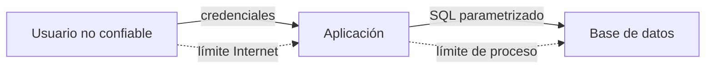
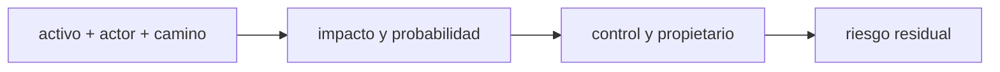
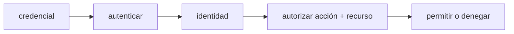
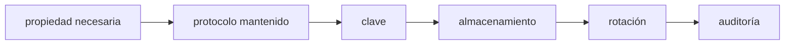
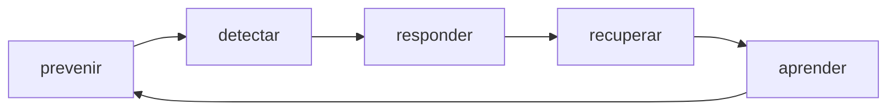

# Módulo 6: Seguridad, privacidad y modelado de amenazas


## Aprende construyendo

### Tema 1: Activos, amenazas, riesgos y límites de confianza

#### Paso 1 · Objetivo y preparación
Al finalizar vas a modelar amenazas STRIDE reales sobre `examples/rutaflow/foundation/domain.py`, el modelo de dominio de RutaFlow. Prerrequisitos: Python 3 instalado; clona o abre el repo de la Academia.

#### Paso 2 · Contexto y caso real
El proyecto integrador Fundamentos que construirás a lo largo de estos 12 módulos es: el proyecto integrador Fundamentos: aprenderás a manejar errores (archivo no existe, comando inválido). `domain.py` ya controla qué transiciones de estado son válidas para un envío (`CREATED → ASSIGNED → OUT_FOR_DELIVERY → DELIVERED`) — pero nadie documentó todavía qué amenaza concreta justifica que ese control exista.

#### Paso 3 · Teoría, modelo mental y analogía
Un activo es lo que hay que proteger (que el estado de un envío no se corrompa); una amenaza es lo que podría romperlo (un operador que fuerza una transición inválida); STRIDE es la checklist que te hace preguntar por seis formas distintas de ataque, no solo la obvia.

#### Paso 4 · Demostración guiada desde cero
```bash
python3 -c "
from examples.rutaflow.foundation.domain import ShipmentStatus, transition
transition(ShipmentStatus.CREATED, ShipmentStatus.DELIVERED)
"
```
Resultado esperado: `ValueError: invalid shipment transition: ShipmentStatus.CREATED -> ShipmentStatus.DELIVERED` — el código ya rechaza saltarse `ASSIGNED` y `OUT_FOR_DELIVERY`. Esa excepción es, en los términos de este Tema, un **control** real contra la amenaza de **Tampering** (manipulación del estado del envío).

#### Paso 5 · Práctica guiada
Pista: editá `ALLOWED_TRANSITIONS` para agregar `ShipmentStatus.CREATED: {ShipmentStatus.DELIVERED}` — ese es el fallo deliberado: ahora cualquiera puede marcar un envío como entregado sin que nunca haya sido asignado a un conductor ni haya salido a reparto, exactamente la amenaza de Tampering que el diseño original evitaba.

#### Paso 6 · Práctica independiente
Revertí el cambio del Paso 5, y completá un threat model mínimo de `domain.py`: por cada una de las 6 letras de STRIDE, escribí si aplica o no a `transition()` y por qué (pista: Repudiation aplica si nadie registra quién pidió el cambio de estado — `domain.py` no lo hace hoy, es un hallazgo real).

#### Paso 7 · Cierre y evidencia
Entregá la excepción real del Paso 4, el control roto del Paso 5, y el threat model STRIDE del Paso 6; explicá qué amenaza real previene `ALLOWED_TRANSITIONS` y cuál NO cubre todavía. Errores comunes: afirmar sin medir, ignorar límites, copiar comandos y no documentar recuperación. Fuentes oficiales: https://www.cs2023.org/ y https://www.swebok.org/.
**¿Por qué es importante?** Porque los fundamentos permiten comprender y diagnosticar cualquier stack.
**Escenario:** Modelaste STRIDE sobre entregas. Tampering (alterar envío de CREATED a DELIVERED sin pasar por ASSIGNED) tiene impacto alto; Repudiation (negar que un operador confirmó) es probable pero menor. ¿Cuál amenaza ataca primero?

**Tu tarea:**
1. Define impacto y probabilidad para cada una (escala 1-5).
2. Calcula riesgo = impacto × probabilidad.
3. ¿Cuál es el riesgo residual sin control?
4. ¿Qué control es más costo-efectivo?

[SOLUCIÓN PLEGADA]
> Tampering: impacto 5 (fraude masivo), probabilidad 3 (requiere acceso BD) = riesgo 15. Repudiation: impacto 2 (disputa operador), probabilidad 4 (sin audit log) = riesgo 8. Tampering primero. Control: restricción `ALLOWED_TRANSITIONS` en el dominio (bajo coste, alto valor). Repudiation: audit log de quién pidió qué cambio (medio coste). Residual: ambos pueden ocurrir si alguien compromete el servidor de aplicación (transferir a otro equipo o evitar con segmentación).

**Evidencia de aprendizaje:** entrega modelo, ejemplo, fallo, corrección, comparación y conclusión.
**Conceptos clave:** activo, actor, amenaza, vulnerabilidad, control, impacto, probabilidad, riesgo, superficie de ataque, límite de confianza y STRIDE.

Seguridad no empieza instalando una librería. Empieza preguntando qué debe protegerse, de quién y con qué consecuencias. Un **activo** puede ser credenciales, inventario, disponibilidad o reputación. Una amenaza es un evento potencial; una vulnerabilidad es una debilidad explotable; un control reduce probabilidad o impacto. Riesgo combina contexto, no solo severidad técnica.

Dibuja un flujo de datos: usuario → interfaz → aplicación → base. Marca límites donde cambia confianza: Internet a servidor, proceso a base, CI a nube. Para cada flujo aplica STRIDE como lista de preguntas: suplantación, manipulación, repudio, divulgación, denegación y elevación de privilegio.


```mermaid
flowchart LR
    USER["Usuario no confiable"] -->|"credenciales"| APP["Aplicación"]
    APP -->|"SQL parametrizado"| DB["Base de datos"]
    USER -. "límite Internet" .-> APP
    APP -. "límite de proceso" .-> DB
```

Ejemplo: activo “stock correcto”; amenaza “operador modifica productos ajenos”; vulnerabilidad “endpoint no comprueba rol”; control “autorización en servidor + audit log + prueba negativa”. “Usar HTTPS” no corrige autorización: protege tránsito, no decide permisos.

Prioriza con impacto y probabilidad, registra supuestos y propietario. Un riesgo crítico sin responsable es solo una frase. Riesgo residual permanece después del control y debe aceptarse, transferirse, reducirse o evitarse conscientemente.

**Analogía:** threat modeling es inspeccionar un edificio antes de instalar cerraduras: identifica objetos valiosos, entradas, personas y consecuencias, en lugar de comprar la cerradura más cara para una puerta irrelevante.

**¿Por qué es importante?** Controles aislados crean falsa seguridad. El modelo conecta requisitos, arquitectura, pruebas y operación.

**Casos de uso reales:** revisión de APIs, pagos, datos personales, pipelines, aplicaciones móviles e infraestructura cloud.

**Diagrama:**


```mermaid
flowchart LR
    THREAT["activo + actor + camino"] --> RISK["impacto y probabilidad"]
    RISK --> CONTROL["control y propietario"] --> RESIDUAL["riesgo residual"]
```

### Tema 2: Identidad, contraseñas, sesiones y autorización

#### Paso 1 · Objetivo y preparación
Al finalizar vas a separar autenticación de autorización sobre un caso real: un conductor de RutaFlow confirmando una entrega que no le pertenece. Prerrequisitos: Python 3 instalado.

#### Paso 2 · Contexto y caso real
Que un conductor haya iniciado sesión correctamente (autenticación) no significa que pueda confirmar la entrega de CUALQUIER envío (autorización) — solo la del envío que RutaFlow le asignó a él específicamente.

#### Paso 3 · Teoría, modelo mental y analogía
Autenticación responde "¿quién eres?"; autorización responde "¿podés hacer esto sobre ESTE recurso puntual?" — mostrar tu identificación en la puerta del edificio no te da llave de todas las oficinas.

#### Paso 4 · Demostración guiada desde cero
```python
def confirmar_entrega(conductor_id: str, envio: dict, repositorio):
    if envio["conductor_asignado"] != conductor_id:
        raise PermissionError(f"{conductor_id} no está asignado a este envío")
    repositorio.marcar_entregado(envio["id"])

envio = {"id": "RF-4471", "conductor_asignado": "c-891"}
confirmar_entrega("c-891", envio, repositorio=FakeRepo())
```
Resultado esperado: la llamada con `c-891` (el conductor real asignado) se ejecuta sin error — la autorización depende del dato del envío, no solo de que el conductor haya iniciado sesión.

#### Paso 5 · Práctica guiada
Pista: llamá `confirmar_entrega("c-999", envio, repositorio)` (un conductor autenticado, pero distinto al asignado) — ese es el fallo deliberado: `PermissionError`, aunque `c-999` tenga una sesión válida como cualquier otro conductor. Estar autenticado nunca implica estar autorizado para este envío puntual.

#### Paso 6 · Práctica independiente
Probá tres casos: conductor asignado (debe pasar), conductor distinto (debe fallar), y conductor vacío/`None` (caso límite — decidí y documentá si debería fallar igual que el caso anterior o con un error distinto).

#### Paso 7 · Cierre y evidencia
Entregá la confirmación exitosa del Paso 4, el `PermissionError` del Paso 5, y los tres casos del Paso 6; explicá por qué "ocultar el botón de confirmar en la app" nunca sustituiría esta verificación en el servidor. Errores comunes: afirmar sin medir, ignorar límites, copiar comandos y no documentar recuperación. Fuentes oficiales: https://www.cs2023.org/ y https://www.swebok.org/.
**¿Por qué es importante?** Porque los fundamentos permiten comprender y diagnosticar cualquier stack.
**Escenario:** Un conductor confirmó 200 entregas falsas. Necesitas revertir exactamente esas entregas, probar que fue por ese conductor, y que nadie más accedió con sus credenciales en ese período.

**Tu tarea:**
1. Diseña qué debe registrar el audit log.
2. ¿Cuánto tiempo retener? (Cumplimiento legal, investigación.)
3. ¿Cómo revocar su sesión sin afectar otros usuarios?
4. ¿Qué tan rápido debe ser la revocación?

[SOLUCIÓN PLEGADA]
> Audit log: `{timestamp, conductor_id, action, shipment_id, ip, session_token}`. Retención: 2 años (GDPR de entrega), logs inmutables en S3 con versionado. Revocación: cambiar contraseña + invalidar tokens activos inmediatamente (servidor mantiene lista de revocados en caché). Revocación debe ser <5 segundos en propagación a todos los workers. Revert: transacción que restaura estado anterior registrando "anulación por fraude" en su propio log.

**Evidencia de aprendizaje:** entrega modelo, ejemplo, fallo, corrección, comparación y conclusión.
**Conceptos clave:** identidad, autenticación, autorización, credencial, password hashing, salt, sesión, token, rol, permiso y mínimo privilegio.

Autenticación responde “¿quién eres?”; autorización responde “¿puedes hacer esto sobre este recurso?”. Un usuario autenticado no obtiene automáticamente permisos administrativos.

Las contraseñas no deben almacenarse en texto ni cifrarse reversiblemente. Se derivan con una función lenta y resistente a ataques, salt aleatorio único y parámetros guardados. En Python estándar:

```python
import hashlib
import hmac
import secrets

def crear_hash(password: str) -> tuple[bytes, bytes]:
    salt = secrets.token_bytes(16)
    digest = hashlib.scrypt(
        password.encode(), salt=salt, n=2**14, r=8, p=1
    )
    return salt, digest

def verificar(password: str, salt: bytes, esperado: bytes) -> bool:
    actual = hashlib.scrypt(
        password.encode(), salt=salt, n=2**14, r=8, p=1
    )
    return hmac.compare_digest(actual, esperado)
```

`secrets` genera salt criptográfico. `scrypt` encarece intentos masivos. `compare_digest` reduce filtraciones por comparación temporal. Los parámetros deben revisarse según entorno; en producción suelen usarse bibliotecas mantenidas con Argon2id/bcrypt/scrypt y políticas de actualización.

Autorización debe ocurrir en el servidor/capa de dominio, no solo ocultando botones:

```python
def eliminar_producto(usuario, producto_id, repositorio):
    if "producto:eliminar" not in usuario.permisos:
        raise PermissionError("Operación no autorizada")
    repositorio.eliminar(producto_id)
```

Prueba usuario anónimo, lector, operador y administrador. Aplica mínimo privilegio y denegación por defecto. Sesiones/tokens requieren expiración, revocación, protección contra robo y almacenamiento apropiado; JWT no resuelve estos problemas por sí mismo.

**Analogía:** mostrar identificación permite entrar al edificio; la autorización determina qué salas puedes abrir. Ocultar el letrero de una puerta no reemplaza la cerradura.

**¿Por qué es importante?** Fallos de control de acceso exponen datos y acciones incluso con login correcto.

**Casos de uso reales:** paneles administrativos, multi-tenant, archivos privados, APIs y operaciones financieras.

**Diagrama:**


```mermaid
flowchart LR
    CRED["credencial"] --> AUTHN["autenticar"] --> ID["identidad"]
    ID --> AUTHZ["autorizar acción + recurso"] --> DECISION["permitir o denegar"]
```

El proyecto integrador Fundamentos aplica la misma separación: en el gestor de tareas CLI, `tareas.py` guarda qué usuario creó cada tarea, y una futura función `completar(tarea_id, usuario)` tendría que verificar autorización (¿esta tarea es del usuario que la pide completar?) exactamente igual que `confirmar_entrega` verifica que el conductor sea el asignado — autenticarse para usar el CLI nunca implica poder modificar la tarea de otra persona.

### Tema 3: Criptografía aplicada, TLS, claves y secretos

#### Paso 1 · Objetivo y preparación
Al finalizar vas a firmar con HMAC el comando "confirmar entrega" de RutaFlow, y a detectar si alguien lo manipuló en tránsito. Prerrequisitos: Python 3 instalado.

#### Paso 2 · Contexto y caso real
El comando `{"shipmentId": "RF-4471", "recipientPin": "837201"}` viaja por una cola (como en el Módulo 3 del track Cloud) antes de llegar a quien confirma la entrega — sin una firma, nada impide que alguien en el camino cambie el `recipientPin` por otro.

#### Paso 3 · Teoría, modelo mental y analogía
Un MAC (HMAC) usa un secreto compartido para producir una "huella" ligada al contenido exacto: si el contenido cambia una sola letra, la huella ya no coincide — es un sello de lacre con una firma secreta, no un simple hash público que cualquiera podría recalcular.

#### Paso 4 · Demostración guiada desde cero
```python
import hmac, hashlib, json

SECRET = b"clave-compartida-rutaflow"
comando = {"shipmentId": "RF-4471", "recipientPin": "837201"}
payload = json.dumps(comando, sort_keys=True).encode()
firma = hmac.new(SECRET, payload, hashlib.sha256).hexdigest()
print(hmac.compare_digest(firma, hmac.new(SECRET, payload, hashlib.sha256).hexdigest()))
```
Resultado esperado: `True` — la firma calculada sobre el payload exacto coincide, confirmando que nadie lo modificó entre que se firmó y que se verificó.

#### Paso 5 · Práctica guiada
Pista: cambiá `recipientPin` a `"999999"` DESPUÉS de calcular `firma`, y volvé a verificar contra el payload modificado — ese es el fallo deliberado: `compare_digest` devuelve `False`, porque la firma quedó ligada al contenido original, no al campo `shipmentId` solamente; cualquier cambio, aunque sea de un dígito, rompe la verificación.

#### Paso 6 · Práctica independiente
Repetí el Paso 4 pero calculando la firma con `hashlib.sha256(payload).hexdigest()` (un hash simple, sin `SECRET`) — documentá por qué cualquiera que intercepte el comando podría recalcular ESA firma y falsificar un comando nuevo, algo que no puede hacer sin conocer `SECRET` en la versión HMAC.

#### Paso 7 · Cierre y evidencia
Entregá la verificación exitosa del Paso 4, la detección de manipulación del Paso 5, y la comparación hash-vs-HMAC del Paso 6; explicá por qué "Base64" o un hash simple no sirven como sustituto de un MAC cuando necesitás autenticidad, no solo detección de cambios. Errores comunes: afirmar sin medir, ignorar límites, copiar comandos y no documentar recuperación. Fuentes oficiales: https://www.cs2023.org/ y https://www.swebok.org/.
**¿Por qué es importante?** Porque los fundamentos permiten comprender y diagnosticar cualquier stack.
**Escenario:** Tu aplicación necesita acceder a DynamoDB. ¿Dónde guardas la credencial de AWS?

**Tu tarea:**
1. ¿Por qué NO en `.env` o `.secret` en el repo?
2. Diseña un almacén seguro para dev/staging/prod.
3. ¿Cómo rotarlas sin downtime?
4. ¿Cómo detectar si una credencial fue expuesta?

[SOLUCIÓN PLEGADA]
> NO en repo porque Git preserva historial — una eliminación no borra el secret de commits anteriores. Diseño: en dev, `.env.local` (ignorado, solo local); en CI, variables de entorno cifradas que GitHub Actions desencripta; en prod, servicio de secretos (AWS Secrets Manager, HashiCorp Vault) con acceso por IAM role, no credenciales explícitas. Rotación: crear nueva clave en el servicio, actualizar referencia en aplicación, desactivar antigua tras verificación. Detección: honeypot (fake credentials en logs públicos que alertan si se usan) + escaneo de público.

**Evidencia de aprendizaje:** entrega modelo, ejemplo, fallo, corrección, comparación y conclusión.
**Conceptos clave:** hash, MAC, firma, cifrado simétrico/asimétrico, confidencialidad, integridad, autenticidad, TLS, clave, rotación y secret manager.

Criptografía ofrece propiedades distintas. Un hash detecta cambios, pero no autentica origen si cualquiera puede recalcularlo. Un MAC usa secreto compartido para integridad/autenticidad. Una firma usa clave privada y se verifica con pública. Cifrado protege confidencialidad, pero debe incluir autenticación para detectar manipulación.

No diseñes algoritmos ni combines primitivas por intuición. Usa protocolos y bibliotecas mantenidas. “Base64” no cifra; solo codifica. SHA-256 solo no sirve para contraseñas por ser demasiado rápido. Guardar una clave junto al dato cifrado elimina el beneficio.

TLS protege datos en tránsito y autentica el servidor mediante certificados. Verifica hostname y cadena; desactivar validación para “arreglar” desarrollo entrena una vulnerabilidad. En reposo, el problema central es gestión de claves: creación, permisos, almacenamiento, rotación, revocación y auditoría.

Secretos no pertenecen al repositorio:

```python
import os

database_url = os.environ.get("DATABASE_URL")
if not database_url:
    raise RuntimeError("Falta DATABASE_URL")
```

`.env` local debe ignorarse; `.env.example` contiene nombres sin valores reales. En producción usa gestor de secretos e identidad de workload. Si un secreto entra en Git, borrarlo del último commit no basta: puede permanecer en historial y clones; revócalo/rota primero.

**Analogía:** cifrado es una caja fuerte; gestión de claves decide quién tiene la llave, dónde se guarda y qué ocurre si se copia. Una caja fuerte con llave pegada no protege.

**¿Por qué es importante?** La criptografía correcta puede fallar por claves expuestas, validación desactivada o propósito equivocado.

**Casos de uso reales:** HTTPS, contraseñas, webhooks firmados, discos cifrados, backups y secretos de CI.

**Diagrama:**


```mermaid
flowchart LR
    PROPERTY["propiedad necesaria"] --> PROTOCOL["protocolo mantenido"] --> KEY["clave"]
    KEY --> STORE["almacenamiento"] --> ROTATE["rotación"] --> AUDIT["auditoría"]
```

Esta misma técnica HMAC es la que protegería al proyecto integrador Fundamentos si su CLI alguna vez enviara comandos a un servicio remoto: la firma viviría junto a `almacenamiento.py`, nunca como una constante pegada en `cli.py`, y `SECRET` nunca se versiona en el repositorio — se lee desde una variable de entorno, igual que `database_url` en el ejemplo de este Tema.

### Tema 4: Validación, vulnerabilidades web, privacidad y respuesta

#### Paso 1 · Objetivo y preparación
Al finalizar vas a validar la nota de entrega que un conductor de RutaFlow escribe, y a comprobar por qué `textContent` la protege de XSS mientras `innerHTML` no. Prerrequisitos: un navegador con consola de desarrollador.

#### Paso 2 · Contexto y caso real
Cuando un conductor escribe "dejado con el portero" como nota de una entrega, esa nota se guarda y luego se muestra en el panel de seguimiento del cliente — un campo de texto libre escrito por un tercero es exactamente la superficie donde aparece XSS.

#### Paso 3 · Teoría, modelo mental y analogía
Validar decide qué entra; el encoding contextual decide cómo se interpreta al mostrarlo — `textContent` trata el valor siempre como texto, `innerHTML` lo interpreta como marcado ejecutable si lo dejás pasar.

#### Paso 4 · Demostración guiada desde cero
```html
<div id="nota"></div>
<script>
  const notaDelConductor = "dejado con el portero";
  document.getElementById("nota").textContent = notaDelConductor;
</script>
```
Resultado esperado: el `div` muestra literalmente el texto "dejado con el portero" — `textContent` nunca interpreta el contenido como HTML, sin importar qué caracteres incluya.

#### Paso 5 · Práctica guiada
Pista: cambiá la nota a `""` y reemplazá `textContent` por `innerHTML` en la misma línea — ese es el fallo deliberado: el navegador ejecuta el `onerror` apenas la imagen falla en cargar, demostrando una inyección XSS real a partir de una nota de entrega que nadie validó ni codificó correctamente al mostrarla.

#### Paso 6 · Práctica independiente
Corregí el Paso 5 volviendo a `textContent`, y además agregá una validación de longitud/formato en el servidor (por ejemplo, máximo 200 caracteres, sin etiquetas `<` ni `>`) antes de guardar la nota — documentá por qué ambas capas (validar al guardar, codificar al mostrar) son necesarias y ninguna sustituye a la otra.

#### Paso 7 · Cierre y evidencia
Entregá la nota mostrada de forma segura del Paso 4, la ejecución de XSS provocada del Paso 5, y las dos capas de defensa del Paso 6; explicá por qué "eliminar caracteres malos" de forma genérica no es lo mismo que validar según el dominio real del campo. Errores comunes: afirmar sin medir, ignorar límites, copiar comandos y no documentar recuperación. Fuentes oficiales: https://www.cs2023.org/ y https://www.swebok.org/.
**¿Por qué es importante?** Porque los fundamentos permiten comprender y diagnosticar cualquier stack.
**Escenario:** Tu Angular app carga scripts de `analytics.example.com`. Un atacante cambia el DNS local e inyecta `<script>robar datos</script>`.

**Tu tarea:**
1. Diseña un Content Security Policy que permita script de tu dominio solamente.
2. ¿Cómo pruebas que el CSP bloquea scripts no autorizados?
3. ¿Cuándo CSP report-only es más seguro que bloqueo?
4. ¿Cómo CSP interactúa con autenticación?

[SOLUCIÓN PLEGADA]
> CSP header: `Content-Security-Policy: script-src 'self' https://analytics.example.com; default-src 'self'`. Prueba: inyectar `<script>alert('hacked')</script>` en consola — debería bloquearse sin ejecutarse. Report-only en staging para auditar falsos positivos antes de bloqueo en prod. CSP no autentica, pero reduce superficie de inyección. Combinar con `X-Frame-Options: DENY` para evitar clickjacking.

**Evidencia de aprendizaje:** entrega modelo, ejemplo, fallo, corrección, comparación y conclusión.
**Conceptos clave:** validación, encoding, inyección, XSS, CSRF, CORS, logging seguro, minimización, retención, incidente y defensa en profundidad.

Valida entrada según el dominio: tipo, longitud, formato, rango y relación. Validar no significa “eliminar caracteres malos” universalmente. Mantén datos y código separados: SQL parametrizado; encoding contextual al renderizar HTML; APIs seguras para comandos.

**Inyección SQL** ocurre cuando entrada altera estructura de consulta. **XSS** ejecuta contenido no confiable como script; la defensa principal es salida codificada/contextual y evitar APIs peligrosas, complementada por CSP. **CSRF** induce al navegador autenticado a enviar una acción; defensas incluyen tokens, SameSite y comprobación de origen. **CORS** controla qué orígenes pueden leer respuestas en navegador; no autentica ni protege una API de clientes no navegador.

```html
<!-- Riesgoso si comentario viene del usuario -->
<div id="comentario"></div>
<script>
  comentario.textContent = datoNoConfiable;
</script>
```

`textContent` trata el valor como texto; `innerHTML` lo interpretaría como marcado. La regla depende del contexto.

Privacidad exige propósito, minimización, retención y derechos. No recopiles fecha de nacimiento si solo necesitas confirmar mayoría de edad. Logs no deben incluir contraseñas, tokens ni datos personales completos. Define tiempo de retención y borrado.

Un incidente necesita preparación: detectar, contener, preservar evidencia, erradicar, recuperar y aprender. El runbook incluye contactos, criterios, rotación, comunicación y verificación. Evita culpar; busca condiciones sistémicas.

**Analogía:** validación controla qué paquetes entran; encoding evita que su etiqueta se interprete como instrucción; privacidad cuestiona si debías recibir el paquete; respuesta define qué hacer si algo peligroso pasó.

**¿Por qué es importante?** Seguridad y privacidad atraviesan código, datos, operación y personas. Un control único nunca cubre todas las capas.

**Casos de uso reales:** formularios, APIs, contenido generado por usuarios, logs, analytics y respuesta a credenciales filtradas.

**Diagrama:**


```mermaid
flowchart LR
    PREVENT["prevenir"] --> DETECT["detectar"] --> RESPOND["responder"]
    RESPOND --> RECOVER["recuperar"] --> LEARN["aprender"] --> PREVENT
```

El proyecto integrador Fundamentos aplica esta misma validación de entrada en `tareas.py`: antes de guardar una descripción de tarea ejecutando el CLI con Python 3 (`python3 cli.py add "<descripción>"`), el código debe rechazar descripciones vacías o con longitud excesiva en el servidor/lógica (no solo en la interfaz), exactamente la misma regla de "validar según el dominio real del campo" que aplica a la nota de entrega de RutaFlow de este Tema.

## Construcción guiada del capítulo

### Proyecto 6: endurecimiento del inventario

1. Crea `threat-model.md` con activos, DFD, límites y al menos 12 amenazas STRIDE.
2. Prioriza cinco riesgos con impacto/probabilidad, control, propietario y residual.
3. Añade tablas de usuarios, roles/permisos y audit events mediante migración.
4. Implementa registro/login local con `scrypt`, salt único y comparación segura.
5. Define permisos `producto:leer`, `producto:editar`, `producto:eliminar` y deniega por defecto.
6. Registra acciones sensibles sin secretos ni contraseñas.
7. Mueve configuración sensible a variables; añade `.env.example` y `.gitignore`.
8. Añade pruebas negativas: anónimo, rol incorrecto, acceso a recurso ajeno, inyección y entrada extrema.
9. Ejecuta escaneo de secretos/dependencias en CI.
10. Escribe `INCIDENT-RUNBOOK.md` para credencial filtrada y corrupción de inventario.

**Verificación:** contraseñas nunca aparecen en claro; salts son distintos; permisos se comprueban en lógica; operaciones denegadas no cambian datos; logs permiten atribución sin filtrar secretos; el runbook puede seguirse.

**Errores comunes y soluciones**

- Inventar cifrado: usa estándares/bibliotecas.
- Autorización solo en UI: verifica servidor/dominio.
- Guardar secretos en Git y luego borrarlos: rota y limpia historial según incidente.
- Registrar requests completos: redacta datos sensibles.
- Tratar CORS como autenticación: exige credenciales/permisos reales.
