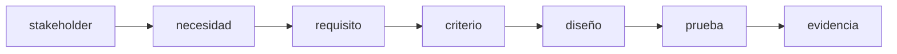
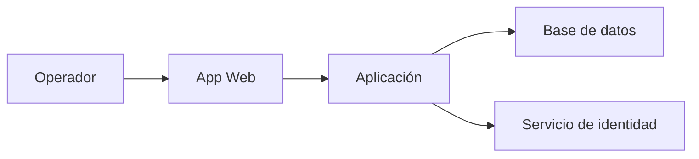
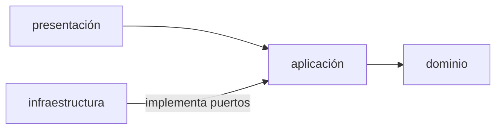
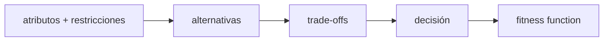
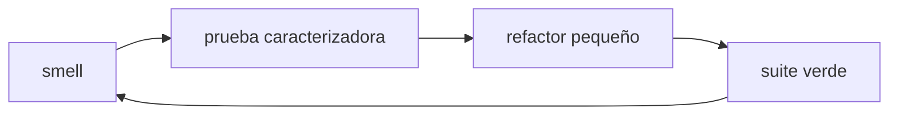
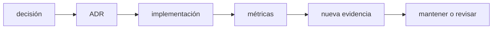

# Módulo 7: Requisitos, diseño, arquitectura y mantenimiento


## Aprende construyendo

### Tema 1: Requisitos, stakeholders y criterios verificables

#### Paso 1 · Objetivo y preparación
Al finalizar podrás aplicar este fundamento desde cero. Prerrequisitos: terminal, editor y las herramientas indicadas por el tema. Verifica sus versiones antes de empezar.

#### Paso 2 · Contexto y caso real
En un caso real de software, esta idea ayuda a construir, proteger, medir o explicar una plataforma de entregas con decisiones verificables.

#### Paso 3 · Teoría, modelo mental y analogía
Define conceptos, entradas, salidas, límites y una analogía cotidiana; distingue una hipótesis de una garantía y registra qué evidencia la respalda.

#### Paso 4 · Demostración guiada desde cero
Parte de una carpeta vacía:
```bash
mkdir ejemplo-fundamentos-avanzado
cd ejemplo-fundamentos-avanzado
python --version
mkdir src docs
printf "evidencia\n" > docs/README.md
cat docs/README.md
```
Crea src/ejemplo.txt con el modelo mínimo del tema y explica cada línea y salida.

#### Paso 5 · Práctica guiada
Pista: cambia deliberadamente una precondición para provocar un fallo deliberado; lee el diagnóstico, formula una hipótesis y corrígela. Resultado esperado: evidencia reproducible y regla explícita.

#### Paso 6 · Práctica independiente
Construye una variante con un caso normal, uno límite y uno inválido; compara dos alternativas y documenta coste, riesgo y decisión.

#### Paso 7 · Cierre y evidencia
Guarda código, comandos, salida, diagnóstico y reflexión; como siguiente paso conecta el fundamento con el track técnico elegido. Errores comunes: afirmar sin medir, ignorar límites, copiar comandos y no documentar recuperación. Fuentes oficiales: https://www.cs2023.org/ y https://www.swebok.org/.
**¿Por qué es importante?** Porque los fundamentos permiten comprender y diagnosticar cualquier stack.
**Evidencia de aprendizaje:** entrega modelo, ejemplo, fallo, corrección, comparación y conclusión.
**Conceptos clave:** stakeholder, necesidad, requisito funcional, atributo de calidad, restricción, historia, criterio de aceptación, supuesto y trazabilidad.

Software exitoso no es el que contiene más funciones, sino el que satisface necesidades relevantes bajo restricciones explícitas. Un stakeholder puede ser usuario, operador, negocio, auditor o equipo de soporte; sus objetivos pueden entrar en tensión.

“El sistema debe ser rápido” no es verificable. “El 95 % de búsquedas por SKU debe responder en menos de 200 ms con 100 000 productos en el entorno de referencia” define operación, métrica, umbral y contexto.

Una historia organiza valor, pero no sustituye especificación:

```text
Como operador de bodega
quiero registrar una retirada por SKU
para mantener el stock actualizado.

Criterios:
- Dado stock 5, cuando retiro 2, entonces queda 3 y se registra auditoría.
- Dado stock 1, cuando retiro 2, entonces se rechaza sin cambio parcial.
- Un lector autenticado no puede retirar.
```

Los criterios usan ejemplos que luego pueden convertirse en pruebas. Registra supuestos (“una sola moneda”), exclusiones (“no sincroniza sucursales todavía”) y fuente. Mantén trazabilidad requisito → decisión → código → prueba → evidencia.

Prioriza por valor, riesgo, dependencia y coste de retraso. “Todo es prioridad alta” elimina la utilidad de priorizar. Descubrimiento continúa durante desarrollo: prototipos y pruebas con usuarios pueden revelar que el problema estaba mal entendido.

**Analogía:** requisitos son el contrato de resultado de una obra; “que sea cómoda” necesita convertirse en medidas y escenarios sin fingir que toda experiencia humana se reduce a números.

**¿Por qué es importante?** Código correcto para un requisito equivocado sigue siendo fracaso. Criterios claros reducen retrabajo y hacen evaluación objetiva.

**Casos de uso reales:** historias, contratos API, SLO, accesibilidad, cumplimiento, migraciones y aceptación.

**Diagrama:**



### Tema 2: Arquitectura guiada por atributos de calidad

#### Paso 1 · Objetivo y preparación
Al finalizar podrás aplicar este fundamento desde cero. Prerrequisitos: terminal, editor y las herramientas indicadas por el tema. Verifica sus versiones antes de empezar.

#### Paso 2 · Contexto y caso real
En un caso real de software, esta idea ayuda a construir, proteger, medir o explicar una plataforma de entregas con decisiones verificables.

#### Paso 3 · Teoría, modelo mental y analogía
Define conceptos, entradas, salidas, límites y una analogía cotidiana; distingue una hipótesis de una garantía y registra qué evidencia la respalda.

#### Paso 4 · Demostración guiada desde cero
Parte de una carpeta vacía:
```bash
mkdir ejemplo-fundamentos-avanzado
cd ejemplo-fundamentos-avanzado
python --version
mkdir src docs
printf "evidencia\n" > docs/README.md
cat docs/README.md
```
Crea src/ejemplo.txt con el modelo mínimo del tema y explica cada línea y salida.

#### Paso 5 · Práctica guiada
Pista: cambia deliberadamente una precondición para provocar un fallo deliberado; lee el diagnóstico, formula una hipótesis y corrígela. Resultado esperado: evidencia reproducible y regla explícita.

#### Paso 6 · Práctica independiente
Construye una variante con un caso normal, uno límite y uno inválido; compara dos alternativas y documenta coste, riesgo y decisión.

#### Paso 7 · Cierre y evidencia
Guarda código, comandos, salida, diagnóstico y reflexión; como siguiente paso conecta el fundamento con el track técnico elegido. Errores comunes: afirmar sin medir, ignorar límites, copiar comandos y no documentar recuperación. Fuentes oficiales: https://www.cs2023.org/ y https://www.swebok.org/.
**¿Por qué es importante?** Porque los fundamentos permiten comprender y diagnosticar cualquier stack.
**Evidencia de aprendizaje:** entrega modelo, ejemplo, fallo, corrección, comparación y conclusión.
**Conceptos clave:** arquitectura, componente, conector, límite, dependencia, atributo de calidad, escenario, trade-off, C4 y fitness function.

Arquitectura son decisiones estructurales difíciles de cambiar: responsabilidades, límites, comunicación y dependencias. No es únicamente un diagrama. Se evalúa contra atributos como mantenibilidad, disponibilidad, rendimiento, seguridad, portabilidad y operabilidad.

Un escenario de calidad tiene fuente, estímulo, artefacto, entorno, respuesta y medida: “durante operación normal, una pérdida del proceso no debe corromper una transacción confirmada; tras reinicio, datos comprometidos permanecen”. Este escenario favorece transacciones/durabilidad. Otro de despliegue frecuente puede favorecer modularidad y automatización.

C4 comunica niveles:



Una arquitectura por capas puede dirigir dependencias hacia el dominio:



El dominio no debería importar SQLite ni HTTP. Define una interfaz/puerto `RepositorioProductos`; infraestructura la implementa. Esto facilita pruebas y cambio de mecanismo, pero añadir abstracciones sin alternativa ni beneficio puede ser sobreingeniería.

Fitness functions automatizan propiedades: reglas de dependencia, presupuesto de bundle, tiempo de build, cobertura de contratos o vulnerabilidades máximas. La arquitectura evoluciona con evidencia.

**Analogía:** arquitectura decide estructura, circulación y servicios de un edificio según uso y riesgos; decorar habitaciones no corrige una salida de emergencia inexistente.

**¿Por qué es importante?** Los atributos compiten: cifrado, redundancia o abstracción añaden coste. Arquitectura hace explícitos trade-offs y evita dependencias accidentales.

**Casos de uso reales:** monolito modular, microservicios, móvil offline, sistemas regulados y plataformas multi-equipo.

**Diagrama:**



### Tema 3: Diseño modular, principios, patrones y refactoring

#### Paso 1 · Objetivo y preparación
Al finalizar podrás aplicar este fundamento desde cero. Prerrequisitos: terminal, editor y las herramientas indicadas por el tema. Verifica sus versiones antes de empezar.

#### Paso 2 · Contexto y caso real
En un caso real de software, esta idea ayuda a construir, proteger, medir o explicar una plataforma de entregas con decisiones verificables.

#### Paso 3 · Teoría, modelo mental y analogía
Define conceptos, entradas, salidas, límites y una analogía cotidiana; distingue una hipótesis de una garantía y registra qué evidencia la respalda.

#### Paso 4 · Demostración guiada desde cero
Parte de una carpeta vacía:
```bash
mkdir ejemplo-fundamentos-avanzado
cd ejemplo-fundamentos-avanzado
python --version
mkdir src docs
printf "evidencia\n" > docs/README.md
cat docs/README.md
```
Crea src/ejemplo.txt con el modelo mínimo del tema y explica cada línea y salida.

#### Paso 5 · Práctica guiada
Pista: cambia deliberadamente una precondición para provocar un fallo deliberado; lee el diagnóstico, formula una hipótesis y corrígela. Resultado esperado: evidencia reproducible y regla explícita.

#### Paso 6 · Práctica independiente
Construye una variante con un caso normal, uno límite y uno inválido; compara dos alternativas y documenta coste, riesgo y decisión.

#### Paso 7 · Cierre y evidencia
Guarda código, comandos, salida, diagnóstico y reflexión; como siguiente paso conecta el fundamento con el track técnico elegido. Errores comunes: afirmar sin medir, ignorar límites, copiar comandos y no documentar recuperación. Fuentes oficiales: https://www.cs2023.org/ y https://www.swebok.org/.
**¿Por qué es importante?** Porque los fundamentos permiten comprender y diagnosticar cualquier stack.
**Evidencia de aprendizaje:** entrega modelo, ejemplo, fallo, corrección, comparación y conclusión.
**Conceptos clave:** cohesión, acoplamiento, encapsulación, abstracción, composición, SOLID, patrón, code smell, refactoring y prueba caracterizadora.

Alta cohesión significa que un módulo reúne responsabilidades relacionadas. Bajo acoplamiento significa que conoce poco de detalles externos. Encapsulación protege invariantes; abstracción presenta un contrato relevante y oculta detalles que pueden cambiar.

```python
from typing import Protocol

class RepositorioProductos(Protocol):
    def obtener_por_sku(self, sku: str): ...
    def guardar(self, producto): ...

class RetirarStock:
    def __init__(self, repositorio: RepositorioProductos):
        self.repositorio = repositorio

    def ejecutar(self, sku: str, cantidad: int):
        producto = self.repositorio.obtener_por_sku(sku)
        producto.retirar(cantidad)
        self.repositorio.guardar(producto)
```

El caso de uso depende de capacidad, no SQLite. Responsabilidad única no significa “una función por línea”; significa una razón coherente de cambio. Inversión de dependencias no obliga a interfaz para todo; se aplica en límites que necesitan sustitución, prueba o aislamiento.

Patrones nombran soluciones recurrentes con consecuencias: Strategy intercambia algoritmos; Adapter traduce interfaces; Repository separa acceso; Observer propaga eventos. No empieces eligiendo patrón: identifica problema, fuerzas y alternativas. Un patrón innecesario añade archivos, saltos y conceptos.

Refactoring cambia estructura preservando comportamiento. Antes de código heredado sin pruebas, escribe pruebas caracterizadoras que documenten lo que hace, incluso si no es ideal. Realiza pasos pequeños con suite verde: extraer función, mover responsabilidad, renombrar, introducir interfaz. Separar refactor y cambio funcional facilita revisión.

**Analogía:** principios son criterios de diseño; patrones son planos reutilizables. Usar un plano de aeropuerto para una casa demuestra conocimiento del patrón, no buen juicio.

**¿Por qué es importante?** Diseño modular localiza cambios y permite evolución. Sin pruebas, grandes refactors se convierten en reescrituras de riesgo.

**Casos de uso reales:** cambio de base, múltiples proveedores, reglas configurables, integraciones y sistemas legacy.

**Diagrama:**



### Tema 4: Decisiones, documentación, deuda y evolución

#### Paso 1 · Objetivo y preparación
Al finalizar podrás aplicar este fundamento desde cero. Prerrequisitos: terminal, editor y las herramientas indicadas por el tema. Verifica sus versiones antes de empezar.

#### Paso 2 · Contexto y caso real
En un caso real de software, esta idea ayuda a construir, proteger, medir o explicar una plataforma de entregas con decisiones verificables.

#### Paso 3 · Teoría, modelo mental y analogía
Define conceptos, entradas, salidas, límites y una analogía cotidiana; distingue una hipótesis de una garantía y registra qué evidencia la respalda.

#### Paso 4 · Demostración guiada desde cero
Parte de una carpeta vacía:
```bash
mkdir ejemplo-fundamentos-avanzado
cd ejemplo-fundamentos-avanzado
python --version
mkdir src docs
printf "evidencia\n" > docs/README.md
cat docs/README.md
```
Crea src/ejemplo.txt con el modelo mínimo del tema y explica cada línea y salida.

#### Paso 5 · Práctica guiada
Pista: cambia deliberadamente una precondición para provocar un fallo deliberado; lee el diagnóstico, formula una hipótesis y corrígela. Resultado esperado: evidencia reproducible y regla explícita.

#### Paso 6 · Práctica independiente
Construye una variante con un caso normal, uno límite y uno inválido; compara dos alternativas y documenta coste, riesgo y decisión.

#### Paso 7 · Cierre y evidencia
Guarda código, comandos, salida, diagnóstico y reflexión; como siguiente paso conecta el fundamento con el track técnico elegido. Errores comunes: afirmar sin medir, ignorar límites, copiar comandos y no documentar recuperación. Fuentes oficiales: https://www.cs2023.org/ y https://www.swebok.org/.
**¿Por qué es importante?** Porque los fundamentos permiten comprender y diagnosticar cualquier stack.
**Evidencia de aprendizaje:** entrega modelo, ejemplo, fallo, corrección, comparación y conclusión.
**¿Por qué es importante?** El código cambia; registrar contexto, consecuencias y deuda permite evolucionarlo sin repetir decisiones ni romper contratos silenciosamente.

**Conceptos clave:** ADR, documentación viva, deuda técnica, mantenimiento correctivo/adaptativo/perfectivo/preventivo, compatibilidad, deprecación, migración y observabilidad.

Documentación profesional responde preguntas para una audiencia. README permite ejecutar; arquitectura explica estructura; runbook opera; ADR registra una decisión significativa y su contexto.

```markdown
# ADR-003: SQLite como persistencia inicial
Estado: aceptada

## Contexto
Una sola instancia, datos relacionales y operación local.

## Decisión
Usar SQLite con migraciones versionadas.

## Consecuencias
Transacciones simples y despliegue fácil; escritura concurrente limitada.
Revisar si aparece requisito multi-instancia.
```

Un ADR no vende la decisión; registra consecuencias y disparadores de revisión. Diagramas sin fecha/alcance se vuelven engañosos. Valida documentación en CI: enlaces, ejemplos, comandos.

Deuda técnica es una decisión que aumenta coste futuro, a veces consciente. Registra principal (trabajo pendiente), interés (coste recurrente), riesgo, propietario y condición de pago. No llames deuda a cualquier código desagradable ni úsala para justificar reescritura total.

Mantenimiento incluye corregir defectos, adaptarse a entornos, mejorar capacidad y prevenir degradación. Cambios públicos requieren compatibilidad: versionado, migración, periodo de deprecación, telemetría de uso y rollback. “Breaking change” sin plan transfiere coste a usuarios.

La ética atraviesa decisiones: accesibilidad, privacidad, sesgo, sostenibilidad y condiciones laborales. Un requisito legal es mínimo, no siempre el límite de responsabilidad.

**Analogía:** un ADR es la bitácora de navegación; la deuda es tomar una ruta más rápida con coste futuro conocido. Sin registro, la siguiente tripulación cree que fue accidente.

**¿Por qué es importante?** La mayor parte del coste ocurre después de la primera versión. Documentación y evolución responsable preservan conocimiento y confianza.

**Casos de uso reales:** migraciones, cambios API, actualización de frameworks, incidentes, onboarding y retiro de funciones.

**Diagrama:**



## Construcción guiada del capítulo

### Proyecto 7: rediseñar el inventario como producto mantenible

1. Crea `requirements/` con stakeholders, alcance, historias y criterios.
2. Define cinco atributos de calidad mediante escenarios medibles.
3. Dibuja C4 contexto, contenedores y componentes.
4. Crea ADRs para SQLite, arquitectura modular, autenticación y audit log.
5. Añade pruebas caracterizadoras al diseño actual.
6. Refactoriza hacia `domain/`, `application/`, `infrastructure/` y `interfaces/`.
7. Introduce puertos solo en límites justificados.
8. Ejecuta pruebas después de cada paso y separa commits de comportamiento/refactor.
9. Añade una fitness function que impida que dominio importe infraestructura.
10. Registra deuda con coste/riesgo y crea roadmap de tres entregas.
11. Diseña deprecación para cambiar el formato de exportación sin romper clientes.

**Verificación:** cada requisito enlaza prueba/evidencia; diagramas coinciden con código; ADRs incluyen consecuencias; dominio funciona sin SQLite; historia Git permite revisar pasos; deuda tiene criterio de pago.

**Errores comunes y soluciones**

- Requisitos vagos: añade escenario, medida y contexto.
- Diagramar clases antes de entender sistema: comienza en contexto.
- Aplicar todos los patrones: justifica fuerzas y coste.
- Refactor grande sin tests: caracteriza y divide.
- Documentar solo éxito: registra consecuencias y límites.
