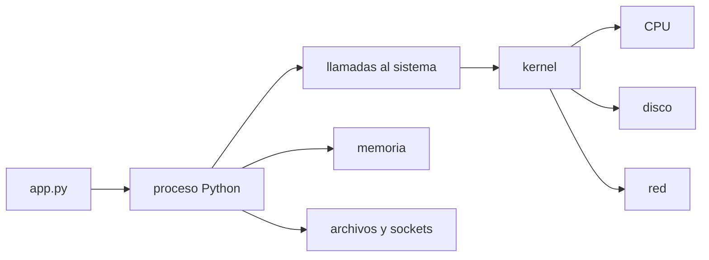
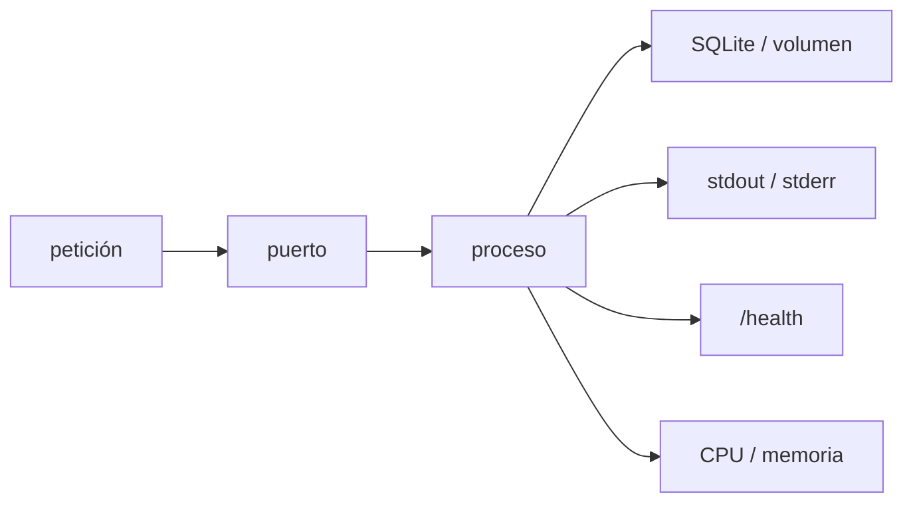
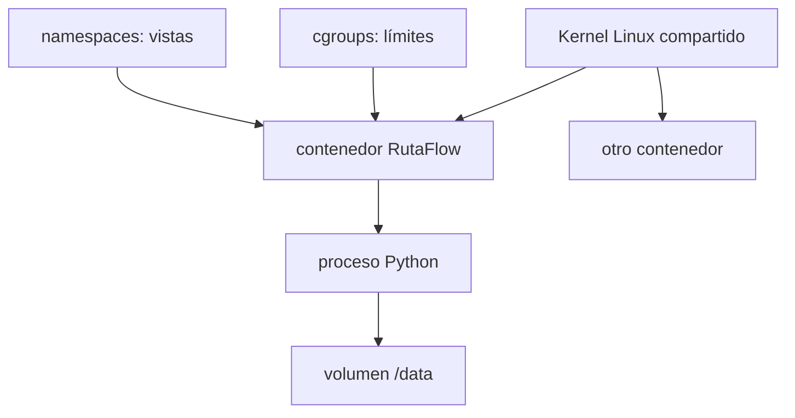

# Sistemas operativos, concurrencia, Linux y contenedores

Hasta ahora construiste un inventario, lo protegiste con pruebas y seguridad y separaste su arquitectura. En este capítulo aprenderás qué sucede **debajo** del código: quién entrega CPU y memoria, cómo dos tareas interfieren, cómo investigar un servicio Linux y qué hace realmente Docker. El objetivo no es memorizar comandos, sino formar un modelo mental para diagnosticar sistemas reales.


## Aprende construyendo

### Tema 1: El sistema operativo como administrador y frontera

#### Paso 1 · Objetivo y preparación
Al finalizar podrás aplicar este fundamento desde cero. Prerrequisitos: terminal, editor y las herramientas indicadas por el tema. Verifica sus versiones antes de empezar.

#### Paso 2 · Contexto y caso real
En un caso real de software, esta idea ayuda a construir, proteger, medir o explicar una plataforma de entregas con decisiones verificables.

#### Paso 3 · Teoría, modelo mental y analogía
Define conceptos, entradas, salidas, límites y una analogía cotidiana; distingue una hipótesis de una garantía y registra qué evidencia la respalda.

#### Paso 4 · Demostración guiada desde cero
Parte de una carpeta vacía:
```bash
mkdir ejemplo-fundamentos-avanzado
cd ejemplo-fundamentos-avanzado
python --version
mkdir src docs
printf "evidencia\n" > docs/README.md
cat docs/README.md
```
Crea src/ejemplo.txt con el modelo mínimo del tema y explica cada línea y salida.

#### Paso 5 · Práctica guiada
Pista: cambia deliberadamente una precondición para provocar un fallo deliberado; lee el diagnóstico, formula una hipótesis y corrígela. Resultado esperado: evidencia reproducible y regla explícita.

#### Paso 6 · Práctica independiente
Construye una variante con un caso normal, uno límite y uno inválido; compara dos alternativas y documenta coste, riesgo y decisión.

#### Paso 7 · Cierre y evidencia
Guarda código, comandos, salida, diagnóstico y reflexión; como siguiente paso conecta el fundamento con el track técnico elegido. Errores comunes: afirmar sin medir, ignorar límites, copiar comandos y no documentar recuperación. Fuentes oficiales: https://www.cs2023.org/ y https://www.swebok.org/.
**¿Por qué es importante?** Porque los fundamentos permiten comprender y diagnosticar cualquier stack.
**Evidencia de aprendizaje:** entrega modelo, ejemplo, fallo, corrección, comparación y conclusión.
**Conceptos clave:** hardware, kernel, espacio de usuario, llamada al sistema, programa, proceso, PID, descriptor de archivo, sistema de archivos, usuario, permisos, señal y código de salida.

Un **programa** es información almacenada en un archivo. Un **proceso** es una instancia viva del programa con identidad, memoria, recursos y estado. Al ejecutar `python app.py`, la shell pide al kernel crear un proceso. El kernel carga el intérprete, asigna memoria, agenda momentos de CPU y registra descriptores para entrada, salida y errores. Python no escribe directamente en el disco: solicita la operación mediante llamadas al sistema.

El kernel separa el acceso privilegiado al hardware del espacio de las aplicaciones. Esa frontera limita daños y permite compartir recursos. En Unix, cada proceso empieza normalmente con los descriptores `0` (stdin), `1` (stdout) y `2` (stderr).

```bash
python app.py >salida.log 2>errores.log &
ps -o pid,ppid,state,etime,command
kill -TERM 12345
```

`SIGTERM` solicita un apagado ordenado que el programa puede manejar para cerrar conexiones. `SIGKILL` termina inmediatamente y no puede manejarse; por eso `kill -9` no debe ser el primer recurso. El código de salida `0` comunica éxito y otro valor comunica un resultado excepcional que una shell o CI puede interpretar.

Los permisos clásicos distinguen propietario, grupo y otros mediante lectura (`r`), escritura (`w`) y ejecución (`x`). En una carpeta, `x` permite atravesarla. Conceder `777` oculta el diagnóstico y amplía el acceso. Investiga primero con `id`, `ls -ld` y `namei -l ruta`.

**Analogía:** el kernel es la administración de una biblioteca. Los lectores no entran al depósito: presentan solicitudes, reciben préstamos identificados y respetan permisos y turnos.

**¿Por qué es importante?** porque “permiso denegado”, un puerto ocupado o datos sin vaciar no se comprenden mirando solamente el código fuente.

**Casos de uso reales:** apagar una API sin perder solicitudes, investigar permisos, redirigir logs en CI y terminar un worker atascado conservando evidencia.

**Diagrama:**



#### Construcción RutaFlow: proceso que termina correctamente

Crea `rutaflow-fundamentos/29-procesos/src/worker.py`, que escriba por stdout, errores por stderr, maneje `SIGTERM` y devuelva código distinto de cero ante configuración inválida. Ejecuta `python src/worker.py >salida.log 2>errores.log &`, inspecciona PID con `ps` y envía `kill -TERM <PID>`. El resultado esperado registra cierre ordenado y código 0.

Fuerza un archivo sin permiso y diagnostica identidad y ruta con `id`, `ls -ld` y `namei -l`; no uses `chmod 777`. Como modificación, inicia dos procesos y explica PID/PPID y descriptores 0, 1 y 2. RutaFlow usa SIGKILL solo como último recurso porque impide vaciar buffers y cerrar transacciones.

### Tema 2: Memoria y concurrencia sin magia

#### Paso 1 · Objetivo y preparación
Al finalizar podrás aplicar este fundamento desde cero. Prerrequisitos: terminal, editor y las herramientas indicadas por el tema. Verifica sus versiones antes de empezar.

#### Paso 2 · Contexto y caso real
En un caso real de software, esta idea ayuda a construir, proteger, medir o explicar una plataforma de entregas con decisiones verificables.

#### Paso 3 · Teoría, modelo mental y analogía
Define conceptos, entradas, salidas, límites y una analogía cotidiana; distingue una hipótesis de una garantía y registra qué evidencia la respalda.

#### Paso 4 · Demostración guiada desde cero
Parte de una carpeta vacía:
```bash
mkdir ejemplo-fundamentos-avanzado
cd ejemplo-fundamentos-avanzado
python --version
mkdir src docs
printf "evidencia\n" > docs/README.md
cat docs/README.md
```
Crea src/ejemplo.txt con el modelo mínimo del tema y explica cada línea y salida.

#### Paso 5 · Práctica guiada
Pista: cambia deliberadamente una precondición para provocar un fallo deliberado; lee el diagnóstico, formula una hipótesis y corrígela. Resultado esperado: evidencia reproducible y regla explícita.

#### Paso 6 · Práctica independiente
Construye una variante con un caso normal, uno límite y uno inválido; compara dos alternativas y documenta coste, riesgo y decisión.

#### Paso 7 · Cierre y evidencia
Guarda código, comandos, salida, diagnóstico y reflexión; como siguiente paso conecta el fundamento con el track técnico elegido. Errores comunes: afirmar sin medir, ignorar límites, copiar comandos y no documentar recuperación. Fuentes oficiales: https://www.cs2023.org/ y https://www.swebok.org/.
**¿Por qué es importante?** Porque los fundamentos permiten comprender y diagnosticar cualquier stack.
**Evidencia de aprendizaje:** entrega modelo, ejemplo, fallo, corrección, comparación y conclusión.
**Conceptos clave:** memoria virtual, stack, heap, proceso, hilo, concurrencia, paralelismo, intercalado, sección crítica, condición de carrera, mutex, semáforo, deadlock e inmutabilidad.

Cada proceso observa un espacio de direcciones virtual propio. El sistema y el hardware traducen direcciones a memoria física. El **stack** contiene normalmente marcos de llamadas y variables locales; el **heap** guarda objetos con vida más flexible. Es un modelo útil, aunque los detalles dependen del lenguaje y su runtime.

Los hilos de un proceso comparten heap y descriptores, pero tienen stack y estado propios. **Concurrencia** significa que varias tareas progresan en períodos solapados; **paralelismo**, que ejecutan simultáneamente, por ejemplo en núcleos diferentes. Puede haber concurrencia en un solo núcleo por intercalado.

`saldo = saldo - cantidad` parece una operación, pero implica leer, calcular y escribir. Dos tareas pueden leer el mismo saldo antes de escribir y perder una actualización. El resultado depende entonces de un orden temporal no controlado: una condición de carrera.

```python
from threading import Lock

lock = Lock()

def retirar(conexion, producto_id, cantidad):
    with lock, conexion:
        cursor = conexion.execute(
            "UPDATE productos SET stock = stock - ? "
            "WHERE id = ? AND stock >= ?",
            (cantidad, producto_id, cantidad),
        )
        if cursor.rowcount != 1:
            raise ValueError("stock insuficiente")
```

El lock coordina hilos de este proceso; la transacción y la condición SQL protegen también cuando existen varios procesos. Bloquear demasiado reduce rendimiento. Dos tareas que esperan recursos bloqueados entre sí forman un **deadlock**. Se previene reduciendo estado compartido, adquiriendo locks en un orden constante, limitando esperas y prefiriendo mensajes o datos inmutables cuando corresponda.

**Analogía:** dos agentes venden el último asiento desde copias distintas. Un control de reserva atómico decide quién lo obtiene; pedir que trabajen más rápido no resuelve el conflicto.

**¿Por qué es importante?** porque las pruebas secuenciales pueden pasar y el sistema fallar únicamente bajo tráfico real. La corrección concurrente debe diseñarse como propiedad.

**Casos de uso reales:** descontar inventario, procesar pagos idempotentes, ejecutar workers, actualizar cachés y evitar migraciones simultáneas.

**Diagrama:**

```mermaid
sequenceDiagram
    participant A as Tarea A
    participant S as Stock compartido
    participant B as Tarea B
    A->>S: leer 10
    B->>S: leer 10
    A->>S: escribir 9
    B->>S: escribir 9
    Note over S: incorrecto 9; esperado 8
```

#### Construcción RutaFlow: carrera reproducible y corrección mínima

Crea `rutaflow-fundamentos/30-concurrencia/src/carrera.py` con dos hilos coordinados por una barrera para leer el mismo stock antes de escribir. Ejecuta `python src/carrera.py`; el resultado defectuoso esperado es 9. Añade `tests/test_concurrencia.py` y corrige primero con lock, luego con una actualización SQL condicional dentro de transacción para cubrir múltiples procesos.

Adquiere dos locks en orden inverso y usa timeout para observar riesgo de deadlock sin colgar indefinidamente. Como modificación, reemplaza estado compartido por mensajes inmutables y compara complejidad. RutaFlow protege la invariante completa; `volatile`, rapidez o una prueba secuencial no hacen atómico leer-calcular-escribir.

### Tema 3: Linux como entorno observable

#### Paso 1 · Objetivo y preparación
Al finalizar podrás aplicar este fundamento desde cero. Prerrequisitos: terminal, editor y las herramientas indicadas por el tema. Verifica sus versiones antes de empezar.

#### Paso 2 · Contexto y caso real
En un caso real de software, esta idea ayuda a construir, proteger, medir o explicar una plataforma de entregas con decisiones verificables.

#### Paso 3 · Teoría, modelo mental y analogía
Define conceptos, entradas, salidas, límites y una analogía cotidiana; distingue una hipótesis de una garantía y registra qué evidencia la respalda.

#### Paso 4 · Demostración guiada desde cero
Parte de una carpeta vacía:
```bash
mkdir ejemplo-fundamentos-avanzado
cd ejemplo-fundamentos-avanzado
python --version
mkdir src docs
printf "evidencia\n" > docs/README.md
cat docs/README.md
```
Crea src/ejemplo.txt con el modelo mínimo del tema y explica cada línea y salida.

#### Paso 5 · Práctica guiada
Pista: cambia deliberadamente una precondición para provocar un fallo deliberado; lee el diagnóstico, formula una hipótesis y corrígela. Resultado esperado: evidencia reproducible y regla explícita.

#### Paso 6 · Práctica independiente
Construye una variante con un caso normal, uno límite y uno inválido; compara dos alternativas y documenta coste, riesgo y decisión.

#### Paso 7 · Cierre y evidencia
Guarda código, comandos, salida, diagnóstico y reflexión; como siguiente paso conecta el fundamento con el track técnico elegido. Errores comunes: afirmar sin medir, ignorar límites, copiar comandos y no documentar recuperación. Fuentes oficiales: https://www.cs2023.org/ y https://www.swebok.org/.
**¿Por qué es importante?** Porque los fundamentos permiten comprender y diagnosticar cualquier stack.
**Evidencia de aprendizaje:** entrega modelo, ejemplo, fallo, corrección, comparación y conclusión.
**Conceptos clave:** shell, variable de entorno, pipe, proceso padre, daemon, servicio, log, socket, puerto, healthcheck, CPU, memoria y runbook.

Operar Linux no significa encadenar comandos desconocidos. Formula una pregunta y conserva evidencia. `pwd` responde dónde estás; `id`, con qué identidad; `ps`, qué procesos existen; `ss -ltnp`, qué sockets TCP escuchan; `df -h`, cuánto almacenamiento queda; `free -h`, el estado de memoria; `top`, actividad dinámica.

Un pipe conecta stdout de un proceso con stdin de otro. No comparte memoria:

```bash
ps -eo pid,user,%cpu,%mem,command | sort -k3 -nr | head
curl --fail --silent http://127.0.0.1:8000/health
ss -ltnp
```

Un servicio debe escribir logs útiles en stdout/stderr, responder una comprobación de salud y manejar `SIGTERM`. La salud debe indicar si puede cumplir su función, no solo si el proceso existe. Una variable de entorno configura, pero puede aparecer en inspecciones o procesos hijos: no es una caja fuerte. En producción, los secretos pertenecen al gestor de la plataforma y reciben acceso mínimo en ejecución.

**Analogía:** operar un servicio se parece a la medicina clínica: antes de intervenir, se observan signos, se formula una hipótesis y se solicita una prueba capaz de refutarla.

**¿Por qué es importante?** porque reiniciar a ciegas puede ocultar síntomas y destruir la evidencia necesaria para encontrar la causa raíz.

**Casos de uso reales:** localizar quién ocupa un puerto, distinguir falta de CPU de espera de I/O, detectar disco lleno, seguir logs y comprobar un despliegue.

**Diagrama:**



#### Construcción RutaFlow: runbook basado en preguntas

Crea `rutaflow-fundamentos/31-linux/src/server.py` con `/health` y logs a stdout, más `docs/runbook.md`. Ejecuta `python src/server.py`; comprueba `curl --fail http://127.0.0.1:8000/health`, `ss -ltnp` y `ps`. La evidencia esperada conecta puerto, PID, identidad, salud y consumo.

Ocupa previamente el puerto y diagnostica qué proceso escucha antes de terminarlo. Llena un directorio temporal controlado para observar un fallo de espacio sin afectar el sistema, y limpia después. Como modificación, define qué significa salud degradada frente a viva. RutaFlow conserva evidencia antes de reiniciar; una variable de entorno configura, pero no funciona como almacén seguro.

### Tema 4: Contenedores: aislamiento reproducible

#### Paso 1 · Objetivo y preparación
Al finalizar podrás aplicar este fundamento desde cero. Prerrequisitos: terminal, editor y las herramientas indicadas por el tema. Verifica sus versiones antes de empezar.

#### Paso 2 · Contexto y caso real
En un caso real de software, esta idea ayuda a construir, proteger, medir o explicar una plataforma de entregas con decisiones verificables.

#### Paso 3 · Teoría, modelo mental y analogía
Define conceptos, entradas, salidas, límites y una analogía cotidiana; distingue una hipótesis de una garantía y registra qué evidencia la respalda.

#### Paso 4 · Demostración guiada desde cero
Parte de una carpeta vacía:
```bash
mkdir ejemplo-fundamentos-avanzado
cd ejemplo-fundamentos-avanzado
python --version
mkdir src docs
printf "evidencia\n" > docs/README.md
cat docs/README.md
```
Crea src/ejemplo.txt con el modelo mínimo del tema y explica cada línea y salida.

#### Paso 5 · Práctica guiada
Pista: cambia deliberadamente una precondición para provocar un fallo deliberado; lee el diagnóstico, formula una hipótesis y corrígela. Resultado esperado: evidencia reproducible y regla explícita.

#### Paso 6 · Práctica independiente
Construye una variante con un caso normal, uno límite y uno inválido; compara dos alternativas y documenta coste, riesgo y decisión.

#### Paso 7 · Cierre y evidencia
Guarda código, comandos, salida, diagnóstico y reflexión; como siguiente paso conecta el fundamento con el track técnico elegido. Errores comunes: afirmar sin medir, ignorar límites, copiar comandos y no documentar recuperación. Fuentes oficiales: https://www.cs2023.org/ y https://www.swebok.org/.
**¿Por qué es importante?** Porque los fundamentos permiten comprender y diagnosticar cualquier stack.
**Evidencia de aprendizaje:** entrega modelo, ejemplo, fallo, corrección, comparación y conclusión.
**Conceptos clave:** máquina virtual, contenedor, imagen, capa, registro, namespace, cgroup, volumen, red, puerto, usuario no root, build reproducible y cadena de suministro.

Una máquina virtual incluye un sistema operativo invitado. Un contenedor es un conjunto de procesos aislados que **comparte el kernel del host**. Los namespaces separan vistas como procesos, red y mounts; los cgroups limitan o contabilizan recursos. Una imagen es una plantilla inmutable por capas; un contenedor es su ejecución con una capa escribible efímera.

Docker mejora repetibilidad, pero no vuelve segura una aplicación. Dependencias sin fijar cambian entre builds; root aumenta impacto; copiar secretos los conserva en capas; guardar SQLite en la capa efímera pierde datos al recrear. Los datos durables pertenecen a un volumen.

```dockerfile
FROM python:3.12-slim
WORKDIR /app
RUN useradd --create-home --uid 10001 appuser
COPY requirements.txt ./
RUN pip install --no-cache-dir -r requirements.txt
COPY src ./src
RUN mkdir /data && chown appuser:appuser /data
USER appuser
ENV INVENTORY_DB=/data/inventory.db
EXPOSE 8000
CMD ["python", "-m", "src.server"]
```

`EXPOSE` documenta; no publica un puerto. `-p 127.0.0.1:8000:8000` conecta host y contenedor. `-v inventory-data:/data` conserva SQLite. `.dockerignore` excluye `.git`, entornos y secretos del contexto. Los límites requieren pruebas: observa si el servicio degrada, rechaza trabajo o termina de forma controlada.

**Analogía:** una imagen es una receta sellada y un contenedor una preparación concreta. El volumen es la despensa externa: puedes sustituir la cocina sin perder ingredientes persistentes.

**¿Por qué es importante?** porque “funciona en mi máquina” suele ocultar diferencias de dependencias, identidad, configuración y filesystem.

**Casos de uso reales:** CI reproducible, despliegue de APIs, herramientas aisladas y entornos desechables. Un contenedor no es una frontera absoluta contra código hostil.

**Diagrama:**



#### Construcción RutaFlow: imagen reemplazable, datos durables

Crea `rutaflow-fundamentos/32-contenedores/Dockerfile`, `.dockerignore`, `compose.yaml` y `src/server.py`. Construye con `docker compose build`, levanta con `docker compose up -d` y verifica salud, usuario no root y volumen. El resultado esperado conserva una guía después de `docker compose down` y recreación.

Guarda temporalmente SQLite fuera del volumen y comprueba la pérdida al reemplazar el contenedor; corrige `INVENTORY_DB=/data/inventory.db`. Como modificación, limita memoria/CPU, envía SIGTERM durante trabajo y prueba cierre antes del deadline. RutaFlow escucha `0.0.0.0` dentro pero publica `127.0.0.1` en desarrollo; `EXPOSE` no publica y un contenedor no es una frontera absoluta para código hostil.


## Construcción guiada del capítulo

### Proyecto 8 — Inventario operable en un contenedor

Parte de la raíz del proyecto acumulativo. Si no tienes servidor HTTP, crea un adaptador mínimo con `GET /health` y una consulta; no coloques lógica de negocio en las rutas.

1. Crea `Dockerfile`, `.dockerignore` y `compose.yaml` desde archivos vacíos.
2. Fija dependencias, crea un usuario sin privilegios y usa forma exec en `CMD`.
3. Monta un volumen en `/data`; aplica la migración al ejecutar, nunca durante el build.
4. Añade healthcheck con inicio, intervalo, timeout y reintentos razonados.
5. Publica el puerto en `127.0.0.1` durante desarrollo y añade límites de CPU/memoria.
6. Envía `SIGTERM` durante una petición y confirma cierre limpio de SQLite.
7. Ejecuta retiradas simultáneas y demuestra que nunca aparece stock negativo.
8. Recrea el contenedor y prueba persistencia; usa otro volumen para demostrar aislamiento.
9. Escribe `docs/runbook.md`: iniciar, salud, logs, backup, restore, actualización, reversión y fallos comunes.

```yaml
services:
  inventory:
    build: .
    ports: ["127.0.0.1:8000:8000"]
    volumes: ["inventory-data:/data"]
    init: true
    healthcheck:
      test: ["CMD", "python", "-m", "src.healthcheck"]
      interval: 10s
      timeout: 3s
      retries: 3
    mem_limit: 256m
    cpus: 0.50
volumes:
  inventory-data:
```

**Verificación:** conserva la salida de la configuración resuelta, build, usuario, salud, límites, prueba concurrente, señal y recreación con datos. Las pruebas deben pasar fuera y dentro de la imagen. Otra persona debe reproducirlo siguiendo solo el README.

**Errores comunes y soluciones**

- Permiso denegado en `/data`: inspecciona UID/GID; no concedas `777`.
- Solo responde dentro: escucha en `0.0.0.0` dentro y restringe la publicación en el host.
- Datos desaparecen: confirma que SQLite usa la ruta montada.
- `SIGTERM` no llega: usa `CMD` exec y evita una shell como PID 1.
- Carrera pese al lock: un lock local no coordina varios procesos; protege en la base.
