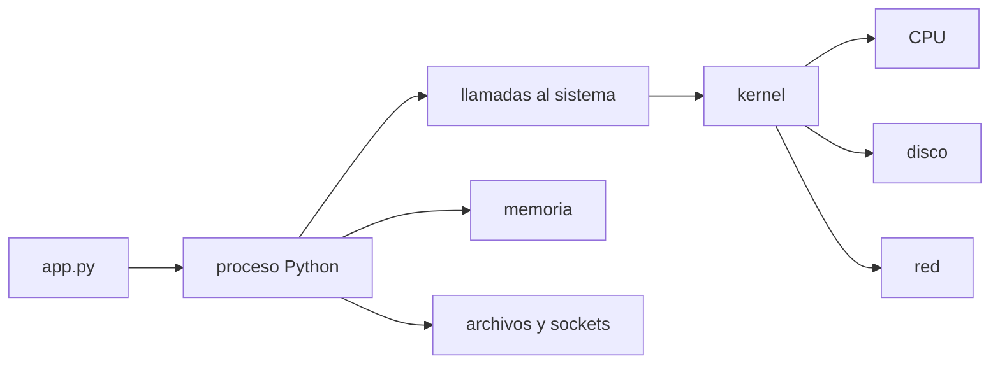
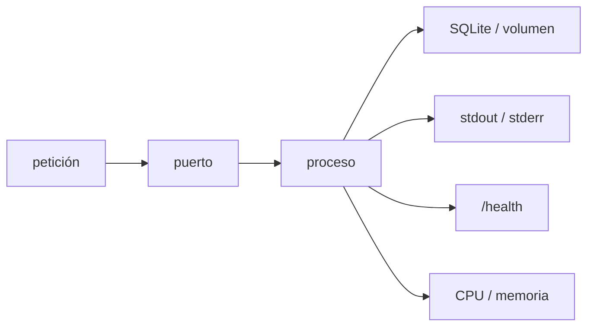
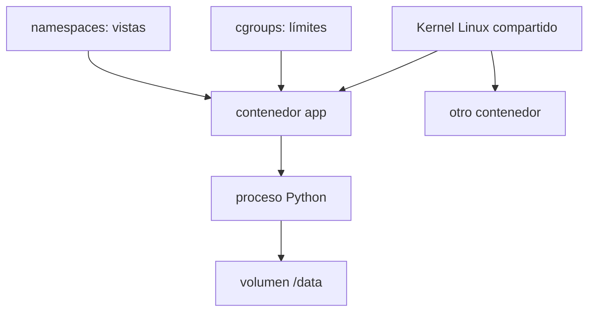

# Sistemas operativos, concurrencia, Linux y contenedores

Hasta ahora construiste un inventario, lo protegiste con pruebas y seguridad y separaste su arquitectura. En este capítulo aprenderás qué sucede **debajo** del código: quién entrega CPU y memoria, cómo dos tareas interfieren, cómo investigar un servicio Linux y qué hace realmente Docker. El objetivo no es memorizar comandos, sino formar un modelo mental para diagnosticar sistemas reales.


## Aprende construyendo

### Tema 1: El sistema operativo como administrador y frontera

#### Paso 1 · Objetivo y preparación
Al finalizar vas a lanzar como proceso real el cálculo de ruta de `examples/rutaflow/foundation/domain.py`, inspeccionarlo con `ps` y detenerlo con una señal. Prerrequisitos: Python 3 instalado.

#### Paso 2 · Contexto y caso real
El proyecto integrador Fundamentos que construirás a lo largo de estos 12 módulos es: el proyecto integrador Fundamentos: escribirás pruebas para cada función del gestor de tareas. `nearest_neighbor_route` de RutaFlow puede tardar notablemente en una zona con muchas paradas — si un operador necesita cancelarlo a mitad de camino, necesita entender qué hace el sistema operativo con ese proceso, no solo con el código Python.

#### Paso 3 · Teoría, modelo mental y analogía
Un programa es el archivo `domain.py`; un proceso es ese programa corriendo de verdad, con PID, memoria y descriptores propios — el kernel es el bibliotecario que presta esos recursos, nunca el programa accediendo directo al hardware.

#### Paso 4 · Demostración guiada desde cero
```bash
python3 -c "
import time
from examples.rutaflow.foundation.domain import Stop, nearest_neighbor_route
paradas = [Stop(f'RF-{i}', i*0.01, i*0.01) for i in range(50000)]
time.sleep(5)
nearest_neighbor_route((0,0), paradas)
" &
ps -o pid,ppid,state,etime,command | grep python3
```
Resultado esperado: `ps` muestra el proceso con su propio PID, su estado y el tiempo transcurrido — el cálculo O(n²) sobre 50000 paradas todavía no terminó, y el sistema operativo ya le asignó identidad y recursos propios desde el instante en que arrancó.

#### Paso 5 · Práctica guiada
Pista: enviá `kill -9 <PID>` (SIGKILL) a ese proceso mientras todavía calcula — ese es el fallo deliberado: el proceso termina de inmediato sin poder liberar nada ni loguear qué estaba haciendo, a diferencia de `kill -TERM <PID>`, que le daría la oportunidad de cerrar ordenadamente.

#### Paso 6 · Práctica independiente
Repetí el cálculo con una lista de paradas mucho más chica (50 en vez de 50000), y comparzá cuánto tarda en terminar solo con el tiempo reportado por `ps -o etime` en ambos casos — documentando por qué `kill -TERM` sí alcanzaría a interrumpirlo a tiempo en el caso chico.

#### Paso 7 · Cierre y evidencia
Entregá el proceso real inspeccionado con `ps` del Paso 4, la terminación abrupta con SIGKILL del Paso 5, y la comparación de tiempos del Paso 6; explicá la diferencia entre SIGTERM y SIGKILL en términos de qué puede (y qué no puede) hacer tu código antes de terminar. Errores comunes: afirmar sin medir, ignorar límites, copiar comandos y no documentar recuperación. Fuentes oficiales: https://www.cs2023.org/ y https://www.swebok.org/.
**¿Por qué es importante?** Porque los fundamentos permiten comprender y diagnosticar cualquier stack.
**Escenario:** Tu worker de validación procesa batches de 1000 entregas. Recibe SIGTERM a mitad de un batch. ¿Cómo terminas sin corrupción?

**Tu tarea:**
1. Diseña qué debe pasar en el handler.
2. ¿Cómo evitas que SIGTERM intervenga en medio de una transacción BD?
3. ¿Timeout de gracia? ¿Cuántos segundos?
4. ¿Qué logueas antes de salir?

[SOLUCIÓN PLEGADA]
> Handler: cambiar flag `shutdown_requested=True`, rechazar entrada, esperar workers en vuelo. Protección BD: transacciones son atómicas — si SIGTERM interrumpe, la BD revierte automáticamente (el conexión se cierra). Timeout de gracia: 30 segundos (configurable, < readiness probe de Kubernetes). Log: `{timestamp, entregas_procesadas, entregas_pendientes, motivo_salida}`. Salir con código 0 (éxito ordenado) para que Kubernetes no reinicie indefinidamente.

**Evidencia de aprendizaje:** entrega modelo, ejemplo, fallo, corrección, comparación y conclusión.
**Conceptos clave:** hardware, kernel, espacio de usuario, llamada al sistema, programa, proceso, PID, descriptor de archivo, sistema de archivos, usuario, permisos, señal y código de salida.

Un **programa** es información almacenada en un archivo. Un **proceso** es una instancia viva del programa con identidad, memoria, recursos y estado. Al ejecutar `python app.py`, la shell pide al kernel crear un proceso. El kernel carga el intérprete, asigna memoria, agenda momentos de CPU y registra descriptores para entrada, salida y errores. Python no escribe directamente en el disco: solicita la operación mediante llamadas al sistema.

El kernel separa el acceso privilegiado al hardware del espacio de las aplicaciones. Esa frontera limita daños y permite compartir recursos. En Unix, cada proceso empieza normalmente con los descriptores `0` (stdin), `1` (stdout) y `2` (stderr).

```bash
python app.py >salida.log 2>errores.log &
ps -o pid,ppid,state,etime,command
kill -TERM 12345
```

`SIGTERM` solicita un apagado ordenado que el programa puede manejar para cerrar conexiones. `SIGKILL` termina inmediatamente y no puede manejarse; por eso `kill -9` no debe ser el primer recurso. El código de salida `0` comunica éxito y otro valor comunica un resultado excepcional que una shell o CI puede interpretar.

Los permisos clásicos distinguen propietario, grupo y otros mediante lectura (`r`), escritura (`w`) y ejecución (`x`). En una carpeta, `x` permite atravesarla. Conceder `777` oculta el diagnóstico y amplía el acceso. Investiga primero con `id`, `ls -ld` y `namei -l ruta`.

**Analogía:** el kernel es la administración de una biblioteca. Los lectores no entran al depósito: presentan solicitudes, reciben préstamos identificados y respetan permisos y turnos.

**¿Por qué es importante?** porque “permiso denegado”, un puerto ocupado o datos sin vaciar no se comprenden mirando solamente el código fuente.

**Casos de uso reales:** apagar una API sin perder solicitudes, investigar permisos, redirigir logs en CI y terminar un worker atascado conservando evidencia.

**Diagrama:**


```mermaid
flowchart LR
    FILE["app.py"] --> PROCESS["proceso Python"] --> SYSCALL["llamadas al sistema"] --> KERNEL["kernel"]
    PROCESS --> MEMORY["memoria"]
    PROCESS --> FD["archivos y sockets"]
    KERNEL --> CPU["CPU"]
    KERNEL --> DISK["disco"]
    KERNEL --> NET["red"]
```


#### Paso 8 · Pruebas unitarias para el CLI

**Escribe tests para la función `agregar_tarea(titulo)`:**

```python
def test_agregar_tarea_valida():
    assert agregar_tarea("Comprar leche") == True

def test_agregar_tarea_vacia():
    assert agregar_tarea("") == False
```

**¿Por qué importa?** Sin tests, no sabes si tu código funciona cuando lo cambias.
### Tema 2: Memoria y concurrencia sin magia

#### Paso 1 · Objetivo y preparación
Al finalizar vas a provocar una condición de carrera real sobre el contador de capacidad de un vehículo de reparto, y a corregirla con un lock. Prerrequisitos: Python 3 instalado.

#### Paso 2 · Contexto y caso real
Si dos procesos de asignación intentaran reservar un lugar en el mismo vehículo al mismo tiempo (dos envíos asignándose casi simultáneamente), ambos podrían leer la misma capacidad disponible antes de que ninguno la actualice — perdiendo una reserva sin que nadie lo note.

#### Paso 3 · Teoría, modelo mental y analogía
`capacidad = capacidad - 1` no es una operación atómica: es leer, calcular y escribir — dos hilos pueden leer el mismo valor antes de que ninguno escriba, perdiendo una actualización, igual que dos agentes vendiendo el mismo último asiento desde copias separadas.

#### Paso 4 · Demostración guiada desde cero
```python
from threading import Thread

capacidad = {"disponible": 10}

def reservar_lugar():
    actual = capacidad["disponible"]
    capacidad["disponible"] = actual - 1

hilos = [Thread(target=reservar_lugar) for _ in range(10)]
[h.start() for h in hilos]
[h.join() for h in hilos]
print(capacidad["disponible"])
```
Resultado esperado: en la mayoría de las corridas, el resultado NO es `0` (el esperado tras 10 reservas de un vehículo con capacidad 10) — algunas actualizaciones se pisan entre sí, y el número exacto varía de ejecución en ejecución.

#### Paso 5 · Práctica guiada
Pista: ese resultado inconsistente del Paso 4 ES el fallo deliberado — corrélo varias veces y anotá que el número final cambia entre corridas (a veces 2, a veces 4, nunca garantizado 0), la firma de una condición de carrera real, no un bug determinista que siempre falla igual.

#### Paso 6 · Práctica independiente
Corregí el Paso 4 envolviendo la lectura-cálculo-escritura en un `Lock()` (como en el ejemplo de `retirar()` de este mismo Tema), y confirmá que ahora el resultado es siempre `0`, sin importar cuántas veces repitas la corrida.

#### Paso 7 · Cierre y evidencia
Entregá el resultado inconsistente del Paso 4-5, y el resultado corregido y determinista del Paso 6; explicá por qué un lock en un solo proceso no alcanzaría si la asignación de vehículos corriera en dos procesos o instancias distintas. Errores comunes: afirmar sin medir, ignorar límites, copiar comandos y no documentar recuperación. Fuentes oficiales: https://www.cs2023.org/ y https://www.swebok.org/.
**¿Por qué es importante?** Porque los fundamentos permiten comprender y diagnosticar cualquier stack.
**Escenario:** Dos procesos en tu inventario: uno transfiere stock de bodega A a B, otro de B a A. Ambos pueden quedarse bloqueados esperándose mutuamente.

**Tu tarea:**
1. Escribe código en pseudocódigo que deadlocker.
2. ¿Por qué ocurre? (Condiciones de Coffman.)
3. ¿Cómo detectarlo? (Timeout, detector de ciclos.)
4. ¿Cómo prevenirlo sin sacrificar concurrencia?

[SOLUCIÓN PLEGADA]
> Pseudocódigo: P1 lock(A) → lock(B); P2 lock(B) → lock(A). Ambas retienen un lock y esperan al otro. Condiciones Coffman: (1) exclusión mutua (locks), (2) sin preemption (no desalojar), (3) retención con espera, (4) espera circular. Detección: timeout en lock (si esperas >30s, rollback), o detector de ciclos de espera. Prevención: ordenar locks (A siempre antes de B) o usar transacciones serializables que detectan y revierten.

**Evidencia de aprendizaje:** entrega modelo, ejemplo, fallo, corrección, comparación y conclusión.
**Conceptos clave:** memoria virtual, stack, heap, proceso, hilo, concurrencia, paralelismo, intercalado, sección crítica, condición de carrera, mutex, semáforo, deadlock e inmutabilidad.

Cada proceso observa un espacio de direcciones virtual propio. El sistema y el hardware traducen direcciones a memoria física. El **stack** contiene normalmente marcos de llamadas y variables locales; el **heap** guarda objetos con vida más flexible. Es un modelo útil, aunque los detalles dependen del lenguaje y su runtime.

Los hilos de un proceso comparten heap y descriptores, pero tienen stack y estado propios. **Concurrencia** significa que varias tareas progresan en períodos solapados; **paralelismo**, que ejecutan simultáneamente, por ejemplo en núcleos diferentes. Puede haber concurrencia en un solo núcleo por intercalado.

`saldo = saldo - cantidad` parece una operación, pero implica leer, calcular y escribir. Dos tareas pueden leer el mismo saldo antes de escribir y perder una actualización. El resultado depende entonces de un orden temporal no controlado: una condición de carrera.

```python
from threading import Lock

lock = Lock()

def retirar(conexion, producto_id, cantidad):
    with lock, conexion:
        cursor = conexion.execute(
            "UPDATE productos SET stock = stock - ? "
            "WHERE id = ? AND stock >= ?",
            (cantidad, producto_id, cantidad),
        )
        if cursor.rowcount != 1:
            raise ValueError("stock insuficiente")
```

El lock coordina hilos de este proceso; la transacción y la condición SQL protegen también cuando existen varios procesos. Bloquear demasiado reduce rendimiento. Dos tareas que esperan recursos bloqueados entre sí forman un **deadlock**. Se previene reduciendo estado compartido, adquiriendo locks en un orden constante, limitando esperas y prefiriendo mensajes o datos inmutables cuando corresponda.

**Analogía:** dos agentes venden el último asiento desde copias distintas. Un control de reserva atómico decide quién lo obtiene; pedir que trabajen más rápido no resuelve el conflicto.

**¿Por qué es importante?** porque las pruebas secuenciales pueden pasar y el sistema fallar únicamente bajo tráfico real. La corrección concurrente debe diseñarse como propiedad.

**Casos de uso reales:** descontar inventario, procesar pagos idempotentes, ejecutar workers, actualizar cachés y evitar migraciones simultáneas.

**Diagrama:**

```mermaid
sequenceDiagram
    participant A as Tarea A
    participant S as Stock compartido
    participant B as Tarea B
    A->>S: leer 10
    B->>S: leer 10
    A->>S: escribir 9
    B->>S: escribir 9
    Note over S: incorrecto 9; esperado 8
```

### Tema 3: Linux como entorno observable

#### Paso 1 · Objetivo y preparación
Al finalizar vas a diagnosticar, con herramientas reales de Linux, un servicio mínimo que expone la lógica de `domain.py` como endpoint de salud. Prerrequisitos: Python 3 instalado; Tema 1 de este módulo.

#### Paso 2 · Contexto y caso real
Si el servicio que calcula rutas para RutaFlow dejara de responder, un operador necesita un flujo real de diagnóstico — no adivinar reiniciando a ciegas y perdiendo la evidencia de qué estaba pasando.

#### Paso 3 · Teoría, modelo mental y analogía
Operar un servicio es como la medicina clínica: observás signos (CPU, puertos, logs) antes de intervenir, en vez de "reiniciar y ver si se arregla".

#### Paso 4 · Demostración guiada desde cero
```bash
python3 -m http.server 8000 --directory /tmp &
sleep 1
curl --fail --silent http://127.0.0.1:8000/ > /dev/null && echo "sano"
ss -ltnp | grep 8000
ps -o pid,ppid,%cpu,%mem,command | grep http.server
```
Resultado esperado: `curl --fail` confirma que el servicio responde (`sano`); `ss -ltnp` muestra el puerto `8000` escuchando con su PID; `ps` confirma el mismo proceso con su consumo real de CPU y memoria — tres ángulos distintos del mismo servicio, antes de tocar nada.

#### Paso 5 · Práctica guiada
Pista: matá el proceso con `kill -9 <PID>` y repetí el mismo `curl --fail` — ese es el fallo deliberado reproducido a propósito: el comando termina con error (código de salida distinto de 0) en vez de "sano", confirmando con evidencia, no con una suposición, que el servicio ya no responde.

#### Paso 6 · Práctica independiente
Repetí el Paso 4 completo, pero esta vez redirigiendo la salida del servidor a un log (`> servicio.log 2>&1 &`) y seguilo con `tail -f servicio.log` mientras hacés una petición — documentando qué evidencia adicional te da el log que `ps` y `ss` no muestran.

#### Paso 7 · Cierre y evidencia
Entregá los tres ángulos de diagnóstico del Paso 4, el fallo real confirmado con `curl --fail` del Paso 5, y el log seguido en vivo del Paso 6; explicá por qué reiniciar sin esta evidencia previa puede ocultar la causa raíz de un fallo real. Errores comunes: afirmar sin medir, ignorar límites, copiar comandos y no documentar recuperación. Fuentes oficiales: https://www.cs2023.org/ y https://www.swebok.org/.
**¿Por qué es importante?** Porque los fundamentos permiten comprender y diagnosticar cualquier stack.
**Escenario:** Tu worker de validación "usa demasiada memoria" según quejas. Necesitas inspeccionar `/proc/PID/status` para diagnosticar.

**Tu tarea:**
1. ¿Qué es `VmRSS` vs `VmSize`? ¿Cuál es el problema real?
2. ¿Qué es `VmPeak`? ¿Cuándo es útil?
3. Lee `/proc/self/status` en vivo desde tu shell, explica 5 campos.
4. ¿Cómo una fuga de memoria se ve en `/proc`?

[SOLUCIÓN PLEGADA]
> `VmSize`: memoria virtual total; `VmRSS`: resident (realmente usada). Si VmSize >> VmRSS, es fragmentación, no fuga. `VmPeak`: máximo histórico de VmSize. Una fuga se ve como `VmRSS` creciente sin límite. `FDSize`: file descriptors abiertos (fuga de archivos o sockets se vería como FDSize creciente). `Threads`: cantidad de hilos (spike indebido señala paralización descontrolada).

**Evidencia de aprendizaje:** entrega modelo, ejemplo, fallo, corrección, comparación y conclusión.
**Conceptos clave:** shell, variable de entorno, pipe, proceso padre, daemon, servicio, log, socket, puerto, healthcheck, CPU, memoria y runbook.

Operar Linux no significa encadenar comandos desconocidos. Formula una pregunta y conserva evidencia. `pwd` responde dónde estás; `id`, con qué identidad; `ps`, qué procesos existen; `ss -ltnp`, qué sockets TCP escuchan; `df -h`, cuánto almacenamiento queda; `free -h`, el estado de memoria; `top`, actividad dinámica.

Un pipe conecta stdout de un proceso con stdin de otro. No comparte memoria:

```bash
ps -eo pid,user,%cpu,%mem,command | sort -k3 -nr | head
curl --fail --silent http://127.0.0.1:8000/health
ss -ltnp
```

`--fail` es la bandera que hace que `curl` termine con error si la respuesta HTTP es un código de fallo (en vez de imprimir la página de error como si fuera éxito), y `--silent` es la bandera que oculta la barra de progreso, dejando solo la respuesta. Un servicio debe escribir logs útiles en stdout/stderr, responder una comprobación de salud y manejar `SIGTERM`. La salud debe indicar si puede cumplir su función, no solo si el proceso existe. Una variable de entorno configura, pero puede aparecer en inspecciones o procesos hijos: no es una caja fuerte. En producción, los secretos pertenecen al gestor de la plataforma y reciben acceso mínimo en ejecución.

**Analogía:** operar un servicio se parece a la medicina clínica: antes de intervenir, se observan signos, se formula una hipótesis y se solicita una prueba capaz de refutarla.

**¿Por qué es importante?** porque reiniciar a ciegas puede ocultar síntomas y destruir la evidencia necesaria para encontrar la causa raíz.

**Casos de uso reales:** localizar quién ocupa un puerto, distinguir falta de CPU de espera de I/O, detectar disco lleno, seguir logs y comprobar un despliegue.

**Diagrama:**


```mermaid
flowchart LR
    REQUEST["petición"] --> PORT["puerto"] --> PROCESS2["proceso"] --> DATA["SQLite / volumen"]
    PROCESS2 --> LOGS["stdout / stderr"]
    PROCESS2 --> HEALTH["/health"]
    PROCESS2 --> METRICS["CPU / memoria"]
```

### Tema 4: Contenedores: aislamiento reproducible

#### Paso 1 · Objetivo y preparación
Al finalizar vas a contenerizar `domain.py` de RutaFlow con un usuario sin privilegios y a confirmar que los datos sobreviven a recrear el contenedor. Prerrequisitos: Docker instalado; Tema 3 de este módulo.

#### Paso 2 · Contexto y caso real
Si el cálculo de rutas de RutaFlow corriera en un contenedor, necesitaría guardar un caché de rutas calculadas en un volumen — perderlo cada vez que se recrea el contenedor sería inaceptable para un servicio real.

#### Paso 3 · Teoría, modelo mental y analogía
La imagen es una receta sellada; el contenedor es una preparación concreta de esa receta; el volumen es la despensa externa — podés cambiar la cocina (recrear el contenedor) sin perder lo que había en la despensa.

#### Paso 4 · Demostración guiada desde cero
```dockerfile
FROM python:3.12-slim
WORKDIR /app
RUN useradd --create-home --uid 10001 rutaflow
COPY examples/rutaflow/foundation/domain.py ./domain.py
RUN mkdir /data && chown rutaflow:rutaflow /data
USER rutaflow
CMD ["python", "-c", "from domain import nearest_neighbor_route, Stop; print(nearest_neighbor_route((0,0),[Stop('RF-1',1,1)]))"]
```
```bash
docker build -t rutaflow-rutas .
docker run --rm -v rutaflow-cache:/data rutaflow-rutas
```
Resultado esperado: el contenedor corre como `rutaflow` (UID 10001), nunca como root, e imprime la ruta calculada — el mismo cálculo del Tema 1, ahora empaquetado de forma reproducible.

#### Paso 5 · Práctica guiada
Pista: quitá `USER rutaflow` del Dockerfile y volvé a construir — ese es el fallo deliberado: el proceso dentro del contenedor corre como root, aumentando el impacto de cualquier vulnerabilidad en el código o en una dependencia, exactamente lo que el usuario no privilegiado existía para evitar.

#### Paso 6 · Práctica independiente
Corregí el Paso 5 restaurando `USER rutaflow`, escribí un archivo dentro de `/data` desde el contenedor, recreá el contenedor por completo (`docker rm` + `docker run` de nuevo con el mismo volumen), y confirmá que el archivo sigue ahí — la prueba de que el volumen, no el contenedor, es lo que persiste.

#### Paso 7 · Cierre y evidencia
Entregá el contenedor corriendo como usuario no root del Paso 4, el root innecesario detectado del Paso 5, y la persistencia confirmada del Paso 6; explicá por qué "funciona en mi máquina" suele ocultar justo estas diferencias de identidad y filesystem. Errores comunes: afirmar sin medir, ignorar límites, copiar comandos y no documentar recuperación. Fuentes oficiales: https://www.cs2023.org/ y https://www.swebok.org/.
**¿Por qué es importante?** Porque los fundamentos permiten comprender y diagnosticar cualquier stack.
**Escenario:** Tu worker y tu BD corren en el mismo `docker-compose.yml`. Sin límites, el worker consume toda la RAM y mata la BD. Necesitas garantizar 512MB para BD, 256MB para worker.

**Tu tarea:**
1. Escribe `docker-compose.yml` con `limits` y `reservations`.
2. ¿Cuál es la diferencia? (Soft vs hard.)
3. ¿Qué pasa cuando worker se pasa del límite?
4. ¿Cómo monitorearlo sin instrumentación adicional?

[SOLUCIÓN PLEGADA]
> `limits: memory: 256M` es OOMKill hard. `reservations: memory: 256M` es solicitud al scheduler, no hard. Docker-compose usa ambas: reservations para scheduling, limits para evitar OOM. Si se pasa límite, proceso recibe SIGKILL (crash). Monitorear: `docker stats` muestra uso vivo. En Kubernetes, readiness/liveness probes detectan crash; agregar métricas: `RSS / limit` a Prometheus y alertar si > 90%.

**Evidencia de aprendizaje:** entrega modelo, ejemplo, fallo, corrección, comparación y conclusión.
**Conceptos clave:** máquina virtual, contenedor, imagen, capa, registro, namespace, cgroup, volumen, red, puerto, usuario no root, build reproducible y cadena de suministro.

Una máquina virtual incluye un sistema operativo invitado. Un contenedor es un conjunto de procesos aislados que **comparte el kernel del host**. Los namespaces separan vistas como procesos, red y mounts; los cgroups limitan o contabilizan recursos. Una imagen es una plantilla inmutable por capas; un contenedor es su ejecución con una capa escribible efímera.

Docker mejora repetibilidad, pero no vuelve segura una aplicación. Dependencias sin fijar cambian entre builds; root aumenta impacto; copiar secretos los conserva en capas; guardar SQLite en la capa efímera pierde datos al recrear. Los datos durables pertenecen a un volumen.

```dockerfile
FROM python:3.12-slim
WORKDIR /app
RUN useradd --create-home --uid 10001 appuser
COPY requirements.txt ./
RUN pip install --no-cache-dir -r requirements.txt
COPY src ./src
RUN mkdir /data && chown appuser:appuser /data
USER appuser
ENV INVENTORY_DB=/data/inventory.db
EXPOSE 8000
CMD ["python", "-m", "src.server"]
```

`EXPOSE` documenta; no publica un puerto. `-p 127.0.0.1:8000:8000` conecta host y contenedor. `-v inventory-data:/data` conserva SQLite. `.dockerignore` excluye `.git`, entornos y secretos del contexto. Los límites requieren pruebas: observa si el servicio degrada, rechaza trabajo o termina de forma controlada.

**Analogía:** una imagen es una receta sellada y un contenedor una preparación concreta. El volumen es la despensa externa: puedes sustituir la cocina sin perder ingredientes persistentes.

**¿Por qué es importante?** porque “funciona en mi máquina” suele ocultar diferencias de dependencias, identidad, configuración y filesystem.

**Casos de uso reales:** CI reproducible, despliegue de APIs, herramientas aisladas y entornos desechables. Un contenedor no es una frontera absoluta contra código hostil.

**Diagrama:**


```mermaid
flowchart TB
    KERNEL2["Kernel Linux compartido"] --> C1["contenedor app"]
    KERNEL2 --> C2["otro contenedor"]
    C1 --> PY["proceso Python"] --> VOL["volumen /data"]
    LIMITS["cgroups: límites"] --> C1
    NS["namespaces: vistas"] --> C1
```

## Construcción guiada del capítulo

### Proyecto 8 — Inventario operable en un contenedor

Parte de la raíz del proyecto acumulativo. Si no tienes servidor HTTP, crea un adaptador mínimo con `GET /health` y una consulta; no coloques lógica de negocio en las rutas.

1. Crea `Dockerfile`, `.dockerignore` y `compose.yaml` desde archivos vacíos.
2. Fija dependencias, crea un usuario sin privilegios y usa forma exec en `CMD`.
3. Monta un volumen en `/data`; aplica la migración al ejecutar, nunca durante el build.
4. Añade healthcheck con inicio, intervalo, timeout y reintentos razonados.
5. Publica el puerto en `127.0.0.1` durante desarrollo y añade límites de CPU/memoria.
6. Envía `SIGTERM` durante una petición y confirma cierre limpio de SQLite.
7. Ejecuta retiradas simultáneas y demuestra que nunca aparece stock negativo.
8. Recrea el contenedor y prueba persistencia; usa otro volumen para demostrar aislamiento.
9. Escribe `docs/runbook.md`: iniciar, salud, logs, backup, restore, actualización, reversión y fallos comunes.

```yaml
services:
  inventory:
    build: .
    ports: ["127.0.0.1:8000:8000"]
    volumes: ["inventory-data:/data"]
    init: true
    healthcheck:
      test: ["CMD", "python", "-m", "src.healthcheck"]
      interval: 10s
      timeout: 3s
      retries: 3
    mem_limit: 256m
    cpus: 0.50
volumes:
  inventory-data:
```

**Verificación:** conserva la salida de la configuración resuelta, build, usuario, salud, límites, prueba concurrente, señal y recreación con datos. Las pruebas deben pasar fuera y dentro de la imagen. Otra persona debe reproducirlo siguiendo solo el README.

**Errores comunes y soluciones**

- Permiso denegado en `/data`: inspecciona UID/GID; no concedas `777`.
- Solo responde dentro: escucha en `0.0.0.0` dentro y restringe la publicación en el host.
- Datos desaparecen: confirma que SQLite usa la ruta montada.
- `SIGTERM` no llega: usa `CMD` exec y evita una shell como PID 1.
- Carrera pese al lock: un lock local no coordina varios procesos; protege en la base.
