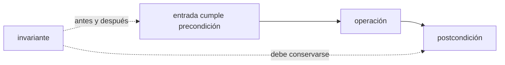
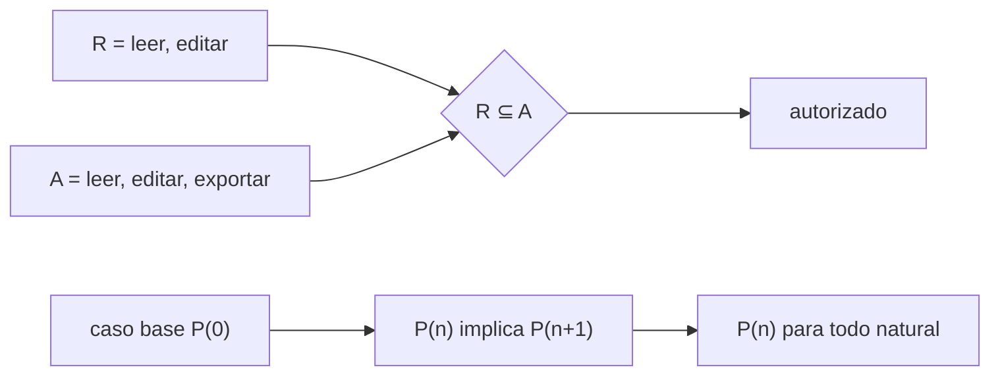
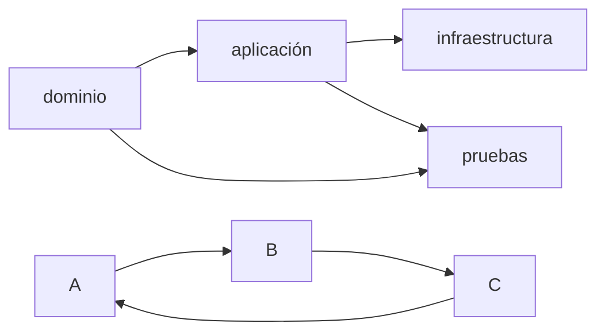
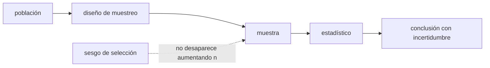

# Matemáticas discretas, lógica y probabilidad para software

Las matemáticas de este módulo no son una colección de fórmulas para memorizar. Son un lenguaje para decir exactamente qué debe ocurrir, detectar contradicciones, justificar algoritmos y distinguir una mejora real de una coincidencia. Trabajarás sobre el inventario acumulativo y convertirás afirmaciones vagas en propiedades verificables.


## Aprende construyendo

### Tema 1: Lógica para especificar antes de programar

#### Paso 1 · Objetivo y preparación
Al finalizar vas a escribir pre/postcondiciones formales para `transition()` de RutaFlow y a buscarle un contraejemplo con `hypothesis`. Prerrequisitos: `pip install hypothesis`.

#### Paso 2 · Contexto y caso real
El proyecto integrador Fundamentos que construirás a lo largo de estos 12 módulos es: el proyecto integrador Fundamentos: guardarás tareas en un archivo persistente. `transition()` ya impone una regla (`requested not in ALLOWED_TRANSITIONS[current]` lanza error), pero nadie escribió todavía la precondición/postcondición formal que esa regla implementa.

#### Paso 3 · Teoría, modelo mental y analogía
Una precondición es lo que debe cumplirse antes de llamar a `transition`; una postcondición describe el resultado — el contrato de una caja fuerte, no todavía cómo están hechas las bisagras.

#### Paso 4 · Demostración guiada desde cero
```text
Pre: current es un ShipmentStatus válido; requested es un ShipmentStatus válido
Transición: si requested ∈ ALLOWED_TRANSITIONS[current], devuelve requested; si no, lanza ValueError
Post: transition(current, requested) == requested implica requested ∈ ALLOWED_TRANSITIONS[current]
Invariante: ningún envío llega a DELIVERED sin haber pasado por ASSIGNED y OUT_FOR_DELIVERY en orden
```
```python
from hypothesis import given, strategies as st
from examples.rutaflow.foundation.domain import ShipmentStatus, ALLOWED_TRANSITIONS, transition

@given(st.sampled_from(ShipmentStatus), st.sampled_from(ShipmentStatus))
def test_transition_respeta_el_contrato(current, requested):
    if requested in ALLOWED_TRANSITIONS[current]:
        assert transition(current, requested) == requested
    else:
        try:
            transition(current, requested)
            assert False, "debería haber lanzado ValueError"
        except ValueError:
            pass
```
Resultado esperado: la prueba generativa corre sobre todas las combinaciones posibles de estados (16 pares) y pasa — confirmando que el contrato descrito arriba coincide exactamente con lo que el código hace, no solo con los casos que alguien pensó a mano.

#### Paso 5 · Práctica guiada
Pista: cambiá la postcondición para afirmar `transition(current, requested) == requested` SIN la condición `if` (es decir, asumí que siempre devuelve lo pedido) — ese es el fallo deliberado: la prueba generativa encuentra un contraejemplo real (por ejemplo `current=DELIVERED, requested=CREATED`) donde `transition` lanza `ValueError` en vez de devolver nada, rompiendo la postcondición mal escrita.

#### Paso 6 · Práctica independiente
Agregá una quinta transición inválida a mano al diccionario (`ShipmentStatus.DELIVERED: {ShipmentStatus.CREATED}`) y volvé a correr la prueba del Paso 4 — documentá si la prueba generativa la detecta como problema o simplemente la acepta como parte del contrato ahora ampliado (pista: la prueba generativa valida CONSISTENCIA con `ALLOWED_TRANSITIONS`, no que `ALLOWED_TRANSITIONS` en sí sea la regla de negocio correcta).

#### Paso 7 · Cierre y evidencia
Entregá el contrato formal y la prueba generativa pasando del Paso 4, el contraejemplo real encontrado del Paso 5, y la reflexión sobre qué SÍ y qué NO valida una prueba generativa del Paso 6; explicá por qué una prueba que pasa con casos elegidos a mano no es lo mismo que una que busca activamente contraejemplos. Errores comunes: afirmar sin medir, ignorar límites, copiar comandos y no documentar recuperación. Fuentes oficiales: https://www.cs2023.org/ y https://www.swebok.org/.
**¿Por qué es importante?** Porque los fundamentos permiten comprender y diagnosticar cualquier stack.
**Evidencia de aprendizaje:** entrega modelo, ejemplo, fallo, corrección, comparación y conclusión.
**Conceptos clave:** proposición, valor de verdad, negación, conjunción, disyunción, implicación, equivalencia, predicado, cuantificador universal, cuantificador existencial, precondición, postcondición e invariante.

Una proposición afirma algo que puede ser verdadero o falso. `stock >= 0` es una proposición cuando `stock` tiene un valor; `stock(x) >= 0` es un predicado sobre productos. Los conectores permiten formar reglas: un retiro es aceptable si el producto existe **y** el stock alcanza. La implicación `P -> Q` exige que cuando P sea verdadera, Q también lo sea; no afirma que P sea verdadera.

Los cuantificadores evitan ambigüedad. “Para todo producto, el stock no es negativo” se escribe `∀p: stock(p) >= 0`. “Existe un administrador activo” se expresa `∃u: admin(u) ∧ activo(u)`. Negar correctamente importa: la negación de “todos pasaron” es “existe al menos uno que no pasó”, no “nadie pasó”. Las leyes de De Morgan permiten transformar condiciones y revisar autorizaciones complejas.

Una precondición debe cumplirse antes de una operación; una postcondición describe el resultado; un invariante debe preservarse durante toda transición válida. El método de retiro puede especificarse así:

```text
Pre: cantidad > 0 y producto existe
Transición: stock_nuevo = stock_anterior - cantidad
Post: retiro aceptado implica stock_nuevo >= 0
Invariante global: para todo producto, stock >= 0
```

En Python una propiedad puede comprobar miles de entradas generadas, aunque eso no equivale por sí solo a una demostración:

```python
from hypothesis import given, strategies as st

@given(stock=st.integers(min_value=0), cantidad=st.integers(min_value=1))
def test_retirar_preserva_stock_no_negativo(stock, cantidad):
    resultado = retirar(stock, cantidad)
    assert resultado.stock >= 0
    assert resultado.aceptado == (cantidad <= stock)
```

**Analogía:** una especificación lógica se parece al contrato de una caja fuerte: define qué condiciones permiten abrirla y qué propiedad debe continuar cierta; no prescribe todavía la forma de las bisagras.

**¿Por qué es importante?** porque casos de prueba elegidos a mano suelen confirmar nuestra intuición. Predicados e invariantes obligan a declarar qué significa “correcto” y permiten buscar contraejemplos.

**Casos de uso reales:** reglas de autorización, validación de formularios, restricciones SQL, contratos de API, estados de pedidos y pruebas basadas en propiedades.

**Diagrama:**



### Tema 2: Conjuntos, relaciones, funciones e inducción

#### Paso 1 · Objetivo y preparación
Al finalizar vas a confirmar que `ALLOWED_TRANSITIONS` de RutaFlow es, matemáticamente, una relación de orden parcial — no una de equivalencia. Prerrequisitos: Python 3 instalado.

#### Paso 2 · Contexto y caso real
`ALLOWED_TRANSITIONS` es literalmente un subconjunto de pares (`ShipmentStatus × ShipmentStatus`) — exactamente la definición de una relación — pero nadie verificó todavía qué propiedades formales cumple.

#### Paso 3 · Teoría, modelo mental y analogía
Una relación de equivalencia es reflexiva, simétrica y transitiva; un orden parcial es reflexivo, antisimétrico y transitivo — "es prerrequisito de" debería ser un orden, nunca una equivalencia, porque un envío entregado nunca vuelve a estar creado.

#### Paso 4 · Demostración guiada desde cero
```python
from examples.rutaflow.foundation.domain import ShipmentStatus, ALLOWED_TRANSITIONS

pares = {(a, b) for a, destinos in ALLOWED_TRANSITIONS.items() for b in destinos}
simetrica = all((b, a) in pares for (a, b) in pares)
print("simétrica:", simetrica)
print("pares:", pares)
```
Resultado esperado: `simétrica: False` — para cada par `(CREATED, ASSIGNED)` en la relación, el par inverso `(ASSIGNED, CREATED)` NO está, confirmando que esto NO es una relación de equivalencia (que dividiría los estados en clases intercambiables), sino algo con dirección.

#### Paso 5 · Práctica guiada
Pista: agregá a mano `ALLOWED_TRANSITIONS[ShipmentStatus.ASSIGNED].add(ShipmentStatus.CREATED)` (permitir volver atrás) y repetí el cálculo de `simetrica` para ese par específico — ese es el fallo deliberado: ahora `(ASSIGNED, CREATED)` SÍ existe junto a `(CREATED, ASSIGNED)`, y agregar esa transición de vuelta rompe la propiedad de orden que un pipeline de entregas necesita (un envío "desasignándose" solo no tiene sentido de negocio).

#### Paso 6 · Práctica independiente
Deshacé el Paso 5, y verificá la propiedad antisimétrica real: para cada par `(a,b)` con `a != b` en la relación, confirmá que `(b,a)` nunca está — documentando por qué esa propiedad es exactamente lo que impide que un envío "entregado" regrese a "creado" sin pasar por un proceso explícito nuevo.

#### Paso 7 · Cierre y evidencia
Entregá la relación no simétrica confirmada del Paso 4, la transición hacia atrás rota del Paso 5, y la verificación de antisimetría del Paso 6; explicá por qué modelar `ALLOWED_TRANSITIONS` como un orden parcial (no una equivalencia) es la razón matemática detrás de la regla de negocio "un envío nunca retrocede de estado". Errores comunes: afirmar sin medir, ignorar límites, copiar comandos y no documentar recuperación. Fuentes oficiales: https://www.cs2023.org/ y https://www.swebok.org/.
**¿Por qué es importante?** Porque los fundamentos permiten comprender y diagnosticar cualquier stack.
**Evidencia de aprendizaje:** entrega modelo, ejemplo, fallo, corrección, comparación y conclusión.
**Conceptos clave:** conjunto, pertenencia, subconjunto, unión, intersección, diferencia, producto cartesiano, función, inyección, sobreyección, relación, equivalencia, orden parcial, caso base, paso inductivo y recursión.

Un conjunto agrupa elementos sin orden ni repetición. Si `A` contiene permisos concedidos y `R` permisos requeridos, la autorización puede expresarse `R ⊆ A`. La intersección encuentra elementos comunes; la diferencia identifica faltantes. Estas operaciones están detrás de roles, filtros, etiquetas y consultas.

Una relación es un subconjunto de pares. “Usuario tiene rol” relaciona usuarios y roles; “módulo depende de módulo” relaciona componentes. Una relación de equivalencia es reflexiva, simétrica y transitiva y divide elementos en clases. Un orden parcial es reflexivo, antisimétrico y transitivo: no obliga a que cada par sea comparable. La relación “es prerrequisito de” debería formar un orden sin ciclos.

Una función asigna exactamente una salida a cada entrada de su dominio. Puede ser total o parcial según esté definida para todas. Distinguir esto mejora APIs: buscar por ID puede devolver `Producto | None`; pretender que siempre existe oculta una función parcial.

La inducción demuestra propiedades indexadas por naturales. Primero prueba un caso base. Luego supone que la propiedad vale para `n` y demuestra que vale para `n+1`. Para la suma de una lista, el caso vacío devuelve cero; al agregar un elemento, la suma nueva es el elemento más la suma de la lista restante. La hipótesis inductiva conecta la estructura recursiva con su corrección.

```python
def suma(valores: list[int]) -> int:
    if not valores:                 # caso base
        return 0
    return valores[0] + suma(valores[1:])
```

Una prueba de corrección no demuestra eficiencia ni ausencia de errores de implementación ajenos a sus supuestos. Declara dominio, propiedad y supuestos explícitamente.

**Analogía:** la inducción es una fila de fichas de dominó: verificas que la primera cae y que cada ficha que cae derriba la siguiente. Ambas partes son necesarias.

**¿Por qué es importante?** porque conjuntos y relaciones modelan sistemas sin depender del lenguaje, mientras la inducción permite justificar bucles, recursión y estructuras construidas paso a paso.

**Casos de uso reales:** permisos por conjuntos, deduplicación, modelos relacionales, orden de migraciones, tipos opcionales, recorridos recursivos y pruebas de algoritmos.

**Diagrama:**



### Tema 3: Conteo, grafos y estructuras conectadas

#### Paso 1 · Objetivo y preparación
Al finalizar vas a tratar `ALLOWED_TRANSITIONS` como el grafo dirigido que realmente es, y a confirmar con el `tiene_ciclo()` de este mismo Tema que es un DAG. Prerrequisitos: Tema 2 de este módulo.

#### Paso 2 · Contexto y caso real
Si `ALLOWED_TRANSITIONS` tuviera un ciclo (por ejemplo, `DELIVERED` pudiendo volver a `CREATED`), un envío podría quedar dando vueltas indefinidamente sin nunca completarse de forma predecible — por eso importa confirmar formalmente que es un DAG, no solo "parece que no tiene ciclos".

#### Paso 3 · Teoría, modelo mental y analogía
Un grafo dirigido sin ciclos (DAG) admite un orden topológico — como una lista de tareas donde cada una depende solo de las anteriores, nunca de una futura.

#### Paso 4 · Demostración guiada desde cero
```python
from examples.rutaflow.foundation.domain import ShipmentStatus, ALLOWED_TRANSITIONS

grafo = {estado.value: {destino.value for destino in destinos} for estado, destinos in ALLOWED_TRANSITIONS.items()}

def tiene_ciclo(grafo):
    visitados, activos = set(), set()
    def visitar(nodo):
        if nodo in activos: return True
        if nodo in visitados: return False
        activos.add(nodo)
        for vecino in grafo.get(nodo, set()):
            if visitar(vecino): return True
        activos.remove(nodo); visitados.add(nodo)
        return False
    return any(visitar(n) for n in grafo)

print("tiene ciclo:", tiene_ciclo(grafo))
```
Resultado esperado: `tiene ciclo: False` — `ALLOWED_TRANSITIONS` es un DAG real, usando la misma función `tiene_ciclo` que ya viste en la teoría de este Tema, aplicada ahora al grafo real del dominio de RutaFlow.

#### Paso 5 · Práctica guiada
Pista: agregá `grafo["delivered"] = {"created"}` (permitir que un envío entregado vuelva a creado) y volvé a correr `tiene_ciclo(grafo)` — ese es el fallo deliberado: ahora devuelve `True`, porque `created → assigned → out_for_delivery → delivered → created` forma un ciclo completo; un envío podría procesarse infinitamente sin que el sistema lo detecte como "terminado" nunca.

#### Paso 6 · Práctica independiente
Deshacé el Paso 5, y calculá un orden topológico válido de los 4 estados a mano (hay solo uno posible en este caso, por ser una cadena lineal) — documentá qué pasaría con el orden topológico si `ASSIGNED` pudiera ir tanto a `OUT_FOR_DELIVERY` como directamente a un nuevo estado hipotético `CANCELLED`.

#### Paso 7 · Cierre y evidencia
Entregá la confirmación de DAG del Paso 4, el ciclo introducido y detectado del Paso 5, y el orden topológico del Paso 6; explicá por qué un ciclo en este grafo específico sería un defecto de diseño, no solo una curiosidad matemática. Errores comunes: afirmar sin medir, ignorar límites, copiar comandos y no documentar recuperación. Fuentes oficiales: https://www.cs2023.org/ y https://www.swebok.org/.
**¿Por qué es importante?** Porque los fundamentos permiten comprender y diagnosticar cualquier stack.
**Evidencia de aprendizaje:** entrega modelo, ejemplo, fallo, corrección, comparación y conclusión.
**Conceptos clave:** regla de suma, regla de producto, permutación, combinación, principio del palomar, grafo, vértice, arista, grado, camino, ciclo, grafo dirigido, DAG, árbol, BFS, DFS y orden topológico.

La combinatoria responde cuántas posibilidades existen sin enumerarlas. Si una API tiene 3 roles, 4 operaciones y 2 estados de cuenta, hay hasta `3 × 4 × 2 = 24` combinaciones de decisión. Esa cifra ayuda a diseñar particiones de prueba, aunque no obliga a ejecutar cada combinación si algunas son equivalentes.

Una permutación considera orden; una combinación no. Elegir 3 revisores entre 10 produce `C(10,3)`, mientras asignarles tres turnos distintos introduce orden. El principio del palomar afirma que al colocar más objetos que contenedores, alguno contiene más de uno; explica por qué hashes finitos necesariamente tienen colisiones, aunque una función buena las haga poco probables.

Un grafo representa entidades como vértices y relaciones como aristas. Las dependencias de módulos forman un grafo dirigido. Si no hay ciclos es un DAG y puede obtenerse un orden topológico de build o migración. DFS profundiza antes de retroceder; BFS explora por capas y encuentra caminos mínimos en grafos no ponderados.

```python
def tiene_ciclo(grafo: dict[str, set[str]]) -> bool:
    visitados, activos = set(), set()

    def visitar(nodo: str) -> bool:
        if nodo in activos:
            return True
        if nodo in visitados:
            return False
        activos.add(nodo)
        for vecino in grafo.get(nodo, set()):
            if visitar(vecino):
                return True
        activos.remove(nodo)
        visitados.add(nodo)
        return False

    return any(visitar(n) for n in grafo)
```

La terminación depende de marcar visitados; la detección del ciclo usa el conjunto de nodos activos en la ruta actual. Confundir ambos conjuntos produce falsos positivos.

**Analogía:** un grafo de dependencias es un mapa de tareas. Un ciclo significa que A espera a B mientras B, directa o indirectamente, espera a A: ninguna puede empezar.

**¿Por qué es importante?** porque redes, rutas, paquetes, builds, relaciones sociales y arquitectura comparten las mismas estructuras; reconocerlas permite reutilizar algoritmos conocidos.

**Casos de uso reales:** dependencias de paquetes, planificación de cursos, rutas de red, motores de recomendación, detección de fraude, árboles del DOM y análisis de arquitectura.

**Diagrama:**



### Tema 4: Probabilidad y evidencia para decisiones técnicas

#### Paso 1 · Objetivo y preparación
Al finalizar vas a medir la distribución real de tiempos de `nearest_neighbor_route` de RutaFlow sobre distintos tamaños de entrada, con percentiles reales, no solo un promedio. Prerrequisitos: Python 3 instalado.

#### Paso 2 · Contexto y caso real
Si RutaFlow necesitara decidir cuántas paradas por zona puede manejar antes de que el cálculo de ruta tarde demasiado, un promedio de tiempos ocultaría exactamente el caso que importa: la cola larga de zonas con muchas paradas.

#### Paso 3 · Teoría, modelo mental y analogía
La mediana y los percentiles describen mejor una distribución asimétrica que el promedio — informar solo el promedio puede ocultar que el 5% de las zonas con más paradas tarda muchísimo más que el resto.

#### Paso 4 · Demostración guiada desde cero
```python
import time
from statistics import mean, median, quantiles
from examples.rutaflow.foundation.domain import Stop, nearest_neighbor_route

tiempos = []
for _ in range(30):
    paradas = [Stop(f"RF-{i}", i % 7, i % 5) for i in range(200)]
    inicio = time.perf_counter()
    nearest_neighbor_route((0, 0), paradas)
    tiempos.append(time.perf_counter() - inicio)

p50 = median(tiempos)
p95 = quantiles(tiempos, n=100)[94]
print({"n": len(tiempos), "media": mean(tiempos), "p50": p50, "p95": p95})
```
Resultado esperado: un diccionario con media, p50 y p95 reales de 30 repeticiones — la heurística O(n²) sobre 200 paradas da tiempos consistentes, y podés comparar si la media y la mediana están cerca (señal de distribución simétrica) o lejos (señal de cola larga).

#### Paso 5 · Práctica guiada
Pista: repetí la medición con solo 3 repeticiones en vez de 30, y afirmá una conclusión sobre el "tiempo típico" basándote en esas 3 — ese es el fallo deliberado: con una muestra tan chica, un solo valor atípico (por ejemplo, si el primer cálculo coincidió con el arranque en frío del intérprete) puede distorsionar completamente la media, sin que tengas suficientes repeticiones para distinguir ruido de señal real.

#### Paso 6 · Práctica independiente
Repetí el Paso 4 con 1000 paradas en vez de 200, y compará el p95 de ambos tamaños — documentá si el crecimiento del tiempo es lineal, cuadrático o algo distinto, usando los números reales medidos, no la complejidad teórica O(n²) citada en el docstring de la función.

#### Paso 7 · Cierre y evidencia
Entregá la distribución con 30 repeticiones del Paso 4, la conclusión frágil con 3 repeticiones del Paso 5, y la comparación de tamaños del Paso 6; explicá por qué el tamaño de muestra y los percentiles importan más que un único número de "tiempo promedio" al decidir cuántas paradas por zona puede manejar RutaFlow. Errores comunes: afirmar sin medir, ignorar límites, copiar comandos y no documentar recuperación. Fuentes oficiales: https://www.cs2023.org/ y https://www.swebok.org/.
**¿Por qué es importante?** Porque los fundamentos permiten comprender y diagnosticar cualquier stack.
**Evidencia de aprendizaje:** entrega modelo, ejemplo, fallo, corrección, comparación y conclusión.
**Conceptos clave:** experimento, espacio muestral, evento, probabilidad condicional, independencia, variable aleatoria, esperanza, varianza, distribución, población, muestra, sesgo, intervalo de confianza, correlación, causalidad y prueba de hipótesis.

La probabilidad modela incertidumbre, no ignorancia absoluta. Una variable aleatoria asigna un número a cada resultado: latencia, errores por minuto o demanda diaria. La media resume centro, pero es sensible a extremos; mediana y percentiles describen mejor latencias asimétricas. La varianza y desviación expresan dispersión. Informar solo el promedio puede ocultar usuarios que sufren una cola larga.

La probabilidad condicional `P(A|B)` mide A sabiendo B. Independencia significa que conocer B no cambia la probabilidad de A. Confundirla con ausencia de relación visible produce errores. El teorema de Bayes actualiza una creencia inicial usando evidencia, pero una prueba con pocos falsos positivos aún puede generar muchas alertas falsas cuando el evento buscado es muy raro.

Una muestra debe representar la población sobre la que concluirás. Medir únicamente durante la noche no permite afirmar rendimiento diurno. Repetir observaciones del mismo entorno no elimina sesgo. Un intervalo de confianza comunica incertidumbre del procedimiento; no convierte una muestra mala en buena.

```python
from statistics import mean, median, quantiles

latencias = medir(repeticiones=100, semilla=2026)
p50 = median(latencias)
p95 = quantiles(latencias, n=100)[94]
print({"n": len(latencias), "media": mean(latencias), "p50": p50, "p95": p95})
```

Comparar dos versiones exige controlar calentamiento, carga, datos, hardware y orden; registrar semilla y ambiente; repetir; mostrar distribución y tamaño del efecto. Un valor p no mide importancia práctica ni probabilidad de que una hipótesis sea verdadera. Correlación tampoco prueba causalidad: una tercera variable puede explicar ambas.

**Analogía:** probar una cucharada de sopa informa sobre toda la olla solo si antes se mezcló bien y la muestra no fue elegida para confirmar el sabor esperado.

**¿Por qué es importante?** porque métricas y experimentos influyen en capacidad, alertas y despliegues. Una conclusión exagerada puede optimizar el lugar equivocado o degradar usuarios reales.

**Casos de uso reales:** pruebas A/B, SLO de latencia, detección de anomalías, planificación de capacidad, backoff aleatorio, muestreo de logs y análisis de defectos.

**Diagrama:**



## Construcción guiada del capítulo

### Proyecto 9: cuaderno de propiedades, grafos y evidencia

Crea `analysis/fundamentos-matematicos.ipynb` o un documento ejecutable equivalente y un script reproducible sin depender del estado oculto del cuaderno.

1. Escribe cinco invariantes del inventario con lenguaje natural, predicados y ejemplos/contraejemplos.
2. Implementa pruebas generativas para retiro, devolución y autorización. Conserva el contraejemplo mínimo de un defecto introducido deliberadamente.
3. Define dominio, caso base, hipótesis y paso inductivo para demostrar una propiedad de búsqueda, suma o recorrido.
4. Extrae dependencias internas y represéntalas como grafo dirigido. Implementa DFS para ciclos y compara el resultado con una herramienta visual.
5. Calcula el número de combinaciones relevantes de rol, operación y estado; reduce casos mediante clases de equivalencia justificadas.
6. Compara latencia de búsqueda con y sin índice usando datos sintéticos, semilla fija, calentamiento y al menos 30 repeticiones por condición.
7. Presenta mediana, p95, dispersión y tamaño del efecto. Escribe qué puede y qué no puede concluirse.
8. Añade `make analysis` o comando equivalente que reconstruya datos, ejecute pruebas y produzca tablas desde un clon limpio.

**Verificación:** el pipeline debe fallar cuando un contraejemplo rompe un invariante o aparece un ciclo prohibido. El experimento debe registrar versión, máquina, semilla, tamaño de datos y comandos. Cambiar la semilla no debería invertir sistemáticamente la conclusión; si lo hace, informa inestabilidad en lugar de ocultarla.

**Errores comunes y soluciones**

- Tratar implicación como equivalencia: escribe tabla de verdad y busca el caso donde la conclusión ocurre sin la condición.
- Usar ejemplos como demostración: declara qué entradas no cubren y añade argumento formal o propiedad.
- DFS infinito: marca nodos y distingue visitados de activos.
- Comparar promedios aislados: muestra distribución, percentiles y tamaño muestral.
- Concluir causalidad por correlación: identifica variables de confusión y diseña control o experimento.
- Ejecutar celdas fuera de orden: reinicia y ejecuta todo automáticamente antes de entregar.
