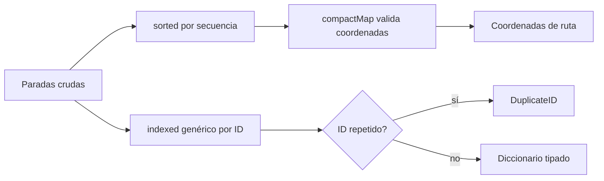

# Módulo 0: Fundamentos de Swift


## Antes de comenzar: qué equipo necesitas realmente

Para crear, ejecutar, firmar y publicar una app iOS necesitas **macOS y Xcode**. Apple no ofrece Xcode para Windows o Linux. En esos sistemas puedes aprender sintaxis Swift y practicar lógica, pero necesitarás acceso posterior a un Mac físico o un servicio Mac remoto para completar el track de aplicaciones.

### macOS: entorno completo recomendado

1. Instala Xcode desde App Store y ábrelo una vez para aceptar la licencia y descargar componentes.
2. En Xcode abre **Settings → Platforms** e instala un simulador de iOS.
3. Ejecuta `xcode-select -p`, `xcodebuild -version` y `swift --version` en Terminal.
4. Crea **File → New → Project → iOS App**, Interface SwiftUI y Language Swift.
5. Selecciona un iPhone Simulator y pulsa Run. No necesitas cuenta de pago para el simulador.

### Windows y Linux: etapa de fundamentos

Instala Swift desde [swift.org/install](https://www.swift.org/install/) y VS Code con la extensión Swift. Verifica `swift --version`, crea `hola.swift` con `print("Hola, Swift")` y ejecuta `swift hola.swift`. Esta configuración sirve para Módulo 0 y lógica independiente; SwiftUI, simulador, firma y App Store requieren macOS.

Si Xcode indica que no encuentra un runtime, instálalo en Settings → Platforms. Si falla la licencia, ejecuta `sudo xcodebuild -license accept`. Conserva espacio libre suficiente: Xcode y los simuladores pueden ocupar decenas de GB.

## Aprende construyendo

### Tema 1: Optionals y unwrapping seguro

#### Paso 1 · Objetivo y preparación
Al finalizar podrás ejecutar este concepto Swift desde cero. Prerrequisitos: macOS, Xcode y Swift. Verifica swift --version y xcodebuild -version.

#### Paso 2 · Contexto y caso real
En un caso real de entregas, ubicación, usuario y estado pueden faltar o cambiar; el código debe expresar ausencia sin crashes.

#### Paso 3 · Teoría, modelo mental y analogía
Optional representa valor o ausencia; struct modela valor y class identidad compartida; protocolos expresan capacidades; enums modelan estados; closures y genéricos reutilizan comportamiento. La analogía es una etiqueta de paquete: puede faltar, tener identidad o cumplir una capacidad concreta, pero no se debe adivinar.

#### Paso 4 · Demostración guiada desde cero
Parte de una **carpeta vacía** y crea un ejecutable dedicado a valores ausentes:
```bash
mkdir swift-optionals
cd swift-optionals
swift package init --type executable
mkdir -p Sources
swift run
```

`--type` es la bandera que elige la plantilla del paquete Swift (`executable`, un programa que corre directamente; más abajo verás `library`, un paquete pensado para ser importado).

Guarda `Sources/main.swift`:

```swift
func etiquetaDestinatario(_ nombre: String?) -> String {
    // guard let abre la caja solo cuando realmente contiene un String.
    guard let nombre, !nombre.isEmpty else { return "Sin destinatario" }
    return "Entregar a: \(nombre)"
}

print(etiquetaDestinatario("Ana"))
print(etiquetaDestinatario(nil))
```

Ejecuta `swift run`. **Resultado esperado:** `Entregar a: Ana` y luego `Sin destinatario`. **Fallo deliberado:** reemplaza `guard let` por `return nombre!`; la segunda llamada termina con un error fatal. El diagnóstico es un *force unwrap* de `nil`; restaura el desenvolvimiento seguro.

#### Paso 5 · Práctica guiada
Pista: fuerza deliberadamente un unwrap de nil para provocar un fallo deliberado; lee el crash y corrígelo con guard let. Resultado esperado: mensaje controlado sin crash.

#### Paso 6 · Práctica independiente
Añade protocolo Trackable, colección de entregas, closure de filtrado y prueba con datos ausentes.

#### Paso 7 · Cierre y evidencia
Guarda árbol, comandos, salida y diagnóstico; como siguiente paso crea una app de UI. Errores comunes: force unwrap, class por defecto, enum sin estado imposible y closures que capturan fuerte. Fuentes oficiales: https://docs.swift.org/swift-book/documentation/the-swift-programming-language/ y https://developer.apple.com/documentation/swift.
**¿Por qué es importante?** Porque el modelo de tipos de Swift previene errores frecuentes antes de llegar al usuario.
**Evidencia de aprendizaje:** entrega código, fallo, corrección y salida de Swift Package.
**Conceptos clave:** ausencia de valor modelada en el sistema de tipos, no como un valor especial oculto.

```swift
var nombre: String? = nil // explícitamente puede no tener valor

if let nombreDesenvuelto = nombre {
    print(nombreDesenvuelto) // solo accesible aquí dentro, ya seguro
}

let saludo = nombre ?? "Invitado" // nil coalescing: valor por defecto
```

Swift incorpora la ausencia de valor directamente en el sistema de tipos mediante el modificador `?`: `String?` y `String` son tipos formalmente distintos para el compilador, de modo que intentar usar un `String?` donde se espera un `String` sin desenvolverlo primero produce un error de compilación, no un crash en tiempo de ejecución. Esta decisión de diseño previene por completo la categoría de errores conocida en otros lenguajes como `NullPointerException` (Java, estudiado en el Módulo 3 de ese track) o `undefined is not a function` (JavaScript): en Swift, el compilador rechaza el código antes de que pueda ejecutarse, en vez de descubrir el problema en producción cuando un valor inesperadamente ausente causa un fallo.

`if let` desenvuelve el optional de forma segura y condicional (el bloque solo se ejecuta si hay un valor presente); `guard let` desenvuelve de forma temprana con una salida obligatoria en caso de `nil` (apropiado para validaciones al inicio de una función); `??` (nil coalescing) provee un valor por defecto en una única expresión cuando el optional es `nil`. Todas estas son alternativas seguras al "force unwrap" (`nombre!`), que sí puede provocar un crash en tiempo de ejecución si el valor resulta ser `nil`, y que por eso se reserva para casos donde se tiene certeza absoluta (verificada por el propio programador, no por el compilador) de que el valor nunca será `nil` en ese punto específico del código.

**Analogía:** un optional es como una caja que declara explícitamente en su etiqueta si puede estar vacía o no; abrirla con `if let` es revisar con cuidado antes de asumir que contiene algo, mientras que forzar la apertura con `!` es asumir a ciegas que hay contenido, arriesgándose a una sorpresa desagradable si la caja resulta estar vacía.

**¿Por qué es importante?** El sistema de optionals de Swift previene la categoría completa de errores de "acceder a un valor ausente" detectándolos en tiempo de compilación, en vez de dejar que se manifiesten como crashes en producción como ocurre en lenguajes sin este mecanismo incorporado al sistema de tipos.

**Código del ejemplo:**

```swift
var nombre: String? = nil
if let nombreDesenvuelto = nombre { print(nombreDesenvuelto) }
let saludo = nombre ?? "Invitado"
```

### Tema 2: struct vs class

#### Paso 1 · Objetivo y preparación
Al finalizar podrás ejecutar este concepto Swift desde cero. Prerrequisitos: macOS, Xcode y Swift. Verifica swift --version y xcodebuild -version.

#### Paso 2 · Contexto y caso real
En un caso real de entregas, ubicación, usuario y estado pueden faltar o cambiar; el código debe expresar ausencia sin crashes.

#### Paso 3 · Teoría, modelo mental y analogía
Optional representa valor o ausencia; struct modela valor y class identidad compartida; protocolos expresan capacidades; enums modelan estados; closures y genéricos reutilizan comportamiento. La analogía es una etiqueta de paquete: puede faltar, tener identidad o cumplir una capacidad concreta, pero no se debe adivinar.

#### Paso 4 · Demostración guiada desde cero
Desde una **carpeta vacía**, crea un ejemplo que haga visible copia frente a identidad:
```bash
mkdir swift-identidad
cd swift-identidad
swift package init --type executable
swift run
```
Guarda `Sources/main.swift`:

```swift
struct Paquete { var estado: String }
final class Sesion { var conductor = "Ana" }

var original = Paquete(estado: "creado")
var copia = original
copia.estado = "en ruta"       // Cambia la copia, no el valor original.

let sesionA = Sesion()
let sesionB = sesionA
sesionB.conductor = "Luis"      // Ambas referencias observan la misma instancia.

print(original.estado, copia.estado)
print(sesionA.conductor, sesionB.conductor)
```

Ejecuta `swift run`. **Salida esperada:** `creado en ruta` y `Luis Luis`. **Fallo deliberado:** declara `original` con `let` e intenta cambiar `original.estado`; el compilador explica que una constante no puede mutarse. Decide si el modelo debe ser mutable, en vez de cambiarlo a `class` solo para silenciar el error.

#### Paso 5 · Práctica guiada
Pista: fuerza deliberadamente un unwrap de nil para provocar un fallo deliberado; lee el crash y corrígelo con guard let. Resultado esperado: mensaje controlado sin crash.

#### Paso 6 · Práctica independiente
Añade protocolo Trackable, colección de entregas, closure de filtrado y prueba con datos ausentes.

#### Paso 7 · Cierre y evidencia
Guarda árbol, comandos, salida y diagnóstico; como siguiente paso crea una app de UI. Errores comunes: force unwrap, class por defecto, enum sin estado imposible y closures que capturan fuerte. Fuentes oficiales: https://docs.swift.org/swift-book/documentation/the-swift-programming-language/ y https://developer.apple.com/documentation/swift.
**¿Por qué es importante?** Porque el modelo de tipos de Swift previene errores frecuentes antes de llegar al usuario.
**Evidencia de aprendizaje:** entrega código, fallo, corrección y salida de Swift Package.
**Conceptos clave:** copia independiente vs instancia compartida.

```swift
struct Punto { var x: Int; var y: Int }     // value type: se copia al asignar
class Contador { var valor = 0 }              // reference type: se comparte la misma instancia

var p1 = Punto(x: 1, y: 1)
var p2 = p1
p2.x = 99 // p1.x sigue siendo 1 — son copias independientes
```

Un `struct` es un value type: cada asignación (`var p2 = p1`) crea una copia completamente independiente, de modo que modificar `p2` nunca afecta a `p1`; una `class` es un reference type: una asignación equivalente simplemente copia una referencia hacia la misma instancia subyacente en memoria, de modo que modificar el objeto a través de cualquiera de las dos variables afecta a ambas por igual, dado que en realidad apuntan al mismo objeto. Esta distinción, poco común como default en otros lenguajes mainstream (donde todo objeto es típicamente reference type salvo tipos primitivos), es una decisión de diseño deliberada de Swift que empuja hacia modelos de datos inmutables y predecibles por defecto (usando `struct` para la mayoría de los modelos de dominio) reservando `class` específicamente para casos donde la identidad compartida y la mutación observada desde múltiples lugares es intencional (como un `ViewModel` observado por varias vistas).

Esta elección tiene consecuencias prácticas directas en el razonamiento sobre el código: un `struct` pasado a una función nunca puede ser mutado inesperadamente por esa función de forma que afecte al llamador (a menos que se declare explícitamente como `inout`), mientras que una `class` pasada de la misma forma sí podría ser mutada por la función receptora, afectando también al llamador original, dado que ambos comparten la misma instancia subyacente.

**Analogía:** un `struct` es como fotocopiar un documento antes de entregarlo: cualquier anotación que el receptor haga en su copia nunca aparece en el original; una `class` es como entregar el documento original directamente: cualquier anotación que el receptor haga sí modifica ese mismo documento que el remitente sigue teniendo en su poder.

**¿Por qué es importante?** Elegir `struct` para un modelo de datos previene mutaciones inesperadas compartidas entre distintas partes del código, mientras que `class` es apropiada cuando la identidad compartida y la observación de mutaciones desde múltiples lugares es exactamente el comportamiento deseado.

**Código del ejemplo:**

```swift
struct Punto { var x: Int; var y: Int }   // value type: copia independiente
class Contador { var valor = 0 }            // reference type: instancia compartida
```

### Tema 3: Protocolos y enums con valores asociados

#### Paso 1 · Objetivo y preparación
Al finalizar podrás ejecutar este concepto Swift desde cero. Prerrequisitos: macOS, Xcode y Swift. Verifica swift --version y xcodebuild -version.

#### Paso 2 · Contexto y caso real
En un caso real de entregas, ubicación, usuario y estado pueden faltar o cambiar; el código debe expresar ausencia sin crashes.

#### Paso 3 · Teoría, modelo mental y analogía
Optional representa valor o ausencia; struct modela valor y class identidad compartida; protocolos expresan capacidades; enums modelan estados; closures y genéricos reutilizan comportamiento. La analogía es una etiqueta de paquete: puede faltar, tener identidad o cumplir una capacidad concreta, pero no se debe adivinar.

#### Paso 4 · Demostración guiada desde cero
Desde una **carpeta vacía**, crea un contrato y un estado imposible de representar mal:
```bash
mkdir swift-protocolos-estados
cd swift-protocolos-estados
swift package init --type executable
swift run
```
Guarda `Sources/main.swift`:

```swift
protocol Describible { var descripcion: String { get } }

enum EstadoEntrega: Describible {
    case creada
    case enRuta(conductor: String)
    case fallida(motivo: String)

    var descripcion: String {
        switch self {
        case .creada: return "Creada"
        case .enRuta(let conductor): return "En ruta con \(conductor)"
        case .fallida(let motivo): return "Fallida: \(motivo)"
        }
    }
}

print(EstadoEntrega.enRuta(conductor: "Ana").descripcion)
```

Ejecuta `swift run`. **Resultado esperado:** `En ruta con Ana`. **Fallo deliberado:** añade `case entregada` y no modifiques el `switch`; el compilador informa que no es exhaustivo. Agrega el caso de manera consciente y evita un `default` que oculte futuros estados.

#### Paso 5 · Práctica guiada
Pista: fuerza deliberadamente un unwrap de nil para provocar un fallo deliberado; lee el crash y corrígelo con guard let. Resultado esperado: mensaje controlado sin crash.

#### Paso 6 · Práctica independiente
Añade protocolo Trackable, colección de entregas, closure de filtrado y prueba con datos ausentes.

#### Paso 7 · Cierre y evidencia
Guarda árbol, comandos, salida y diagnóstico; como siguiente paso crea una app de UI. Errores comunes: force unwrap, class por defecto, enum sin estado imposible y closures que capturan fuerte. Fuentes oficiales: https://docs.swift.org/swift-book/documentation/the-swift-programming-language/ y https://developer.apple.com/documentation/swift.
**¿Por qué es importante?** Porque el modelo de tipos de Swift previene errores frecuentes antes de llegar al usuario.
**Evidencia de aprendizaje:** entrega código, fallo, corrección y salida de Swift Package.
**Conceptos clave:** contrato de comportamiento compartido entre tipos no relacionados; estado modelado como un conjunto cerrado de casos con datos propios.

```swift
protocol Describible {
    func describir() -> String
}

extension Int: Describible {
    func describir() -> String { "El número es \(self)" }
}
```

Un protocolo declara un contrato de comportamiento (métodos y propiedades requeridas) que cualquier tipo puede adoptar, incluso tipos que Swift ya define de antemano (`Int`, mediante una extensión, sin necesidad de modificar el código fuente original de `Int`); esto habilita un patrón de composición de comportamiento sin depender de jerarquías de herencia rígidas, permitiendo que tipos completamente no relacionados entre sí (un `Int` y un `struct` propio) compartan el mismo contrato `Describible` de forma uniforme.

```swift
enum Resultado {
    case exito(String)
    case error(mensaje: String, codigo: Int)
}

switch resultado {
case .exito(let datos): print(datos)
case .error(let mensaje, let codigo): print("\(mensaje) (\(codigo))")
}
```

Un enum con valores asociados modela un estado como un conjunto cerrado y exhaustivo de casos posibles, cada uno pudiendo llevar consigo datos propios específicos de ese caso (`exito` lleva un `String`, `error` lleva un `mensaje` y un `codigo`); el compilador de Swift verifica la exhaustividad de un `switch` sobre ese enum, obligando a manejar explícitamente todos los casos posibles (o proveer un caso `default` deliberado), lo que hace que agregar un nuevo caso al enum en el futuro genere errores de compilación en cada `switch` existente que no lo contemple, forzando una actualización consciente en vez de un comportamiento silenciosamente incorrecto. Este mismo patrón de "modelado de estado con casos cerrados y verificación de exhaustividad" es análogo a las sealed classes de Kotlin (Módulo 1 del track de Kotlin Multiplatform), aunque con la diferencia de que Swift verifica la exhaustividad de forma nativa e incorporada al lenguaje sin necesidad de configuración adicional.

**Analogía:** un protocolo es como un certificado de competencia que cualquier profesional puede obtener independientemente de su formación original, permitiendo agrupar a profesionales de trasfondos completamente distintos bajo un mismo estándar reconocido de habilidad; un enum con valores asociados es como un formulario con un menú desplegable de opciones fijas, donde cada opción seleccionada revela campos adicionales específicos de esa elección, y el sistema exige completar la sección correspondiente sin importar cuál se haya elegido.

**¿Por qué es importante?** Los protocolos permiten composición de comportamiento entre tipos no relacionados sin depender de herencia rígida; los enums con valores asociados modelan estado de forma exhaustiva y verificada por el compilador, previniendo casos no manejados que pasarían desapercibidos en un modelo menos estricto.

**Código del ejemplo:**

```swift
enum Resultado {
    case exito(String)
    case error(mensaje: String, codigo: Int)
}
// El compilador exige manejar TODOS los casos en un switch, o un default explícito
```

### Tema 4: Closures, colecciones y genéricos con propósito

#### Paso 1 · Objetivo y preparación
Al finalizar podrás ejecutar este concepto Swift desde cero. Prerrequisitos: macOS, Xcode y Swift. Verifica swift --version y xcodebuild -version.

#### Paso 2 · Contexto y caso real
En un caso real de entregas, ubicación, usuario y estado pueden faltar o cambiar; el código debe expresar ausencia sin crashes.

#### Paso 3 · Teoría, modelo mental y analogía
Optional representa valor o ausencia; struct modela valor y class identidad compartida; protocolos expresan capacidades; enums modelan estados; closures y genéricos reutilizan comportamiento. La analogía es una etiqueta de paquete: puede faltar, tener identidad o cumplir una capacidad concreta, pero no se debe adivinar.

#### Paso 4 · Demostración guiada desde cero
Desde una **carpeta vacía**, crea una transformación tipada de paradas:
```bash
mkdir SwiftColecciones
cd SwiftColecciones
swift package init --type library
```
Guarda `Sources/SwiftColecciones/RoutePreparation.swift` y `Tests/SwiftColeccionesTests/RoutePreparationTests.swift`:

```swift
public func coordenadasValidas(_ valores: [Double?]) -> [Double] {
    valores.compactMap { valor in
        // La closure descarta nil y posiciones fuera del rango de latitud.
        guard let valor, (-90...90).contains(valor) else { return nil }
        return valor
    }
}
```

```swift
import Testing
@testable import SwiftColecciones

@Test func filtraAusenciasYValoresImposibles() {
    #expect(coordenadasValidas([4.6, nil, 120]) == [4.6])
}
```

Ejecuta `swift test`. **Resultado esperado:** una prueba aprobada. **Fallo deliberado:** cambia el rango a `(-180...180)`; la prueba falla porque `120` deja de descartarse. El diagnóstico muestra que una regla de latitud se confundió con una de longitud.

#### Paso 5 · Práctica guiada
Pista: fuerza deliberadamente un unwrap de nil para provocar un fallo deliberado; lee el crash y corrígelo con guard let. Resultado esperado: mensaje controlado sin crash.

#### Paso 6 · Práctica independiente
Añade protocolo Trackable, colección de entregas, closure de filtrado y prueba con datos ausentes.

#### Paso 7 · Cierre y evidencia
Guarda árbol, comandos, salida y diagnóstico; como siguiente paso crea una app de UI. Errores comunes: force unwrap, class por defecto, enum sin estado imposible y closures que capturan fuerte. Fuentes oficiales: https://docs.swift.org/swift-book/documentation/the-swift-programming-language/ y https://developer.apple.com/documentation/swift.
**¿Por qué es importante?** Porque el modelo de tipos de Swift previene errores frecuentes antes de llegar al usuario.
**Evidencia de aprendizaje:** entrega código, fallo, corrección y salida de Swift Package.
**Conceptos clave:** función como valor, closure de escape, lista de captura, `map`, `filter`, `compactMap`, `reduce`, parámetro genérico y cláusula `where`.

Construiremos una preparación de ruta para nuestra app. Una closure es una función que puede almacenarse, pasarse y ejecutarse después. SwiftUI, `URLSession`, Combine y UIKit dependen de ellas; por eso debes comprender parámetros, retorno, captura y duración antes de usar sintaxis abreviada como `$0` en todas partes.

**Requisitos previos:** temas 1–3 y Swift instalado. Crea `Sources/RutaFoundation/RoutePreparation.swift` y `Tests/RutaFoundationTests/RoutePreparationTests.swift`. En macOS, Windows o Linux puedes practicar este tema como paquete independiente:

```bash
mkdir RutaFoundation && cd RutaFoundation
swift package init --type library
swift test
```

Empieza con transformaciones pequeñas y nombradas. `filter` conserva elementos, `map` transforma uno por uno, `compactMap` transforma y descarta resultados `nil`, y `reduce` acumula todos en un resultado.

```swift
public struct Stop: Equatable, Sendable {
    public let id: UUID
    public let sequence: Int
    public let address: String
    public let latitude: Double?
    public let longitude: Double?
}

public struct Coordinate: Equatable, Sendable {
    public let latitude: Double
    public let longitude: Double
}

public func validCoordinates(from stops: [Stop]) -> [Coordinate] {
    stops
        .sorted { $0.sequence < $1.sequence }
        .compactMap { stop in
            guard let latitude = stop.latitude,
                  let longitude = stop.longitude,
                  (-90...90).contains(latitude),
                  (-180...180).contains(longitude) else { return nil }
            return Coordinate(latitude: latitude, longitude: longitude)
        }
}
```

La forma larga `{ stop in ... }` es preferible cuando hay varias reglas; `$0` funciona bien en una expresión corta. `compactMap` no debe usarse para esconder datos inválidos sin una decisión: aquí el nombre de la función declara que solo devuelve coordenadas válidas; en un proceso contable quizá debas devolver errores en vez de descartar.

Un algoritmo genérico expresa una relación entre tipos sin perder información en `Any`. La restricción `ID: Hashable` permite usar un diccionario y mantiene el tipo concreto del identificador:

```swift
public enum DuplicateID<ID: Hashable>: Error, Equatable {
    case found(ID)
}

public func indexed<Element, ID: Hashable>(
    _ elements: [Element],
    by id: (Element) -> ID
) throws -> [ID: Element] {
    try elements.reduce(into: [:]) { result, element in
        let key = id(element)
        guard result.updateValue(element, forKey: key) == nil else {
            throw DuplicateID.found(key)
        }
    }
}

let stopsByID = try indexed(stops, by: \.id)
```

El parámetro `by` es una closure no escapante: se usa antes de que termine `indexed`. Cuando una función guarda una closure para ejecutarla después, el parámetro necesita `@escaping`. Esa diferencia importa para vida de objetos y captura de `self`.

```swift
public final class RouteObserver {
    private var onUpdate: (([Stop]) -> Void)?

    public func observe(_ action: @escaping ([Stop]) -> Void) {
        onUpdate = action
    }

    public func publish(_ stops: [Stop]) { onUpdate?(stops) }
}
```

Una lista de captura fija cómo se toma un valor. `[expectedRouteID]` captura el valor actual; capturar una clase toma su referencia. `[weak self]` es relevante solamente cuando la closure puede sobrevivir a la llamada y existe una cadena de propiedad capaz de formar ciclo, no como decoración obligatoria de cada closure.



**Analogía:** las funciones de orden superior son estaciones de una banda transportadora: cada una ordena, selecciona o transforma. Un genérico describe la forma de la máquina sin exigir que todos los paquetes se conviertan en cajas sin etiqueta como ocurriría con `Any`.

**¿Por qué es importante?** Closures permiten separar una política variable del algoritmo que la usa; genéricos reutilizan el algoritmo conservando comprobación del compilador. Sin comprender captura y restricciones aparecen ciclos de memoria, errores escondidos y APIs difíciles de entender.

**Ejecución y resultado esperado:** ejecuta `swift test`. Una lista desordenada debe producir coordenadas ordenadas, las posiciones imposibles deben quedar fuera y dos paradas con el mismo ID deben producir `DuplicateID.found(id)` sin crash ni `Any`.

**Fallo deliberado:** cambia `compactMap` por `map` y observa que el resultado se vuelve `[Coordinate?]`; después elimina la detección de duplicados y verifica cómo el último elemento sobrescribe silenciosamente al primero. Restablece ambas garantías y documenta cuándo descartar un inválido sería incorrecto.

**Modificación sin copiar:** generaliza la preparación para aceptar una política `(Stop) -> Result<Coordinate, ValidationError>`. Devuelve válidos y errores por separado, y demuestra con tests que ninguna parada desaparece sin explicación.

---

## Ruta de proyecto progresivo desde carpeta vacía

No crees un proyecto desechable por módulo. Conserva un único repositorio que evoluciona durante todo el track y etiqueta cada hito (`git tag modulo-N`). Empieza con crea una carpeta vacía `academia-ios`, genera dentro un proyecto **iOS App / SwiftUI** con Xcode y ejecuta `git init`. Ejecuta el comando paso a paso, inspecciona los archivos generados y registra versiones y precondiciones en el README.

| Hito | Evolución acumulativa | Evidencia antes de avanzar |
|---|---|---|
| Base | SwiftUI, estado y navegación. | Arranque reproducible, commit limpio y prueba mínima. |
| Aplicación | concurrencia, red y SwiftData. | Casos normales, límite y error automatizados. |
| Integración | Conecta capas y reemplaza dobles por infraestructura controlada. | Diagrama, contratos y prueba de integración. |
| Experto | testing, seguridad y TestFlight. | Perfil o threat model, telemetría y runbook de recuperación. |

Al iniciar cada laboratorio crea una rama `modulo-N`, implementa el incremento, verifica el criterio de éxito y fusiona solo con pruebas verdes. Si un módulo necesita un experimento aislado, colócalo en `experiments/modulo-N/`; el producto acumulativo permanece ejecutable. Al terminar, otra persona debe poder clonar el repositorio y reproducir el último hito siguiendo únicamente el README.


## Laboratorio práctico

**Objetivo del laboratorio:** construir un modelo de dominio usando structs, enums con valores asociados y sin force-unwrap.

**Requisitos previos:** Xcode instalado, conocimientos básicos de programación.

| Paso | Acción | Código | Explicación |
|---|---|---|---|
| 1 | Declarar un optional y usarlo sin desenvolver | Ver Tema 1 | Observa el error del compilador |
| 2 | Desenvolver con `if let`, `guard let` y `??` | Ver Tema 1 | Formas seguras, sin force-unwrap |
| 3 | Crear un `struct` y una `class`, comparar copias | Ver Tema 2 | Value type vs reference type |
| 4 | Definir un protocolo y dos implementaciones | Ver Tema 3 | Tipos no relacionados compartiendo contrato |
| 5 | Modelar un estado con un enum con valores asociados | Ver Tema 3 | `switch` exhaustivo |
| 6 | Preparar coordenadas con closures | Ver Tema 4 | Ordena, valida y transforma sin force-unwrap |
| 7 | Indexar elementos genéricamente | Ver Tema 4 | Conserva tipos y detecta IDs duplicados |

**Verificación:** el laboratorio se considera exitoso si el código no contiene ningún force-unwrap (`!`) innecesario, y si el `switch` sobre el enum modelado maneja explícitamente todos los casos posibles sin un `default` genérico que oculte casos no considerados.

**Errores comunes y soluciones**

- **Usar force-unwrap (`!`) por comodidad en vez de `if let`/`guard let`.** Arriesga un crash en producción; resérvalo solo para certeza absoluta verificada manualmente.
- **Usar `class` por defecto para modelos de datos simples.** Prefiere `struct` para prevenir mutaciones compartidas inesperadas.
- **Agregar un `default` genérico a un `switch` sobre un enum propio.** Oculta la falta de manejo explícito de casos nuevos agregados en el futuro.
- **Usar `$0` en closures con varias reglas.** Nombra el parámetro cuando mejore la lectura y separa reglas que necesiten prueba propia.
- **Borrar duplicados o inválidos silenciosamente.** Decide si descartar es parte explícita del contrato o si debes devolver un error.

---
