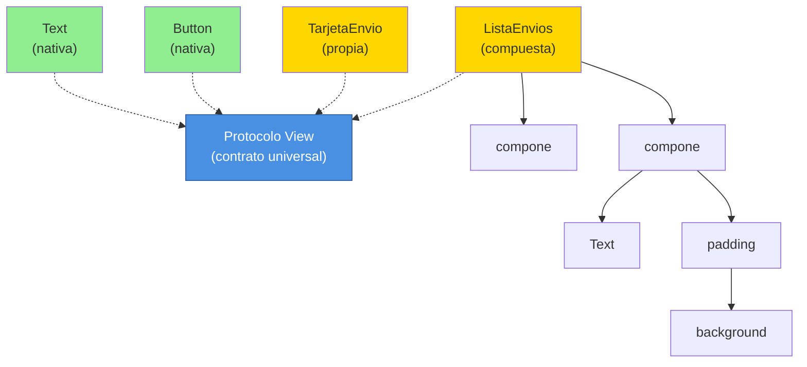
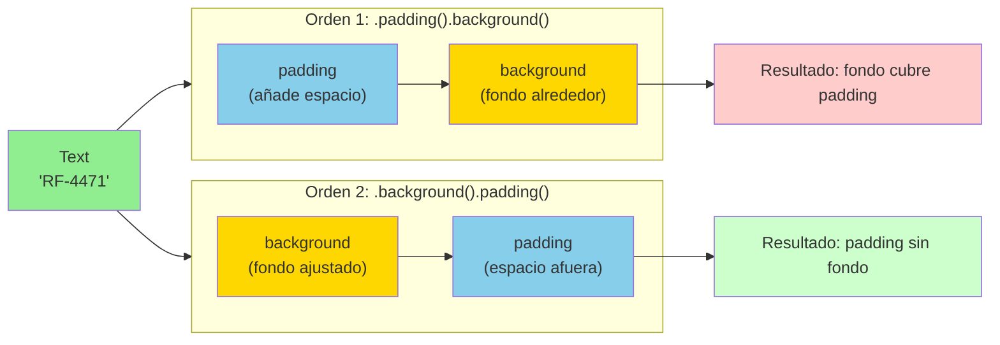

# Módulo 1: SwiftUI: vistas y layout declarativo


## Aprende construyendo

### Tema 1: El protocolo View y composición

#### Paso 1 · Objetivo y preparación
Al finalizar vas a construir `TarjetaEnvio`, una vista propia que muestra un envío de RutaFlow, y a componerla dentro de otra vista como si fuera nativa. Prerrequisitos: macOS, Xcode y Swift; verifica `xcodebuild -version`.

**Diagrama: Protocolo View y Composición**



#### Paso 2 · Contexto y caso real
La app del conductor de RutaFlow necesita mostrar la misma tarjeta de envío en la lista, en el detalle y en el resumen de ruta — sin repetir el mismo código de layout tres veces.

#### Paso 3 · Teoría, modelo mental y analogía
Cualquier tipo que implemente `View` con un `body` es componible en cualquier lugar donde iría `Text` o `Button` — el mismo certificado universal que permite mezclar piezas básicas y compuestas en un plano de construcción.
#### Paso 4 · Demostración guiada desde cero
```swift
struct TarjetaEnvio: View {
    let guia: String
    let estado: String
    var body: some View {
        Text("\(guia): \(estado)").padding().background(Color.blue.opacity(0.1))
    }
}

struct ListaEnvios: View {
    var body: some View {
        VStack {
            TarjetaEnvio(guia: "RF-4471", estado: "en ruta")
            TarjetaEnvio(guia: "RF-5002", estado: "entregado")
        }
    }
}
```
Resultado esperado: `ListaEnvios` compone dos `TarjetaEnvio` exactamente como compondría dos `Text` nativos — SwiftUI no distingue entre una vista "de sistema" y una propia.

**Demostración en Simulador:**

1. **Abre Xcode** y crea un nuevo proyecto iOS (SwiftUI).
2. **Copia el código anterior** a `ContentView.swift`.
3. **Abre el Inspector** (Panel derecho en Xcode): verifica que aparecen dos tarjetas.
4. **Corre en el simulador** (cmd+R): observa que ambas vistas se renderizan idénticamente.
5. **Inspecciona elementos:** pausa la app en el Simulador y usa **Debug → View Hierarchy** para ver la estructura: `ListaEnvios` → `TarjetaEnvio` → `Text`.
6. **Modifica el código:** cambiar el color de una `TarjetaEnvio` en la composición solo afecta esa instancia, no la otra — **prueba que son independientes**.

#### Paso 5 · Práctica guiada · Fallo deliberado

**Tarea:** agregá un tercer envío copiando y pegando el `Text().padding().background()` completo DENTRO de `ListaEnvios`, en vez de instanciar `TarjetaEnvio`.

```swift
struct ListaEnviosConDuplicacion: View {
    var body: some View {
        VStack {
            TarjetaEnvio(guia: "RF-4471", estado: "en ruta")
            TarjetaEnvio(guia: "RF-5002", estado: "entregado")
            // Fallo deliberado: duplicación de código
            Text("RF-5003: en ruta").padding().background(Color.blue.opacity(0.1))
        }
    }
}
```

**Resultado esperado del fallo:**
- El tercer envío aparece visualmente idéntico a los primeros dos.
- Pero el código está duplicado: `Text().padding().background()` aparece solo una vez en `TarjetaEnvio`, pero por separado para el tercero.

**Paso de diagnóstico:**
1. En Xcode, cambia el color de `.background()` en `TarjetaEnvio` a `.red`.
2. Corre la app: los primeros dos envíos se ponen rojos.
3. **El tercero sigue azul** — no se actualizó porque no estaba usando `TarjetaEnvio`.
4. Ahora tienes que cambiar el color en DOS lugares: en `TarjetaEnvio` Y en el código duplicado.

**¿Por qué ocurre?** Copiar y pegar layout hace una copia independiente que no se actualiza con el original. Es una violación del principio DRY (Don't Repeat Yourself).

**Corrección:** extrae el código duplicado de vuelta a una instancia de `TarjetaEnvio`, y ahora un cambio futuro se aplica automáticamente en los tres lugares.
#### Paso 6 · Práctica independiente
Extraé ese tercer envío de vuelta a una instancia de `TarjetaEnvio`, y agregale un estado `loading` que muestre un placeholder en vez de la guía real mientras el dato todavía no llegó.
#### Paso 7 · Cierre y evidencia

**Entrega:**
1. `TarjetaEnvio` compuesta dentro de `ListaEnvios` del Paso 4.
2. Código duplicado del Paso 5 (muestra el problema).
3. Extracción correcta + estado `loading` del Paso 6.
4. **Documento:** explica por qué una vista propia nunca necesita un mecanismo especial.

**Integración RutaFlow:**

Copia la estructura anterior a tu proyecto RutaFlow (archivo `examples/rutaflow/ios/TarjetaEnvio.swift`):

```swift
struct TarjetaEnvio: View {
    let guia: String
    let estado: EstadoEntrega  // Usa el enum de RutaFlowApp.swift
    
    var body: some View {
        HStack {
            VStack(alignment: .leading) {
                Text("Guía: \(guia)").font(.headline)
                Badge(estado: estado)
            }
            Spacer()
            Image(systemName: estado == .entregada ? "checkmark.circle.fill" : "truck.box")
                .foregroundStyle(estado == .entregada ? .green : .blue)
        }
        .padding()
        .background(Color(.systemGray6))
        .clipShape(.rect(cornerRadius: 8))
    }
}
```

Ahora, en `ContentView.swift` de RutaFlow, reemplaza `TarjetaEntreguaRow` por esta composición. Verifica que la app renderiza las entregas correctamente desde SwiftData.

**Siguiente paso:** estudia @State y @Binding (Módulo 2).

**Errores comunes:**
- View enorme sin extraer sub-vistas.
- Modificador perdido o en orden incorrecto.
- Índices inestables en ForEach (siempre usa identificadores explícitos).
- Preview con red real (falla o cuelga).

**Fuentes oficiales:**
- https://developer.apple.com/tutorials/swiftui
- https://developer.apple.com/documentation/swiftui
**¿Por qué es importante?** Porque composición declarativa y accesibilidad deben diseñarse juntas.
**Evidencia de aprendizaje:** entrega vista, preview, fallo visual y corrección.
**Conceptos clave:** cualquier tipo que describe su UI mediante `body` es componible en cualquier lugar.

```swift
struct TarjetaTarea: View {
    let titulo: String
    var body: some View {
        Text(titulo).padding().background(Color.blue.opacity(0.1))
    }
}
```

Cualquier tipo que implemente el protocolo `View` (con una propiedad computada `body` que describe su contenido) puede componerse dentro de otra vista exactamente de la misma forma en que se usaría cualquier vista nativa de SwiftUI (`Text`, `Button`), sin ninguna distinción especial de "vista de sistema" frente a "vista propia": este es el mismo principio de composición sobre herencia que rige el ecosistema de componentes de React (Módulo 1 del track de React), donde la unidad fundamental de construcción de UI es un componente que se compone dentro de otros, no una jerarquía de clases heredadas.

`some View` en la firma de retorno de `body` es un tipo opaco: le dice al compilador "este método devuelve algún tipo concreto que conforma a `View`, pero no revelo cuál específicamente", permitiendo que SwiftUI optimice internamente el tipo de retorno exacto (que en la práctica suele ser un tipo genérico anidado muy complejo, compuesto por las vistas internas usadas) sin que el desarrollador tenga que escribir ese tipo explícitamente ni que cambie la interfaz pública de la vista si su implementación interna cambia.

**Analogía:** el protocolo `View` es como un certificado universal que cualquier elemento de construcción puede portar (un ladrillo, un panel prefabricado, una estructura completa ya ensamblada), permitiendo que un arquitecto los combine libremente en un plano mayor sin preocuparse por si cada elemento individual es "básico" o "compuesto" — todos se integran según el mismo estándar.

**¿Por qué es importante?** El protocolo `View` unifica vistas nativas de SwiftUI y vistas propias bajo el mismo mecanismo de composición, permitiendo construir UIs complejas a partir de piezas pequeñas y reutilizables sin ninguna distinción especial entre ellas.

**Código del ejemplo:**

```swift
struct TarjetaTarea: View {
    let titulo: String
    var body: some View {
        Text(titulo).padding().background(Color.blue.opacity(0.1))
    }
}
```

### Tema 2: Orden de modificadores y layout con stacks

#### Paso 1 · Objetivo y preparación
Al finalizar vas a ver con tus propios ojos por qué `.padding().background()` y `.background().padding()` se ven distinto en `TarjetaEnvio` (Tema 1). Prerrequisitos: Tema 1 de este módulo.

**Diagrama: Orden de Modificadores (Composición de Capas)**



#### Paso 2 · Contexto y caso real
Si el fondo de color de `TarjetaEnvio` no cubre todo el padding que esperabas, el bug casi siempre está en el orden de los modificadores, no en un valor mal puesto.

#### Paso 3 · Teoría, modelo mental y analogía
Cada modificador envuelve la vista anterior en una nueva vista — como envolver un regalo: envolver primero con papel y meter en una caja da un resultado distinto que meter en la caja primero y envolver después.
#### Paso 4 · Demostración guiada desde cero
```swift
Text("RF-4471: en ruta").padding().background(Color.blue)   // el fondo cubre también el padding
Text("RF-4471: en ruta").background(Color.blue).padding()   // el fondo queda ajustado al texto, el padding se ve sin cubrir
```

Resultado esperado: la primera línea muestra un rectángulo azul que incluye el espacio del padding; la segunda muestra el azul ajustado solo al texto, con un borde sin color alrededor — mismo texto, mismos modificadores, orden distinto, resultado visualmente distinto.

**Demostración en Simulador: Observa cómo cambia el tamaño del fondo**

1. Copia el código anterior a `ContentView.swift`.
2. **Abre el Simulador** (cmd+R).
3. **Inspecciona visualmente:** pausa la app y usa **Debug → View Hierarchy** en Xcode.
4. Expande el árbol de vistas: verás dos `Text` con diferentes cadenas de `padding` → `background` o `background` → `padding`.
5. **Mide con la regla:** en ambas versiones, abre el inspector de propiedades en View Hierarchy y anota el tamaño del rectángulo azul.
   - Primera versión: el azul cubre más píxeles (incluye padding).
   - Segunda versión: el azul es más pequeño (solo texto).
6. **Toma una captura:** guarda ambos estados para tu evidencia de aprendizaje.

#### Paso 5 · Práctica guiada · Fallo deliberado

**Tarea:** aplica `.padding().background(Color.blue)` a `TarjetaEnvio` completa (Tema 1), y luego agrega OTRO `.padding()` después de `.background()`.

```swift
struct TarjetaEnvioConOrderIncorrecto: View {
    let guia: String
    let estado: String
    
    var body: some View {
        Text("\(guia): \(estado)")
            .padding()                          // primer padding
            .background(Color.blue)             // fondo azul alrededor
            .padding()                          // SEGUNDO padding (¿esperando que se sume?)
    }
}
```

**Resultado esperado del fallo:**
- Esperas: un rectángulo azul más grande, con padding adicional "sumado".
- Realidad: el segundo `.padding()` agrupa espacio SIN color alrededor del rectángulo azul que ya acabas de colorear.
- Visualmente: ves un rectángulo azul normal, pero rodeado de un espacio blanco/transparente adicional.

**Paso de diagnóstico:**
1. En Xcode, selecciona la vista en el Preview y abre View Hierarchy.
2. Expande la cadena de modificadores y ve que existen DOS `Padding` separados.
3. Anota la altura/ancho en cada paso:
   - Después del primer `.padding()`: espacio agregado al texto.
   - Después del `.background()`: color aplicado.
   - Después del segundo `.padding()`: espacio adicional fuera del color.
4. **El error es intuitivo pero incorrecto:** pensamos "agregar otro padding que se sume", pero en realidad envuelves el resultado ya coloreado.

**Corrección:**
Si realmente quieres espacio adicional alrededor del fondo azul, usa un único `.padding()` CON un valor más grande:

```swift
Text("\(guia): \(estado)")
    .padding(16)                // un solo padding de 16 puntos
    .background(Color.blue)
```
#### Paso 6 · Práctica independiente
Combiná `VStack`, `HStack` y `ZStack` para mostrar `TarjetaEnvio` con un ícono de estado superpuesto en la esquina (pista: `ZStack` superpone; necesitás un `HStack` adentro para alinear guía y estado lado a lado).
#### Paso 7 · Cierre y evidencia
Entregá las dos versiones con orden distinto del Paso 4, el padding mal entendido del Paso 5, y el layout combinado del Paso 6; explicá por qué "el orden no debería importar" es la intuición equivocada más común al empezar con modificadores de SwiftUI. Siguiente paso: estudia estado. Errores comunes: View enorme, modifier perdido, índices inestables y preview con red real. Fuentes oficiales: https://developer.apple.com/tutorials/swiftui y https://developer.apple.com/documentation/swiftui.
**¿Por qué es importante?** Porque composición declarativa y accesibilidad deben diseñarse juntas.
**Evidencia de aprendizaje:** entrega vista, preview, fallo visual y corrección.
**Conceptos clave:** cada modificador envuelve la vista anterior en una nueva vista, el orden determina el resultado.

```swift
Text("Hola").padding().background(Color.blue)   // padding queda DENTRO del fondo azul
Text("Hola").background(Color.blue).padding()    // padding queda FUERA, el fondo no lo cubre
```

Cada modificador en SwiftUI (`.padding()`, `.background()`) no muta la vista original en el sentido imperativo, sino que envuelve la vista anterior produciendo una nueva vista compuesta: `.padding().background(Color.blue)` aplica primero el padding y luego coloca el fondo azul alrededor de ese resultado ya expandido (por lo que el fondo cubre también el espacio del padding), mientras que `.background(Color.blue).padding()` coloca el fondo azul ajustado exactamente al tamaño original del texto, y luego agrega el padding por fuera de ese fondo ya fijado (por lo que el padding queda sin cubrir por el color). Esta diferencia visual, sorprendente para quien no conoce el mecanismo subyacente, se explica completamente entendiendo que cada modificador construye una capa adicional envolviendo la anterior, en el orden exacto en que se escriben.

`VStack`, `HStack` y `ZStack` son los tres contenedores de layout fundamentales: apilan contenido verticalmente, horizontalmente, y superpuesto respectivamente, combinables libremente para construir cualquier estructura visual compleja, de forma directamente análoga a `Column`, `Row` y `Box` en Jetpack Compose (Módulo 2 del track de Android), reflejando que ambos ecosistemas de UI declarativa moderna convergieron hacia el mismo conjunto mínimo de primitivas de layout componibles.

**Analogía:** los modificadores encadenados son como capas sucesivas de envoltorio aplicadas a un regalo: envolver primero con papel y luego meter en una caja produce un resultado distinto (la caja cubre el papel completo) que meter primero en una caja pequeña y luego envolver esa caja con papel (el papel se ajusta solo al tamaño exacto de la caja) — el orden de aplicación cambia físicamente el resultado final.

**¿Por qué es importante?** Entender que cada modificador envuelve la vista anterior en una nueva capa explica por qué el orden cambia el resultado visual, un comportamiento que sorprende a quien no conoce este mecanismo subyacente pero que se vuelve predecible una vez internalizado.

**Código del ejemplo:**

```swift
VStack(spacing: 8) {
    HStack { Text("Izquierda"); Spacer(); Text("Derecha") }
    ZStack { Image("fondo"); Text("Superpuesto") }
}
```

### Tema 3: Previews, LazyVGrid/ScrollView y property wrappers

#### Paso 1 · Objetivo y preparación
Al finalizar vas a mostrar una lista completa de envíos de RutaFlow con `LazyVGrid` dentro de un `ScrollView`, e iterar su diseño con Previews sin correr la app. Prerrequisitos: Temas 1-2 de este módulo.
#### Paso 2 · Contexto y caso real
Si un conductor tiene 50 envíos pendientes en el día, renderizar las 50 `TarjetaEnvio` de una sola vez con un `VStack` normal desperdicia trabajo en celdas que todavía no son visibles en pantalla.
#### Paso 3 · Teoría, modelo mental y analogía
`LazyVGrid` solo crea las celdas efectivamente visibles, no todas de antemano; el sistema de Previews renderiza una vista en el canvas de Xcode sin compilar ni correr la app completa — un modelo a escala instantáneo en vez de construir la habitación real cada vez.
#### Paso 4 · Demostración guiada desde cero
```swift
struct ListaEnviosGrid: View {
    let envios: [(guia: String, estado: String)]
    var body: some View {
        ScrollView {
            LazyVGrid(columns: [GridItem(.adaptive(minimum: 150))]) {
                ForEach(envios, id: \.guia) { envio in
                    TarjetaEnvio(guia: envio.guia, estado: envio.estado)
                }
            }
        }
    }
}

#Preview {
    ListaEnviosGrid(envios: [("RF-4471", "en ruta"), ("RF-5002", "entregado")])
}
```
Resultado esperado: el `#Preview` renderiza la grilla completa en el canvas de Xcode, sin compilar la app ni abrir el simulador — cambiar el array de `envios` se refleja casi al instante.
#### Paso 5 · Práctica guiada
Pista: cambiá el Preview para que llame a una API real de RutaFlow en vez de pasar datos de muestra fijos — ese es el fallo deliberado: el canvas de Previews no está pensado para esperar una respuesta de red real, y el preview queda cargando indefinidamente o falla, en vez de iterar instantáneamente como se espera de este sistema.
#### Paso 6 · Práctica independiente
Corregí el Paso 5 volviendo a datos de muestra fijos, y agregá un estado `loading` y uno `error` como dos Previews adicionales separados (`#Preview("Cargando")`, `#Preview("Error")`), para poder ver los tres estados sin tocar código de red real.
#### Paso 7 · Cierre y evidencia
Entregá la grilla con Preview funcionando del Paso 4, el intento de red real roto del Paso 5, y los tres estados (`loading`/`error`/datos) del Paso 6; explicá por qué el sistema de Previews está pensado para datos de muestra, no para red real. Siguiente paso: estudia estado. Errores comunes: View enorme, modifier perdido, índices inestables y preview con red real. Fuentes oficiales: https://developer.apple.com/tutorials/swiftui y https://developer.apple.com/documentation/swiftui.
**¿Por qué es importante?** Porque composición declarativa y accesibilidad deben diseñarse juntas.
**Evidencia de aprendizaje:** entrega vista, preview, fallo visual y corrección.
**Conceptos clave:** iteración casi instantánea sin recompilar la app completa.

```swift
#Preview {
    TarjetaTarea(titulo: "Comprar leche")
}
```

El sistema de Previews de Xcode renderiza una vista directamente en el canvas del editor sin necesidad de compilar y ejecutar la app completa en el simulador o dispositivo, reduciendo drásticamente el ciclo de iteración al diseñar o ajustar una vista específica: un cambio en el código de la vista se refleja casi instantáneamente en el canvas, comparado con el tiempo considerablemente mayor que tomaría recompilar toda la app y navegar manualmente hasta esa pantalla específica en el simulador para verificar el mismo cambio visual.

`LazyVGrid` y `ScrollView` combinados permiten renderizar listas y grillas potencialmente largas de forma eficiente: `LazyVGrid` (el prefijo "lazy" indicando que solo se crean las vistas de las celdas efectivamente visibles, no todas de antemano) organiza contenido en una grilla de columnas configurables dentro de un `ScrollView` que provee el desplazamiento; `didSet`/`willSet` son observadores de propiedad que ejecutan código antes o después de que una propiedad cambie de valor, útiles para reaccionar a cambios de estado fuera del modelo de property wrappers de SwiftUI (`@State`, `@Observable`), y un `@propertyWrapper` personalizado permite encapsular lógica reutilizable de validación o transformación de un valor detrás de una sintaxis de anotación simple, similar en espíritu a los decoradores de otros lenguajes.

**Analogía:** el sistema de Previews es como poder ver el resultado de un ajuste de diseño de interiores en un modelo a escala instantáneo, en vez de tener que construir la habitación completa a tamaño real cada vez que se quiere probar un cambio de disposición de muebles.

**¿Por qué es importante?** El sistema de Previews acelera drásticamente la iteración de diseño de una vista específica, evitando el costo de recompilar y navegar manualmente en la app completa para cada ajuste visual menor.

**Código del ejemplo:**

```swift
#Preview {
    TarjetaTarea(titulo: "Comprar leche")
}
// Renderiza en el canvas de Xcode, sin compilar ni correr la app completa
```

---


## Laboratorio práctico

**Objetivo del laboratorio:** construir una pantalla SwiftUI compuesta a partir de al menos 3 vistas reutilizables propias.

**Requisitos previos:** Módulo 0 completado.

| Paso | Acción | Código | Explicación |
|---|---|---|---|
| 1 | Crear `TarjetaTarea` con un título como parámetro | Ver Tema 1 | Componerla dentro de otra vista |
| 2 | Aplicar dos modificadores en distinto orden | Ver Tema 2 | `.padding().background()` vs inverso |
| 3 | Combinar `VStack`, `HStack` y `ZStack` | Ver Tema 2 | Layout completo |
| 4 | Usar el sistema de Previews | Ver Tema 3 | Iterar sin recompilar toda la app |
| 5 | Extraer una sub-vista reutilizable | Ver Tema 1 | A partir de código repetido en dos pantallas |

**Verificación:** el laboratorio se considera exitoso si la pantalla final está compuesta por al menos 3 vistas propias reutilizables (no un único `body` monolítico), y si el Preview renderiza correctamente sin necesidad de correr la app en el simulador.

**Errores comunes y soluciones**

- **Escribir toda la UI en un único `body` extenso sin extraer sub-vistas.** Dificulta la reutilización y la legibilidad; extrae vistas propias cuando el código se repite o crece demasiado.
- **Confundir el orden de `.padding()`/`.background()` esperando el mismo resultado sin importar el orden.** Recuerda que cada modificador envuelve la vista anterior; el orden importa.
- **Usar `VStack`/`HStack` regulares para listas potencialmente largas.** Prefiere `LazyVGrid`/`ScrollView` con carga perezosa para eficiencia.

---

* Código: `examples/rutaflow/ios/ContentView.swift`
* Proyecto: proyecto integrador RutaFlow
* Visualización: concepto mostrado en diagrama
