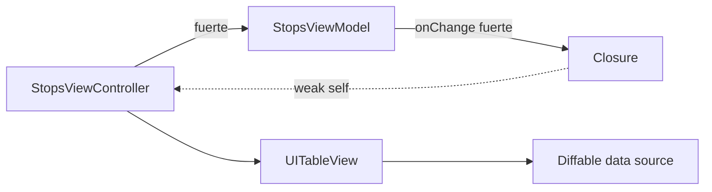

# Módulo 10: Performance, accesibilidad y HIG


## Aprende construyendo

### Tema 1: Instruments

#### Paso 1 · Objetivo y preparación
Al finalizar podrás evaluar una app iOS en producción desde cero. Prerrequisitos: macOS, Xcode, simulador y un editor. Verifica xcodebuild -version.

#### Paso 2 · Contexto y caso real
En un caso real, una app de entregas debe responder, anunciar estados y convivir con UIKit existente sin degradar experiencia.

#### Paso 3 · Teoría, modelo mental y analogía
Instruments mide CPU, memoria y red; VoiceOver prueba semántica y foco; HIG y Dynamic Type guían decisiones; UIKit interop conserva inversión existente. La analogía es una inspección de flota: rendimiento, accesibilidad y compatibilidad son revisiones diferentes.

#### Paso 4 · Demostración guiada desde cero
Parte de una carpeta vacía:
```bash
mkdir ejemplo-ios-m10
cd ejemplo-ios-m10
swift package init --type executable
swift test
```
Crea una vista SwiftUI con accessibilityLabel, Dynamic Type y una medición simple; ábrela en Xcode y usa Instruments/VoiceOver.

#### Paso 5 · Práctica guiada
Pista: elimina deliberadamente una etiqueta accesible para provocar un fallo deliberado de navegación con VoiceOver; observa y corrige. Resultado esperado: foco y anuncio comprensibles.

#### Paso 6 · Práctica independiente
Añade bridge UIViewControllerRepresentable, perfil de memoria, checklist HIG y prueba con tamaños de texto extremos.

#### Paso 7 · Cierre y evidencia
Guarda perfiles, capturas y checklist; como siguiente paso estudia distribución. Errores comunes: medir en debug, usar color único, bloquear Dynamic Type y envolver UIKit sin lifecycle. Fuentes oficiales: https://developer.apple.com/accessibility/ y https://developer.apple.com/design/human-interface-guidelines/.
**¿Por qué es importante?** Porque calidad móvil incluye velocidad, acceso y continuidad tecnológica.
**Evidencia de aprendizaje:** entrega perfil, captura VoiceOver, bridge y corrección.
**Conceptos clave:** medición real de comportamiento, no percepción subjetiva.

Xcode incluye Instruments, un conjunto de herramientas de perfilado con plantillas especializadas: Time Profiler identifica qué función específica consume más tiempo de CPU durante una interacción concreta, Allocations rastrea el uso de memoria y detecta posibles fugas, y Core Animation mide frames perdidos durante animaciones y scrolls. Grabar una sesión real con estas herramientas sobre una interacción específica de la app (por ejemplo, un scroll que se percibe ligeramente entrecortado) revela cuellos de botella concretos y medibles que la simple percepción subjetiva de "se siente fluido" en el simulador durante desarrollo no puede revelar, dado que el simulador corre en hardware de escritorio considerablemente más potente que un dispositivo real, ocultando problemas de rendimiento que solo se manifiestan en el hardware real de los usuarios.

Esta necesidad de medición real sobre percepción subjetiva es un principio universal de optimización de performance, compartido con el uso del Layout Inspector en Android (Módulo 10 del track de Android) para detectar recomposiciones innecesarias: en ambos casos, la intuición de "se ve rápido" no sustituye una medición objetiva con la herramienta de perfilado apropiada de la plataforma.

**Analogía:** Instruments es como un electrocardiograma que revela irregularidades reales en el funcionamiento de un órgano que un examen visual superficial ("se ve saludable") no puede detectar, requiriendo instrumentación especializada para medir lo que efectivamente ocurre por debajo de la percepción superficial.

**¿Por qué es importante?** Instruments revela cuellos de botella de rendimiento reales y medibles (consumo de CPU, memoria, frames perdidos) que la percepción subjetiva de fluidez en el simulador no puede detectar, dado que el hardware de desarrollo suele ser considerablemente más potente que los dispositivos reales de los usuarios.

**Diagrama:**

```
Time Profiler    → qué función consume más CPU
Allocations      → uso de memoria y posibles fugas
Core Animation   → frames perdidos en animaciones/scroll
```

### Tema 2: Accesibilidad con VoiceOver

#### Paso 1 · Objetivo y preparación
Al finalizar podrás evaluar una app iOS en producción desde cero. Prerrequisitos: macOS, Xcode, simulador y un editor. Verifica xcodebuild -version.

#### Paso 2 · Contexto y caso real
En un caso real, una app de entregas debe responder, anunciar estados y convivir con UIKit existente sin degradar experiencia.

#### Paso 3 · Teoría, modelo mental y analogía
Instruments mide CPU, memoria y red; VoiceOver prueba semántica y foco; HIG y Dynamic Type guían decisiones; UIKit interop conserva inversión existente. La analogía es una inspección de flota: rendimiento, accesibilidad y compatibilidad son revisiones diferentes.

#### Paso 4 · Demostración guiada desde cero
Parte de una carpeta vacía:
```bash
mkdir ejemplo-ios-m10
cd ejemplo-ios-m10
swift package init --type executable
swift test
```
Crea una vista SwiftUI con accessibilityLabel, Dynamic Type y una medición simple; ábrela en Xcode y usa Instruments/VoiceOver.

#### Paso 5 · Práctica guiada
Pista: elimina deliberadamente una etiqueta accesible para provocar un fallo deliberado de navegación con VoiceOver; observa y corrige. Resultado esperado: foco y anuncio comprensibles.

#### Paso 6 · Práctica independiente
Añade bridge UIViewControllerRepresentable, perfil de memoria, checklist HIG y prueba con tamaños de texto extremos.

#### Paso 7 · Cierre y evidencia
Guarda perfiles, capturas y checklist; como siguiente paso estudia distribución. Errores comunes: medir en debug, usar color único, bloquear Dynamic Type y envolver UIKit sin lifecycle. Fuentes oficiales: https://developer.apple.com/accessibility/ y https://developer.apple.com/design/human-interface-guidelines/.
**¿Por qué es importante?** Porque calidad móvil incluye velocidad, acceso y continuidad tecnológica.
**Evidencia de aprendizaje:** entrega perfil, captura VoiceOver, bridge y corrección.
**Conceptos clave:** verificación activa con la herramienta real, no inspección visual.

```swift
Image(systemName: "trash")
    .accessibilityLabel("Eliminar tarea")
```

Sin `.accessibilityLabel` explícito, VoiceOver (el lector de pantalla nativo de iOS) lee un elemento sin texto visible (como un ícono usado como botón) simplemente como "imagen" genérica, una descripción completamente inútil para un usuario con discapacidad visual que necesita entender qué hace ese elemento antes de interactuar con él; navegar la propia app activamente con VoiceOver habilitado (deslizando entre elementos, sin mirar la pantalla directamente) expone rápidamente estos huecos de accesibilidad de una forma que una simple inspección visual del diseño, por cuidadosa que sea, no puede revelar, dado que un desarrollador vidente evalúa naturalmente la UI de forma visual, no auditiva.

Este mismo principio de "probar activamente con la herramienta de accesibilidad real, no asumir accesibilidad por inspección visual" es idéntico al de probar con TalkBack en Android (Módulo 10 de ese track), reflejando que la verificación activa con el lector de pantalla real es el único método confiable de descubrir estos problemas en cualquier plataforma móvil.

**Analogía:** navegar la propia app con VoiceOver activado es como intentar usar el propio producto con los ojos vendados para descubrir qué tan bien funciona realmente para alguien que depende completamente del tacto y el sonido, una prueba que ninguna revisión puramente visual del diseño puede sustituir.

**¿Por qué es importante?** Verificar activamente la app con VoiceOver expone huecos de accesibilidad que una inspección visual del diseño no puede revelar, dado que un desarrollador vidente evalúa naturalmente la UI de forma visual, no de la forma en que un usuario con discapacidad visual la experimenta.

**Código del ejemplo:**

```swift
Image(systemName: "trash").accessibilityLabel("Eliminar tarea")
// Sin esto, VoiceOver lee simplemente "imagen" — inútil para el usuario
```

### Tema 3: Human Interface Guidelines, Dynamic Type e interop con UIKit

#### Paso 1 · Objetivo y preparación
Al finalizar podrás evaluar una app iOS en producción desde cero. Prerrequisitos: macOS, Xcode, simulador y un editor. Verifica xcodebuild -version.

#### Paso 2 · Contexto y caso real
En un caso real, una app de entregas debe responder, anunciar estados y convivir con UIKit existente sin degradar experiencia.

#### Paso 3 · Teoría, modelo mental y analogía
Instruments mide CPU, memoria y red; VoiceOver prueba semántica y foco; HIG y Dynamic Type guían decisiones; UIKit interop conserva inversión existente. La analogía es una inspección de flota: rendimiento, accesibilidad y compatibilidad son revisiones diferentes.

#### Paso 4 · Demostración guiada desde cero
Parte de una carpeta vacía:
```bash
mkdir ejemplo-ios-m10
cd ejemplo-ios-m10
swift package init --type executable
swift test
```
Crea una vista SwiftUI con accessibilityLabel, Dynamic Type y una medición simple; ábrela en Xcode y usa Instruments/VoiceOver.

#### Paso 5 · Práctica guiada
Pista: elimina deliberadamente una etiqueta accesible para provocar un fallo deliberado de navegación con VoiceOver; observa y corrige. Resultado esperado: foco y anuncio comprensibles.

#### Paso 6 · Práctica independiente
Añade bridge UIViewControllerRepresentable, perfil de memoria, checklist HIG y prueba con tamaños de texto extremos.

#### Paso 7 · Cierre y evidencia
Guarda perfiles, capturas y checklist; como siguiente paso estudia distribución. Errores comunes: medir en debug, usar color único, bloquear Dynamic Type y envolver UIKit sin lifecycle. Fuentes oficiales: https://developer.apple.com/accessibility/ y https://developer.apple.com/design/human-interface-guidelines/.
**¿Por qué es importante?** Porque calidad móvil incluye velocidad, acceso y continuidad tecnológica.
**Evidencia de aprendizaje:** entrega perfil, captura VoiceOver, bridge y corrección.
**Conceptos clave:** convenciones documentadas que hacen que una app se sienta nativa, más allá de usar SwiftUI.

Apple documenta convenciones esperadas de comportamiento e interacción en sus Human Interface Guidelines (HIG): tamaño mínimo de áreas táctiles (44x44 puntos, garantizando que elementos interactivos sean cómodamente presionables sin errores de precisión), iconografía consistente mediante SF Symbols (el sistema de íconos nativo de Apple, ya integrado visualmente con la tipografía del sistema), y patrones de navegación estándar (los estudiados en el Módulo 3); seguir estas convenciones documentadas hace que una app "se sienta nativa" de forma genuina, un resultado que usar SwiftUI por sí solo no garantiza automáticamente si las decisiones de diseño e interacción se apartan de esas convenciones esperadas por el usuario habitual de iOS.

```swift
Text("Título").font(.title) // escala automáticamente con la configuración de tamaño de texto del usuario
.preferredColorScheme(.dark) // para previsualizar dark mode explícitamente
```

Dynamic Type permite que el texto de la app escale automáticamente según la configuración de tamaño de texto que el usuario eligió en Ajustes de Accesibilidad, y probar la app específicamente en el tamaño de texto más grande disponible revela rápidamente layouts que se rompen con texto considerablemente más largo de lo esperado (etiquetas truncadas, botones desbordados); `UIViewRepresentable` y `UIViewControllerRepresentable` permiten embeber Views y ViewControllers de UIKit (el framework de UI imperativo anterior a SwiftUI) dentro de un árbol SwiftUI, útil durante una migración incremental o para integrar componentes de terceros que aún no ofrecen una versión SwiftUI nativa, el mismo patrón que `AndroidView`/`ComposeView` en Android (Módulo 10 de ese track).

**Analogía:** las Human Interface Guidelines son como el código de vestimenta y protocolo esperado en un ambiente profesional específico: seguirlas hace que alguien se perciba genuinamente parte de ese ambiente, mientras que ignorarlas, aun con las mejores intenciones y herramientas modernas disponibles, produce una impresión de no pertenecer del todo al contexto esperado.

**¿Por qué es importante?** Seguir las HIG hace que una app "se sienta" nativa de forma genuina, un resultado que usar SwiftUI por sí solo no garantiza automáticamente; probar con Dynamic Type en su tamaño más grande revela layouts que se rompen con texto más largo de lo esperado.

**Diagrama:**

```
UIViewRepresentable            → embebe una View de UIKit DENTRO de SwiftUI
UIViewControllerRepresentable  → embebe un ViewController de UIKit DENTRO de SwiftUI
```

### Tema 4: UIKit desde cero para mantener aplicaciones reales

#### Paso 1 · Objetivo y preparación
Al finalizar podrás evaluar una app iOS en producción desde cero. Prerrequisitos: macOS, Xcode, simulador y un editor. Verifica xcodebuild -version.

#### Paso 2 · Contexto y caso real
En un caso real, una app de entregas debe responder, anunciar estados y convivir con UIKit existente sin degradar experiencia.

#### Paso 3 · Teoría, modelo mental y analogía
Instruments mide CPU, memoria y red; VoiceOver prueba semántica y foco; HIG y Dynamic Type guían decisiones; UIKit interop conserva inversión existente. La analogía es una inspección de flota: rendimiento, accesibilidad y compatibilidad son revisiones diferentes.

#### Paso 4 · Demostración guiada desde cero
Parte de una carpeta vacía:
```bash
mkdir ejemplo-ios-m10
cd ejemplo-ios-m10
swift package init --type executable
swift test
```
Crea una vista SwiftUI con accessibilityLabel, Dynamic Type y una medición simple; ábrela en Xcode y usa Instruments/VoiceOver.

#### Paso 5 · Práctica guiada
Pista: elimina deliberadamente una etiqueta accesible para provocar un fallo deliberado de navegación con VoiceOver; observa y corrige. Resultado esperado: foco y anuncio comprensibles.

#### Paso 6 · Práctica independiente
Añade bridge UIViewControllerRepresentable, perfil de memoria, checklist HIG y prueba con tamaños de texto extremos.

#### Paso 7 · Cierre y evidencia
Guarda perfiles, capturas y checklist; como siguiente paso estudia distribución. Errores comunes: medir en debug, usar color único, bloquear Dynamic Type y envolver UIKit sin lifecycle. Fuentes oficiales: https://developer.apple.com/accessibility/ y https://developer.apple.com/design/human-interface-guidelines/.
**¿Por qué es importante?** Porque calidad móvil incluye velocidad, acceso y continuidad tecnológica.
**Evidencia de aprendizaje:** entrega perfil, captura VoiceOver, bridge y corrección.
**Conceptos clave:** `UIViewController`, ciclo de vida, vista programática, Auto Layout, `UITableViewDiffableDataSource`, reutilización, ARC, captura débil y migración gradual.

Construiremos en UIKit la lista de paradas de RutaFlow. Aunque un proyecto nuevo pueda elegir SwiftUI, muchas aplicaciones empresariales conservan pantallas UIKit, Storyboards o componentes de terceros. Saber envolver un controlador no basta: necesitas comprender quién crea la vista, cuándo se carga, cómo se actualiza y por qué una referencia fuerte puede impedir que salga de memoria.

**Requisitos previos:** módulos 0–9, Xcode y un proyecto iOS existente. Crea un grupo `Features/Stops/UIKit` y estos archivos:

```text
RutaFlow/
├── Features/Stops/Domain/StopSummary.swift
├── Features/Stops/UIKit/StopsViewController.swift
├── Features/Stops/UIKit/StopCell.swift
├── Features/Stops/UIKit/StopsViewModel.swift
└── Features/Stops/UIKit/StopsViewControllerRepresentable.swift
RutaFlowTests/Features/Stops/StopsViewModelTests.swift
```

`loadView()` construye la jerarquía cuando no usas Storyboard. `viewDidLoad()` configura lo que debe ocurrir una vez; `viewWillAppear` sirve para trabajo que debe repetirse antes de cada presentación. No hagas una petición de red incondicional en cada aparición sin definir caché, cancelación y actualización.

```swift
import UIKit

@MainActor
final class StopsViewController: UIViewController {
    enum Section { case main }

    private let tableView = UITableView(frame: .zero, style: .insetGrouped)
    private let viewModel: StopsViewModel
    private lazy var dataSource = makeDataSource()

    init(viewModel: StopsViewModel) {
        self.viewModel = viewModel
        super.init(nibName: nil, bundle: nil)
    }

    @available(*, unavailable)
    required init?(coder: NSCoder) { fatalError("Usa init(viewModel:)") }

    override func loadView() {
        view = UIView()
        view.backgroundColor = .systemBackground
        tableView.translatesAutoresizingMaskIntoConstraints = false
        view.addSubview(tableView)
        NSLayoutConstraint.activate([
            tableView.leadingAnchor.constraint(equalTo: view.safeAreaLayoutGuide.leadingAnchor),
            tableView.trailingAnchor.constraint(equalTo: view.safeAreaLayoutGuide.trailingAnchor),
            tableView.topAnchor.constraint(equalTo: view.safeAreaLayoutGuide.topAnchor),
            tableView.bottomAnchor.constraint(equalTo: view.bottomAnchor)
        ])
    }

    override func viewDidLoad() {
        super.viewDidLoad()
        title = "Paradas"
        tableView.register(StopCell.self, forCellReuseIdentifier: StopCell.reuseID)
        viewModel.onChange = { [weak self] stops in self?.render(stops) }
        Task { await viewModel.load() }
    }
}
```

Auto Layout expresa relaciones, no posiciones absolutas. Al anclar la tabla a `safeAreaLayoutGuide`, el contenido respeta cámara, barra y orientaciones. `translatesAutoresizingMaskIntoConstraints = false` evita que UIKit genere restricciones implícitas que compitan con las tuyas.

Usa una fuente diffable para que identidad y cambios sean explícitos. `StopSummary.ID` debe ser estable; no uses el índice de la fila como identidad porque ordenar o insertar haría que la selección apunte a otra parada.

```swift
private func makeDataSource() -> UITableViewDiffableDataSource<Section, StopSummary.ID> {
    UITableViewDiffableDataSource(tableView: tableView) { [weak viewModel] table, path, id in
        let cell = table.dequeueReusableCell(
            withIdentifier: StopCell.reuseID,
            for: path
        ) as! StopCell
        if let stop = viewModel?.stop(id: id) { cell.configure(with: stop) }
        return cell
    }
}

private func render(_ stops: [StopSummary]) {
    var snapshot = NSDiffableDataSourceSnapshot<Section, StopSummary.ID>()
    snapshot.appendSections([.main])
    snapshot.appendItems(stops.map(\.id))
    dataSource.apply(snapshot, animatingDifferences: true)
}
```

La celda reutilizable debe restablecer contenido que podría pertenecer a una fila anterior. Si carga imágenes, conserva y cancela la tarea correspondiente en `prepareForReuse()`.

```swift
final class StopCell: UITableViewCell {
    static let reuseID = "StopCell"
    private var imageTask: Task<Void, Never>?

    func configure(with stop: StopSummary) {
        var content = defaultContentConfiguration()
        content.text = stop.recipientName
        content.secondaryText = stop.address
        contentConfiguration = content
        accessibilityLabel = "Entrega para \(stop.recipientName), \(stop.address)"
    }

    override func prepareForReuse() {
        super.prepareForReuse()
        imageTask?.cancel()
        imageTask = nil
        contentConfiguration = nil
        accessibilityLabel = nil
    }
}
```

ARC libera instancias cuando ya no existen referencias fuertes. El controlador retiene al ViewModel y, si el closure del ViewModel retiene al controlador, ambos forman un ciclo. `[weak self]` rompe ese ciclo cuando el callback no necesita prolongar la vida de la pantalla. No uses `unowned` por costumbre: fallará si el objeto ya fue liberado.



**Analogía:** el controlador es el director de una terminal, Auto Layout define acuerdos de espacio y la fuente diffable mantiene el tablero de salidas por identificadores. La celda es una pantalla reutilizada: debe limpiarse antes de anunciar otra parada.

**¿Por qué es importante?** UIKit sigue presente en aplicaciones productivas y SDKs. Comprender ciclo de vida, restricciones, reutilización y ARC permite mantenerlas, diagnosticar fugas y migrar pantalla por pantalla sin reescribir todo el producto.

**Ejecución y resultado esperado:** desde Xcode ejecuta el esquema en un iPhone pequeño y uno grande. Deben mostrarse paradas sin advertencias de constraints, Dynamic Type debe expandir texto sin superposición y al entrar/salir diez veces Instruments no debe conservar diez controladores.

**Fallo deliberado:** elimina `[weak self]`, abre y cierra la pantalla diez veces y usa Memory Graph. Identifica el ciclo `controller → viewModel → closure → controller`; restáuralo y verifica que `deinit` se ejecute. Después omite `prepareForReuse` y desplázate rápidamente para observar contenido incorrecto heredado.

**Modificación sin copiar:** presenta este controlador desde SwiftUI mediante `UIViewControllerRepresentable`, luego implementa el camino inverso con `UIHostingController`. Documenta cuál lado posee navegación y ciclo de vida durante una migración gradual.

---


## Laboratorio práctico

**Objetivo del laboratorio:** realizar una auditoría de accesibilidad (VoiceOver) de una pantalla con mejoras aplicadas.

**Requisitos previos:** Módulo 9 completado.

| Paso | Acción | Código/Comando | Explicación |
|---|---|---|---|
| 1 | Grabar una sesión con Instruments (Time Profiler) | Ver Tema 1 | Sobre una interacción lenta |
| 2 | Activar VoiceOver y navegar solo con gestos | Ver Tema 2 | Sin mirar la pantalla |
| 3 | Agregar `.accessibilityLabel` donde falte | Ver Tema 2 | Elementos sin texto visible |
| 4 | Verificar con Dynamic Type en tamaño más grande y dark mode | Ver Tema 3 | Revisa layouts rotos |
| 5 | Construir la lista UIKit de paradas | Ver Tema 4 | Ciclo de vida, constraints y fuente diffable |
| 6 | Buscar una fuga con Memory Graph | Ver Tema 4 | Rompe y corrige el ciclo de retención |

**Verificación:** el laboratorio se considera exitoso si VoiceOver describe correctamente todos los elementos interactivos tras las mejoras aplicadas, y si la pantalla se ve correctamente sin layouts rotos con el tamaño de texto más grande disponible.

**Errores comunes y soluciones**

- **Confiar en la percepción subjetiva de fluidez en el simulador sin medir con Instruments.** El hardware de desarrollo es más potente; mide en dispositivo real.
- **Omitir `.accessibilityLabel` en íconos interactivos.** Sin él, VoiceOver los describe genéricamente como "imagen", inútil para el usuario.
- **Ignorar las HIG asumiendo que usar SwiftUI garantiza automáticamente una sensación nativa.** Revisa activamente las convenciones documentadas por Apple.
- **Usar índices como identidad de una tabla.** Usa IDs estables para que inserciones y ordenamientos no cambien el significado de una fila.
- **Capturar `self` fuertemente en un callback retenido.** Dibuja el grafo de referencias y usa captura débil cuando el callback no sea propietario.

---
