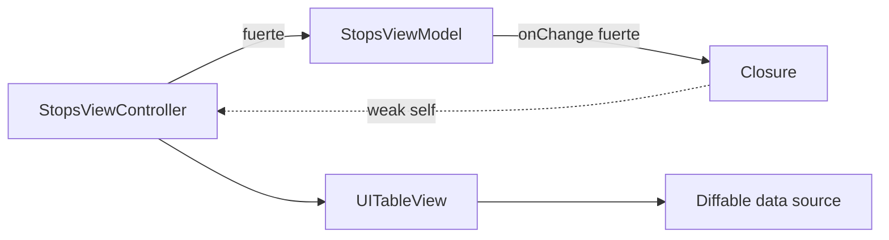

# Módulo 10: Performance, accesibilidad y HIG


## Aprende construyendo

### Tema 1: Instruments

#### Paso 1 · Objetivo y preparación
Al finalizar vas a perfilar con Instruments (Time Profiler) el scroll de `ListaEnvios` y a medir qué función específica consume más CPU durante ese scroll. Prerrequisitos: Módulo 1 completo, Xcode con un dispositivo real o simulador.

#### Paso 2 · Contexto y caso real
En el simulador, el scroll de `ListaEnvios` "se siente fluido", pero varios conductores reportaron que en sus iPhones más viejos se traba — la percepción subjetiva en hardware de desarrollo no revela el problema real.

#### Paso 3 · Teoría, modelo mental y analogía
Instruments mide CPU, memoria y frames reales durante una interacción concreta — un electrocardiograma que revela irregularidades que un examen visual superficial no detecta.

#### Paso 4 · Demostración guiada desde cero
```text
1. Abrí el proyecto y elegí Product > Profile (⌘I)
2. Seleccioná la plantilla "Time Profiler"
3. Grabá mientras hacés scroll en ListaEnvios
4. Detené la grabación y ordená por "Self Weight"
```
Resultado esperado: Time Profiler muestra qué función específica (por ejemplo, el formateo de fecha de cada fila dentro del `body`) consume más tiempo de CPU durante el scroll — no una sensación de "se traba", sino una función puntual identificada con un porcentaje de tiempo real.

#### Paso 5 · Práctica guiada
Pista: repetí el mismo perfil, pero esta vez en el simulador en vez de en un iPhone real — ese es el fallo deliberado: el Time Profiler muestra un consumo de CPU bajo y sin picos notorios, ocultando el problema real que sí aparece en el hardware real de un conductor con un iPhone más viejo.

#### Paso 6 · Práctica independiente
Corregí el Paso 5 volviendo a perfilar en un dispositivo real, y agregá una segunda sesión de Allocations mientras entrás y salís de `ListaEnvios` diez veces — confirmá si la memoria usada vuelve a su nivel original o queda creciendo (señal de fuga).

#### Paso 7 · Cierre y evidencia
Entregá el perfil de Time Profiler del Paso 4, la diferencia detectada entre simulador y dispositivo real del Paso 5, y la sesión de Allocations del Paso 6; explicá por qué medir en el simulador no sustituye medir en el hardware real de un usuario. Siguiente paso: estudia accesibilidad con VoiceOver. Errores comunes: medir solo en el simulador, confiar en la percepción subjetiva de fluidez, y no perfilar builds de Release (que optimizan distinto a Debug). Fuentes oficiales: https://developer.apple.com/documentation/xcode/improving-your-app-s-performance y https://developer.apple.com/documentation/xcode/analyzing-the-performance-of-your-swift-code.
**¿Por qué es importante?** Porque Instruments revela cuellos de botella reales y medibles que la percepción subjetiva de fluidez en el simulador no puede detectar.
**Evidencia de aprendizaje:** entrega perfil de CPU, diferencia simulador/dispositivo detectada y sesión de memoria.
**Conceptos clave:** medición real de comportamiento, no percepción subjetiva.

Xcode incluye Instruments, un conjunto de herramientas de perfilado con plantillas especializadas: Time Profiler identifica qué función específica consume más tiempo de CPU durante una interacción concreta, Allocations rastrea el uso de memoria y detecta posibles fugas, y Core Animation mide frames perdidos durante animaciones y scrolls. Grabar una sesión real con estas herramientas sobre una interacción específica de la app (por ejemplo, un scroll que se percibe ligeramente entrecortado) revela cuellos de botella concretos y medibles que la simple percepción subjetiva de "se siente fluido" en el simulador durante desarrollo no puede revelar, dado que el simulador corre en hardware de escritorio considerablemente más potente que un dispositivo real, ocultando problemas de rendimiento que solo se manifiestan en el hardware real de los usuarios.

Esta necesidad de medición real sobre percepción subjetiva es un principio universal de optimización de performance, compartido con el uso del Layout Inspector en Android (Módulo 10 del track de Android) para detectar recomposiciones innecesarias: en ambos casos, la intuición de "se ve rápido" no sustituye una medición objetiva con la herramienta de perfilado apropiada de la plataforma.

**Analogía:** Instruments es como un electrocardiograma que revela irregularidades reales en el funcionamiento de un órgano que un examen visual superficial ("se ve saludable") no puede detectar, requiriendo instrumentación especializada para medir lo que efectivamente ocurre por debajo de la percepción superficial.

**¿Por qué es importante?** Instruments revela cuellos de botella de rendimiento reales y medibles (consumo de CPU, memoria, frames perdidos) que la percepción subjetiva de fluidez en el simulador no puede detectar, dado que el hardware de desarrollo suele ser considerablemente más potente que los dispositivos reales de los usuarios.

**Diagrama:**

```
Time Profiler    → qué función consume más CPU
Allocations      → uso de memoria y posibles fugas
Core Animation   → frames perdidos en animaciones/scroll
```

### Tema 2: Accesibilidad con VoiceOver

#### Paso 1 · Objetivo y preparación
Al finalizar vas a activar VoiceOver y navegar `DetalleEnvio` solo con gestos (sin mirar la pantalla), agregando `.accessibilityLabel` donde el lector de pantalla no describa nada útil. Prerrequisitos: Tema 1 de este módulo.

#### Paso 2 · Contexto y caso real
El botón de confirmar entrega en `DetalleEnvio` usa un ícono (`Image(systemName: "checkmark.circle")`) sin ningún texto visible — nadie confirmó todavía qué anuncia VoiceOver al llegar a ese botón.

#### Paso 3 · Teoría, modelo mental y analogía
Sin `.accessibilityLabel` explícito, VoiceOver lee un ícono sin texto como "imagen" genérica — navegar la propia app con VoiceOver activado expone estos huecos como usar el producto con los ojos vendados.

#### Paso 4 · Demostración guiada desde cero
```swift
Button(action: confirmarEntrega) {
    Image(systemName: "checkmark.circle")
}
.accessibilityLabel("Confirmar entrega")
```
Resultado esperado: al activar VoiceOver (Ajustes > Accesibilidad > VoiceOver) y deslizar hasta ese botón, el lector anuncia "Confirmar entrega, botón" — no "imagen, botón", que no le dice nada al usuario sobre qué hace.

#### Paso 5 · Práctica guiada
Pista: quitá `.accessibilityLabel("Confirmar entrega")` del botón — ese es el fallo deliberado: con VoiceOver activado, deslizar hasta ese botón ahora anuncia solo "imagen, botón", y un conductor con discapacidad visual no tiene forma de saber que ese es el botón para confirmar la entrega sin verlo.

#### Paso 6 · Práctica independiente
Corregí el Paso 5 restaurando el `.accessibilityLabel`, y revisá el resto de `DetalleEnvio` navegando completamente con VoiceOver activado (sin mirar la pantalla) — agregá labels a cualquier otro ícono sin texto que encuentres en el camino.

#### Paso 7 · Cierre y evidencia
Entregá el label agregado del Paso 4, el anuncio inútil detectado en el Paso 5, y la lista de labels adicionales agregados en el Paso 6; explicá por qué una inspección visual del diseño, por cuidadosa que sea, no detecta estos huecos. Siguiente paso: estudia HIG, Dynamic Type e interop con UIKit. Errores comunes: evaluar accesibilidad solo mirando el diseño, dejar íconos interactivos sin label, y asumir que un texto visible cercano "explica" un botón sin label propio. Fuentes oficiales: https://developer.apple.com/accessibility/ y https://developer.apple.com/documentation/swiftui/view-accessibility.
**¿Por qué es importante?** Porque verificar activamente con VoiceOver expone huecos de accesibilidad que una inspección visual no puede revelar.
**Evidencia de aprendizaje:** entrega label agregado, anuncio inútil detectado y revisión completa de la pantalla.
**Conceptos clave:** verificación activa con la herramienta real, no inspección visual.

```swift
Image(systemName: "trash")
    .accessibilityLabel("Eliminar tarea")
```

Sin `.accessibilityLabel` explícito, VoiceOver (el lector de pantalla nativo de iOS) lee un elemento sin texto visible (como un ícono usado como botón) simplemente como "imagen" genérica, una descripción completamente inútil para un usuario con discapacidad visual que necesita entender qué hace ese elemento antes de interactuar con él; navegar la propia app activamente con VoiceOver habilitado (deslizando entre elementos, sin mirar la pantalla directamente) expone rápidamente estos huecos de accesibilidad de una forma que una simple inspección visual del diseño, por cuidadosa que sea, no puede revelar, dado que un desarrollador vidente evalúa naturalmente la UI de forma visual, no auditiva.

Este mismo principio de "probar activamente con la herramienta de accesibilidad real, no asumir accesibilidad por inspección visual" es idéntico al de probar con TalkBack en Android (Módulo 10 de ese track), reflejando que la verificación activa con el lector de pantalla real es el único método confiable de descubrir estos problemas en cualquier plataforma móvil.

**Analogía:** navegar la propia app con VoiceOver activado es como intentar usar el propio producto con los ojos vendados para descubrir qué tan bien funciona realmente para alguien que depende completamente del tacto y el sonido, una prueba que ninguna revisión puramente visual del diseño puede sustituir.

**¿Por qué es importante?** Verificar activamente la app con VoiceOver expone huecos de accesibilidad que una inspección visual del diseño no puede revelar, dado que un desarrollador vidente evalúa naturalmente la UI de forma visual, no de la forma en que un usuario con discapacidad visual la experimenta.

**Código del ejemplo:**

```swift
Image(systemName: "trash").accessibilityLabel("Eliminar tarea")
// Sin esto, VoiceOver lee simplemente "imagen" — inútil para el usuario
```

### Tema 3: Human Interface Guidelines, Dynamic Type e interop con UIKit

#### Paso 1 · Objetivo y preparación
Al finalizar vas a probar `DetalleEnvio` con el tamaño de Dynamic Type más grande disponible, y a revisar sus botones contra la medida mínima de 44x44 puntos que exige HIG. Prerrequisitos: Tema 2 de este módulo.

#### Paso 2 · Contexto y caso real
El botón de confirmar entrega se ve bien con el tamaño de texto por defecto, pero nadie probó todavía qué pasa cuando un conductor configura el tamaño de texto más grande en Ajustes de Accesibilidad.

#### Paso 3 · Teoría, modelo mental y analogía
Dynamic Type escala el texto según la configuración del usuario; HIG documenta convenciones (como el área táctil mínima de 44x44 puntos) que hacen que una app se sienta nativa — un código de vestimenta esperado en un ambiente profesional.

#### Paso 4 · Demostración guiada desde cero
```swift
Text(envio.direccion)
    .font(.body) // escala automáticamente con la configuración de Dynamic Type
Button(action: confirmarEntrega) {
    Image(systemName: "checkmark.circle").frame(width: 44, height: 44)
}
```
Resultado esperado: con el tamaño de texto por defecto, `envio.direccion` se ve en una sola línea; al activar el tamaño de texto más grande (Ajustes > Accesibilidad > Texto más grande > máximo) y volver a la pantalla, el texto se expande a dos o tres líneas sin truncarse ni desbordar el contenedor.

#### Paso 5 · Práctica guiada
Pista: cambiá `.font(.body)` por `.font(.system(size: 15))` con un tamaño fijo en puntos — ese es el fallo deliberado: ahora el texto ya NO escala con la configuración de Dynamic Type del usuario, y alguien que necesita texto grande para leer sigue viendo el mismo tamaño fijo sin importar su configuración de accesibilidad.

#### Paso 6 · Práctica independiente
Corregí el Paso 5 volviendo a `.font(.body)`, y revisá cada botón interactivo de `DetalleEnvio` con el Inspector de Xcode, confirmando que ninguno mide menos de 44x44 puntos de área táctil real.

#### Paso 7 · Cierre y evidencia
Entregá la prueba con Dynamic Type grande del Paso 4, el bloqueo detectado en el Paso 5, y la revisión de áreas táctiles del Paso 6; explicá por qué usar SwiftUI por sí solo no garantiza automáticamente que una app respete las HIG. Siguiente paso: estudia UIKit desde cero para mantener pantallas existentes. Errores comunes: usar tamaños de fuente fijos en puntos, botones con área táctil menor a 44x44, y no probar con el tamaño de texto más grande disponible. Fuentes oficiales: https://developer.apple.com/design/human-interface-guidelines/ y https://developer.apple.com/documentation/swiftui/text.
**¿Por qué es importante?** Porque seguir las HIG hace que una app se sienta nativa de forma genuina, un resultado que usar SwiftUI por sí solo no garantiza.
**Evidencia de aprendizaje:** entrega prueba con Dynamic Type grande, bloqueo detectado y revisión de áreas táctiles.
**Conceptos clave:** convenciones documentadas que hacen que una app se sienta nativa, más allá de usar SwiftUI.

Apple documenta convenciones esperadas de comportamiento e interacción en sus Human Interface Guidelines (HIG): tamaño mínimo de áreas táctiles (44x44 puntos, garantizando que elementos interactivos sean cómodamente presionables sin errores de precisión), iconografía consistente mediante SF Symbols (el sistema de íconos nativo de Apple, ya integrado visualmente con la tipografía del sistema), y patrones de navegación estándar (los estudiados en el Módulo 3); seguir estas convenciones documentadas hace que una app "se sienta nativa" de forma genuina, un resultado que usar SwiftUI por sí solo no garantiza automáticamente si las decisiones de diseño e interacción se apartan de esas convenciones esperadas por el usuario habitual de iOS.

```swift
Text("Título").font(.title) // escala automáticamente con la configuración de tamaño de texto del usuario
.preferredColorScheme(.dark) // para previsualizar dark mode explícitamente
```

Dynamic Type permite que el texto de la app escale automáticamente según la configuración de tamaño de texto que el usuario eligió en Ajustes de Accesibilidad, y probar la app específicamente en el tamaño de texto más grande disponible revela rápidamente layouts que se rompen con texto considerablemente más largo de lo esperado (etiquetas truncadas, botones desbordados); `UIViewRepresentable` y `UIViewControllerRepresentable` permiten embeber Views y ViewControllers de UIKit (el framework de UI imperativo anterior a SwiftUI) dentro de un árbol SwiftUI, útil durante una migración incremental o para integrar componentes de terceros que aún no ofrecen una versión SwiftUI nativa, el mismo patrón que `AndroidView`/`ComposeView` en Android (Módulo 10 de ese track).

**Analogía:** las Human Interface Guidelines son como el código de vestimenta y protocolo esperado en un ambiente profesional específico: seguirlas hace que alguien se perciba genuinamente parte de ese ambiente, mientras que ignorarlas, aun con las mejores intenciones y herramientas modernas disponibles, produce una impresión de no pertenecer del todo al contexto esperado.

**¿Por qué es importante?** Seguir las HIG hace que una app "se sienta" nativa de forma genuina, un resultado que usar SwiftUI por sí solo no garantiza automáticamente; probar con Dynamic Type en su tamaño más grande revela layouts que se rompen con texto más largo de lo esperado.

**Diagrama:**

```
UIViewRepresentable            → embebe una View de UIKit DENTRO de SwiftUI
UIViewControllerRepresentable  → embebe un ViewController de UIKit DENTRO de SwiftUI
```

### Tema 4: UIKit desde cero para mantener aplicaciones reales

#### Paso 1 · Objetivo y preparación
Al finalizar vas a construir en UIKit la lista de paradas de RutaFlow (`StopsViewController`), entendiendo quién crea la vista, cuándo se carga, y por qué una referencia fuerte puede impedir que salga de memoria. Prerrequisitos: módulos 0-9, un proyecto iOS existente.

#### Paso 2 · Contexto y caso real
Muchas aplicaciones empresariales reales conservan pantallas UIKit o Storyboards que nadie puede simplemente reescribir de un día para el otro — necesitás saber mantenerlas, no solo envolverlas desde SwiftUI.

#### Paso 3 · Teoría, modelo mental y analogía
Un `UIViewController` tiene un ciclo de vida explícito (`loadView`, `viewDidLoad`, `viewWillAppear`) y Auto Layout expresa relaciones, no posiciones absolutas — el controlador es el director de una terminal, y la fuente diffable mantiene el tablero de salidas por identificadores.

#### Paso 4 · Demostración guiada desde cero
```swift
final class StopsViewController: UIViewController {
    private let tableView = UITableView(frame: .zero, style: .insetGrouped)
    private let viewModel: StopsViewModel
    init(viewModel: StopsViewModel) {
        self.viewModel = viewModel
        super.init(nibName: nil, bundle: nil)
    }
    required init?(coder: NSCoder) { fatalError("Usa init(viewModel:)") }
    override func viewDidLoad() {
        super.viewDidLoad()
        title = "Paradas"
        Task { await viewModel.load() }
    }
}
```
Resultado esperado: `StopsViewController` no tiene ningún inicializador que funcione sin un `viewModel` (el `required init?(coder:)` falla intencionalmente), y `viewDidLoad()` dispara la carga una sola vez cuando la vista se crea, no cada vez que la pantalla reaparece.

#### Paso 5 · Práctica guiada
Pista: movés `Task { await viewModel.load() }` de `viewDidLoad()` a `viewWillAppear(_:)` sin agregar ningún control de caché — ese es el fallo deliberado: ahora cada vez que el conductor vuelve a esta pantalla (por ejemplo, al volver de `DetalleEnvio`) se dispara una nueva petición de red completa, aunque la lista de paradas no haya cambiado.

#### Paso 6 · Práctica independiente
Corregí el Paso 5 devolviendo la carga a `viewDidLoad()`, y agregá en su lugar un `refresh()` explícito disparado solo por un pull-to-refresh del usuario, nunca automáticamente en cada `viewWillAppear`.

#### Paso 7 · Cierre y evidencia
Entregá el controlador con carga única del Paso 4, la petición de red repetida provocada en el Paso 5, y el `refresh()` explícito del Paso 6; explicá la diferencia entre trabajo que debe ocurrir una sola vez (`viewDidLoad`) y trabajo que podría repetirse antes de cada aparición (`viewWillAppear`), y por qué esa segunda categoría necesita caché o control explícito. Siguiente paso: estudia distribución y certificados. Errores comunes: peticiones de red incondicionales en `viewWillAppear`, inicializar sin el ViewModel requerido, y usar el índice de fila como identidad en una fuente diffable. Fuentes oficiales: https://developer.apple.com/documentation/uikit/uiviewcontroller y https://developer.apple.com/documentation/uikit/uitableviewdiffabledatasource.
**¿Por qué es importante?** Porque confundir trabajo de una sola vez con trabajo repetible en el ciclo de vida de UIKit produce peticiones de red redundantes o datos que nunca se actualizan.
**Evidencia de aprendizaje:** entrega controlador con carga única, petición repetida detectada y refresh explícito.
**Conceptos clave:** `UIViewController`, ciclo de vida, vista programática, Auto Layout, `UITableViewDiffableDataSource`, reutilización, ARC, captura débil y migración gradual.

Construiremos en UIKit la lista de paradas de nuestra app. Aunque un proyecto nuevo pueda elegir SwiftUI, muchas aplicaciones empresariales conservan pantallas UIKit, Storyboards o componentes de terceros. Saber envolver un controlador no basta: necesitas comprender quién crea la vista, cuándo se carga, cómo se actualiza y por qué una referencia fuerte puede impedir que salga de memoria.

**Requisitos previos:** módulos 0–9, Xcode y un proyecto iOS existente. Crea un grupo `Features/Stops/UIKit` y estos archivos:

```text
App/
├── Features/Stops/Domain/StopSummary.swift
├── Features/Stops/UIKit/StopsViewController.swift
├── Features/Stops/UIKit/StopCell.swift
├── Features/Stops/UIKit/StopsViewModel.swift
└── Features/Stops/UIKit/StopsViewControllerRepresentable.swift
AppTests/Features/Stops/StopsViewModelTests.swift
```

`loadView()` construye la jerarquía cuando no usas Storyboard. `viewDidLoad()` configura lo que debe ocurrir una vez; `viewWillAppear` sirve para trabajo que debe repetirse antes de cada presentación. No hagas una petición de red incondicional en cada aparición sin definir caché, cancelación y actualización.

```swift
import UIKit

@MainActor
final class StopsViewController: UIViewController {
    enum Section { case main }

    private let tableView = UITableView(frame: .zero, style: .insetGrouped)
    private let viewModel: StopsViewModel
    private lazy var dataSource = makeDataSource()

    init(viewModel: StopsViewModel) {
        self.viewModel = viewModel
        super.init(nibName: nil, bundle: nil)
    }

    @available(*, unavailable)
    required init?(coder: NSCoder) { fatalError("Usa init(viewModel:)") }

    override func loadView() {
        view = UIView()
        view.backgroundColor = .systemBackground
        tableView.translatesAutoresizingMaskIntoConstraints = false
        view.addSubview(tableView)
        NSLayoutConstraint.activate([
            tableView.leadingAnchor.constraint(equalTo: view.safeAreaLayoutGuide.leadingAnchor),
            tableView.trailingAnchor.constraint(equalTo: view.safeAreaLayoutGuide.trailingAnchor),
            tableView.topAnchor.constraint(equalTo: view.safeAreaLayoutGuide.topAnchor),
            tableView.bottomAnchor.constraint(equalTo: view.bottomAnchor)
        ])
    }

    override func viewDidLoad() {
        super.viewDidLoad()
        title = "Paradas"
        tableView.register(StopCell.self, forCellReuseIdentifier: StopCell.reuseID)
        viewModel.onChange = { [weak self] stops in self?.render(stops) }
        Task { await viewModel.load() }
    }
}
```

Auto Layout expresa relaciones, no posiciones absolutas. Al anclar la tabla a `safeAreaLayoutGuide`, el contenido respeta cámara, barra y orientaciones. `translatesAutoresizingMaskIntoConstraints = false` evita que UIKit genere restricciones implícitas que compitan con las tuyas.

Usa una fuente diffable para que identidad y cambios sean explícitos. `StopSummary.ID` debe ser estable; no uses el índice de la fila como identidad porque ordenar o insertar haría que la selección apunte a otra parada.

```swift
private func makeDataSource() -> UITableViewDiffableDataSource<Section, StopSummary.ID> {
    UITableViewDiffableDataSource(tableView: tableView) { [weak viewModel] table, path, id in
        let cell = table.dequeueReusableCell(
            withIdentifier: StopCell.reuseID,
            for: path
        ) as! StopCell
        if let stop = viewModel?.stop(id: id) { cell.configure(with: stop) }
        return cell
    }
}

private func render(_ stops: [StopSummary]) {
    var snapshot = NSDiffableDataSourceSnapshot<Section, StopSummary.ID>()
    snapshot.appendSections([.main])
    snapshot.appendItems(stops.map(\.id))
    dataSource.apply(snapshot, animatingDifferences: true)
}
```

La celda reutilizable debe restablecer contenido que podría pertenecer a una fila anterior. Si carga imágenes, conserva y cancela la tarea correspondiente en `prepareForReuse()`.

```swift
final class StopCell: UITableViewCell {
    static let reuseID = "StopCell"
    private var imageTask: Task<Void, Never>?

    func configure(with stop: StopSummary) {
        var content = defaultContentConfiguration()
        content.text = stop.recipientName
        content.secondaryText = stop.address
        contentConfiguration = content
        accessibilityLabel = "Entrega para \(stop.recipientName), \(stop.address)"
    }

    override func prepareForReuse() {
        super.prepareForReuse()
        imageTask?.cancel()
        imageTask = nil
        contentConfiguration = nil
        accessibilityLabel = nil
    }
}
```

ARC libera instancias cuando ya no existen referencias fuertes. El controlador retiene al ViewModel y, si el closure del ViewModel retiene al controlador, ambos forman un ciclo. `[weak self]` rompe ese ciclo cuando el callback no necesita prolongar la vida de la pantalla. No uses `unowned` por costumbre: fallará si el objeto ya fue liberado.


```mermaid
flowchart LR
  VC[StopsViewController] -->|fuerte| VM[StopsViewModel]
  VM -->|onChange fuerte| C[Closure]
  C -. weak self .-> VC
  VC --> TV[UITableView]
  TV --> DS[Diffable data source]
```

**Analogía:** el controlador es el director de una terminal, Auto Layout define acuerdos de espacio y la fuente diffable mantiene el tablero de salidas por identificadores. La celda es una pantalla reutilizada: debe limpiarse antes de anunciar otra parada.

**¿Por qué es importante?** UIKit sigue presente en aplicaciones productivas y SDKs. Comprender ciclo de vida, restricciones, reutilización y ARC permite mantenerlas, diagnosticar fugas y migrar pantalla por pantalla sin reescribir todo el producto.

**Ejecución y resultado esperado:** desde Xcode ejecuta el esquema en un iPhone pequeño y uno grande. Deben mostrarse paradas sin advertencias de constraints, Dynamic Type debe expandir texto sin superposición y al entrar/salir diez veces Instruments no debe conservar diez controladores.

**Fallo deliberado:** elimina `[weak self]`, abre y cierra la pantalla diez veces y usa Memory Graph. Identifica el ciclo `controller → viewModel → closure → controller`; restáuralo y verifica que `deinit` se ejecute. Después omite `prepareForReuse` y desplázate rápidamente para observar contenido incorrecto heredado.

**Modificación sin copiar:** presenta este controlador desde SwiftUI mediante `UIViewControllerRepresentable`, luego implementa el camino inverso con `UIHostingController`. Documenta cuál lado posee navegación y ciclo de vida durante una migración gradual.

---


## Laboratorio práctico

**Objetivo del laboratorio:** realizar una auditoría de accesibilidad (VoiceOver) de una pantalla con mejoras aplicadas.

**Requisitos previos:** Módulo 9 completado.

| Paso | Acción | Código/Comando | Explicación |
|---|---|---|---|
| 1 | Grabar una sesión con Instruments (Time Profiler) | Ver Tema 1 | Sobre una interacción lenta |
| 2 | Activar VoiceOver y navegar solo con gestos | Ver Tema 2 | Sin mirar la pantalla |
| 3 | Agregar `.accessibilityLabel` donde falte | Ver Tema 2 | Elementos sin texto visible |
| 4 | Verificar con Dynamic Type en tamaño más grande y dark mode | Ver Tema 3 | Revisa layouts rotos |
| 5 | Construir la lista UIKit de paradas | Ver Tema 4 | Ciclo de vida, constraints y fuente diffable |
| 6 | Buscar una fuga con Memory Graph | Ver Tema 4 | Rompe y corrige el ciclo de retención |

**Verificación:** el laboratorio se considera exitoso si VoiceOver describe correctamente todos los elementos interactivos tras las mejoras aplicadas, y si la pantalla se ve correctamente sin layouts rotos con el tamaño de texto más grande disponible.

**Errores comunes y soluciones**

- **Confiar en la percepción subjetiva de fluidez en el simulador sin medir con Instruments.** El hardware de desarrollo es más potente; mide en dispositivo real.
- **Omitir `.accessibilityLabel` en íconos interactivos.** Sin él, VoiceOver los describe genéricamente como "imagen", inútil para el usuario.
- **Ignorar las HIG asumiendo que usar SwiftUI garantiza automáticamente una sensación nativa.** Revisa activamente las convenciones documentadas por Apple.
- **Usar índices como identidad de una tabla.** Usa IDs estables para que inserciones y ordenamientos no cambien el significado de una fila.
- **Capturar `self` fuertemente en un callback retenido.** Dibuja el grafo de referencias y usa captura débil cuando el callback no sea propietario.

---
