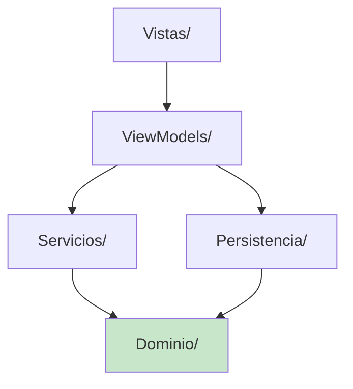
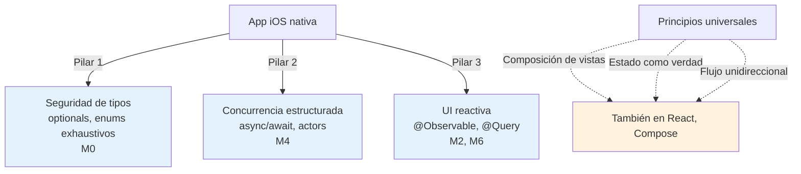

# Módulo 12: Proyecto integrador: app SwiftUI completa


## Aprende construyendo

### Tema 1: Arquitectura del proyecto integrador

#### Paso 1 · Objetivo y preparación
Al finalizar vas a trazar en un diagrama de capas cómo se conectan `EnviosViewModel`, `ServicioAPI` y SwiftData en RutaFlow, confirmando que ninguna vista accede directamente a ninguna de las dos fuentes de datos. Prerrequisitos: módulos 0-11 completos.

#### Paso 2 · Contexto y caso real
A lo largo del track construiste piezas sueltas de RutaFlow (vistas, ViewModels, servicios, persistencia, tests) en módulos distintos — nadie confirmó todavía que todas esas piezas encajan juntas como un único sistema coherente.

#### Paso 3 · Teoría, modelo mental y analogía
El proyecto integra capas con ownership claro (vista, ViewModel, servicio, persistencia, dominio) — una central móvil donde cada estación tiene un contrato y una responsabilidad distinta, no una mezcla de todo en un solo lugar.

#### Paso 4 · Demostración guiada desde cero
```text
Vistas/         ← SwiftUI puro (Módulos 1-3)
ViewModels/      ← @Observable, orquesta servicios (Módulo 8)
Servicios/        ← URLSession + async/await (Módulo 5)
Persistencia/      ← SwiftData (Módulo 6)
Dominio/            ← structs/enums puros (Módulo 0)
Tests/                ← Swift Testing sobre dominio (Módulo 9)
```
Resultado esperado: recorriendo el código fuente de RutaFlow carpeta por carpeta, cada archivo vive exactamente en la capa que le corresponde — ninguna vista en `Vistas/` importa `URLSession` ni `ModelContext` directamente, y ningún archivo en `Dominio/` importa nada de `Servicios/` ni `Persistencia/`.

#### Paso 5 · Práctica guiada
Pista: agregá temporalmente una llamada directa a `ServicioAPI().obtenerEnvios()` dentro del `body` de `ListaEnvios`, "solo para probar algo rápido" — ese es el fallo deliberado: ahora la vista conoce directamente el servicio de red, rompiendo la separación de capas que el Módulo 8 estableció, y cualquier test de `ListaEnvios` necesitaría de nuevo renderizar la vista completa.

#### Paso 6 · Práctica independiente
Corregí el Paso 5 devolviendo esa llamada a `EnviosViewModel`, y recorré el resto del código fuente de RutaFlow buscando otras violaciones similares de capas (una vista que importe SwiftData directamente, o un ViewModel que importe SwiftUI) — documentá cualquiera que encuentres y corregila.

#### Paso 7 · Cierre y evidencia
Entregá el diagrama de capas del Paso 4, la violación provocada en el Paso 5, y el resultado de la revisión del Paso 6; explicá con tus propias palabras por qué integrar todos los módulos del track en un solo proyecto expone violaciones de capas que un módulo aislado nunca mostraría. Siguiente paso: aplicá esta misma revisión al proyecto integrador de Android o Flutter. Errores comunes: lógica de red o persistencia filtrada directamente en una vista, un ViewModel que importa SwiftUI, y Dominio que depende de Servicios o Persistencia en vez de ser puro. Fuentes oficiales: https://developer.apple.com/documentation/swiftui y https://developer.apple.com/documentation/foundation/urlsession.
**¿Por qué es importante?** Porque integrar todo el track en un único proyecto expone violaciones de capas (y acoplamientos ocultos) que un módulo estudiado aisladamente nunca revela.
**Evidencia de aprendizaje:** entrega diagrama de capas, violación provocada y resultado de la revisión completa.
**Conceptos clave:** cada módulo del track como una pieza que encaja en un sistema mayor coherente.

```
Vistas/         ← SwiftUI puro
ViewModels/      ← @Observable, orquesta servicios (módulo 8)
Servicios/        ← URLSession + async/await (módulo 5)
Persistencia/      ← SwiftData (módulo 6)
Dominio/            ← structs/enums puros (módulo 0)
Tests/                ← Swift Testing sobre la capa de dominio (módulo 9)
```

Este proyecto integra directamente cada concepto estudiado a lo largo del track en un único sistema coherente: el modelado de dominio seguro con structs y enums sin force-unwrap (Módulo 0) forma la base de los tipos que fluyen entre capas; la navegación con `NavigationStack` y al menos un sheet (Módulo 3) estructura las pantallas; la concurrencia estructurada con `async`/`await` y `TaskGroup` (Módulo 4) resuelve el networking de forma segura; la persistencia local reactiva con SwiftData (Módulo 6) cierra el ciclo offline; la arquitectura MVVM con inyección de dependencias por inicializador (Módulo 8) organiza todo el código en capas testeables; y los tests de la capa de dominio con Swift Testing (Módulo 9) dan confianza real antes de subir el build a TestFlight (Módulo 11).

Esta integración demuestra que cada concepto estudiado de forma aislada en su propio módulo encaja naturalmente como parte de un sistema mayor, reflejando cómo se construyen apps iOS profesionales reales: no como una colección de features aisladas, sino como capas que se comunican de forma predecible entre sí, cada una con una responsabilidad clara y bien delimitada.

**Analogía:** el proyecto integrador es como el ensamblaje final de un vehículo donde cada componente estudiado por separado (motor, transmisión, sistema eléctrico) se integra en un producto funcional completo, y solo al ensamblarlos todos juntos se puede verificar que realmente funcionan de forma coordinada como se esperaba de cada uno individualmente.

**¿Por qué es importante?** Integrar cada módulo del track en un proyecto real demuestra que los conceptos estudiados por separado (modelado de dominio, navegación, concurrencia, persistencia, arquitectura, testing) se combinan naturalmente en un sistema coherente, reflejando cómo se construyen apps iOS profesionales reales.

**Diagrama:**

```
Vistas/         ← SwiftUI puro
ViewModels/      ← @Observable, orquesta servicios
Servicios/        ← URLSession + async/await
Persistencia/      ← SwiftData
Dominio/            ← structs/enums puros
Tests/                ← Swift Testing
```

**Diagrama: capas y dirección permitida de dependencia**



En el proyecto integrador RutaFlow, `EnviosViewModel` vive en `examples/rutaflow/ios/RutaFlowApp/ViewModels/EnviosViewModel.swift`. Límite de la decisión: esta separación estricta en capas no conviene para un prototipo descartable de una sola pantalla — ahí el costo de las carpetas y protocolos intermedios supera el beneficio; se justifica específicamente cuando el proyecto, como RutaFlow, crece a varios módulos que varios desarrolladores tocan en paralelo.

### Tema 2: Sincronización entre red y persistencia local

#### Paso 1 · Objetivo y preparación
Al finalizar vas a hacer que `EnviosViewModel` orqueste tanto `ServicioAPI` (red) como SwiftData (persistencia local) para que `ListaEnvios` siga mostrando datos aunque la red falle. Prerrequisitos: Tema 1 de este módulo.

#### Paso 2 · Contexto y caso real
Si un conductor pierde señal en medio de una ruta, `ListaEnvios` no debería quedar vacía — debería seguir mostrando los últimos envíos sincronizados, y actualizarse silenciosamente cuando la red vuelva.

#### Paso 3 · Teoría, modelo mental y analogía
El ViewModel orquesta ambas fuentes sin que la vista conozca ninguna de las dos directamente — un gerente de logística que coordina almacén local y proveedores externos sin que el personal de ventas trate directamente con ninguno.

#### Paso 4 · Demostración guiada desde cero
```swift
@Observable
class EnviosViewModel {
    var envios: [EnvioLocal] = []
    private let servicio: ServicioAPI
    private let context: ModelContext

    func sincronizar() async {
        guard let remotos = try? await servicio.obtenerEnvios() else { return }
        remotos.forEach { context.insert($0) }
        try? context.save()
    }
}
```
Resultado esperado: `ListaEnvios` observa `envios` (poblado desde SwiftData), y llamar a `sincronizar()` actualiza esos datos locales con lo que responda `ServicioAPI`; si `ServicioAPI` falla, `sincronizar()` simplemente no actualiza nada, y la vista sigue mostrando los últimos envíos guardados localmente.

#### Paso 5 · Práctica guiada
Pista: cambiá `try?` por `try` (sin el `?`) en la llamada a `servicio.obtenerEnvios()` dentro de una función que no declaraste como `throws` — ese es el fallo deliberado: el proyecto deja de compilar, porque propagar el error sin manejarlo exige que `sincronizar()` también sea `throws`, y entonces quien la llama necesitaría decidir qué hacer con ese error.

#### Paso 6 · Práctica independiente
Corregí el Paso 5 devolviendo `try?`, y agregá un log (no una propagación a la UI) cuando `obtenerEnvios()` falle, para poder diagnosticar fallas de sincronización sin interrumpir al conductor con un error intrusivo por cada corte de señal.

#### Paso 7 · Cierre y evidencia
Entregá el ViewModel orquestando ambas fuentes del Paso 4, el error de compilación del Paso 5, y el log de diagnóstico del Paso 6; explicá por qué una falla de sincronización en background merece una degradación silenciosa, mientras que un error durante una acción directa del conductor (como confirmar una entrega) sí debería mostrarse explícitamente. Siguiente paso: cerrá el track con una retrospectiva. Errores comunes: vista que accede directamente a `URLSession` o `ModelContext`, propagar errores de sincronización en background de forma intrusiva a la UI, y degradar silenciosamente errores que sí deberían ser visibles (como un PIN incorrecto al confirmar entrega). Fuentes oficiales: https://developer.apple.com/documentation/swiftdata y https://developer.apple.com/documentation/foundation/urlsession.
**¿Por qué es importante?** Mantener la orquestación entre red y persistencia local dentro del ViewModel, sin que la vista conozca ninguna de las dos fuentes directamente, preserva la separación de responsabilidades testeable establecida desde el Módulo 8.
**Evidencia de aprendizaje:** entrega ViewModel orquestando ambas fuentes, error de compilación detectado y log de diagnóstico agregado.
**Conceptos clave:** el ViewModel orquesta ambas fuentes, sin que la vista conozca ninguna de las dos directamente.

El `EnviosViewModel` del proyecto integrador orquesta ambas fuentes de datos (el servicio de red y el `ModelContext` de SwiftData) sin que la vista necesite conocer ninguno de los dos directamente: la vista simplemente observa `viewModel.envios` y llama a `viewModel.sincronizar()` cuando corresponde, sin ninguna referencia directa a `URLSession` ni a `ModelContext` en el código de la vista misma; esta separación es exactamente el mismo principio de "cada capa con una única responsabilidad, comunicándose en una única dirección" aplicado en el proyecto integrador de Android con Room y Retrofit (Módulo 12 de ese track).

El manejo de errores con `try?` en `sincronizar()` refleja una decisión deliberada de degradación silenciosa ante un fallo de sincronización (la app simplemente continúa mostrando los últimos datos locales conocidos si la sincronización falla), apropiada para una operación de background no crítica, en contraste con un error que sí requeriría propagarse explícitamente a la UI si ocurriera durante una acción directa del usuario (como guardar un formulario).

**Analogía:** el ViewModel orquestando ambas fuentes es como un gerente de logística que coordina tanto el almacén local (SwiftData) como los proveedores externos (la API remota) sin que el personal de ventas (la vista) necesite tratar directamente con ninguno de los dos: simplemente consulta el inventario disponible y solicita una actualización cuando corresponde.

**¿Por qué es importante?** Mantener la orquestación entre red y persistencia local completamente dentro del ViewModel, sin que la vista conozca ninguna de las dos fuentes directamente, preserva la separación estricta de responsabilidades que hace que cada capa sea testeable y reemplazable de forma independiente.

**Código del ejemplo:**

```swift
@Observable
class EnviosViewModel {
    func sincronizar() async {
        guard let remotos = try? await servicio.obtenerEnvios() else { return }
        remotos.forEach { context.insert($0) }
        try? context.save()
    }
}
```

**Diagrama: orquestación sin que la vista conozca las fuentes**

```mermaid
flowchart LR
    A["ListaEnvios (vista)"] -->|observa envios,\nllama sincronizar()| B["EnviosViewModel"]
    B --> C["ServicioAPI (red)"]
    B --> D["ModelContext (SwiftData)"]
    C -.->|falla: try? sin propagar| B
```

En el proyecto integrador RutaFlow, `EnviosViewModel.sincronizar()` vive en `examples/rutaflow/ios/RutaFlowApp/ViewModels/EnviosViewModel.swift`. Límite de la decisión: degradar silenciosamente con `try?` no conviene para un error que ocurre durante una acción directa del conductor (como un PIN incorrecto al confirmar una entrega) — ahí el error debe propagarse y mostrarse explícitamente; `try?` se reserva específicamente para sincronización de background no crítica, como este caso.

### Tema 3: Cierre del track

#### Paso 1 · Objetivo y preparación
Al finalizar vas a escribir una retrospectiva comparando una decisión de arquitectura de RutaFlow en iOS (`@Observable` en `EnviosViewModel`) contra la misma decisión en otro track de la Academia (Compose en Android, o React en la web). Prerrequisitos: Temas 1-2 de este módulo.

#### Paso 2 · Contexto y caso real
Completaste el track entero construyendo RutaFlow en SwiftUI — nadie te pidió todavía que articules explícitamente qué de esa experiencia fue específico de Swift/SwiftUI y qué es un principio universal de UI declarativa que verías igual en otra plataforma.

#### Paso 3 · Teoría, modelo mental y analogía
Una app iOS completa combina seguridad de tipos (optionals, enums exhaustivos), concurrencia estructurada (`async`/`await`, actors) y UI reactiva sincronizada automáticamente (`@Observable`) — una pieza musical interpretada con instrumentos diseñados para resaltar esas fortalezas específicas.

#### Paso 4 · Demostración guiada desde cero
```text
Decisión: EnviosViewModel usa @Observable (Módulo 2) para que ListaEnvios
se redibuje solo cuando lee la propiedad que cambió.

Específico de Swift/SwiftUI: la integración de @Observable con el sistema
de tipos del compilador (rastrea qué propiedad leíste, no qué objeto).

Principio universal: "state hoisting" — un componente hijo recibe el
valor y una forma de notificar cambios, sin poseer el estado él mismo
(igual en Compose/Android y en hooks de React).
```
Resultado esperado: tu retrospectiva separa explícitamente qué parte de la decisión depende del compilador y el runtime de Swift (imposible de trasladar literalmente a otra plataforma) de qué parte es un principio que reconocerías en cualquier framework de UI declarativa moderno.

#### Paso 5 · Práctica guiada
Pista: escribí la retrospectiva afirmando que "`@Observable` es exclusivo de SwiftUI y no existe nada parecido en otras plataformas" — ese es el fallo deliberado: es una afirmación incorrecta que ignora que Compose (`mutableStateOf`) y React (hooks) resuelven exactamente el mismo problema de redibujado granular, solo con mecanismos de lenguaje distintos.

#### Paso 6 · Práctica independiente
Corregí el Paso 5 reescribiendo la afirmación para distinguir específicamente qué es sintaxis/mecanismo propio de Swift (la macro `@Observable` y el rastreo de acceso a propiedades en tiempo de compilación) de qué es el principio compartido (redibujado granular basado en qué se leyó realmente), citando el módulo específico de Android o React donde estudiaste el equivalente.

#### Paso 7 · Cierre y evidencia
Entregá la retrospectiva del Paso 4, la afirmación incorrecta corregida del Paso 5-6, y una lista de al menos tres decisiones más de RutaFlow en iOS que repetirías igual en otra plataforma (el principio) aunque la sintaxis cambie. Siguiente paso: aplicá esta misma retrospectiva al terminar el proyecto integrador de otro track. Errores comunes: afirmar que un mecanismo de una plataforma "no existe" en otra solo porque la sintaxis es distinta, confundir una ventaja de ergonomía con una ventaja fundamental de capacidad, y cerrar el track sin conectar explícitamente los módulos entre sí. Fuentes oficiales: https://developer.apple.com/documentation/observation y https://developer.apple.com/swift/.
**¿Por qué es importante?** Porque distinguir qué es específico de una plataforma de qué es un principio universal de UI declarativa consolida el aprendizaje de una forma que se transfiere al siguiente track que estudies.
**Evidencia de aprendizaje:** entrega retrospectiva, afirmación incorrecta corregida y lista de principios transferibles.
**Conceptos clave:** lo que hace que una app "se sienta nativa" en el sentido más profundo.

Una app iOS "completa" combina precisamente lo que Swift y SwiftUI hacen especialmente bien y que se ha estudiado a lo largo de todo el track: seguridad de tipos incorporada desde el diseño mismo del lenguaje (optionals, enums exhaustivos, Módulo 0), concurrencia estructurada que elimina por completo el anidamiento de callbacks tradicional (`async`/`await`, actors, `TaskGroup`, Módulo 4), y una UI declarativa que se mantiene automáticamente sincronizada con el estado subyacente sin código manual de actualización (`@Observable`, `@Query`, Módulos 2 y 6); el resultado combinado de estos tres pilares se percibe, de forma bastante literal, como genuinamente "nativo" de la plataforma, no simplemente como una app funcional construida con las herramientas de Apple.

Reflexionar sobre qué decisión de arquitectura resultó más natural en SwiftUI comparado con otros frameworks conocidos (Compose en Android, React en la web) es un ejercicio valioso para consolidar qué aspectos son genuinamente específicos del ecosistema Apple (la integración nativa de `@Observable` con el sistema de tipos de Swift, la verificación de exhaustividad de los enums) frente a principios universales de UI declarativa moderna (composición de vistas, estado como fuente de verdad, flujo unidireccional de datos) que simplemente se expresan con sintaxis distinta en cada plataforma estudiada a lo largo de la Academia.

**Analogía:** una app iOS completa es como una pieza musical interpretada con instrumentos específicamente diseñados para resaltar sus fortalezas naturales (seguridad de tipos, concurrencia estructurada, UI reactiva), en vez de forzar un estilo genérico que ignora las capacidades particulares de la plataforma para la que fue compuesta.

**¿Por qué es importante?** Cerrar el track integrando todos los conceptos en un proyecto real consolida que una app iOS profesional requiere la combinación de seguridad de tipos, concurrencia estructurada, y UI reactiva sincronizada automáticamente, los tres pilares que hacen que una app se perciba genuinamente nativa de la plataforma.

**Diagrama:**



* Código: `examples/rutaflow/ios/RutaFlowApp/ViewModels/EnviosViewModel.swift`

---

## Laboratorio práctico

**Objetivo del laboratorio:** construir una app iOS con SwiftUI, datos reales, persistencia local y tests.

**Requisitos previos:** Módulos 0-11 completados.

| Paso | Acción | Código | Explicación |
|---|---|---|---|
| 1 | Diseñar la arquitectura MVVM completa | Ver Tema 1 | Vistas, ViewModels, Servicios, Dominio |
| 2 | Implementar networking con `URLSession` + `async`/`await` | Ver Tema 2 | Con manejo de errores tipado |
| 3 | Persistir datos localmente con SwiftData | Ver Tema 2 | Sincronizados con la API |
| 4 | Escribir tests de la capa de dominio | Ver Módulo 9 | Con Swift Testing |
| 5 | Subir un build a TestFlight | Ver Módulo 11 | Para pruebas internas |

**Verificación:** el proyecto se considera exitoso si la app funciona correctamente con datos persistidos localmente incluso sin conexión (mostrando el último caché sincronizado), si el ViewModel orquesta ambas fuentes sin que la vista conozca ninguna directamente, y si la suite de tests de dominio pasa consistentemente con Swift Testing.

**Errores comunes y soluciones**

- **Hacer que la vista acceda directamente a `URLSession` o `ModelContext`.** Rompe la separación de capas; toda orquestación debe pasar por el ViewModel.
- **Propagar errores de sincronización en background directamente a la UI de forma intrusiva.** Considera una degradación silenciosa apropiada para operaciones no críticas.
- **Omitir tests de la capa de dominio, confiando solo en probar manualmente en el simulador.** Los tests dan confianza repetible antes de cada subida a TestFlight.

---
