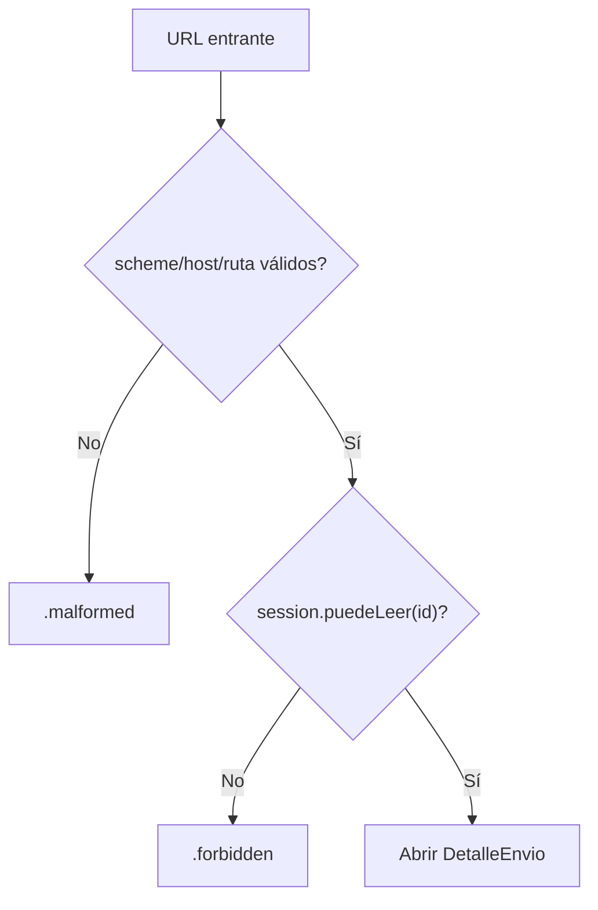
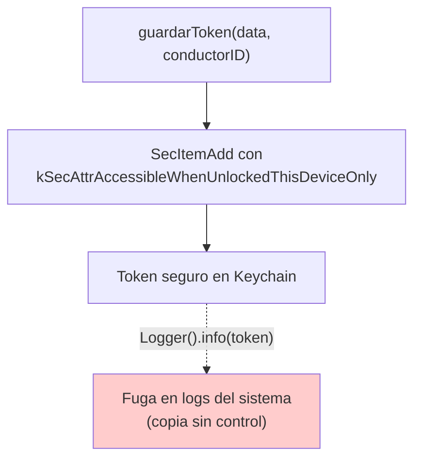
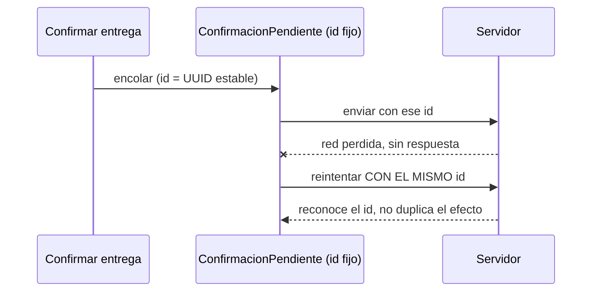
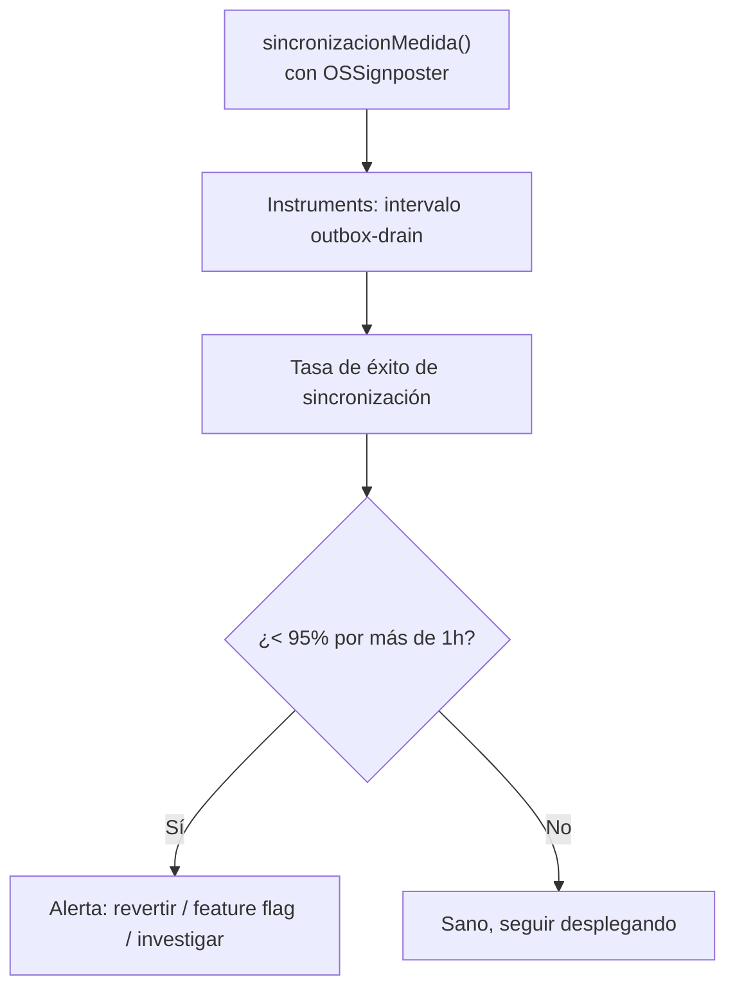

# Módulo 13: iOS en producción — seguridad, sincronización y operación

Una app no termina cuando compila ni cuando pasa revisión. En producción recibe enlaces manipulados, pierde conectividad a mitad de una escritura, conserva versiones antiguas y maneja datos en dispositivos que pueden extraviarse. Este módulo convierte el proyecto final en un sistema operable: explicita amenazas, protege datos, sincroniza sin duplicar efectos y aprende de fallos reales.


## Aprende construyendo

### Tema 1: El sandbox reduce superficie, pero no valida intenciones

#### Paso 1 · Objetivo y preparación
Al finalizar vas a validar un Universal Link entrante de RutaFlow (`https://rutaflow.app/envios/<id>`) verificando esquema, host, estructura y autorización antes de abrir el envío correspondiente. Prerrequisitos: Módulo 5 completo.
#### Paso 2 · Contexto y caso real
Cualquier app puede construir y enviar un link con la forma `https://rutaflow.app/envios/RF-4471`; que el sistema haya verificado que RutaFlow es la app asociada a ese dominio no significa que el conductor actual tenga permiso de leer ESE envío puntual.
#### Paso 3 · Teoría, modelo mental y analogía
El sandbox y la verificación de dominio reducen qué puede llegar a tu app, pero no validan la intención de cada entrada — una frontera con controles: validar estructura, autenticar, autorizar y recién después actuar.
#### Paso 4 · Demostración guiada
```swift
enum LinkError: Error { case malformed, forbidden }

func envioID(from url: URL, session: Session) throws -> EnvioID {
    guard url.scheme == "https",
          url.host == "rutaflow.app",
          url.pathComponents.count == 3,
          url.pathComponents[1] == "envios",
          let id = EnvioID(rawValue: url.pathComponents[2])
    else { throw LinkError.malformed }
    guard session.puedeLeer(id) else { throw LinkError.forbidden }
    return id
}
```
Resultado esperado: `envioID(from:session:)` lanza `.malformed` si la URL no tiene exactamente la forma esperada, y lanza `.forbidden` si la estructura es válida pero la sesión actual no tiene permiso de leer ese envío puntual — nunca abre un envío solo porque la URL "se ve bien".
#### Paso 5 · Práctica guiada
Pista: quitá la línea `guard session.puedeLeer(id) else { throw LinkError.forbidden }` "porque ya validamos la estructura de la URL arriba" — ese es el fallo deliberado: ahora cualquier link con la forma correcta abre el envío correspondiente sin verificar si el conductor actual tiene permiso de verlo, exactamente la amenaza que la verificación de dominio no cubre por sí sola.
#### Paso 6 · Práctica independiente
Corregí el Paso 5 restaurando la verificación de `session.puedeLeer(id)`, y agregá un test que confirme que un link bien formado pero para un envío ajeno lanza `.forbidden`, no que simplemente "no hace nada".
#### Paso 7 · Cierre y evidencia
Entregá la función con las dos validaciones del Paso 4, el acceso indebido provocado en el Paso 5, y el test de autorización del Paso 6; explicá por qué verificar que RutaFlow es la app asociada a `rutaflow.app` no es lo mismo que verificar que el conductor puede leer un envío puntual. Siguiente paso: estudia cómo proteger los datos que esa función termina leyendo. Errores comunes: confundir verificación de dominio con autorización de recurso, validar solo la forma de la URL sin validar permisos, y asumir que un parámetro con formato correcto es automáticamente seguro. Fuente oficial: https://developer.apple.com/documentation/security.
**¿Por qué es importante?** Porque una entrada válida técnicamente (una URL bien formada) puede intentar acceder a un recurso ajeno; validar estructura, autenticar y autorizar son tres pasos distintos.
**Evidencia de aprendizaje:** entrega función con validación completa, acceso indebido provocado y test de autorización.
**Conceptos clave:** sandbox, entitlement, capability, least privilege, runtime permission, URL scheme, Universal Link, associated domain, input validation, authentication, authorization y threat model.

iOS aísla procesos y exige capacidades firmadas, pero una frontera abierta sigue recibiendo datos no confiables. Audita los entitlements generados, activa únicamente capacidades necesarias y separa configuraciones de desarrollo y producción. Pedir acceso a cámara, fotos, ubicación o contactos requiere propósito concreto, texto comprensible y una ruta alternativa cuando el usuario rechaza el permiso.

Los custom URL schemes pueden ser reclamados por otras apps. Para rutas web sensibles prefiere Universal Links con asociación entre dominio y aplicación. Esa verificación prueba qué app debe abrir el dominio; no demuestra que el usuario pueda leer el recurso. Valida esquema, host, ruta, tamaño y forma de los parámetros; después autentica, autoriza y confirma efectos destructivos.

```swift
enum LinkError: Error { case malformed, forbidden }

func taskID(from url: URL, session: Session) throws -> TaskID {
    guard url.scheme == "https",
          url.host == "tasks.example.com",
          url.pathComponents.count == 3,
          url.pathComponents[1] == "tasks",
          let id = TaskID(rawValue: url.pathComponents[2])
    else { throw LinkError.malformed }
    guard session.canRead(id) else { throw LinkError.forbidden }
    return id
}
```

Construye un modelo de amenazas pequeño antes del código: activos, actores, entradas, fronteras y mitigaciones. Incluye notificaciones, widgets, App Intents, extensiones, pasteboard y contenido remoto. Una extensión comparte menos privilegios, pero un App Group crea almacenamiento compartido que debe tratarse como frontera explícita.

**Analogía:** el sandbox es el perímetro de una biblioteca; un Universal Link es una puerta con dirección verificada. Aun así, el bibliotecario debe comprobar qué libro puede consultar cada visitante.

**¿Por qué es importante?** porque una entrada válida técnicamente puede intentar acceder a otra cuenta o ejecutar una acción inesperada.

**Casos de uso reales:** enlace a un identificador ajeno, permiso solicitado al iniciar sin contexto, URL scheme secuestrado, entitlement sobrante y widget que expone información en pantalla bloqueada.

**Diagrama:**

```text
web/notificación/widget -> frontera iOS -> validar estructura
                                      -> autenticar sesión
                                      -> autorizar recurso
                                      -> confirmar efecto
                                      -> dominio
```

**Diagrama: validación en capas de un Universal Link**



En el proyecto integrador RutaFlow, practicá extendiendo `envioID(from:session:)` a tu proyecto propio con un segundo recurso protegido. Límite de la decisión: verificar el dominio asociado (Universal Link) no conviene tratarlo como prueba de autorización — confirma únicamente que RutaFlow es la app correcta para ese dominio, nunca que el usuario actual puede leer ese recurso puntual; confundir ambos pasos es exactamente la amenaza que este tema demuestra.

### Tema 2: Proteger datos es controlar todas sus copias

#### Paso 1 · Objetivo y preparación
Al finalizar vas a guardar el token de sesión de un conductor en Keychain (no en `UserDefaults`), y a confirmar que ese token no queda expuesto en logs. Prerrequisitos: Módulo 5 completo.
#### Paso 2 · Contexto y caso real
Guardar el token de sesión de un conductor en `UserDefaults` "porque es más simple" lo deja en un archivo plist sin cifrado dedicado, legible por cualquiera con acceso al dispositivo o a un backup del mismo.
#### Paso 3 · Teoría, modelo mental y analogía
Keychain protege secretos pequeños con una clase de accesibilidad explícita; redactar logs es tan necesario como elegir bien el almacén — guardar una joya en una caja fuerte no ayuda si su fotografía queda sobre la mesa.
#### Paso 4 · Demostración guiada
```swift
func guardarToken(_ data: Data, conductorID: String) throws {
    let query: [CFString: Any] = [
        kSecClass: kSecClassGenericPassword,
        kSecAttrService: "com.rutaflow.conductor.session",
        kSecAttrAccount: conductorID,
        kSecValueData: data,
        kSecAttrAccessible: kSecAttrAccessibleWhenUnlockedThisDeviceOnly
    ]
    SecItemDelete(query as CFDictionary)
    guard SecItemAdd(query as CFDictionary, nil) == errSecSuccess else {
        throw SesionError.keychainWrite
    }
}
```
Resultado esperado: el token queda en Keychain con `kSecAttrAccessibleWhenUnlockedThisDeviceOnly` (no migra a otro dispositivo vía backup ni es legible con el teléfono bloqueado); buscar el string del token en los logs de la app no encuentra ninguna coincidencia.
#### Paso 5 · Práctica guiada
Pista: agregá `Logger().info("token guardado: \(String(data: data, encoding: .utf8) ?? "")")` justo después de `SecItemAdd` "para depurar" — ese es el fallo deliberado: ahora el token completo del conductor queda en los logs del sistema en texto plano, exactamente la copia secundaria sin control que vuelve inútil haber usado Keychain para el almacén principal.
#### Paso 6 · Práctica independiente
Corregí el Paso 5 quitando el log del token, y agregá en su lugar un log que registre solo que "la sesión se guardó" (sin el valor), más una función `cerrarSesion(conductorID:)` que borre el token de Keychain con `SecItemDelete`.
#### Paso 7 · Cierre y evidencia
Entregá la función de guardado en Keychain del Paso 4, el token filtrado en logs detectado en el Paso 5, y la función de cierre de sesión del Paso 6; explicá por qué un almacén seguro (Keychain) no protege un secreto que se filtra por otra copia (logs, UI, pasteboard). Siguiente paso: estudia cómo sincronizar datos offline sin perder ni duplicar efectos. Errores comunes: guardar tokens en `UserDefaults`, registrar valores sensibles en logs "para depurar", y no borrar credenciales explícitamente al cerrar sesión. Fuente oficial: https://developer.apple.com/documentation/security/keychain-services.
**¿Por qué es importante?** Porque las filtraciones suelen surgir de copias secundarias (logs, backups, pasteboard) y no del almacén principal, aunque ese almacén esté bien elegido.
**Evidencia de aprendizaje:** entrega guardado en Keychain, filtración en logs detectada y función de cierre de sesión.
**Conceptos clave:** clasificación, minimización, Keychain, access class, Data Protection, Secure Enclave, backup, log redaction, screenshot, pasteboard, notification preview, privacy manifest, token y logout.

Clasifica antes de almacenar: público, interno, sensible y credencial. Define retención y borrado. Los tokens no pertenecen a `UserDefaults`; usa Keychain con una accesibilidad coherente con la función. `kSecAttrAccessibleWhenUnlockedThisDeviceOnly` evita migración a otro dispositivo y acceso mientras está bloqueado, aunque puede ser demasiado restrictivo para tareas de fondo. La decisión es de producto y amenaza, no una receta universal.

```swift
func saveToken(_ data: Data, account: String) throws {
    let query: [CFString: Any] = [
        kSecClass: kSecClassGenericPassword,
        kSecAttrService: "com.example.tasks.session",
        kSecAttrAccount: account,
        kSecValueData: data,
        kSecAttrAccessible: kSecAttrAccessibleWhenUnlockedThisDeviceOnly
    ]
    SecItemDelete(query as CFDictionary)
    guard SecItemAdd(query as CFDictionary, nil) == errSecSuccess else {
        throw SessionError.keychainWrite
    }
}
```

Keychain protege secretos pequeños; no es una base de datos. Para archivos y bases locales usa Data Protection apropiada y evita inventar criptografía. Secure Enclave puede proteger operaciones con claves, pero no vuelve seguro un flujo que filtra el resultado en logs o UI. Redacta identificadores, nunca registres tokens y usa `Logger` con privacidad explícita.

Revisa copias involuntarias: backups, cachés, miniaturas, portapapeles, notificaciones, capturas y archivos compartidos. En logout elimina credenciales, memoria derivada y datos por cuenta, cancela tareas y revoca el token en servidor cuando corresponda. Documenta las APIs y SDK que recolectan datos, su finalidad y las declaraciones de privacidad requeridas; la privacidad efectiva debe coincidir con lo comunicado en App Store Connect.

**Analogía:** guardar una joya en una caja fuerte no ayuda si su fotografía, combinación y recibo quedan sobre la mesa.

**¿Por qué es importante?** porque las filtraciones suelen surgir de copias secundarias y telemetría, no del almacén principal.

**Casos de uso reales:** token en preferencias, base incluida en backup, email visible en log, código de acceso en notificación y datos de la cuenta anterior tras cambiar usuario.

**Diagrama:**

```text
dato -> clasificar -> ¿necesario? --no--> no guardar
                    --sí--> Keychain / archivo protegido / base
                              -> retención -> borrado verificable
                              -> logs y UI redactados
```

**Diagrama: Keychain vs la fuga por otra copia**



En el proyecto integrador RutaFlow, `guardarToken` vive en `examples/rutaflow/ios/RutaFlowApp/Servicios/SesionVault.swift`. Límite de la decisión: Keychain no conviene para datos grandes o que necesitan consultas (una lista completa de envíos, por ejemplo) — está pensado para secretos pequeños como tokens; para esos datos usá SwiftData (Módulo 6) con la protección de archivo apropiada, no Keychain como base de datos general.

### Tema 3: Offline-first es un protocolo, no una caché

#### Paso 1 · Objetivo y preparación
Al finalizar vas a construir una outbox persistente para `confirmarEntrega` (Módulo 5), de forma que un conductor sin señal pueda confirmar una entrega y que se sincronice sola cuando vuelva la red, sin duplicarse. Prerrequisitos: Módulo 5 completo.
#### Paso 2 · Contexto y caso real
Si `confirmarEntrega` falla porque el conductor está sin señal en un sótano, simplemente reintentar la misma llamada cuando vuelva la red puede duplicar el efecto si el servidor sí la había recibido pero la respuesta se perdió en el camino.
#### Paso 3 · Teoría, modelo mental y analogía
Offline-first exige una fuente local observable y una outbox persistente donde cada operación tiene una identidad estable (clave de idempotencia) — una oficina postal con comprobantes numerados: puede reenviar el mismo sobre, pero el receptor sabe que no debe cobrar dos veces.
#### Paso 4 · Demostración guiada
```swift
struct ConfirmacionPendiente: Codable, Identifiable {
    enum Estado: String, Codable { case encolada, enviando, fallida }
    let id: UUID              // también es la clave de idempotencia
    let envioID: String
    let pin: String
    var estado: Estado
    var intentos: Int
}

actor MotorSincronizacion {
    func vaciar() async {
        for confirmacion in await almacen.pendientes() {
            guard !Task.isCancelled else { return }
            await enviarYReconciliar(confirmacion)
        }
    }
}
```
Resultado esperado: confirmar una entrega sin red encola una `ConfirmacionPendiente` con un `id` fijo; cuando vuelve la conectividad, `MotorSincronizacion.vaciar()` envía esa misma confirmación identificada por ese `id` — si el servidor ya la había procesado antes de que se perdiera la respuesta, reconoce el mismo `id` y no la aplica dos veces.
#### Paso 5 · Práctica guiada
Pista: en `enviarYReconciliar`, generá un `UUID()` nuevo cada vez que se reintenta la misma `ConfirmacionPendiente`, en vez de reusar su `id` original — ese es el fallo deliberado: ahora cada reintento llega al servidor como una confirmación distinta, y una entrega que en realidad se confirmó una sola vez queda registrada como confirmada dos o tres veces.
#### Paso 6 · Práctica independiente
Corregí el Paso 5 reusando siempre el `id` original de la `ConfirmacionPendiente` en cada reintento, y agregá backoff con jitter entre reintentos fallidos, en vez de reintentar inmediatamente en loop.
#### Paso 7 · Cierre y evidencia
Entregá la outbox del Paso 4, la duplicación provocada en el Paso 5, y el backoff del Paso 6; explicá por qué reintentar una operación de red no es seguro por sí solo sin una clave de idempotencia estable. Siguiente paso: estudia cómo medir y operar esta app en producción. Errores comunes: generar una nueva identidad en cada reintento, reintentar errores de validación o autorización (que nunca van a tener éxito), y no tener backoff entre reintentos. Fuente oficial: https://developer.apple.com/documentation/foundation/url_loading_system.
**¿Por qué es importante?** Porque la conectividad móvil parcial convierte operaciones aparentemente simples en efectos duplicados, perdidos o fuera de orden si no se diseñan con idempotencia explícita.
**Evidencia de aprendizaje:** entrega outbox con idempotencia, duplicación provocada y backoff agregado.
**Conceptos clave:** source of truth, outbox, state machine, idempotency key, retry, exponential backoff, jitter, reachability, optimistic UI, version, conflict, tombstone, background task y cancellation.

Leer una caché sin red es útil, pero offline-first exige definir qué ocurre con escrituras. Mantén una fuente local observable y una outbox persistente. Cada operación tiene identidad estable, payload, estado, intentos y próxima fecha. La interfaz confirma que el cambio está pendiente; un worker lo envía y reconcilia la respuesta.

```swift
struct PendingMutation: Codable, Identifiable {
    enum State: String, Codable { case queued, sending, failed }
    let id: UUID                 // también es clave de idempotencia
    let taskID: UUID
    let baseVersion: Int
    let operation: Operation
    var state: State
    var attempts: Int
    var nextAttemptAt: Date
}

actor SyncEngine {
    func drain() async {
        for mutation in await store.readyMutations() {
            guard !Task.isCancelled else { return }
            await sendAndReconcile(mutation)
        }
    }
}
```

Reintentar no garantiza seguridad: si el servidor aplicó el cambio pero la respuesta se perdió, un POST nuevo puede duplicarlo. Envía la misma clave de idempotencia y exige que el servidor recuerde el resultado. Usa backoff con jitter para fallos transitorios, respeta `Retry-After` y no reintentes validación o autorización. `NWPathMonitor` ayuda a decidir cuándo probar, pero “hay red” no significa “el servicio funciona”.

Los conflictos son requisito de dominio. Con versiones, el servidor puede rechazar una escritura sobre estado viejo. Elige política por campo: server-wins para autoridad, client-wins solo si es aceptable, merge para datos compatibles o resolución humana cuando perder una intención sería grave. Las eliminaciones necesitan tombstones para no resucitar registros. `BGTaskScheduler` ofrece oportunidades limitadas, no ejecución garantizada; el flujo debe progresar también al abrir la app.

**Analogía:** la outbox es una oficina postal con comprobantes numerados. Puede reenviar el mismo sobre, pero el receptor sabe que no debe cobrar dos veces.

**¿Por qué es importante?** porque conectividad móvil parcial convierte operaciones aparentemente simples en efectos duplicados, perdidos o fuera de orden.

**Casos de uso reales:** marcar tarea en metro, editar desde dos dispositivos, respuesta perdida después de crear, logout con cola pendiente y migración mientras existe trabajo offline.

**Diagrama:**

```text
UI -> base local -> outbox(queued) -> API + idempotency-key
 ^                                      |
 |            reconciliar/version <-----+
 +-- estado pendiente/error/conflicto
```

**Diagrama: outbox con idempotencia estable**



En el proyecto integrador RutaFlow, `ConfirmacionPendiente` y `MotorSincronizacion` viven en `examples/rutaflow/ios/RutaFlowApp/Servicios/MotorSincronizacion.swift`.

### Tema 4: Operar significa detectar, limitar y aprender del fallo

#### Paso 1 · Objetivo y preparación
Al finalizar vas a instrumentar `MotorSincronizacion.vaciar()` (Tema 3) con un signpost, y a definir un indicador concreto ("tasa de éxito de sincronización") para decidir si una versión de RutaFlow está sana en producción. Prerrequisitos: Tema 3 de este módulo.
#### Paso 2 · Contexto y caso real
"No se traba en mi teléfono" no es evidencia de que la sincronización funcione para los conductores reales — necesitás una medición agregada, no una impresión personal.
#### Paso 3 · Teoría, modelo mental y analogía
MetricKit entrega diagnósticos agregados e Instruments permite investigar con signposts que delimitan operaciones del dominio sin llenar los logs de datos personales — un centro de control donde las métricas convierten señales en decisiones.
#### Paso 4 · Demostración guiada
```swift
import OSLog

let puntos = OSSignposter(subsystem: "com.rutaflow.conductor", category: "sync")

func sincronizacionMedida() async throws {
    let estado = puntos.beginInterval("outbox-drain")
    defer { puntos.endInterval("outbox-drain", estado) }
    try await motorSincronizacion.vaciar()
}
```
Resultado esperado: grabando una sesión de Instruments con la plantilla "os_signpost" mientras corrés `sincronizacionMedida()`, ves el intervalo "outbox-drain" con su duración real — una medición concreta, no una sensación de "tardó un poco".
#### Paso 5 · Práctica guiada
Pista: definí el indicador "tasa de éxito de sincronización" pero no estableciste ningún umbral que dispare una alerta ("lo vamos a mirar cuando se vea raro") — ese es el fallo deliberado: sin un umbral explícito, nadie sabe cuándo esa métrica indica un problema real versus variación normal, y una regresión real puede pasar inadvertida durante días.
#### Paso 6 · Práctica independiente
Corregí el Paso 5 definiendo un umbral concreto (por ejemplo, si la tasa de éxito cae por debajo del 95% durante más de una hora, es una alerta), y escribí qué acción concreta se toma si se dispara: revertir la versión, activar un feature flag, o investigar con Instruments.
#### Paso 7 · Cierre y evidencia
Entregá el signpost instrumentado del Paso 4, la métrica sin umbral detectada en el Paso 5, y el umbral con acción concreta del Paso 6; explicá por qué una métrica sin un umbral de acción asociado no sirve para operar, solo para "mirar". Siguiente paso: aplicá esta misma disciplina de medición al resto de RutaFlow antes de cada release. Errores comunes: alertas sin ninguna acción definida, confiar en "no crashea en mi teléfono" como evidencia, y no ensayar la migración de datos con una versión anterior antes de un release. Fuente oficial: https://developer.apple.com/documentation/metrickit.
**¿Por qué es importante?** Porque todo software real falla; la calidad profesional depende de detectar, limitar el radio de impacto y aprender del fallo con métricas y umbrales concretos, no con impresiones subjetivas.
**Evidencia de aprendizaje:** entrega signpost instrumentado, métrica sin umbral detectada y umbral con acción definida.
**Conceptos clave:** crash, hang, launch time, memory pressure, MetricKit, Instruments, os_signpost, structured logging, SLI, release train, TestFlight, phased release, migration, feature flag y rollback.

“No crashea en mi teléfono” no es evidencia. Define indicadores ligados a experiencia: sesiones sin crash, tasa de hangs, tiempo de arranque, éxito de sincronización y latencia percibida. MetricKit entrega diagnósticos agregados; Instruments permite investigar CPU, memoria, energía, red y bloqueos; signposts delimitan operaciones del dominio sin llenar logs de datos personales.

```swift
import OSLog

let points = OSSignposter(subsystem: "com.example.tasks", category: "sync")

func measuredSync() async throws {
    let state = points.beginInterval("outbox-drain")
    defer { points.endInterval("outbox-drain", state) }
    try await syncEngine.sync()
}
```

Evita trabajo pesado en `MainActor`; mide antes de optimizar y prueba con dispositivos/perfiles realistas. Un hang puede ser peor que un crash porque el usuario no recibe salida clara. Trata memoria y energía como presupuestos: imágenes dimensionadas, paginación, cancelación de tareas y trabajo de fondo limitado.

Cada release necesita migración ensayada con datos de versiones anteriores, compatibilidad de API y plan de contención. TestFlight valida con grupos pequeños; un despliegue gradual reduce exposición, pero no reemplaza observabilidad. Feature flags deben tener propietario y fecha de retiro. Si la base migra de forma irreversible, “volver al binario anterior” puede no funcionar: diseña migraciones expand/contract o restauración explícita.

**Analogía:** operar una app es pilotar con instrumentos. La vista por la ventana ayuda, pero las alarmas, métricas y listas de comprobación permiten reaccionar antes del accidente.

**¿Por qué es importante?** porque todo software real falla; la calidad profesional depende del radio de impacto, detección y recuperación.

**Casos de uso reales:** hang en arranque, fuga de imágenes, migración que falla con datos antiguos, API incompatible y release que aumenta errores de sincronización.

**Diagrama:**

```text
TestFlight -> cohorte pequeña -> métricas sanas? -> despliegue gradual
                                      no -> contener/flag/corregir
producción -> MetricKit/signposts -> reproducir en Instruments -> aprendizaje
```

**Diagrama: ciclo de medición con umbral y acción**



En el proyecto integrador RutaFlow, `sincronizacionMedida` vive en `examples/rutaflow/ios/RutaFlowApp/Servicios/MotorSincronizacion.swift`.

## Revisión oficial de plataforma — julio de 2026

### Swift 6.2 y actualizaciones SwiftUI de 2026

**Swift 6.2** introduce concurrencia más gradual: aislamiento principal por defecto opcional, ejecución async más intuitiva y `@concurrent` para trabajo realmente concurrente. También mejora Swift Testing, memoria estricta y diagnóstico async. SwiftUI 2026 incorpora `ContentBuilder`, nuevas capacidades de reordenamiento/swipe, caché configurable de AsyncImage y cambios de estado al compilar con toolchains recientes. La versión del compilador y el deployment target son dimensiones distintas.

**Aplicación al proyecto:** activa comprobación de concurrencia en una rama, mueve decodificación CPU-bound a `@concurrent`, agrega una prueba de carrera y documenta disponibilidad/fallback antes de adoptar ContentBuilder o APIs SwiftUI nuevas.


## Laboratorio práctico

Convierte el proyecto del módulo 12 en una entrega preparada para producción.

1. Dibuja activos, entradas y fronteras; registra cinco amenazas con mitigación y prueba.
2. Audita `.entitlements`, permisos y enlaces. Añade pruebas para host, ruta, identificador y autorización.
3. Mueve la sesión a Keychain, redacta logs y documenta qué ocurre en logout, backup y pantalla bloqueada.
4. Implementa una outbox persistente. Simula respuesta perdida, reintento, conflicto de versión, cancelación y cambio de cuenta.
5. Instrumenta sincronización con signposts y perfílala en Instruments. Define cuatro indicadores y umbrales.
6. Prueba una migración con datos de una versión anterior y redacta un release plan con TestFlight, despliegue gradual y contención.

La entrega contiene código, pruebas, capturas del perfil, tabla de amenazas, política de datos y runbook. Una afirmación sin evidencia reproducible cuenta como hipótesis, no como resultado.

<!-- OFFICIAL-TOPIC-ATLAS:START -->
## Atlas completo de temas oficiales

Derivado de la [documentación oficial](https://developer.apple.com/documentation/swiftui), sus referencias, migraciones y guías de operación. Inventariar no equivale a dominar: cada selección se demuestra con código, prueba, medición y explicación. **Cobertura: 56 temas.**

| Área | Temas que deben poder explicarse y aplicarse | Evidencia práctica |
|---|---|---|
| Swift | `value types` · `optionals` · `protocols` · `generics` · `errors` · `collections` · `ARC` · `ownership` · `Swift packages` | app conductor |
| SwiftUI | `View` · `identity` · `state` · `Observation` · `environment` · `layout` · `navigation` · `animations` · `gestures` · `localization` | app conductor |
| Concurrencia | `async/await` · `Task` · `task groups` · `actors` · `MainActor` · `Sendable` · `cancelación` · `AsyncSequence` · `Swift 6 isolation` | app conductor |
| Datos | `URLSession` · `Codable` · `SwiftData y Core Data` · `cache` · `offline-first` · `migrations` · `CloudKit` · `Keychain` · `files` | app conductor |
| Plataforma | `Core Location` · `MapKit` · `background tasks` · `push` · `camera` · `biometrics` · `widgets` · `App Intents` · `UIKit interop` | app conductor |
| Producción | `Swift Testing` · `XCTest` · `UI tests` · `Instruments` · `VoiceOver` · `energy` · `privacy` · `signing` · `TestFlight` · `crashes` | app conductor |

### Método de estudio y proyecto de ampliación

Para cada tema responde qué problema resuelve, cuál es su modelo mental, cómo falla, cómo se verifica y cuándo no conviene. Elige uno por área e intégralos en un proyecto propio de ampliación. Entrega diagrama, ADR, pruebas de éxito y fallo, una medición, una amenaza y el enlace oficial con versión y fecha. Una API preview se aísla en laboratorio y nunca se presenta como base estable.
<!-- OFFICIAL-TOPIC-ATLAS:END -->

