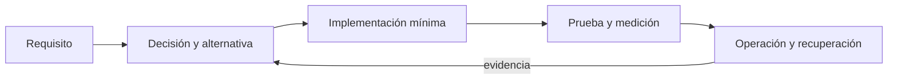

# Módulo 14: SwiftUI Master: pruebas, animación e interoperabilidad


## Aprende construyendo

### Tema 1: XCTest y pruebas asíncronas

#### Paso 1 · Objetivo y preparación
Al finalizar podrás aplicar este tema desde cero. Prerrequisitos: macOS, Xcode y Swift; verifica `xcodebuild -version`.
#### Paso 2 · Contexto y caso real
Una aplicación de entregas necesita un flujo verificable y mantenible.
#### Paso 3 · Teoría, modelo mental y analogía
La analogía es una cadena de producción: cada capa valida una propiedad.
#### Paso 4 · Demostración guiada
Crea Sources/Example.swift y ejecuta el ejemplo desde una carpeta vacía.
```bash
swift package init --type executable
swift test
```
Resultado esperado: pruebas verdes.
#### Paso 5 · Práctica guiada
Pista: cambia una condición para provocar un fallo deliberado y corrígelo.
#### Paso 6 · Práctica independiente
Añade un caso límite y una prueba de regresión.
#### Paso 7 · Cierre y evidencia
Entrega código, salida, fallo y corrección; explica el resultado. Siguiente paso: integra el tema. Errores comunes: probar solo el camino feliz y mezclar capas. Fuente oficial: https://developer.apple.com/documentation/swiftui.
**Conceptos clave:** propósito, modelo de ejecución, configuración, seguridad, coste, pruebas y operación.

XCTest y pruebas asíncronas se estudia como una decisión de ingeniería y no como una colección de comandos. Primero identifica el problema que resuelve y los límites de la plataforma; luego construye el incremento mínimo dentro de un proyecto propio. Registra entradas, salidas, dependencias y condiciones de fallo. Compara al menos una alternativa y conserva la medición que justifica la elección. Si la tecnología es experimental, se aísla del camino estable y se documenta la estrategia de retirada.

En producción debes considerar configuración por ambiente, identidad de máquina y persona, secretos, compatibilidad, telemetría y recuperación. Una demostración exitosa no prueba comportamiento bajo concurrencia, reintentos, pérdida de red o datos inválidos. Por eso el laboratorio introduce un fallo deliberado y exige una prueba de regresión. El resultado debe poder repetirse desde terminal y CI sin pasos secretos del editor.

**Analogía:** es como incorporar una nueva estación a una red logística: no basta con construirla; hay que definir rutas, capacidad, controles, contingencias y cómo sabremos que funciona.

**¿Por qué es importante?** Porque XCTest y pruebas asíncronas aparece cuando el sistema crece y las decisiones dejan de ser locales. Comprender su coste evita adoptar una herramienta por popularidad o descartarla por una primera experiencia incompleta.

**Casos de uso reales:** operación normal, configuración inválida, dependencia lenta, solicitud duplicada, cambio incompatible y recuperación posterior a un despliegue fallido.

**Diagrama:**


### Tema 2: ViewInspector con criterio

#### Paso 1 · Objetivo y preparación
Al finalizar podrás aplicar este tema desde cero. Prerrequisitos: macOS, Xcode y Swift; verifica `xcodebuild -version`.
#### Paso 2 · Contexto y caso real
Una aplicación de entregas necesita un flujo verificable y mantenible.
#### Paso 3 · Teoría, modelo mental y analogía
La analogía es una cadena de producción: cada capa valida una propiedad.
#### Paso 4 · Demostración guiada
Crea Sources/Example.swift y ejecuta el ejemplo desde una carpeta vacía.
```bash
swift package init --type executable
swift test
```
Resultado esperado: pruebas verdes.
#### Paso 5 · Práctica guiada
Pista: cambia una condición para provocar un fallo deliberado y corrígelo.
#### Paso 6 · Práctica independiente
Añade un caso límite y una prueba de regresión.
#### Paso 7 · Cierre y evidencia
Entrega código, salida, fallo y corrección; explica el resultado. Siguiente paso: integra el tema. Errores comunes: probar solo el camino feliz y mezclar capas. Fuente oficial: https://developer.apple.com/documentation/swiftui.
**Conceptos clave:** propósito, modelo de ejecución, configuración, seguridad, coste, pruebas y operación.

ViewInspector con criterio se estudia como una decisión de ingeniería y no como una colección de comandos. Primero identifica el problema que resuelve y los límites de la plataforma; luego construye el incremento mínimo dentro de un proyecto propio. Registra entradas, salidas, dependencias y condiciones de fallo. Compara al menos una alternativa y conserva la medición que justifica la elección. Si la tecnología es experimental, se aísla del camino estable y se documenta la estrategia de retirada.

En producción debes considerar configuración por ambiente, identidad de máquina y persona, secretos, compatibilidad, telemetría y recuperación. Una demostración exitosa no prueba comportamiento bajo concurrencia, reintentos, pérdida de red o datos inválidos. Por eso el laboratorio introduce un fallo deliberado y exige una prueba de regresión. El resultado debe poder repetirse desde terminal y CI sin pasos secretos del editor.

**Analogía:** es como incorporar una nueva estación a una red logística: no basta con construirla; hay que definir rutas, capacidad, controles, contingencias y cómo sabremos que funciona.

**¿Por qué es importante?** Porque ViewInspector con criterio aparece cuando el sistema crece y las decisiones dejan de ser locales. Comprender su coste evita adoptar una herramienta por popularidad o descartarla por una primera experiencia incompleta.

**Casos de uso reales:** operación normal, configuración inválida, dependencia lenta, solicitud duplicada, cambio incompatible y recuperación posterior a un despliegue fallido.

**Diagrama:**


### Tema 3: Combine avanzado

#### Paso 1 · Objetivo y preparación
Al finalizar podrás aplicar este tema desde cero. Prerrequisitos: macOS, Xcode y Swift; verifica `xcodebuild -version`.
#### Paso 2 · Contexto y caso real
Una aplicación de entregas necesita un flujo verificable y mantenible.
#### Paso 3 · Teoría, modelo mental y analogía
La analogía es una cadena de producción: cada capa valida una propiedad.
#### Paso 4 · Demostración guiada
Crea Sources/Example.swift y ejecuta el ejemplo desde una carpeta vacía.
```bash
swift package init --type executable
swift test
```
Resultado esperado: pruebas verdes.
#### Paso 5 · Práctica guiada
Pista: cambia una condición para provocar un fallo deliberado y corrígelo.
#### Paso 6 · Práctica independiente
Añade un caso límite y una prueba de regresión.
#### Paso 7 · Cierre y evidencia
Entrega código, salida, fallo y corrección; explica el resultado. Siguiente paso: integra el tema. Errores comunes: probar solo el camino feliz y mezclar capas. Fuente oficial: https://developer.apple.com/documentation/swiftui.
**Conceptos clave:** propósito, modelo de ejecución, configuración, seguridad, coste, pruebas y operación.

Combine avanzado se estudia como una decisión de ingeniería y no como una colección de comandos. Primero identifica el problema que resuelve y los límites de la plataforma; luego construye el incremento mínimo dentro de un proyecto propio. Registra entradas, salidas, dependencias y condiciones de fallo. Compara al menos una alternativa y conserva la medición que justifica la elección. Si la tecnología es experimental, se aísla del camino estable y se documenta la estrategia de retirada.

En producción debes considerar configuración por ambiente, identidad de máquina y persona, secretos, compatibilidad, telemetría y recuperación. Una demostración exitosa no prueba comportamiento bajo concurrencia, reintentos, pérdida de red o datos inválidos. Por eso el laboratorio introduce un fallo deliberado y exige una prueba de regresión. El resultado debe poder repetirse desde terminal y CI sin pasos secretos del editor.

**Analogía:** es como incorporar una nueva estación a una red logística: no basta con construirla; hay que definir rutas, capacidad, controles, contingencias y cómo sabremos que funciona.

**¿Por qué es importante?** Porque Combine avanzado aparece cuando el sistema crece y las decisiones dejan de ser locales. Comprender su coste evita adoptar una herramienta por popularidad o descartarla por una primera experiencia incompleta.

**Casos de uso reales:** operación normal, configuración inválida, dependencia lenta, solicitud duplicada, cambio incompatible y recuperación posterior a un despliegue fallido.

**Diagrama:**


### Tema 4: Animaciones y matchedGeometryEffect

#### Paso 1 · Objetivo y preparación
Al finalizar podrás aplicar este tema desde cero. Prerrequisitos: macOS, Xcode y Swift; verifica `xcodebuild -version`.
#### Paso 2 · Contexto y caso real
Una aplicación de entregas necesita un flujo verificable y mantenible.
#### Paso 3 · Teoría, modelo mental y analogía
La analogía es una cadena de producción: cada capa valida una propiedad.
#### Paso 4 · Demostración guiada
Crea Sources/Example.swift y ejecuta el ejemplo desde una carpeta vacía.
```bash
swift package init --type executable
swift test
```
Resultado esperado: pruebas verdes.
#### Paso 5 · Práctica guiada
Pista: cambia una condición para provocar un fallo deliberado y corrígelo.
#### Paso 6 · Práctica independiente
Añade un caso límite y una prueba de regresión.
#### Paso 7 · Cierre y evidencia
Entrega código, salida, fallo y corrección; explica el resultado. Siguiente paso: integra el tema. Errores comunes: probar solo el camino feliz y mezclar capas. Fuente oficial: https://developer.apple.com/documentation/swiftui.
**Conceptos clave:** propósito, modelo de ejecución, configuración, seguridad, coste, pruebas y operación.

Animaciones y matchedGeometryEffect se estudia como una decisión de ingeniería y no como una colección de comandos. Primero identifica el problema que resuelve y los límites de la plataforma; luego construye el incremento mínimo dentro de un proyecto propio. Registra entradas, salidas, dependencias y condiciones de fallo. Compara al menos una alternativa y conserva la medición que justifica la elección. Si la tecnología es experimental, se aísla del camino estable y se documenta la estrategia de retirada.

En producción debes considerar configuración por ambiente, identidad de máquina y persona, secretos, compatibilidad, telemetría y recuperación. Una demostración exitosa no prueba comportamiento bajo concurrencia, reintentos, pérdida de red o datos inválidos. Por eso el laboratorio introduce un fallo deliberado y exige una prueba de regresión. El resultado debe poder repetirse desde terminal y CI sin pasos secretos del editor.

**Analogía:** es como incorporar una nueva estación a una red logística: no basta con construirla; hay que definir rutas, capacidad, controles, contingencias y cómo sabremos que funciona.

**¿Por qué es importante?** Porque Animaciones y matchedGeometryEffect aparece cuando el sistema crece y las decisiones dejan de ser locales. Comprender su coste evita adoptar una herramienta por popularidad o descartarla por una primera experiencia incompleta.

**Casos de uso reales:** operación normal, configuración inválida, dependencia lenta, solicitud duplicada, cambio incompatible y recuperación posterior a un despliegue fallido.

**Diagrama:**


### Tema 5: UIViewRepresentable

#### Paso 1 · Objetivo y preparación
Al finalizar podrás aplicar este tema desde cero. Prerrequisitos: macOS, Xcode y Swift; verifica `xcodebuild -version`.
#### Paso 2 · Contexto y caso real
Una aplicación de entregas necesita un flujo verificable y mantenible.
#### Paso 3 · Teoría, modelo mental y analogía
La analogía es una cadena de producción: cada capa valida una propiedad.
#### Paso 4 · Demostración guiada
Crea Sources/Example.swift y ejecuta el ejemplo desde una carpeta vacía.
```bash
swift package init --type executable
swift test
```
Resultado esperado: pruebas verdes.
#### Paso 5 · Práctica guiada
Pista: cambia una condición para provocar un fallo deliberado y corrígelo.
#### Paso 6 · Práctica independiente
Añade un caso límite y una prueba de regresión.
#### Paso 7 · Cierre y evidencia
Entrega código, salida, fallo y corrección; explica el resultado. Siguiente paso: integra el tema. Errores comunes: probar solo el camino feliz y mezclar capas. Fuente oficial: https://developer.apple.com/documentation/swiftui.
**Conceptos clave:** propósito, modelo de ejecución, configuración, seguridad, coste, pruebas y operación.

UIViewRepresentable se estudia como una decisión de ingeniería y no como una colección de comandos. Primero identifica el problema que resuelve y los límites de la plataforma; luego construye el incremento mínimo dentro de un proyecto propio. Registra entradas, salidas, dependencias y condiciones de fallo. Compara al menos una alternativa y conserva la medición que justifica la elección. Si la tecnología es experimental, se aísla del camino estable y se documenta la estrategia de retirada.

En producción debes considerar configuración por ambiente, identidad de máquina y persona, secretos, compatibilidad, telemetría y recuperación. Una demostración exitosa no prueba comportamiento bajo concurrencia, reintentos, pérdida de red o datos inválidos. Por eso el laboratorio introduce un fallo deliberado y exige una prueba de regresión. El resultado debe poder repetirse desde terminal y CI sin pasos secretos del editor.

**Analogía:** es como incorporar una nueva estación a una red logística: no basta con construirla; hay que definir rutas, capacidad, controles, contingencias y cómo sabremos que funciona.

**¿Por qué es importante?** Porque UIViewRepresentable aparece cuando el sistema crece y las decisiones dejan de ser locales. Comprender su coste evita adoptar una herramienta por popularidad o descartarla por una primera experiencia incompleta.

**Casos de uso reales:** operación normal, configuración inválida, dependencia lenta, solicitud duplicada, cambio incompatible y recuperación posterior a un despliegue fallido.

**Diagrama:**


### Tema 6: UIViewControllerRepresentable y Coordinator

#### Paso 1 · Objetivo y preparación
Al finalizar podrás aplicar este tema desde cero. Prerrequisitos: macOS, Xcode y Swift; verifica `xcodebuild -version`.
#### Paso 2 · Contexto y caso real
Una aplicación de entregas necesita un flujo verificable y mantenible.
#### Paso 3 · Teoría, modelo mental y analogía
La analogía es una cadena de producción: cada capa valida una propiedad.
#### Paso 4 · Demostración guiada
Crea Sources/Example.swift y ejecuta el ejemplo desde una carpeta vacía.
```bash
swift package init --type executable
swift test
```
Resultado esperado: pruebas verdes.
#### Paso 5 · Práctica guiada
Pista: cambia una condición para provocar un fallo deliberado y corrígelo.
#### Paso 6 · Práctica independiente
Añade un caso límite y una prueba de regresión.
#### Paso 7 · Cierre y evidencia
Entrega código, salida, fallo y corrección; explica el resultado. Siguiente paso: integra el tema. Errores comunes: probar solo el camino feliz y mezclar capas. Fuente oficial: https://developer.apple.com/documentation/swiftui.
**Conceptos clave:** propósito, modelo de ejecución, configuración, seguridad, coste, pruebas y operación.

UIViewControllerRepresentable y Coordinator se estudia como una decisión de ingeniería y no como una colección de comandos. Primero identifica el problema que resuelve y los límites de la plataforma; luego construye el incremento mínimo dentro de un proyecto propio. Registra entradas, salidas, dependencias y condiciones de fallo. Compara al menos una alternativa y conserva la medición que justifica la elección. Si la tecnología es experimental, se aísla del camino estable y se documenta la estrategia de retirada.

En producción debes considerar configuración por ambiente, identidad de máquina y persona, secretos, compatibilidad, telemetría y recuperación. Una demostración exitosa no prueba comportamiento bajo concurrencia, reintentos, pérdida de red o datos inválidos. Por eso el laboratorio introduce un fallo deliberado y exige una prueba de regresión. El resultado debe poder repetirse desde terminal y CI sin pasos secretos del editor.

**Analogía:** es como incorporar una nueva estación a una red logística: no basta con construirla; hay que definir rutas, capacidad, controles, contingencias y cómo sabremos que funciona.

**¿Por qué es importante?** Porque UIViewControllerRepresentable y Coordinator aparece cuando el sistema crece y las decisiones dejan de ser locales. Comprender su coste evita adoptar una herramienta por popularidad o descartarla por una primera experiencia incompleta.

**Casos de uso reales:** operación normal, configuración inválida, dependencia lenta, solicitud duplicada, cambio incompatible y recuperación posterior a un despliegue fallido.

**Diagrama:**


## Trazabilidad de la auditoría original

- **Pruebas en SwiftUI**: cubierto mediante fundamento, laboratorio y evidencia del capítulo.
- **Animaciones en SwiftUI**: cubierto mediante fundamento, laboratorio y evidencia del capítulo.
- **Interoperabilidad con UIKit**: cubierto mediante fundamento, laboratorio y evidencia del capítulo.
- **Combine Avanzado**: cubierto mediante fundamento, laboratorio y evidencia del capítulo.
